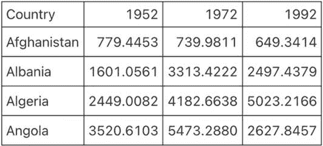
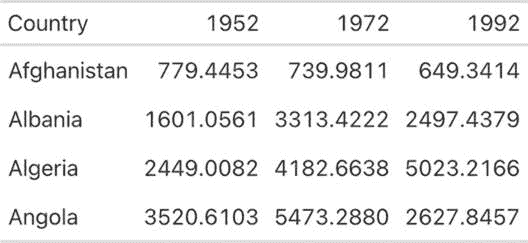
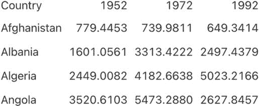
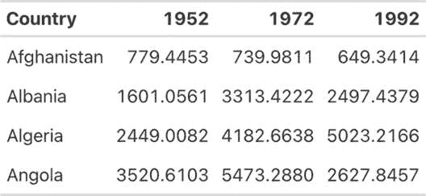
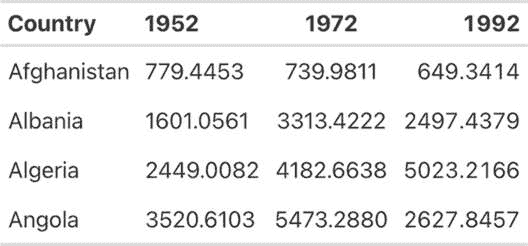
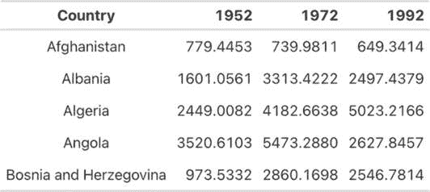
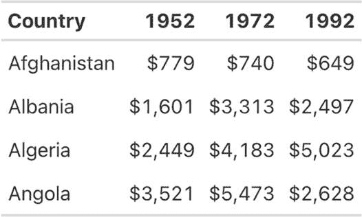
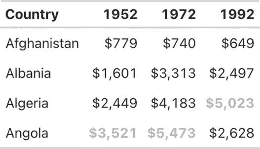
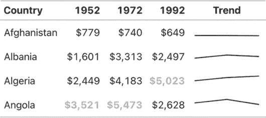
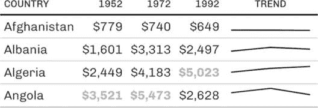

## 5 设计有效的表格


在他的《数据可视化基础》一书中，Claus Wilke 写道，表格是“可视化数据的重要工具”。这一说法可能看起来有些奇怪。表格通常被认为是数据可视化（如图形）的对立面：一个用来存放数字的地方，供那些愿意阅读的人（少数极客）使用。但 Wilke 有不同的看法。

表格不必也不应该是没有设计的“数据堆砌”。尽管图表中的条形、线条和点是可视化，表格中的数字也是可视化，我们应该关注它们的外观。例如，看看可靠新闻来源制作的表格；这些可不是简单的数据堆砌。媒体组织，作为有效沟通的职责所在，非常注重表格设计。但在其他地方，由于表格看起来似乎很简单，Wilke 写道，“[表格]可能不会总是得到它们所需要的关注。”

许多人使用 Microsoft Word 制作表格，这种策略可能会带来潜在的陷阱。Wilke 发现，他的 Word 版本中包括了 105 种内置表格样式。在这些样式中，大约 80％，包括默认样式，违反了表格设计的一些关键原则。好消息是，R 是制作高质量表格的好工具。它有许多用于此目的的包，并且在这些包中，有几个函数旨在确保你的表格遵循重要的设计原则。

此外，如果你在 R Markdown 中编写报告（你将在第六章学习到），你可以包含一些代码，这些代码会在导出文档时生成表格。通过使用一个工具来创建表格、文本和其他可视化内容，你就不必复制粘贴数据，从而降低了人为错误的风险。

本章探讨了表格设计原则，并向你展示如何使用 R 的 gt 包（这是最受欢迎的表格制作包之一，默认使用良好的设计原则）将这些原则应用到你的表格中。这些原则和本章中的代码改编自 Tom Mock 的博客文章《R 中更好表格的 10+准则》。Mock 在 Posit 公司工作，Posit 是 RStudio 的开发公司，他已经成为 R 表格的行家。本章通过 Mock 的代码示例，展示了如何通过小的调整让表格设计产生大的影响。

### 创建数据框

首先，你将创建一个数据框，可以在本章中使用它来制作表格。首先，加载你需要的包（用于一般数据处理的 tidyverse、用于数据的 gapminder、用于制作表格的 gt 以及用于表格格式化的 gtExtras）：

```
**library(tidyverse)**
**library(gapminder)**
**library(gt)**
**library(gtExtras)** 
```

正如你在第二章中看到的，gapminder 包提供了国家级的人口统计数据。为了创建你表格的数据框，你将只使用几个国家（按字母顺序排列的前四个：阿富汗、阿尔巴尼亚、阿尔及利亚和安哥拉）和三个年份（1952 年、1972 年和 1992 年）。gapminder 数据包含许多年份，但这些年份足以演示表格制作的基本原则。以下代码创建了一个名为 gdp 的数据框：

```
gdp <- gapminder %>%
  filter(country %in% c("Afghanistan", "Albania", "Algeria", "Angola")) %>%
  select(country, year, gdpPercap) %>%
  mutate(country = as.character(country)) %>%
  pivot_wider(
    id_cols = country,
    names_from = year,
 values_from = gdpPercap
  ) %>%
  select(country, `1952`, `1972`, `1992`) %>%
  rename(Country = country) 
```

下面是 gdp 的样式：

```
#> # A tibble: 4 × 4
#>   Country     `1952` `1972` `1992`
#>   <chr>        <dbl>  <dbl>  <dbl>
#> 1 Afghanistan   779\.   740\.   649.
#> 2 Albania      1601\.  3313\.  2497.
#> 3 Algeria      2449\.  4183\.  5023.
#> 4 Angola       3521\.  5473\.  2628. 
```

现在你有了一些数据，可以用它来制作表格。

### 表格设计原则

不出所料，良好的表格设计原则与数据可视化的原则有许多相似之处。本节介绍了其中六个最重要的原则。

#### 减少杂乱

你可以通过去除不必要的元素来减少表格中的杂乱。例如，一个常见的表格杂乱来源是网格线，如图 5-1 所示。



图 5-1：一个到处都有网格线的表格可能会让人分心。

在表格中的每个单元格周围加上网格线是没有必要的，这会分散你清晰传达信息的目标。一个只有最少甚至没有网格线的表格（如图 5-2 所示）是一种更有效的沟通工具。


图 5-2：一个只有水平网格线的表格更为有效。

我提到过，gt 默认使用良好的表格设计原则，这是一个很好的例子。第二个表格，只有极少的网格线，只需要两行代码——将 gdp 数据传入 gt() 函数，就能创建一个表格：

```
gdp %>%
  gt() 
```

要向示例的每个部分添加网格线，你需要添加更多的代码。这里，gt() 函数后的代码将添加网格线：

```
gdp %>%
  gt() %>%
  tab_style(
    style = cell_borders(
      side = "all",
      color = "black",
      weight = px(1),
      style = "solid"
    ),
    locations = list(
      cells_body(
        everything()
      ),
      cells_column_labels(
        everything()
      )
    )
  ) %>%
  opt_table_lines(extent = "none") 
```

由于我不推荐采用这种方法，我将不会向你演示这段代码。不过，如果你想去除额外的网格线，可以这样做：

```
gdp %>%
  gt() %>%
  tab_style(
 style = cell_borders(color = "transparent"),
    locations = cells_body()
  ) 
```

tab_style() 函数采用两步法。首先，它识别需要修改的样式（在此案例中是边框），然后指定应用这些修改的位置。这里，tab_style() 告诉 R 使用 cell_borders() 函数修改边框，将边框设为透明，并将此转换应用于 cells_body() 位置（与 cells_column_labels() 相对，仅作用于第一行）。

> 注意

*要查看所有选项，请查看 gt 包文档网站上的所谓助手函数列表：[`gt.rstudio.com/reference/index.xhtml#helper-functions`](https://gt.rstudio.com/reference/index.xhtml#helper-functions)*。

运行这段代码会输出一个没有网格线的表格（如图 5-3 所示）。



图 5-3：一个干净整洁的表格，只有在标题行和底部才有网格线

将此表格保存为名为 table_no_gridlines 的对象，以便后续可以继续添加内容。

#### 区分表头和表体

尽管减少杂乱是一个重要目标，但过度减少可能会产生负面影响。例如，可以参考图 5-4。



图 5-4：去除所有网格线的模糊表格

通过加粗表头行，您可以更好地使其突出：

```
table_no_gridlines %>%
  tab_style(
    style = cell_text(weight = "bold"),
    locations = cells_column_labels()
  ) 
```

从 table_no_gridlines 对象开始，这段代码通过 tab_style() 函数分两步应用格式化。首先，它指定使用 cell_text() 函数将文本样式设置为粗体。其次，它使用 cells_column_labels() 函数将此转换应用于表头行。图 5-5 显示了表格在表头行加粗后的样子。



图 5-5：通过使用粗体使表头行更加明显

将此表格保存为 table_bold_header，以便进行进一步的格式化。

#### 适当对齐

高质量表格设计的第三个原则是适当的对齐。具体来说，表格中的数字应右对齐。Tom Mock 解释道，左对齐或居中对齐数字“会影响清晰比较数字和小数位数的能力。右对齐可以使您对齐小数位和数字，便于解析。”

让我们看看这个原则的实际应用。在图 5-6 中，1952 年列是左对齐，1972 年列是居中对齐，1992 年列是右对齐。



图 5-6：比较左对齐（1952 年）、居中对齐（1972 年）和右对齐（1992 年）的数值数据

您可以看到，比较 1992 年列中的值比其他两列要容易得多。在 1952 年和 1972 年列中，比较数值是有挑战性的，因为在同一位置（例如，十位数）的数字没有垂直对齐。然而，在 1992 年列中，阿富汗（4）和阿尔巴尼亚（9）以及所有其他国家的十位数对齐，使得浏览表格变得更容易。

与其他表格一样，实际上您需要覆盖默认设置，才能使 gt 包使列错位，正如下面的代码所示：

```
table_bold_header %>%
  cols_align(
    align = "left",
    columns = 2
  ) %>%
  cols_align(
    align = "center",
    columns = 3
  ) %>%
  cols_align(
    align = "right",
    columns = 4
  ) 
```

默认情况下，gt 会将数字值右对齐。不要更改任何设置，您就会得到正确的结果。

数值列最好使用右对齐，而文本列则应使用左对齐。正如 Jon Schwabish 在《效益-成本分析期刊》中的文章《更好的表格设计十大准则》里指出的，左对齐的长文本单元格更易阅读。为了看到左对齐的好处，您可以在表格中添加一个名称较长的国家。我添加了波斯尼亚和黑塞哥维那，并将其保存为名为 gdp_with_bosnia 的数据框。您会看到，我几乎使用了之前创建 gdp 数据框时相同的代码：

```
gdp_with_bosnia <- gapminder %>%
  filter(country %in% c("Afghanistan", "Albania", "Algeria", "Angola",
"Bosnia and Herzegovina")) %>%
  select(country, year, gdpPercap) %>%
  mutate(country = as.character(country)) %>%
  pivot_wider(
    id_cols = country,
    names_from = year,
    values_from = gdpPercap
  ) %>%
  select(country, `1952`, `1972`, `1992`) %>%
  rename(Country = country) 
```

下面是`gdp_with_bosnia`数据框的样子：

```
#> # A tibble: 5 × 4
#>   Country                `1952` `1972` `1992`
#>   <chr>                   <dbl>  <dbl>  <dbl>
#> 1 Afghanistan              779\.   740\.   649.
#> 2 Albania                 1601\.  3313\.  2497.
#> 3 Algeria                 2449\.  4183\.  5023.
#> 4 Angola                  3521\.  5473\.  2628.
#> 5 Bosnia and Herzegovina   974\.  2860\.  2547. 
```

现在取`gdp_with_bosnia`数据框，创建一个国家列居中对齐的表格。在图 5-7 中的表格里，国家名称很难扫描，而居中的列看起来有些奇怪。



图 5-7：居中文本可能很难阅读，尤其是当它包含较长的值时。

这是另一个需要改变`gt`默认设置以调整内容的例子。除了默认右对齐数值列外，`gt`还会左对齐字符列。只要你不做任何修改，你就会得到你想要的对齐方式。

如果你确实希望覆盖默认的对齐方式，可以使用`cols_align()`函数。例如，下面是如何让国家名称居中对齐的表格：

```
gdp_with_bosnia %>%
  gt() %>%
  tab_style(
    style = cell_borders(color = "transparent"),
    locations = cells_body()
  ) %>%
  tab_style(
    style = cell_text(weight = "bold"),
    locations = cells_column_labels()
  ) %>%
  cols_align(
    columns = "Country",
    align = "center"
  ) 
```

`columns`参数告诉`gt`对哪些列进行对齐，`align`参数则选择对齐方式（左对齐、右对齐或居中）。

#### 使用正确的精度

在你目前制作的所有表格中，你都直接使用了原始数据。例如，数字列中的数据扩展到四个小数位——这几乎肯定是过多的。更多的小数位会让表格变得更加难以阅读，所以你应该始终在 Jon Schwabish 所描述的“必要精度与干净、简洁表格”之间找到平衡。

这里有一个好的经验法则：如果增加更多的小数位会改变某个操作，就保留它们；否则，去掉它们。根据我的经验，人们往往会保留过多的小数位，过于重视高精度（并且在这个过程中降低了表格的可读性）。

在 GDP 表格中，你可以使用`fmt_currency()`函数来格式化数值：

```
table_bold_header %>%
  fmt_currency(
    columns = c(`1952`, `1972`, `1992`),
    decimals = 0
  ) 
```

`gt`包有一系列用于格式化表格中值的函数，这些函数都以`fmt_`开头。此代码将`fmt_currency()`应用于 1952 年、1972 年和 1992 年的列，然后使用`decimals`参数告诉`fmt_currency()`以零小数位格式化这些值。毕竟，GDP 为$779.4453 和$779 之间的差异不太可能导致不同的决策。

这会将值格式化为美元。`fmt_currency()`函数会自动添加千位分隔符，使得数值更加易读（图 5-8）。



图 5-8：将美元金额四舍五入为整数并添加美元符号，可以简化数据。

将你的表格保存为`table_whole_numbers`以便重用。

#### 有意使用颜色

到目前为止，你的表格没有使用任何颜色，现在你将添加一些颜色来突出显示异常值。这样做可以帮助表格更有效地传达信息，特别是对于那些希望快速浏览表格的读者。为了使 1952 年最高的值显示为不同的颜色，你可以再次使用`tab_style()`函数：

```
table_whole_numbers %>%
  tab_style(
    style = cell_text(
      color = "orange",
      weight = "bold"
    ),
    locations = cells_body(
      columns = `1952`,
      rows = `1952` == max(`1952`)
    )
  ) 
```

这个函数使用`cell_text()`将文本颜色改为橙色，并加粗。在`cells_body()`函数内，`locations()`函数指定了哪些列和行会应用这些更改。`columns`参数简单地设置为正在更改值的年份，但设置`rows`则需要更复杂的公式。代码`rows = 1952 == max(1952)`将文本转化应用于该年最大值的行。

对 1972 年和 1992 年列重复这一代码，生成的结果如图 5-9 所示（该图使用灰度表示橙色值，以便打印）。



图 5-9：使用颜色突出显示重要值，比如每年最大值

`gt`包使得为异常值添加颜色变得简单明了。

#### 在适当的地方添加数据可视化

为了突出显示异常值，添加颜色是引导读者注意力的一种方法。另一种方法是将图表嵌入到表格中。Tom Mock 为 gt 开发了一个名为 gtExtras 的插件包，使得这一切变得可能。例如，假设你想展示各国 GDP 随时间变化的情况。为此，你可以添加一个新列，通过*sparkline*（本质上是一个简单的折线图）来可视化这一趋势：

```
gdp_with_trend <- gdp %>%
  group_by(Country) %>%
  mutate(Trend = list(c(`1952`, `1972`, `1992`))) %>%
  ungroup() 
```

`gt_plt_sparkline()`函数要求你提供所需的值，并将这些值放在单独的一列中以生成 sparkline。为此，代码使用`group_by()`和`mutate()`创建一个名为 Trend 的变量，用于存储每个国家的值列表。例如，对于阿富汗，Trend 将包含 779.4453145、739.9811058 和 649.3413952。将这些数据保存为名为 gdp_with_trend 的对象。

现在，你可以像之前一样创建表格，但在代码的末尾添加`gt_plt_sparkline()`函数。在这个函数内，指定使用哪一列来创建 sparkline（趋势图），如下所示：

```
gdp_with_trend %>%
  gt() %>%
  tab_style(
    style = cell_borders(color = "transparent"),
    locations = cells_body()
  ) %>%
  tab_style(
    style = cell_text(weight = "bold"),
    locations = cells_column_labels()
  ) %>%
  fmt_currency(
    columns = c(`1952`, `1972`, `1992`),
    decimals = 0
  ) %>%
  tab_style(
    style = cell_text(
      color = "orange",
      weight = "bold"
    ),
    locations = cells_body(
      columns = `1952`,
      rows = `1952` == max(`1952`)
    )
  ) %>%
  tab_style(
    style = cell_text(
      color = "orange",
      weight = "bold"
    ),
 locations = cells_body(
      columns = `1972`,
      rows = `1972` == max(`1972`)
    )
  ) %>%
  tab_style(
    style = cell_text(
      color = "orange",
      weight = "bold"
    ),
    locations = cells_body(
      columns = `1992`,
      rows = `1992` == max(`1992`)
    )
  ) %>%
  gt_plt_sparkline(
    column = Trend,
    label = FALSE,
    palette = c("black", "transparent", "transparent", "transparent", "transparent")
  ) 
```

设置`label = FALSE`会移除`gt_plt_sparkline()`默认添加的文本标签，然后添加一个调色板参数，使得 sparkline 为黑色，其他元素则保持透明。（默认情况下，该函数会使 sparkline 的不同部分采用不同颜色。）图 5-10 中的简化版 sparkline 使得读者可以一目了然地看到每个国家的趋势。



图 5-10：带有 sparklines 的表格能够展示数据随时间变化的情况。

`gtExtras`包不仅仅可以创建 sparklines。它的主题函数集让你能够将表格设计成类似于 FiveThirtyEight、《纽约时报》、《卫报》和其他新闻媒体发布的风格。

举个例子，试着移除你目前应用的所有格式，而改为使用`gt_theme_538()`函数来为表格设置样式。然后，浏览一下 FiveThirtyEight 网站上的表格。你应该能看到与图 5-11 中的表格相似之处。



图 5-11：按照 FiveThirtyEight 风格重新制作的表格

像 gtExtras 这样的附加包在表格制作中很常见。例如，如果你使用 reactable 包来制作互动表格，你还可以使用 reactablefmtr 来添加互动火花图、主题等。你将在第九章中学习更多关于制作互动表格的内容。

### 总结

本章中你对表格所做的许多调整都非常微妙。像是去除多余的网格线、加粗标题文字、将数字值右对齐以及调整精度水平等更改，往往会被忽视，但如果跳过这些步骤，表格的效果会大打折扣。最终产品虽然不花哨，但能够清晰地传达信息。

你使用了 gt 包来制作高质量的表格，正如你多次看到的，这个包自带了一些优秀的默认设置。通常你不需要在代码中做太多改动就能制作有效的表格。但无论使用哪个包，重要的是要把表格当作数据可视化的一部分，给予同样的重视。

在第六章中，你将学习如何使用 R Markdown 创建报告，它可以将表格直接集成到最终文档中。用几行代码就能生成出版级别的表格，岂不是更好？

### 额外资源

+   Thomas Mock, “R 中更好的表格的 10+条准则，”*The MockUp*，2020 年 9 月 4 日，*[`themockup.blog/posts/2020-09-04-10-table-rules-in-r/`](https://themockup.blog/posts/2020-09-04-10-table-rules-in-r/)*。

+   Albert Rapp, “在 R 中使用{gt}创建美丽的表格，”2022 年 11 月 27 日，*[`gt.albert-rapp.de`](https://gt.albert-rapp.de)*。

+   Jon Schwabish, “十条更好的表格准则，”*《成本效益分析杂志》* 11 卷，第 2 期（2020），*[`doi.org/10.1017/bca.2020.11`](https://doi.org/10.1017/bca.2020.11)*。
