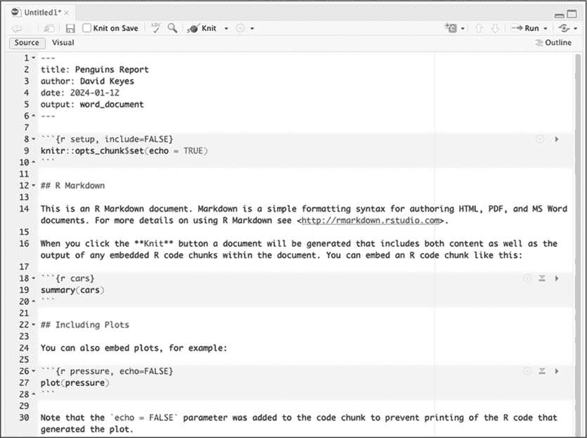
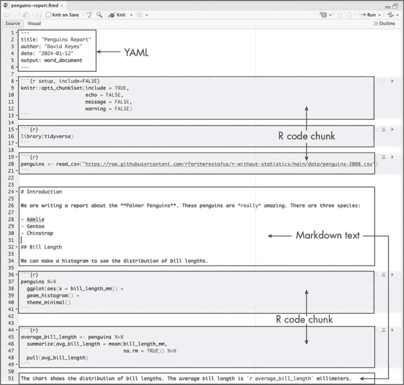
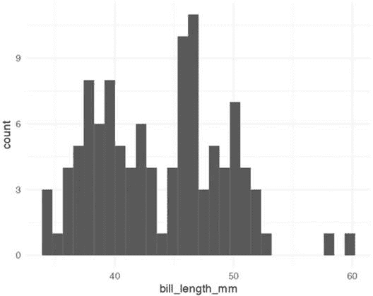
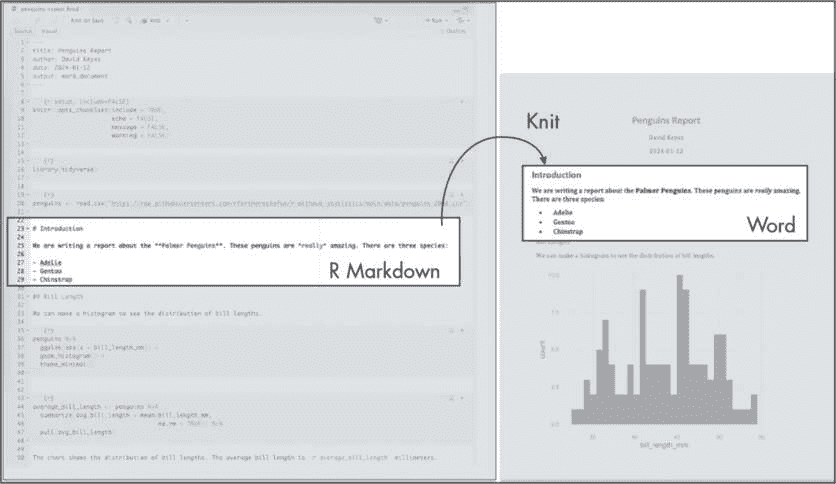
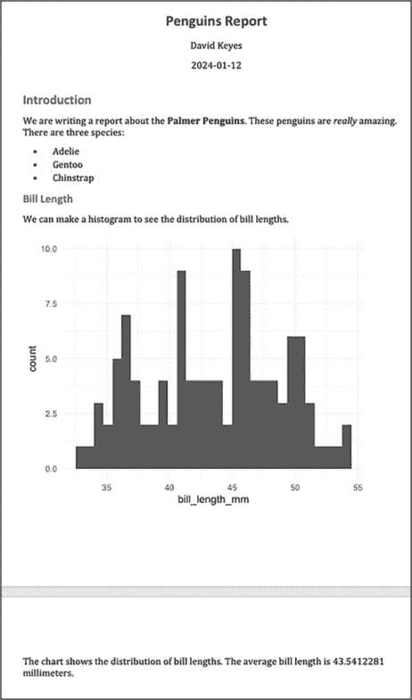
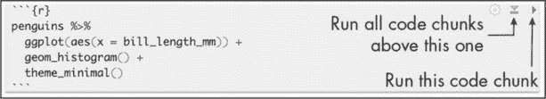

<hgroup>

## 6 R MARKDOWN 报告

</hgroup>


假设你已经收集了有关客户对新产品满意度的调查数据。现在你准备好分析数据并编写结果报告了。首先，你从 Google Sheets 下载数据，并将其导入到像 SPSS 这样的统计分析工具中。接着，使用 SPSS 清理和分析数据，将数据摘要导出为 Excel 表格，然后用 Excel 制作一些图表。最后，你用 Word 撰写报告，同时将 Excel 中的图表粘贴进报告里。

听起来很熟悉吗？如果是的话，你并不孤单。许多人使用这种工作流程进行数据分析。但当下个月新的调查数据进来，你必须重新做报告时会怎样呢？没错，又得从第一步做到第五步。这种多工具的流程可能适用于一次性的项目，但说实话，很少有项目真的是一次性的。例如，你可能发现自己犯了个错误，或者意识到原来的分析里漏掉了一些调查数据。

R Markdown 将数据分析、数据可视化以及其他 R 代码与叙述文本结合起来，创建一个可以导出为多种格式的文档，包括 Word、PDF 和 HTML，以便与非 R 用户分享。当你使用单一工具时，工作流程变得更加高效。如果你需要在二月重新创建一份一月的客户满意度报告，你只需重新运行代码，就能生成一份包含最新数据的新文档；而且若要修正分析中的错误，只需调整代码即可。

随时轻松更新报告的能力被称为*可重复性*，这是 R Markdown 价值的核心。本章将拆解 R Markdown 文档的各个部分，并描述一些潜在的陷阱和最佳实践。你将学习如何处理 YAML 元数据、R 代码块和 Markdown 格式的文本；创建内联 R 代码，动态改变报告中的文本；以及以不同方式运行文档的代码。

### 创建 R Markdown 文档

要在 RStudio 中创建 R Markdown 文档，点击**文件****新建文件****R Markdown**。选择标题、作者和日期，并设置默认的输出格式（HTML、PDF 或 Word）。这些值稍后可以更改。点击**确定**，RStudio 将创建一个 R Markdown 文档，其中包含一些占位符内容，如 图 6-1 所示。



图 6-1：新建 R Markdown 文档中的占位符内容

RStudio 顶部的 Knit 菜单将 R Markdown 文档转换为你在创建时选择的格式。在这个例子中，输出格式设置为 Word，因此当你进行 Knit 操作时，RStudio 会创建一个 Word 文档。

删除文档中的占位符内容。在下一部分，你将用你自己的内容替换它。

### 文档结构

为了探索 R Markdown 文档的结构，你将使用 第三章 中介绍的 palmerpenguins 包的数据，创建一个关于企鹅的报告。我已经将数据按年份分开，你将只使用 2007 年的数据。图 6-2 显示了完整的 R Markdown 文档，文档中的每个部分都被框住了。



图 6-2: R Markdown 文档的组成部分

所有 R Markdown 文档有三个主要部分：一个 YAML 部分、多个 R 代码块和多个 Markdown 文本部分。

#### YAML 元数据

YAML 部分是 R Markdown 文档的开头。YAML 的名字来自于递归首字母缩写 *YAML ain’t markup language*，它的意义对我们来说并不重要。三个破折号表示它的开始和结束，里面的文本包含关于 R Markdown 文档的元数据：

```
---
title: Penguins Report
author: David Keyes
date: 2024-01-12
output: word_document
--- 
```

如你所见，YAML 提供了标题、作者、日期和输出格式。YAML 的所有元素都是以 key: value 语法给出的，其中每个 key 是元数据的一种标签（例如标题），后面跟着值。

#### R 代码块

R Markdown 文档与你可能熟悉的 R 脚本文件（*.R* 后缀的文件）结构不同。R 脚本文件会将所有内容视为代码，除非你通过在前面加上井号 (#) 来注释掉一行。在以下列表中，第一行是注释，第二行是代码：

```
# Import our data
data <- read_csv("data.csv") 
```

在 R Markdown 中，情况正好相反。YAML 之后的所有内容默认被视为文本，除非你通过创建 *代码块* 指定为代码。这些代码块以三个反引号开始（```), followed by the lowercase letter r surrounded by curly brackets ({}). Another three backticks indicate the end of the code chunk:

```

```{r}
library(tidyverse)
```

```

If you’re working in RStudio, code chunks should have a light gray background.

R Markdown treats anything in the code chunk as R code when you knit. For example, this code chunk will produce a histogram in the final Word document:

```

```{r}
penguins %>%
  ggplot(aes(x = bill_length_mm)) +
  geom_histogram() +
  theme_minimal()
```

```

Figure 6-3 shows the resulting histogram.



Figure 6-3: A simple histogram generated by an R Markdown code chunk

A code chunk at the top of each R Markdown document, known as the *setup code chunk*, gives instructions for what should happen when knitting a document. It contains the following options:

echo Do you want to show the code itself in the knitted document?

include Do you want to show the output of the code chunk?

message Do you want to include any messages that code might generate? For example, this message shows up when you run library(tidyverse):

```

—— 附加核心 tidyverse 包 ————— tidyverse 1.x.x——

 dplyr     1.x.x       readr    2.x.x

 forcats   0.x.x       stringr  1.x.x

 ggplot2   3.x.x       tibble   3.x.x

 lubridate 1.x.x       tidyr    1.x.x

 purrr     1.x.x

—— 冲突————— tidyverse_conflicts() ——

ｘ dplyr::filter() 遮蔽了 stats::filter()

ｘ dplyr::lag()    遮蔽了 stats::lag()

```

warning Do you want to include any messages that the code might generate? For example, here’s the message you get when creating a histogram using geom_histogram():

```

`stat_bin()` 使用 `bins = 30`。使用 `binwidth` 选择更好的值。

```

> NOTE

*To see the full list of code chunk options, visit* [`yihui.org/knitr/options/`](https://yihui.org/knitr/options/)*.*

In cases where you’re using R Markdown to generate a report for a non-R user, you likely would want to hide the code, messages, and warnings but show the output (which would include any visualizations you generate). The following setup code chunk does this:

```

```{r setup, include = FALSE}
knitr::opts_chunk$set(include = TRUE,
                      echo = FALSE,
                      message = FALSE,
                      warning = FALSE)
```

```

The include = FALSE option on the first line applies to the setup code chunk itself. It tells R Markdown not to include the output of the setup code chunk when knitting. The options within knitr::opts_chunk$set() apply to all future code chunks. However, you can also override these global code chunk options on individual chunks. If you wanted your Word document to show both the plot itself and the code used to make it, for example, you could set echo = TRUE for that code chunk only:

```

```{r echo = TRUE}
penguins %>%
  ggplot(aes(x = bill_length_mm)) +
  geom_histogram() +
  theme_minimal()
```

```

Because include is already set to TRUE within knitr::opts_chunk$set() in the setup code chunk, you don’t need to specify it again.

#### Markdown Text

Markdown is a way to style text. If you were writing directly in Word, you could just press the B button to make text bold, for example, but R doesn’t have such a button. If you want your knitted Word document to include bold text, you need to use Markdown to indicate this style in the document.

Markdown text sections (which have a white background in RStudio) will be converted into formatted text in the Word document after knitting. Figure 6-4 highlights the equivalent sections in the R Markdown and Word documents.



Figure 6-4: Markdown text in R Markdown and its equivalent in a knitted Word document

The text # Introduction in R Markdown gets converted to a first-level heading, while ## Bill Length becomes a second-level heading. By adding hashes, you can create up to six levels of headings. In RStudio, headings are easy to find because they show up in blue.

Text without anything before it becomes body text in Word. To create italic text, add single asterisks around it (*like this*). To make text bold, use double asterisks (**as shown here**).

You can make bulleted lists by placing a dash at the beginning of a line and adding your text after it:

```

- Adelie

- Gentoo

- Chinstrap

```

To make ordered lists, replace the dashes with numbers. You can either number each line consecutively or, as done below, repeat 1. In the knitted document, the proper numbers will automatically generate.

```

1\. Adelie

1\. Gentoo

1\. Chinstrap

```

Formatting text in Markdown might seem more complicated than doing so in Word. But if you want to switch from a multi-tool workflow to a reproducible R Markdown–based workflow, you need to remove all manual actions from the process so that you can easily repeat it in the future.

#### Inline R Code

R Markdown documents can also include little bits of code within Markdown text. To see how this inline code works, take a look at the following sentence in the R Markdown document:

```

平均鸟喙长度是 `r average_bill_length` 毫米。

```

Inline R code begins with a backtick and the lowercase letter r and ends with another backtick. In this example, the code tells R to print the value of the variable average_bill_length, which is defined as follows in the code chunk before the inline code:

```

```{r}
average_bill_length <- penguins %>%
  summarize(avg_bill_length = mean(
    bill_length_mm,
    na.rm = TRUE
  )) %>%
  pull(avg_bill_length)
```

```

This code calculates the average bill length and saves it as average_bill_length. Having created this variable, you can now use it in the inline code. As a result, the Word document includes the sentence “The average bill length is 43.9219298.”

One benefit of using inline R code is that you avoid having to copy and paste values, which is error-prone. Inline R code also makes it possible to automatically calculate values on the fly whenever you reknit the R Markdown document with new data. To see how this works, you’ll make a new report using data from 2008\. To do this, you need to change only one line, the one that reads the data:

```

penguins <- read_csv("https://data.rfortherestofus.com/penguins-2008.csv")

```

Now that you’ve switched *penguins-2007.csv* to *penguins-2008.csv*, you can reknit the report and produce a new Word document, complete with updated results. Figure 6-5 shows the new document.



Figure 6-5: The knitted Word document with 2008 data

The new histogram is based on the 2008 data, as is the average bill length of 43.5412281\. These values update automatically because every time you press Knit, the code is rerun, regenerating plots and recalculating values. As long as the data you use has a consistent structure, updating a report requires just a click of the Knit button.

### Running Code Chunks Interactively

You can run the code in an R Markdown document in two ways. The first is by knitting the entire document. The second is to run code chunks manually (also known as *interactively*) by pressing the green play button at the top right of a code chunk. The down arrow next to the green play button will run all code until that point. You can see these buttons in Figure 6-6.



Figure 6-6: The buttons on code chunks in RStudio

You can also use COMMAND-ENTER on macOS or CTRL-ENTER on Windows to run sections of code, as in an R script file. Running code interactively is a good way to test that portions of it work before you knit the entire document.

The one downside to running code interactively is that you can sometimes make mistakes that cause your R Markdown document to fail to knit. That is because, in order to knit, an R Markdown document must contain all the code it uses. If you’re working interactively and, say, load data from a separate file, you won’t be able to knit your document. When working in R Markdown, always keep all your code within a single document.

The code must also appear in the right order. An R Markdown document that looks like this, for example, will give you an error if you try to knit it:

```

---

标题: Penguins Report

作者: David Keyes

日期: 2024-01-12

输出格式: word_document

---

```{r setup, include=FALSE}
knitr::opts_chunk$set(
  include = TRUE,
  echo = FALSE,
  message = FALSE,
  warning = FALSE
)
```

```{r}
penguins <- read_csv("https://data.rfortherestofus.com/penguins-2008.csv")
```

```{r}
penguins %>%
  ggplot(aes(x = bill_length_mm)) +
  geom_histogram() +
  theme_minimal()
```

```{r}
library(tidyverse)
```

```

这个错误发生是因为你在加载 tidyverse 包之前尝试使用了像 `read_csv()` 这样的 tidyverse 函数，以及各种 ggplot 函数。

Alison Hill，一位研究科学家，也是最 prolific 的 R Markdown 教育者之一，告诉她的学生要早早且经常地进行编织。这个做法有助于更容易地找出导致编织失败的问题。Hill 描述她的典型 R Markdown 工作流是：花费 75% 的时间在编写新文档上，剩余的 25% 的时间进行编织，以检查 R Markdown 文档是否有效。

### Quarto

2022 年，Posit 发布了一款类似 R Markdown 的发布工具。这个工具叫做 Quarto，它将 R Markdown 为 R 做的事情扩展到其他语言，包括 Python、Julia 和 Observable JS。随着我写这本书时，Quarto 正在获得越来越多的关注。幸运的是，你在本章学到的概念同样适用于 Quarto。Quarto 文档有 YAML 部分、代码块和 Markdown 文本。你可以将 Quarto 文档导出为 HTML、PDF 和 Word。然而，R Markdown 和 Quarto 文档在语法上有所不同，具体内容将在第十章进一步探讨。

### 摘要

本章一开始，你考虑了一个需要每月重新生成的报告场景。你学习了如何使用 R Markdown 每月重新生成这个报告，而无需更改代码。即使丢失了最终的 Word 文档，你也可以快速重新创建它。

最重要的是，使用 R Markdown 可以在几秒钟内完成以前需要数小时才能完成的工作。当制作一个报告需要三种工具和五个步骤时，你可能不愿意去做。但正如 Alison Hill 所指出的，使用 R Markdown，你甚至可以在收到所有数据之前开始工作。你只需编写与部分数据兼容的代码，随时可以用最终数据重新运行它。

本章仅仅触及了 R Markdown 能够做的皮毛。下一章将展示如何使用它瞬间生成数百份报告。真是魔法般的存在！

### 其他资源

+   Yihui Xie, J. J. Allaire 和 Garrett Grolemund，*R Markdown: The Definitive Guide*（佛罗里达州博卡拉顿：CRC 出版社，2019 年），*[`bookdown.org/yihui/rmarkdown/`](https://bookdown.org/yihui/rmarkdown/)*。

+   Yihui Xie, Christophe Dervieux 和 Emily Riederer，*R Markdown Cookbook*（佛罗里达州博卡拉顿：CRC 出版社，2021 年），*[`bookdown.org/yihui/rmarkdown-cookbook/`](https://bookdown.org/yihui/rmarkdown-cookbook/)*。
