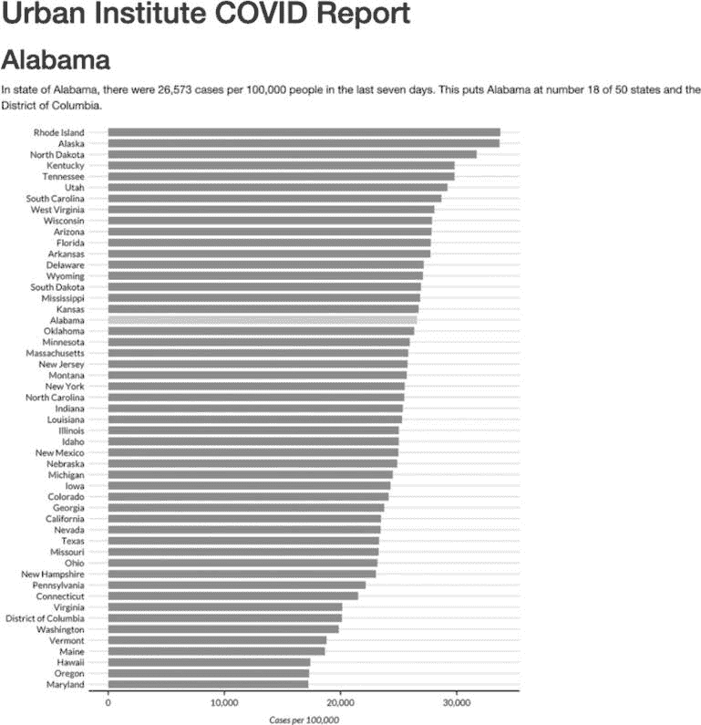
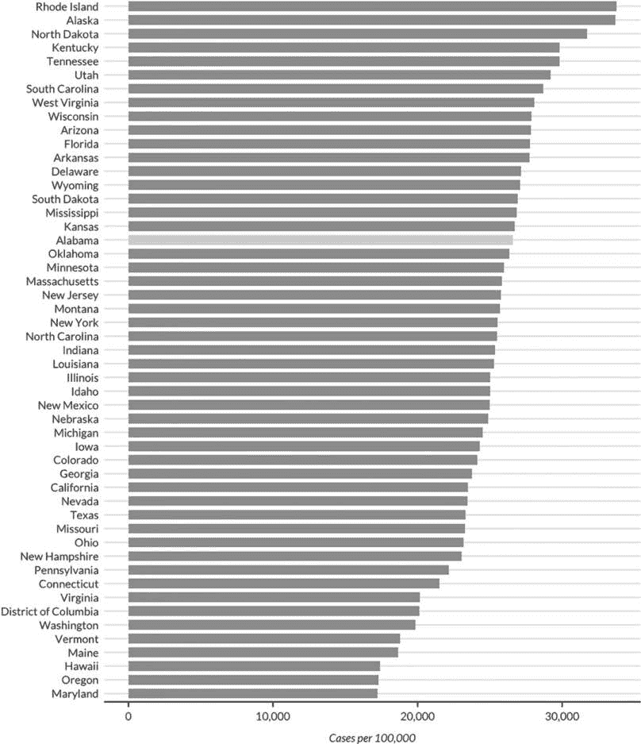

## 第七章：7 参数化报告


*参数化报告*是一种可以同时生成多个报告的技术。通过使用参数化报告，你可以按照相同的过程生成 3,000 份报告，和制作一份报告的过程一样。这项技术还使你的工作更加准确，因为它避免了复制粘贴错误。

华盛顿特区的智库城市研究所的工作人员，使用了参数化报告来为所有美国各州以及哥伦比亚特区开发财政简报。每份报告都需要大量的文本和多个图表，因此手动创建这些报告是不现实的。相反，员工 Safia Sayed、Livia Mucciolo 和 Aaron Williams 自动化了这个过程。本章将解释参数化报告的工作原理，并带你走过城市研究所使用的代码的简化版本。

### R Markdown 中的报告模板

如果你曾经需要同时创建多个报告，你会知道这有多么令人沮丧，尤其是当你使用第六章中描述的多工具工作流时。仅制作一份报告就可能需要很长时间。如果把这个工作量乘以 10、20，或者像城市研究所团队一样，乘以 51，那么它很快就会让人感到不堪重负。幸运的是，通过参数化报告，你可以使用以下工作流一次性生成成千上万份报告：

1.  在 R Markdown 中制作报告模板。

2.  在 R Markdown 文档的 YAML 部分添加一个参数（例如，表示美国各州的参数），以表示在报告间变化的值。

3.  使用该参数生成一个州的报告，以确保你可以编织（knit）文档。

4.  创建一个独立的 R 脚本文件，设置参数值并生成报告。

5.  对所有州运行该脚本。

你将从为一个州创建报告模板开始。我已经将城市研究所员工用于制作州财政简报的代码进行了大幅简化。所有使用的包都是你在前几章中见过的，唯一的例外是`urbnthemes`包。这个包包含了一个自定义的 ggplot 主题。你可以通过在控制台运行`remotes::install_github("UrbanInstitute/urbnthemes")`来安装它。我没有专注于财政数据，而是使用了你可能更熟悉的数据：2022 年中期的 COVID-19 感染率。以下是 R Markdown 文档：

```
---
title: "Urban Institute COVID Report"
output: html_document
params:
  state: "Alabama"
---

```{r setup, include=FALSE}

knitr::opts_chunk$set(

echo = FALSE,

warning = FALSE,

message = FALSE

)

```

```{r}

library(tidyverse)

library(urbnthemes)

library(scales)

```

# `r params$state`

```{r}

cases <- tibble(state.name) %>%

rbind(state.name = "哥伦比亚特区") %>%

left_join(

    read_csv(

    "https://data.rfortherestofus.com/united_states_covid19_cases_deaths_and_testing_by_state.csv",

    skip = 2

    ),

    by = c("state.name" = "State/Territory")

) %>%

select(

    total_cases = `总病例数`,

    state.name,

    cases_per_100000 = `每 10 万人病例数`

) %>%

mutate(cases_per_100000 = parse_number(cases_per_100000)) %>%

mutate(case_rank = rank(-cases_per_100000, ties.method = "min"))

```

```{r}

state_text <- if_else(params$state == "District of Columbia", str_glue(

"the District of Columbia"), str_glue("state of {params$state}"))

state_cases_per_100000 <- cases %>%

filter(state.name == params$state) %>%

pull(cases_per_100000) %>%

comma()

state_cases_rank <- cases %>%

filter(state.name == params$state) %>%

pull(case_rank)

```

In `r state_text`, there were `r state_cases_per_100000` cases per 100,000
people in the last seven days. This puts `r params$state` at number
`r state_cases_rank` of 50 states and the District of Columbia.

```{r fig.height = 8}

set_urbn_defaults(style = "print")

cases %>%

mutate(highlight_state = if_else(state.name == params$state, "Y", "N")) %>%

mutate(state.name = fct_reorder(state.name, cases_per_100000)) %>%

ggplot(aes(

    x = cases_per_100000,

    y = state.name,

    fill = highlight_state

)) +

geom_col() +

scale_x_continuous(labels = comma_format()) +

theme(legend.position = "none") +

labs(

    y = NULL,

    x = "Cases per 100,000"

)

``` 
```

报告中的文本和图表来自名为 cases 的数据框，如下所示：

```
#> # A tibble: 51 × 4
#>    total_cases state.name  cases_per_100000 case_rank
#>    <chr>       <chr>                  <dbl>     <int>
#>  1 1302945     Alabama                26573        18
#>  2 246345      Alaska                 33675         2
#>  3 2025435     Arizona                27827        10
#>  4 837154      Arkansas               27740        12
#>  5 9274208     California             23472        35
#>  6 1388702     Colorado               24115        33
#>  7 766172      Connecticut            21490        42
#>  8 264376      Delaware               27150        13
#>  9 5965411     Florida                27775        11
#> 10 2521664     Georgia                23750        34
#> # ... with 41 more rows 
```

当你编织文档时，你会得到如 图 7-1 所示的简单 HTML 文件。



图 7-1：通过 R Markdown 生成的阿拉巴马州报告

你应该能从 第六章 中认出 R Markdown 文档的 YAML、R 代码块、内联代码和 Markdown 文本。

#### 定义参数

在 R Markdown 中，*参数* 是你在 YAML 中设置的变量，允许你创建多个报告。看看 YAML 中的这两行：

```
params:
  state: "Alabama" 
```

这段代码定义了一个名为 state 的变量。你可以在 R Markdown 文档的其余部分使用这个 state 变量，语法为 params$variable_name，variable_name 替换为 state 或者你在 YAML 中设置的任何其他名称。例如，考虑以下内联 R 代码：

```
# `r params$state` 
```

当你编织文档时，params$state 参数的任何实例都会被转换为 "Alabama"。这个参数和其他几个参数出现在以下代码中，用于设置第一级标题，在 图 7-1 中可见：

```
In `r state_text`, there were `r state_cases_per_100000` cases per 100,000
people in the last seven days. This puts `r **params$state**` at number
`r state_cases_rank` of 50 states and the District of Columbia. 
```

编织文档后，你应该看到以下文本：

> 在阿拉巴马州，过去七天内每 10 万人中有 26,573 例病例。这使得阿拉巴马州在 50 个州和哥伦比亚特区中排名第 18。

这段文本是自动生成的。内联 R 代码 `r state_text` 打印变量 state_text 的值，该值由之前的 if_else() 调用决定，代码片段如下所示：

```
state_text <- if_else(params$state == "District of Columbia",
str_glue("the District of Columbia"), str_glue("state of {params$state}")) 
```

如果 params$states 的值是 "District of Columbia"，这段代码将 state_text 设置为 "the District of Columbia"。如果 params$state 不是 "District of Columbia"，那么 state_text 会得到 "state of"，后跟州名。这样，你可以将 state_text 放入句子中，并且无论 state 参数是州名还是哥伦比亚特区，它都能正常工作。

#### 使用参数生成数字

你还可以使用参数生成数字值并将其包含在文本中。例如，要动态计算 state_cases_per_100000 和 state_cases_rank 变量的值，可以使用 state 参数，如下所示：

```
state_cases_per_100000 <- cases %>%
  filter(state.name == params$state) %>%
  pull(cases_per_100000) %>%
  comma()

state_cases_rank <- cases %>%
  filter(state.name == params$state) %>%
  pull(case_rank) 
```

首先，这段代码过滤了 cases 数据框（它包含所有州的数据），只保留 params$state 所指定的州的数据。接着，pull() 函数从该数据中提取单一值，scales 包中的 comma() 函数对其进行格式化，使 state_cases_per_100000 显示为 26,573（而不是 26573）。最后，state_cases_per_100000 和 state_case_rank 变量被集成到内联 R 代码中。

#### 在可视化代码中包含参数

params$state 参数在其他地方也有使用，比如在报告的柱状图中突出显示某个州。要查看如何实现这一点，请看以下来自最后一个代码块的部分：

```
cases %>%
  mutate(highlight_state = if_else(state.name == params$state, "Y", "N")) 
```

这段代码创建了一个名为 highlight_state 的变量。在 cases 数据框中，代码检查 state.name 是否等于 params$state。如果相等，highlight_state 的值为 Y；否则为 N。运行这两行代码后，相关列的情况如下所示：

```
#> # A tibble: 51 × 2
#>    state.name  highlight_state
#>    <chr>       <chr>
#>  1 Alabama     Y
#>  2 Alaska      N
#>  3 Arizona     N
#>  4 Arkansas    N
#>  5 California  N
#>  6 Colorado    N
#>  7 Connecticut N
#>  8 Delaware    N
#>  9 Florida     N
#> 10 Georgia     N
#> #  ... with 41 more rows 
```

后面，ggplot 代码使用 highlight_state 变量作为柱状图填充美学属性，用黄色突出显示 params$state 中的州，将其他州染成蓝色。图 7-2 显示了突出显示 Alabama 的图表。



图 7-2：使用参数在柱状图中突出显示数据

如你所见，在 YAML 中设置参数允许你在编织报告时动态生成文本和图表。但到目前为止，你只生成了一个报告。那么如何生成所有 51 个报告呢？你可能会想到手动更新 YAML，将参数的值从“Alabama”改为“Alaska”，然后重新编织文档。虽然你*可以*按照这个流程为所有州生成报告，但这样做会很繁琐，这正是你想避免的。相反，你可以自动化报告生成过程。

### 创建 R 脚本

为了基于你创建的模板自动生成多个报告，你将使用一个 R 脚本，该脚本会更改 R Markdown 文档中参数的值，然后编织文档。你将首先创建一个名为 *render.R* 的 R 脚本文件。

#### 使用代码编织文档

你的脚本需要能够编织 R Markdown 文档。虽然你已经看到过如何使用 Knit 按钮做到这一点，但你也可以通过代码来完成相同的操作。加载 rmarkdown 包，然后使用其 render() 函数，如下所示：

```
**library(rmarkdown)**

**render(**
 **input = "urban-covid-budget-report.Rmd",**
 **output_file = "Alaska.xhtml",**
 **params = list(state = "Alaska")**
**)** 
```

该函数生成一个名为*urban-covid-budget-report.xhtml*的 HTML 文档。默认情况下，生成的文件与 R Markdown（*.Rmd*）文档同名，但扩展名不同。`output_file`参数为文件指定一个新名称，`params`参数指定会覆盖 R Markdown 文档中的参数。例如，这段代码告诉 R 使用阿拉斯加作为`state`参数，并将生成的 HTML 文件保存为*Alaska.xhtml*。

这种生成报告的方法有效，但要生成所有 51 个报告，您必须手动更改 YAML 中的州名并更新`render()`函数，然后为每个报告运行它。在下一节中，您将更新代码以提高效率。

#### 创建包含参数数据的 Tibble

要编写生成所有报告的自动化代码，首先必须创建一个*向量*（通俗地说，就是一个项的列表），其中包含所有州名和哥伦比亚特区。为此，您将使用内置数据集`state.name`，它包含了所有 50 个州的名称，存储在一个向量中：

```
**state <- tibble(state.name) %>%**
 **rbind("District of Columbia") %>%**
 **pull(state.name)** 
```

这段代码将`state.name`转换为一个 tibble，并使用`rbind()`函数将哥伦比亚特区添加到列表中。`pull()`函数获取单一列并将其保存为`state`。以下是`state`向量的样子：

```
#>  [1] "Alabama"              "Alaska"
#>  [3] "Arizona"              "Arkansas"
#>  [5] "California"           "Colorado"
#>  [7] "Connecticut"          "Delaware"
#>  [9] "Florida"              "Georgia"
#> [11] "Hawaii"               "Idaho"
#> [13] "Illinois"             "Indiana"
#> [15] "Iowa"                 "Kansas"
#> [17] "Kentucky"             "Louisiana"
#> [19] "Maine"                "Maryland"
#> [21] "Massachusetts"        "Michigan"
#> [23] "Minnesota"            "Mississippi"
#> [25] "Missouri"             "Montana"
#> [27] "Nebraska"             "Nevada"
#> [29] "New Hampshire"        "New Jersey"
#> [31] "New Mexico"           "New York"
#> [33] "North Carolina"       "North Dakota"
#> [35] "Ohio"                 "Oklahoma"
#> [37] "Oregon"               "Pennsylvania"
#> [39] "Rhode Island"         "South Carolina"
#> [41] "South Dakota"         "Tennessee"
#> [43] "Texas"                "Utah"
#> [45] "Vermont"              "Virginia"
#> [47] "Washington"           "West Virginia"
#> [49] "Wisconsin"            "Wyoming"
#> [51] "District of Columbia" 
```

与之前使用`render()`并传递`input`和`output_file`参数不同，您可以将`params`参数传递给它，以便在编织时使用这些参数。为此，创建一个包含渲染所有 51 个报告所需信息的 tibble，并将其保存为名为`reports`的对象，然后将其传递给`render()`函数，如下所示：

```
**reports <- tibble(**
 **input = "urban-covid-budget-report.Rmd",**
 **output_file = str_glue("{state}.xhtml"),**
 **params = map(state, ~ list(state = .))**
**)** 
```

这段代码生成一个包含 51 行和 3 个变量的 tibble。在所有行中，输入变量被设置为 R Markdown 文档的名称。`output_file`的值通过`str_glue()`函数设置为等于州名，后跟.*html*（例如，*Alabama.xhtml*）。

`params`变量是三者中最复杂的。它被称为*命名列表*。这种数据结构将数据以`state: state_name`的格式放入 R Markdown 文档的 YAML 中。`purrr`包中的`map()`函数创建命名列表，告诉 R 将每一行的值设置为`state = "Alabama"`，然后是`state = "Alaska"`，依此类推，直到所有州的名称。您可以在`reports` tibble 中看到这些变量：

```
#> # A tibble: 51 × 3
#>    input                         output_file    params
#>    <chr>                         <glue>         <list>
#>  1 urban-covid-budget-report.Rmd Alabama.xhtml   <named list>
#>  2 urban-covid-budget-report.Rmd Alaska.xhtml    <named list>
#>  3 urban-covid-budget-report.Rmd Arizona.xhtml   <named list>
#>  4 urban-covid-budget-report.Rmd Arkansas.xhtml  <named list>
#>  5 urban-covid-budget-report.Rmd California...  <named list>
#>  6 urban-covid-budget-report.Rmd Colorado.xhtml  <named list>
#>  7 urban-covid-budget-report.Rmd Connecticut... <named list>
#>  8 urban-covid-budget-report.Rmd Delaware.xhtml  <named list>
#>  9 urban-covid-budget-report.Rmd Florida.xhtml   <named list>
#> 10 urban-covid-budget-report.Rmd Georgia.xhtml   <named list>
#> # ... with 41 more rows 
```

`params`变量显示为<命名列表>，但如果您在 RStudio 查看器中打开 tibble（点击环境选项卡中的**reports**），您可以更清晰地看到输出，如图 7-3 所示。


图 7-3：RStudio 查看器中的命名列表列

此视图允许您在`params`变量中查看命名列表，并且`state`变量等于每个州的名称。

一旦您创建了`reports` tibble，就可以准备渲染报告。渲染报告的代码只有一行：

```
**pwalk(reports, render)** 
```

这个`pwalk()`函数（来自`purrr`包）有两个参数：一个数据框或 tibble（在这里是`reports`）和一个对 tibble 每一行运行的函数（即`render()`）。

> 注意

*在将`render()`函数传递给`pwalk()`时，不要包含开闭括号。*

运行这段代码会为报告中的每一行运行`render()`函数，并传入 input、output_file 和 params 的值。这相当于输入如下代码，执行`render()`函数 51 次（涵盖 50 个州和哥伦比亚特区）：

```
render(
  input = "urban-covid-budget-report.Rmd",
  output_file = "Alabama.xhtml",
  params = list(state = "Alabama")
)

render(
  input = "urban-covid-budget-report.Rmd",
  output_file = "Alaska.xhtml",
  params = list(state = "Alaska")
)

render(
  input = "urban-covid-budget-report.Rmd",
  output_file = "Arizona.xhtml",
  params = list(state = "Arizona")
) 
```

这是完整的 R 脚本文件：

```
# Load packages
library(tidyverse)
library(rmarkdown)

# Create a vector of all states and the District of Columbia
state <- tibble(state.name) %>%
  rbind("District of Columbia") %>%
  pull(state.name)

# Create a tibble with information on the:
# input R Markdown document
# output HTML file
# parameters needed to knit the document
reports <- tibble(
  input = "urban-covid-budget-report.Rmd",
  output_file = str_glue("{state}.xhtml"),
  params = map(state, ~ list(state = .))
)

# Generate all of our reports
pwalk(reports, render) 
```

在运行`pwalk(reports, render)`代码后，你应该能在 RStudio 的文件面板中看到 51 个 HTML 文档。每个文档都包含该州的报告，附带定制的图表和相应的文本。

### 最佳实践

尽管参数化报告功能强大，但也可能会带来一些挑战。例如，要确保考虑到数据中的离群值。在州报告的情况下，哥伦比亚特区是一个离群值，因为它 technically 不是一个州。Urban Institute 团队通过使用`if_else()`语句（如本章开头所示）修改了报告文本的语言，使其不再将哥伦比亚特区称为州。

另一个最佳实践是手动生成并审核那些参数值最短（例如州财政简报中的爱荷华州、俄亥俄州和犹他州）和最长（哥伦比亚特区）文本长度的报告。这样，你可以识别出可能会导致意外结果的地方，例如图表标题被截断或文本溢出导致页面断裂。花几分钟进行手动审查，可以使自动生成多个报告的过程更加顺畅。

### 摘要

在本章中，你重新创建了 Urban Institute 的州财政简报，采用了参数化报告的方法。你学会了如何在 R Markdown 文档中添加一个参数，然后使用 R 脚本设置该参数的值并生成报告。

自动化报告生产可以节省大量时间，尤其是在你需要生成大量报告时。考虑 Urban Institute 的另一个项目：制作县级报告。美国有超过 3000 个县，手工制作这些报告不现实。而且，如果 Urban Institute 的员工使用 SPSS、Excel 和 Word 来制作报告，他们将不得不在程序之间复制粘贴值。人类是会犯错的，无论我们如何努力避免，错误总会发生。而计算机则不会发生复制粘贴错误。让计算机处理生成多个报告的繁琐工作，可以大大减少错误的发生几率。

刚开始时，参数化报告可能会让人觉得有些困难，因为你需要确保代码适用于报告的每个版本。但一旦你拥有了 R Markdown 文档和配套的 R 脚本文件，你会发现一次性生成多个报告变得很容易，最终能够节省大量工作量。

### 额外资源

+   Data@Urban 团队，“使用 R Markdown 创建迭代版数据报告，”Medium，2018 年 7 月 24 日，*[`urban-institute.medium.com/iterated-fact-sheets-with-r-markdown-d685eb4eafce`](https://urban-institute.medium.com/iterated-fact-sheets-with-r-markdown-d685eb4eafce)*。

+   Data@Urban 团队，“使用 R Markdown 跟踪和发布州数据，”Medium，2021 年 4 月 21 日，*[`urban-institute.medium.com/using-r-markdown-to-track-and-publish-state-data-d1291bfa1ec0`](https://urban-institute.medium.com/using-r-markdown-to-track-and-publish-state-data-d1291bfa1ec0)*。
