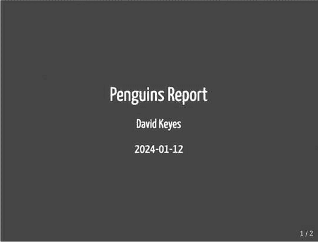
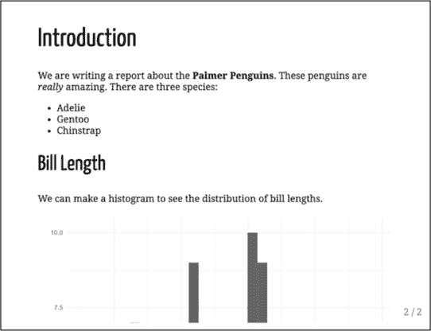
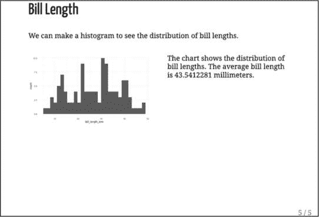
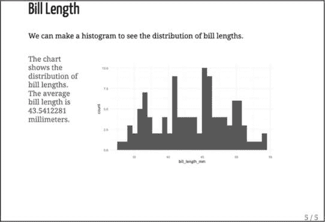
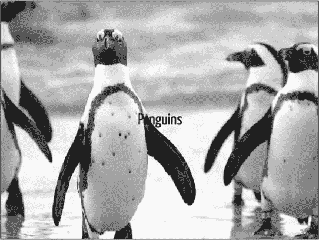
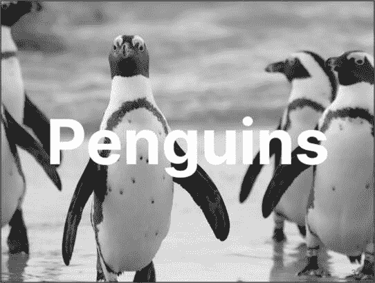
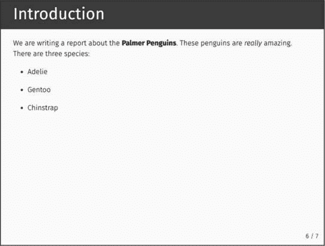

## 第八章：8 幻灯片演示文稿


如果你需要制作类似 PowerPoint 那样的幻灯片演示，R 可以帮你实现。在本章中，你将学习如何使用 xaringan 制作演示文稿。这个使用 R Markdown 的包是 R 中最广泛使用的制作幻灯片的工具。

你将使用 xaringan 将第六章中的企鹅报告转换为幻灯片。你将学习如何创建新的幻灯片，选择性地揭示内容，调整文本和图像对齐方式，并使用 CSS 样式化你的演示文稿。

### 为什么使用 xaringan？

在 RStudio 中创建新 R Markdown 文档时，你可能注意到了演示文稿选项。这个选项提供了多种制作幻灯片的方式，例如将 R Markdown 文档编织为 PowerPoint 文件。然而，使用 xaringan 包相较于这些选项有其优势。

例如，因为 xaringan 将幻灯片创建为 HTML 文档，你可以将它们发布到网上，而不需要通过电子邮件发送或打印出来给观众。你可以通过共享链接轻松地将演示文稿发送给别人。第九章将讨论如何将你的演示文稿发布到网上。

使用 xaringan 的另一个好处是可访问性。HTML 文档易于操作，使观众能够控制其外观。例如，视力有限的人可以通过增加文本大小或使用屏幕阅读器来访问 HTML 文档，从而查看内容。使用 xaringan 制作演示文稿可以让更多人参与到你的幻灯片中。

### xaringan 的工作原理

要开始使用 xaringan，在 RStudio 中运行`install.packages("xaringan")`来安装该包。接下来，点击**文件****新建文件****R Markdown**来创建一个新项目。选择**从模板**选项卡，选择名为**Ninja Presentation**的模板，然后点击**确定**。

你应该会得到一个包含一些默认内容的 R Markdown 文档。删除这些内容，并添加你在第六章创建的企鹅 R 报告。然后，像下面这样在 YAML 中更改输出格式为 xaringan::moon_reader：

```
title: "Penguins Report"
author: "David Keyes"
date: "2024-01-12"
**output: xaringan::moon_reader** 
```

moon_reader 输出格式将 R Markdown 文档转化为幻灯片并进行编织。尝试点击**编织**，看看效果。你应该会得到一个 HTML 文件，文件名与 R Markdown 文档相同（例如*xaringan-example.xhtml*），如图 8-1 所示。



图 8-1：xaringan 包会自动生成一个标题幻灯片。

如果你按右箭头键滚动到下一张幻灯片，你应该会看到熟悉的内容。图 8-2 显示了第二张幻灯片，它的文本与第六章的报告相同，并且包含一个被截断的直方图。



图 8-2：第二张幻灯片需要调整，因为直方图被截断了。

尽管使用 xaringan 制作幻灯片的语法几乎与使用 R Markdown 制作报告的语法完全相同，但你需要做一些调整，以确保内容适合幻灯片。当你在一个将被编织成 Word 文档的文档中工作时，长度并不重要，因为报告可以有 1 页或 100 页。然而，使用 xaringan 时，你需要考虑每张幻灯片上能容纳多少内容。被截断的直方图演示了如果你不这样做会发生什么。接下来你将解决这个问题。

#### 创建新幻灯片

你可以通过将直方图放入单独的幻灯片来使其完全可见。要创建新幻灯片，在你希望幻灯片开始的地方添加三个破折号（---）。我已经在直方图代码之前添加了它们：

```
**---**

## Bill Length

We can make a histogram to see the distribution of bill lengths.

```{r}

penguins %>%

ggplot(aes(x = bill_length_mm)) +

geom_histogram() +

theme_minimal()

``` 
```

当你再次编织文档时，原本是一张幻灯片的内容现在应该被分成两张：一张介绍幻灯片和一张鸟嘴长度幻灯片。然而，如果你仔细看，你会发现直方图的底部仍然稍微被截断了。为了解决这个问题，你需要调整它的大小。

#### 调整图形的大小

使用代码块选项 fig.height 来调整直方图的大小：

```
---

## Bill Length

We can make a histogram to see the distribution of bill lengths.

```{r **fig.height = 4**}

penguins %>%

ggplot(aes(x = bill_length_mm)) +

geom_histogram() +

theme_minimal()

``` 
```

这样做可以让直方图完全显示在幻灯片上，并且显现出被遮住的文本。请记住，fig.height 仅调整图形的输出高度；有时你可能还需要使用 fig.width 来调整输出的宽度，或者替代它。

#### 逐步显示内容

在展示幻灯片时，你可能希望每次只显示一部分内容。比如，当你展示第一张幻灯片时，你可能想先简单介绍一下每种企鹅物种。与其在打开幻灯片时一次性显示所有三种物种，你可能更希望让每个物种的名字依次出现。

你可以使用 xaringan 的一个功能叫做*逐步显示*。在你希望逐步显示的任何内容之间放置两个破折号（--），如下所示：

```
# Introduction

We are writing a report about the **Palmer Penguins**. These penguins are
*really* amazing. There are three species:

- Adelie

**--**

- Gentoo

**--**

- Chinstrap 
```

这段代码让你首先显示 Adelie 物种；然后是 Adelie 和 Gentoo；最后是 Adelie、Gentoo 和 Chinstrap。

在展示幻灯片时，使用右箭头逐步显示物种。

#### 使用内容类对齐内容

你可能还想控制内容的对齐方式。为此，你可以添加*内容类* .left[]、.right[]和.center[]，以指定某部分内容的对齐方式。例如，要将直方图居中对齐，可以使用.center[]，如下所示：

```
**.center[**
```{r fig.height = 4}

penguins %>%

ggplot(aes(x = bill_length_mm)) +

geom_histogram() +

theme_minimal()

```
**]** 
```

这段代码将图表居中显示在幻灯片上。

其他内置选项可以制作两栏布局。添加.pull-left[]和.pull-right[]将创建两个等间距的列。使用以下代码将直方图显示在幻灯片的左侧，伴随的文本显示在右侧：

```
**.pull-left[**
```{r fig.height = 4}

penguins %>%

ggplot(aes(x = bill_length_mm)) +

geom_histogram() +

theme_minimal()

```
**]**

**.pull-right[**
```{r}

average_bill_length <- penguins %>%

summarize(avg_bill_length = mean(bill_length_mm,

                                na.rm = TRUE)) %>%

pull(avg_bill_length)

```

The chart shows the distribution of bill lengths. The average bill length is
`r average_bill_length` millimeters.
**]** 
```

图 8-3 显示了结果。



图 8-3：一个包含两个大小相等列的幻灯片

要制作一个窄的左列和宽的右列，使用内容类 .left-column[] 和 .right-column[]。 图 8-4 显示了文本在左侧，直方图在右侧的幻灯片效果。



图 8-4：一个左列较小、右列较大的幻灯片

除了对幻灯片上的特定内容进行对齐外，你还可以使用左、右和居中类来水平对齐整个内容。为此，在表示新幻灯片的三条破折号后，但在任何内容之前，指定类名：

```
---

**class: center**

## Bill Length

We can make a histogram to see the distribution of bill lengths.

```{r fig.height = 4}

penguins %>%

ggplot(aes(x = bill_length_mm)) +

geom_histogram() +

theme_minimal()

``` 
```

这段代码生成一个水平居中的幻灯片。要调整垂直位置，你可以使用类 top、middle 和 bottom。

#### 向幻灯片添加背景图像

使用刚才用来居中整个幻灯片的相同语法，你还可以添加背景图像。创建一个新幻灯片，使用类名 center 和 middle 来水平和垂直对齐内容，并通过在 url() 的括号内指定图片路径来添加背景图像：

```
**class: center, middle**
**background-image: url("penguins.jpg")**

## Penguins 
```

要运行此代码，你需要在项目中有一个名为*penguins.jpg*的文件（你可以从 *[`data.rfortherestofus.com/penguins.jpg`](https://data.rfortherestofus.com/penguins.jpg)* 下载）。编织文档后，应该会生成一个使用该图片作为背景，并在前面显示*Penguins*文本的幻灯片，如图 8-5 所示。



图 8-5：一个使用背景图像的幻灯片

现在你将添加自定义 CSS 来进一步改进这个幻灯片。

### 为幻灯片应用 CSS

你刚刚制作的幻灯片有一个问题，就是*Penguins*这个词很难阅读。如果你能让文字更大些，颜色也不同一些，那就更好了。要做到这一点，你需要使用*层叠样式表 (CSS)*，这是一种用于样式化 HTML 文档的语言。如果你在想，*我读这本书是为了学习 R，不是 CSS*，别担心：你只需要一点点 CSS 来调整你的幻灯片样式。为了应用这些样式，你可以编写自定义代码，使用 CSS 主题，或者结合这两种方法，利用 xaringanthemer 包。

#### 自定义 CSS

要添加自定义 CSS，请创建一个新的代码块，并在大括号之间放入 CSS：

```
```{css}

**.remark-slide-content h2 {**

**font-size: 150px;**

**color: white;**

}

``` 
```

这段代码告诉 R Markdown 将二级标题（h2）设置为 150 像素大且为白色。在标题前添加 .remark-slide-content 以便定位幻灯片中的特定元素。“remark”一词来自于 *remark.js*，这是一个用于制作幻灯片的 JavaScript 库，xaringan 在背后使用了它。

为了改变字体以及文本的大小和颜色，添加以下 CSS：

```
```{css}

**@import url('https://fonts.googleapis.com/css2?family=Inter:wght@400;700&display=swap');**

.remark-slide-content h2 {

font-size: 150px;

color: white;

**font-family: Inter;**

**font-weight: bold;**

}

``` 
```

第一行新代码使得名为 Inter 的字体在幻灯片中可用，因为有些人可能没有在他们的计算机上安装该字体。接下来，这段代码将 Inter 字体应用于标题并使其加粗。你可以在图 8-6 中看到使用加粗的 Inter 字体的幻灯片。



图 8-6：应用 CSS 字体更改后的标题幻灯片

由于 xaringan 幻灯片是作为 HTML 文档构建的，你可以根据自己的喜好使用 CSS 对其进行自定义。天空是极限！

#### 主题

你可能不关心 CSS 的细节。幸运的是，你可以通过两种方式自定义你的幻灯片，而无需自己编写 CSS。第一种方式是应用其他 R 用户创建的 xaringan 主题。运行以下代码以获取所有可用主题的列表：

```
**names(xaringan:::list_css())** 
```

输出应该看起来像这样：

```
#>  [1] "chocolate-fonts"  "chocolate"
#>  [3] "default-fonts"    "default"
#>  [5] "duke-blue"        "fc-fonts"
#>  [7] "fc"               "glasgow_template"
#>  [9] "hygge-duke"       "hygge"
#> [11] "ki-fonts"         "ki"
#> [13] "kunoichi"         "lucy-fonts"
#> [15] "lucy"             "metropolis-fonts"
#> [17] "metropolis"       "middlebury-fonts"
#> [19] "middlebury"       "nhsr-fonts"
#> [21] "nhsr"             "ninjutsu"
#> [23] "rladies-fonts"    "rladies"
#> [25] "robot-fonts"      "robot"
#> [27] "rutgers-fonts"    "rutgers"
#> [29] "shinobi"          "tamu-fonts"
#> [31] "tamu"             "uio-fonts"
#> [33] "uio"              "uo-fonts"
#> [35] "uo"               "uol-fonts"
#> [37] "uol"              "useR-fonts"
#> [39] "useR"             "uwm-fonts"
#> [41] "uwm"              "wic-fonts"
#> [43] "wic" 
```

一些 CSS 文件仅更改字体，而其他文件则更改一般元素，比如文本大小、颜色以及是否显示幻灯片编号。使用预构建主题通常需要同时使用一个通用主题和一个字体主题，如下所示：

```
---
title: "Penguins Report"
author: "David Keyes"
date: "2024-01-12"
output:
  xaringan::moon_reader:
    **css: [default, metropolis, metropolis-fonts]**
--- 
```

这段代码告诉 xaringan 使用默认的 CSS，并应用在 metropolis 和 metropolis-fonts CSS 主题中所做的自定义。这些主题已经捆绑在 xaringan 中，因此你无需安装任何额外的包即可使用它们。图 8-7 展示了主题如何改变幻灯片的外观和感觉。



图 8-7：使用 metropolis 主题的幻灯片

如果编写自定义 CSS 是完全灵活但更具挑战性的选项，那么使用自定义主题则更简单，但灵活性较低。自定义主题允许你轻松使用他人预构建的 CSS，但无法进一步修改它。

#### xaringanthemer 包

在编写自定义 CSS 和应用他人主题之间找到一个合适的折衷方法，就是使用 Garrick Aden-Buie 的 xaringanthemer 包。该包包含了几个内置的主题，同时也允许你轻松创建自己的自定义主题。安装该包后，调整 YAML 文件中的 css 行，使用 *xaringan-themer.css* 文件，如下所示：

```
---
title: "Penguins Report"
author: "David Keyes"
date: "2024-01-12"
output:
  xaringan::moon_reader:
    **css: xaringan-themer.css**
--- 
```

现在，你可以通过使用 style_xaringan() 函数来定制你的幻灯片。这个函数有超过 60 个参数，使你可以调整 xaringan 幻灯片的几乎任何部分。要使用 xaringanthemer 重现本章之前编写的自定义 CSS，你只需使用其中的一些参数：

```
```{r}

**library(xaringanthemer)**

**style_xaringan(**

**header_h2_font_size = "150px",**

**header_color = "white",**

**header_font_weight = "bold",**

**header_font_family = "Inter"**

**)**

``` 
```

这段代码将标题大小设置为 150 像素，并使所有标题使用加粗的白色 Inter 字体。

关于 xaringanthemer 包的一个特别好处是，你可以通过简单地将其名称添加到 header_font_family 或其他设置字体系列的参数中，使用 Google Fonts 上的任何字体（text_font_family 和 code_font_family 分别用于设置正文文本和代码的字体）。这意味着你不需要再包含使 Inter 字体可用的那一行代码。

### 摘要

在本章中，你学习了如何使用 xaringan 包创建演示文稿。你了解了如何逐步展示幻灯片内容、创建多列布局，并向幻灯片添加背景图片。你还通过应用自定义主题、编写 CSS 和使用 xaringanthemer 包来改变幻灯片的外观。

使用 xaringan，你可以创建任何类型的演示文稿，并根据你的需求自定义外观和风格。使用 xaringan 创建演示文稿还可以让你轻松分享 HTML 格式的幻灯片，并提高可访问性。

### 其他资源

+   Garrick Aden-Buie, Silvia Canelón, 和 Shannon Pileggi，“专业、精致、易于展示：使用 xaringan 制作出色的幻灯片”，研讨会材料，未注明日期， *[`presentable-user2021.netlify.app`](https://presentable-user2021.netlify.app)*。

+   Silvia Canelón，“通过 xaringan 分享你的工作：xaringan 演示文稿简介：基础知识及更多”，NHS-R 社区 2020 年虚拟大会的研讨会，2020 年 11 月 2 日， *[`spcanelon.github.io/xaringan-basics-and-beyond/index.xhtml`](https://spcanelon.github.io/xaringan-basics-and-beyond/index.xhtml)*。

+   Alison Hill，“认识 xaringan：在 R Markdown 中制作幻灯片”，幻灯片演示，2019 年 1 月 16 日， *[`arm.rbind.io/slides/xaringan.xhtml`](https://arm.rbind.io/slides/xaringan.xhtml)*。

+   Yihui Xie, J. J. Allaire, 和 Garrett Grolemund，“xaringan 演示文稿”，见 *R Markdown: The Definitive Guide*（佛罗里达州博卡拉顿：CRC Press，2019 年）， *[`bookdown.org/yihui/rmarkdown/`](https://bookdown.org/yihui/rmarkdown/)*。
