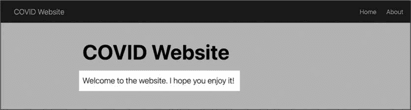
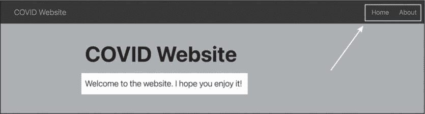
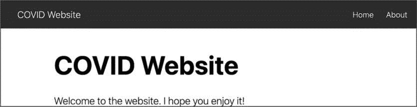
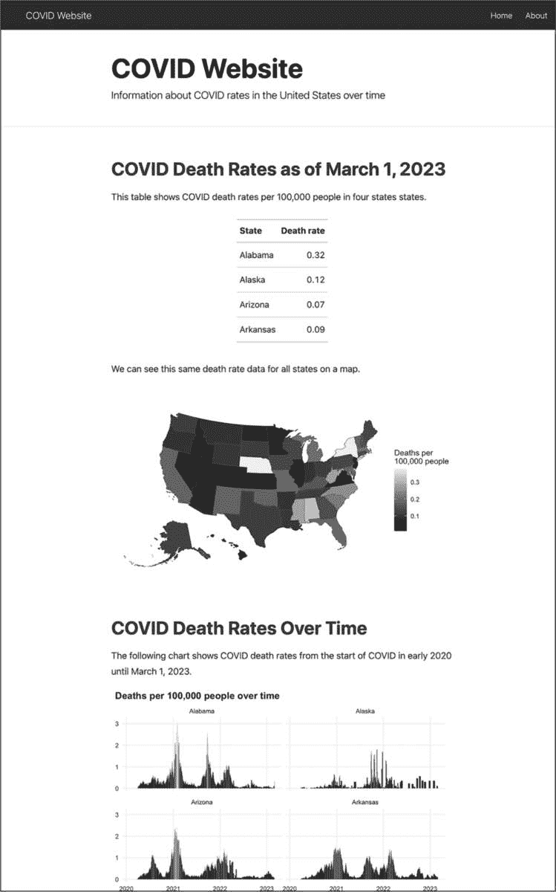
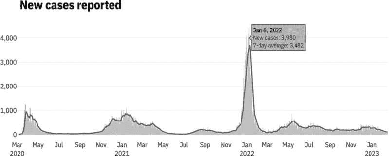
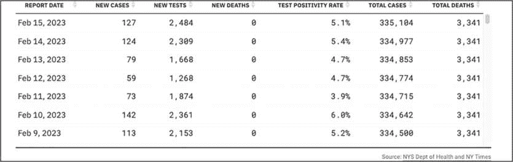
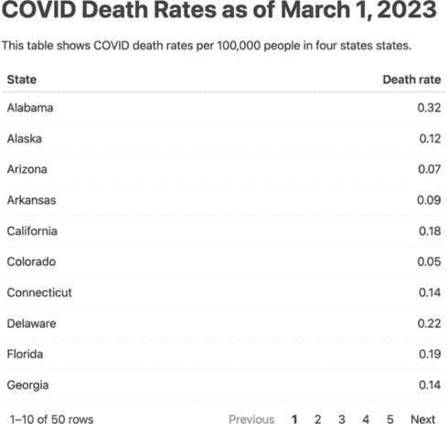
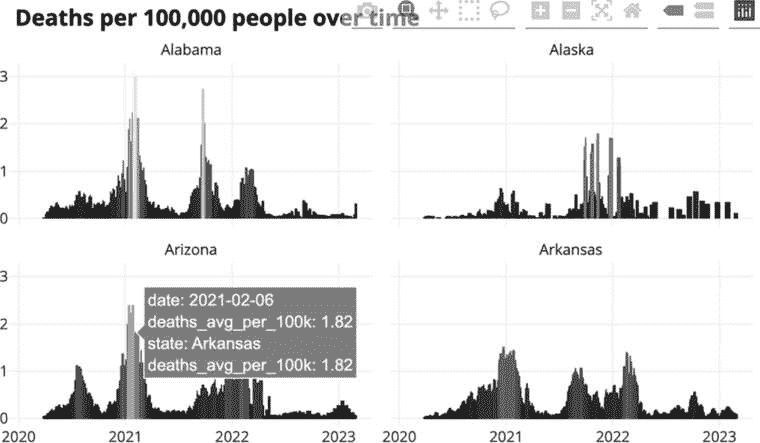
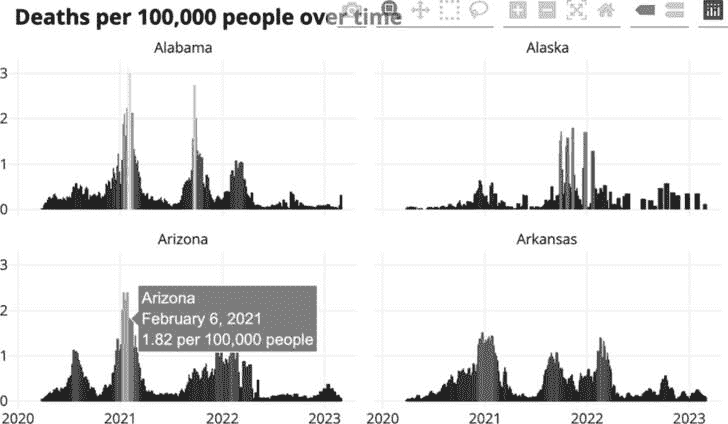
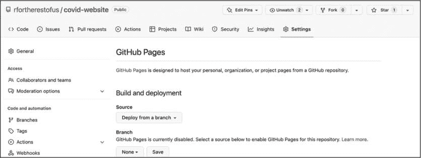

## 9 网站


2020 年夏天，Matt Herman 的家人从布鲁克林搬到了纽约的 Westchester 县。那时 COVID-19 疫情刚开始，Herman 震惊于该县几乎没有发布任何关于感染率的数据。疫苗还未上市，是否去公园等日常选择也依赖于是否能获得准确的数据。

当时，Herman 是纽约市儿童服务局研究与分析办公室儿童统计数据单元的副主任。这个冗长的职位意味着他擅长处理数据，使他能够创建所需的 COVID 资源：Westchester COVID-19 跟踪网站。

这个网站完全使用 R 构建，利用图表、地图、表格和文字来总结 Westchester 县的最新 COVID 数据。虽然该网站不再每日更新，但你仍然可以访问它，网址是*[`westchester-covid.mattherman.info`](https://westchester-covid.mattherman.info)*。

为了创建这个网站，Herman 编写了一组 R Markdown 文件，并通过 distill 包将它们连接起来。本章通过创建一个简单的网站来解释该包的基本用法。你将学习如何生成不同的页面布局、导航菜单和交互式图形，然后探索托管网站的策略。

### 创建一个新的 distill 项目

网站仅仅是一些 HTML 文件的集合，就像你在第八章中创建幻灯片展示时所制作的那样。distill 包使用多个 R Markdown 文档来生成多个 HTML 文件，然后通过导航菜单等将它们连接起来。

要创建一个 distill 网站，首先使用 install.packages("distill")安装该包。然后，通过在 RStudio 中选择**文件****新建项目****新建目录**，并选择**Distill Website**作为项目类型，来开始一个项目。

指定项目在计算机上所在的目录和子目录，然后为你的网站命名。勾选“配置 GitHub Pages”选项，这将提供一种简便的方式来发布你的网站在线（你将在“GitHub 托管”一节中了解它是如何工作的，第 154 页）。如果你希望使用此部署选项，请选中它。

### 项目文件

你现在应该已经有了一个包含多个文件的项目。除了表示你正在使用 RStudio 项目的*covid-website.Rproj*文件外，你还应该有两个 R Markdown 文档，一个*_site.yml*文件，以及一个*docs*文件夹，渲染后的 HTML 文件将存放在该文件夹内。让我们来看看这些网站文件。

#### R Markdown 文档

每个 R Markdown 文件代表网站的一个页面。默认情况下，distill 会创建一个主页（*index.Rmd*）和一个关于页面（*about.Rmd*），其中包含占位符内容。如果你想生成额外的页面，只需添加新的 R Markdown 文件，并在接下来的部分中提到的*_site.yml*文件中列出它们。

如果你打开 *index.Rmd* 文件，你会注意到 YAML 中包含了两个在前几章的 R Markdown 文档中没有出现过的参数：description 和 site：

```
---
title: "COVID Website"
description: |
  Welcome to the website. I hope you enjoy it!
site: distill::distill_website
--- 
```

description 参数指定了每个页面标题下方应该显示的文本，如图 9-1 所示。



图 9-1：默认网站描述

site: distill::distill_website 行标识了 distill 网站的根页面。这意味着当你编织文档时，R Markdown 会知道要创建一个网站，而不是一个独立的 HTML 文件，而且网站应该首先显示这个页面。网站的其他页面不需要这一行代码。只要它们在 *_site.yml* 文件中列出，它们就会被添加到网站中。

你还会注意到在其他 R Markdown 文档中出现过的一个参数缺失：output，它指定了在编织时 R 应该使用的输出格式。这里缺少 output 的原因是，你将在 *_site.yml* 文件中为整个网站指定输出格式。

#### _site.yml 文件

*_site.yml* 文件告诉 R 哪些 R Markdown 文档构成了网站，编织后的文件应该是什么样子，网站应该叫什么，以及更多信息。当你打开它时，应该能看到以下代码：

```
name: "covid-website"
title: "COVID Website"
description: |
  COVID Website
output_dir: "docs"
navbar:
  right:
    - text: "Home"
      href: index.xhtml
    - text: "About"
      href: about.xhtml
output: distill::distill_article 
```

name 参数决定了你网站的 URL。默认情况下，这应该是你的 distill 项目所在目录的名称；在我的例子中，这就是 *covid-website* 目录。title 参数为整个网站创建标题，并默认显示在导航栏的左上方。description 参数提供了所谓的 *meta description*，它将出现在 Google 搜索结果中，给用户一个网站内容的概览。

output_dir 参数决定了在生成网站时渲染后的 HTML 文件存放位置。你应该会看到列出了 *docs* 目录。不过，你可以将输出目录更改为任何你选择的文件夹。

接下来，导航栏部分定义了网站的导航。在这里它出现在页眉的右侧，但将右侧参数换成左侧就能改变它的位置。导航栏包含指向网站两个页面的链接，即主页和关于页面，如图 9-2 所示。



图 9-2：网站导航栏

在导航栏代码中，text 参数指定菜单中显示的文本。（例如，试着将“About”改为**About This Website**，然后再改回来。）href 参数决定了导航栏中的文本链接到哪个 HTML 文件。如果你想在菜单中添加其他页面，你需要同时添加文本和 href 参数。

最后，output 参数指定所有 R Markdown 文档应使用 distill_article 格式渲染。此格式允许不同宽度的布局，*侧边栏*（位于主内容旁边的括注项目），易于自定义的 CSS 等。

### 构建网站

我们已经浏览了项目的文件，但还没有使用它们来创建网站。为此，请点击 RStudio 右上角面板中的 **构建网站**。 （你也可以在控制台中或 R 脚本文件中运行 rmarkdown::render_site()。）

这应该会呈现所有 R Markdown 文档，并在其上添加顶部导航栏，包含在 *_site.yml* 文件中指定的选项。要找到已渲染的文件，请查看 *docs*（或你指定的任何输出目录）。打开 *index.xhtml* 文件，你将看到你的网站，应该像 图 9-3 一样。



图 9-3：带有默认内容的 COVID 网站

你也可以打开任何其他的 HTML 文件来查看其渲染后的版本。

### 应用自定义 CSS

使用 distill 制作的网站往往看起来相似，但你可以通过自定义 CSS 来改变它们的设计。distill 包甚至提供了一个函数来简化这一过程。在控制台中运行 distill::create_theme() 来创建一个名为 *theme.css* 的文件，如下所示：

```
/* base variables */

/* Edit the CSS properties in this file to create a custom
   Distill theme. Only edit values in the right column
   for each row; values shown are the CSS defaults.
   To return any property to the default,
   you may set its value to: unset
   All rows must end with a semi-colon.                      */

/* Optional: embed custom fonts here with `@import`          */
/* This must remain at the top of this file.                 */

html {
  /*-- Main font sizes --*/
  --title-size:      50px;
  --body-size:       1.06rem;
  --code-size:       14px;
  --aside-size:      12px;
  --fig-cap-size:    13px;
  /*-- Main font colors --*/
  --title-color:     #000000;
  --header-color:    rgba(0, 0, 0, 0.8);
  --body-color:      rgba(0, 0, 0, 0.8);
  --aside-color:     rgba(0, 0, 0, 0.6);
  --fig-cap-color:   rgba(0, 0, 0, 0.6);
  /*-- Specify custom fonts ~~~ must be imported above --*/
  --heading-font:    sans-serif;
  --mono-font:       monospace;
  --body-font:       sans-serif;
  --navbar-font:     sans-serif;  /* websites + blogs only */
}

/*-- ARTICLE METADATA --*/
d-byline {
  --heading-size:    0.6rem;
  --heading-color:   rgba(0, 0, 0, 0.5);
  --body-size:       0.8rem;
  --body-color:      rgba(0, 0, 0, 0.8);
}

/*-- ARTICLE TABLE OF CONTENTS --*/
.d-contents {
  --heading-size:    18px;
  --contents-size:   13px;
}

/*-- ARTICLE APPENDIX --*/
d-appendix {
  --heading-size:    15px;
  --heading-color:   rgba(0, 0, 0, 0.65);
  --text-size:       0.8em;
  --text-color:      rgba(0, 0, 0, 0.5);
}

/*-- WEBSITE HEADER + FOOTER --*/
/* These properties only apply to Distill sites and blogs  */

.distill-site-header {
  --title-size:       18px;
  --text-color:       rgba(255, 255, 255, 0.8);
  --text-size:        15px;
  --hover-color:      white;
  --bkgd-color:       #0F2E3D;
}

.distill-site-footer {
  --text-color:       rgba(255, 255, 255, 0.8);
  --text-size:        15px;
  --hover-color:      white;
  --bkgd-color:       #0F2E3D;
}

/*-- Additional custom styles --*/
/* Add any additional CSS rules below                      */ 
```

在这个文件中，有一组 CSS 变量，允许你自定义你网站的设计。它们大多数的名字清楚地表明了它们的作用，你可以将它们的默认值更改为任何你想要的值。例如，以下对站点头部的编辑使标题和文本大小变大，并将背景色更改为浅蓝色：

```
.distill-site-header {
  --title-size:       **28px;**
  --text-color:       rgba(255, 255, 255, 0.8);
  --text-size:        **20px;**
 --hover-color:      white;
  --bkgd-color:       **#6cabdd;**
} 
```

然而，在你看到这些更改之前，你需要在 *_site.yml* 文件中添加一行，告诉 distill 在渲染时使用这个自定义 CSS：

```
name: "covid-website"
title: "COVID Website"
description: |
  COVID Website
**theme: theme.css**
output_dir: "docs"
navbar:
`--snip--` 
```

现在你可以再次生成站点，应该能看到你的更改已反映出来。

在 *theme.css* 中有很多其他的 CSS 变量，你可以修改它们来调整你网站的外观。尝试调整这些变量并重新生成站点是了解每个变量作用的好方法。

> 注意

*要了解更多关于自定义网站外观和感觉的信息，请查看其他人使用 distill 制作的网站，访问* [`distillery.rbind.io`](https://distillery.rbind.io)*。*

### 处理网站内容

你可以通过在页面的 R Markdown 文档中创建 Markdown 文本和代码块来向你网站的页面添加内容。例如，若要突出显示 COVID 病例的变化趋势，你将用显示表格、地图和图表的代码替换 *index.Rmd* 的内容，并展示在网站的首页。以下是文件的开头部分：

```
---
title: "COVID Website"
description: "Information about COVID rates in the United States over time"
site: distill::distill_website
---

```{r setup, include=FALSE}

knitr::opts_chunk$set(echo = FALSE,

                    warning = FALSE,

                    message = FALSE)

```

```{r}

# 加载包

library(tidyverse)

library(janitor)

library(tigris)

library(gt)

library(lubridate)

``` 
```

在 YAML 和设置代码块之后，这段代码加载了几个包，许多你在前面的章节中见过：用于数据导入、操作和绘图的 tidyverse（结合 ggplot）；janitor 用于 clean_names()函数，它使得变量名称更容易使用；tigris 用于导入关于州的地理空间数据；gt 用于制作漂亮的表格；lubridate 用于处理日期。

接下来，为了导入和清理数据，添加以下新的代码块：

```
```{r}

# 导入数据

us_states <- states(

cb = TRUE,

分辨率 = "20m",

progress_bar = FALSE

) %>%

shift_geometry() %>%

clean_names() %>%

选择(geoid, name) %>%

重命名(state = name) %>%

过滤(state %in% state.name)

covid_data <- read_csv("https://raw.githubusercontent.com/nytimes/covid-19-data/master/rolling-averages/us-states.csv") %>%

过滤(state %in% state.name) %>%

mutate(geoid = str_remove(geoid, "USA-"))

last_day <- covid_data %>%  ❶

slice_max(

    按日期排序，

    n = 1

) %>%

distinct(date) %>%

mutate(date_nice_format = str_glue("{month(date, label = TRUE, abbr = FALSE)} {day(date)},   {year(date)}")) %>%

提取(date_nice_format)

```
# COVID Death Rates as of `r last_day` ❷ 
```

这段代码使用 slice_max()函数从 covid_data 数据框中获取最新的日期。（数据已添加到 2023 年 3 月 23 日，因此该日期是最新的。）接下来，使用 distinct()获取该日期的唯一观测值（每个日期在 covid_data 数据框中出现多次）。然后，代码使用 str_glue()函数创建一个 date_nice_format 变量，将月份、日期和年份组合成易读的格式。最后，使用 pull()函数将数据框转换为一个名为 last_day ❶的单一变量，稍后在文本部分中引用。通过内联 R 代码，标题现在会显示当前日期 ❷。

包含以下代码，显示四个州每 10 万人死亡率的表格（使用所有州会导致表格过大）：

```
```{r}

covid_data %>%

过滤(state %in% c(

    "阿拉巴马州",

    "阿拉斯加州",

    "亚利桑那州",

    "阿肯色州"

)) %>%

slice_max(

    按照日期排序，

    n = 1

) %>%

选择(state, deaths_avg_per_100k) %>%

按照州排序 %>%

set_names("State", "Death rate") %>%

gt() %>%

tab_style(

    style = cell_text(weight = "bold"),

    locations = cells_column_labels()

)

``` 
```

这个表格类似于你在第五章中看到的代码。首先，filter()函数将数据过滤为四个州，然后 slice_max()函数获取最新日期。接着，代码选择相关变量（state 和 deaths_avg_per_100k），按州的字母顺序排列数据，设置变量名，并将输出通过管道传递给使用 gt 包生成的表格。

添加以下代码，使用在第四章中介绍的技术，制作所有州的地图：

```
We can see this same death rate data for all states on a map.

```{r}

most_recent <- us_states %>%

left_join(covid_data, by = "state") %>%

slice_max(order_by = date,

            n = 1)

most_recent %>%

ggplot(aes(fill = deaths_avg_per_100k)) +

geom_sf() +

scale_fill_viridis_c(option = "rocket") +

labs(fill = "每 10 万人死亡人数") +

theme_void()

``` 
```

这段代码通过将 us_states 地理数据与 covid_data 数据框连接，然后筛选出最新日期来创建一个 most_recent 数据框。接着，使用 most_recent 创建一个显示每 10 万人死亡人数的地图。

最后，为了显示四个州随时间变化的 COVID 死亡率图表，添加以下内容：

```
# COVID Death Rates Over Time

The following chart shows COVID death rates from the start of COVID in early
2020 until `r last_day`.

```{r}

covid_data %>%

filter(state %in% c(

    "阿拉巴马",

    "阿拉斯加",

    "亚利桑那",

    "阿肯色"

)) %>%

ggplot(aes(

    x = date,

    y = deaths_avg_per_100k,

    group = state,

    fill = deaths_avg_per_100k

)) +

geom_col() +

scale_fill_viridis_c(option = "rocket") +

theme_minimal() +

labs(title = "每 10 万人死亡人数随时间变化") +

theme(

    legend.position = "none",

    plot.title.position = "plot",

    plot.title = element_text(face = "bold"),

    panel.grid.minor = element_blank(),

    axis.title = element_blank()

) +

facet_wrap(

    ~state,

    nrow = 2

)

``` 
```

使用 geom_col() 函数，这段代码创建了一组条形图，展示了不同州随时间变化的情况（分面图在第二章中讨论过）。最后，它应用了火箭色彩调色板，使用 theme_minimal() 并对该主题进行了一些微调。图 9-4 展示了疫情开始三年后网站首页的样子。



图 9-4：展示表格、地图和图表的 COVID 网站

现在你已经有了一些内容，可以进行调整。例如，由于许多州非常小，特别是在东北部，因此查看它们有点困难。我们来看一下如何让整个地图更大。

#### 应用 distill 布局

distill 的一个优点是，它包括四种布局，可以应用于代码块以扩大输出：l-body-outset（创建比默认值稍宽的输出），l-page（创建更宽的输出），l-screen（创建全屏输出），以及 l-screen-inset（创建带有一点缓冲的全屏输出）。

通过修改代码块的第一行来将 l-screen-inset 应用于地图，如下所示：

```
```{r **layout = "l-screen-inset"**}

```

This makes the map wider and taller and, as a result, much easier to read.

#### Making the Content Interactive

The content you’ve added to the website so far is all static; it has none of the interactivity typically seen in websites, which often use JavaScript to respond to user behavior. If you’re not proficient with HTML and JavaScript, you can use R packages like distill, plotly, and DT, which wrap JavaScript libraries, to add interactive elements like the graphics and maps Matt Herman uses on his Westchester County COVID website. Figure 9-5, for example, shows a tooltip that allows the user to see results for any single day.



Figure 9-5: An interactive tooltip showing new COVID cases by day

Using the DT package, Herman also makes interactive tables that allow the user to scroll through the data and sort the values by clicking any variable in the header, as shown in Figure 9-6.



Figure 9-6: An interactive table made with the DT package

Next, you’ll add some interactivity to your COVID website, beginning with your table.

##### Adding Pagination to a Table with reactable

Remember how you included only four states in the table to keep it from getting too long? By creating an interactive table, you can avoid this limitation. The reactable package is a great option for interactive tables. First, install it with install.packages("reactable"). Then, swap out the gt package code you used to make your static table with the reactable() function to show all states:

```

library(reactable)

covid_data %>%

slice_max(

    order_by = date,

    n = 1

) %>%

select(state, deaths_avg_per_100k) %>%

arrange(state) %>%

set_names("州", "死亡率") %>%

reactable()

```

The reactable package shows 10 rows by default and adds pagination, as shown in Figure 9-7.



Figure 9-7: An interactive table built with reactable

The reactable() function also enables sorting by default. Although you used the arrange() function in your code to sort the data by state name, users can click the “Death rate” column to sort values using that variable instead.

##### Creating a Hovering Tooltip with plotly

Now you’ll add some interactivity to the website’s chart using the plotly package. First, install plotly with install.packages("plotly"). Then, create a plot with ggplot and save it as an object. Pass the object to the ggplotly() function, which turns it into an interactive plot, and run the following code to apply plotly to the chart of COVID death rates over time:

```

**library(plotly)**

**covid_chart <- covid_data %>%**

filter(state %in% c(

    "阿拉巴马",

    "阿拉斯加",

    "亚利桑那",

    "阿肯色"

)) %>%

ggplot(aes(

    x = date,

    y = deaths_avg_per_100k,

    group = state,

    fill = deaths_avg_per_100k

)) +

geom_col() +

scale_fill_viridis_c(option = "rocket") +

theme_minimal() +

labs(title = "每 10 万人死亡人数随时间变化") +

theme(

    legend.position = "none",

    plot.title.position = "plot",

    plot.title = element_text(face = "bold"),

    panel.grid.minor = element_blank(),

    axis.title = element_blank()

) +

facet_wrap(

    ~state,

    nrow = 2

)

**ggplotly(covid_chart)**

```

This is identical to the chart code shown earlier in this chapter, except that now you’re saving your chart as an object called covid_chart and then running ggplotly(covid_chart). This code produces an interactive chart that shows the data for a particular day when a user mouses over it. But the tooltip that pops up, shown in Figure 9-8, is cluttered and overwhelming because the ggplotly() function shows all data by default.



Figure 9-8: The plotly default produces a messy tooltip.

To make the tooltip more informative, create a single variable containing the data you want to display and tell ggplotly() to use it:

```

covid_chart <- covid_data %>%

filter(state %in% c(

    "阿拉巴马",

    "阿拉斯加",

    "亚利桑那",

    "阿肯色州"

)) %>%

mutate(date_nice_format = str_glue("{month(date, label = TRUE, abbr = FALSE)} {day(date)},   {year(date)}")) %>%  ❶

mutate(tooltip_text = str_glue("{state}<br>{date_nice_format}<br>{deaths_avg_per_100k}   每 10 万人")} %>%  ❷

ggplot(aes(

    x = date,

    y = deaths_avg_per_100k,

    group = state,

    text = tooltip_text, ❸

    fill = deaths_avg_per_100k

)) +

geom_col() +

scale_fill_viridis_c(option = "rocket") +

theme_minimal() +

labs(title = "每 10 万人死亡人数随时间变化") +

theme(

    legend.position = "none",

    plot.title.position = "plot",

    plot.title = element_text(face = "bold"),

    panel.grid.minor = element_blank(),

    axis.title = element_blank()

) +

facet_wrap(

    ~state,

    nrow = 2

)

ggplotly(

covid_chart,

tooltip = "tooltip_text" ❹

)

```

This code begins by creating a date_nice_format variable that produces dates in the more readable format January 1, 2023, instead of 2023-01-01 ❶. This value is then combined with the state and death rate variables, and the result is saved as tooltip_text ❷. Next, the code adds a new aesthetic property in the ggplot() function ❸. This property doesn’t do anything until it’s passed to ggplotly()❹.

Figure 9-9 shows what the new tooltip looks like: it displays the name of the state, a nicely formatted date, and that day’s death rate.



Figure 9-9: Easy-to-read interactive tooltips on the COVID-19 death rate chart

Adding interactivity is a great way to take advantage of the website medium. Users who might feel overwhelmed looking at the static chart can explore the interactive version, mousing over areas to see a summary of the results on any single day.

### Hosting the Website

Now that you’ve made a website, you need a way to share it. There are various ways to do this, ranging from simple to quite complex. The easiest solution is to compress the files in your *docs* folder (or whatever folder you put your rendered website in) and email your ZIP file to your recipients. They can unzip it and open the HTML files in their browser. This works fine if you know you won’t want to make changes to your website’s data or styles. But, as Chapter 5 discussed, most projects aren’t really one-time events.

#### Cloud Hosting

A better approach is to put your entire *docs* folder in a place where others can see it. This could be an internal network, Dropbox, Google Drive, Box, or something similar. Hosting the files in the cloud this way is simple to implement and allows you to control who can see your website.

You can even automate the process of copying your *docs* folder to various online file-sharing sites using R packages: the rdrop2 package works with Dropbox, googledrive works with Google Drive, and boxr works with Box. For example, code like the following would automatically upload the project to Dropbox:

```

library(tidyverse)

library(rmarkdown)

library(fs)

library(rdrop2)

# 渲染网站

render_site()

# 上传到 Dropbox

website_files <- dir_ls(

path = "docs",

type = "file",

recurse = TRUE

)

walk(website_files, drop_upload, path = "COVID Website")

```

这段代码通常我会添加到一个名为*render.R*的独立文件中，渲染网站，使用来自`fs`包的 dir_ls()函数来识别*docs*目录中的所有文件，然后将这些文件上传到 Dropbox。现在你可以一次性运行整个文件，生成并上传你的完整网站。

#### GitHub 托管

使用更复杂但功能强大的替代方案是使用静态托管服务，如 GitHub Pages。每次你*提交*（拍摄代码快照）并*推送*（同步）到 GitHub 时，这项服务会将你的网站部署到你设定的 URL 上。学习如何使用 GitHub 是时间和精力的投资（Jenny Bryan 的自出版书籍*Happy Git and GitHub for the useR*，网址是* [`happygitwithr.com`](https://happygitwithr.com)*，是一个非常好的资源），但能够免费托管你的网站是值得的。

这是 GitHub Pages 的工作原理。大多数时候，当你在 GitHub 上查看一个文件时，你看到的是它的源代码，因此，如果你查看一个 HTML 文件，你只会看到 HTML 代码。而 GitHub Pages 则显示渲染后的 HTML 文件。要在 GitHub Pages 上托管你的网站，你需要首先将代码推送到 GitHub。一旦你在 GitHub 上设置了一个代码库，进入该库，然后点击**设置**标签页，应该会看到像图 9-10 那样的界面。



图 9-10：设置 GitHub Pages

现在选择你希望 GitHub 如何部署原始 HTML 文件。最简单的方法是保持默认的 source。为此，选择**从分支部署**，然后选择你的默认分支（通常是*main*或*master*）。接下来，选择包含你希望被渲染的 HTML 文件的目录。如果你在本章开始时已为 GitHub Pages 配置了你的网站，那么文件应该位于*docs*目录下。点击**保存**并等待几分钟，GitHub 应该会显示你网站所在的 URL。

在 GitHub Pages 上托管网站的最大好处是，每当你更新代码或数据时，网站也会随之更新。R Markdown、distill 和 GitHub Pages 使得构建和维护网站变得轻松便捷。

### 总结

在本章中，你学习了如何使用 distill 包在 R 中制作网站。这个包提供了一种简单的方法，可以使用你已经在处理数据时使用的工具，快速创建一个网站。你已经了解了如何：

+   创建新页面并将它们添加到顶部导航栏

+   通过调整 CSS 来定制网站的外观和感觉

+   使用更宽的布局使内容在单个页面上更好地展示

+   将静态数据可视化和表格转换为交互式版本

+   使用 GitHub Pages 托管始终保持最新版本的网站

Matt Herman 一直在使用 R 构建网站。他和他在州政府司法中心的同事们使用 Quarto（R Markdown 的语言无关版本）制作了一个出色的网站。这个网站可以在 *[`projects.csgjusticecenter.org/tools-for-states-to-address-crime/`](https://projects.csgjusticecenter.org/tools-for-states-to-address-crime/)* 找到，展示了美国各地的犯罪趋势，使用了本章中介绍的许多相同的技巧。

无论你更喜欢 distill 还是 Quarto，使用 R 都是开发复杂网站的一种快捷方式，无需成为一名复杂的前端网页开发者。这些网站既美观又有效沟通，它们是 R 如何帮助你高效地与世界分享工作的一例。

### 附加资源

+   The Distillery, “Welcome to the Distillery!,” 访问于 2023 年 11 月 30 日， *[`distillery.rbind.io`](https://distillery.rbind.io)*。

+   Thomas Mock, “Building a Blog with distill,” *The MockUp*, 2020 年 8 月 1 日， *[`themockup.blog/posts/2020-08-01-building-a-blog-with-distill/`](https://themockup.blog/posts/2020-08-01-building-a-blog-with-distill/)*。
