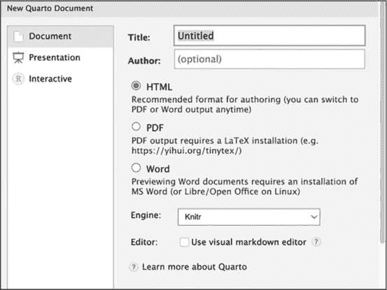
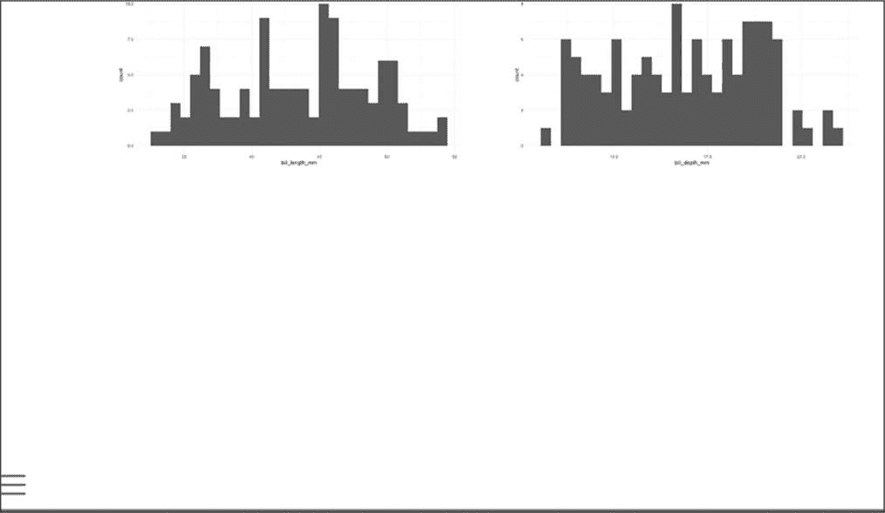
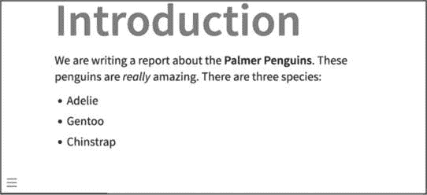
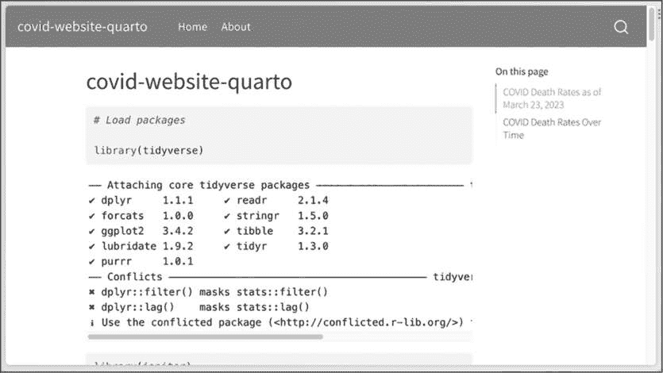
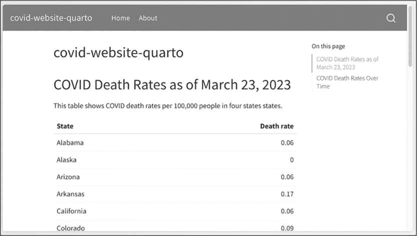
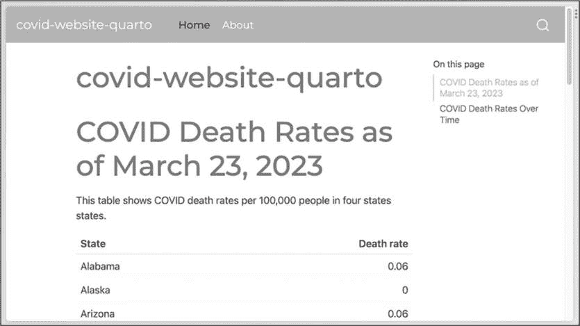
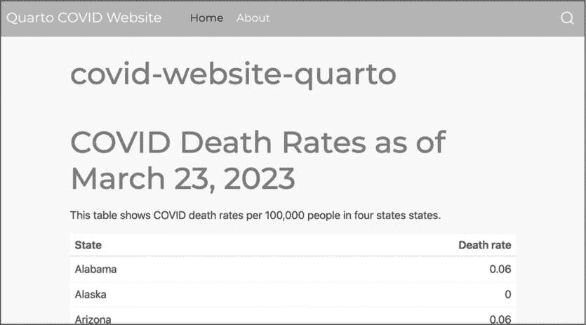
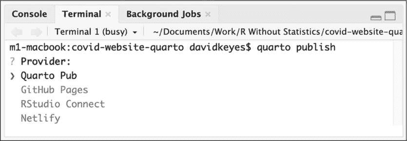
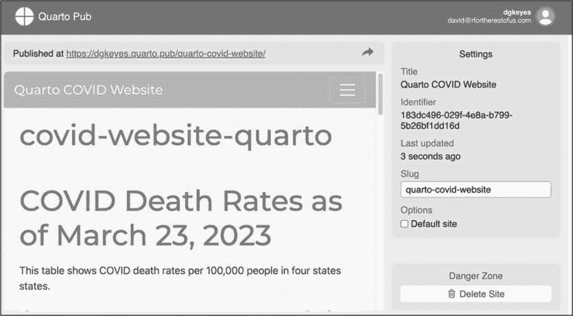

## 10 QUARTO


Quarto，作为 R Markdown 的下一代版本，提供了一些相较于其前身的优势。首先，Quarto 在不同输出类型之间的语法更加一致。如你在本书中所看到的，R Markdown 文档可能使用各种不同的约定；例如，xaringan 使用三个破折号表示新的一页，这在其他输出格式中会生成一条水平线，而 distill 包则有一些布局选项，在 xaringan 中无法使用。

Quarto 还支持比 R Markdown 更多的语言，并且支持多个代码编辑器。虽然 R Markdown 专为 RStudio IDE 设计，但 Quarto 不仅可以在 RStudio 中使用，还可以在 Visual Studio (VS) Code 和 JupyterLab 等代码编辑器中使用，使其能够轻松支持多种语言。

本章重点介绍了作为 R 用户使用 Quarto 的好处。它解释了如何设置 Quarto，然后讲解了 Quarto 和 R Markdown 之间的一些最重要的区别。最后，你将学习如何使用 Quarto 来生成前几章中涉及的参数化报告、演示文稿和网站。

### 创建 Quarto 文档

从 2022.07.1 开始的 RStudio 版本已预装 Quarto。要检查你的 RStudio 版本，点击顶部菜单栏中的**RStudio****关于 RStudio**。如果你的 RStudio 版本较旧，请按照第一章中的步骤重新安装以进行更新，这样 Quarto 应该就会被安装了。

安装 Quarto 后，点击**文件****新建文件****Quarto 文档**来创建文档。你应该看到一个菜单，如图 10-1 所示，类似于创建 R Markdown 文档时使用的菜单。



图 10-1：用于创建新 Quarto 文档的 RStudio 菜单

给文档指定一个标题，并选择输出格式。Engine 选项允许你选择不同的文档渲染方式。默认情况下，它使用 Knitr，这是 R Markdown 使用的相同渲染工具。Use Visual Markdown Editor 选项提供了一个更像 Microsoft Word 的界面，但它可能会有些问题，因此我在这里不会详细介绍。

生成的 Quarto 文档应包含默认内容，就像 R Markdown 文档一样：

```
title: "My Report"
format: html

## Quarto

Quarto enables you to weave together content and executable code into a
finished document. To learn more about Quarto see <https://quarto.org>.

## Running Code

When you click the **Render** button a document will be generated that includes
both content and the output of embedded code. You can embed code like this:

```{r}

1 + 1

```

You can add options to executable code like this:

```{r}

#| echo: false

2 * 2

```
The `echo: false` option disables the printing of code (only output is displayed). 
```

尽管 R Markdown 和 Quarto 有许多相似的功能，但它们也有一些需要注意的差异。

### 比较 R Markdown 和 Quarto

Quarto 和 R Markdown 文档有相同的基本结构——YAML 元数据，后面跟着 Markdown 文本和代码块的组合——但它们在语法上有一些差异。

#### 格式和执行 YAML 字段

Quarto 在其 YAML 中使用了稍微不同的选项。它将 output 字段替换为 format 字段，并使用 html 代替 html_document：

```
---
title: "My Report"
format: html
--- 
```

其他 Quarto 格式与它们的 R Markdown 对应格式使用了不同的名称，例如，使用 docx 代替 word_document，使用 pdf 代替 pdf_document。所有可能的格式可以在*[`quarto.org/docs/guide/`](https://quarto.org/docs/guide/)*找到。

R Markdown 和 Quarto 语法之间的第二个区别是，Quarto 不使用一个 setup 代码块来设置显示代码、图表和其他元素的默认选项。在 Quarto 中，这些选项是在 YAML 的 execute 字段中设置的。例如，以下代码会隐藏代码，以及所有警告和信息，从渲染后的文档中去除：

```
---
title: "My Report"
format: html
execute:
  echo: false
  warning: false
  message: false
--- 
```

Quarto 还允许你将 true 和 false 写成小写字母。

#### 单个代码块选项

在 R Markdown 中，你可以通过在代码块开始的花括号内添加新的选项来覆盖单个代码块级别的选项。例如，以下代码会显示 2 * 2 和它的输出：

```
```{r echo = TRUE}

2 * 2

``` 
```

Quarto 则使用这种语法来设置单个代码块级别的选项：

```
```{r}

#| echo: false

2 * 2

``` 
```

该选项是在代码块本身内设置的。行首的字符 #|（称为 *hash pipe*）表示你正在设置选项。

#### 选项名称中的连字符

从 R Markdown 切换到 Quarto 时，你可能会看到的另一个区别是，包含两个单词的选项名称用连字符而不是句点分隔。例如，R Markdown 使用代码块选项 fig.height 来指定图形的高度。而 Quarto 使用 fig-height，如下所示：

```
```{r}

#| fig-height: 10

library(palmerpenguins)

library(tidyverse)

ggplot(

penguins,

aes(

x = bill_length_mm,

    y = bill_depth_mm

)

) +

geom_point()

``` 
```

对于从 R Markdown 转过来的人来说，fig.height 和类似的包含句点的选项仍然会继续有效，即使你忘记进行转换。所有代码块选项的列表可以在 Quarto 网站上找到，链接为 *[`quarto.org/docs/reference/cells/cells-knitr.xhtml`](https://quarto.org/docs/reference/cells/cells-knitr.xhtml)*。

#### 渲染按钮

你可以按照与 R Markdown 相同的过程来渲染 Quarto 文档，但在 Quarto 中，按钮被称为 Render，而不是 Knit。点击 Render 会将 Quarto 文档转换为 HTML 文件、Word 文档或任何其他你选择的输出格式。

### 参数化报告

现在你已经了解了 Quarto 的一些基本操作，接下来你将使用它制作几个不同的文档，从参数化报告开始。用 Quarto 制作参数化报告的过程几乎与用 R Markdown 完成相同。事实上，你可以通过复制 *.Rmd* 文件，将其扩展名改为 *.qmd*，然后做一些其他调整，将你用来制作 Urban Institute COVID 报告的 R Markdown 文档直接适配到 Quarto：第七章中提到的文档。

```
---
title: "Urban Institute COVID Report"
format: html ❶
params:
  state: "Alabama"
execute: ❷
  echo: false
  warning: false
  message: false
---

```{r}

library(tidyverse)

library(urbnthemes)

library(scales)

```

# `r params$state`

```{r}

cases <- tibble(state.name) %>%

rbind(state.name = "District of Columbia") %>%

left_join(

    read_csv("https://data.rfortherestofus.com/united_states_covid19_cases_deaths

    _and_testing_by_state.csv", skip = 2),

    by = c("state.name" = "State/Territory")

) %>%

select(

    total_cases = `总病例数`,

    state.name,

    cases_per_100000 = `每 10 万人病例率`

) %>%

mutate(cases_per_100000 = parse_number(cases_per_100000)) %>%

mutate(case_rank = rank(-cases_per_100000, ties.method = "min"))

```

```{r}

state_text <- if_else(params$state == "District of Columbia", str_glue("the District of

Columbia"), str_glue("state of {params$state}"))

state_cases_per_100000 <- cases %>%

filter(state.name == params$state) %>%

pull(cases_per_100000) %>%

comma()

state_cases_rank <- cases %>%

filter(state.name == params$state) %>%

pull(case_rank)

```

In `r state_text`, there were `r state_cases_per_100000` cases per 100,000 people in the last
seven days. This puts `r params$state` at number `r state_cases_rank` of 50 states and the
District of Columbia.

```{r}

#| fig-height: 8 ❸

set_urbn_defaults(style = "print")

cases %>%

mutate(highlight_state = if_else(state.name == params$state, "Y", "N")) %>%

mutate(state.name = fct_reorder(state.name, cases_per_100000)) %>%

ggplot(aes(

    x = cases_per_100000,

    y = state.name,

    fill = highlight_state

)) +

geom_col() +

scale_x_continuous(labels = comma_format()) +

theme(legend.position = "none") +

labs(

    y = NULL,

    x = "每 10 万人病例数"

)

``` 
```

这段代码将输出格式从: html_document 切换为格式: html ❶，然后移除设置代码块，并在 YAML 的 execute 字段中设置这些选项 ❷。最后，最后一个代码块中的 fig.height 选项被替换为 fig-height，并用哈希管道符标记为选项 ❸。

接下来，要为每个州创建一个报告，你需要调整在第七章中用于生成参数化报告的 *render.R* 脚本文件：

```
# Load packages
library(tidyverse)
❶ library(quarto)

# Create a vector of all states and the District of Columbia
state <- tibble(state.name) %>%
  rbind("District of Columbia") %>%
  pull(state.name)

# Create a tibble with information on the:
# input R Markdown document
# output HTML file
# parameters needed to knit the document
reports <- tibble(
❷ input = "urban-covid-budget-report.qmd",
  output_file = str_glue("{state}.xhtml"),
❸ execute_params = map(state, ~list(state = .))
)

# Generate all of our reports
reports %>%
❹ pwalk(quarto_render) 
```

这个更新后的 *render.R* 文件加载了 quarto 包，而不是 rmarkdown 包 ❶，并将输入文件更改为 *urban-covid-budget-report.qmd* ❷。报告的数据框使用 execute_params 代替 params ❸，因为这是 quarto_render() 函数期望的参数。为了生成报告，quarto_render() 函数替代了 markdown 包中的 render() 函数 ❹。如同第七章中的方法，运行这段代码应该会为每个州生成报告。

### 制作演示文稿

Quarto 还可以生成类似于你在第八章中使用 xaringan 包制作的幻灯片演示文稿。要使用 Quarto 创建演示文稿，请点击**文件****新建文件****Quarto 演示文稿**。选择 **Reveal JS** 来制作幻灯片，并保持引擎和编辑器选项不变。

你将制作的幻灯片使用了 reveal.js JavaScript 库，这与使用 xaringan 制作幻灯片的方法类似。以下代码更新了你在第八章中制作的演示文稿，使其可以与 Quarto 一起使用：

```
---
title: "Penguins Report"
author: "David Keyes"
format: revealjs
execute:
  echo: false
  warning: false
  message: false
---

# Introduction

```{r}

library(tidyverse)

```

```{r}

penguins <- read_csv("https://raw.githubusercontent.com/rfortherestofus/r-without-statistics/

main/data/penguins-2008.csv")

```

We are writing a report about the **Palmer Penguins**. These penguins are *really* amazing.
There are three species:

- Adelie
- Gentoo
- Chinstrap

## Bill Length

We can make a histogram to see the distribution of bill lengths.

```{r}

penguins %>%

ggplot(aes(x = bill_length_mm)) +

geom_histogram() +

theme_minimal()

```

```{r}

average_bill_length <- penguins %>%

summarize(avg_bill_length = mean(

    bill_length_mm,

    na.rm = TRUE

)) %>%

pull(avg_bill_length)

```

The chart shows the distribution of bill lengths. The average bill length is
`r average_bill_length` millimeters. 
```

这段代码在 YAML 中设置了 format: revealjs 来制作演示文稿，并在执行部分添加了多个全局代码块选项。然后，它移除了用于制作幻灯片分隔的三个破折号，因为在 Quarto 中，一级或二级标题会自动生成新的幻灯片（尽管你仍然可以使用三个破折号手动添加幻灯片分隔）。渲染这段代码后，你应该会得到一个包含幻灯片的 HTML 文件。输出应类似于第八章中默认的 xaringan 幻灯片。

#### 逐步显示内容

Quarto 幻灯片可以逐步显示内容。要让项目符号和编号列表默认逐项显示，可以将 incremental: true 添加到文档的 YAML 部分，如下所示：

```
---
title: "Penguins Report"
author: "David Keyes"
format:
  revealjs:
 **incremental: true**
execute:
  echo: false
  warning: false
  message: false
--- 
```

由于这段代码，演示文稿中的所有列表内容应会逐项出现在幻灯片上。

你也可以使用这种格式，仅让某些列表项逐步显示：

```
::: {.incremental}
- Adelie
- Gentoo
- Chinstrap
::: 
```

使用:::来开始和结束文档的一个部分，会在生成的 HTML 文件中创建一个称为*div*的部分。HTML 中的<div>标签允许你在该部分内定义属性。在这段代码中，添加{.incremental}设置了一个自定义 CSS 类，能让列表逐步显示。

#### 对齐内容并添加背景图片

你也可以使用<div>标签在 Quarto 幻灯片中创建列。例如，假设你想要创建一个包含两列内容的幻灯片，如图 10-2 所示。



图 10-2：使用<div>标签创建两列

以下代码创建了这张两列幻灯片：

```
:::: {.columns}

::: {.column width="50%"}
```{r}

penguins %>%

ggplot(aes(x = bill_length_mm)) +

geom_histogram() +

theme_minimal()

```

:::

::: {.column width="50%"}
```{r}

penguins %>%

ggplot(aes(x = bill_depth_mm)) +

geom_histogram() +

theme_minimal()

```

:::

:::: 
```

注意:::以及::::，它们创建了嵌套的<div>部分。columns 类告诉 HTML，所有位于::::内的内容应按列布局。接着，::: {.column width="50%"}开始了一个占据幻灯片一半宽度的<div>。闭合的:::和::::表示该部分的结束。

在使用 xaringan 时，你可以通过将内容包围在.center[]中轻松地将其居中显示在幻灯片上。而在 Quarto 中，居中稍微复杂一些。Quarto 没有内建的 CSS 类来居中内容，因此你需要自己创建一个。首先开始一个 CSS 代码块，并创建一个名为 center-slide 的自定义类：

```
```{css}

.center-slide {

    text-align: center;

}

``` 
```

这个 CSS 会将所有内容居中对齐。（text-align 属性也会对图片进行对齐，而不仅仅是文本。）

要应用新的 center-slide 类，请将其放置在幻灯片标题旁，如下所示：

```
## Bill Length {.center-slide} 
```

应用自定义 CSS 后，幻灯片现在应该能将所有内容居中显示。

最后，在 xaringan 中工作时，你可以给幻灯片添加背景图片。要在 Quarto 中做同样的事，可以将 background-image 属性应用到幻灯片中，如下所示：

```
## Penguins {background-image="penguins.jpg"} 
```

这应当在选定的图片前添加一个包含文本 *Penguins* 的幻灯片。

#### 使用主题和 CSS 自定义你的幻灯片

你已经开始对 Quarto 幻灯片的外观和感觉进行一些更改，但你可以在设计中加入更多自定义内容。与 xaringan 类似，有两种主要方法可以进一步自定义 Quarto 幻灯片：使用现有主题和更改 CSS。

主题是更改幻灯片设计的最简单方法。在 Quarto 中应用主题，只需将其名称添加到你的 YAML 中：

```
---
title: "Penguins Report"
format:
  revealjs:
    **theme: dark**
--- 
```

使用此选项应将主题从浅色（默认）切换为深色。你可以在图 10-3 中看到应用了深色主题的标题幻灯片。要查看所有可用主题的完整列表，请访问 *[`quarto.org/docs/presentations/revealjs/themes.xhtml`](https://quarto.org/docs/presentations/revealjs/themes.xhtml)*。


图 10-3：应用了深色主题的幻灯片

更改幻灯片设计的第二个选项是编写自定义 CSS。Quarto 使用一种名为 Sass 的 CSS 类型，允许你在 CSS 中包含变量。这些变量与 xaringanthemer 包中的变量类似，后者允许你使用 header_h2_font_size 和 header_color 来设置标题格式的值。

转到**文件****新建文件****新建文本文件**，创建一个名为 *theme.scss* 的 Sass 文件，并添加以下两个必填部分：

```
/*-- scss:defaults --*/

/*-- scss:rules --*/ 
```

scss:defaults 部分是你使用 Quarto Sass 变量的地方。例如，要更改一级标题的颜色和大小，可以添加以下代码：

```
/*-- scss:defaults --*/
$presentation-heading-color: red;
$presentation-h1-font-size: 150px;

/*-- scss:rules --*/ 
```

所有 Quarto Sass 变量都以美元符号开始，后跟变量名称。要将这些调整应用到幻灯片中，可以调整 YAML 告诉 Quarto 使用自定义的 *theme.scss* 文件：

```
---
title: "Penguins Reports"
format:
  revealjs:
 **theme: theme.scss**
--- 
```

图 10-4 展示了应用于渲染幻灯片的更改。



图 10-4：使用自定义 CSS 修改的幻灯片

所有预定义的变量应放在 scss:defaults 部分。你可以在*[`quarto.org/docs/presentations/revealjs/themes.xhtml#sass-variables`](https://quarto.org/docs/presentations/revealjs/themes.xhtml#sass-variables)*找到这些变量的完整列表。

scss:rules 部分是你可以添加没有现成变量的 CSS 调整的地方。例如，你可以将编写的使幻灯片内容居中的代码放在该部分：

```
/*-- scss:defaults --*/
$presentation-heading-color: red;
$presentation-h1-font-size: 150px;

/*-- scss:rules --*/
.center-slide {
  text-align: center;
} 
```

因为渲染后的 Quarto 幻灯片是 HTML 文档，你可以通过自定义 CSS 对其进行调整。更重要的是，由于幻灯片使用 reveal.js 作为底层技术，任何嵌入该 JavaScript 库的功能在 Quarto 中都能使用。这个库包括了添加过渡效果、动画、互动内容等许多简便的方式。位于*[`quarto.org/docs/presentations/revealjs/demo/`](https://quarto.org/docs/presentations/revealjs/demo/)*的 Quarto 演示展示了这些功能的实际应用。

### 制作网站

Quarto 可以在不使用 distill 等外部包的情况下创建网站。要创建 Quarto 网站，请进入**File****New Project**，选择**New Directory**，然后选择**Quarto Website**。系统会提示你选择一个目录来存放你的项目。保持默认的引擎（Knitr），勾选**Create a Git Repository**（仅在你已经安装了 Git 时才会显示），并保持其他选项不选中。

点击**Create Project**，这将创建一系列文件：*index.qmd*、*about.qmd*、*._quarto.yml* 和 *styles.css*。这些文件与 distill 包创建的文件类似。*.qmd* 文件是你添加内容的地方，*._quarto.yml* 文件是你设置整个网站选项的地方，而 *styles.css* 文件是你添加 CSS 来自定义网站外观的地方。

#### 构建网站

你将从修改*.qmd*文件开始。打开首页文件（*index.qmd*），删除 YAML 后的默认内容，并用你在第九章中制作的网站内容替换它。删除 layout = "l-page" 元素，这是你用来扩展布局的。我将在本节稍后讨论如何在 Quarto 中更改页面布局。

要渲染一个 Quarto 网站，请在 RStudio 的右上角查找“Build”选项卡并点击**Render Website**。渲染后的网页现在应出现在 RStudio 右下角的“Viewer”窗格中。如果你切换到同一面板上的“Files”窗格，你应该也能看到一个*._site* 文件夹已被创建，用来存放渲染网站的内容。试着在你的浏览器中打开*index.xhtml*文件，你应该能看到网站，参考图 10-5。



图 10-5：带有警告和消息的 Quarto 网站

如你所见，网页中包含了许多你不希望显示的警告和消息。在 R Markdown 中，你可以在设置代码块中移除这些内容；在 Quarto 中，你可以在 YAML 中进行设置。将以下代码添加到*index.qmd*的 YAML 中，以移除输出中的所有代码、警告和消息：

```
execute:
  echo: false
  warning: false
  message: false 
```

然而，请注意，这些选项只会影响单个文件。接下来，你将看到如何为整个网站设置这些选项。

#### 设置选项

当使用 distill 时，你修改了*._site.yml*文件来更改网站中的所有文件。在 Quarto 中，你使用*._quarto.yml*文件来达到同样的目的。如果你打开它，你应该能看到三个部分：

```
Project:
  type: website

website:
  title: "covid-website-quarto"
  navbar:
    left:
      - href: index.qmd
        text: Home
      - about.qmd

format:
  html:
    theme: cosmo
    css: styles.css
    toc: true 
```

顶部部分设置了项目类型（在此案例中是网站）。中间部分定义了网站的标题并确定其导航栏的选项。底部部分则修改了网站的外观。

你将从底部开始。为了移除网站中每一页的代码、警告和消息，将你之前写的那部分 YAML 添加到*._quarto.yml*文件中。底部部分现在应该像这样：

```
format:
  html:
    theme: cosmo
    css: styles.css
    toc: true
**execute:**
 **echo: false**
 **warning: false**
 **message: false** 
```

如果你再次构建网站，现在你应该只看到内容，参考图 10-6。



图 10-6：移除警告和消息后的网站

在 *_quarto.yml* 文件的这一部分，你可以添加任何原本应放在单个 *.qmd* 文件中的选项，使它们应用到网站的所有页面。

#### 更改网站外观

*_quarto.yml* 文件中的格式部分决定了渲染文件的外观。默认情况下，Quarto 应用名为 cosmo 的主题，但有许多其他主题可供选择。（你可以在 *[`quarto.org/docs/output-formats/html-themes.xhtml`](https://quarto.org/docs/output-formats/html-themes.xhtml)* 查看完整列表。）要查看不同主题对输出的影响，可以进行如下更改：

```
format:
  html:
    **theme: minty**
    css: styles.css
    toc: true 
```

minty 主题会更改网站的字体，并将配色方案更新为灰色和浅绿色。

除了使用预构建的主题外，你还可以通过 CSS 自定义你的网站。*_quarto.yml* 文件中的 css: styles.css 部分表示 Quarto 在渲染时将使用 *styles.css* 文件中的任何 CSS。尝试将以下 CSS 添加到 *styles.css* 中，使一级标题为红色并且字体大小为 50 像素：

```
h1 {
  color: red;
  font-size: 50px;
} 
```

重新渲染的 *index.xhtml* 现在有了大号红色标题（在 图 10-7 中以灰度显示）。



图 10-7：应用自定义 CSS 后的网站

自定义网站的另一种方法是使用 *.scss* 文件中的 Sass 变量，正如你在演示中所做的那样。例如，创建一个名为 *styles.scss* 的文件，并添加如下代码行，将页面背景设置为明亮的黄色：

```
/*-- scss:defaults --*/
$body-bg: #eeeeee; 
```

要让 Quarto 使用 *styles.scss* 文件，请按如下方式调整主题行：

```
format:
  html:
    **theme: [minty, styles.scss]**
    css: styles.css
    toc: true 
```

该语法告诉 Quarto 使用 minty 主题，然后根据 *styles.scss* 文件进行额外调整。如果你重新渲染网站，你应该会看到整个页面都有明亮的黄色背景（图 10-8，在打印版中为灰度）。



图 10-8：通过 styles.scss 应用自定义 CSS 后的网站

请注意，当你添加 *.scss* 文件时，*styles.css* 文件中所做的调整将不再适用。如果你想使用那些调整，需要将它们添加到 *styles.scss* 文件中。

toc: true 这一行会在网页的右侧创建一个目录（你可以在 图 10-5 到 10-7 中看到，标记为“本页内容”）。你可以通过将 true 改为 false 来移除目录。在 *_quarto.yml* 文件的底部部分添加任何其他选项，例如图像高度。

#### 调整标题和导航栏

*_quarto.yml* 文件的中间部分设置了网站的标题和导航。按如下方式更改标题和关于页面链接的文本：

```
website:
  title: "Quarto COVID Website"
  navbar:
    left:
      - href: index.qmd
        text: Home
      - href: about.qmd
        text: About This Website 
```

更改标题需要调整标题行。导航栏部分的功能几乎与 distill 中相同。href 行列出了导航栏应该链接的文件。可选的文本行指定该链接应显示的文本。图 10-9 展示了这些更改应用到网站的情况。


图 10-9：导航栏的更改

首页的标题仍然是 covid-website-quarto，但你可以在*index.qmd*文件中修改它。

#### 创建更宽的布局

当你使用 distill 创建网站时，你使用了 layout = "l-page" 来使地图在网页上变得更宽。你可以通过使用 ::: 语法添加 HTML <div> 标签来在 Quarto 中实现相同的效果：

```
:::{.column-screen-inset}
```{r}

#| out-width: 100%

# 创建地图

most_recent <- us_states %>%

left_join(covid_data, by = "state") %>%

slice_max(

    order_by = date,

    n = 1

)

most_recent %>%

ggplot(aes(fill = deaths_avg_per_100k)) +

geom_sf() +

scale_fill_viridis_c(option = "rocket") +

labs(fill = "每 10 万人死亡数") +

theme_void()

```
::: 
```

这段代码在地图生成代码块的开始处添加了 :::{.column-screen-inset}，并在结束处添加了 :::。这个代码块现在还包含了行 #| out-width: 100%，用于指定地图应占据所有可用宽度。如果没有这一行，地图只会占据窗口的一部分。你可以使用许多不同的输出宽度；完整的列表可以查看 *[`quarto.org/docs/authoring/article-layout.xhtml`](https://quarto.org/docs/authoring/article-layout.xhtml)*。

#### 托管网站到 GitHub Pages 和 Quarto Pub

你可以像托管 distill 网站一样，使用 GitHub Pages 托管你的 Quarto 网站。回顾一下，GitHub Pages 要求你将网站的文件保存在*docs*文件夹中。修改*_quarto.yml*文件，使得网站输出到该文件夹：

```
project:
  type: website
 **output-dir: docs** 
```

现在，当你渲染网站时，HTML 和其他文件应出现在*docs*目录中。此时，你可以将仓库推送到 GitHub，像在第九章中一样调整 GitHub Pages 设置，并查看你 Quarto 网站的 URL。

作为 GitHub Pages 的替代方案，Quarto 提供了一个免费的服务叫做 Quarto Pub，它使得将你的资料发布到网上变得非常容易。如果你不是 GitHub 用户，这是发布你作品的一个不错选择。为了查看它是如何工作的，你将把刚刚创建的网站发布到它上面。在 RStudio 的左下角面板中点击**Terminal**标签页。在提示符下，输入 quarto publish。这样会显示出一些发布你网站的方式，如图 10-10 所示。



图 10-10：发布 Quarto 网站的提供者列表

按 **Enter** 键选择 Quarto Pub。系统会提示你授权 RStudio 发布到 Quarto Pub。输入 **Y** 进行授权，这将带你到 *[`quartopub.com`](https://quartopub.com)*。注册一个账户（如果已经有账户则直接登录）。你应该看到一个屏幕，显示你已成功登录并授权 RStudio 连接到 Quarto Pub。从那里，你可以返回 RStudio，系统将提示你为网站选择一个名称。最简单的选项是使用你的项目名称。一旦输入名称，Quarto Pub 应该会发布该网站并带你到网站，正如在图 10-11 中所示。



图 10-11：发布在 Quarto Pub 上的网站

当你更新网站时，可以使用相同的步骤将其重新发布到 Quarto Pub。Quarto Pub 可能是发布 Quarto 制作的 HTML 文件的最简单方法。

### 总结

正如你在本章中所看到的，你可以使用 Quarto 做所有在 R Markdown 中做的事情，而不需要加载任何外部包。此外，Quarto 的不同输出格式使用更一致的语法。例如，因为你可以通过添加一级或二级标题在 Quarto 中制作新幻灯片，所以你用来创建报告的 Quarto 文档应该能够轻松转化为演示文稿。

你现在可能在想，究竟应该使用 R Markdown 还是 Quarto？这是一个好问题，也是许多 R 社区成员在思考的问题。R Markdown 不会消失，所以如果你已经在使用它，完全不需要切换。然而，如果你是 R 的新手，你可能是使用 Quarto 的理想人选，因为其未来的功能可能不会回溯到 R Markdown。

最终，R Markdown 和 Quarto 之间的差异相对较小，切换工具的影响应该是微乎其微的。R Markdown 和 Quarto 都可以帮助你提高效率，避免手动错误，并以各种格式分享结果。

### 其他资源

+   Andrew Bray，Rebecca Barter，Silvia Canelón，Christophe Dervieu，Devin Pastor 和 Tatsu Shigeta，“从 R Markdown 到 Quarto”，来自 rstudio::conf 2022 的研讨会材料，华盛顿特区，2022 年 7 月 25-26 日，* [`rstudio-conf-2022.github.io/rmd-to-quarto/`](https://rstudio-conf-2022.github.io/rmd-to-quarto/)*。

+   Tom Mock，“Quarto 入门”，在线课程，访问日期：2023 年 12 月 1 日，* [`jthomasmock.github.io/quarto-in-two-hours/`](https://jthomasmock.github.io/quarto-in-two-hours/)*。
