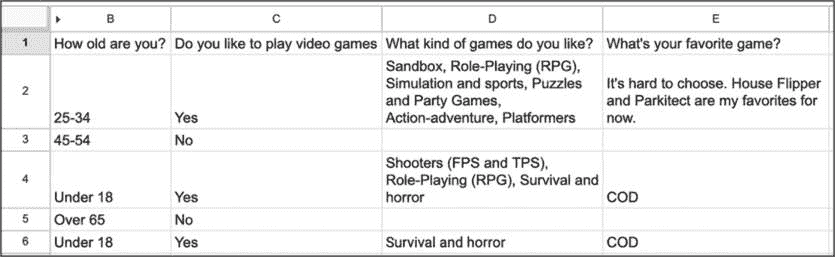
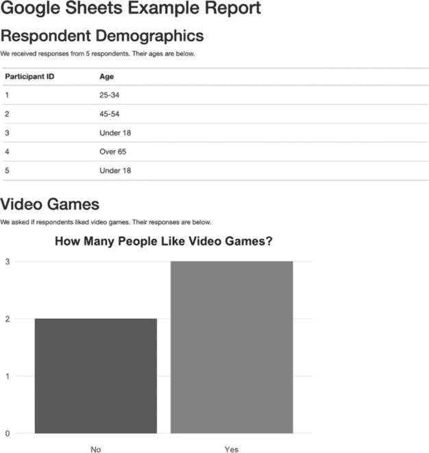
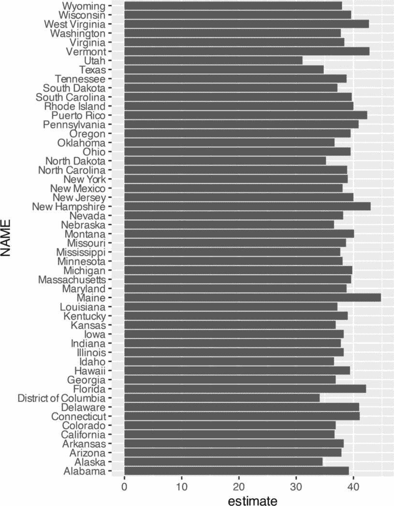
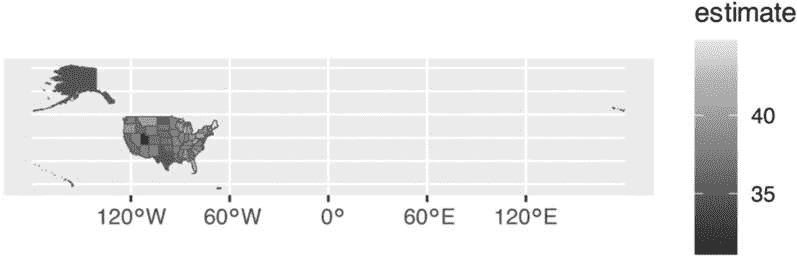
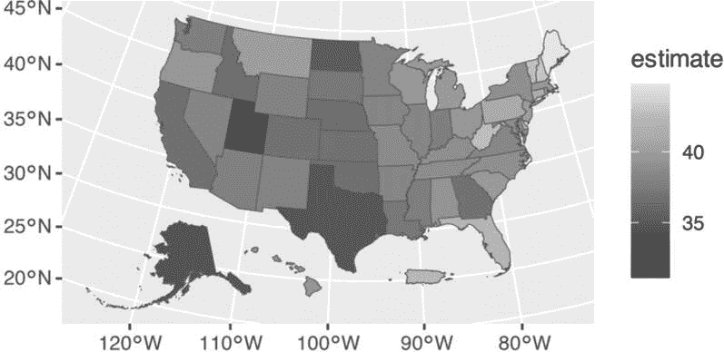

<hgroup>

## 11 自动访问在线数据

</hgroup>


到目前为止，你已经从 CSV 文件中将数据导入到项目中。许多在线数据集允许你导出 CSV 文件，但在此之前，你应该查找能够自动化数据访问的包。如果你能消除获取数据过程中手动的步骤，你的分析和报告将更加准确。同时，当数据发生变化时，你也能够高效地更新报告。

R 提供了多种方法来自动化访问在线数据的过程。在本章中，我将讨论两种方法。首先，你将使用 googlesheets4 包直接从 Google Sheets 中获取数据。你将学习如何将 R Markdown 项目连接到 Google，这样当 Google Sheet 更新时，你就可以自动下载数据。接下来，你将使用 tidycensus 包访问美国人口普查局的数据。你将处理两个大型人口普查数据集——十年人口普查和美国社区调查，并进行可视化练习。

### 使用 googlesheets4 从 Google Sheets 导入数据

通过使用 googlesheets4 包直接访问 Google Sheets 中的数据，你无需手动下载数据、将其复制到项目中，并调整代码以便每次更新报告时导入新数据。这个包让你编写代码，自动从 Google Sheets 获取新数据。每当你需要更新报告时，只需运行代码来刷新数据。此外，如果你使用 Google 表单，你可以将数据导入 Google Sheets，从而完全自动化从数据收集到数据导入的工作流程。

使用 googlesheets4 包可以帮助你管理频繁更新的复杂数据集。例如，在她位于布法罗大学初级护理研究所的工作中，Meghan Harris 使用该包进行了一项关于受阿片类药物使用障碍影响的人的研究项目。数据来自各种调查，所有调查的数据汇总在一堆 Google Sheets 中。通过使用 googlesheets4，Harris 能够将所有数据集中到一个地方，并使用 R 对其进行处理。曾经由于访问复杂而基本未被使用的数据，现在可以为阿片类药物使用障碍的研究提供信息。

本节演示了如何使用 googlesheets4 包，通过一个关于视频游戏偏好的假数据集（Harris 用它替代了她的阿片类药物调查数据，后者由于显而易见的原因是保密的）来展示该包的工作原理。

#### 连接到 Google

首先，通过运行 install.packages("googlesheets4") 安装 googlesheets4 包。接着，通过在控制台运行 gs4_auth() 函数连接到你的 Google 账户。如果你有多个 Google 账户，选择一个可以访问你要使用的 Google Sheet 的账户。

一旦完成，屏幕应该会显示出来。在 **See, Edit, Create, and Delete All Your Google Sheets Spreadsheets** 旁边勾选框，这样 R 就可以访问你的 Google Sheets 数据。点击 **Continue**，你应该会看到“认证完成。请关闭此页面并返回 R”的消息。googlesheets4 包现在会保存你的认证信息，以便将来使用时无需重新认证。

#### 从表格中读取数据

现在，你已经将 R 连接到你的 Google 账户，可以导入 Harris 创建的关于视频游戏偏好的虚拟数据（可以通过 *[`data.rfortherestofus.com/google-sheet`](https://data.rfortherestofus.com/google-sheet)* 访问）。图 11-1 显示了它在 Google Sheets 中的样子。



图 11-1：Google Sheets 中的视频游戏数据

googlesheets4 包提供了一个名为 read_sheet() 的函数，可以直接从 Google Sheets 中提取数据。通过将电子表格的 URL 传递给该函数来导入数据，如下所示：

```
library(googlesheets4)

survey_data_raw <- read_sheet("https://docs.google.com/spreadsheets/d/
1AR0_RcFBg8wdiY4Cj-k8vRypp_txh27MyZuiRdqScog/edit?usp=sharing") 
```

查看 survey_data_raw 对象，确认数据已成功导入。使用 dplyr 包中的 glimpse() 函数可以更轻松地阅读：

```
library(tidyverse)

survey_data_raw %>%
  glimpse() 
```

glimpse() 函数为每个变量创建一行输出，显示你已经成功直接从 Google Sheets 导入了数据：

```
#> Rows: 5
#> Columns: 5
#> $ Timestamp                          <dttm> 05-16 15:20:50
#> $ `How old are you?`                 <chr> "25-34", "45-54"...
#> $ `Do you like to play video games?` <chr> "Yes", "No", "Ye...
#> $ `What kind of games do you like?`  <chr> "Sandbox, Role-P...
#> $ `What's your favorite game?`       <chr> "It's hard to ch... 
```

一旦将数据导入到 R 中，你可以使用你一直在使用的相同工作流来创建 R Markdown 报告。

#### 在 R Markdown 中使用数据

以下代码摘自 Harris 为总结视频游戏数据所编写的 R Markdown 报告。你可以看到 YAML、设置代码块、加载包的代码块以及从 Google Sheets 导入数据的代码：

```
---
title: "Video Game Survey"
output: html_document
---

```{r setup, include=FALSE}

knitr::opts_chunk$set(echo = FALSE,

                    warning = FALSE,

                    message = FALSE)

```

```{r}

library(tidyverse)

library(janitor)

library(googlesheets4)

library(gt)

```

```{r}

# 从 Google Sheets 导入数据

❶ survey_data_raw <- read_sheet("https://docs.google.com/spreadsheets/d/

1AR0_RcFBg8wdiY4Cj-k8vRypp_txh27MyZuiRdqScog/edit?usp=sharing")

``` 
```

这个 R Markdown 文档与之前章节讨论的文档类似，不同之处在于你导入数据的方式 ❶。由于你是直接从 Google Sheets 导入数据，因此不会有例如错误地读取了错误的 CSV 文件的风险。自动化这一步骤可以减少错误的风险。

接下来的代码块清理了 survey_data_raw 对象，并将结果保存为 survey_data_clean：

```
```{r}

# 清理数据

survey_data_clean <- survey_data_raw %>%

clean_names() %>%

mutate(participant_id = as.character(row_number())) %>%

rename(

    age = how_old_are_you,

    like_games = do_you_like_to_play_video_games,

    game_types = what_kind_of_games_do_you_like,

    favorite_game = whats_your_favorite_game

) %>%

relocate(participant_id, .before = age) %>%

mutate(age = factor(age, levels = c("Under 18", "18-24", "25-34",

"35-44", "45-54", "55-64", "65 岁以上")))

``` 
```

这里，来自 janitor 包的 clean_names() 函数使得变量名称更易于处理。使用 row_number() 函数定义 participant_id 变量，然后为每一行添加一个连续增加的编号，as.character() 函数将该编号转为字符。接下来，代码使用 rename() 函数更改几个变量名。mutate() 函数将 age 变量转化为一种数据结构，称为 *factor*，这可以确保年龄在图表中按正确的顺序显示。最后，relocate() 函数将 participant_id 放置在 age 变量之前。

现在，你可以再次使用 glimpse() 函数查看更新后的 survey_data_clean 数据框，结果如下：

```
#> Rows: 5
#> Columns: 6
#> $ timestamp      <dttm> 2024-05-16 15:20:50, 2024-05-16 15:21:28, 2024-05...
#> $ participant_id <chr> "1", "2", "3", "4", "5"
#> $ age            <fct> 25-34, 45-54, Under 18, Over 65, Un...
#> $ like_games     <chr> "Yes", "No", "Yes", "No", "Yes"
#> $ game_types     <chr> "Sandbox, Role-Playing (RPG), Simul...
#> $ favorite_game  <chr> "It's hard to choose. House Flipper... 
```

剩下的报告使用这些数据来突出显示各种统计信息：

```
# Respondent Demographics

```{r}

# 计算响应者数量

number_of_respondents <- nrow(survey_data_clean) ❶

```

We received responses from `r number_of_respondents` respondents. Their ages are below.

```{r}

survey_data_clean %>%

select(participant_id, age) %>%

gt() %>% ❷

cols_label(

    participant_id = "参与者 ID",

    age = "年龄"

) %>%

tab_style(

    style = cell_text(weight = "bold"),

    locations = cells_column_labels()

) %>%

cols_align(

    align = "left",

    columns = everything()

) %>%

cols_width(

    participant_id ~ px(200),

    age ~ px(700)

)

```

# Video Games

We asked if respondents liked video games. Their responses are below.

```{r}

survey_data_clean %>%

count(like_games) %>%

ggplot(aes(

    x = like_games, ❸

    y = n,

    fill = like_games

)) +

geom_col() +

scale_fill_manual(values = c(

    "No" = "#6cabdd",

    "Yes" = "#ff7400"

)) +

labs(

    title = "有多少人喜欢电子游戏？",

    x = NULL,

    y = "参与者数量"

) +

theme_minimal(base_size = 16) +

theme(

    legend.position = "none",

    panel.grid.minor = element_blank(),

    panel.grid.major.x = element_blank(),

    axis.title.y = element_blank(),

    plot.title = element_text(

    face = "bold",

    hjust = 0.5

    )

)

``` 
```

这些部分计算了调查响应者的数量 ❶，然后将该值放入文本中，使用内联 R 代码；创建一个表格，按年龄组划分响应者 ❷；并生成一个图表，显示有多少响应者喜欢电子游戏 ❸。 图 11-2 显示了生成的报告。



图 11-2：渲染后的电子游戏报告

你可以在任何时候重新运行代码以获取更新的数据。今天调查有五个回答，但如果明天再运行，新增的回答也会被包含在导入数据中。如果你使用 Google 表单进行调查并将结果保存到 Google 表格中，只需点击 RStudio 中的 Knit 按钮，你就可以生成这个最新的报告。

#### 仅导入特定列

在前面的章节中，你读取了整个 Google 表格的数据，但你也可以选择仅导入表格的某一部分。例如，调查数据包含一个时间戳列。每当有人提交通过 Google 表单将数据导入 Google 表格时，这个变量会自动添加，但你在分析中不使用它，因此可以将其去掉。

要做到这一点，可以在导入数据时使用 read_sheet() 函数中的 range 参数，像这样：

```
read_sheet("https://docs.google.com/spreadsheets/d/1AR0_RcFBg8wdiY4Cj-k8vRypp_
txh27MyZuiRdqScog/edit?usp=sharing",
 **range = "Sheet1!B:E") %>%**
  glimpse() 
```

这个参数让你指定一个数据范围进行导入。它使用与你可能在 Google 表格中选择列时相同的语法。在这个示例中，range = "Sheet1!B:E" 导入 B 到 E 列（但不包括 A 列，因为它包含时间戳）。添加 glimpse() 然后运行这段代码会输出没有时间戳变量的结果：

```
#> Rows: 5
#> Columns: 4
#> $ `How old are you?`                 <chr> "25-34", "45-54"...
#> $ `Do you like to play video games?` <chr> "Yes", "No", "Ye...
#> $ `What kind of games do you like?`  <chr> "Sandbox, Role-P...
#> $ `What's your favorite game?`       <chr> "It's hard to ch... 
```

在 googlesheets4 包中，还有许多其他有用的功能。例如，如果你需要将输出写回 Google 表格，write_sheet() 函数可以帮助你。要探索包中的其他函数，可以访问其文档网站 *[`googlesheets4.tidyverse.org/index.xhtml`](https://googlesheets4.tidyverse.org/index.xhtml)*。

现在我们将关注另一个 R 包，它可以让你自动从美国人口普查局获取数据。

### 使用 tidycensus 访问人口普查数据

如果你曾经处理过来自美国人口普查局的数据，你就知道这有多麻烦。通常，这个过程包括访问人口普查局的网站，搜索所需的数据，下载它，然后在你选择的工具中进行分析。经过一段时间，这种点击操作会变得非常繁琐。

德克萨斯基督教大学的地理学家 Kyle Walker 和 Matt Herman（第九章中讨论的 Westchester COVID-19 网站的创建者）开发了 tidycensus 包，以自动化将人口普查局数据导入 R 的过程。使用 tidycensus，你只需要写几行代码，就能获取比如所有美国县的中位数收入数据。

在这一部分，我将通过使用两个数据集的示例来展示 tidycensus 包的工作原理，这两个数据集是该包提供访问权限的：十年一次的人口普查数据和年度美国社区调查数据。我还将向你展示如何利用这两个数据源的数据进行额外分析，并通过同时访问地理空间和人口统计数据来制作地图。

#### 使用 API 密钥连接到人口普查局

首先通过 install.packages("tidycensus") 安装 tidycensus。要使用 tidycensus，你必须从人口普查局获取一个应用程序编程接口（API）密钥。*API 密钥*就像密码，在线服务通过它来判断你是否有权限访问数据。

要获得这个免费的密钥，请访问 *[`api.census.gov/data/key_signup.xhtml`](https://api.census.gov/data/key_signup.xhtml)* 并填写你的详细信息。一旦你通过电子邮件收到密钥，你需要将它放在 tidycensus 可以找到的位置。census_api_key() 函数会为你完成这个操作，因此在加载 tidycensus 包之后，运行以下函数，并用你的实际 API 密钥替换 123456789：

```
library(tidycensus)

**census_api_key("****`123456789`****", install = TRUE)** 
```

install = TRUE 参数将你的 API 密钥保存在*.Renviron*文件中，该文件用于存储机密信息。以后包会在此文件中查找 API 密钥，这样你就不必每次使用包时都重新输入它。

现在你可以使用 tidycensus 访问人口普查局的数据集。虽然十年一度人口普查和美国社区调查是最常用的，Kyle Walker 的《分析美国人口普查数据：R 中的方法、地图和模型》第二章讨论了你可以访问的其他数据集。

#### 使用十年一度的人口普查数据

tidycensus 包包含多个专门用于特定人口普查局数据集的函数，例如 get_decennial()用于十年一度人口普查数据。要访问 2020 年关于每个州亚洲人口的数据，可以使用带有三个参数的 get_decennial()函数，如下所示：

```
get_decennial(geography = "state",
              variables = "P1_006N",
              year = 2020) 
```

将地理参数设置为“state”会告诉 get_decennial()访问州级别的数据。除了 50 个州，它还会返回哥伦比亚特区和波多黎各的数据。变量参数指定你想要访问的变量。在这里，P1_006N 是亚洲总人口的变量名。我将在下一节中讨论如何识别你可能需要使用的其他变量。最后，year 指定你想要访问数据的年份——在本例中是 2020 年。

运行此代码将返回以下内容：

```
#> # A tibble: 52 × 4
#>    GEOID NAME                 variable   value
#>    <chr> <chr>                <chr>      <dbl>
#>  1 42    Pennsylvania         P1_006N   510501
#>  2 06    California           P1_006N  6085947
#>  3 54    West Virginia        P1_006N    15109
#>  4 49    Utah                 P1_006N    80438
#>  5 36    New York             P1_006N  1933127
#>  6 11    District of Columbia P1_006N    33545
#>  7 02    Alaska               P1_006N    44032
#>  8 12    Florida              P1_006N   643682
#>  9 45    South Carolina       P1_006N    90466
#> 10 38    North Dakota         P1_006N    13213
`--snip--` 
```

结果数据框包含四个变量。GEOID 是人口普查局分配给各州的地理标识符。每个州都有一个地理标识符，所有县、普查区和其他地理区域也都有各自的标识符。NAME 是每个州的名称，variable 是你传递给 get_decennial()函数的变量名称。最后，value 是每一行中该州和变量的数值。在这种情况下，它表示每个州的亚洲总人口。

#### 识别人口普查变量值

你刚刚看到如何检索每个州的亚洲居民总数，但假设你想将这个数字计算为所有州居民的百分比。为此，首先你需要检索该州的总人口变量。

tidycensus 包有一个名为 load_variables()的函数，可以显示所有来自十年一度人口普查的变量。将 year 参数设置为 2020，dataset 设置为 pl，运行如下：

```
load_variables(year = 2020,
               dataset = "pl") 
```

运行此代码将从所谓的重划选区汇总数据文件中提取数据（根据公共法案 94-171，人口普查局每 10 年必须制作这些文件），并返回所有可用变量的名称、标签（描述）和概念（类别）：

```
#> # A tibble: 301 × 3
#>    name    label                                       concept
#>    <chr>   <chr>                                       <chr>
#>  1 H1_001N " !!Total:"                                 OCCU...
#>  2 H1_002N " !!Total:!!Occupied"                       OCCU...
#>  3 H1_003N " !!Total:!!Vacant"                         OCCU...
#>  4 P1_001N " !!Total:"                                 RACE
#>  5 P1_002N " !!Total:!!Population of one race:"        RACE
#>  6 P1_003N " !!Total:!!Population of one race:!!Whi... RACE
#>  7 P1_004N " !!Total:!!Population of one race:!!Bla... RACE
#>  8 P1_005N " !!Total:!!Population of one race:!!Ame... RACE
#>  9 P1_006N " !!Total:!!Population of one race:!!Asi... RACE
#> 10 P1_007N " !!Total:!!Population of one race:!!Nat... RACE
`--snip--` 
```

通过查看此列表，你可以看到变量 P1_001N 返回的是总人口。

#### 使用多个人口普查变量

现在你知道了需要哪些变量，可以再次使用 get_decennial()函数，一次获取两个变量：

```
get_decennial(geography = "state",
              variables = c(**"P1_001N", "P1_006N"**),
 year = 2020) %>%
  arrange(NAME) 
```

在`get_decennial()`后添加`arrange(NAME)`会按州名对结果进行排序，让你能轻松看到输出中包含每个州的这两个变量：

```
#> # A tibble: 104 × 4
#>    GEOID NAME       variable    value
#>    <chr> <chr>      <chr>       <dbl>
#>  1 01    Alabama    P1_001N   5024279
#>  2 01    Alabama    P1_006N     76660
#>  3 02    Alaska     P1_001N    733391
#>  4 02    Alaska     P1_006N     44032
#>  5 04    Arizona    P1_001N   7151502
#>  6 04    Arizona    P1_006N    257430
#>  7 05    Arkansas   P1_001N   3011524
#>  8 05    Arkansas   P1_006N     51839
#>  9 06    California P1_001N  39538223
#> 10 06    California P1_006N   6085947
`--snip--` 
```

当你处理多个类似的人口普查变量时，可能会难以记住像 P1_001N 和 P1_006N 这样的名称的含义。幸运的是，你可以调整`get_decennial()`调用中的代码，通过以下语法为这些变量赋予更有意义的名称：

```
get_decennial(geography = "state",
              variables = c(**total_population = "P1_001N",**
 **asian_population = "P1_006N"**),
year = 2020) %>%
  arrange(NAME) 
```

在变量参数中，这段代码指定了变量的新名称，后面跟着等号和原始变量名称。`c()`函数允许你一次重命名多个变量。

现在更容易看到你正在处理的变量了：

```
#> # A tibble: 104 × 4
#>    GEOID NAME       variable            value
#>    <chr> <chr>      <chr>               <dbl>
#>  1 01    Alabama    total_population  5024279
#>  2 01    Alabama    asian_population    76660
#>  3 02    Alaska     total_population   733391
#>  4 02    Alaska     asian_population    44032
#>  5 04    Arizona    total_population  7151502
#>  6 04    Arizona    asian_population   257430
#>  7 05    Arkansas   total_population  3011524
#>  8 05    Arkansas   asian_population    51839
#>  9 06    California total_population 39538223
#> 10 06    California asian_population  6085947
#> # ... with 94 more rows 
```

代替 P1_001N 和 P1_006N，变量显示为 total_population 和 asian_population。好多了！

#### 分析人口普查数据

现在你已经拥有了计算每个州亚洲人口占总人口百分比所需的数据。只需要在上一部分的代码中添加一些函数：

```
get_decennial(
  geography = "state",
  variables = c(
    total_population = "P1_001N",
    asian_population = "P1_006N"
  ),
  year = 2020
) %>%
  arrange(NAME) %>%
  group_by(NAME) %>%
  mutate(pct = value / sum(value)) %>%
  ungroup() %>%
  filter(variable == "asian_population") 
```

`group_by(NAME)`函数为每个州创建一个分组，因为你想要计算每个州的亚洲人口百分比（而不是整个美国）。然后，`mutate()`函数计算每个百分比，将每行的值除以每个州的`total_population`和`asian_population`行。`ungroup()`函数移除州级分组，`filter()`函数仅显示亚洲人口百分比。

当你运行这段代码时，你应该能看到每个州的总亚洲人口和亚洲人口占总人口的百分比：

```
#> # A tibble: 52 × 5
#>    GEOID NAME                 variable          value      pct
#>    <chr> <chr>                <chr>             <dbl>    <dbl>
#>  1 01    Alabama              asian_popula...   76660 0.015029
#>  2 02    Alaska               asian_popula...   44032 0.056638
#>  3 04    Arizona              asian_popula...  257430 0.034746
#>  4 05    Arkansas             asian_popula...   51839 0.016922
#>  5 06    California           asian_popula... 6085947 0.133390
#>  6 08    Colorado             asian_popula...  199827 0.033452
#>  7 09    Connecticut          asian_popula...  172455 0.045642
#>  8 10    Delaware             asian_popula...   42699 0.041349
#>  9 11    District of Columbia asian_popula...   33545 0.046391
#> 10 12    Florida              asian_popula...  643682 0.029018
`--snip--` 
```

这是一种合理的计算每个州亚洲人口占总人口百分比的方法——但并不是唯一的方法。

#### 使用汇总变量

Kyle Walker 知道，像你刚才做的那样计算汇总数据将是 tidycensus 的常见用例。比如，要计算亚洲人口占总人口的百分比，你需要有一个分子（亚洲人口）和一个分母（总人口）。为了简化操作，Walker 在`get_decennial()`中加入了`summary_var`参数，可以用来导入总人口作为单独的变量。你可以像下面这样将 P1_001N（总人口）分配给`summary_var`参数，而不是在变量参数中输入并重命名它：

```
get_decennial(
  geography = "state",
  variables = c(asian_population = "P1_006N"),
 **summary_var = "P1_001N",**
  year = 2020
) %>%
  arrange(NAME) 
```

这将返回一个几乎相同的数据框，只不过总人口现在是一个单独的变量，而不是每个州的额外行：

```
#> # A tibble: 52 × 5
#>    GEOID NAME                 variable         value summar...
#>    <chr> <chr>                <chr>             <dbl>    <dbl>
#>  1 01    Alabama              asian_popula...   76660  5024279
#>  2 02    Alaska               asian_popula...   44032   733391
#>  3 04    Arizona              asian_popula...  257430  7151502
#>  4 05    Arkansas             asian_popula...   51839  3011524
#>  5 06    California           asian_popula... 6085947 39538223
#>  6 08    Colorado             asian_popula...  199827  5773714
#>  7 09    Connecticut          asian_popula...  172455  3605944
#>  8 10    Delaware             asian_popula...   42699   989948
#>  9 11    District of Columbia asian_popula...   33545   689545
#> 10 12    Florida              asian_popula...  643682 21538187
`--snip--`
#> #   summary_value 
```

使用这种新格式的数据后，现在你可以通过将值变量除以 summary_value 变量来计算亚洲人口占总人口的百分比。然后，你可以删除 summary_value 变量，因为在完成此计算后你不再需要它：

```
get_decennial(
  geography = "state",
  variables = c(asian_population = "P1_006N"),
  summary_var = "P1_001N",
  year = 2020
) %>%
  arrange(NAME) %>%
 **mutate(pct = value / summary_value) %>%**
 **select(-summary_value)** 
```

结果输出与前一部分的输出完全相同：

```
#> # A tibble: 52 × 5
#>    GEOID NAME                 variable          value      pct
#>    <chr> <chr>                <chr>             <dbl>    <dbl>
#>  1 01    Alabama              asian_popula...   76660 0.015258
#>  2 02    Alaska               asian_popula...   44032 0.060039
#>  3 04    Arizona              asian_popula...  257430 0.035997
#>  4 05    Arkansas             asian_popula...   51839 0.017214
#>  5 06    California           asian_popula... 6085947 0.153930
#>  6 08    Colorado             asian_popula...  199827 0.034610
#>  7 09    Connecticut          asian_popula...  172455 0.047825
#>  8 10    Delaware             asian_popula...   42699 0.043133
#>  9 11    District of Columbia asian_popula...   33545 0.048648
#> 10 12    Florida              asian_popula...  643682 0.029886
#> # 42 more rows 
```

你选择如何计算汇总统计数据取决于你自己；tidycensus 让你无论哪种方式都能轻松实现。

### 可视化美国社区调查数据

一旦你使用 tidycensus 包访问了数据，你可以随意操作它。在这一部分，你将练习使用美国社区调查数据进行分析和可视化。该调查每年进行一次，与十年一次的人口普查相比，主要有两个区别：它是发放给一部分人群，而不是全体人口；并且它包含了更广泛的问题。

尽管有这些差异，你可以几乎以与访问十年一次人口普查数据相同的方式访问美国社区调查数据。你使用 get_acs()函数代替 get_decennial()，但传递给它的参数是相同的：

```
get_acs(
  geography = "state",
  variables = "B01002_001",
  year = 2020
) 
```

这段代码使用 B01002_001 变量从 2020 年获取每个州的中位年龄数据。以下是输出的样子：

```
#> # A tibble: 52 × 5
#>    GEOID NAME                 variable   estimate   moe
#>    <chr> <chr>                <chr>         <dbl> <dbl>
#>  1 01    Alabama              B01002_001     39.2   0.1
#>  2 02    Alaska               B01002_001     34.6   0.2
#>  3 04    Arizona              B01002_001     37.9   0.2
#>  4 05    Arkansas             B01002_001     38.3   0.2
#>  5 06    California           B01002_001     36.7   0.1
#>  6 08    Colorado             B01002_001     36.9   0.1
#>  7 09    Connecticut          B01002_001     41.1   0.2
#>  8 10    Delaware             B01002_001     41.0   0.2
#>  9 11    District of Columbia B01002_001     34.1   0.1
#> 10 12    Florida              B01002_001     42.2   0.2
`--snip--` 
```

你应该注意到，get_acs()的输出与 get_decennial()的输出有两个不同之处。首先，get_acs()生成了一个名为 estimate 的列，而不是 value 列。其次，它增加了一个名为 moe 的列，用于表示误差范围。这些变化是由于美国社区调查只发放给人群的一部分，因而从样本中推算值来生成总体估算会带来误差范围。

在州级数据中，误差范围相对较小，但在较小的地理区域中，误差通常较大。当你的误差范围相对于估算值较大时，这表示数据对整体人口的代表性存在较大不确定性，因此你应谨慎解释此类结果。

#### 制作图表

要将中位年龄数据传递给 ggplot 并创建柱状图，请添加以下代码：

```
get_acs(
  geography = "state",
  variables = "B01002_001",
  year = 2020
) %>%
  ggplot(aes(
    x = estimate,
    y = NAME
  )) +
  geom_col() 
```

使用 get_acs()函数导入数据后，ggplot()函数会将数据直接传递给 ggplot。州（使用变量 NAME）将出现在 y 轴上，中位年龄（估算值）将出现在 x 轴上。一个简单的 geom_col()创建了图 11-3 所示的柱状图。



图 11-3：使用 get_acs()函数获取数据生成的柱状图

这个图表没什么特别的，但它仅用六行代码就能创建，这一点无疑是非常特别的！

#### 使用几何参数制作人口地图

除了共同创建 tidycensus 外，Kyle Walker 还创建了 tigris 包，用于处理地理空间数据。因此，这些包紧密集成。在 get_acs()函数中，你可以将 geometry 参数设置为 TRUE，来同时获取来自人口普查局的人口统计数据和来自 tigris 的地理空间数据：

```
get_acs(
  geography = "state",
  variables = "B01002_001",
  year = 2020,
 **geometry = TRUE**
) 
```

在结果数据中，你可以看到它包含了你在第四章中看到的简单特征对象的元数据和几何列：

```
#> Simple feature collection with 52 features and 5 fields
#> Geometry type: MULTIPOLYGON
#> Dimension:     XY
#> Bounding box:  xmin: -179.1489 ymin: 17.88328 xmax: 179.7785 ymax: 71.36516
#> Geodetic CRS:  NAD83
#> First 10 features:
#>    GEOID  NAME         variable   estimate  moe
#> 1  35     New Mexico   B01002_001     38.1  0.1
#> 2  72     Puerto Rico  B01002_001     42.4  0.2
#> 3  06     California   B01002_001     36.7  0.1
#> 4  01     Alabama      B01002_001     39.2  0.1
#> 5  13     Georgia      B01002_001     36.9  0.1
#> 6  05     Arkansas     B01002_001     38.3  0.2
#> 7  41     Oregon       B01002_001     39.5  0.1
#> 8  28     Mississippi  B01002_001     37.7  0.2
#> 9  08     Colorado     B01002_001     36.9  0.1
#> 10 49     Utah         B01002_001     31.1  0.1
#>    geometry
#> 1  MULTIPOLYGON (((-109.0502 3...
#> 2  MULTIPOLYGON (((-65.23805 1...
#> 3  MULTIPOLYGON (((-118.6044 3...
#> 4  MULTIPOLYGON (((-88.05338 3...
#> 5  MULTIPOLYGON (((-81.27939 3...
#> 6  MULTIPOLYGON (((-94.61792 3...
#> 7  MULTIPOLYGON (((-123.6647 4...
#> 8  MULTIPOLYGON (((-88.50297 3...
#> 9  MULTIPOLYGON (((-109.0603 3...
#> 10 MULTIPOLYGON (((-114.053 37... 
```

几何类型是 MULTIPOLYGON，你在第四章中学习过。要将这些数据传递到 ggplot 以制作地图，请添加以下代码：

```
get_acs(
  geography = "state",
  variables = "B01002_001",
  year = 2020,
  geometry = TRUE
) **%>%**
 **ggplot(aes(fill = estimate)) +**
 **geom_sf() +**
 **scale_fill_viridis_c()** 
```

在使用 get_acs()导入数据并将其传递到 ggplot()函数后，这段代码设置了用于填充美学属性的 estimate 变量；也就是说，每个州的填充颜色将根据其居民的中位年龄有所变化。然后，geom_sf()绘制地图，scale_fill_viridis_c()函数则为地图提供了色盲友好的调色板。

结果地图，如图 11-4 所示，效果不尽如人意，因为阿拉斯加的阿留申群岛跨越了 180 度经线，也就是国际日期变更线。因此，大部分阿拉斯加位于地图的一侧，只有一小部分出现在另一侧。更糟糕的是，夏威夷和波多黎各很难看清。



图 11-4：显示各州中位年龄的难以阅读的地图

为了解决这些问题，加载 tigris 包，然后使用 shift_geometry()函数将阿拉斯加、夏威夷和波多黎各移动到更容易看见的位置：

```
**library(tigris)**

get_acs(
  geography = "state",
  variables = "B01002_001",
  year = 2020,
  geometry = TRUE
) %>%
 **shift_geometry(preserve_area = FALSE) %>%**
 **ggplot(aes(fill = estimate)) +**
 **geom_sf() +**
 **scale_fill_viridis_c()** 
```

将 preserve_area 参数设置为 FALSE 可以缩小阿拉斯加州的面积，使夏威夷和波多黎各变得更大。尽管地图中州的大小不再精确，但地图会更易于阅读，正如图 11-5 所示。



图 11-5：使用 tigris 函数调整后的更易读地图

现在，尝试将地理参数更改为“county”，制作涵盖所有 3,000 个县的相同地图。其他地理选项包括 region、tract（人口普查区）、place（人口普查指定地点，更常见的是指城镇和城市）以及国会选区。在 get_decennial()和 get_acs()函数中，还有许多其他参数；我只展示了一些最常见的。如果你想了解更多，Walker 的书籍*《分析美国人口普查数据：R 中的方法、地图与模型》*是一本极好的资源。

### 总结

本章介绍了两个使用 API 直接从数据源获取数据的包。googlesheets4 包允许你从 Google 表格导入数据。当你处理调查数据时，它尤其有用，因为当新的结果到达时，可以轻松更新报告。如果你不使用 Google 表格，你还可以使用类似的包从 Excel365（Microsoft365R）、Qualtrics（qualtRics）、Survey Monkey（svmkrR）等其他来源获取数据。

如果你处理美国人口普查局数据，tidycensus 包将大大节省时间。你无需手动从人口普查局网站下载数据，可以通过 tidycensus 编写 R 代码自动访问数据，准备好进行分析和报告。由于该包与 tigris 的集成，你也可以轻松绘制这些人口统计数据的地图。

如果你在寻找其他国家的人口普查数据，也有一些 R 包可以获取来自加拿大（cancensus）、肯尼亚（rKenyaCensus）、墨西哥（mxmaps 和 inegiR）、欧洲（eurostat）以及其他地区的数据。在点击数据收集工具中的下载按钮以获取 CSV 文件之前，值得寻找一个可以直接将数据导入 R 的包。

### 其他资源

+   Isabella Velásquez 和 Curtis Kephart, “使用 googlesheets4、pins 和 R Markdown 自动化调查报告，”Posit，2022 年 6 月 15 日，*[`posit.co/blog/automated-survey-reporting/`](https://posit.co/blog/automated-survey-reporting/)*。

+   Kyle Walker, *《分析美国人口普查数据：R 中的方法、地图与模型》*（佛罗里达州博卡拉顿：CRC 出版社，2023 年），*[`walker-data.com/census-r/`](https://walker-data.com/census-r/)*。
