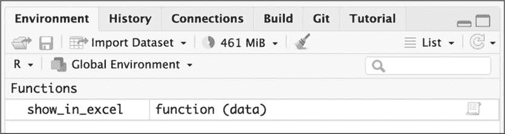
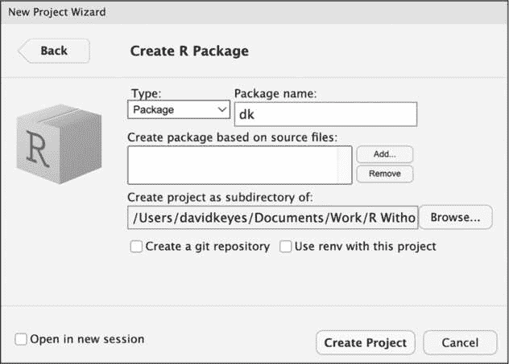

<hgroup>

## 12 创建函数和包

</hgroup>


在本章中，你将学习如何定义你自己的 R 函数，包括它们应该接受的参数。然后，你将创建一个包来分发这些函数，添加你的代码和依赖项，编写文档，并选择发布时的许可证。

将代码保存为自定义函数，然后将其分发到包中，可以带来许多好处。首先，包可以使你的代码更容易供他人使用。例如，当莫菲特癌症中心的研究人员需要从数据库访问代码时，数据科学家 Travis Gerke 和 Garrick Aden-Buie 以前会为每个研究人员编写 R 代码，但他们很快意识到自己不断重复相同的代码。于是，他们制作了一个包含数据库访问功能的包。现在，研究人员不再需要寻求帮助；他们只需安装 Gerke 和 Aden-Buie 创建的包并自行使用其中的函数。

更重要的是，开发包可以让你塑造他人的工作方式。假设你创建了一个遵循第三章中讨论的高质量数据可视化原则的 ggplot 主题。如果你将这个主题放入包中，你就能为他人提供一种简便的方式来遵循这些设计原则。简而言之，函数和包帮助你通过共享代码与他人合作。

### 创建你自己的函数

tidyverse 包的开发者 Hadley Wickham 推荐，当你复制某段代码三次后，就应该考虑将其封装为函数。函数由三个部分组成：名称、主体和参数。

#### 编写一个简单的函数

你将首先编写一个相对简单的函数示例。这个名为 `show_in_excel_penguins()` 的函数会在 Microsoft Excel 中打开第七章中的企鹅数据：

```
❶ penguins <- read_csv("https://data.rfortherestofus.com/penguins-2007.csv")

❷ show_in_excel_penguins <- function() {
  csv_file <- str_glue("{tempfile()}.csv")

  write_csv(
    x = penguins,
    file = csv_file,
    na = ""
  )

  file_show(path = csv_file)
} 
```

这段代码首先加载 tidyverse 和 fs 包。你将使用 tidyverse 来为 CSV 文件创建文件名并保存它，使用 fs 来在 Excel 中打开 CSV 文件（或你的计算机默认用来打开 CSV 文件的程序）。

接下来，`read_csv()` 函数导入企鹅数据，并将数据框命名为 penguins ❶。然后，它创建了新的 `show_in_excel_penguins` 函数，使用赋值操作符 (<-) 和 `function()` 来指定 `show_in_excel_penguins` 不是变量名，而是函数名 ❷。行尾的左花括号（{）表示函数体的开始，函数的“核心”部分就在其中。在这个例子中，函数体完成了三件事：

+   使用 `str_glue()` 函数与 `tempfile()` 函数结合，创建一个保存 CSV 文件的位置。这会在临时位置创建一个 *.csv* 扩展名的文件，并将其保存为 csv_file。

+   将企鹅数据写入在 csv_file 中设置的位置。`write_csv()` 中的 x 参数指代要保存的数据框。它还指定所有的 NA 值应该显示为空白。（默认情况下，它们会显示为 *NA*。）

+   使用 fs 包中的 file_show() 函数在 Excel 中打开临时的 CSV 文件。

要使用 show_in_excel_penguins() 函数，选中定义函数的代码行，然后在 macOS 上按 COMMAND-ENTER，或在 Windows 上按 CTRL-ENTER。现在你应该能在全局环境中看到这个函数，如 图 12-1 所示。



图 12-1：全局环境中的新函数

从现在开始，每次你运行 show_in_excel_penguins() 代码时，R 都会在 Excel 中打开企鹅数据框。

#### 添加参数

你可能会觉得这个函数似乎没什么用。它做的只是打开企鹅数据框。为什么要一直这样做呢？一个更实用的函数是能让你在 Excel 中打开*任何*数据，这样你可以在各种场景下使用它。

show_in_excel() 函数正是做这个：它接受 R 中的任何数据框，将其保存为 CSV 文件，并在 Excel 中打开该 CSV 文件。卢森堡高等教育与研究部统计与数据策略部主任 Bruno Rodrigues 编写了 show_in_excel()，以便轻松与不使用 R 的同事共享数据。每当他需要将数据保存为 CSV 文件时，他就可以运行这个函数。

用 Rodrigues 使用的这个稍微简化版的代码替换你的 show_in_excel_penguins() 函数定义：

```
show_in_excel <- function(data) {
  csv_file <- str_glue("{tempfile()}.csv")
  write_csv(
    x = data,
    file = csv_file,
    na = ""
  )
  file_show(path = csv_file)
} 
```

这段代码与 show_in_excel_penguins() 完全相同，只有两个例外。注意第一行现在写的是 function(data)。函数定义中的括号内列出的项目是参数。如果往下看，你会看到第二个变化。在 write_csv() 中，原来的 x = penguins 现在改成了 x = data。这使得你可以使用该函数处理任何数据，而不仅仅是企鹅数据。

要使用这个函数，你只需告诉 show_in_excel() 要使用哪些数据，函数就会在 Excel 中打开这些数据。例如，告诉它打开企鹅数据框，如下所示：

```
show_in_excel(data = penguins) 
```

创建了带有数据参数的函数后，现在你可以使用任何你想要的数据来运行它。例如，这段代码导入 第十章 的 COVID 病例数据，并在 Excel 中打开：

```
covid_data <- read_csv("https://data.rfortherestofus.com/
us-states-covid-rolling-average.csv")
show_in_excel(data = covid_data) 
```

你还可以在管道的末尾使用 show_in_excel()。这段代码将 covid_data 数据框过滤，仅包含来自加利福尼亚的数据，然后在 Excel 中打开：

```
covid_data %>%
  filter(state == "California") %>%
  show_in_excel() 
```

Rodrigues 本可以复制 show_in_excel() 函数中的代码，并在每次想查看数据时重新运行。但通过创建一个函数，他只需编写一次代码，之后可以根据需要多次运行它。

#### 创建一个格式化种族和族裔数据的函数

希望现在你能更好地理解函数是如何工作的，接下来我们将通过一个示例函数，帮助你简化一些前面章节中的操作。

在第十一章中，当你使用 tidycensus 包从美国人口普查局自动导入数据时，你了解到人口普查数据有许多变量，其名称不直观。假设你经常需要访问来自美国社区调查的种族和族裔数据，但你总是记不住哪些变量可以提供这些数据。为了提高效率，你将在本节中一步步创建一个 get_acs_race_ethnicity() 函数，并在此过程中学习一些关于自定义函数的重要概念。

get_acs_race_ethnicity() 函数的第一个版本可能如下所示：

```
library(tidycensus)

get_acs_race_ethnicity <- function() {
  race_ethnicity_data <-
    get_acs(
      geography = "state",
      variables = c(
        "White" = "B03002_003",
        "Black/African American" = "B03002_004",
        "American Indian/Alaska Native" = "B03002_005",
        "Asian" = "B03002_006",
        "Native Hawaiian/Pacific Islander" = "B03002_007",
        "Other race" = "B03002_008",
        "Multi-Race" = "B03002_009",
        "Hispanic/Latino" = "B03002_012"
      )
    )

  race_ethnicity_data
} 
```

在函数体内，这段代码调用了 tidycensus 中的 get_acs() 函数，从州级别检索人口数据。但与返回函数的默认输出不同，它将难以记住的变量名更新为易于理解的名称，例如 White 和 Black/African American，并将其保存为名为 race_ethnicity_data 的对象。然后，代码使用 race_ethnicity_data 对象来返回 get_acs_race_ethnicity() 函数运行时的数据。

要运行这个函数，输入以下内容：

```
get_acs_race_ethnicity() 
```

这样做应该返回易于阅读的种族和族裔组名：

```
#> # A tibble: 416 × 5
#>    GEOID NAME    variable                     estimate   moe
#>    <chr> <chr>   <chr>                           <dbl> <dbl>
#>  1 01    Alabama White                         3241003  2076
#>  2 01    Alabama Black/African American        1316314  3018
#>  3 01    Alabama American Indian/Alaska Na...    17417   941
#>  4 01    Alabama Asian                           69331  1559
#>  5 01    Alabama Native Hawaiian/Pacific I...     1594   376
#>  6 01    Alabama Other race                      12504  1867
#>  7 01    Alabama Multi-Race                     114853  3835
#>  8 01    Alabama Hispanic/Latino                224659   413
#>  9 02    Alaska  White                          434515  1067
#> 10 02    Alaska  Black/African American          22787   769
#> # 406 more rows 
```

你可以通过一些方法来改进这个函数。例如，你可能希望结果变量名遵循一致的语法格式，因此可以使用 janitor 包中的 clean_names() 函数将其格式化为 *snake case*（即所有单词小写，并用下划线分隔）。不过，你也可能希望保留原始的变量名。为此，你可以按以下方式将 clean_variable_names 参数添加到函数定义中：

```
get_acs_race_ethnicity <- function(**clean_variable_names = FALSE**) {
  race_ethnicity_data <-
    get_acs(
      geography = "state",
      variables = c(
        "White" = "B03002_003",
        "Black/African American" = "B03002_004",
        "American Indian/Alaska Native" = "B03002_005",
        "Asian" = "B03002_006",
        "Native Hawaiian/Pacific Islander" = "B03002_007",
        "Other race" = "B03002_008",
        "Multi-Race" = "B03002_009",
        "Hispanic/Latino" = "B03002_012"
      )
    )

  **if (clean_variable_names == TRUE) {**
❶ **race_ethnicity_data <- clean_names(race_ethnicity_data)**
 **}**

  race_ethnicity_data
} 
```

这段代码将 clean_variable_names 参数添加到 get_acs_race_ethnicity() 中，并指定其默认值为 FALSE。然后，在函数体内，一个 if 语句表示如果参数为 TRUE，则变量名应被覆盖为 snake case 格式 ❶。如果参数为 FALSE，变量名将保持不变。

如果你现在运行该函数，什么也不会改变，因为新参数默认设置为 FALSE。尝试将 clean_variable_names 设置为 TRUE，如下所示：

```
get_acs_race_ethnicity(clean_variable_names = TRUE) 
```

这个函数调用应该返回具有一致变量名的数据：

```
#> # A tibble: 416 × 5
#>    geoid name    variable                     estimate   moe
#>    <chr> <chr>   <chr>                           <dbl> <dbl>
#>  1 01    Alabama White                         3241003  2076
#>  2 01    Alabama Black/African American        1316314  3018
#>  3 01    Alabama American Indian/Alaska Na...    17417   941
#>  4 01    Alabama Asian                           69331  1559
#>  5 01    Alabama Native Hawaiian/Pacific I...     1594   376
#>  6 01    Alabama Other race                      12504  1867
#>  7 01    Alabama Multi-Race                     114853  3835
#>  8 01    Alabama Hispanic/Latino                224659   413
#>  9 02    Alaska  White                          434515  1067
#> 10 02    Alaska  Black/African American          22787   769
#> # 406 more rows 
```

请注意，GEOID 和 NAME 现在显示为 geoid 和 name。

现在你已经了解了如何为两个独立的函数添加参数，接下来你将学习如何将参数从一个函数传递到另一个函数。

#### 使用 … 将参数传递给另一个函数

你创建的 get_acs_race_ethnicity() 函数通过将 geography = "state" 参数传递给 get_acs() 函数来获取州级别的人口数据。但是，如果你想获取县级或普查区的数据呢？你可以使用 get_acs() 来实现，但当前的 get_acs_race_ethnicity() 并没有以允许这种操作的方式编写。你可以如何修改这个函数，使其更加灵活？

您的第一个想法可能是为要检索的数据级别添加一个新参数。您可以如下编辑函数的前两行，以添加一个 my_geography 参数，然后在 `get_acs()` 函数中使用它，如下所示：

```
get_acs_race_ethnicity <- function(clean_variable_names = FALSE, **my_geography**) {
  race_ethnicity_data **<-** **get_acs(geography = my_geography**,
`--snip--` 
```

但是，如果您还想选择要检索数据的年份怎么办？那么，您也可以为此添加一个参数。但是，正如您在第十一章中看到的那样，`get_acs()` 函数有很多参数，并且在您的代码中重复所有这些参数将很快变得繁琐。

... 语法为您提供了一个更有效的选项。将 ... 放置在 `get_acs_race_ethnicity()` 函数中，您可以通过在函数中包含 ...，自动将其任何参数传递给 `get_acs()`：

```
get_acs_race_ethnicity <- function(
  clean_variable_names = FALSE,
  **...**
) {
  race_ethnicity_data <-
    get_acs(
      **...**,
      variables = c(
        "White" = "B03002_003",
        "Black/African American" = "B03002_004",
        "American Indian/Alaska Native" = "B03002_005",
        "Asian" = "B03002_006",
        "Native Hawaiian/Pacific Islander" = "B03002_007",
        "Other race" = "B03002_008",
        "Multi-Race" = "B03002_009",
        "Hispanic/Latino" = "B03002_012"
      )
    )

 if (clean_variable_names == TRUE) {
    race_ethnicity_data <- clean_names(race_ethnicity_data)
  }

  race_ethnicity_data
} 
```

尝试通过传递设置为 "state" 的 geography 参数来运行您的函数：

```
get_acs_race_ethnicity**(geography = "state")** 
```

这应该返回以下内容：

```
#> # A tibble: 416 × 5
#>    GEOID NAME    variable                     estimate   moe
#>    <chr> <chr>   <chr>                           <dbl> <dbl>
#>  1 01    Alabama White                         3241003  2076
#>  2 01    Alabama Black/African American        1316314  3018
#>  3 01    Alabama American Indian/Alaska Na...    17417   941
#>  4 01    Alabama Asian                           69331  1559
#>  5 01    Alabama Native Hawaiian/Pacific I...     1594   376
#>  6 01    Alabama Other race                      12504  1867
#>  7 01    Alabama Multi-Race                     114853  3835
#>  8 01    Alabama Hispanic/Latino                224659   413
#>  9 02    Alaska  White                          434515  1067
#> 10 02    Alaska  Black/African American          22787   769
#> # 406 more rows 
```

您会看到 GEOID 和 NAME 变量是大写的，因为默认情况下 `clean_variable_names` 参数设置为 FALSE，并且我们在使用 `get_acs_race_ethnicity()` 函数时没有更改它。

或者，您可以更改参数的值以按县获取数据：

```
get_acs_race_ethnicity(geography = **"county"**) 
```

您还可以使用 `geometry = TRUE` 参数运行该函数，以返回地理空间数据以及人口统计数据：

```
get_acs_race_ethnicity(geography = "county", **geometry = TRUE**) 
```

该函数应返回如下数据：

```
#> Simple feature collection with 416 features and 5 fields
#> Geometry type: MULTIPOLYGON
#> Dimension:     XY
#> Bounding box:  xmin: -179.1489 ymin: 17.88328 xmax: 179.7785 ymax: 71.36516
#> Geodetic CRS:  NAD83
#> First 10 features:
#>    GEOID NAME    variable                   estimate
#>  1 56    Wyoming White                        478508
#>  2 56    Wyoming Black/African American         4811
#>  3 56    Wyoming American Indian/Alaska Na...  11330
#>  4 56    Wyoming Asian                          4907
#>  5 56    Wyoming Native Hawaiian/Pacific I...    397
#>  6 56    Wyoming Other race                     1582
#>  7 56    Wyoming Multi-Race                    15921
#>  8 56    Wyoming Hispanic/Latino               59185
#>  9 02    Alaska  White                        434515
#> 10 02    Alaska  Black/African American        22787
#>     moe geometry
#> 1   959 MULTIPOLYGON (((-111.0546 4...
#> 2   544 MULTIPOLYGON (((-111.0546 4...
#> 3   458 MULTIPOLYGON (((-111.0546 4...
#> 4   409 MULTIPOLYGON (((-111.0546 4...
#> 5   158 MULTIPOLYGON (((-111.0546 4...
#> 6   545 MULTIPOLYGON (((-111.0546 4...
#> 7  1098 MULTIPOLYGON (((-111.0546 4...
#> 8   167 MULTIPOLYGON (((-111.0546 4...
#> 9  1067 MULTIPOLYGON (((179.4825 51...
#> 10  769 MULTIPOLYGON (((179.4825 51... 
```

... 语法允许您创建自己的函数，并将参数从该函数传递到另一个函数，而无需在您自己的代码中重复该函数的所有参数。这种方法在保持代码简洁的同时，为您提供了灵活性。

现在让我们看看如何将您的自定义函数放入一个包中。

### 创建一个包

包捆绑您的函数，以便您可以在多个项目中使用它们。如果您发现自己将函数从一个项目复制到另一个项目，或者从 *functions.R* 文件复制到每个新项目中，那么这是一个很好的迹象，表明您应该创建一个包。

虽然您可以在自己的环境中从 *functions.R* 文件运行这些函数，但此代码可能无法在其他人的计算机上运行。其他用户可能没有安装必要的包，或者他们可能对您的函数的参数如何工作感到困惑，并且不知道去哪里寻求帮助。将您的函数放入一个包中，可以使它们更有可能为每个人工作，因为它们包括必要的依赖项以及内置的文档，以帮助其他人自己使用这些函数。

#### 启动包

要在 RStudio 中创建一个包，请转到 **File****New Project****New Directory**。从选项列表中选择 **R Package** 并为您的包命名。在图 12-2 中，我将其命名为 dk。同时确定您希望将您的包存储在计算机上的哪个位置。您可以将其他所有内容保持原样。



图 12-2：用于创建您自己的包的 RStudio 菜单

RStudio 现在会创建并打开包。包应该已经包含一些文件，其中包括 *hello.R*，该文件包含一个名为 hello() 的预构建函数，当运行时，会在控制台中打印 "Hello, world!"。你将删除这个文件和其他一些默认文件，以便从零开始。删除 *hello.R*、*NAMESPACE* 和 *hello.Rd* 文件（位于 *man* 目录中）。

#### 使用 use_r() 添加函数

包中的所有函数应该放在 *R* 文件夹中的单独文件里。为了自动将这些文件添加到包中并测试它们是否正常工作，你将使用 usethis 和 devtools 包。可以通过如下方式使用 install.packages() 安装它们：

```
install.packages("usethis")
install.packages("devtools") 
```

要向包中添加一个函数，可以在控制台中运行 usethis 包中的 use_r() 函数：

```
usethis::use_r("acs") 
```

package::function() 语法允许你在不加载关联包的情况下使用函数。use_r() 函数应该在 *R* 目录中创建一个文件，文件名为你提供的参数名称——在这种情况下，文件名是 *acs.R*。文件名本身并不重要，但选择一个能指示文件中包含函数的名称是一种好习惯。现在，你可以打开该文件并添加代码。将 get_acs_race_ethnicity() 函数复制到包中。

#### 使用 devtools 检查包

你需要以几种方式修改 get_acs_race_ethnicity() 函数，以使其在包中正常工作。弄清楚需要做哪些修改的最简单方法是使用内置工具检查你的包是否构建正确。在控制台中运行 devtools::check() 函数，执行 R CMD check 这个命令，它在幕后运行，以确保其他人能够在他们的系统上安装你的包。运行 R CMD check 对 dk 包进行检查时，会输出这条长消息：

```
—— R CMD check results ——————————————— dk ————
Duration: 4s

> checking DESCRIPTION meta-information ... WARNING
Non-standard license specification:
What license is it under?
Standardizable: FALSE

> checking for missing documentation entries ... WARNING
Undocumented code objects:
'get_acs_race_ethnicity'
All user-level objects in a package should have documentation entries.
See chapter 'Writing R documentation files' in the 'Writing R
Extensions' manual.

❶ > checking R code for possible problems ... NOTE
get_acs_race_ethnicity: no visible global function definition for
'get_acs'
get_acs_race_ethnicity: no visible global function definition for
'clean_names'
Undefined global functions or variables:
clean_names get_acs

0 errors  | 2 warnings ｘ | 1 note ｘ 
```

最后部分是最重要的，因此我们从下到上回顾输出内容。行 0 错误  | 2 警告 ｘ | 1 提示 ｘ 突出了包中识别出的三种问题级别。错误是最严重的，因为它们意味着其他人无法安装你的包，而警告和提示可能会导致其他问题。最佳实践是消除所有的错误、警告和提示。

我们将从处理 ❶ 处的提示开始。为了帮助你理解 R CMD check 在这里的提示内容，我需要解释一下包是如何工作的。当你使用 install.packages() 函数安装包时，这通常需要一些时间。这是因为你告诉 R 安装的包很可能使用了其他包中的函数。为了访问这些函数，R 必须为你安装这些包（被称为 *依赖项*）；毕竟，如果每次安装新包时你都需要手动安装一整套依赖包，那会很麻烦。不过，为了确保 dk 包的任何用户都能安装适当的包，你仍然需要做一些修改。

R CMD check 提示该包包含几个“未定义的全局函数或变量”以及多个“无可见的全局函数定义”。这是因为你在尝试使用 tidycensus 和 janitor 包中的函数，但没有指定这些函数的来源。我可以在我的环境中运行这些代码，因为我已经安装了 tidycensus 和 janitor 包，但不能假设所有人都有相同的环境。

#### 添加依赖包

为了确保包的代码能够正常工作，你需要在用户安装 dk 包时，为他们安装 tidycensus 和 janitor 包。为此，可以在控制台中运行 `use_package()` 函数，首先指定 "tidycensus" 作为包参数：

```
usethis::use_package(package = "tidycensus") 
```

你应该看到以下信息：

```
 Setting active project to '/Users/davidkeyes/Documents/Work/R for the Rest of Us/dk'
 Adding 'tidycensus' to Imports field in DESCRIPTION
• Refer to functions with `tidycensus::fun()` 
```

“Setting active project...” 这一行表示你正在工作于 dk 项目中。第二行表示 *DESCRIPTION* 文件已被编辑。此文件提供了关于你正在开发的包的元数据。

接下来，像添加 tidyverse 包一样添加 janitor 包。

```
usethis::use_package(package = **"janitor")** 
```

这应该会给你以下输出：

```
 Adding 'janitor' to Imports field in DESCRIPTION
• Refer to functions with `janitor::fun()` 
```

如果你打开项目根目录下的 *DESCRIPTION* 文件，你应该看到如下内容：

```
Package: dk
Type: Package
Title: What the Package Does (Title Case)
Version: 0.1.0
Author: Who wrote it
Maintainer: The package maintainer <yourself@somewhere.net>
Description: More about what it does (maybe more than one line)
    Use four spaces when indenting paragraphs within the Description.
License: What license is it under?
Encoding: UTF-8
LazyData: true
Imports:
    janitor,
    tidycensus 
```

文件底部的 Imports 部分表明，当用户安装 dk 包时，tidycensus 和 janitor 包也会被导入。

#### 正确引用函数

运行 `usethis::use_package(package = "janitor")` 后的输出还包括了这一行：Refer to functions with tidycensus::fun()（其中 fun() 代表函数名）。这告诉你，为了在 dk 包中使用其他包的函数，你需要同时指定包名和函数名，以确保始终使用正确的函数。在少数情况下，你会发现不同包中有相同名称的函数，这种语法避免了歧义。记得 R CMD check 中的这一行吗？

```
Undefined global functions or variables:
clean_names get_acs 
```

这个警告出现是因为你在使用函数时没有指定它们来自哪个包。`clean_names()` 函数来自 janitor 包，而 `get_acs()` 来自 tidycensus 包，因此你需要在每个函数前添加这些包的名称：

```
get_acs_race_ethnicity <- function(
  clean_variable_names = FALSE,
  ...
) {
  race_ethnicity_data <- **tidycensus::get_acs**(
    ...,
    variables = c(
      "White" = "B03002_003",
      "Black/African American" = "B03002_004",
      "American Indian/Alaska Native" = "B03002_005",
      "Asian" = "B03002_006",
      "Native Hawaiian/Pacific Islander" = "B03002_007",
      "Other race" = "B03002_008",
      "Multi-Race" = "B03002_009",
      "Hispanic/Latino" = "B03002_012"
    )
  )

  if (clean_variable_names == TRUE) {
    race_ethnicity_data <- **janitor::clean_names(race_ethnicity_data)**
  }

  race_ethnicity_data
} 
```

现在你可以再次运行 `devtools::check()`，应该可以看到这些警告已经消失：

```
> checking DESCRIPTION meta-information ... WARNING
Non-standard license specification:
What license is it under?
Standardizable: FALSE

> checking for missing documentation entries ... WARNING
Undocumented code objects:
'get_acs_race_ethnicity'
All user-level objects in a package should have documentation entries.
See chapter 'Writing R documentation files' in the 'Writing R
Extensions' manual.

0 errors  | 2 warnings ｘ | 0 notes  
```

然而，仍然有两个警告需要处理。接下来你将处理这些警告。

#### 使用 Roxygen 创建文档

缺少文档条目的警告表示你需要为 `get_acs_race_ethnicity()` 函数添加文档。创建包的一个好处是你可以添加文档，帮助他人使用你的代码。就像用户可以输入 `?get_acs()` 查看该函数的文档一样，你希望他们能够输入 `?get_acs_race_ethnicity()` 来了解你的函数是如何工作的。

要为 get_acs_race_ethnicity() 创建文档，你将使用 Roxygen 这一文档工具，该工具使用了名为 roxygen2 的包。开始时，将光标放置在你的函数中的任何位置。然后，在 RStudio 中，点击 **Code** **Insert Roxygen Skeleton**。这将会在 get_acs_race_ethnicity() 函数之前添加以下文本：

```
#' Title
#'
#' @param clean_variable_names
#' @param ...
#'
#' @return
#' @export
#'
#' @examples 
```

这段文本是文档的骨架。每一行都以特殊字符 #' 开头，表示你正在使用 Roxygen。现在，你可以编辑这些文本来创建文档。从用一句话描述该函数来替换 Title 开始：

```
#' Access race and ethnicity data from the American Community Survey 
```

接下来，关注以 @param 开头的行。Roxygen 会为每个函数参数自动创建一行，但你需要填写每一行的描述。首先描述 clean_variable_names 参数的作用。接着，指定 ... 将会把额外的参数传递给 tidycensus::get_acs() 函数：

```
#' @param clean_variable_names Should variable names be cleaned (i.e. snake case)
#' @param ... Other arguments passed to tidycensus::get_acs() 
```

@return 行应告知用户 get_acs_race_ethnicity() 函数返回的内容。在本例中，它返回数据，你可以按照以下方式进行文档说明：

```
#' @return A tibble with five variables: GEOID, NAME, variable, estimate, and moe 
```

在 @return 之后是 @export。你无需在此做任何更改。包中的大多数函数被称为*导出函数*，意味着它们对包的用户可用。相比之下，内部函数仅供包开发者使用，在 Roxygen 骨架中没有 @export。

最后一部分是 @examples。在这里，你可以提供用户可以运行的代码示例，以便了解该函数的工作原理。由于这增加了复杂性，因此不是必须的，你可以跳过它并删除包含 @examples 的那一行。

> 注意

*如果你想了解更多关于如何为文档添加示例的内容，Hadley Wickham 和 Jenny Bryan 的第二版《R Packages》一书是一个很好的资源。*

现在你已经使用 Roxygen 添加了文档，请在控制台中运行 devtools::document()。这应该会在 *man* 目录中创建一个 *get_acs_race_ethnicity.Rd* 文档文件，采用 R 包所要求的非常特定的格式。你可以查看它，但不能更改它；它是只读的。

运行该函数时还应创建一个*NAMESPACE* 文件，该文件列出你包中可供用户使用的函数。它应该像这样：

```
# Generated by roxygen2: do not edit by hand

export(get_acs_race_ethnicity) 
```

你的 get_acs_race_ethnicity() 函数现在几乎已经可以供用户使用了。

#### 添加许可证和元数据

再次运行 devtools::check() 来检查是否修复了导致警告的问题。关于缺失文档的警告应该不再出现。然而，你仍然会看到一个警告：

```
> checking DESCRIPTION meta-information ... WARNING
Non-standard license specification:
What license is it under?
Standardizable: FALSE

0 errors  | 1 warning ｘ | 0 notes  
```

这个警告提醒你，你还没有为你的包指定许可。如果你计划公开发布你的包，选择一个许可证非常重要，因为它告诉其他人他们可以做什么和不能做什么。有关如何为你的包选择合适的许可证，请参阅*[`choosealicense.com`](https://choosealicense.com)*。

在本例中，你将使用 MIT 许可证，通过运行 usethis::use_mit_license()，该许可证允许用户基本上随意使用你的代码。usethis 包有类似的函数可以用于其他常见许可证。你应该会看到如下输出：

```
 Setting active project to '/Users/davidkeyes/Documents/Work/R for the Rest of Us/dk'
 Setting License field in DESCRIPTION to 'MIT + file LICENSE'
 Writing 'LICENSE'
 Writing 'LICENSE.md'
 Adding '^LICENSE\\.md$' to '.Rbuildignore' 
```

use_mit_license() 函数处理了将许可证添加到包中的许多繁琐部分。对我们来说，最重要的是，它在 *DESCRIPTION* 文件中指定了许可证。如果你打开它，应该会看到你已经添加了 MIT 许可证的确认信息：

```
License: MIT + file LICENSE 
```

除了许可证，*DESCRIPTION* 文件还包含关于包的元数据。你可以进行一些更改，以标识其标题，并添加作者、维护者和描述。最终的 *DESCRIPTION* 文件可能如下所示：

```
Package: dk
Type: Package
Title: David Keyes's Personal Package
Version: 0.1.0
Author: David Keyes
Maintainer: David Keyes <david@rfortherestofus.com>
    Description: A package with functions that David Keyes may find
    useful.
License: MIT + file LICENSE
Encoding: UTF-8
LazyData: true
Imports:
    janitor,
    tidycensus 
```

做完这些更改后，再次运行 devtools::check()，确保一切正常：

```
0 errors  | 0 warnings  | 0 notes  
```

这正是你想要看到的！

#### 编写附加函数

现在你已经有了一个包含一个可用函数的包。如果你想添加更多的函数，可以遵循相同的步骤：

1.  使用 usethis::use_r() 创建一个新的 *.R* 文件，或将另一个函数复制到现有的 *.R* 文件中。

2.  使用 package::function() 语法开发你的函数，引用其他包中的函数。

3.  使用 use_package() 添加任何依赖包。

4.  为你的函数添加文档。

5.  运行 devtools::check() 确保你做的一切都正确。

你的包可以包含一个函数，比如 dk，也可以包含任意数量的函数。

#### 安装包

现在你已经准备好安装并使用新的包。当你在开发自己的包时，为自己安装它是相对简单的。只需运行 devtools::install()，包就会准备好在任何项目中使用。

当然，如果你在开发一个包，你可能不仅是为了自己，而是为了其他人。将你的包提供给他人最常见的方式是使用代码共享网站 GitHub。如何将代码上传到 GitHub 的细节超出了我在这里能涉及的范围，但 Jenny Bryan 自出版的书 *Happy Git and GitHub for the useR*（网址 *[`happygitwithr.com`](https://happygitwithr.com)*) 是一个很好的入门书籍。

我已经将 dk 包推送到 GitHub，你可以在 *[`github.com/dgkeyes/dk`](https://github.com/dgkeyes/dk)* 找到它。如果你想安装它，首先确保安装了 remotes 包，然后在控制台中运行代码 remotes::install_github("dgkeyes/dk")。

### 总结

在本章中，你看到包非常有用，因为它们让你将多个元素打包在一起，确保代码能够可靠运行：一组函数、自动安装依赖包的指令以及代码文档。

创建你自己的 R 包在你为一个组织工作时尤其有益，因为包可以让高级 R 用户帮助经验较少的同事。当 Travis Gerke 和 Garrick Aden-Buie 为莫菲特癌症中心的研究人员提供了一个包含易于访问其数据库功能的包时，这些研究人员开始更加富有创意地使用 R。

如果你创建了一个包，你还可以引导他人按照你认为最好的方式使用 R 语言。包是一种确保他人遵循最佳实践的方式（即使他们未意识到这一点）。它们使得跨项目重用函数变得容易，能够帮助他人，并保持一致的风格。

### 额外资源

+   Malcolm Barrett, “使用 R 进行包开发”，在线课程，访问日期：2023 年 12 月 2 日，*[`rfortherestofus.com/courses/package-development`](https://rfortherestofus.com/courses/package-development)*。

+   Hadley Wickham 和 Jennifer Bryan, *R Packages*, 第 2 版（加利福尼亚州塞巴斯托波尔：O'Reilly Media，2023 年），*[`r-pkgs.org`](https://r-pkgs.org)*。

### 总结

R 语言于 1993 年作为一款统计工具诞生，至今它已经被广泛应用于各种统计分析。但在过去三十年里，R 语言也成为了一个可以做远超统计分析的工具。

正如你在本书中看到的，R 语言非常适合制作可视化图表。你可以用它来创建高质量的图形和地图，制作自己的主题以保持视觉效果的一致性并符合品牌形象，还能生成既美观又有效传达信息的表格。使用 R Markdown 或 Quarto，你可以创建报告、演示文稿和网站。最棒的是，这些文档都是可重复的，这意味着更新它们就像重新运行你的代码一样简单。最后，你也看到 R 能够帮助你自动化数据访问，并通过你创建的函数和包来促进与他人的协作。

如果当你开始阅读这本书时 R 对你来说是全新的，我希望现在你已经有了使用它的灵感。如果你是一个经验丰富的 R 用户，我希望这本书能够展示一些你之前未曾考虑过的 R 使用方式。无论你的背景如何，我希望你现在能够像专业人士一样使用 R。因为它不仅仅是统计学家的工具——R 也是我们所有人的工具。
