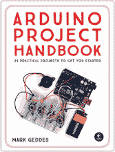
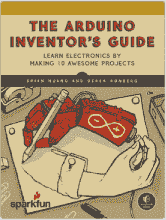
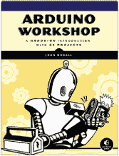
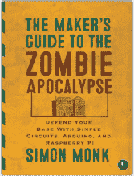
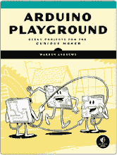
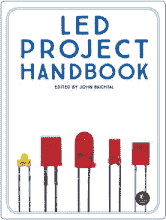

**更新**

访问 [`www.nostarch.com/RaspberryPiProject/`](https://www.nostarch.com/RaspberryPiProject/) 获取更新、勘误和其他信息。

更多实用的书籍来自  **NO STARCH PRESS**

**Arduino 项目手册，第 1 卷**

25 个实用项目助你起步

*作者* 马克·盖迪斯

2016 年 6 月，272 页，$24.95

ISBN 978-1-59327-690-4

*全彩*

**Arduino 发明者指南**

通过制作 10 个酷炫项目来学习电子学

*作者* 布莱恩·黄 *和* 德里克·伦伯格

2017 年 6 月，336 页，$29.95

ISBN 978-1-59327-652-2

*全彩*

**Arduino 工作坊**

65 个项目的实践入门

*作者* 约翰·博克索尔

2013 年 5 月，392 页，$29.95

ISBN 978-1-59327-448-1

**创客指南：僵尸末日篇**

用简单的电路、Arduino 和 Raspberry Pi 来防守你的基地

*作者* 西蒙·蒙克

2015 年 10 月，296 页，$24.95

ISBN 978-1-59327-667-6

**Arduino 游乐场**

适合经验丰富的创客的极客项目

*作者* 沃伦·安德鲁斯

2017 年 3 月，344 页，$29.95

ISBN 978-1-59327-744-4

**LED 项目手册**

*编辑* 约翰·贝赫塔尔

2018 年春季，280 页，$24.95

ISBN 978-1-59327-825-0

*全彩*

**电话：**

1.800.420.7240 或 1.415.863.9900

**电子邮件：**

sales@nostarch.com

**网站：**

[www.nostarch.com](http://www.nostarch.com)
