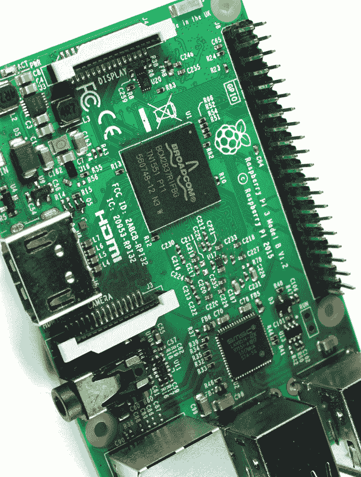

## 前言

你是否曾想过你可以用 35 美元买到一台电脑？不是的，我们说的可不是从典当行买来的古董电脑。我们说的是 Raspberry Pi——一块大约与信用卡大小相当的计算机板。但是，不要被它看似脆弱的外观欺骗；它比看起来要强大得多。

Raspberry Pi 是由 Raspberry Pi 基金会创始人 Eben Upton 在英国开发的。Upton 和他的同事们注意到，申请剑桥大学计算机科学专业的学生技能逐渐下降，意识到这是因为新一代的学生成长在易于使用的电脑环境中。学生们从未真正需要了解计算机是如何工作的，也没有太多机会进行编程或动手操作。Upton 开发 Raspberry Pi 是为了推动学校中基础计算机科学的教学。这也是为什么 Pi 是一个裸板而不是装在机箱里的电脑的原因：让每个人都能看到计算机的各个组件。

自 2012 年首次推出以来，已有超过一千万块 Raspberry Pi 板被售出。Raspberry Pi 不仅在学生中广受欢迎，还吸引了电子爱好者、动手能力强的人、计算机科学家以及各个年龄段的“孩子”。

Raspberry Pi 可以作为一台普通计算机使用——你可以上网、发邮件、写文档、观看视频等等——但这并不是它的主要目的。Pi 是你可以进行实验、黑客攻击、玩弄的工具，用来构建你自己的程序和发明。Raspberry Pi 和类似的板子不仅让参与电子学和编程世界变得可能，而且*变得容易*，从而催生了全球范围内大量的创意发明。现在，该轮到你发明一些东西了。

### 本书适合谁？

本书适合任何想要充分利用 Raspberry Pi 的初学者，无论是希望探索电子学和编程世界的孩子，还是希望帮助孩子和学生学习的家长和教育工作者，亦或是希望使用 Raspberry Pi 实现创意的爱好者和创客。

我们不假设读者具备关于 Raspberry Pi、电路或编程的任何先验知识。如果你已经有一些基础技能，本书将帮助你进一步提升，并给你接下来的创意方向。

### 关于本书

*20 个简单的 Raspberry Pi 项目*是一本包含 20 个 Raspberry Pi 项目的合集。我们相信，发现新概念的最佳方式是通过实践，而项目书是入门的绝佳途径。

本书从 Raspberry Pi 和 Python 编程语言的简要介绍开始，然后跳入项目实践。全书采用“边做边学”的方式，这意味着你不需要在实际动手制作一些酷炫的项目之前花费无数小时学习理论概念。

你将通过构建有趣且互动的项目来学习，比如家庭监控系统和 Wi-Fi 控制机器人。你还将设计用户友好的界面来控制电子设备，制作物联网项目，建立网站，创建你自己的游戏，等等。

如果你没有编程或制作电路的经验，不用担心。每个项目都会提供逐步的说明，帮助你搭建电路、绘制原理图，并编写用于编程 Pi 的代码。你可以从书中复制代码，或者访问* [`www.nostarch.com/RaspberryPiProject/`](https://www.nostarch.com/RaspberryPiProject/) *下载代码。

你的 Pi 学习不应仅限于本书中的项目，这就是为什么每个项目都有一个“进一步拓展”部分，我们会提供一些建议，帮助你进一步开发项目，并将书中学到的概念结合起来，构建更加复杂和有趣的内容。我们希望在书本结束时，你能具备必要的技能，将自己的项目想法付诸实践。

### 你需要什么？

本书中的项目是基于树莓派 3 开发的。如果你有旧版的树莓派，你仍然可以跟着做，但是树莓派 3 的项目最容易构建。旧版的树莓派性能较低，而*非常旧的版本* GPIO 引脚更少。

我们不清楚树莓派 4 是否会发布，或者何时发布，但到目前为止，所有树莓派的版本都与旧版板卡兼容，所以未来版本也应该与本书中的项目兼容。

本书中的大多数项目涉及使用 Pi 与外界通过电路进行互动。这意味着除了树莓派，你还需要一些电子元件。在每个项目的开始，我们会提供所需零件的清单，以及零件的成本和预计的构建时间。带有一个 $ 符号的项目可能花费不到 10 美元的元件，而带有两个 $ 符号的项目可能在 10 至 50 美元之间（这个范围较宽，但零件的价格会因购买地点而异）。如果你想一次性购买所有零件，也可以参考 第 9 页 的“项目组件清单”，它列出了本书所需的所有组件。

### 本书结构

本书分为七个部分。《入门篇》是对树莓派的介绍，对于正确设置你的树莓派是必不可少的，后面的部分则包含了项目。以下是本书的结构安排：

**入门篇**

在这一部分，我们将向你展示开始使用树莓派并首次进行设置所需的内容。我们还将介绍本书中使用的编程语言——Python 的基础知识。

**LED**

你将从制作 LED 项目开始。如果你是电子学新手，这部分将教你电路搭建的基本概念。

**显示屏**

在这一部分，你将学习如何使用几种类型的显示器，使你的电子项目更具互动性。这些项目不仅仅是显示示例文本；你还将学习如何从网络收集数据并编程一个乒乓游戏。

**传感器**

这些项目使用了几种类型的传感器。传感器非常棒，因为它们能够让你的项目与世界互动。几乎你能想到的任何东西都有传感器。你将学习如何使用温度传感器、PIR 运动传感器等。

**相机**

本部分的项目使用树莓派相机模块。你将学习如何使用相机拍照、如何进行视频流传输，然后利用你的技能构建酷炫的项目，比如入侵者检测器和家庭监控系统。

**Web 应用**

在这里，你将构建你自己的网页，然后通过搭建自己的 Web 服务器，学习如何远程控制树莓派的 GPIO。你还将探索 Node-RED，这是一个构建物联网应用的强大工具。

**游戏和玩具**

本部分的项目是为你提供一些有趣的玩具。你将制作一个数字鼓组，使用 Scratch 编程和设计你自己的游戏，并制作一个可以通过智能手机控制的 Wi-Fi 机器人。

在书的最后，你还会找到一些参考信息，包括迄今为止所有可用的树莓派板子的 GPIO 指南，以及你可以用来识别不同电阻值的电阻色环图。

本书中的项目是独立的，这意味着没有特定的顺序，你可以随时选择任何你感兴趣的项目来制作。

我们希望你能享受本书中的项目制作过程，并享受学习的乐趣。

