## 第一章：入门

在本入门中，你将为接下来的项目做好所有准备。我们将向你介绍树莓派板及其最重要和最有趣的部分。然后我们将带你一步步设置树莓派所需的所有硬件和软件。

这是一个简单的过程，让你可以将树莓派用于许多事情，包括作为一台普通的计算机！我们将介绍如何将树莓派设置为计算机，并展示如何操作桌面和文件系统。我们还会教你如何使用终端，也就是命令行，来给树莓派发出指令。最后，我们将介绍 Python 编程语言，它是我们将在项目中使用的编程语言。

完成本入门后，你将准备好开始进行项目。

### 开始使用树莓派

我们将从探索树莓派板的用途开始，收集使其运行所需的东西，并将操作系统加载到一张新格式化的 microSD 卡上，然后插入树莓派板中。

树莓派是一块信用卡大小的微型计算机板，你可以花大约$35 购买。它拥有普通计算机的所有功能：处理器；RAM；用于连接显示器、鼠标和键盘的端口；以及连接互联网的能力。树莓派板甚至有一项普通计算机没有的特殊功能：通用输入输出引脚（GPIO）。这些 GPIO 引脚使树莓派能够与现实世界互动，让你能够构建智能电子项目并用树莓派控制它们。

你可以用树莓派做大多数普通计算机能做的事情，比如浏览网页、编辑文档、玩游戏、编程等等。图 0-1 展示了树莓派作为桌面计算机的使用方式。


**图 0-1：** 使用树莓派作为桌面计算机

然而，记住树莓派的性能不如更昂贵的计算机，所以它有一些限制。首先，它无法满足一些现代软件的需求，因此并非所有软件都能在树莓派上运行。其次，它运行的是 Linux 操作系统，而不是 Windows 或 macOS，这些系统可能对你来说更为熟悉。

#### 树莓派的用途

那么，如果树莓派像一台普通的计算机，但有一些限制，它的优势是什么呢？树莓派让你能够以一种你在普通计算机上无法做到或不敢做到的方式进行实验。计算机价格昂贵且修复难度大，所以你不愿意在没有完全了解自己的操作的情况下做过多的改动。然而，正如 Linux 创始人 Linus Torvalds 在接受 BBC 新闻采访时所说，树莓派让“承受失败”成为可能。你可以在树莓派上随意玩弄硬件和软件，而不用担心损坏昂贵的设备或丢失重要文件！

树莓派让你通过两种主要方式进行实验：

**创建你自己的程序** Pi 附带一套免费的软件编写工具。如果你犯了错误，你只需擦除 Pi 并重新开始。

**创建你自己的电子项目** Pi 板具有 GPIO 引脚，可以连接传感器和其他电子设备，从而与现实世界进行交互。你可以创建有用的物品，并且在不耗费大量电力的情况下让你的项目 24/7 全天候运行。

Raspberry Pi 的应用几乎没有限制。以下是全球各地的人们制作的一些项目示例：一台复古游戏机，用于玩老式街机游戏；一个超级计算机，通过将多个 Pi 板连接起来构建；一台云服务器，用于存储和访问数据；一个媒体中心，用于在电视上组织和播放媒体；一个家庭自动化系统，用于控制和监控家中的设备；一系列非常酷且有用的机器人，比如农业机器人和自动驾驶机器人车——这些只是其中的一部分。作为一个非常酷的 Pi 项目示例，看看 图 0-2 展示的 SeeMore 雕塑，它通过关联一个 256 节点 Raspberry Pi 集群的运动，展现了并行算法的美。


**图 0-2：** SeeMore 项目

#### 区分各个板子

Raspberry Pi 板有多个版本，如 图 0-3 所示。

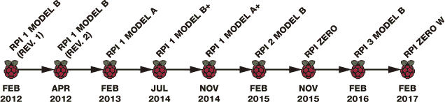

**图 0-3：** Raspberry Pi 板的时间轴

本书中我们将使用 Raspberry Pi 3 Model B，这是我们推荐购买的板子。不过，如果你已经有了旧版的 Raspberry Pi，它也能支持本书中的大部分项目。（如果你使用的是 26 个 GPIO 引脚的模型，而不是 40 个引脚，你可能需要更改一些项目电路，可能需要进行一些研究。你也可以参考 “Raspberry Pi GPIO 引脚指南” 中的内容，在 第 261 页 查找旧版板子的引脚分布。）

Raspberry Pi 板在多个方面有所不同，包括 GPIO 引脚的数量以及连接器的类型和数量。表 0-1 显示了 Model B 板的不同特性。（请注意，较新的板子具有更好的特性，例如更多的内存和更强的处理器。你还可以看到，Pi 3 是第一款内置蓝牙和 Wi-Fi 的板子。）

**表 0-1：** Model B 板的特性

| **特性** | **PI 1 MODEL B** | **PI 1 MODEL B+** | **PI 2 MODEL B** | **PI 3 MODEL B** |
| --- | --- | --- | --- | --- |
| 处理器 | 700 MHz 单核 ARMv6 | 700 MHz 单核 ARMv6 | 900 MHz 四核 ARMv7 | 1.2GHz 四核 ARMv8 |
| RAM | 512MB | 512MB | 1GB | 1GB |
| USB 端口 | 2 | 4 | 4 | 4 |
| GPIO 引脚 | 26 | 40 | 40 | 40 |
| 以太网端口 | ✓ | ✓ | ✓ | ✓ |
| HDMI | ✓ | ✓ | ✓ | ✓ |
| 存储 | SD | MicroSD | MicroSD | MicroSD |
| Wi-Fi | - | - | - | ✓ |
| 蓝牙 | - | - | - | ✓ |
| 价格 | $35 | $25 | $35 | $35 |
| 电源 | MicroUSB | MicroUSB | MicroUSB | MicroUSB |

#### 了解树莓派及其配件

让我们仔细看看树莓派主板。图 0-4 显示了一个标注的树莓派 3 型号 B 主板。

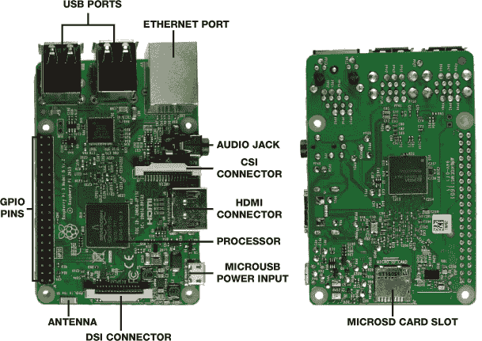

**图 0-4：** 树莓派 3 型号 B

树莓派 3 型号 B 包含以下组件：

**USB 端口** 连接外设，如鼠标和键盘。

**以太网端口** 将树莓派连接到互联网。

**音频插孔** 连接音频设备。

**CSI（摄像头串行接口）连接器** 连接小型摄像头。

**HDMI（高清多媒体接口）连接器** 连接显示器或电视。

**MicroUSB 电源输入** 为树莓派提供电力。（树莓派板上没有电源开关。）MicroUSB 连接器仅用于电源输入。

**DSI（显示串行接口）连接器** 使您能够轻松连接兼容 DSI 的显示器，如 LCD 触摸屏，使用 15 针排线连接。

**MicroSD 卡槽** 存储 microSD 卡，里面包含操作系统以及树莓派工作所需的所有内容。

**处理器** 作为树莓派的大脑，采用 Broadcom BCM2837 系统芯片（SoC），配备 64 位四核 CPU，最大运行速度为 1.2 GHz。

**天线** 接收无线局域网和蓝牙信号。

**GPIO 引脚** 允许您连接传感器以收集数据，或发送输出信号来控制输出设备，如电机或 LED。

如您所见，树莓派是一个裸露的电子板，单独使用时无法完成太多功能。您需要一些配件才能开始使用（请参见 图 0-5）。

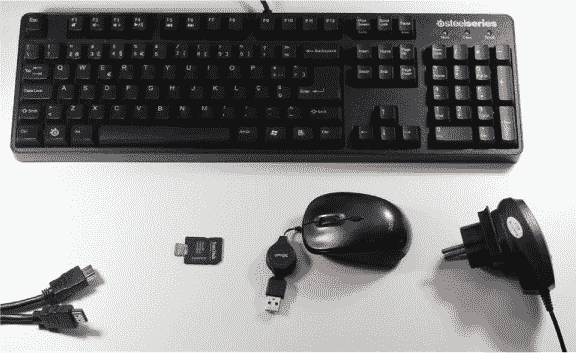

**图 0-5：** 从左到右，键盘、HDMI 电缆、microSD 卡、鼠标和电源适配器

以下是您可能需要购买的树莓派配件：

**电源适配器**

树莓派 3 应该使用 2.5 A 5 V 的电源进行供电。

**MicroSD 卡**

我们建议使用 8GB（或更大）Class 10 的 microSD 卡。如果您使用的是树莓派 1 型号 B，您需要一张全尺寸的 SD 卡，而不是 microSD 卡。

**显示器和 HDMI 电缆**

您的树莓派可以与显示器或电视一起使用，并通过 HDMI 连接。大多数现代电视和显示器都配有 HDMI 插口，因此您可以使用 HDMI 电缆直接将其连接到树莓派板。如果您有一台较旧的显示器或电视，它可能配有 VGA 或 DVI 插口。您仍然可以将树莓派连接到这些显示器，但需要使用 VGA 或 DVI 转 HDMI 的适配器。

**鼠标和键盘**

只要您的鼠标和键盘具有 USB 插头，您就可以使用任何鼠标和键盘。只要无线键盘和鼠标配有 USB 接收器插头，您也可以使用它们。

**MicroSD 卡适配器和 PC 写入器（可选）**

大多数现代计算机都配有 SD 卡插槽。您可以将 microSD 卡插入 SD 卡适配器并将其连接到计算机。如果您的计算机没有 SD 卡插槽，您还需要一个通过 USB 连接的 SD 卡读写器。

**以太网电缆或 Wi-Fi 加密狗（可选）**

Raspberry Pi 3 内置 Wi-Fi，但旧版没有。这意味着旧版需要以太网电缆或 Wi-Fi 加密狗来连接互联网。如果你购买 Wi-Fi 加密狗，请确保它与你的 Pi 板兼容。你可以访问 *[`elinux.org/RPi_USB_Wi-Fi_Adapters`](https://elinux.org/RPi_USB_Wi-Fi_Adapters)* 来查看加密狗是否兼容。

**保护壳（可选）**

Raspberry Pi 本身没有外壳，直接使用也没问题。尽管如此，我们建议购买一个保护壳，这样板子会更加坚固。如果你不想花钱，也可以使用 3D 打印、LEGO 或任何你喜欢的方式自制外壳。只要确保外壳允许你访问 GPIO 端口，这样你就可以进行电子项目的制作。

**注意**

*你也可以通过计算机运行你的 Raspberry Pi，而无需键盘、鼠标或显示器。这种方式称为* 无头运行。

如果你不确定你的外设是否与 Raspberry Pi 兼容，可以访问 *[`elinux.org/RPi_VerifiedPeripherals`](https://elinux.org/RPi_VerifiedPeripherals)* 查找兼容和不兼容的外设清单。

#### 项目组件清单

除了这些设备，你还需要一些电子元件来完成本书中的项目。每个项目开始时都会提供详细的所需零件清单，你应该能够在大多数在线电子商店或者通过快速 Google 搜索轻松找到所需的组件。我们推荐像 Element14/Farnell、Adafruit、ThePiHut 和 SparkFun 这样的商店。或者，你也可以从亚马逊购买零件——确保选择评价较高的产品。

**注意**

*对于以* 开头的部分，我们建议你购买一个混合包装。这些组件非常便宜，且你需要大量的它们，所以大宗包装更具性价比。*

以下是你完成本书项目所需的所有零件清单：

Raspberry Pi 3 Model B

Raspberry Pi Zero W（可选）

面包板

*5mm LED（至少两颗不同颜色的 LED）*

*跳线（公对公和公对母）*

*330 Ω 电阻（至少三个）*

4.7 kΩ 电阻

*按键（至少八个）*

10 kΩ 可调电阻（至少两个）

MCP3008 芯片

公共阴极 RGB LED

WS2812B 可寻址 RGB LED 灯带

排针

逻辑电平转换模块 BSS 138

16×2 Hitachi HD44780 兼容 LCD

0.96 英寸 OLED 显示屏

Sense HAT

PIR 红外传感器 HC-SR501

蜂鸣器

MQ-2 气体和烟雾传感器

Raspberry Pi Camera Module v2

继电器模块 HL-52S

塑料盒外壳

12V 灯泡及灯座

12V 电源适配器

公型 DC 插座电源接口

DHT22 温湿度传感器

MotoZero 扩展板

智能机器人车底盘套件

四节 AA 电池

便携式充电器

打火机

耳机或带扬声器的显示器及 HDMI 电缆

你还需要一把烙铁以及焊料、吸锡带和帮助手等配件。此外，针嘴钳、迷你剪钳和剥线钳也会很有帮助。

### 上传操作系统

Raspberry Pi 运行的是 Linux 操作系统，这是一款由来自全球的专家志愿者合作构建的开源软件。由于 Linux 是开源的，任何人都可以访问源代码。

**注意**

*有 Android 和 Windows 版本适用于 Pi，但它们的性能不如 Linux 系统。最好使用 Linux，它是 Raspberry Pi 支持最好的操作系统。*

Raspberry Pi 有多个 Linux 发行版，但推荐给初学者使用的是 Raspbian，因为它在 Raspberry Pi 社区中有最广泛的支持。Raspbian 也是免费的，可以下载。

由于 Raspberry Pi 没有硬盘，你需要将操作系统安装到 microSD 卡上，而为此你需要另一台普通的个人计算机。

使用 New Out Of the Box Software（NOOBS）来安装 Raspbian 是最简单的方式，NOOBS 是一个包含 Raspbian 的简易操作系统安装程序。

#### 下载 NOOBS

要下载 NOOBS，请访问 *[`www.raspberrypi.org/downloads/noobs/`](https://www.raspberrypi.org/downloads/noobs/)*。NOOBS 有两个版本：NOOBS 和 NOOBS LITE。NOOBS LITE 不包含 Raspbian，因此你需要选择 NOOBS 选项（见 图 0-6）。

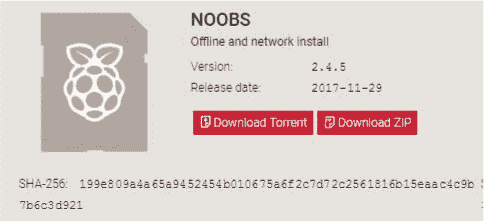

**图 0-6：** 下载 NOOBS

点击**下载 ZIP**按钮下载 NOOBS。（这是一个大文件，下载可能需要一些时间。）找到文件所在的*下载*文件夹，或者其他你下载文件的位置，但不要解压缩它。

你需要将 NOOBS 文件的内容复制到一张空白的 microSD 卡上，但首先你需要格式化该卡。你的 microSD 卡至少需要 8GB 才能正常运行。根据你电脑上的操作系统执行相应的操作。

#### 在 Windows 或 macOS 上格式化 microSD 卡

将 microSD 卡连接到你的计算机，然后按照以下步骤格式化你的 microSD 卡：

1.  访问 *[`www.sdcard.org/downloads/formatter_4/`](https://www.sdcard.org/downloads/formatter_4/)* 下载适用于 Windows 或 Mac 的 SD 卡格式化工具（见 图 0-7）。

    

    **图 0-7：** SD 卡格式化工具下载

1.  在接受条款后，ZIP 文件应该开始下载。

1.  运行安装文件将 SD 卡格式化工具安装到你的计算机上。然后，将你的 microSD 卡连接到计算机，打开 SD 卡格式化工具应用程序。

1.  如果你使用的是 Windows，在 SD 卡格式化工具对话框中，从下拉菜单中选择你的 SD 卡驱动器，并选择**覆盖格式化**选项。点击**格式化**按钮进行格式化（见 图 0-8）。

    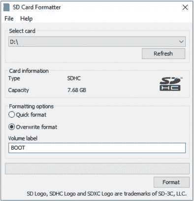

    **图 0-8：** Windows 上的 SD 卡格式化工具对话框

1.  如果你使用的是 macOS，在 SD 卡格式化工具对话框中，从下拉菜单中选择 microSD 卡驱动器，选择 **覆盖格式**，并将你的 microSD 卡命名为 **BOOT**，如 图 0-9 所示。然后点击 **格式化**。

    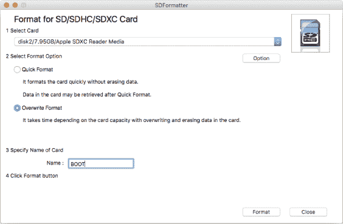

    **图 0-9：** macOS 上的 SD 卡格式化工具对话框

#### 在 Linux 上格式化 microSD 卡

将你的 microSD 卡连接到电脑，然后按照以下步骤在 Linux 上格式化 microSD 卡：

1.  访问 *[`gparted.org/`](http://gparted.org/)* 并下载 GParted 软件。

1.  安装并打开 GParted。

1.  如 图 0-10 所示，选择右上角的 microSD 卡。

    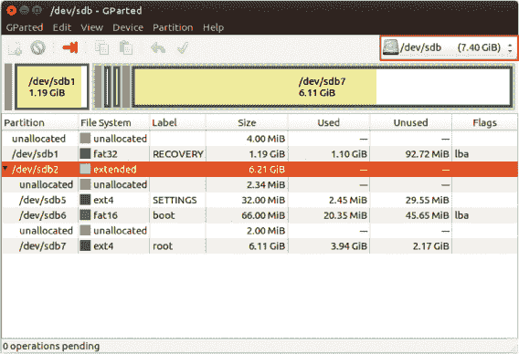

    **图 0-10：** 在 Ubuntu 上的 GParted

1.  在窗口的下半部分，你应该会看到一系列列出的分区。右键点击其中一个分区并删除它。重复此过程删除你 microSD 卡上的所有分区，以便所有存储空间未分配。

1.  右键点击未分配的分区并选择 **创建新分区**。

1.  将文件系统设置为 **fat32**，输入标签 **BOOT**，并点击 **添加** 按钮，如 图 0-11 所示。最后，点击主窗口顶部的绿色勾选标志以继续操作。

    

    **图 0-11：** 在 GParted 中创建新的 microSD 卡分区

最终，你的 microSD 卡应如下所示：图 0-12。

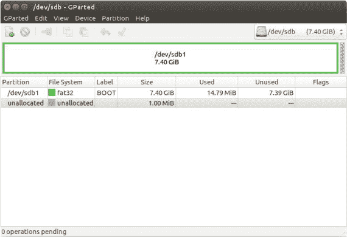

**图 0-12：** 使用 GParted 格式化的 microSD 卡

#### 将 Raspbian 加载到 microSD 卡上

在 microSD 卡正确格式化后，将其插入你的电脑，解压 *NOOBS.zip* 文件中的内容，并将文件复制到卡上。然后安全地从电脑中弹出你的 microSD 卡。

现在你的 microSD 卡已准备好启动 Raspberry Pi，你可以设置 Pi 作为一个完全功能的桌面电脑。

### 将你的 Raspberry Pi 设置为桌面电脑

使用 Raspberry Pi 作为桌面电脑就像拥有一个学习中心，让你可以在不担心破坏电脑的情况下构建项目和编写自己的软件。这也是初学者使用 Raspberry Pi 与物理世界互动的最简单方式。

#### 连接你的 Raspberry Pi

这是使用你的 Pi 作为桌面电脑所需的一切清单：

+   安装了 NOOBS 的 microSD 卡

+   显示器或电视

+   HDMI 电缆

+   鼠标

+   键盘

+   电源适配器

电源适配器应是最后连接的设备，但其他组件连接的顺序并不重要。不过为了简便起见，我们建议你按以下步骤操作：

**注意**

*如果你的 microSD 卡上没有安装 NOOBS，请返回 “下载 NOOBS”，查看 第 10 页 了解如何安装。*

1.  将你的 microSD 卡插入 Pi 上的 microSD 卡槽。

1.  使用 HDMI 电缆将显示器或电视连接到 Raspberry Pi 的 HDMI 插口。

1.  将鼠标和键盘连接到可用的 USB 端口。

1.  将电源适配器连接到 microUSB 电源输入端口。

1.  将电源适配器插入电源插座。

图 0-13 展示了这些连接。

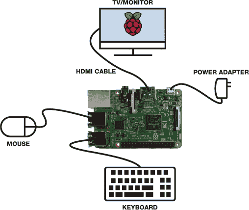

**图 0-13：** 将树莓派连接到必要的外围设备

当您为树莓派供电时，您应该会看到一个红色 LED 和一个绿色 LED 亮起，如图 0-14 所示。这些被称为*状态 LED*，它们为您提供了一些有用的信息。

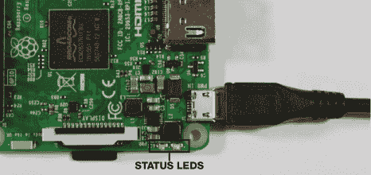

**图 0-14：** 树莓派板状态 LED

当红色 LED 亮起时，表示树莓派已连接到电源。当绿色 LED 闪烁时，表示 microSD 卡正在活动。

#### 第一次启动树莓派

一旦为树莓派板供电，它应该会自动启动。如果您正确设置了 NOOBS，几秒钟后应该会看到如图 0-15 所示的安装窗口。

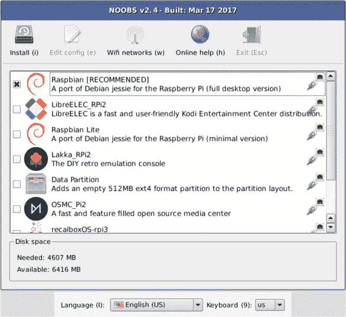

**图 0-15：** NOOBS 安装窗口

**注意**

*正确选择您的键盘布局非常重要，否则输入时屏幕上会出现错误的字符。*

默认应选择 Raspbian。屏幕底部，NOOBS 安装窗口外，您需要根据地区选择语言和键盘布局。

设置语言和键盘偏好后，点击安装窗口左上角的**安装**按钮。此时，您的树莓派应该会提示是否覆盖 microSD 卡；选择**是**，安装将开始。

安装完成后，点击**确定**，并且会弹出消息提示您重启树莓派。重启后，您应该会看到 Raspbian 桌面环境，它看起来类似于图 0-16。

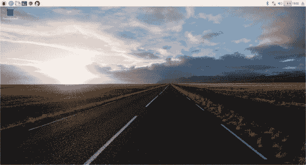

**图 0-16：** Raspbian 桌面环境

**注意**

*您只会在第一次启动时看到安装菜单。下次启动树莓派时，您将直接进入桌面环境。*

恭喜！您已成功将树莓派设置为桌面计算机。

您不应该被要求输入用户名和密码，但未来可能会要求您这样做。默认的用户名是*pi*，默认的密码是*raspberry*。您可以通过任务栏主菜单选择**首选项** ▸ **树莓派配置**来更改密码。在**系统**选项卡中，点击**更改密码**按钮来更改密码，如图 0-17 所示。

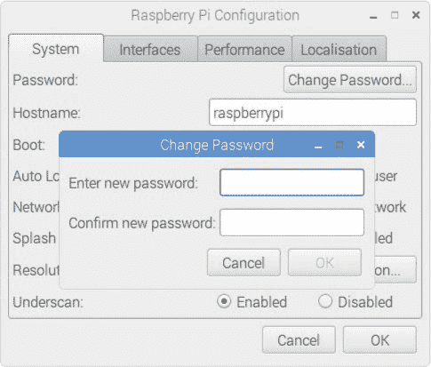

**图 0-17：** 在树莓派上更改密码

我们建议在本书中跟随项目时使用默认用户账户。不过，如果您需要创建一个新用户账户，请参阅“添加新用户账户”框。

**添加新用户账户**

要在你的树莓派上添加新用户账户，打开终端并输入以下命令，将“username”替换为你想给用户取的名字：

```
pi@raspberrypi:~ $ sudo adduser *username*
```

系统会提示你输入密码两次（在你输入密码时，终端不会显示字符）。接着，系统会询问你关于用户的其他信息，你可以通过按 ENTER 键跳过这些问题。最后，终端会提示你验证信息。如果信息正确，输入`Y`并按 ENTER。你现在应该已经有了一个新的用户账户。

#### 桌面游览

一旦你开始探索桌面环境，你会注意到它与普通电脑非常相似：它有任务栏和带有垃圾桶的桌面区域。你可以打开、拖动、调整窗口大小和关闭窗口；创建、重命名、移动和删除文件夹；启动应用程序；以及进行你通常在普通桌面电脑上做的大多数操作。

##### 使用任务栏

任务栏位于屏幕顶部，右侧有几个实用的图标。图 0-18 展示了每个图标的功能。

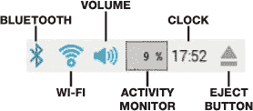

**图 0-18：** 任务栏右侧的图标

任务栏的左侧有任务栏菜单和一些有用的程序快捷启动图标（见图 0-19）。

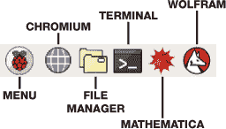

**图 0-19：** 任务栏快捷启动图标

我们鼓励你点击图标，探索程序。

##### 探索程序菜单

当你点击任务栏菜单（任务栏上的树莓派符号）时，一个带有子菜单的下拉菜单应会打开（见图 0-20）。

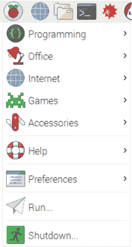

**图 0-20：** 任务栏菜单

探索每个菜单项，看看里面有什么。例如，编程子菜单包含了几个用来编写软件的工具，如 Java 和 Python。这些工具值得你在闲暇时自己去探索。

##### 文件管理器

任务栏左侧有一个文件夹图标，点击它会打开图 0-21 中显示的文件管理器窗口。文件管理器是一个文件夹，里面有更多的文件夹供你整理文件。你可以创建、重命名、移动和删除文件夹。

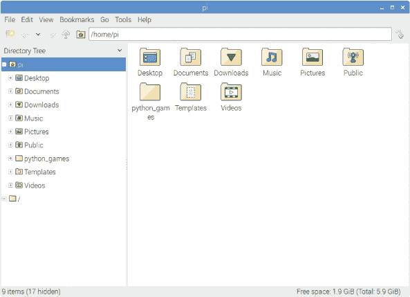

**图 0-21：** 文件管理器

##### 访问终端

另一个重要的程序是终端，当你使用树莓派时，你将经常使用它。简单来说，终端通过命令行发送基于文本的指令，以与树莓派交互。要访问终端，点击任务栏上的快捷启动**终端**图标（如图 0-19 中所标记）或者进入任务栏菜单并选择**附件** ▸ **终端**。你应该会看到一个像图 0-22 中的窗口。

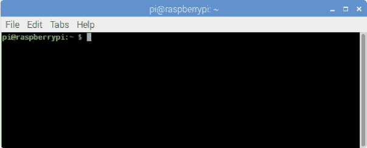

**图 0-22：** 树莓派终端

在终端中，你可以输入特定的命令来控制 Raspberry Pi。例如，你可以使用命令 `ls foldername` 来查看文件夹中的内容，或使用 `mkdir foldername` 来创建一个新文件夹。你可以像使用计算机一样做几乎所有事情，只不过不是点击图标，而是输入一些特定的文本命令。

不要被终端吓到。它看起来可能有点令人生畏，但本书中的每个项目都会提供你需要输入的命令，所以跟着做就很容易了。

##### 将 Pi 连接到互联网

你可以通过 Wi-Fi 或使用以太网电缆连接 Pi 到互联网。通过 Wi-Fi 连接与普通计算机一样简单。

点击任务栏右侧的第二个图标，如图 0-23 所示。选择可用连接中的网络，输入你的网络凭据，就完成了。

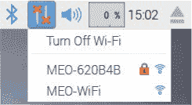

**图 0-23：** 连接到 Wi-Fi

如果你使用以太网电缆，只需将它插入 Pi 的以太网端口即可。

##### 访问互联网并浏览网页

Raspberry Pi 浏览器是 Chromium。要打开 Chromium，请点击任务栏上的**Chromium**图标（一个蓝色的地球图标），或者在任务栏菜单中选择**Internet** ▸ **Chromium**。

图 0-24 显示了一个打开的 Chromium 窗口。

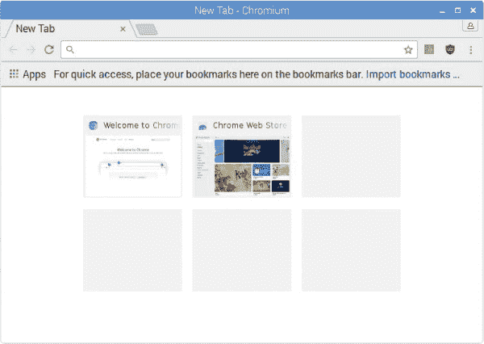

**图 0-24：** Chromium 网络浏览器

如你所见，它与 Google Chrome 非常相似。实际上，Chromium 是 Google Chrome 所基于的开源浏览器。

##### 连接外部设备

要使用外部设备（如 USB 可移动磁盘），只需将设备插入一个可用的 USB 端口。应该会弹出一个窗口，像图 0-25 所示。选择**在文件管理器中打开**来查看设备内容或将文件移动到设备中。

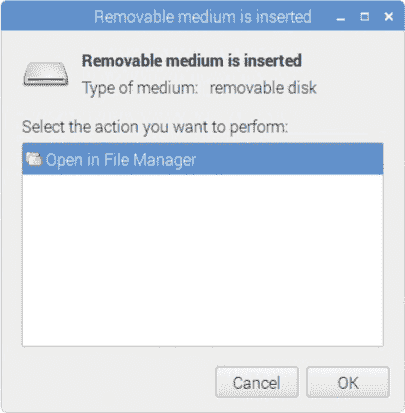

**图 0-25：** 可移除介质插入窗口

完成后，通过点击任务栏上的**弹出**图标并选择你的设备来安全弹出设备。

#### 关机、重启和注销

当你关闭 Pi 时，确保正确关闭。如果直接拔掉电源，可能会损坏 Pi。关闭 Pi 的最简单方法是从任务栏菜单中选择**关机**，然后点击**关机**，如图 0-26 所示。

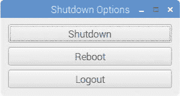

**图 0-26：** 关机菜单选项

在移除电源适配器之前，等待绿色 LED 停止闪烁。

你还可以从关机菜单中重新启动或注销你的 Pi。如果你想重新登录，只需输入用户名和密码即可。注销选项对于需要切换帐户时非常有用。

你的 Pi 现在已准备好运行一些程序！但在此之前，让我们学习一些 Python 编程基础，包括用户输入、变量、数学运算符、条件语句和循环。

### 开始使用 Python

Python 是你在本书中大多数项目中使用的编程语言。它是最简单、最易学的编程语言之一，因此即使你从未编程过，它也是一个不错的入门选择。

你的 Raspberry Pi 安装了两个版本的 Python：Python 2 和 Python 3。在本书中，我们会尽可能使用 Python 3，因为它是最新的版本。Python 2 仍然被许多程序员使用，并且有频繁的更新，但它正在逐渐被淘汰。

**注意**

*我们仅在 项目 12 中使用 Python 2，该项目使用了 Python 3 写作时无法使用的包。*

#### Python 3 集成开发环境

要编写 Python 代码，你需要 Python 3 的 IDLE（*I*ntegrated *D*eve*L*opment *E*nvironment），安装 Raspbian 时会自动安装该环境。将你的 Pi 连接到显示器、鼠标和键盘后，通过任务栏主菜单启动 IDLE，然后选择 **编程** ▸ **Python 3 (IDLE)**。 图 0-27 显示了 *Python Shell*，它是打开的 IDLE 窗口的名称。

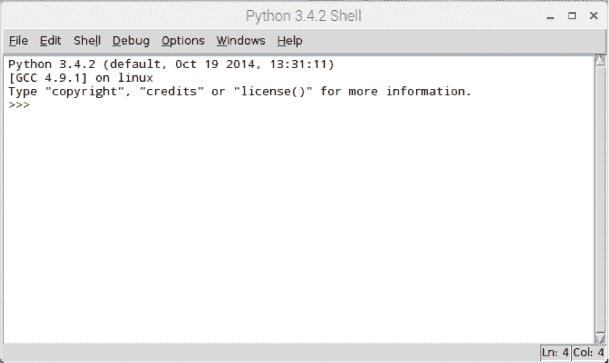

**图 0-27：** Python Shell

Python Shell 是你输入并运行 Python 指令的地方，用于告诉 Python 做什么。Python 使用 *解释器* 来运行你的指令，解释器实际理解并执行你的代码。

当 Shell 打开时，你应该会看到三个箭头 `>>>`，如 图 0-27 所示——这叫做 *提示符*，它表示 Shell 已准备好让你输入代码。Python 可以运行的一些最简单指令是数学运算。试试看，输入以下内容：

```
>>> 2 + 2

```

按下 ENTER 后，你应该会看到以下结果：

```
4
>>>
```

你可以看到结果前没有提示符。这是为了表明它是 Python 的 *输出*，而不是你的输入。

#### 基础 Python 指令

Python 能理解多种类型的指令。你可以通过将这些指令或命令组合起来构建 *程序*。我们将在这里讨论不同种类的指令。

##### 数学运算符

Python 能执行大多数数学运算。 表 0-2 列出了 Python 中使用的数学运算符。

**表 0-2：** Python 中的数学运算符

| **运算符** | **数学运算** |
| --- | --- |
| `+` | 加法 |
| `-` | 减法 |
| `*` | 乘法 |
| `/` | 除法 |
| `//` | 除法，舍弃小数部分 |
| `%` | 除法余数 |

尝试更多这些运算，感受一下 Shell 的使用。

##### Python 关系运算符

Python 可以使用*关系运算符*进行比较，这些运算符比较两边的值，并展示它们之间的关系。一个值，通常是数字或字母，是程序操作的基本组成部分。

表 0-3 展示了 Python 中使用的不同关系运算符。

**表 0-3：** Python 中的关系运算符

| **运算符** | **描述** |
| --- | --- |
| `==` | 等于 |
| `!=` | 不等于 |
| `>` | 大于 |
| `<` | 小于 |
| `>=` | 大于或等于 |
| `<=` | 小于或等于 |

例如，在 Python shell 中输入以下内容：

```
>>> 2 > 4
```

你应该得到：

```
False
>>>
```

Python 会检查`2`是否大于`4`并告诉你它不是。另一方面，如果你输入：

```
>>> 2 < 4
```

你将得到：

```
True
>>>
```

##### 给变量赋值

一个*变量*就像是你用来存储值的盒子。你给变量起个名字，当你需要使用这个值时，可以输入变量的名字来代替。图 0-28 说明了这一概念。要给变量赋值，你使用等号（`=`），变量名在左边，值在右边。

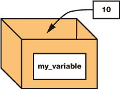

**图 0-28：** 给变量赋值

变量在程序中非常有用，可以用来存储信息，之后你可以引用或重复使用这些信息。例如，输入以下内容：

```
>>> my_variable = 10
```

在这一行中，你创建了一个名为`my_variable`的变量，并将值 10 赋给它，如图 0-28 所示。

然后，如果你像下面这样在 Python shell 中输入变量名：

```
>>> my_variable
```

它应该返回存储在其中的值作为输出：

```
10
>>>
```

你给变量起的名字不能有空格，并且是区分大小写的，所以`my_variable`和`my_Variable`或`MyVariable`是不同的。

##### 数据类型

变量可以存储多种类型的值，不仅仅是整数。这时数据类型就派上用场了。*数据类型*是对一个值的分类，它告诉解释器可以对该值进行哪些操作以及如何存储它。表 0-4 展示了你最常用的数据类型。

**表 0-4：** Python 数据类型

| **数据类型** | **描述** |
| --- | --- |
| 整数 | 整数（完整的）数值 |
| 浮点数 | 带小数点的数字 |
| 字符串 | 由引号括起来的一组字符 |
| 布尔值 | 真或假 |

我们来看一下表中每个数据类型的示例：

```
>>> a = 5
>>> b = 7.2
>>> c = 'Hello'
>>> d = True
```

这是四个赋值语句。第一个，赋给`a`的是一个*整数*，它是一个整数。`b`变量包含一个*浮点数*值，它是一个带小数点的数字。第三个值，`'Hello'`，是一个*字符串*，它是一个字符的序列。（注意，字符串必须放在单引号或双引号中。）最后，`True`是一个*布尔值*，它只能取`True`或`False`中的一个。在我们使用`>`运算符时，你已经看到过这个数据类型的用法。

#### Python 编辑器

Python shell 很适合用来尝试简单的代码片段，但它一次只能处理一行代码。要编写一个程序（即 *脚本*），你需要将许多命令组合在一起一次性执行。编写脚本的正确地方是 *Python 编辑器*，它就像一个写代码的文字处理器。在编辑器中，你可以创建、编辑和保存 Python 文件。然后，你可以通过运行文件来执行这些脚本。Python 文件的扩展名为 *.py*。

要在 Python 编辑器中打开一个新文件，进入 Python shell 并选择 **文件** ▸ **新建文件**。一个类似于 图 0-29 中的窗口应该会弹出。

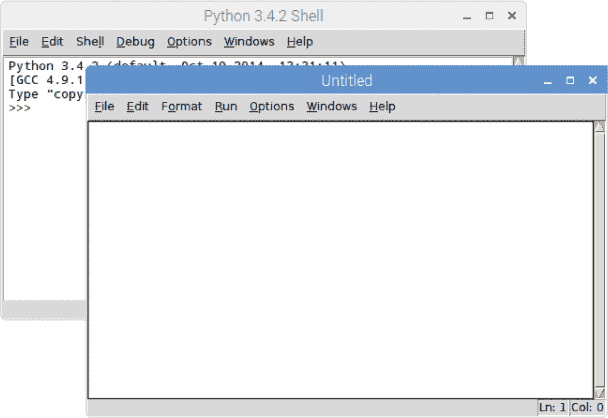

**图 0-29：** Python 编辑器和 Python shell

Python 编辑器没有提示符，因为你输入的命令不会立即执行。你需要将它们保存在一个文件中，稍后再运行。让我们写一个非常简单的 Python 脚本来试试编辑器。

#### 你的第一个 Python 程序

传统上，你编写的第一个程序是一个简单的程序，用来显示“Hello, world!”的信息。要在 Python 中做到这一点，请输入以下内容：

```
#this script prints Hello, world!
print('Hello, world!')
```

第一行是注释。*注释* 必须以井号（`#`）开头，表示井号后的任何文本都应被 Python 解释器忽略。注释对提醒你或使用你脚本的人代码的用途非常有帮助。

第二行是实际执行打印 `Hello, world!` 的代码，使用了 `print()` 函数。*函数* 告诉 Python 执行某个特定的操作；在这个例子中，`print()` 函数告诉 Python 显示括号内的任何内容。括号内的信息被称为函数的 *参数*。`print()` 函数是 Python 的内置函数，这意味着它随时可以使用。

**注意**

*所有 Python 脚本都需要以* .py *扩展名结尾。别忘了给文件名加上扩展名。*

在你运行代码之前，你需要先保存脚本。进入 **文件** ▸ **另存为**，并为你的脚本输入一个名称——例如 *hello_world.py*——然后选择一个文件夹。

要运行脚本，按 **F5** 键，或者进入 **运行** ▸ **运行模块**。结果会显示在 Python shell 中，而不是编辑器中。你应该会看到一条信息，显示 `Hello, world!`，如 图 0-30 所示。

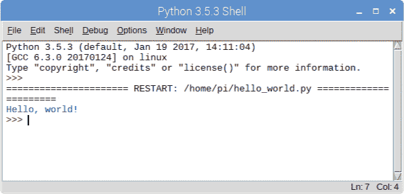

**图 0-30：** 运行 *hello_world.py* 脚本

现在，尝试改变 `print()` 函数的参数，看看 Python shell 中显示不同的消息。

##### 请求用户输入

你可以通过请求用户输入来提升程序的功能，这意味着用户需要输入一些信息以便程序继续运行。在编辑器中，输入以下代码片段来请求用户输入他们的名字，然后使用这个名字打印问候消息：

```
username = input('What is your name?')
print('Hello ', username)
```

你使用`input()`函数向用户询问输入。在这个例子中，用户会被问到`What is your name?`。这段文本会显示给用户，直到用户输入内容，程序才会继续。用户输入的内容将被赋值给`username`变量，以便我们在程序中后续使用。

将这两行代码保存在一个名为*username.py*的新文件中，并运行文件查看会发生什么。你应该会在命令行中被询问你的名字，当你输入时，你应该能看到问候语。

`input()`函数只接受字符串类型的数据，所以如果你想获取一个数字并在后续程序中使用，你需要将其转换为整数或浮点数。例如，如果你想将用户的年龄获取为整数，你需要使用`int()`函数：

```
age = int(input('How old are you?'))
```

类似地，要将输入转换为浮点数，可以使用`float()`函数：

```
height = float(input('How tall are you?'))
```

如果你想对输入执行数学运算，将字符串转换为数字是必要的。

##### 使用条件语句做决策

要编写有用的程序，你几乎总是需要根据某个条件是否为真来执行不同的操作。在编程中，这些叫做*条件语句*，它们有如下结构：

```
if something is true:
    do_something()
elif this is true instead:
    do_something_else()
(...)
else:
    do_another_something_else()
```

例如，以下代码片段尝试根据你选择的颜色猜测你在想的水果：

```
  print('Pick a fruit:')
  print('strawberry, banana, or kiwi?')
  color = input ('Enter the color of the fruit you chose: ')
➊ if (color == 'red'):
    ➋ print('Your fruit is a strawberry.')
➌ elif (color == 'yellow'):
      print('Your fruit is a banana.')
➍ elif (color == 'green'):
      print('Your fruit is a kiwi.')
➎ else:
      print('Invalid input.')
```

第一个`if`条件测试用户是否输入了`red` ➊。如果是，程序猜测水果是草莓，并在 ➋ 输出`Your fruit is a strawberry.`。

`elif`语句代表*else if*，只有在第一个`if`条件不成立时才会执行。所以，如果用户没有输入`red`，代码会检查输入是否为`yellow` ➌。如果是，程序猜测水果是香蕉。如果不是，它会检查颜色是否为`green` ➍，如果是，程序猜测你选择的是猕猴桃。

**注意**

*Python 的标准缩进是四个空格，而不是制表符。然而，在 IDLE 中，你可以按 Tab 键自动插入四个空格。*

注意这里有一个非常重要的事项。有些行的代码前面有一些空格——准确来说是四个空格。这叫做*缩进*。缩进对于定义*代码块*至关重要。例如，你在 ➊ 有一个`if`语句，接下来的代码行在 ➋ 是缩进的。缩进告诉 Python，这一行属于前面的`if`语句，因此这行代码只有在`if`条件成立时才会执行。行 ➌ 没有缩进，意味着这一行不属于同一个代码块，会单独执行。缩进在 Python 中是至关重要的，解释器通过缩进来确定哪些代码何时执行，所以在做本书中的练习时要特别注意空格。

最后，如果用户拼写错误或没有输入小写的颜色，`else`语句 ➎ 会执行，程序会提示用户输入无效。

总结来说，脚本会依次检查每个条件。当一个条件为假时，它会跳到下一个条件，依此类推。当一个条件为真时，它会运行对应的缩进代码，然后语句结束。注意，程序中没有`elif`语句的数量限制。也不必包括`else`语句，但如果有`else`，它必须放在最后。

尝试创建一些带有自己示例的`if`/`else`语句，使用`print()`和`input()`函数——这是最好的学习方式。

##### while 和 for 循环

循环允许你在条件满足时多次执行一段代码。循环有两种类型：`while`循环和`for`循环。例如，你可以使用`while`循环打印从 1 到 10 的所有数字。在 Python 编辑器中输入以下内容：

```
number = 1
while (number <= 10):
    print(number)
    number = number + 1
```

属于`while`循环的代码，由缩进表示，会在变量`number`的值小于或等于(`<=`)10 时执行。在每次循环中，当前的`number`会被打印出来，然后加 1。

你也可以使用`for`循环打印从 1 到 10 的数字，像这样：

```
number = 1
for number in range(1,11):
    print(number)
```

`for`循环会在变量`number`的值在 1 到 11 的范围内时执行。`range()`函数会自动将下一个值赋给`number`变量，直到你指定的最终数字之前的一个值。

当你想要重复执行一段代码一定次数时，应该使用`for`循环。当你希望重复执行代码直到某个条件不再满足时，应该使用`while`循环。在某些情况下，你可以使用任意一种循环，但正如你在本书中看到的那样，通常其中一种比另一种更高效。

#### 制作一个简单的计算器

为了测试你的新编程技能，你将构建一个计算器。这个程序的脚本非常简单，使用了你刚刚学到的所有概念。你的计算器将执行以下操作：

+   显示欢迎信息

+   请用户选择要执行的操作

+   请用户输入一个数字

+   请用户输入另一个数字

+   执行计算

+   打印结果

打开 Python shell 并选择**文件** ▸ **新建文件**。将以下代码复制到 Python 编辑器中。（记住，所有脚本也可以通过本书的资源下载，网址为*[`www.nostarch.com/RaspberryPiProject/`](https://www.nostarch.com/RaspberryPiProject/)*。）

```
➊ #Python Calculator
➋ running = True
➌ welcome_message = '***Welcome to Python Calculator***'
➍ print(welcome_message)

➎ while running:
      print('Operations')
      print('1 = Addition')
      print('2 = Subtraction')
      print('3 = Multiplication')
      print('4 = Division')
      print('5 = Quit program')
   ➏ operation = int(input('Enter a number to choose an operation: '))
   ➐ if operation == 1:
         print('Addition')
      ➑ first = int(input('Enter first number: '))
        second = int(input('Enter second number: '))
      ➒ print('Result = ', first + second)
   ➐ elif operation == 2:
          print('Subtraction')
        ➑ first = int(input('Enter first number: '))
          second = int(input('Enter second number: '))
        ➒ print('Result = ', first - second)
   ➐ elif operation == 3:
          print('Multiplication')
        ➑ first = int(input('Enter first number: '))
          second = int(input('Enter second number: '))
        ➒ print('Result = ', first * second)
   ➐ elif operation == 4:
          print('Division')
        ➑ first = int(input('Enter first number: '))
          second = int(input('Enter second number: '))
        ➒ print('Result = ', first / second)
   ➐ elif operation == 5:
          print('Quitting program... ')
        ➓ running = False
```

让我们来分解一下计算器程序是如何工作的。第一行只是一个注释，它告诉任何阅读程序的人这个脚本的作用 ➊。然后，我们在➋和➌处为变量赋值，并在➍处打印欢迎信息。

接下来我们开始一个`while`循环 ➎，它将在`running`设置为`True`时运行；也就是说，只要用户没有退出程序。我们让用户选择一个数学运算操作，使用数字 1 到 5，程序将他们选择的值存储在`operation`变量中 ➏。我们使用一系列的`if`/`elif`语句来选择正确的运算，根据输入 ➐。然后我们让用户输入进行运算的数字 ➑，每个`if`/`elif`代码块的最后一行执行选定的数学运算并打印结果 ➒。

如果用户输入`5`，`running`变量将被设置为`False`，`while`循环停止 ➓。

##### 运行脚本

将你的脚本保存为*calculator.py*。然后按**F5**或去**运行** ▸ **运行模块**。 图 0-31 展示了你应该看到的内容。

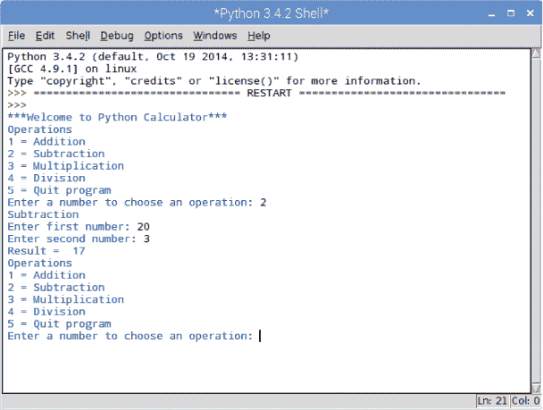

**图 0-31：** 运行*calculator.py*

##### 进一步扩展

恭喜！你已经创建了一个工作计算器程序。现在看看你能做些什么来改进它。举个例子，你可能已经注意到用户输入只接受整数；如果计算器能接受浮点数，那会更有用，所以看看你能否添加这个功能。另一个你可以尝试的改进是允许用户使用超过两个数字进行计算。
