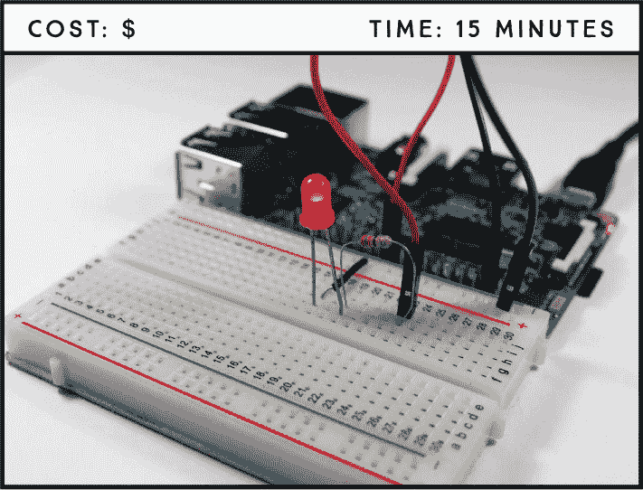
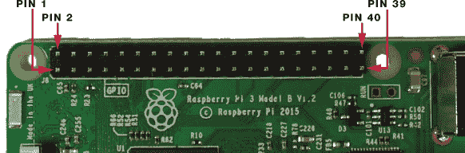
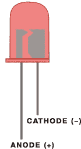
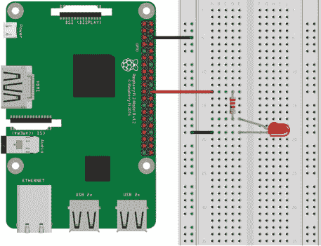
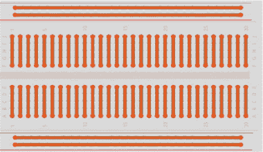
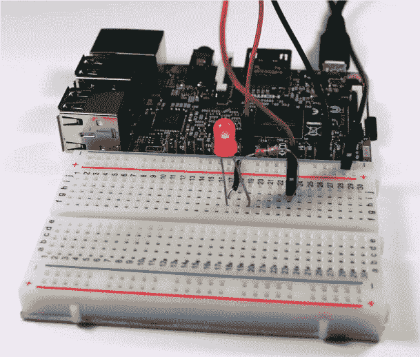

## 第二章：使 LED 闪烁**

在这个第一个项目中，你将把一个 LED 连接到你的树莓派，并通过一个 Python 脚本使它闪烁。学习如何通过 GPIO 引脚控制 LED 闪烁是你树莓派教育的重要步骤；一旦你学会了如何控制 LED，你就可以控制几乎任何输出设备，无论是马达、灯泡，还是甚至是烤面包机。



**所需部件**

树莓派

面包板

5 毫米 LED

330 Ω 电阻

跳线

### 介绍 GPIO 引脚

*通用输入/输出（GPIO）* 引脚允许你将电子硬件（如 LED 和传感器）连接到你的树莓派。它们可以用于读取和发送信息，使得你的树莓派能够与真实世界进行互动。

树莓派 3 型 B 主板有一排 40 个 GPIO 引脚，见图 1-1。这个布局与树莓派 2 型 B 和树莓派 1 型 B+相同，但与树莓派 1 型 A 和 B 略有不同，后者只有前 26 个引脚。如果你使用的是其他型号的树莓派，可以查阅“树莓派 GPIO 引脚指南”（见第 261 页）。



**图 1-1：** 树莓派 GPIO 布局

有两种方式可以引用一个 GPIO 引脚：通过其名称（称为 GPIO 编号或 Broadcom 编号）或通过其对应的引脚号（称为物理编号）。例如，GPIO 25 对应于引脚 22。本书中，我们将通过 GPIO 引脚的名称来引用它们。GPIO 引脚可以设置为 HIGH，输出 3.3V 并打开组件，或设置为 LOW，输出 0V 并关闭组件。

| **功能** | **名称** | **编号** | **编号** | **名称** | **功能** |
| --- | --- | --- | --- | --- | --- |
| 直流电源 | 3.3 V | 1 | 2 | 5 V | 直流电源 |
| SDA1, I²C | GPIO 2 | 3 | 4 | 5 V | 直流电源 |
| SCL1, I²C | GPIO 3 | 5 | 6 | GND |  |
| GPIO_GCLK | GPIO 4 | 7 | 8 | GPIO 14 | TXD0 |
|  | GND | 9 | 10 | GPIO 15 | RXD0 |
| GPIO_GEN0 | GPIO 17 | 11 | 12 | GPIO 18 | GPIO_GEN1 |
| GPIO_GEN2 | GPIO 27 | 13 | 14 | GND |  |
| GPIO_GEN3 | GPIO 22 | 15 | 16 | GPIO 23 | GPIO_GEN4 |
| **功能** | **名称** | **编号** | **编号** | **名称** | **功能** |
| --- | --- | --- | --- | --- | --- |
| 直流电源 | 3.3 V | 17 | 18 | GPIO 24 | GPIO_GEN5 |
| SPI_MOSI | GPIO 10 | 19 | 20 | GND |  |
| SPI_MISO | GPIO 9 | 21 | 22 | GPIO 25 | GPIO_GEN6 |
| SPI_CLK | GPIO 11 | 23 | 24 | GPIO 8 | SPI_CE0_N |
|  | GND | 25 | 26 | GPIO 7 | SPI_CE1_N |
| I²C ID EEPROM | DNC | 27 | 28 | DNC | I²C ID EEPROM |
|  | GPIO 5 | 29 | 30 | GND |  |
|  | GPIO 6 | 31 | 32 | GPIO 12 |  |
|  | GPIO 13 | 33 | 34 | GND |  |
|  | GPIO 19 | 35 | 36 | GPIO 16 |  |
|  | GPIO 26 | 37 | 38 | GPIO 20 |  |
|  | GND | 39 | 40 | GPIO 21 |  |

**警告**

*GPIO 引脚设计为 3.3V 工作，因此如果将它们连接到更高电压，会永久损坏你的树莓派。*

表格中灰色高亮的引脚 27 和 28 是 DNC 引脚，表示“不可连接”。树莓派还有八个 GND（地）引脚——在表格中用黑色高亮显示——用于将地线连接到电路中。还有四个电源引脚，两个 5V 引脚和两个 3.3V 引脚——分别用红色和橙色高亮显示——用于提供电源。有些引脚具有特殊功能；例如，黄色高亮的引脚用于串行外设接口（SPI）通信，绿色高亮的引脚用于集成电路间通信（I²C）。你将在项目 3 和项目 7 中分别学习这些通信协议。

### 介绍 LED

LED 有各种尺寸、形状和颜色，一些 LED 甚至可以混合颜色，产生几乎任何颜色。在本项目中，你将使用一个简单的 5 毫米红色 LED。

*LED*，即*发光二极管*，顾名思义，是一种能够发光的二极管。二极管是一种具有*极性*的电子元件，意味着它们只允许电流朝一个方向流动，从正极流向负极。像所有二极管一样，LED 有一个正连接，称为*阳极*，还有一个负连接，称为*阴极*。LED 的两根引脚长度不同，帮助你区分正负极，见图 1-2。较长的引脚是阳极（+），较短的引脚是阴极（–）。



**图 1-2：** 一个 5 毫米红色 LED

### 选择合适的电阻器

LED 只能承受一定量的电流，超过该电流会导致 LED 过载并烧毁，这可能会损坏 LED 甚至损坏树莓派主板。为了防止这种情况发生，你必须始终将 LED 与*电阻器*串联连接：电阻器是一个小型元件，能够限制通过它的电流量。

电阻器有各种不同的数值，你需要选择一个足够强大的电阻器来保护你的元件，但又不能强到限制元件的性能。例如，一个较强的电阻器可能会使 LED 发出的光变暗。适当的电阻值取决于你使用的 LED——大多数电子设备中使用的 LED 的最大电流额定值为 20 mA。对于本项目中的 LED，选择 220 Ω到 470 Ω之间的任何一个电阻值都可以，在这个范围内，较低的电阻值会使 LED 稍微亮一点。

**注意**

*我们建议你购买一套 1/4 W 电阻器，涵盖广泛的电阻值范围。这将满足你大部分的需求。*

电阻值由电阻器上的色环表示。电阻器通常有四个色环，如图 1-3 所示。前两个色环表示数值的前两位数字，第三个色环是一个乘数，表示前两位数字后面的零的数量，第四个色环表示电阻的*公差*，即实际电阻值可能偏高或偏低的百分比。例如，一个 330 Ω的电阻，公差为 5%，实际电阻值可能在 313.5 Ω和 346.5 Ω之间。


**图 1-3：** 一个 330 Ω的电阻

如果你需要帮助识别电阻器，请查阅《解码电阻值》中的电阻卡，在第 264 页可以找到。

### 布线电路

现在你已经准备好构建你的第一个电路了。本书中的所有项目都使用*无焊接面包板*，这是一种便宜且简便的方式，可以在不使用焊接连接组件的情况下构建电路。如果你以前从未使用过面包板，开始之前请务必阅读《面包板是如何工作的？》一节，位于第 42 页。

要将 LED 连接到树莓派，请按照以下步骤操作。使用图 1-4 中的接线图作为参考，如果需要的话，也可以查看图 1-1 以获取引脚位置。

1.  将蓝色面包板电源轨连接到树莓派的一个 GND 引脚（引脚 6、9、14、20、25、30、34 和 39 都提供 GND）。

1.  将 LED 插入面包板。

1.  将 330 Ω电阻插入面包板，使其一端连接到 LED 的阳极（较长的正极引脚）。

1.  使用跳线将电阻的另一端连接到 GPIO 25（引脚 22）。

1.  将 LED 的阴极（较短的负极引脚）连接到 GND 电源轨。



**清单 1-1：** 将 LED 连接到树莓派。弯曲的 LED 引脚是阳极。

我们已经给你提供了电阻器放置的位置说明，但实际上它是否连接到阳极或阴极并不重要，只要它连接到其中一个即可。你可能会想，为什么我们不直接将 LED 的阴极连接到引脚 6（GND）呢，因为只需要那个 GND 轨就能完成连接。原因是，使用面包板的 GND 轨是一种良好的做法，这在更复杂的电路中会变得更有用。

**面包板是如何工作的？**

使用面包板布线电路就像插拔组件一样简单。面包板上有一排排孔，这些孔通过底下的铜条连接在一起，因此你只需将组件插入这些孔中，然后使用跳线将它们连接起来。面包板的孔之间有特定的连接方式，如图中的橙色线所示。



每个独立的行之间是电气隔离的。水平线是*电源轨*，用于连接电源：蓝色轨道用于连接 GND，红色轨道用于连接电源。在面包板的中间有一个分隔区，将两边的行分开。你应该把组件放置在这些行中。在同一行、同一侧的组件会通过下面的铜条连接。

### 编写脚本

为了保持所有项目的组织性，在你的桌面环境中创建一个名为*Projects*的文件夹，用来保存所有项目的脚本。在新创建的文件夹内，创建一个名为*LEDs*的新文件夹，用来保存本书中的 LED 项目。

简单来说，闪烁 LED 项目的工作原理如下：

1.  LED 亮起 1 秒钟——GPIO 25 设置为 HIGH。

1.  LED 熄灭 1 秒钟——GPIO 25 设置为 LOW。

1.  LED 再次亮起 1 秒钟——GPIO 25 设置为 HIGH。

1.  LED 再次熄灭 1 秒钟——GPIO 25 设置为 LOW。

这个模式会一直持续，直到你告诉程序停止。

在本书中，我们将使用名为 gpiozero 的 Python 库来控制树莓派的 GPIO。gpiozero 库提供了一组接口，用于控制日常组件，如 LED、按钮、电位器、传感器等。

#### 进入脚本

打开**Python 3 (IDLE)**，并进入**文件** ▸ **新建文件**来创建一个新的脚本。将以下代码复制到 Python 编辑器，并将脚本保存为*blinking_led.py*，保存在*LEDs*文件夹内（记住你可以在* [`www.nostarch.com/RaspberryPiProject/`](https://www.nostarch.com/RaspberryPiProject/)*下载所有脚本）：

```
  #importing necessary libraries
➊ from gpiozero import LED
➋ from time import sleep

  #create an object called led that refers to GPIO 25
➌ led = LED(25)

  #create variable called delay that refers to delay time in seconds
➍ delay = 1

➎ while True:
      #set led to on for the delay time
    ➏ led.on()
      print('LED set to on')
    ➐ sleep(delay)
      #set led to off for the delay time
    ➑ led.off()
      print('LED set to off')
      sleep(delay)
```

这里有很多内容，我们将逐一讲解每个主要的代码部分。

##### 导入库

在➊处，你从 gpiozero 库导入`LED`，以控制 LED 连接的 GPIO。然后你从`time`模块导入`sleep()`函数➋。

##### 声明引脚

在➌处，你创建一个名为`led`的`LED`对象，指向 GPIO 25，这是 LED 连接的 GPIO。创建并使用这个`LED`对象时，Python 知道 GPIO 25 是一个输出，因此应该设置为 HIGH 或 LOW。声明之后，你可以使用`led`来引用你的 GPIO 25。

##### 启动 while 循环

在➎处，你开始一个`while`循环，条件是`True`，这意味着这个循环将永远运行，直到你自己停止程序。紧随循环声明之后的代码行会缩进，告诉 Python 这些是循环的内容，只要`while`条件满足就会执行。

##### 设置数字输出

接下来，你需要为 LED 设置数字输出。你可以使用`led.on()`函数 ➏ 将 GPIO 25 设置为高电平，打开 LED，使用`led.off()`函数 ➑ 将 GPIO 25 设置为低电平，关闭 LED。每次 LED 状态变化时，使用`sleep()`函数 ➐ 暂停 1 秒，形成闪烁效果。代码在此停下，等待`delay`变量中指定的时间（以秒为单位） ➍ 后继续执行下一行代码。这样，你就可以让 LED 在给定的时间内保持开或关状态。

#### 运行脚本

要运行脚本，首先保存它，然后按**F5**或点击**运行** ▸ **运行模块**。你的电路应该类似于图 1-5，LED 每秒钟闪烁一次。要停止正在运行的程序，按 CTRL-C。



**图 1-4：** 完成的项目

恭喜你——你刚刚完成了第一个可工作的项目！

### 进一步拓展

学习电子学和编程的最佳方式是通过实验。这里有两个你可以尝试的简单修改建议：

+   修改脚本中的延迟时间。

+   修改电路和脚本以控制多个 LED。

看看你能否利用在这个项目中学到的知识完成每个任务。
