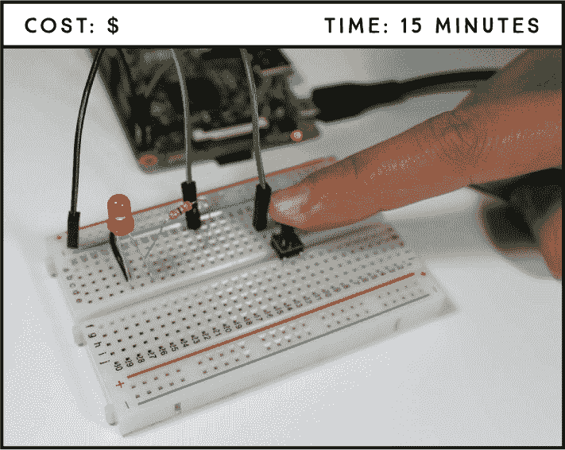
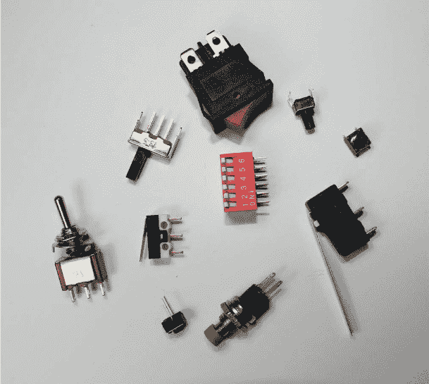
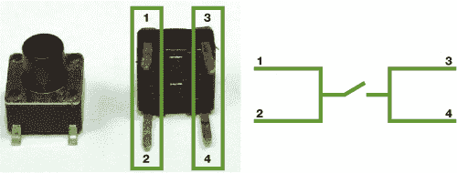
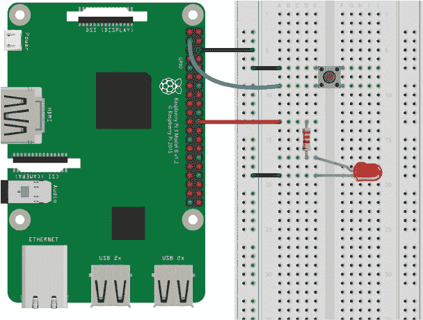

## 第三章：按钮 LED 手电筒**

这个 LED 手电筒项目将教你如何使用按钮开关，这是电子电路中的一项基础技能。你将学习如何在电路中使用按钮开关来触发事件——在这种情况下，当按钮被按下时点亮 LED，并在松开时停止事件。



**所需部件**

树莓派

面包板

5 毫米 LED

330 Ω 电阻

跳线

### 介绍开关和按钮

开关无处不在。你用它们来开灯、调节搅拌机的速度、点亮炉灶等。市场上有各种各样的开关，但你在家里常见的包括按钮开关、拨动开关、旋转开关和磁簧开关。Figure 2-1 展示了一些常见的电子开关。



**图 2-1：** 电子设备中使用的几种类型的开关

开关可以作为 *中断器*，中断电流以允许或限制某个组件的电源，或者作为 *分流器*，将电流引导到电路的另一部分。这个项目将使用一个简单的按钮开关——一个中断器开关，它非常适合电子电路，因为它便宜、完美适配面包板，而且易于操作。

按钮开关主要有两种类型：常开型和常闭型。*常开型* 按钮，如图 Figure 2-2 所示，电路默认是开路的，阻止电流流过。当你按下按钮时，两侧连接，电路闭合，电流开始流动。



**图 2-2：** 常开按钮的内部连接

*常闭型* 按钮开关在按钮没有被按下时，电路是闭合的，允许电流流动，直到你按下按钮使电路打开并停止电流的流动。

按钮开关可以有两脚或四脚。四脚按钮开关在原型设计项目中更为常见，因为它们非常适合面包板。图 Figure 2-2 的右侧展示了一个典型的常开型四脚按钮开关的示意图。脚 1 和脚 2 始终连接，脚 3 和脚 4 也是如此。

在这个项目中，你将使用一个常开型四脚按钮开关。这个按钮开关只有在按钮被按下时才允许电流流动，因此与普通的开关不同，本项目中的 LED 只会在按钮被按住的期间点亮。

### 接线电路

在这个项目中，你希望 LED 只有在按钮按下时才会点亮，因此你的树莓派需要能够识别按钮是被按下还是没有被按下。你的树莓派将通过 GPIO 引脚获取这个信息。

按照以下步骤创建你的电路，参考 Figure 2-3 进行操作：

1.  将 GND 连接到蓝色电源轨。

1.  将 LED 插入面包板，并通过一个 330 Ω 的电阻将 LED 的正极连接到 GPIO 25，就像我们在 项目 1 中做的一样。将 LED 的负极连接到 GND 排。

1.  将按钮插入面包板的中间位置，使得两个引脚位于分隔线两侧。你需要确保顶部的两个引脚和底部的两个引脚之间没有连接。（记住，面包板中央的这一条横向插槽是断开的。）

1.  将按钮的一侧连接到 GPIO 2，另一侧连接到 GND，正如在 图 2-3 中所示。



**图 2-3：** LED 手电筒电路

### 编写脚本

该脚本会根据按钮是否被按下或释放触发不同的事件。下面的 *伪脚本*——这是一种用英语描述代码的方式——应当帮助你理解 Python 脚本。编写伪脚本是概述程序的好方法。以下是程序的工作流程：

+   当按钮被按下时，LED 灯会被点亮。

+   当按钮没有被按下时（即按钮被释放时），LED 灯保持关闭。

打开 **Python 3 (IDLE)**，然后点击 **文件** ▸ **新建文件** 来创建一个新的脚本。将以下代码复制到 Python 编辑器中，然后将脚本保存为 *led_flashlight.py* 到 *LEDs* 文件夹（记得你可以在 *[`www.nostarch.com/RaspberryPiProject/`](https://www.nostarch.com/RaspberryPiProject/)* 下载所有脚本）：

```
➊ from gpiozero import LED, Button
  from signal import pause

➋ led = LED(25)
  button = Button(2)
➌ button.when_pressed = led.on
➍ button.when_released = led.off

➎ pause()
```

这个脚本很容易理解。首先，你导入了控制 LED 和按钮的 LED 和 Button 库；然后，你从 signal 库导入 `pause` ➊。`pause()` ➎ 函数让程序即使在所有代码执行完毕后依然保持运行，以检测事件——在这个例子中，它不断检查按钮的状态。

你创建了一个名为 `led` 的 `LED` 对象，它引用了 GPIO 25——LED 连接的引脚，以及一个名为 `button` 的 `Button` 对象，它引用了 GPIO 2——按钮连接的引脚 ➋。

`button.when_pressed` 函数在按钮被按下时会通过调用 `led.on` 来点亮 LED 灯，当检测到按钮按下时 ➌。同样，`button.when_released` 函数会调用 `led.off` 来关闭 LED 灯，当按钮没有被按下时 ➍。

按下 **F5** 或前往 **运行** ▸ **运行模块** 来运行脚本。按下按钮时，LED 灯应该亮起。要停止程序，按下 CTRL-C。

### 进一步学习

在这个简单项目中学到的内容可以帮助你创建无数其他项目。以下是一些测试你技能的想法：

+   添加更多的按钮和 LED 灯。

+   修改代码，使得在按下按钮时改变 LED 状态，这样你就不需要一直按住按钮才能保持 LED 灯亮起。

+   构建一个交通信号灯。
