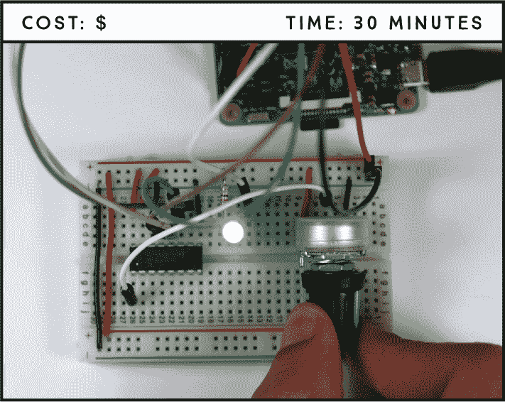
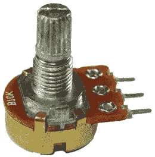
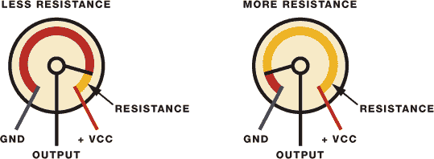
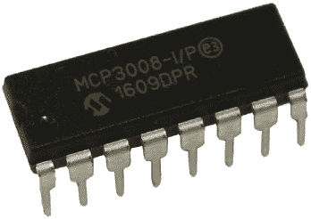
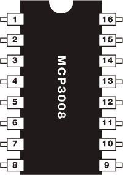
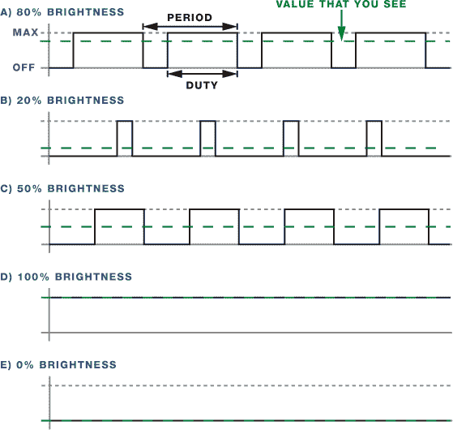
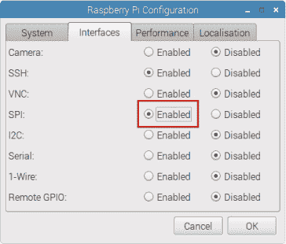

## 第四章：LED 调光开关**

在这个项目中，你将通过使用电位器控制 LED 的亮度来构建一个光线调光器。这个项目的关键在于你能用树莓派读取模拟输入并输出脉宽调制信号。这些技能将对未来的项目和树莓派学习极为有用。



**所需组件**

树莓派

面包板

10 kΩ 电位器

MCP 3008 芯片

5 毫米 LED

330 Ω 电阻

跳线

### 介绍电位器

电位器就像电源旋钮，广泛应用于日常生活中，例如控制收音机音量、调节显示器亮度、设置风扇速度等等。你在这个项目中使用的电位器如图 3-1 所示。



**图 3-1：** 10 kΩ 电位器

电位器，也称为*电位器*，是一种手动可调的可变电阻器。这意味着你可以通过旋转旋钮来改变它对电路施加的电阻大小，从而改变流向特定组件的电流量。

电位器有三个引脚，如图 3-2 所示。两个外部引脚，分别用蓝色和红色表示，连接到一个电阻元件，而第三个引脚，用黑色表示，连接到一个可调的导电*刮刀*。



**图 3-2：** 电位器的工作原理

刮刀的位置决定了电路中的电阻值。在这个项目中，你将通过控制电路中的电阻，使 LED 灯变得更亮或更暗。

### 使用树莓派读取模拟信号

树莓派的 GPIO 只能读取数字信号，这意味着它们只能读取高电平（3.3V）或低电平（0V），中间的值不能读取。然而，电位器是模拟输入，旋转旋钮会将其输出电压从 0V 变化到 3.3V。你希望树莓派能够读取所有中间的值——比如 1V、1.4V、1.8V 等——这样你就能实现渐变的亮度，而不仅仅是开和关。为此，你需要通过模拟到数字转换器芯片将模拟信号转换为数字信号，然后使用脉宽调制生成模拟信号。我们将在开始构建之前讲解这两个主题。

#### 模拟到数字转换器

模拟到数字转换器（ADC）芯片（MCP3008），如图 3-3 所示，将电位器的模拟信号转换为数字信号。



**图 3-3：** MCP3008 芯片模拟到数字转换器

这个芯片有 16 个引脚，其中 8 个是模拟输入，可以连接到模拟设备。另 8 个引脚连接到树莓派的 GPIO。芯片的引脚图如图 3-4 所示。为了识别每个引脚，请将芯片上方的半圆形朝上，如图所示。



**图 3-4：** MCP3008 芯片

下表列出了每个引脚的功能。

| **引脚** | **符号** | **描述** |
| --- | --- | --- |
| 1 | CH0 | 模拟输入（通道 0） |
| 2 | CH1 | 模拟输入（通道 1） |
| 3 | CH2 | 模拟输入（通道 2） |
| 4 | CH3 | 模拟输入（通道 3） |
| 5 | CH4 | 模拟输入（通道 4） |
| 6 | CH5 | 模拟输入（通道 5） |
| 7 | CH6 | 模拟输入（通道 6） |
| 8 | CH7 | 模拟输入（通道 7） |
| 9 | DGND | 数字地 |
| 10 | CS/SHDN | 芯片选择/关机输入 |
| 11 | D[IN] | 串行数据输入 |
| 12 | D[OUT] | 串行数据输出 |
| 13 | CLK | 串行时钟 |
| 14 | AGND | 模拟地 |
| 15 | V[REF] | 参考电压输入 |
| 16 | V[DD] | +2.7 V 至 5.5 V 电源 |

#### 脉宽调制（PWM）

如前所述，树莓派的 GPIO 引脚可以设置为 HIGH 或 LOW，但不能输出介于两者之间的电压。然而，你可以通过*脉宽调制（PWM）*输出“伪”中间电压，这就是你在这个项目中调节 LED 亮度的方式。

如果你将 LED 的电压在 HIGH 和 LOW 之间快速切换，你的眼睛无法跟上 LED 开关的速度；你会看到亮度的渐变效果。这基本上就是 PWM 的工作原理——通过输出在 HIGH 和 LOW 之间快速变化的信号，达到非常高的*频率*。*占空比*是指 LED 在一个周期内设置为 HIGH 的时间比例。图 3-5 展示了 PWM 是如何工作的。



**图 3-5：** PWM 工作原理

50% 的占空比意味着 LED 亮度为 50%，占空比为 0 时 LED 完全关闭，占空比为 100 时 LED 完全亮起。通过改变占空比，你可以调节 LED 的亮度。

### 电路接线

对于这个电路，你需要将 LED、MCP3008 芯片和一个可变电阻连接到树莓派。按照这些步骤构建电路，参考图 3-6。

1.  将 GND 连接到蓝色面包板导轨。

1.  将 3.3 V 连接到红色面包板导轨。

1.  将 LED 插入面包板，将较长的 LED 引脚通过一个 330 Ω 电阻连接到 GPIO 17，较短的引脚连接到 GND 导轨。

1.  将 MCP3008 芯片放置在面包板的中间，并按下表所示连接。

    | **MCP3008** | **树莓派** |
    | --- | --- |
    | 1 | 可变电阻中间引脚 |
    | 9 | GND |
    | 10 | GPIO 8 |
    | 11 | GPIO 10 |
    | 12 | GPIO 9 |
    | 13 | GPIO 11 |
    | 14 | GND |
    | 15 | 3.3 V |
    | 16 | 3.3 V |

    **注意**

    *在给电路通电之前，请确保按照图 3-4 中的引脚分配正确连接 MCP3008 芯片，否则可能会损坏芯片。*

1.  将可变电阻的一个外侧引脚连接到 GND，另一个连接到 3.3 V——哪个引脚连接哪个电源都无所谓。如果尚未连接，将中间引脚连接到 MCP3008 芯片的引脚 1。


**图 3-6：** 用电位器控制 LED 亮度的电路

### 编写脚本

树莓派通过 SPI 通信从 MCP3008 芯片读取模拟值，因此你需要先启用 SPI。

在任务栏主菜单中，选择**首选项** ▸ **Raspberry Pi 配置**。在“接口”标签页中，启用 SPI，如图 3-7 所示，然后点击**确定**。



**图 3-7：** 启用 SPI 通信

你的脚本需要能够完成以下任务：

+   通过 MCP3008 芯片从电位器读取模拟输入值。

+   使用 PWM 控制 LED 的亮度。

+   根据从电位器读取的输入值改变 PWM 的占空比。

#### 输入脚本

打开**Python 3 (IDLE)**，然后选择**文件** ▸ **新建文件**来创建一个新的脚本。将以下代码复制到 Python 编辑器，并将脚本保存为*brightness_controller.py*，保存在*LEDs*文件夹内（记得你可以在*[`www.nostarch.com/RaspberryPiProject/`](https://www.nostarch.com/RaspberryPiProject/)*下载所有脚本）：

```
  #import necessary libraries
  from gpiozero import PWMLED, MCP3008
  from time import sleep

  #create an object called pot that refers to MCP3008 channel 0
➊ pot = MCP3008(0)

  #create a PWMLED object called led that refers to GPIO 17
➋ led = PWMLED(17)

➌ while True:
      #pot.value accesses the current pot reading
    ➍ if(pot.value < 0.001):
          #if the pot value is very small, the led is turned off
        ➎ led.value = 0
    ➏ else:
          #change led brightness according to the pot value
          led.value = pot.value
      #print the pot value
      print(pot.value)
      #pause for 0.1 seconds
      sleep(0.1)
```

和往常一样，你首先导入所需的库。然后你创建一个名为`pot` ➊ 的对象，表示 MCP3008 的通道 0，该通道是电位器连接的通道。通道 0 对应 MCP3008 的第 1 引脚，通道 1 对应第 2 引脚，以此类推。

##### 设置 PWM 引脚并读取模拟值

gpiozero 库通过使用`PWMLED`对象使你能够控制 LED 的亮度。因此，在 ➋ 你创建了一个名为`led`的`PWMLED`对象，指向 LED 连接的引脚，在此例中为 GPIO17。

使用 gpiozero 库读取模拟值时，你只需通过`pot.value`获取电位器的值。记住，`pot`代表的是 MCP3008 的通道 0。你将获得介于`0`和`1`之间的小数值。

##### 调整亮度

要使用 PWM 调整 LED 亮度，你需要更改其占空比。要调整占空比，你只需将一个`0`到`1`之间的值赋给`led.value`，其中`0`表示完全关闭的 LED，`1`表示完全亮起的 LED。

在这个脚本中，一个始终为`True`的`while`循环 ➌ 保持程序运行。这个循环不断检查电位器的值：如果从电位器读取的值低于`0.001` ➍，占空比设置为`0`，使 LED 关闭 ➎。否则，代码进入`else`块 ➏，在其中占空比根据从电位器读取的值进行变化。

#### 运行脚本

按**F5**或选择**运行** ▸ **运行模块**来运行脚本。现在你应该能够旋转电位器以控制 LED 的亮度。

### 进一步探索

学会如何读取模拟值并使用 PWM 控制输出引脚，将为你开启广泛的项目可能性。作为起步，你可以尝试以下一些项目：

+   使用同一个电位器控制多个 LED。

+   构建一个可以通过电位器控制的 LED 条形图。

+   使用可调电阻控制 LED 的闪烁速度。
