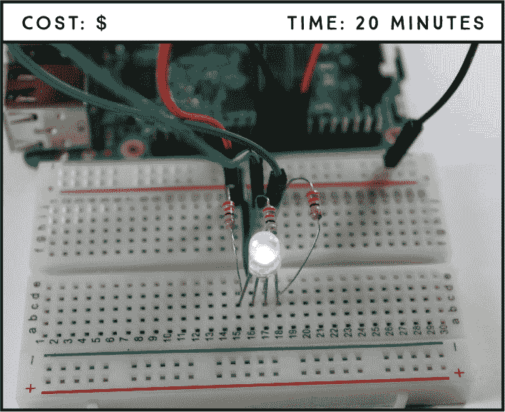
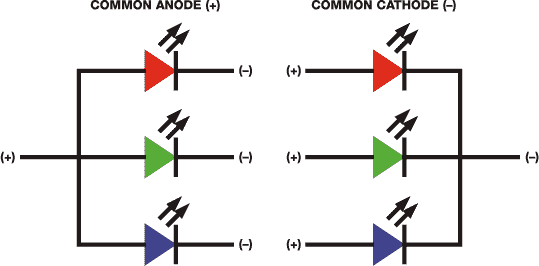
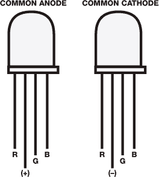
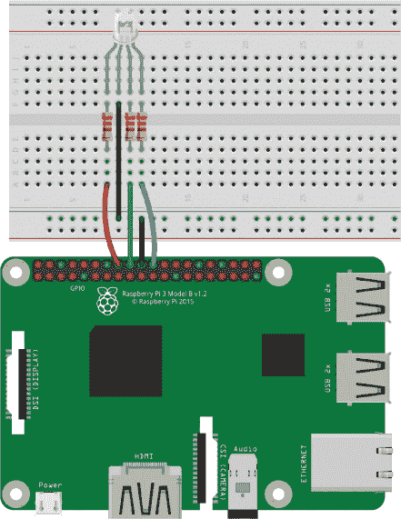
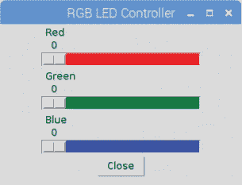

## 第五章：多色 LED 的图形用户界面**

在这个项目中，我们将向你介绍多色 RGB LED，并教你如何在 Tkinter 中构建一个简单的图形用户界面来控制你的电子设备。



**所需零件**

树莓派

面包板

共阴 RGB LED

三个 330Ω电阻

跳线

### 介绍 RGB LED

RGB LED 是一个集成了三种 LED（红色、绿色和蓝色）的设备，通过将这三种颜色混合，可以产生几乎任何颜色。

使用 RGB LED，你当然可以产生红色、绿色和蓝色光，并通过调整每个 LED 的强度，你还可以产生其他颜色。例如，要产生纯蓝光，你可以将蓝色 LED 的强度调到最大，将绿色和红色 LED 的强度调到最低。要产生白光，你需要将所有三个 LED 的强度调到最大。图 4-1 展示了一个简化的 RGB 颜色混合图表，帮助你理解如何通过混合红色、绿色和蓝色来产生不同的颜色。


**图 4-1：** 简单的 RGB 颜色混合

有两种类型的 RGB LED：*共阴*LED，其中每个颜色的 LED 共享一个负连接；以及*共阳*LED，其中每个 LED 共享一个正连接。图 4-2 展示了共阳和共阴 LED。



**图 4-2：** 共阳和共阴 RGB LED

RGB LED 有四个引脚——每个 LED 一个，还有一个共阳或共阴引脚。你可以通过引脚的长度来识别每个引脚，如图 4-3 所示。



**图 4-3：** 共阳和共阴 RGB LED 引脚

当 LED 面对你时，阳极或阴极（最长的引脚）位于左边第二个位置，引脚的顺序应该是：红色、阳极或阴极、绿色、蓝色。我们将在本项目中使用共阴 LED，但如果你已有一个共阳 LED，也可以使用；只需要注意电路接线中的差异。

### 接线电路

将 RGB LED 连接到树莓派非常简单，与连接普通 LED 差别不大。你需要三个限流电阻——每个 LED 颜色一个。

请按照这些指示操作，使用图 4-4 作为参考。

1.  将 LED 引脚连接到面包板，并为每个颜色引脚串联一个 330Ω限流电阻。

1.  将 GND 连接到面包板的蓝色轨道，并按照下表将 RGB LED 连接到树莓派的 GPIO，红色连接到 GPIO 23，阴极连接到 GND，绿色连接到 GPIO 24，蓝色连接到 GPIO 25。查看图 4-3 以确保你正确地定向了 LED。

**注意**

如果你使用的是共阳 RGB LED，将最长的引脚（阳极）连接到 3.3V。

| **RGB LED** | **树莓派** |
| --- | --- |
| 第一引脚：红色 | GPIO 23 |
| 第二引脚：阴极 | GND |
| 第三根引脚：绿色 | GPIO 24 |
| 第四根引脚：蓝色 | GPIO 25 |



**图 4-4:** 将共阴极 RGB LED 接到树莓派

### 编写脚本

在你的脚本中，你将使用一个名为 Tkinter 的库来创建一个用户界面窗口，借此你可以控制 RGB LED。Tkinter 已经随着 Raspbian 系统预装好了，因此你只需要在脚本中导入它。

界面窗口将有三个滑块（值范围为`0`到`1`）来控制内建红色、绿色和蓝色 LED 的亮度，还有一个关闭按钮用于关闭程序。通过调整滑块的值，你可以改变 RGB LED 的颜色。

现在，打开**Python 3 (IDLE)**，然后进入**文件** ▸ **新建文件**，创建一个新的脚本。接着，在 Python 编辑器中输入以下代码，并将脚本保存为*rgb_led_controller.py*，保存在*LEDs*文件夹中（记得你可以在*[`www.nostarch.com/RaspberryPiProject/`](https://www.nostarch.com/RaspberryPiProject/)*下载所有脚本）：

```
  #import necessary libraries
➊ from gpiozero import PWMLED
  from tkinter import *

  #change the RGB LED color
➎ def change_color(self):
      red.value = red_slider.get()
      green.value = green_slider.get()
      blue.value = blue_slider.get()
      print(self)

  #close the window
➌ def close_window():
      window.destroy()

  #create a PWMLED object for each color
➍ red = PWMLED(23)
  green = PWMLED(24)
  blue = PWMLED(25)

  #create window
➎ window = Tk()
  window.title('RGB LED Controller')
  window.geometry('300x200')

  #create three sliders to control each RGB LED lead
➏ red_slider = Scale(window, from_=0, to=1, resolution = 0.01,
  orient=HORIZONTAL, label='Red', troughcolor='red', length=200,
  command=change_color)
  red_slider.pack()

  green_slider = Scale(window, from_=0, to=1, resolution = 0.01,
  orient=HORIZONTAL, label='Green', troughcolor='green', length=200,
  command=change_color)
  green_slider.pack()

  blue_slider = Scale(window, from_=0, to=1, resolution = 0.01,
  orient=HORIZONTAL, label='Blue', troughcolor='blue', length=200,
  command=change_color)
  blue_slider.pack()

  #create close button
➐ close_button = Button(window, text='Close', command=close_window)
  close_button.pack()

➑ mainloop()
```

**用户自定义函数**

要定义一个新的函数，你需要使用`def`关键字，后跟你希望赋予函数的名称和一对圆括号。

在括号后，你需要添加一个冒号（`:`），然后告诉函数执行什么指令。Python 通过使用冒号和缩进来识别哪些指令是函数定义的一部分：冒号后的每一行缩进的代码都属于函数的一部分。之后，你可以通过输入函数名来运行你在函数内设置的指令，这也叫做*调用*函数。

首先，你从 gpiozero 库中导入`PWMLED`来用 PWM 控制 LED，并导入 tkinter 库来构建用户界面 ➊。接着，你创建函数来控制 LED 颜色。记住，函数基本上是一个可重复使用的代码块，它会执行某个特定的操作。Python 有许多内置函数，如`print()`、`int()`和`input()`，但你也可以自己编写*用户自定义函数*，正如本脚本中所示。阅读“用户自定义函数”框来了解更多。

#### 控制强度与关闭窗口

`change_color()`函数➋会随着你调整滑块的值而改变 LED 的占空比，从而改变 LED 的亮度，进而改变它产生的颜色。每次滑块移动时，都会调用此函数，因此你应该能在滑块移动时看到 LED 的即时变化。在 ➍ 处，你创建了`PWMLED`对象来表示 RGB LED 的每种颜色。

`close_window()`函数➌使用`window.destroy()`关闭窗口。这个函数会在你按下 Tkinter 界面中的关闭按钮时被调用。接下来我们将看看如何创建 Tkinter 界面。

#### 使用 Tkinter 设计用户界面

在➎处，你定义了界面的主窗口。你创建了一个名为`window`的变量，它是一个`tkinter`窗口，通过`window = Tk()`这行代码来创建。接着，你通过`title()`和`geometry()`方法分别为窗口设置标题和窗口尺寸。

##### 创建滑块和按钮

创建完窗口后，你可以开始添加控件，也就是*小部件*，比如按钮、标签和滑块。你使用了一个`Button`小部件来关闭窗口，并使用了三个`Scale`小部件来向窗口添加滑块。

然后，你创建了三个滑块，每个对应一个 RGB 颜色➏，使用以下语法：

```
*slider_name* = Scale(*master*, *option*, *option*, ...)
```

master 参数是你将小部件添加到的窗口，而每个选项参数允许你个性化你的滑块。在*rgb_led_controller.py*脚本中，你使用了以下选项：

+   `from_`定义了滑块范围的下限。

+   `to`定义了滑块范围的上限。在我们的案例中，范围是 0 到 1。

+   `resolution`设置滑块的分辨率——两个连续值之间的最小差值。这里的分辨率是`0.01`。

+   `orient`定义了滑块的方向，可能是`HORIZONTAL`（水平）或`VERTICAL`（垂直）。这个脚本将滑块设置为`HORIZONTAL`。

+   `label`设置滑块的标签。在这个脚本中，你根据每个滑块控制的 LED 颜色为每个滑块命名标签。

+   `troughcolor`设置滑块的背景颜色。每个滑块的背景颜色与它控制的 LED 颜色相同。

+   `length`定义了滑块的长度，单位是像素。所有滑块的长度都设置为`200`。

+   `command`决定了每次滑块移动时调用的程序。在这种情况下，移动滑块会调用`change_color()`函数，该函数改变 LED 的占空比，从而改变其显示的颜色。

创建完滑块后，你使用`pack()`方法将小部件放置在主`window`中。因为没有给`pack()`方法传递任何参数，小部件会根据默认设置被放置：小部件仅填充其最小尺寸，并且会被排列在窗口顶部或上方的小部件旁边。

接下来，你使用以下语法创建了关闭按钮➐：

```
*Button_name* = Button(*master*, *option*, *option*, ...)
```

在你的代码中，你使用了以下选项：

+   `text`定义了按钮上显示的文本。

+   `command`决定了当按钮被按下时调用的程序——在这里是`close_window()`函数，用于关闭窗口。

##### 使用主循环

脚本的最终语句调用了`mainloop()`函数➑，这是一个无限循环，允许窗口被绘制并处理事件。`mainloop()`函数是保持程序运行的关键。

#### 运行脚本

按下**F5**或选择**Run** ▸ **Run Module**来运行脚本。你的界面窗口应该会弹出，如图 4-5 所示。



**图 4-5：** RGB LED 控制器用户界面

恭喜！你已经制作了自己的组件用户界面！现在试着移动滑块来改变 LED 的颜色。当你改变每个滑块的位置时，RGB LED 的颜色应该会相应变化。

要关闭程序，只需点击关闭按钮。

### 更进一步

现在你知道如何制作图形用户界面，我们鼓励你编辑其参数，以定制界面的外观，符合你的个人喜好。这里有一些你可以尝试的其他项目想法：

+   构建一个图形用户界面，用来控制 LED 的开关。

+   制作一个图形用户界面，用来控制 LED 的亮度。

+   修改用户界面，以控制多个 LED。
