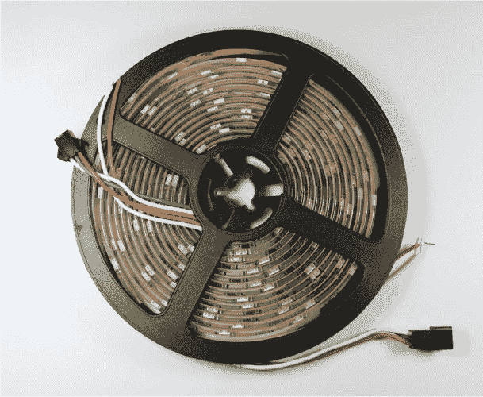
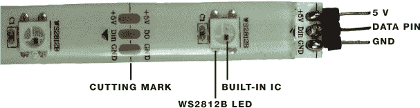
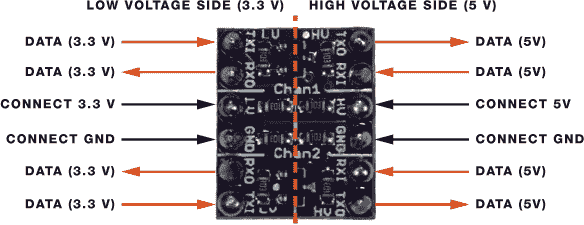
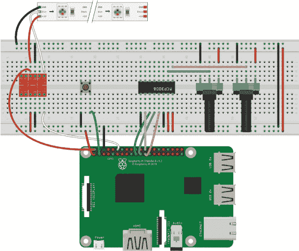
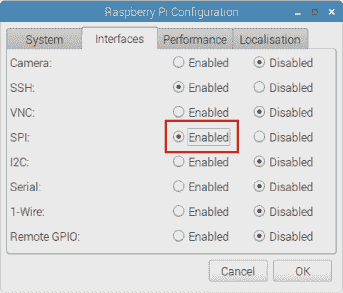

## 第六章：彩虹灯带**

在这个项目中，你将使用可寻址 RGB LED 灯带创建彩虹灯效。你将使用一个按键来启动和停止彩虹效果，并通过两个电位器来控制彩虹的速度和亮度。


**所需零件**

Raspberry Pi

面包板

WS2812B 可寻址 RGB LED 灯带

逻辑电平转换器模块 BSS 138

两个 10 kΩ 电位器

MCP 3008 芯片

按键

三个头针

跳线

**所需软件**

WS2 81X 库

### 介绍 WS2812B 可寻址 RGB LED 灯带

对于彩虹灯效，你将使用 WS2812B RGB LED 灯带，这种灯带有多种不同的尺寸可供选择。灯带以卷轴形式出现，如 图 5-1 所示，你可以根据需要剪下所需长度的部分。



**图 5-1：** 卷轴上的 WS2812B 可寻址 RGB LED 灯带

如 图 5-1 所示，灯带长 5 米，包含 300 个串联的可寻址 WS2812B RGB LED，稍后你将剪下一段 14 个 LED 的部分用于本项目。灯带的整个长度上都有切割标记，如 图 5-2 所示。



**图 5-2：** WS2812B 可寻址 RGB LED 灯带引脚

每个 LED 的颜色和亮度可以单独控制，从而轻松实现惊人的效果。每个 LED 都内置了集成电路（IC），这意味着你只需通过一个 GPIO 引脚，连接到灯带末端的中间引脚——数据引脚，就能控制整个灯带（参见 图 5-2）。

按照以下步骤为这个项目准备 LED 灯带：

1.  按照灯带上的切割标记剪下一段包含 14 个 LED 的灯带。

1.  如 图 5-2 所示，将头针焊接到 5V、数据和 GND 引脚。

**注意**

*我们发现，Raspberry Pi 的 5V 引脚（例如引脚 2 或引脚 4）能够为 20 个 LED 或更少的灯带供电，但在使用较长灯带的项目中，你需要使用外部 5V 电源来提供足够的电流。*

现在你需要确定你的电源。LED 灯带需要一个 5V 电源。你可以通过每个 LED 所需的功率来确定所需的电流。每个 LED 在全亮时会消耗最多 60 毫安（这时产生白光），但由于你很少需要所有 LED 长时间以最大亮度运行，你可以安全地估算每个 LED 需要 20 毫安。因此，如果你的灯带有 14 个 LED，你将需要一个大约为 20 × 14 = 280 毫安的 5V 电源。

控制灯带的数据引脚需要一个 5V 信号，但 Raspberry Pi 的 GPIO 引脚工作在 3.3V。为了获得所需的 5V，你将使用一个名为逻辑电平转换器的组件。

### 介绍逻辑电平转换器

*逻辑电平转换器* 允许你将 3.3 V 信号转换为 5 V 信号。虽然有许多种逻辑电平转换器，但在本项目中，你将使用如图 5-3 所示的双通道逻辑电平转换器双向模块。（要找到我们使用的相同逻辑电平转换器模块，可以在网上搜索 *logic level converter module bss138*。）

该模块的双向特性使你可以双向转换数据——从 3.3 V 到 5 V，以及从 5 V 到 3.3 V。尽管在本项目中你不需要将 5 V 转换为 3.3 V，但在你的工具包中拥有这种更灵活的模块（相对于单向模块）对未来的项目可能会有所帮助。这个逻辑电平转换器还有两个通道，通道 1 和通道 2。在本项目中，你只会使用其中一个通道来控制 LED 条的数据引脚。



**图 5-3：** 双通道逻辑电平转换器双向模块

很可能你的模块会单独提供插针，因此你需要将插针焊接到模块上以便适合面包板使用。断开两排六个插针，然后将每个插针焊接到一个小孔上。

该模块有一个低电压端（图 5-3 的左侧），你需要将 3.3 V 的部分连接到此端，另一个高电压端（右侧），你需要将 5 V 的部分连接到此端。对于本项目，你需要使用红色标记的其中一个引脚，因为你需要发送 3.3 V 数据并将其转换为 5 V。

要使用逻辑电平转换器，首先将两侧的 GND 连接，低电压端连接 3.3 V，高电压端连接 5 V。然后，从 Pi 的一个 TX1 引脚连接数据——你可以使用通道 1 或通道 2——并在相应的 TX0 引脚上获取 5 V 数据。

### 接线电路

此时，你应该已经将 LED 条剪裁为合适的长度（14 个 LED），并将插针焊接到 LED 条的一端和逻辑电平转换器上。现在你可以开始接线了。你需要将一个按键、两个电位器通过 MCP3008 芯片连接起来，并使用逻辑电平转换器模块连接可寻址 RGB LED 条，如图 5-4 所示。



**图 5-4：** 控制 RGB LED 条的电路

**警告**

*请记住，不能将 5 V 直接连接到 Pi 的 GPIO 引脚，否则会永久损坏你的板子。*

**注意**

*要识别 MCP3008 的引脚，将芯片朝向自己，顶部有一个半圆形切口。第一个引脚在左上角，最后一个引脚在右上角。有关 MCP3008 引脚的完整描述，请参见 “模拟到数字转换器” 中的 第 55 页。*

1.  将 GND 和 3.3 V 引脚连接到面包板的电源轨。

1.  将 MCP3008 芯片插入面包板的中间位置，确保两侧跨越中间分隔。

1.  将两个电位器插入面包板，将其中一个电位器的外侧引脚连接到 GND，另一个的外侧引脚连接到 3.3 V。

1.  按照下表连接 MCP3008 芯片。连接哪个电位器到哪个引脚并不重要，它们的工作方式是一样的。

    | **MCP3008** | **连接到** |
    | --- | --- |
    | 1 | 一个电位器的中间引脚 |
    | 2 | 另一个电位器的中间引脚 |
    | 9 | GND |
    | 10 | GPIO 8 |
    | 11 | GPIO 10 |
    | 12 | GPIO 9 |
    | 13 | GPIO 11 |
    | 14 | GND |
    | 15 | 3.3 V |
    | 16 | 3.3 V |

1.  将按钮插入面包板，跨越中心分隔线。将一侧的引脚连接到 GND，另一侧的引脚连接到 GPIO 2。

1.  将 RGB LED 灯带的引脚插入面包板中。

1.  将逻辑电平转换器插入面包板中。按照指示连接低电压侧。

    | **逻辑电平转换器** | **树莓派** |
    | --- | --- |
    | TX1 (通道 2) | GPIO 18 |
    | LV | 3.3 V |
    | GND | GND |

1.  按照指示连接高电压侧。

    | **逻辑电平转换器** | **连接到** |
    | --- | --- |
    | TX0 (通道 2) | RGB LED 灯带的数据引脚（中间引脚） |
    | HV | 5 V |
    | GND | GND |

1.  连接好逻辑电平转换器后，按照指示连接 RGB LED 灯带。

    | **RGB LED 灯带** | **连接到** |
    | --- | --- |
    | 5 V | 5 V |
    | Din | 逻辑电平转换器 TX0 引脚 |
    | GND | GND |

**注意**

*如果你选择使用超过 20 个 LED 的灯带做这个项目，你需要将 5 V 电源连接到灯带的 5 V 引脚，并将 GND 电源连接到 GND 排。*

### 编写脚本

此脚本依赖于 WS281X 库来控制单独的 LED，因此你需要安装该库，并启用串行外设接口（SPI）通信，以便条形灯带能够与树莓派进行通信。

#### 安装 WS281X 库

安装 WS281X 库有几个步骤，因为它要求你先设置它所依赖的库。

1.  打开一个终端窗口并安装 scons、python3-dev 和 swig 库：

    ```
    pi@raspberrypi:~ $ sudo apt install scons python3-dev swig
    ```

1.  仍然在终端中，导航到桌面，创建一个名为 *Libraries* 的文件夹，然后进入新创建的文件夹：

    ```
    pi@raspberrypi:~ $ cd ~/Desktop
    pi@raspberrypi:~/Desktop $ mkdir Libraries
    pi@raspberrypi:~/Desktop $ cd Libraries
    pi@raspberrypi:~/Desktop/Libraries $
    ```

1.  克隆该库以进行下载。

    ```
    pi@raspberrypi:~/Desktop/Libraries $ git clone https://
    github.com/jgarff/rpi_ws281x.git
    ```

1.  进入 *rpi_ws281x* 库文件夹并运行 `scons` 命令：

    ```
    pi@raspberrypi:~/Desktop/Libraries $ cd rpi_ws281x
    pi@raspberrypi:~/Desktop/Libraries/rpi_ws281x $ sudo scons
    ```

1.  导航到 *python* 文件夹并在你的树莓派上安装 WS281X 库：

    ```
    pi@raspberrypi:~/Desktop/Libraries/rpi_ws281x $ cd python
    pi@raspberrypi:~/Desktop/Libraries/rpi_ws281x/python $ sudo
    python3 setup.py install
    ```

现在你可以在代码中使用 WS281X 库了。

#### 启用 SPI 通信

要与 MCP3008 芯片进行通信，你需要启用 SPI 通信。进入任务栏主菜单，选择 **首选项** ▸ **树莓派配置**。在“接口”标签页中，点击 SPI 行中的 **启用**，如 图 5-5 所示，然后点击 **确定**。



**图 5-5：** 启用 SPI 通信

#### 进入脚本

让我们回顾一下电路如何工作，以帮助你在输入脚本之前更好地理解它：

+   你的 RGB LED 灯带显示一个移动的彩虹。

+   一个电位器控制彩虹的速度。

+   另一个电位器控制彩虹的亮度。

+   按钮用于启动和停止彩虹动画。

**排除疯狂像素问题**

在撰写本文时，Raspbian 的较新版本存在一个关于条形像素的问题。控制条形灯带的引脚与模拟音频输出共享，因此像素可能会出现混乱并无法正常工作。如果在加载代码时发生这种情况，你需要在*config.txt*文件中添加两行代码。进入终端并输入以下内容：

```
pi@raspberrypi:~ $ sudo nano /boot/config.txt
```

在打开的文件中，添加以下两行（可以放在任何位置）：

```
hdmi_force_hotplug = 1
hdmi_force_edid_audio = 1
```

按 CTRL-X 保存文件，然后当提示时，输入**Y**并按 ENTER 键。重启你的 Pi 以使更改生效，然后继续进行库的安装。

打开**Python 3（IDLE）**，点击**文件** ▸ **新建文件**来创建一个新脚本。将 Listing 5-1 中的代码复制到 Python 编辑器中，并将脚本保存为*rainbow_effect.py*，存放在*LEDs*文件夹内（记得你可以下载所有脚本，网址是*[`www.nostarch.com/RaspberryPiProject/`](https://www.nostarch.com/RaspberryPiProject/)*）：

**LISTING 5-1:** 彩虹条*rainbow_effect.py*代码

```
  #based on Tony DiCola's NeoPixel library strandtest example

  #import necessary libraries
➊ from neopixel import *
  from time import sleep
  from gpiozero import Button, MCP3008

  #LED strip configuration
➋ LED_COUNT = 14 #number of LED pixels
  LED_PIN = 18 #GPIO pin connected to the pixels (must support PWM!)
  LED_FREQ_HZ = 800000 #LED signal frequency in Hz (usually 800 kHz)
  LED_DMA = 5 #DMA channel to use for generating signal (try 5)
  LED_INVERT = False #set True to invert the signal

  #create pot objects to refer to MCP3008 channel 0 and 1
➌ pot_brightness = MCP3008(0)
  pot_speed = MCP3008(1)

  #connect pushbutton to GPIO 2, pull-up
  button_start = Button(2)

  #animation running control variable
  running_animation = False

  #generate rainbow colors across 0-255 positions
➍ def wheel(pos):
      if pos < 85:
          return Color(pos * 3, 255 - pos * 3, 0)
      elif pos < 170:
          pos -= 85
          return Color(255 - pos * 3, 0, pos * 3)
      else:
          pos -= 170
          return Color(0, pos * 3, 255 - pos * 3)

  #draw rainbow that uniformly distributes itself across all pixels
➎ def rainbowCycle(strip):
      for j in range(256):
          for i in range(strip.numPixels()):
              strip.setPixelColor(i, wheel((int(i * 256 /
  strip.numPixels()) + j) & 255))
          strip.show()
➏         sleep((pot_speed.value*40)/1000.0)

  #function to start and stop the animation
➐ def start_animation():
      global running_animation
      if running_animation == True:
          running_animation = False
      else:
          running_animation = True

  #assign a function that runs when the button is pressed
➑ button_start.when_pressed = start_animation

  #create NeoPixel object with appropriate configuration
➒ strip = Adafruit_NeoPixel(LED_COUNT, LED_PIN, LED_FREQ_HZ, LED_DMA,
  LED_INVERT, int(pot_brightness.value*255))

  #initialize the strip
  strip.begin()
➓ while True:
      if running_animation == True:
          #set LED strip brightness
          strip.setBrightness(int(pot_brightness.value*255))
          rainbowCycle(strip)
```

首先，你导入控制项目所需的库 ➊。你需要 neopixel 库来控制 LED 灯带，time 库来导入`sleep()`函数以控制延迟时间，并从 gpiozero 库中导入`Button()`和`MCP3008()`接口，分别用于读取按钮和电位器的值。

##### 设置灯带参数

在 ➋ 处，你为配置 RGB LED 灯带创建了变量，包括 LED 数量和所用的 GPIO 引脚。然后，在 ➌ 处，你创建了两个电位器的对象，一个用于控制 MCP3008 通道 0（引脚 1）的亮度，另一个用于控制 MCP3008 通道 1（引脚 2）的速度，并创建了一个 GPIO 2 上的按钮对象。你还创建了一个名为`running_animation`的变量，用于启动和停止动画，它是布尔类型，默认值为`False`（关闭）。

##### 创建彩虹效果函数

在 ➍ 和 ➎ 处，你创建了产生移动彩虹效果的函数。这些函数与 neopixel 库附带的*strandtest.py*示例中使用的函数相同。简单来说，`wheel()`函数通过在 0 到 255 之间变化每个颜色参数来生成色谱。每个颜色由红色、绿色和蓝色（RGB）参数组成，变化每个参数在 0 到 255 之间产生不同的颜色，从而产生彩虹效果。`rainbowCycle()`函数将彩虹分布到你条形灯带上的 LED 数量上。

➏行设置了`sleep()`函数的延时时间。为了计算延时时间，你需要将从其中一个电位器读取的值（该值在 0 和 1 之间）乘以 40，然后将结果除以 1,000。将电位器值乘以 40 会产生一个显著的延时；否则，延时太短，彩虹效果会发生得太快，你甚至无法察觉灯光的移动。除以 1,000 可以得到以毫秒为单位的延时时间。

##### 控制按键

使用 gpiozero 库，你可以将特定的动作分配给按键按下事件，具体如下：

```
button.when_pressed = *function_name*
```

`function_name`函数指的是一个通用函数，当按键被按下时会被调用；该函数必须在被调用之前定义。在这种情况下，该函数是`start_animation` ➑，在➐行定义。注意，`function_name`没有括号。这是因为我们只是将一个函数赋值给另一个函数，而不是执行该函数。在我们的案例中，我们告诉代码在`button_start.when_pressed`函数被触发时运行`start_animation`函数。

当按键被按下时，`running_animation`的值会发生变化。当`running_animation`变量为`False`且按键被按下时，它会变为`True`，反之亦然。这使得你可以启动和停止彩虹效果。

##### 使用 while 循环控制动画

在➒行，你创建了一个名为`strip`的`Adafruit_Neopixel`对象，接受你在➋行之前定义的条带参数。为了控制条带 LED 的亮度，你使用`int(pot_brightness.value*255)`。亮度根据从其中一个电位器读取的值（在 0 和 1 之间）进行变化。你将该值乘以 255，因为条带 LED 的亮度范围是 0 到 255。使用`int()`函数将数值四舍五入为整数。这样，你就可以通过旋转电位器来调整 LED 的亮度。

然后，你使用`strip.begin()`，在对`Adafruit_Neopixel`对象进行其他调用之前，你需要先调用它。

`while`循环 ➓ 会使程序持续运行。然后，你在启动动画之前设置了条带的亮度。如果`running_animation`变量为`True`，`rainbowCycle()`函数将运行，启动动画。如果按下按键，`running_animation`变量会变为`False`，动画停止。

#### 运行脚本

要运行此脚本，你需要使用终端窗口。从 Python 3 IDLE 编辑器运行会导致权限错误。

将脚本保存为*rainbow_effect.py*，放在*Projects*目录下的*LEDs*文件夹中，然后打开终端。接着，导航到*LEDs*文件夹并运行脚本：

```
pi@raspberrypi:~ $ cd ~/Desktop/Projects/LEDs
pi@raspberrypi:~/Desktop/Projects/LEDs $ sudo python3
rainbow_effect.py
```

现在，你可以通过旋转各自的电位器来控制速度和亮度，并通过按下按键来启动或停止动画。

恭喜！你为你的家增添了一个很棒的装饰！

### 进一步探索

以下是一些简单的想法，如果你想增加对灯带的控制力度，可以尝试：

+   点亮条形灯带中间的特定 LED。

+   让所有 LED 仅显示一种颜色。

+   添加一个按钮，用于在预设效果之间切换。

+   让 LED 像圣诞灯一样闪烁。

+   发明你自己的效果。
