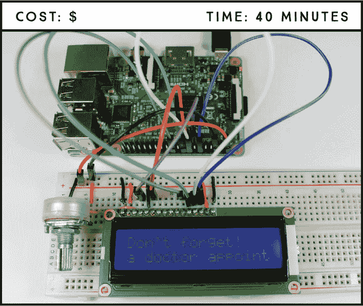
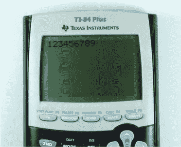
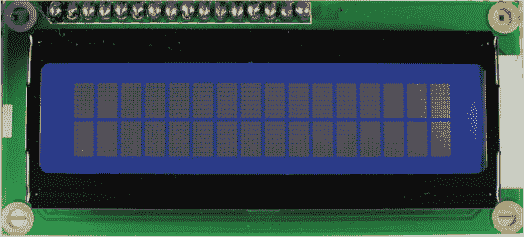
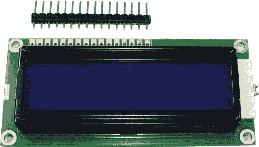
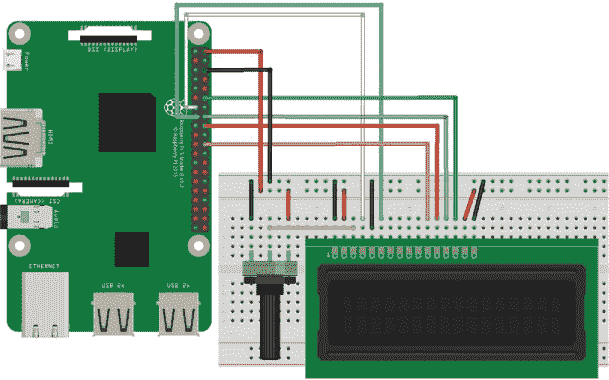
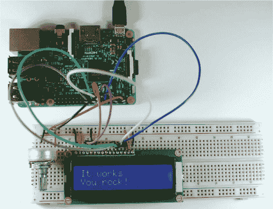

## 第七章：**LCD 提醒**

在这个项目中，你将把字符 LCD 连接到树莓派上，显示一个滚动的提醒信息。你将首先显示静态文本，适用于短信息，然后学习如何显示滚动文本，更适合长信息。



**所需零件**

树莓派

面包板

16×2 Hitachi HD44780 兼容 LCD

10 kΩ 电位计

跳线

**所需软件**

Adafruit_CharLCD 库

### 介绍液晶显示器

市面上最简单且最便宜的显示屏是*液晶显示器（LCD）*。LCD 常见于日常电子设备，如自动售货机、计算器（见图 6-1）、停车计时器和打印机，非常适合显示文本或小图标。



**图 6-1：** 带 LCD 的计算器

LCD 的尺寸是根据屏幕上能显示的字符的行数和列数来测量的。16×2 的 LCD 可以显示 2 行，每行 16 个字符。你会看到尺寸范围从 8×1 到 40×4。

LCD 的背景颜色也有所不同。你可以找到各种背景颜色，包括 RGB 背光灯，允许你创建任意颜色。

最常见的 LCD 模块使用 Hitachi HD44780 芯片，允许你使用自定义字符。图 6-2 显示了一个标准的 16×2 Hitachi HD44780 兼容 LCD；我们推荐在这个项目中使用这种类型。大多数 16×2 屏幕是兼容的，但在购买之前，请查阅零件的资料表以确保兼容。你也可以使用 20×4 的 LCD，只要它们是 Hitachi HD44780 兼容的。



**图 6-2：** 标准 16×2 Hitachi HD44780 兼容 LCD

如果你仔细观察图 6-2，你会看到 32 个矩形，每个矩形由 5×8 像素组成。开关像素的组合构成了字符的形状。

#### 焊接头引脚

很可能你的 LCD 模块会配有分离的头引脚，如图 6-3 所示。你需要将引脚焊接到模块上，使其适合面包板。将引脚插入可用的孔中——应该有 16 个引脚对应 16 个孔——并确保长端朝下，然后将其焊接固定。



**图 6-3：** 带有分离头引脚的 LCD

#### LCD 模块引脚图

当引脚位于屏幕上方时，LCD 模块的引脚编号从 1 到 16，从左到右排列：

| **引脚** | **符号** | **描述** |
| --- | --- | --- |
| 1 | VSS | 地面 |
| 2 | VDD | 电源 |
| 3 | V0 | 对比度调节 |
| 4 | RS | 寄存器选择 |
| 5 | R/W | 读/写选择 |
| 6 | E | 启用 |
| 7–14 | DB0–DB7 | 数据引脚 |
| 15 | LEDA | 背光阳极（5V） |
| 16 | LEDK | 背光阴极（–） |

**警告**

*树莓派的 GPIO 引脚设计为 3.3 V，但大多数 LCD 显示器为 5 V。只要你只是从树莓派发送数据，而不是从屏幕读取数据，这不会成为问题。使用 5 V 屏幕时，*不要将显示器的 R/W 引脚连接到树莓派。*这个引脚传输 5 V 的数据，很可能会烧坏你的树莓派！*

VSS 是地引脚，应连接到 GND。VDD 是电源引脚，根据你使用的 LCD 类型，应该提供 5 V 或 3.3 V；大多数 LCD 需要 5 V。

V0 允许你在 LCD 连接到电位器时调整字符与背光之间的对比度。

RS、R/W 和 E 是控制引脚。当只使用屏幕显示文本时，像本项目那样，你应该将 R/W 引脚永久连接到地面；换句话说，你只会写入数据到 LCD，而不是从它读取数据。

引脚 7 到 14 是数据引脚，用于传输信息。引脚 15 和 16 是背光的阳极和阴极。

虽然 LCD 模块有 16 个引脚，但你只需要其中 6 个来与树莓派进行通信：4、6、11、12、13 和 14。

### 连接电路

现在 LCD 已经准备好使用，你可以开始搭建项目电路。按照以下步骤连接 LCD 和树莓派，参考图 6-4 中的电路图。

1.  将面包板的电源轨连接到 5 V 和 GND。

1.  为了给 LCD 供电，将电源轨的 5 V 连接到 LCD 引脚 2（VDD）和 LCD 引脚 15（LEDA）。将 LCD 引脚 1（VSS）、引脚 5（R/W）和引脚 16（LEDK）连接到面包板上的 GND 轨。

1.  添加一个电位器来调整对比度：将一个外部引脚连接到 GND，另一个外部引脚连接到 5 V，然后将中间引脚连接到 LCD 引脚 3（V0）。

1.  按照下表连接树莓派的 GPIO 引脚。

| **LCD** | **树莓派** |
| --- | --- |
| 4 (RS) | GPIO 27 |
| 6 (E) | GPIO 22 |
| 11 (DB4) | GPIO 25 |
| 12 (DB5) | GPIO 24 |
| 13 (DB6) | GPIO 23 |
| 14 (DB7) | GPIO 18 |



**图 6-4：** LCD 与树莓派的连接示意图

完成连接后，尝试旋转电位器调整 LCD 对比度；你应该看到背光发生变化。如果对比度没有变化，请在继续之前仔细检查接线。

### 编写脚本

在你可以编写脚本在 LCD 上显示信息之前，需要安装用于字符 LCD 的 Python 库 Adafruit_CharLCD。这个库提供了很多功能，方便你控制 LCD。

#### 安装字符 LCD 的 Python 库

打开树莓派桌面的任务栏，打开终端。在安装 Adafruit_CharLCD 库之前，你需要安装以下依赖项：

```
pi@raspberrypi:~ $ sudo apt update
pi@raspberrypi:~ $ sudo apt install build-essential python3
python-dev python-smbus python3-pip git-core
```

当出现提示时，输入 y 并按下 ENTER 键。

前往桌面，创建一个名为*Libraries*的文件夹，并通过以下命令切换到新创建的文件夹：

```
pi@raspberrypi:~ $ cd ~/Desktop
pi@raspberrypi:~/Desktop $ mkdir Libraries
pi@raspberrypi:~/Desktop $ cd Libraries
pi@raspberrypi:~/Desktop/Libraries $
```

输入以下命令下载安装文件：

```
pi@raspberrypi:~/Desktop/Libraries $ git clone https://github.com/
adafruit/Adafruit_Python_CharLCD.git
```

导航到*Adafruit_Python_CharLCD*目录：

```
pi@raspberrypi:~/Desktop/Libraries $ cd Adafruit_Python_CharLCD
```

最后，执行以下命令安装 Adafruit_CharLCD 库：

```
pi@raspberrypi:~/Desktop/Libraries/Adafruit_Python_CharLCD $ sudo
python3 setup.py install
```

恭喜！您已成功安装了字符 LCD 的 Python 库。我们鼓励您浏览*Examples*文件夹并查看其中的内容。

#### 显示字符消息

转到您的*Projects*文件夹，创建一个名为*Displays*的新文件夹。打开**Python 3 (IDLE)**，然后转到**文件** ▸ **新建文件**来创建一个新的脚本。接着，将以下代码输入到 Python 编辑器中，并将脚本保存为*character_lcd.py*（记得您可以在*[`www.nostarch.com/RaspberryPiProject/`](https://www.nostarch.com/RaspberryPiProject/)*下载所有脚本）：

```
➊ import Adafruit_CharLCD as LCD

  #Raspberry Pi pin configuration
➋ lcd_rs = 27
  lcd_en = 22
  lcd_d4 = 25
  lcd_d5 = 24
  lcd_d6 = 23
  lcd_d7 = 18
  lcd_backlight = 4

  #define the LCD size
➌ lcd_columns = 16
  lcd_rows = 2

  #initialize the LCD
➍ lcd = LCD.Adafruit_CharLCD(lcd_rs, lcd_en, lcd_d4, lcd_d5, lcd_d6, 
  lcd_d7, lcd_columns, lcd_rows, lcd_backlight)

  #write your message
➎ lcd.message('It works\nYou rock!')
```

您首先在➊导入先前安装的字符 LCD 库。然后，在➋配置您的 Pi 引脚。在➌定义您的 LCD 大小。如果您使用的是 20×4 LCD，您需要相应地修改这两行代码。

之后，LCD 被初始化 ➍，并且您将消息写入`lcd.message('`string`')`函数中，消息内容位于单引号之间 ➎。`\n`转义字符告诉 LCD 将随后的文本显示到下一行。您可以随意更改此消息为任何您喜欢的内容！

按**F5**或转到**运行** ▸ **运行模块**来运行脚本，您的 LCD 应显示文本，如图 6-5 所示。



**图 6-5：** 您的电路显示静态消息

#### 添加其他功能

值得了解一些其他有用的函数，您不仅可以用来显示文本，还可以设置光标到特定位置或清除显示以准备显示新消息。例如，您安装的库为您提供了以下功能：

+   `lcd.message(`string`)` 显示括号中间写的消息。

+   `lcd.clear()` 清除显示。

+   `lcd.show_cursor(`boolean`)` 显示消息后的光标。

+   `lcd.blink(`boolean`)` 显示一个闪烁的光标。

+   `lcd.move_right()` 将显示的消息向右移动一个字符。

+   `lcd.move_left()` 将显示的消息向左移动一个字符。

+   `lcd.home()` 将光标设置到第一列和第一行（0,0）。

+   `lcd.set_cursor(int, int)` 将光标设置到指定的列和行。例如，`lcd.set_cursor(2, 1)` 将光标设置到第三列和第二行。

斜体显示的数据类型告诉您需要输入的参数值类型；例如，布尔值类型您需要输入`True`或`False`。

#### 滚动提醒消息

这个 LCD 屏幕相当小，因此如果尝试显示超过 32 个字符的消息，屏幕会显示不全。所以，现在我们将向你展示如何编写一个脚本，显示一条更长的消息，并让它在屏幕上滚动，就像一个你不能错过的医生预约提醒。在第一行，你会显示消息的标题，比如“Reminder”或“Don’t forget”，在第二行，你的提醒消息将滚动显示。

显示滚动消息不像显示静态消息那么简单，所以在编写代码之前，我们需要思考一下我们希望发生什么：

+   第一行显示一个静态标题。

+   第二行显示一个滚动消息。

+   滚动消息应该从右向左移动。

+   字符应从最右侧列出现。

+   字符应该从最左侧消失。

消息会一直滚动，直到停止。在*Displays*文件夹中，创建一个新的脚本，使用**Python 3 (IDLE)**，命名为*scrolling_text.py*，然后输入以下代码：

```
  import Adafruit_CharLCD as LCD
➊ import time

  #Raspberry Pi pin configuration
  lcd_rs = 27
  lcd_en = 22
  lcd_d4 = 25
  lcd_d5 = 24
  lcd_d6 = 23
  lcd_d7 = 18
  lcd_backlight = 4

  #define the LCD size
  lcd_columns = 16
  lcd_rows = 2

  #initialize the LCD
  lcd = LCD.Adafruit_CharLCD(lcd_rs, lcd_en, lcd_d4, lcd_d5, lcd_d6,
  lcd_d7, lcd_columns, lcd_rows, lcd_backlight)

  #write your message
➋ title = "Don't forget!"
➌ reminder = "You have a doctor appointment next Monday"

  #set the delay for scroll
➍ delay = 0.3

  #write a function to scroll the message
➎ def scroll_message(reminder, delay):
      padding = ' ' * lcd_columns
      reminder_message = padding + reminder + ' '
    ➏ for i in range(len(reminder_message)):
          lcd.set_cursor(0, 1)
          lcd.message(reminder_message[i:(i+lcd_columns)])
          time.sleep(delay)

➐ lcd.clear()
  lcd.home()
  lcd.message(title)

  #scroll the message in an infinite loop
➑ while True:
      scroll_message(reminder, delay)
```

你已经熟悉如何导入 Adafruit_CharLCD 库，配置 Raspberry Pi 的引脚，定义屏幕大小，以及初始化 LCD。

对于这个示例，你还需要导入时间库➊，以便使用与时间相关的函数。在➋和➌处，分别为标题和提醒消息分配要显示的文本。`delay` ➍是字符停留在一个位置的时间，之后向左移动一个字符。在这个例子中，`delay`被设置为`0.3`秒；延迟时间越短，文本滚动得越快。

在➎处，你创建了一个名为`scroll_message(``*string*, *float*)`的函数，它接受两个参数：一个字符串作为`reminder`，一个浮动值作为`delay`。在函数内部，你首先创建一个`padding`变量，它是一个空格字符，重复 LCD 屏幕列数的次数。这个操作会初始填充所有的字符槽，用空白方块变量，创造字符逐渐出现的错觉。然后你创建一个新的变量`reminder_message`，它是`padding`、`reminder`和一个空格连接在一起的结果。你需要添加这个额外的空格来创建`reminder_message`消失的效果。

该函数通过一个`for` ➏ 循环从`0`到`reminder_message`的长度进行迭代。`len(`object`)`函数返回一个对象的长度——在这里是`reminder_message`字符串中的字符数，这告诉我们循环的次数。

**注意**

*Python 使用*从零开始的索引，*这意味着索引是从零开始计算的。例如，字符串的第一个字符的索引是`0`。*

在循环内部，代码首先将光标设置为第二行的第一列，您希望从那里开始显示提醒信息。接下来一行，`reminder_message[i:(i+lcd_columns)]`截断了您的`reminder_message`，返回从索引`i`到索引`i+lcd_columns`（不包括`i+lcd_columns`）的字符。

每次循环运行时，您都会显示消息的不同部分；这就是实际创建滚动效果的方式（参见图 6-6）。


**图 6-6：** 截断字符串以制作滚动效果

在显示完整消息后，代码会等待`delay`变量中指定的秒数。

在➐处，您清除屏幕并在第一行的第一列显示`title`消息。

最后，在➑处，您创建一个永远为`True`的`while`循环。这是一个小技巧，可以让某个任务一直运行下去。在该循环内，您调用函数`scroll_message(``*string*, *float*)`并传入您自己的参数：`reminder`和`delay`。

#### 运行脚本

按**F5**或转到**运行** ▸ **运行模块**来运行脚本。不幸的是，我们无法在书中展示文本滚动的效果，但您应该能明白其中的原理！

### 进一步探索

我们建议您使用这里和之前学到的编码技巧修改我们提供的示例脚本，并尝试在“添加其他功能”一节中展示的功能，以及在第 91 页上的内容，来熟悉 LCD 显示屏。当您完成后，以下是一些可以尝试的项目：

+   使用 LCD 显示屏构建一个天气预报器——查看项目 7，我们展示了如何获取天气数据。

+   根据天气情况显示消息，比如“别忘了带伞”。

+   在 LCD 上显示传感器数据——查看项目 9–12，学习如何从传感器读取数据。
