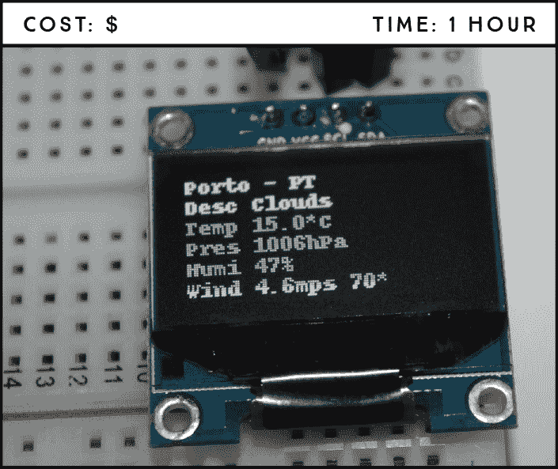
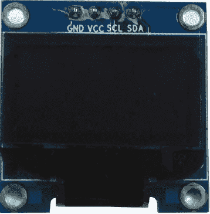
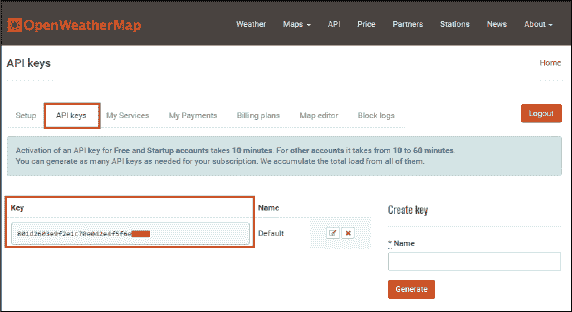
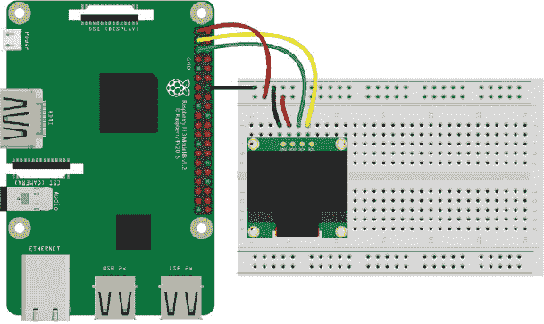
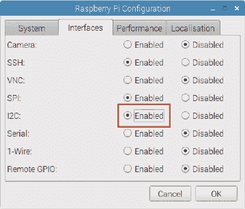

## 第八章：小型天气预报器**

在这个项目中，你将构建一个天气预报器，将你所在位置当天的天气显示在 OLED 显示屏上。你将学习如何发起 API 请求，这对依赖于频繁更新数据的项目非常有用，以及如何使用 OLED 显示屏。



**所需部件**

树莓派

面包板

0.96 英寸 OLED 显示屏

跳线

**所需软件**

Adafruit_SSD1306 库

### 介绍 OLED 显示屏

本项目使用的 *有机发光二极管（OLED）* 显示屏是 SSD1306 型号：一款单色、0.96 英寸、128×64 像素的显示屏，如 图 7-1 所示。与 LCD 显示屏相比，LCD 显示屏为每个字符保留了 5×8 像素的空间，而 OLED 显示屏则更加多功能。它允许你选择哪些像素打开或关闭，从而可以在显示屏的任何位置生成自定义的文本和图像。OLED 显示屏还不需要背光，因此在黑暗环境下具有非常好的对比度。此外，只有在像素被点亮时，OLED 显示屏才会消耗电能，因此相比 LCD 显示屏，OLED 显示屏的功耗更低。



**图 7-1：** SSD1306 0.96 英寸单色 OLED 显示屏

**注意**

*有些 OLED 显示屏使用 SPI 通信而不是 I²C，这些显示屏将配备不同的引脚。购买 OLED 显示屏之前，请确保检查引脚布局。*

该 OLED 显示屏通常有四个引脚：GND、VCC、SCL 和 SDA（见 图 7-1），不过你可能会发现某些型号还带有一个额外的重置引脚。有些显示屏的引脚顺序可能不同——例如 VCC、GND、SCL、SDA——所以在按照本项目的说明进行操作时，务必留意引脚标识。

图 7-1 中的 OLED 显示屏使用 I²C（串行外设接口）通信协议与树莓派通信，因此你需要 SDA 和 SCL 引脚（分别是 GPIO 2 和 GPIO 3）。

### 使用 OpenWeatherMap API

应用程序编程接口（API）是由软件开发人员编写的一组函数，用于使任何人都能使用他们的数据或服务。例如，OpenWeatherMap 项目 (*[`openweathermap.org/`](https://openweathermap.org/)*) 提供一个 API，允许用户使用多种编程语言请求天气数据。在这个项目中，你将使用该 API 请求你选择位置的当天天气预报。学会在 Raspberry Pi 上使用 API 是一项非常有用的技能，因为它让你可以访问各种不断变化的信息，比如当前股价、汇率、最新新闻、交通更新、推文等等。

OpenWeatherMap 的免费计划提供了完成此项目所需的所有功能。要使用 API，你需要一个 API 密钥，称为 *APIID*。获取 APIID 的方法：

1.  打开浏览器并访问 *[`openweathermap.org/appid/`](https://openweathermap.org/appid/)。

1.  点击**注册**按钮并创建一个免费账户。

1.  你将看到一个包含多个标签的仪表盘。选择**API 密钥**标签，如图 7-2 所示。

    

    **图 7-2：** OpenWeatherMap 上的 API 密钥

1.  在 API 密钥标签中，你会看到一个默认密钥（如图 7-2 所示）；这是一个独特的密钥，你需要用它从站点拉取信息。将此密钥复制并粘贴到某个地方；稍后你会用到它。如果你愿意，可以为每个独立项目创建一个新的密钥，但如果你不熟悉使用 API，我们建议你直接使用提供的默认密钥。

1.  要拉取你选择位置的天气信息，请输入以下 URL：

    ```
    http://api.openweathermap.org/data/2.5/weather?q=*your_city*,
    *your_country_code*&APPID=*your_unique_API_key*
    ```

    **警告**

    *API 是用户专属的，不应与任何人共享。在这种情况下，拥有你的 API 密钥的人只能请求天气数据，但如果你使用的是社交媒体 API，例如，你可能会遇到安全问题——比如陌生人获得了你的个人信息。请勿与任何人共享你的 API 密钥。*

    将 your_city 替换为你想获取数据的城市，将 your_country_code 替换为该城市的国家代码，将 your_unique_API_key 替换为第 4 步中的唯一 API 密钥。例如，葡萄牙波尔图的更新 API URL 如下：

    ```
    http://api.openweathermap.org/data/2.5/weather?q=Porto,
    PT&APPID=801d2603e9f2e1c70e042e4f5f6e0---
    ```

1.  将你的 URL 粘贴到浏览器中，API 将返回与你的本地天气相关的大量信息。列表 7-1 展示了我们编写此项目当天，葡萄牙波尔图的天气。

    **列表 7-1：** API 响应

    ```
    {"coord":{"lon":8.61,"lat":41.15},"weather":[{"id":802,
    "main":"Clouds","description":"scattered clouds","icon":"03d"}],
    "base":"stations","main":{"temp":280.704,"pressure":1010.06,
    "humidity":96,"temp_min":280.704,"temp_max":280.704,
    "sea_level":1041.03,"grnd_level":1010.06},"wind":{"speed":1.01,
    "deg":74.0017},"clouds":{"all":36},"dt":1487153693,
    "sys":{"message":0.0042,"country":"PT","sunrise":1487143701,
    "sunset":1487182157},"id":2735943,"name":"Porto","cod":200}
    ```

**注意**

*有关如何使用 API 获取天气信息的更多信息，请访问* [`openweathermap.org/current`](https://openweathermap.org/current)。

现在看起来可能不多，但接下来你会看到如何通过标签和段落组织这些数据，使其更易读。

#### 理解 JSON 语法

如你所见，你选择的位置的天气数据以特定的方式存储，包含像 `{}[] : ""` 和 `,` 这样的符号。这种语法是*JavaScript 对象表示法（JSON）*，一种便于计算机交换数据的标准。在 JSON 语法中：

+   数据以名称/值对的形式表示。

+   每个名称后面跟着一个冒号（ `:`）。

+   名称/值对之间由逗号分隔。

+   花括号用于包含对象。

+   方括号用于包含数组。

列表 7-2 展示了如何组织 API 信息，使其更易理解。

**列表 7-2：** 重排后的 API JSON 信息，以更清晰的结构呈现

```
{
   "coord":{
      "lon":-8.61,
      "lat":41.15
   },
   "weather":[{
         "id":803,
         "main":"Clouds",
         "description":"broken clouds",
         "icon":"04d"
      }
   ],
   "base":"stations",
   "main":{
      "temp":288.15,
      "pressure":1020,
      "humidity":93,
      "temp_min":288.15,
      "temp_max":288.15
   },
   "visibility":10000,
   "wind":{
      "speed":3.6,
      "deg":230
   },
   "clouds":{
      "all":75
   },
   "dt":1488726000,
   "sys":{
      "type":1,
      "id":5959,
      "message":0.002,
      "country":"PT",
      "sunrise":1488697277,
      "sunset":1488738646
   },
   "id":2735943,
   "name":"Porto",
   "cod":200
}
```

现在你可以更轻松地查看 API 提供的各种信息。

#### 发起 API 请求

现在你已经有了一个返回本地天气数据的 URL。为了展示如何使用 Python 访问这些信息，我们将给你一个示例。

在清单 7-3 中的简单代码片段会请求葡萄牙波尔图的当前最大温度（单位为开尔文），并将其打印在 Python 终端中。用你自己的 URL 替换我们的网址，就能得到你选择地点的相同信息。

**清单 7-3：** 请求最大温度

```
➊ import requests
➋ weather_data = requests.get('http://api.openweathermap.org/data/2.5/
  weather?q=Porto,PT&APPID=801d2603e9f2e1c70e042e4f5f6e0---')
➌ temp_max = weather_data.json().get('main').get('temp_max')
  print(temp_max)
```

在➊位置，你导入了 requests 库，这是进行 API 请求的必备库。

在➋位置，你创建了一个名为`weather_data`的变量，来存储 API 请求后返回的数据。要进行 API 请求，你使用命令`requests.get('`your_url`')`，其中`your_url`是你网址的单引号括起来的参数。

在➌位置，你创建了`temp_max`变量来存储你请求的特定数据。在这个案例中，你想要获取最大温度。

要获取该值，首先你需要将`weather_data`变量转换为 JSON 格式，使用`.json()`方法。然后，使用`.get()`方法，你可以访问包含最大温度值的`temp_max`变量。你可以在清单 7-2 中看到，`main`是你想要访问的数据的顶级父节点`temp_max`，所以你需要先通过`main`。

同样地，要访问风速，你需要输入：

```
weather_data.json().get('wind').get('speed')
```

你需要通过`speed`的父节点`wind`来请求风速信息。

如果你只想获取城市名称，可以输入：

```
weather_data.json().get('name')
```

学会了如何在 Python 中进行 API 请求后，你就准备好开始这个项目了！

**requests 库**

requests 库，也称为“HTTP for Humans”，是一个 Apache2 许可的 Python 库，用于发送*超文本传输协议（HTTP）*请求。这个强大的库让通过 HTTP 连接到网络服务器变得简单。这个功能使你能够轻松地从任何网页请求信息，就像你在这里所做的那样。

### 接线电路

只需根据表格中显示的引脚图将 OLED 显示器接线到树莓派。记得某些型号的引脚顺序可能不同，所以请按照引脚标签来连接。

| **OLED 显示器** | **树莓派** |
| --- | --- |
| VCC | 3.3 V |
| GND | GND |
| SDA | GPIO 2 (SDA) |
| SCL | GPIO 3 (SCL) |
| RST (如果存在) | GPIO 24 |

检查你的电路与图 7-3 中的电路图，并接着进行软件部分的操作。



**图 7-3：** 将 OLED 显示器接线到树莓派

### 编写脚本

在输入脚本之前，你需要安装 Adafruit_SSD1306 库来在树莓派上使用 OLED 显示器。这个库让你能够轻松地在显示器上编写文本和绘制图像。你还需要启用 I²C 通信，以便 OLED 和树莓派能够通信。

#### 安装 OLED 显示库

如果你还没有创建，请在桌面上创建一个名为*Libraries*的文件夹。然后，打开终端，进入你树莓派上的*Libraries*文件夹：

```
pi@raspberrypi:~ $ cd Desktop/Libraries
```

克隆 OLED 库：

```
pi@raspberrypi:~/Desktop/Libraries $ git clone https://github.com/
adafruit/Adafruit_Python_SSD1306.git
```

安装 Adafruit_Python_SSD1306 库：

```
pi@raspberrypi:~/Desktop/Libraries $ cd adafruit/
Adafruit_Python_SSD1306
pi@raspberrypi:~/Desktop/Libraries/adafruit/Adafruit_Python_SSD1306
$ sudo python3 setup.py install
```

#### 启用 I²C 通信

OLED 通过 I²C 通信协议与 Pi 进行通信，因此你需要在 Pi 上启用 I²C 通信。进入桌面主菜单，选择**首选项** ▸ **树莓派配置**。在接口选项卡中，启用 I²C，如图 7-4 所示，然后点击**确定**。



**图 7-4：** 启用 I²C 通信

**I²C 通信协议**

*I²C*，或称*互联集成电路*，是一种通信协议，允许多个*从设备*集成电路与一个主芯片之间进行通信。从设备是响应主设备的设备。主芯片可以与所有从设备通信，但从设备只能与主设备通信。主从设备都可以传输数据，但该传输始终由主设备控制。在这个例子中，树莓派是主芯片，而 OLED 集成电路是从设备。树莓派通过 SDA 和 SCL 引脚支持 I²C 通信。这种通信协议的最大优势是，你可以通过 I²C 连接多个设备，只需使用 SDA 和 SCL 引脚——无需使用额外的引脚。

#### 输入脚本

打开**Python 3 (IDLE)**，并选择**文件** ▸ **新建文件**以创建一个新脚本。将清单 7-4 中显示的代码复制到 Python 编辑器，并将脚本保存为*weather_forecast.py*，保存在*Displays*文件夹中（记住，你可以在*[`www.nostarch.com/RaspberryPiProject/`](https://www.nostarch.com/RaspberryPiProject/)*下载所有脚本）：

**清单 7-4：** *weather_forecast.py*脚本

```
➊ import time
  import Adafruit_SSD1306
  import requests

  from PIL import Image
  from PIL import ImageDraw
  from PIL import ImageFont

  #Raspberry Pi pin configuration
➋ RST = 24

➌ #128x32 display with hardware I2C
  #disp = Adafruit_SSD1306.SSD1306_128_32(rst=RST)

  #128x64 display with hardware I2C
  disp = Adafruit_SSD1306.SSD1306_128_64(rst=RST)

  #set your unique OpenWeatherMap.org URL
➍ open_weather_map_url = 'http://api.openweathermap.org/data/2.5/
  weather?q=Porto,PT&APPID=801d2603e9f2e1c70e042e4f5f6e0---'

  #initialize display
➎ disp.begin()

  while True:
      #clear display
      disp.clear()
      disp.display()

      #create blank image for drawing
      #make sure to create image with mode '1' for 1-bit color
      width = disp.width
      height = disp.height
      image = Image.new('1', (width, height))

      #get drawing object to draw on image
      draw = ImageDraw.Draw(image)

      #draw a black filled box to clear the image
      draw.rectangle((0,0,width,height), outline=0, fill=0)

      #define constants to define drawing area
      padding = 2
      top = padding

      #move left to right, keeping track of the current x position
      #for drawing text
      x = padding

      #load default font
      font = ImageFont.load_default()

      #openWeatherMap.org weather data request
➏     weather_data = requests.get(open_weather_map_url)

      #display location
➐     location = weather_data.json().get('name') + ' - '
  + weather_data.json().get('sys').get('country')
      draw.text((x, top), location, font=font, fill=255)

      #display description
      description = 'Desc ' + weather_data.json().get('weather')[0]
  .get('main')
      draw.text((x, top+10), description,  font=font, fill=255)

      raw_temperature = weather_data.json().get('main')
  .get('temp')-273.15

      #temperature in Celsius
      temperature = 'Temp ' + str(raw_temperature) + '*C'

      #uncomment for temperature in Fahrenheit
      #temperature = 'Temp ' + str(raw_temperature*(9/5.0)+32) + '*F'
      #display temperature
      draw.text((x, top+20), temperature, font=font, fill=255)

      #display pressure
      pressure = 'Pres ' + str(weather_data.json().get('main')
  .get('pressure')) + 'hPa'
      draw.text((x, top+30), pressure, font=font, fill=255)

      #display humidity
      humidity = 'Humi ' + str(weather_data.json().get('main')
  .get('humidity')) + '%'
      draw.text((x, top+40), humidity, font=font, fill=255)

      #display wind
      wind = 'Wind ' + str(weather_data.json().get('wind')
  .get('speed')) + 'mps ' + str(weather_data.json().get('wind')
  .get('deg')) + '*'
      draw.text((x, top+50), wind, font=font, fill=255)

      #display image
➑     disp.image(image)
      disp.display()
      time.sleep(10)
```

如往常一样，你的代码首先导入所需的库➊。Adafruit_SSD1306 库包含 OLED 显示驱动程序类。从 Python 图像库（PIL）中，你导入三个模块——`Image`、`ImageDraw`和`ImageFont`——用于创建显示在 OLED 上的文本图像。

**OLED 库**

Adafruit_SSD1306 库将 OLED 显示屏上显示的所有内容称为“图像”——即使是文本也是如此。你在这里使用的三个模块具有以下功能：

+   Image 创建一个新图像。

+   ImageDraw 在图像中绘制文本或图标，并显示你将在实际 OLED 显示屏上看到的内容。

+   ImageFont 设置文本字体。

##### 初始化 OLED 显示屏

即使你的显示屏没有重置引脚，你也需要在代码中设置`RST`引脚。如果你的显示屏有重置引脚，它应该连接到 GPIO 24。因此，无论哪种情况，在这里➋你都将`RST`设置为`24`。

在➌处，你为显示器创建一个类。对于 128×32 显示屏，创建类`SSD1306_128_32`；对于 128×64 显示屏，创建类`SSD1306_128_64`。我们在代码中给出了这两种选项，你可以直接取消注释与显示屏尺寸匹配的那一行，并注释掉其他行。

在➎处，你初始化了显示库并准备好显示器，这样你就可以在上面绘制文本了。我们对代码进行了大量注释，帮助你理解每一行的目的。

##### 发出 API 请求

在➍处，你创建了一个名为`open_weather_map_url`的变量来保存 API 的 URL。确保更新这一行，使用你自己的 API URL。

在➏处，你发出 API 请求，然后有几个代码块执行类似的操作。我们将解释➐处的代码，然后你就能理解其余代码的功能。你创建了一个变量`location`来获取位置。这个变量是几个字符串的连接。首先，你使用`weather_data.json().get('name')`获取位置，在这个例子中返回的是`Porto`。接着，你用`+ ' - '`添加一个连字符，然后使用`weather_data.json().get('sys').get('country')`获取国家代码；在这个例子中返回的是`PT`。因此，`location`变量的值为`Porto – PT`。

##### 在 OLED 显示器上绘制文本

要在显示器上绘制文本，你使用`draw.text()`函数，它需要以下参数：

x 和 y 坐标  文本开始绘制的位置

text  要显示的文本

字体  文本将显示的字体

fill  像素亮度——255 是最大值

例如，要在 OLED 预报器的顶部行显示位置，可以使用以下代码：

```
draw.text((x, top), location, font=font, fill=255)
```

`x` 和 `top` 坐标在➎处定义。这个例子使用了默认的库字体，但你可以随意探索其他字体，方法是下载字体文件并修改代码。

显示天气描述、温度、气压、湿度和风速的代码块都很相似。注意，你需要递增`top`变量来在显示器的下一行绘制文本。

最后，在➑处的代码行将图像显示在 OLED 上。结尾的延迟时间决定了循环更新天气信息的速度——在这个例子中，每 10 秒更新一次。

#### 运行脚本

按下**F5**键或进入**运行** ▸ **运行模块**来运行脚本。恭喜你，现在你有一个小型天气预报器，它将不断更新你选择位置的天气数据！

### 进一步拓展

你可以使用 API 获取比天气更多的信息。使用你喜欢的搜索引擎，输入类似 *free API for <thing>* 的查询，找到你可以访问的 API。这里有一些想法，帮助你入手：

+   交通

+   推文

+   最新新闻

+   股票价格

+   当前比特币汇率
