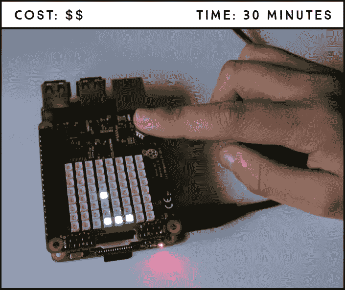
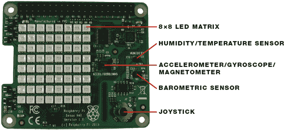
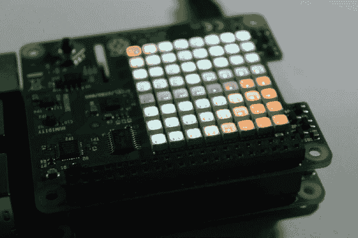
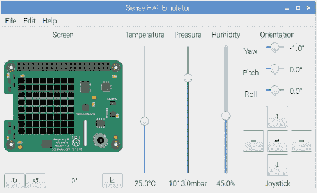
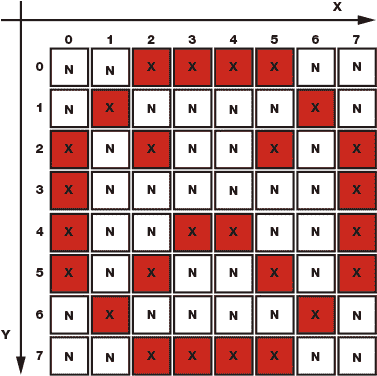
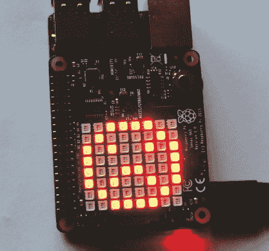

## 第九章：带有 Sense HAT 的 Pong 游戏**

在这里，你将使用 Sense HAT 构建你自己的 LED Pong 游戏。Sense HAT 是一个附加板，可以为你的树莓派提供更多的功能，带有像 LED 矩阵、摇杆和多个传感器等额外特性，能够获取外部世界的信息。



**所需配件**

树莓派（带 40 个 GPIO 的版本）

Sense HAT

你将使用 Sense HAT 的 LED 矩阵来显示游戏，使用摇杆来进行游戏。如果你没有硬件设备，不用担心：你还将学习如何使用 Sense HAT 模拟器来创建相同的游戏而无需硬件。

### 介绍 Pong 游戏

Pong 是历史上最早的电子游戏之一，它是一款极受欢迎的 2D 乒乓球游戏，可以进行单人或双人模式游戏。你将创建单人版，因此更像是玩壁球：你用球拍将球反弹到墙上，当球回来时用球拍接住它。如果你错过了球，你就输了。

### 介绍树莓派 Sense HAT

树莓派 Sense HAT 配备了一个 8×8 RGB LED 矩阵、一个五按钮摇杆、一个陀螺仪、一个加速度计、一个磁力计、一个温度传感器、一个气压传感器和一个湿度传感器，所有这些功能集成在一个板子上，如图 8-1 所示。



**图 8-1：** 树莓派 Sense HAT

#### 安装板子

**注意**

*Sense HAT 不兼容树莓派 1 Model A 和 B，但如果你使用不兼容的板子，可以通过模拟器来构建这个项目。*

这个项目不需要太多硬件组装——你只需将 Sense HAT 安装到树莓派上，其余的工作都在代码中完成。

将 Sense HAT 上的 40 个 GPIO 连接到树莓派上的 40 个 GPIO 接口；两个板子应当完美对齐。当你第一次成功将 Sense HAT 安装到通电的树莓派上时，LED 矩阵将显示一个彩虹背景，如图 8-2 所示。



**图 8-2：** Sense HAT 欢迎彩虹

#### 使用 Sense HAT 模拟器

如果你没有 Sense HAT 或兼容的板子，或者你只是想先测试脚本，可以使用 Sense HAT 模拟器在计算机上构建 Pong 游戏。模拟器是一个虚拟的 Sense HAT，你可以与其互动来测试你的脚本。从桌面主菜单启动模拟器，进入 **编程** ▸ **Sense HAT 模拟器**。这将打开模拟器窗口，如图 8-3 所示。



**图 8-3：** Sense HAT 模拟器窗口

Sense HAT 模拟器附带了存储在 **文件** ▸ **示例** 中的示例；只需选择你想要的示例，然后运行文件即可在模拟器窗口中查看代码的执行效果。

### 使用 Sense HAT 功能和控制

在开始构建游戏之前，了解如何控制 LED 矩阵以及如何从摇杆读取输入是非常重要的。让我们先看看一些你将在 Pong 脚本中使用的例子。

#### 控制 LED 矩阵

Sense HAT LED 矩阵有 8 列和 8 行，总共包含 64 个 RGB LED。你可以通过单独控制每个 LED 来在矩阵上显示文本和创建图像。你还可以设置每个 LED 的颜色。

##### 显示文本

Listing 8-1 中的代码将在点阵屏上以蓝色显示滚动文本“Hello World!”。

**LISTING 8-1：** 在 Sense HAT LED 矩阵上显示文本

```
➊ from sense_hat import SenseHat
  #uncomment the following line if you are using the emulator
➋ #from sense_emu import SenseHat
  sense = SenseHat()
➌ sense.show_message('Hello World!', text_colour = [0, 0, 255])
```

首先导入 `SenseHat` 类 ➊。如果你使用的是模拟器，请删除或注释掉这一行，并取消注释 ➋ 处的代码。

`show_message()` 函数 ➌ 接受要显示的消息—文本字符串—作为第一个参数，然后接受几个选项作为后续参数：

**注意**

*sense_hat 库使用的是英国拼写的“colour”，因此你必须在代码中始终使用“colour”。*

+   使用 `text_colour = [*r*, *g*, *b*]` 来设置文本的 RGB 颜色，将 `*r*, *g*, *b*` 替换为介于 `0` 和 `255` 之间的整数（如你在 Project 5 中所做的那样）。

+   使用 `scroll_speed = *x*`，其中 x 是一个浮动数值，用来控制文本在显示器上移动的速度。默认的滚动速度设置为每次文本向左移动一个像素时暂停 0.1 秒。

+   使用 `back_colour = [*r*, *g*, *b*]` 来设置背景颜色，替换 `*r*, *g*, *b*` 为整数值，方法与 `text_colour` 相同。

##### 控制特定的 LED

要控制单个 LED，你需要通过其在矩阵中的位置来引用你想要点亮的每个 LED。为此，Sense HAT 使用 (x, y) 坐标系统。例如， Figure 8-4 中的 LED 坐标就列在图旁边。


**FIGURE 8-4：** Sense HAT 坐标系统

要使用相应的颜色点亮 Figure 8-4 中的 LED，你可以使用 Listing 8-2 中的代码。

**LISTING 8-2：** 使用 `set_pixel()` 点亮特定的 LED

```
from sense_hat import SenseHat
#uncomment the following line if you are using the emulator
#from sense_emu import SenseHat
sense = SenseHat()
#set blue pixel
sense.set_pixel(0, 1, 0, 0, 255)
#set green pixel
sense.set_pixel(7, 6, 0, 255, 0)
#set pink pixel
sense.set_pixel(2, 5, 255, 51, 153)
```

函数 `sense.set_pixel(*x*, *y*, *r*, *g*, *b*)` 点亮特定的 LED，其中 x 是 x 坐标，y 是 y 坐标，r、g 和 b 设置颜色。

##### 显示图片

与其控制单个 LED，你可以使用 `sense.set_pixels()` 函数更快地显示图像。你无需输入坐标，而是插入一个包含所有 64 个 LED 的列表来确定每个 LED 的颜色。请查看 Listing 8-3 中的代码，它显示了一个悲伤的表情。

**LISTING 8-3：** 使用 `set_pixels()` 显示图像

```
from sense_hat import SenseHat
#uncomment the following line if you are using the emulator
#from sense_emu import SenseHat
sense = SenseHat()

#red color
X = [255, 0, 0]

#no color
N = [0, 0, 0]

#sad face array
sad_face = [
N, N, X, X, X, X, N, N,
N, X, N, N, N, N, X, N,
X, N, X, N, N, X, N, X,
X, N, N, N, N, N, N, X,
X, N, N, X, X, N, N, X,
X, N, X, N, N, X, N, X,
N, X, N, N, N, N, X, N,
N, N, X, X, X, X, N, N
]

sense.set_pixels(sad_face)
```

**注意**

*在 `sad_face` 数组中的红色 X 不会在代码中显示为红色。我们只是高亮它们，以便更容易地可视化 LED 的显示效果。*

你创建一个变量来存储点亮 LED 的颜色（`X`），以及一个变量来存储背景的颜色（`N`）——你可以将背景设置为任何颜色，或者将其设置为 `0` 使其不亮。然后，你需要创建一个数组，将每个 64 个 LED 设置为 `X` 或 `N`。图 8-5 显示了 清单 8-3 中代码的最终结果：



**图 8-5：** 在 LED 矩阵上显示一个难过的表情

你可以在绘图中包含任意多的颜色；你只需要更改颜色参数。我们鼓励你通过更改颜色和绘制自己的图像来练习使用 LED 矩阵。

现在你知道如何控制 LED 矩阵了，让我们看看如何编程摇杆。

#### 从摇杆读取数据

随 Sense HAT 一起提供的摇杆有五个控制选项：

+   向上移动

+   向下移动

+   向右移动

+   向左移动

+   按下

你需要告诉你的程序每个控制选项应该让树莓派执行什么操作。清单 8-4 中的脚本设置了与每个摇杆控制相关的事件，并在计算机屏幕上显示使用了哪个控制：

**清单 8-4：** 将事件与每个摇杆控制关联

```
  from signal import pause

  from sense_hat import SenseHatm
  #uncomment the following line if you are using the emulator
  #from sense_emu import SenseHat
  sense = SenseHat()

➊ def move_up(event):
      print('joystick was moved up')

  def move_down(event):
      print('joystick was moved down')

  def move_right(event):
      print('joystick was moved right')

  def move_left(event):
      print('joystick was moved left')

  def move_middle(event):
      print('joystick was pressed')

➋ sense.stick.direction_up = move_up
  sense.stick.direction_down = move_down
  sense.stick.direction_right = move_right
  sense.stick.direction_left = move_left
  sense.stick.direction_middle = move_middle

  pause()
```

首先，你需要告诉你的树莓派在每次摇杆控制被触发时应该执行什么操作。你通过定义一系列函数来执行这些操作。例如，当摇杆向上移动时，你调用 `move_up()` ➊ 函数来打印消息 `摇杆向上移动`。`event` 参数告诉树莓派摇杆将向这些函数发送信息。然后，你使用 `sense.stick.direction_up = move_up` ➋ 将 `move_up` 函数与摇杆的向上移动关联起来。

其他的移动函数也是以相同的方式工作。

### 编写脚本

现在你已经知道如何在 LED 矩阵上显示文本和图形，以及如何在使用摇杆时让某些事情发生，你已经准备好开始为你的游戏编写脚本了。

游戏的目标是：

+   一只长度为 3 像素、宽度为 1 像素的拍子应该出现在第 0 列。

+   每次你向上或向下移动摇杆时，拍子应该相应地移动。

+   球应该从一个随机位置开始，并以对角线方向移动。

+   当球击中物体——墙壁、天花板或拍子——时，它应该沿相反的对角线方向移动。

+   如果球击中第 0 列，意味着你错过了球，游戏就结束了，你输了。

#### 输入脚本

打开 **Python 3 (IDLE)** 并进入 **文件** ▸ **新建文件** 来创建一个新的脚本。然后将 清单 8-5 中的代码复制到新文件，并将脚本保存为 *pong_game.py* 到 *Displays* 文件夹中（记得你可以在 *[`www.nostarch.com/RaspberryPiProject/`](https://www.nostarch.com/RaspberryPiProject/)* 下载所有脚本）。

**清单 8-5：** Pong 游戏代码

```
  #based on raspberrypi.org Sense HAT Pong example

  #import necessary libraries
➊ from random import randint
  from time import sleep

  #use this line if you are using the Sense HAT board
  from sense_hat import SenseHat
  #uncomment the following line if you are using the emulator
  #from sense_emu import SenseHat

  #create an object called sense
➋ sense = SenseHat()

  #set bat position, random ball position, and velocity
➌ y = 4
➍ ball_position = [int(randint(2,6)), int(randint(1,6))]
➎ ball_velocity = [1, 1]

  #red color
  X = [255, 0, 0]
  #no color
  N = [0, 0, 0]

  #sad face array
  sad_face = [
  N, N, X, X, X, X, N, N,
  N, X, N, N, N, N, X, N,
  X, N, X, N, N, X, N, X,
  X, N, N, X, N, N, N, X,
  X, N, N, X, N, N, N, X,
  X, N, X, N, N, X, N, X,
  N, X, N, N, N, N, X, N,
  N, N, X, X, X, X, N, N
  ]

  #draw bat at y position
➏ def draw_bat():
      sense.set_pixel(0, y, 0, 255, 0)
      sense.set_pixel(0, y+1, 0, 255, 0)
      sense.set_pixel(0, y-1, 0, 255, 0)

  #move bat up
➐ def move_up(event):
      global y
      if y > 1 and event.action=='pressed':
          y -= 1

  #move bat down
  def move_down(event):
      global y
      if y < 6 and event.action=='pressed':
          y += 1

  #move ball to the next position
➑ def draw_ball():
      #ball displayed on current position
      sense.set_pixel(ball_position[0], ball_position[1], 75, 0, 255)
      #next ball position
      ball_position[0] += ball_velocity[0]
      ball_position[1] += ball_velocity[1]
      #if ball hits ceiling, calculate next position
      if ball_position[0] == 7:
          ball_velocity[0] = -ball_velocity[0]
      #if ball hits wall, calculate next position
      if ball_position[1] == 0 or ball_position[1] == 7:
          ball_velocity[1] = -ball_velocity[1]
      #if ball reaches 0 position, player loses and game quits
      if ball_position[0] == 0:
          sleep(0.25)
          sense.set_pixels(sad_face)
          quit()
      #if ball hits bat, calculate next ball position
      if ball_position[0] == 1 and y - 1 <= ball_position[1] <= y+1:
          ball_velocity[0] = -ball_velocity[0]

  #when joystick moves up or down, trigger corresponding function
➒ sense.stick.direction_up = move_up
  sense.stick.direction_down = move_down

  #run the game
➓ while True:
      sense.clear()
      draw_bat()
      draw_ball()
      sleep(0.25)
```

这段代码涉及的内容很多。让我们一步一步地来看。

##### 导入必要的库

在➊处，你从 rand 库中导入了`randint()`函数来生成伪随机整数，并从 time 库中导入了`sleep()`函数来设置延迟时间。

在➋处，你创建了一个名为`sense`的对象，之后在整个代码中都可以通过它来引用 Sense HAT。

##### 创建蝙蝠

蝙蝠是一个 3 像素长的条形，沿着最左边的列上下移动。在➌处，你通过`y = 4`定义了蝙蝠的起始位置，距离顶部 4 个像素。完整的蝙蝠在`draw_bat()`函数中绘制，位置为起始位置顶部再加一个像素（`y - 1`），底部再加一个像素（`y + 1`），使蝙蝠的长度为 3 个像素。

##### 移动蝙蝠

蝙蝠只在 y 轴上移动，因此它的 x 坐标始终是`0`，但是它的 y 坐标需要根据玩家移动蝙蝠而变化。换句话说，玩家只能上下移动蝙蝠。`move_up()`和`move_down()`这两个函数在➐处定义，控制这些移动。在➒处，您通过分别调用`move_up()`和`move_down()`来告诉树莓派，当玩家上下移动摇杆时应该执行什么操作。

详细查看`move_up()`函数（`move_down()`函数以类似的方式工作）：

```
#move bat up
def move_up(event):
    global y
    if y > 1 and event.action=='pressed':
        y -= 1
```

`move_up()`函数接受`event`作为参数。基本上，`event`参数允许你传递一些关于摇杆的信息给函数——例如，摇杆使用的时间；推动的方向；以及是按下、释放还是按住——这样树莓派就知道该如何反应。

**提示**

*在 Python 中*，`y -= 1` *等同于* `y = y - 1`。

当玩家将摇杆向上移动时，函数通过从变量`y`中减去`1`来使蝙蝠的 y 坐标上升。但是在此之前，代码会检查`y > 1`，否则蝙蝠可能会移动到矩阵外面。

##### 声明变量作用域

注意，`y`被定义为`global`变量。并不是程序中的所有变量都能在程序的任何位置访问，因此可能存在某些地方无法调用特定的变量。变量的*作用域*是指程序中可以访问它的区域。在 Python 中，有两种基本的变量作用域：*局部*和*全局*。

在主代码体中定义的变量是全局的，意味着它可以在代码的任何其他地方访问。定义在函数内部的变量是局部变量，因此你在函数内部对局部变量的操作不会影响外部的变量，即使它们有相同的名字。

由于你希望`y`在函数内部以及整个代码中都能使用，因此它需要声明为`global`。否则，当你移动摇杆时，什么也不会发生，因为`y`变量只是被修改了函数内部的值，而不是在主代码体内。

##### 创建球

为了让球动起来，首先你需要设置一个起始位置和速度。在 ➍ 处，你使用一个列表来设置球的起始位置。列表定义在方括号之间，`[*第 0 个元素*, *第 1 个元素*, ..., *第 n 个元素*]`，每个元素之间用逗号分隔。列表中的元素是*零索引*，也就是说，第一个元素的索引是 0，而不是 1。在这个例子中，我们的第 0 个元素是 x 位置，第 1 个元素是 y 位置。

当你启动游戏时，球会出现在一个随机位置，这个位置是由`randint()`函数生成的。这个随机位置在 y 轴上可以是 1 到 6 之间的数，在 x 轴上可以是 2 到 6 之间的数。这些数值确保球不会从天花板、墙壁或棒球旁边开始。

##### 移动球

一旦你有了球的起始位置，就需要给它一个速度 ➎ 使它开始移动。你为球的速度创建一个列表，其中第 0 个元素是 x 坐标的速度，第 1 个元素是 y 坐标的速度。

你需要加上或减去速度来更新当前球的位置，以使球向前或向后移动。`draw_ball()`函数在 ➑ 处负责显示和移动球，球总是沿对角线移动。如果它向前移动，它会继续向前；如果它向后移动，它会继续向后，除非它碰到天花板或棒球，这时它会朝相反方向移动。

##### 保持游戏运行

一切准备好后，你需要添加一个`while`循环来保持游戏运行 ➓。`while`循环首先清空显示屏；然后，它调用`draw_bat()`函数绘制棒球，调用`draw_ball()`函数来显示球。

最后一行的`sleep()`函数定义了球移动到另一个位置所需的时间，因此你可以使用此函数来确定球的移动速度。如果你增加延迟时间，游戏变得更慢且更容易；如果你减少延迟时间，游戏速度则会更快。我们鼓励你尝试不同的延迟时间。

#### 运行脚本

恭喜你！经过大量编程，你获得了奖励：你可以在你的 Sense HAT 上玩 Pong 游戏！按下**F5**或者去**运行** ▸ **运行模块**来运行脚本。

当你失败并且游戏结束时，LED 矩阵会显示一个如图 8-6 所示的难过表情。



**图 8-6：** 当游戏结束时，LED 矩阵显示一个难过的表情

### 更进一步

下面是一些升级你游戏的建议：

+   随着游戏进行，减少延迟时间以增加游戏的难度。

+   添加一个得分系统，每当球击中棒球时就得 1 分，并在屏幕上显示得分。

+   插入一个条件，当你按下摇杆时重新开始游戏。
