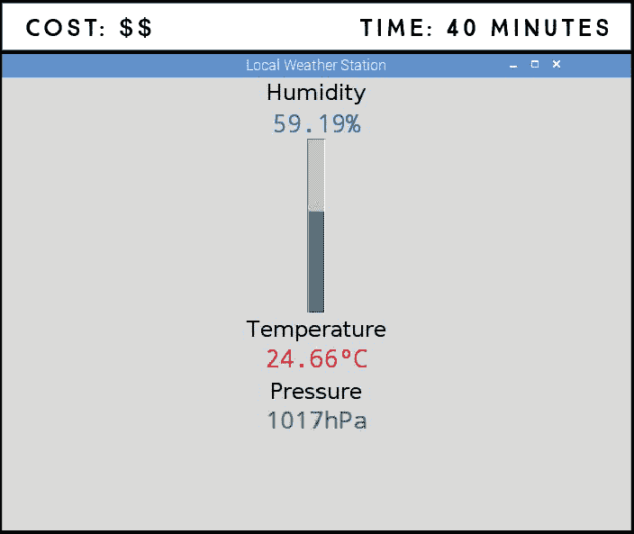
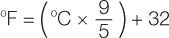
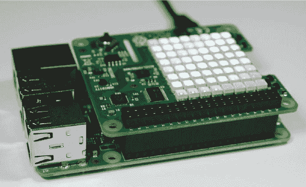
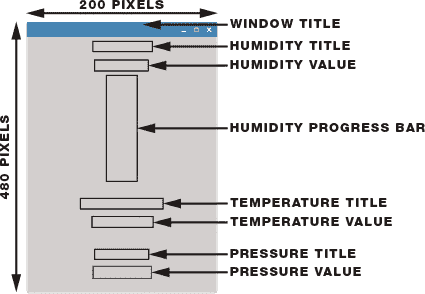

## 第十章：**一体化气象传感器站**

在这个项目中，你将构建一个本地气象站，利用 Sense HAT 检测温度、湿度和气压。你还将创建一个图形用户界面，实时显示温度、湿度和气压读数。



**所需部件**

Raspberry Pi（带有 40 个 GPIO 接口的版本）

Sense HAT

### Sense HAT 作为气象站

Sense HAT 是一个优秀的小型且价格实惠的气象站，因为它配备了温度、湿度和气压传感器。使用 Sense HAT 读取传感器数据非常简单，因此它是学习传感器读取的好起点。

#### 温度传感器

**注意**

*与真实值相比，温度读数可能会偏差几度。Sense HAT 安装在 Pi 上，Raspberry Pi 处理器的热量可能会稍微影响结果。*

顾名思义，温度传感器用于测量温度。默认情况下，Sense HAT 以摄氏度读取温度，因此如果你需要以华氏度显示温度，需将读取值进行转换。转换公式为：将摄氏度数值乘以 9，除以 5，再加上 32，具体公式如下所示。



你可以将此公式添加到代码中，这样程序就能为你自动转换。

#### 湿度传感器

湿度有两种常见的表达方式：绝对湿度和相对湿度。*绝对湿度*是指在特定体积空气中的水蒸气质量，与温度无关，单位是千克每立方米（kg/m³）。空气能够容纳的水蒸气量随温度变化而变化，温度越高，空气能容纳的水蒸气越多。*相对湿度*则表示当前空气中的水蒸气量与在给定温度下最大可能容纳的水蒸气量的比例，通常以百分比表示。

Sense HAT 记录相对湿度，因为它对于天气预报更为有用：相对湿度百分比越大，降水的概率越高。由于相对湿度随着温度的变化而变化，因此它总是与温度传感器配合使用。

#### 气压传感器

气压传感器读取大气压力，即在给定点的空气“重量”，单位是 hPa（百帕），相当于 mbar（毫巴）。为什么测量气压很有趣呢？因为大气压力的变化有助于预测天气。气压上升通常意味着好天气即将到来，而气压下降则意味着坏天气的预兆，比如降雨或风暴。

气压变化非常小。你需要仔细跟踪气压计的读数，才能注意到变化趋势。

### 读取温度、湿度和气压

现在让我们看看如何从传感器读取数据并将其输出到 Python shell。

将 Sense HAT 安装在你的树莓派上，就像在项目 8 中一样，并确保它连接良好。当首次连接时，Sense HAT 应显示一个彩虹背景，与你在启动树莓派时在屏幕上看到的彩虹匹配（见图 9-1）。



**图 9-1：** Sense HAT 彩虹背景

在你的*Projects*文件夹中创建一个名为*Sensors*的新文件夹。然后打开**Python 3 (IDLE)**，点击**文件** ▸ **新建**来创建一个新的脚本，命名为*weather_data.py*，并输入清单 9-1 中的代码（记住，你可以在* [`www.nostarch.com/RaspberryPiProject/`](https://www.nostarch.com/RaspberryPiProject/)* 下载所有脚本）。

**清单 9-1：** 使用 Sense HAT 读取温度、湿度和压力

```
➊ from sense_hat import SenseHat
  #from sense_emu import SenseHat

  from time import sleep

  #create an object called sense
➋ sense = SenseHat()

  while True:
   ➌ temperature = sense.temperature
   ➍ temperature = str(round(temperature, 2))
   ➎ print('Temperature: ' + temperature + '*C\n')
     humidity = sense.humidity
     humidity = str(round(humidity, 2))
     print ('Humidity: ' + humidity + '%\n')

     pressure = sense.pressure
     pressure = str(round(pressure, 2))
     print('Pressure: ' + pressure + 'hPa\n')

     sleep(1)
```

首先，你从 sense_hat 库导入`SenseHat`类➊。然后，你创建一个名为`sense`的对象来引用 Sense HAT➋。

获取传感器读数➌是很简单的，因为有以下几个恰如其分命名的函数：

+   `sense.temperature` 获取温度读数。

+   `sense.humidity` 获取湿度读数。

+   `sense.pressure` 获取压力读数。

读数精确到小数点后若干位，因此你可以使用`round()`函数来四舍五入数字，使结果更易读。`round()`函数➍接受两个参数：你想要四舍五入的数字以及你希望设置的小数位数，顺序为：在这里，它被设置为两位小数。你还可以使用`str()`函数，它将传入的参数转换为字符串。你需要将读数转换为字符串，以便将它们与要打印到终端的文本拼接起来➎。

现在你几乎成了一个气象学家！接下来，你将为你的天气数据构建一个用户界面。

### 为你的读数构建用户界面

让我们将这个项目提升到另一个层次，构建一个酷炫的用户界面来显示你的传感器读数。你的界面应该包括：

+   一个显示温度、湿度和压力的桌面窗口

+   湿度以垂直进度条形式显示，范围从 0 到 100 百分比

+   温度和压力以数字形式显示

+   每个读数的标签

图 9-2 显示了一个用户界面草图，应该能帮助你理解如何编写代码。



**图 9-2：** 图形用户界面草图

你还可以编辑代码来选择字体类型、大小和颜色，以及标签和读数在窗口中的位置。下表列出了所有标题和数值，以及我们如何展示它们。

| **小部件** | **选项** |
| --- | --- |
| 窗口标题 | 文本：“本地气象站” |
| 湿度标题 | 文本：“湿度”，字体：Helvetica，大小：18，垂直填充：3 |
| 湿度值 | 字体：Courier，大小：20，颜色：蓝色，位置：北 |
| 湿度进度条 | 方向：垂直，大小：20，颜色：蓝色，位置：北，长度：200，最大值：100 |
| 温度标题 | 文本：“Temperature”，字体：Helvetica，大小：18，位置：南 |
| 温度值 | 字体：Courier，大小：20，颜色：红色，位置：北 |
| 压力标题 | 文本：“Pressure”，字体：Helvetica，大小：18，位置：南 |
| 压力值 | 字体：Courier，大小：20，颜色：绿色，位置：北 |

### 编写脚本

打开**Python 3 (IDLE)**，然后选择**文件** ▸ **新建文件**，创建一个新脚本。将 Listing 9-2 中的代码复制到 Python 编辑器中，并将脚本保存为*weather_station.py*，存放在*Sensors*文件夹内（记得你可以在*[`www.nostarch.com/RaspberryPiProject/`](https://www.nostarch.com/RaspberryPiProject/)*下载所有脚本）：

**LISTING 9-2：** 在图形用户界面中显示 Sense HAT 读数

```
  #import necessary libraries
➊ from tkinter import *
  from tkinter import ttk
  import time
  from sense_hat import SenseHat
  #from sense_emu import SenseHat

  #create an object called sense
  sense = SenseHat()

  #create window
➋ window = Tk()
  window.title('Local Weather Station')
  window.geometry('200x480')

  #create humidity label for title and value
➌ humidity_label = Label(window, text = 'Humidity', font =
  ('Helvetica', 18), pady = 3)
  humidity_label.pack()

➍ humidity = StringVar()

➎ humidity_value=Label(window, textvariable = humidity,font =
  ('Courier', 20), fg = 'blue', anchor = N, width = 200)
  humidity_value.pack()

  #create humidity canvas
➏ humidity_canvas = Canvas(window, width = 200, height = 200)
  humidity_canvas.pack()

  #create humidity progress bar
➐ humidity_bar = DoubleVar()

➑ progressbar_humidity = ttk.Progressbar(humidity_canvas, variable =
  humidity_bar, orient = VERTICAL, length = 200, maximum = 100)
  progressbar_humidity.pack(fill=X, expand=1)

  #create temperature label for title and value
  temperature_label = Label(window, text = 'Temperature', font =
  ('Helvetica', 18),anchor = S, width = 200, height = 2)
  temperature_label.pack()

  temperature = StringVar()

  temperature_value = Label(window, textvariable = temperature, font =
  ('Courier', 20),fg = 'red', anchor = N, width = 200)
  temperature_value.pack()

  #create pressure label for title and value
  pressure_label = Label(window, text = 'Pressure', font =
  ('Helvetica', 18), anchor = S, width = 200, height = 2)
  pressure_label.pack()

  pressure = StringVar()

  pressure_value = Label(window, textvariable = pressure, font =
  ('Courier', 20), fg = 'green', anchor = N, width = 200)
  pressure_value.pack()

➒ def update_readings():
      humidity.set(str(round(sense.humidity, 2)) + '%')
      humidity_bar.set(sense.humidity)
      temperature.set(str(round(sense.temperature, 2)) + '°C')
      #temperature.set(str(round(sense.temperature*(9/5)+32, 2))
  + '*F')
      pressure.set(str(round(sense.pressure)) + 'hPa')
      window.update_idletasks()
      window.after(3000, update_readings)

➓ update_readings()
  window.mainloop()
```

和往常一样，你通过导入必要的库开始编写代码➊。你可能会想知道，既然我们在上一行已经通过`*`导入了 tkinter 库的所有内容，为什么还需要单独导入 ttk 库。其实，当你用通配符`*`导入时，你只导入了库文件夹中存储的部分内容——这没有特别的原因，只是库的作者如此设计。所以我们需要单独导入 ttk 库，它对于这个用户界面是必需的。

为了收集天气数据，你需要使用物理的 Sense HAT 和 sense_hat 库。

#### 创建用户界面

在导入所有库之后，你实现了创建用户界面的代码部分。首先，你创建一个 200×480 像素的窗口，并为其设置标题为`Local Weather Station` ➋。然后，你创建一个用于湿度标题的标签 ➌，其设置如第 131 页表格所示。在 ➍，你创建了一个名为`humidity`的字符串变量，用来存储湿度值。这个值随后会在 ➎ 显示出来。

代码中的第 ➏ 行创建了一个画布，用来放置进度条——画布就像是为进度条预留的空间。之后，代码初始化了一个名为`humidity_bar`的变量，类型为`double` ➐，这是进度条所接受的变量类型。最后，第 ➑ 行的代码创建了湿度进度条并放置在画布上。

显示温度和压力的标题和值的过程与在 ➌、➍ 和 ➎ 中所述的步骤相同。

#### 自动更新读数

在 ➒ 处，你定义了`update_readings()`函数，它每三秒更新一次显示的值，以保持天气数据的实时性。

以下代码更新了`temperature`变量：

```
temperature.set(str(round(sense.temperature, 2)) + '*C')
```

让我们将这一行分解成其组成部分：

+   `sense.temperature`从 Sense HAT 获取温度读数。

+   `round(sense.temperature,2)`将温度读数四舍五入到小数点后两位。

+   `str(round(sense.temperature,2)` 将四舍五入的读数转换为字符串。

+   `(str(round(sense.temperature,2)) + '*C')` 将度数符号附加到字符串中。

+   `temperature.set(str(round(sense.temperature, 2)) + '*C')` 更新 `temperature` 变量，使用最新的读数。

脚本使用类似的过程来更新 `pressure` 和 `humidity` 变量。

`window.update_idletasks()` 函数在监视时保持窗口的更新。最后，`window.after(3000, update_readings)` 将 `update_readings` 作为事件添加到 `mainloop()` 中，并告诉 Pi 每 3,000 毫秒（3 秒）调用一次该函数。

在➓处，你调用了 `update_readings()` 函数和 `window.mainloop()` 函数，这个函数保持窗口运行。

最后，你可以通过注释和取消注释这两行代码来以华氏度显示温度：

```
#temperature.set(str(round(sense.temperature, 2)) + '*C')
temperature.set(str(round(sense.temperature*(9/5)+32, 2)) + '*F')
```

#### 运行脚本

按 **F5** 或前往 **Run** ▸ **Run Module** 运行脚本。你应该会看到如项目开始时所示的用户界面中显示的天气数据。

恭喜！你已经制作了自己的天气站。你正式成为一名新兴气象学家。

### 更进一步

这里有一些定制此项目的创意：

+   在代码中添加华氏度转换，并以 °F 显示温度。

+   更改图形用户界面——布局、字体颜色、大小和类型——以适应你的个人喜好。

+   使用 Sense HAT 上的 LED 矩阵显示屏来显示天气信息。例如，你可以显示文本、相对条形图，或使用绿色和红色箭头表示温度、湿度或气压的升降。

+   在这一部分的其余项目中，你将学习如何使用 Python 发送电子邮件以及如何保存传感器读数。利用这些技能，你可以将天气数据发送到你的电子邮件，或构建一个天气站数据记录器。确保不要错过下一个项目！
