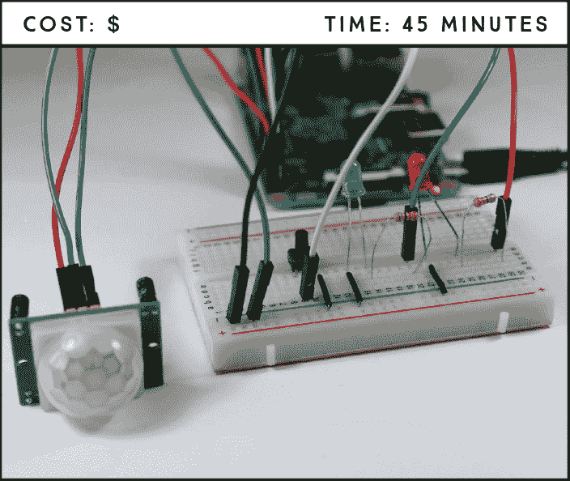
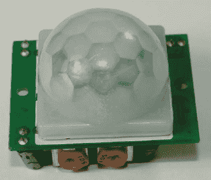
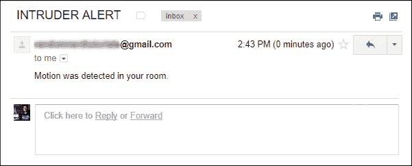
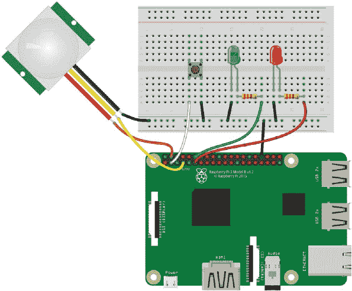

## 第十一章：带有电子邮件通知的入侵报警**

在这个项目中，你将创建一个入侵报警系统，该系统会向你发送电子邮件通知。该报警系统将通过一个被动红外（PIR）运动传感器来检测是否有人闯入禁区。当 PIR 运动传感器检测到运动时，它会发送一封警告邮件。



**所需部件**

树莓派

面包板

PIR 运动传感器 HC-SR501

两个 5mm LED（不同颜色）

两个 330Ω电阻

按钮

跳线

### 介绍 PIR 运动传感器

你可能已经在各种应用中看到过运动传感器。它们用于安防灯、商业楼宇的灯光（当你经过时自动亮起）以及防盗报警器中。

一个 PIR 运动传感器（见图 10-1）可以测量从其视野中的物体发射的红外光。它通过红外光的变化来检测运动，这些变化通常表示温度的变化。这使得它非常适合检测人类或动物，因为它可以捕捉到其范围内移动的生物，但不会检测到像风中吹动的叶子等无生命物体。你可以通过编程 Pi 来响应红外光的变化，触发事件，比如打开灯、发出警报，或者像我们在这个项目中做的那样，发送电子邮件。



**图 10-1：** PIR 运动传感器

该传感器在检测到运动时输出 HIGH，在未检测到时输出 LOW，并且它只有 3 个引脚：VCC、GND 和数据。数据输出一个 3.3V 的信号，非常适合你的 Pi！

### 使用 Python 发送电子邮件

Python 的电子邮件库使得通过 Python 发送电子邮件变得非常简单。我们将在组装部件之前先编写该脚本。

#### 查找你的 SMTP 服务器详情

要通过代码发送电子邮件，你需要包含你的*简单邮件传输协议（SMTP）*服务器的详情。SMTP 是电子邮件传输的互联网标准，每个电子邮件提供商有不同的 SMTP 服务器。

这些详情包括你的服务提供商的*服务器地址*、*端口*，以及它是否使用*传输层安全（TLS）*。TLS 是一种用于在两个电子邮件服务器之间建立安全连接的协议。要获取这些信息，只需在互联网上搜索*SMTP 服务器设置*，并加上你的电子邮件提供商的名称。你将把这些信息填入脚本中以进行个性化设置。

#### 发送电子邮件的脚本

**注意**

*不要将你的文件命名为*email.py*，因为这是一个 Python 库的名称，你的脚本将无法正常工作。*

打开**Python 3 (IDLE)**，然后转到**文件** ▸ **新建文件**以创建一个新的脚本。将清单 10-1 中的代码复制到 Python 编辑器中，并将脚本保存为*send_email.py*，保存在*Sensors*文件夹内（记得你可以在*[`www.nostarch.com/RaspberryPiProject/`](https://www.nostarch.com/RaspberryPiProject/)*下载所有脚本）：

**清单 10-1：** 电子邮件通知脚本

```
➊ import smtplib
  from email.mime.text import MIMEText

  #replace the next three lines with your credentials
➋ from_email_addr = '*YOUR_EMAIL@gmail.com*'
  from_email_password = '*YOUR_EMAIL_PASSWORD*'
  to_email_addr = '*TO_YOUR_OTHER_EMAIL@gmail.com*'

  #set your email message
➌ body = 'Motion was detected in your room.'
  msg = MIMEText(body)

  #set sender and recipient
  msg['From'] = from_email_addr
  msg['To'] = to_email_addr

  #set your email subject
  msg['Subject'] = 'INTRUDER ALERT'

  #connecting to server and sending email
  #edit the following line with your provider's SMTP server details
➍ server = smtplib.SMTP('*smtp.gmail.com*', *587*)
  #comment out the next line if your email provider doesn't use TLS
  server.starttls()
➎ server.login(from_email_addr, from_email_password)
  server.sendmail(from_email_addr, to_email_addr, msg.as_string())
  server.quit()
  print('Email sent')
```

**警告**

*如果你在没有延迟的情况下在`while`循环中使用第➎行的代码片段，系统将向你的收件箱发送数千封电子邮件，并且你的账户可能会被封禁，所以如果你在其他项目中使用此代码片段，务必确保添加延迟！*

你首先导入需要的 SMTP 和电子邮件相关功能的库：smtplib 和 MIMEText ➊。然后，你创建用于发送邮件的电子邮件地址、该电子邮件的密码以及接收邮件的地址的变量 ➋。我们建议你创建第二个电子邮件账户，以便将通知发送到你的常用电子邮件，因为你将允许较不安全的应用访问你发送邮件的账户。确保为这些字符串输入你自己的信息。

第➌行的代码块用于编写电子邮件。你首先创建一个名为`body`的变量，用来存储电子邮件的正文内容。然后，你创建一个名为`msg`的对象，通过`msg = MIMEText(body)`生成电子邮件本身。你可以通过更改`body`和`msg['Subject']`变量中的字符串，分别修改电子邮件的正文和主题。

在第➍行，你与 SMTP 服务器建立了通信。将提供商的 SMTP 服务器地址作为字符串传递给`smtplib.SMTP()`的第一个参数，将端口作为整数传递给第二个参数。在这个脚本中，我们使用的是 Gmail 的 SMTP 服务器和端口。如果你使用其他电子邮件提供商，确保更改这些值。

`server.starttls()`函数对于使用 TLS 加密邮件的电子邮件提供商是必需的。如果你的电子邮件提供商不使用 TLS，你可以删除或注释掉这一行代码。

接下来，脚本登录到发送电子邮件的账户第➎行，发送电子邮件，并停止与服务器的通信。最后，脚本会向 Python shell 打印`'Email sent'`消息，以告知用户电子邮件已发送。

#### 运行发送电子邮件的脚本

现在是时候看看你的脚本实际运行了！保存你的脚本并按**F5**或进入**运行** ▸ **运行模块**来运行脚本。然后检查你发送邮件的收件箱。你应该会收到一封新邮件。你可以在图 10-2 中看到我们通过此脚本收到的电子邮件。



**图 10-2：** 使用*send_email.py*发送的电子邮件

如果你没有收到电子邮件，检查*send_email.py*中的电子邮件和 SMTP 信息是否正确。同时，确保你已经在电子邮件帐户设置中允许较不安全的应用访问你的账户。

### 连接电路

现在让我们将 PIR 传感器连接到你的树莓派，这样当传感器检测到运动时，它就可以发送电子邮件给你。你还将把两个 LED 集成到系统中，一个用于指示报警是否启动，另一个用于指示报警是否触发，同时还需要一个按钮来启动和停止传感器。

按照以下步骤建立入侵报警电路，参考图 10-3 进行连接。



**图 10-3：** 入侵报警电路

1.  将树莓派的 GND 连接到面包板的其中一条蓝色轨道。

1.  在面包板上插入红色 LED 和绿色 LED。将绿色 LED 的正极引脚通过 330 Ω电阻连接到 GPIO 18，电阻位于 LED 引脚和 GPIO 引脚之间，并将负极引脚连接到 GND 轨道。将红色 LED 的正极引脚通过另一个 330 Ω电阻连接到 GPIO 17，并将负极引脚连接到 GND 轨道。

1.  将按钮插入面包板中间，使其跨接在中心断开处，如图 10-3 所示。将右下角的引脚连接到 GND 轨道，左下角的引脚连接到 GPIO 2。

1.  按照下表中的连接方式连接 PIR 运动传感器。

| **PIR 运动传感器** | **树莓派** |
| --- | --- |
| GND | GND |
| OUT | GPIO 4 |
| VCC | 5 V |

### 编写脚本

打开**Python 3 (IDLE)**，然后转到**文件** ▸ **新建文件**，创建一个新的脚本。将清单 10-2 中的代码输入到新文件中，并将脚本保存在*Sensors*文件夹内，命名为*intruder_alarm.py*（记得你可以下载所有脚本，地址是*[`www.nostarch.com/RaspberryPiProject/`](https://www.nostarch.com/RaspberryPiProject/)*）：

**清单 10-2：** 入侵警报脚本

```
  #import necessary libraries
➊ from gpiozero import LED, Button, MotionSensor
  import smtplib
  from email.mime.text import MIMEText
  from signal import pause

  #create objects to refer to each LED, the button, and the PIR sensor
➋ led_status = LED(17)
  led_triggered = LED(18)
  button = Button(2)
  pir = MotionSensor(4)

  #control variables
➌ motion_sensor_status = False
  email_sent = False

  #arm or disarm the PIR sensor
➍ def arm_motion_sensor():
      global email_sent
      global motion_sensor_status
      if motion_sensor_status == True:
          motion_sensor_status = False
          led_status.off()
          led_triggered.off()
      else:
          motion_sensor_status = True
          email_sent = False
          led_status.on()

  #send email when motion is detected and the PIR sensor is armed
➎ def send_email():
      global email_sent
      global motion_sensor_status
      if(motion_sensor_status == True and email_sent == False):

          #replace the next three lines with your credentials
          from_email_addr = '*YOUR_EMAIL@gmail.com*'
          from_email_password = '*YOUR_EMAIL_PASSWORD*'
          to_email_addr = '*TO_YOUR_OTHER_EMAIL@gmail.com*'

         #set your email message
          body = 'Motion was detected in your room.'
          msg = MIMEText(body)

          #set sender and recipient
          msg['From'] = from_email_addr
          msg['To'] = to_email_addr

          #set your email subject
          msg['Subject'] = 'INTRUDER ALERT'

          #connect to server and send email
          #edit this line with your provider's SMTP server details
          server = smtplib.SMTP('*smtp.gmail.com*', *587*)
          #comment out this line if your provider doesn't use TLS
          server.starttls()
          server.login(from_email_addr, from_email_password)
          server.sendmail(from_email_addr, to_email_addr,
  msg.as_string())
          server.quit()
          email_sent = True
          led_triggered.on()
          print('Email sent')

  #assign a function that runs when the button is pressed
➏ button.when_pressed = arm_motion_sensor
  #assign a function that runs when motion is detected
➐ pir.when_motion = send_email

➑ pause()
```

这段代码非常直接，应该对你来说很熟悉，来自清单 10-1。首先导入所需的库 ➊，并创建`gpiozero`对象来引用 LED、按钮和运动传感器 ➋。在 ➌，你创建了`motion_sensor_status`和`email_sent`控制变量，用于标识运动传感器是否被触发，以及电子邮件是否已发送。然后你创建了`arm_motion_sensor()`函数，通过按下按钮来启动和停止运动传感器 ➍。在 ➎，`send_email()`函数在传感器检测到运动时发送电子邮件，只要传感器被激活并且`email_sent`变量等于`False`。

最后，你将函数分配给事件：当按钮被按下时，调用`arm_motion_sensor()`函数 ➏，当检测到运动时，调用`send_email()`函数 ➐。代码末尾的`pause()`函数让脚本持续运行，以便能够检测事件 ➑。

请注意，`send_email()`函数中有一个`if`语句条件，只有当检测到运动并且`email_sent`变量等于`False`时，脚本才会发送电子邮件。发送电子邮件后，`email_sent`变量会变为`True`，脚本将不再发送更多邮件。你可以通过按下按钮两次将`email_sent`变量重新设置为`False`，从而重新启动警报。

这个条件可以防止脚本发送大量不必要的电子邮件。例如，假设你外出时将狗留在家中，它触发了传感器；有了这个条件，你只会收到一封电子邮件，告知检测到运动。如果没有这个条件，你将收到无尽的邮件，直到你的狗移出了传感器范围。

按下**F5**或前往**运行** ▸ **运行模块**来运行脚本。通过按下按钮来激活传感器；红色状态 LED 应该会亮起。通过在运动传感器前移动手来测试警报。你应该会收到一封新邮件，触发的绿色 LED 应亮起。

将这个电路放置在一个战略位置，等待看看是否有人在你不在时进入你的房间。

### 进一步探讨

本项目向你展示了如何使用 PIR 运动传感器与树莓派配合使用，以及如何使用 Python 发送电子邮件。这些是你可以将其他项目中学到的技能添加到自己的创意中的实用技能。以下是一些可以使用运动传感器构建的简单项目想法：

+   在你的报警电路中添加一个压电蜂鸣器，这样当检测到运动时，不仅会发送电子邮件，还会响起警报。

+   自动化你的房间灯光，使其在你进入时自动打开。你可能需要一个继电器来实现这一点——请查看项目 16，我们在其中解释了如何使用继电器。

+   使用继电器和光敏电阻制作一个安全夜灯，只有在黑暗中检测到运动时才会亮起。
