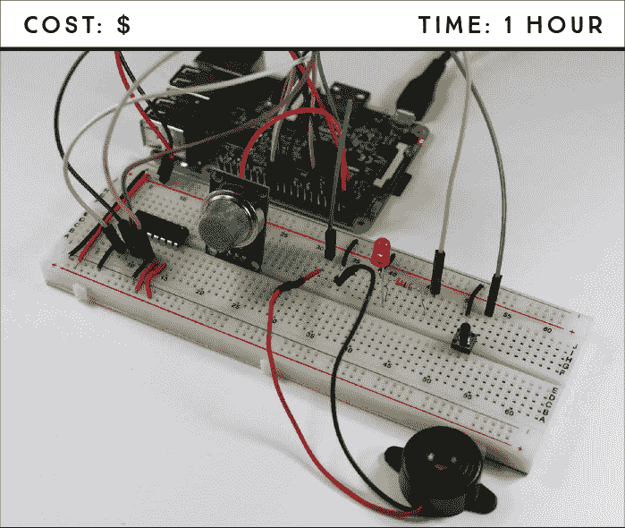
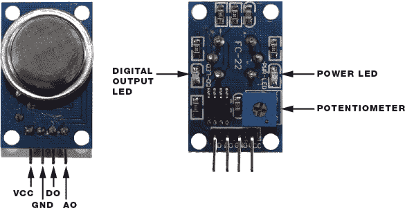
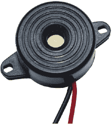
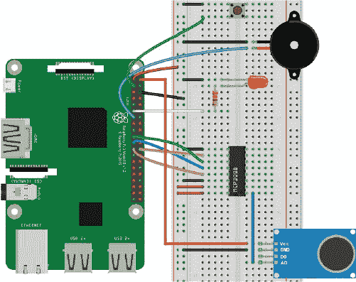

## 第十二章：气体和烟雾报警器**

在这个项目中，你将使用 MQ-2 气体和烟雾传感器以及压电蜂鸣器来构建一个气体和烟雾报警器。每当传感器检测到气体或烟雾浓度超过某个阈值时，蜂鸣器就会发出声音。



**所需组件**

树莓派

面包板

MQ-2 气体和烟雾传感器

MCP 3008 芯片

压电蜂鸣器

5 毫米 LED

330 Ω 电阻

按钮

打火机

跳线

### 介绍 MQ-2 气体和烟雾传感器

MQ-2 气体和烟雾传感器对烟雾以及以下可燃气体敏感：丙烷、丁烷、甲烷、酒精和氢气。图 11-1 显示了传感器的正面和背面视图。



**图 11-1：** MQ-2 气体和烟雾传感器，正面和背面视图

MQ-2 有两种输出气体浓度的方式。第一种是读取大气中的气体浓度，并通过模拟输出引脚 AO 输出模拟信号，气体浓度越高，输出电压越高。

第二步是设置一个特定的阈值，然后当气体浓度超过该阈值时，从数字输出引脚 DO 输出一个高电平信号，而当气体浓度低于该阈值时输出一个低电平信号。MQ-2 传感器背面内置了一个电位器，你可以用螺丝刀调整它来改变该阈值。

传感器背面还有一个电源 LED，用来指示传感器是否开启，并且当检测到的气体浓度超过设定阈值时，数字输出 LED 会亮起。

你将读取模拟信号，这些信号提供了气体浓度的定量测量，使你能够更好地定义一个阈值，超过该阈值时，蜂鸣器会警告你气体浓度过高。请记住，Pi 只能读取数字信号，因此，为了用 Pi 读取模拟信号，你需要使用一个模拟到数字转换模块（MCP3008 芯片），它首次在项目 3 中引入。

### 介绍压电蜂鸣器

当接收到来自 Pi 的数字信号时，压电蜂鸣器会发出警报。你将使用的蜂鸣器，见 图 11-2，是最简单的一种。



**图 11-2：** 压电蜂鸣器

蜂鸣器的外壳包含一个在施加电压时会以特定频率振动的圆盘。接线压电蜂鸣器很简单。你只需要将一根线连接到 Pi 的 GND 引脚，另一根线连接到 GPIO 引脚。

### 连接电路

为了构建烟雾和气体检测报警电路，你需要将一个 LED 和一个按钮连接到 Pi；你应该已经知道如何接线，参考之前的项目。你还需要将压电蜂鸣器和 MQ-2 传感器连接到 Pi（后者将通过 MCP3008 芯片连接）。按照这些指示操作，参考 图 11-3。



**图 11-3：** 烟雾和气体检测电路图

1.  将 GND 连接到蓝色面包板轨道，将 3.3 V 连接到红色轨道。

1.  将 MCP3008 芯片放置在面包板的中央，使其引脚分别平行于中央分隔线两侧，如 图 11-3 所示，并按照下表连接。

    | **MCP3008** | **连接到** |
    | --- | --- |
    | 1 | MQ-2 AO 引脚 |
    | 9 | GND |
    | 10 | GPIO 8 |
    | 11 | GPIO 10 |
    | 12 | GPIO 9 |
    | 13 | GPIO 11 |
    | 14 | GND |
    | 15 | 3.3 V |
    | 16 | 3.3 V |

    请记住，当 MCP3008 上半圆朝上时，引脚 1 是左侧顶部的引脚；请参阅 《模拟到数字转换器》 中的 第 55 页，以查看完整的 MCP3008 引脚图。

1.  将 MQ-2 气体和烟雾传感器放置在面包板上，并按照指示连接。

    | **MQ-2 传感器** | **连接到** |
    | --- | --- |
    | VCC | 5 V |
    | GND | GND |
    | DO | 无连接 |
    | AO | MCP3008 引脚 1 |

1.  将 LED 插入面包板。通过一个 330 Ω 电阻将正极引脚连接到 GPIO 17，并将负极引脚连接到 GND 电源轨。

1.  将按钮插入面包板中央，确保两侧引脚分别位于中央分隔线两侧。将右下角的引脚连接到 GND 电源轨，左下角的引脚连接到 GPIO 2，确保这两个连接的引脚位于分隔线同一侧。

1.  将蜂鸣器插入面包板，并将黑色线连接到 GND，红色线连接到 GPIO 27。

在您的电路连接好后，是时候上传一些代码了。

### 编写脚本

打开 **Python 3（IDLE）**，并进入 **文件** ▸ **新建文件** 创建一个新脚本。将 清单 11-1 中的代码复制到 Python 编辑器中，并将脚本保存为 *smoke_detector.py*，保存在 *Sensors* 文件夹中。（请记得，您可以在 *[`www.nostarch.com/RaspberryPiProject/`](https://www.nostarch.com/RaspberryPiProject/)* 下载所有脚本）：

**清单 11-1：** 烟雾和气体探测脚本

```
  #import necessary libraries
➊ from gpiozero import LED, Button, Buzzer, MCP3008
  from time import sleep

➋ led = LED(17)
  button = Button(2)
  buzzer = Buzzer(27)
  gas_sensor = MCP3008(0)

➌ gas_sensor_status = False

➍ threshold = 0.1

➎ def arm_gas_sensor():
      global gas_sensor_status
      if gas_sensor_status == True:
          gas_sensor_status = False
          led.off()
      else:
          gas_sensor_status = True
          led.on()
➏ button.when_pressed = arm_gas_sensor

➐ while True:
➑     #print(gas_sensor.value)
      #check if the gas sensor is armed and
      #reached the threshold value
      if(gas_sensor_status == True and gas_sensor.value > threshold):
          buzzer.beep()
      else:
          buzzer.off()
      sleep(2)
```

首先，您从 gpiozero 库导入 `LED`、`Button`、`Buzzer` 和 `MCP3008` 类，以及从 time 库导入 `sleep` 函数 ➊；然后，您创建 `gpiozero` 对象来引用 LED、按钮、MCP3008（MQ-2 气体传感器）和蜂鸣器 ➋。接下来，您创建一个 `gas_sensor_status` 变量，用于指示烟雾传感器是否已启用 ➌；当该变量为 `True` 时，传感器已启用，为 `False` 时未启用。您需要设置一个 `threshold` 值，以便只有当气体浓度超过该阈值时蜂鸣器才会发出声音 ➍。我们稍后将讨论如何确定您的阈值。

`arm_gas_sensor()` 函数通过将 `gas_sensor_status` 变量中的值切换为当前值的相反值（无论是 `True` 还是 `False`），来启用或禁用传感器。当按下按钮时，您设置该函数调用以便手动启用或禁用传感器。您还设置了一个 LED 灯，当传感器被启用时它会点亮；这样您可以通过视觉识别传感器的状态。

最后一个代码块是一个`while`循环 ➐，它不断检查传感器是否已启动，以及气体水平是否超过阈值。如果传感器已启动且气体水平超过阈值，蜂鸣器会通过`buzzer.beep()`函数发出声音。最终的`buzzer.off()`函数会停止蜂鸣器。

#### 设置阈值

为了准确设置安全气体水平阈值，你需要先将传感器与环境进行校准。这意味着你需要测量没有气体存在时的气体水平，然后将阈值设置为稍微高于该值。首先，了解你所在环境中的气体水平通常是多少：

1.  取消注释➑处的那行代码，然后保存并运行脚本。

1.  你应该看到 Python shell 中显示的`gas_sensor`值。这些值是在传感器范围内没有气体或烟雾时读取的。你的`threshold`值应该略高于此值。例如，如果默认值为`0.07`，我们建议将阈值设置为`0.1`，但具体取决于你想要的灵敏度级别。

1.  拿起打火机并按下触发器（不要点燃打火机）。将打火机靠近传感器释放一些气体。Python shell 中显示的`gas_sensor`值应当增加。你的`threshold`值应该低于你在将传感器暴露于气体时获得的最大值。

    **警告**

    *使用打火机和气体时务必小心；不要长时间按住气体触发器，也不要在气体已释放到空气中时点燃打火机。*

1.  利用从前两步获得的值，调整`threshold`值➍到这两个值之间，以确保它既不太灵敏也不太迟钝。

1.  注释掉➑处的`print`语句并保存脚本。

#### 运行脚本

按**F5**或转到**运行** ▸ **运行模块**来运行脚本。按下按键以启动传感器。红色 LED 灯应亮起。然后通过使用打火机释放一些气体到传感器旁边，直到蜂鸣器发出声音为止。

**警告**

*此气体和烟雾报警器不能替代市售的烟雾探测器。*

恭喜！你现在拥有一个气体和烟雾探测报警器，可以监控你的房屋并警告你火灾！

### 进一步拓展

本项目的目的是展示如何读取输出模拟信号的传感器。现在你可以为这个项目增加新功能。例如，你可以编辑脚本，当气体或烟雾超过阈值时发送电子邮件，就像我们在第 10 项目中所做的那样。
