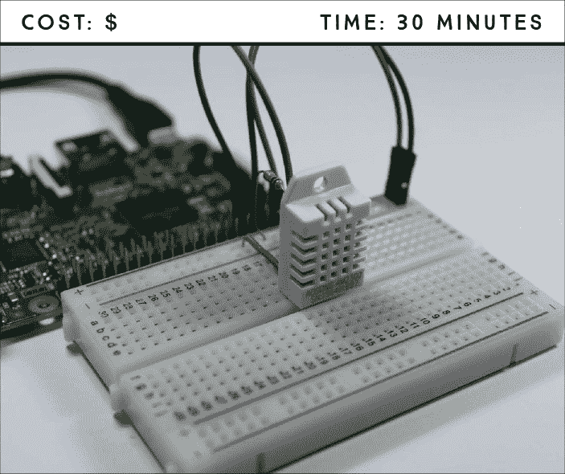
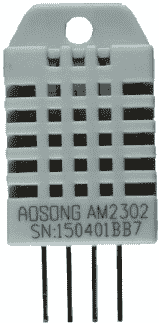
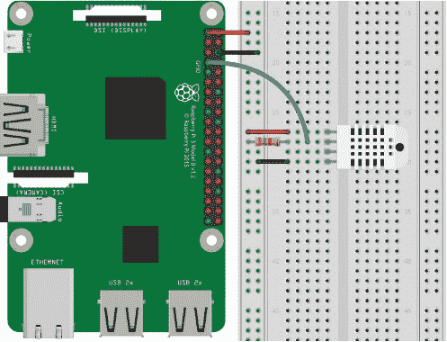

## 第十三章：温湿度数据记录器**

在这个项目中，你将构建一个自动存储温湿度数据的数据记录器。你将学习如何读取和记录环境数据，这在许多应用中都非常有用。



**所需零件**

树莓派

面包板

DHT22 温湿度传感器（DHT11 和 AM2302 也可以使用）

4.7 kΩ 电阻

跳线

**所需软件**

Adafruit_Python_DHT 库

你将使用 DHT22 温湿度传感器来收集数据，这些数据将被保存为一个 *.txt* 文件，之后你可以用它来构建图表、图形和其他可视化内容。这个项目为你提供了数据收集的基础知识，这在许多使用传感器的不同应用中都非常有用——例如，监测土壤湿度、测量鱼缸中水的温度，甚至记录家周围检测到意外移动的确切时间。你可以将这个项目中的概念应用于任何传感器。

### 介绍 DHT22 传感器

DHT22（如图 12-1 所示）是一个数字温湿度传感器，内置芯片将模拟信号转换为数字信号，因此无需使用模拟到数字转换器。这使得接线非常简单。



**图 12-1：** DHT22 温湿度传感器

### 接线电路

这是一个简单的电路，只有 DHT22 传感器通过电阻接入你的 Pi。按照这些指示操作，并以图 12-2 中的电路图为参考。

1.  将 GND 和 3.3 V 分别连接到树莓派和面包板的蓝色和红色电源轨。

1.  根据以下表格连接 DHT22 传感器，当传感器面对你时，针脚从左到右编号为 1。确保将电阻接在传感器的第 2 针和面包板的红色电源轨之间。

| **DHT22** | **树莓派** |
| --- | --- |
| 1 | 3.3 V |
| 2 | GPIO 4；也通过一个 4.7 kΩ 电阻连接到 3.3 V |
| 3 | 不连接 |
| 4 | GND |



**图 12-2：** 将 DHT22 传感器接入 Pi

### 编写脚本

你将使用 Adafruit_Python_DHT 库，它使你可以轻松控制 DHT22 传感器并读取数据。

#### 安装 DHT22 库

如果你使用的是类似的传感器，如 DHT11 和 AM2302（Adafruit 版本的 DHT22 有线版本），则该库也可以使用。

打开终端并输入以下命令：

```
pi@raspberrypi:~ $ sudo apt update
pi@raspberrypi:~ $ sudo apt install build-essential python-dev
```

在终端中，导航到桌面，如果还没有的话，创建一个名为 *Libraries* 的文件夹，并进入新创建的文件夹，方法如下：

```
pi@raspberrypi:~ $ cd ~/Desktop
pi@raspberrypi:~/Desktop $ mkdir Libraries
pi@raspberrypi:~/Desktop $ cd Libraries
pi@raspberrypi:~/Desktop/Libraries $
```

克隆该库，输入以下命令：

```
pi@raspberrypi:~/Desktop/Libraries $ git clone https://github.com/
adafruit/Adafruit_Python_DHT.git
```

最后，进入 *Adafruit_Python_DHT* 目录并使用以下命令安装该库：

```
pi@raspberrypi:~/Desktop/Libraries $ cd Adafruit_Python_DHT
pi@raspberrypi:~/Desktop/Libraries/Adafruit_Python_DHT $ sudo python
setup.py install
```

安装好必要的库后，就可以开始编写脚本了。

#### 输入脚本

DHT22 库不支持 Python 3，因此你需要使用 Python 2.7。打开 **Python 2.7 (IDLE)** 并选择 **File** ▸ **New File** 来创建一个新脚本。将 清单 12-1 中的代码复制到 Python 编辑器中，并将脚本保存为 *temperature_humidity_data_logger.py*，保存在 *Sensors* 文件夹中（记住你可以从 *[`www.nostarch.com/RaspberryPiProject/`](https://www.nostarch.com/RaspberryPiProject/)* 下载所有脚本）：

**清单 12-1：** 温湿度数据记录脚本

```
  #import necessary libraries
➊ import Adafruit_DHT
  import time

  #comment and uncomment the lines below depending on your sensor
  #sensor = Adafruit_DHT.DHT11
➋ sensor = Adafruit_DHT.DHT22
  #sensor = Adafruit_DHT.AM2302

  #DHT pin connects to GPIO 4
  sensor_pin = 4

  #create a variable to control the while loop
  running = True

  #new .txt file created with header
➌ file = open('sensor_readings.txt', 'w')
➍ file.write('time and date, temperature, humidity\n')

  #loop forever
  while running:
      try:
          #read the humidity and temperature
       ➎ humidity, temperature = Adafruit_DHT.read_retry(sensor,
  sensor_pin)

          #uncomment the line below to convert to Fahrenheit
       ➏ #temperature = temperature * 9/5.0 + 32

          #sometimes you won't get a reading and
          #the results will be null
          #the next statement guarantees that
          #it only saves valid readings
       ➐ if humidity is not None and temperature is not None:
              #print temperature and humidity
              print('Temperature = ' + str(temperature) +
  ', Humidity = ' + str(humidity))
              #save time, date, temperature and humidity in .txt file
           ➑ file.write(time.strftime('%H:%M:%S %d/%m/%Y') + ', ' +
                  str(temperature) + ', ' + str(humidity) + '\n')
          else:
              print('Failed to get reading. Try again!')
          #wait 10s between each sensor reading
       ➒ time.sleep(10)
      #if KeyboardInterrupt triggered, stop loop and close .txt file
      except KeyboardInterrupt:
          print ('Program stopped')
          running = False
       ➓ file.close()
```

首先，你需要导入你刚刚安装的 Adafruit_DHT 库 ➊，以及内建的 time 库。然后，在 ➋ 处取消注释与你使用的传感器相对应的行。如果你使用的是 DHT22，就不需要更改任何内容。

➎ 处的代码读取温度和湿度，并将读数分别保存到 `temperature` 和 `humidity` 变量中。如果你希望温度以华氏度为单位，取消注释 ➏ 处的代码进行从摄氏度到华氏度的转换。

有时传感器无法读取数据并向树莓派发送 `null` 结果。位于 ➐ 的 `if` 语句确保只有在数据不为 `null` 时，树莓派才会保存数据。你还可以使用 `time.strftime("%H:%M:%S %d/%m/%Y")` 为每个读取加上时间戳——括号中的参数表示你希望时间和日期显示的格式：分别是小时、分钟、秒、日期、月份和年份。

这个脚本每 10 秒钟读取并记录一次温湿度，但你可以通过修改 ➒ 处的延时来更改这个时间。传感器能够每 2 秒钟读取一次数据，但速度不会更快。

#### 创建、写入和关闭 .txt 文件

DHT22 温湿度数据会自动保存到一个 *.txt* 文件中，你可以使用 `open()` 函数 ➌ 创建该文件，并将其存储在 `file` 变量中。该函数接受你想要给文件命名的参数，并且在此情况下，`'w'` 表示文件处于 *写入模式*，这意味着程序可以写入并更改该文件。写入模式会覆盖同名的现有文件。

**注意**

*每次运行代码时，它会覆盖掉之前在* sensor_readings.txt *文件中的内容。如果你不希望发生这种情况，可以修改 ➍ 处的文件名，每次运行脚本时创建一个新文件。*

`file.write()` 函数用于写入文件，并接受一个字符串作为参数。例如，在 ➍ 处使用 `file.write('time and date, temperature, humidity\n')`，你会把 “time and date, temperature, humidity” 写入文件。在 ➐ 处，你将传感器数据写入文件，在 ➑ 处添加时间戳。`\n` 告诉 Python 从下一行开始显示文本，这叫做 *换行*。

最后，`file.close()` 函数 ➓ 保存并关闭文件。

#### 运行脚本

按下**F5**或前往**运行** ▸ **运行模块**来运行脚本。让脚本运行几个小时以收集足够的数据，当你对数据记录的时长满意时，按下 CTRL-C 停止脚本。然后，你应该会在*传感器*文件夹中找到一个包含所有数据的*sensor_readings.txt*文件。

### 进一步探讨

在这个项目中，你学到了一个非常实用的概念：数据记录。现在你可以在其他监控项目中使用数据记录。以下是一些想法：

+   使用一个每次检测到运动时都会生成时间戳的 PIR 运动传感器。

+   使用 Sense HAT 构建一个气象站数据记录器。

+   寻找其他监控传感器应用程序——例如土壤湿度、降雨和光照传感器——来构建一个温室数据记录器。
