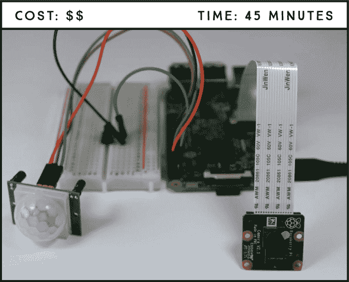
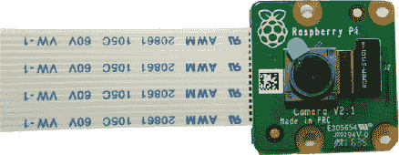
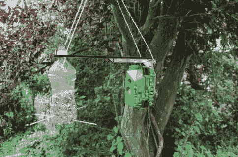
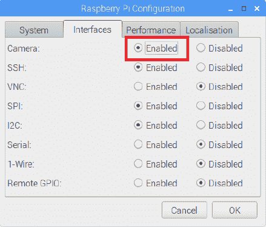
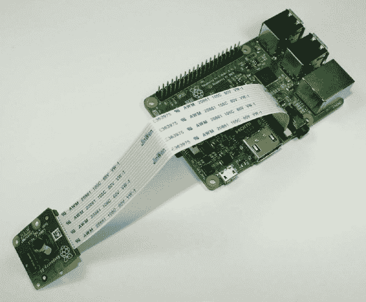
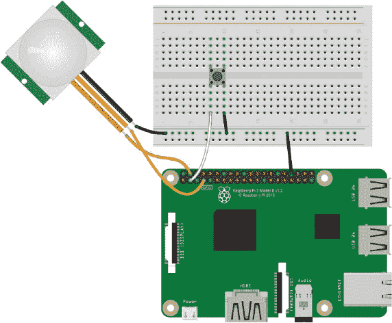
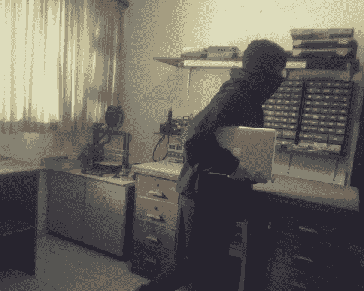

## 第十四章：**带有照片捕捉的防盗探测器**

本项目将教您如何使用树莓派相机模块 v2，该模块与 PIR 运动传感器一起工作，用来检测并拍摄闯入者。当运动传感器检测到运动时，它会触发拍照事件，让您知道在您不在家时是谁进入了您的家。



**所需部件**

树莓派

面包板

树莓派相机模块 v2

PIR 运动传感器 HC-SR501**

按钮

跳线

### 介绍树莓派相机模块 v2

如图 13-1 所示，树莓派相机模块 v2 配备了 8 百万像素的索尼 IMX219 图像传感器和固定焦距镜头。它支持 3280×2464 像素的静态图像，并支持 1080p 30 帧、720p 60 帧和 640×480 90 帧的视频分辨率——这些都意味着它是一个相当不错的相机，尤其是它的体积！在这个项目中，您只会使用它的静态图像功能。



**图 13-1：** 树莓派相机模块 v2

这款相机与所有树莓派型号（1、2、3 和 Zero）兼容，配有 15 厘米的排线，使其能够轻松连接到树莓派的 CSI 端口，该端口专为连接相机设计。如果您希望相机距离树莓派超过 15 厘米，您应该能够找到并购买更长的电缆。

树莓派相机模块 v2 是最受欢迎的树莓派附加组件之一，因为它为用户提供了以实惠的价格拍摄静态照片和录制全高清视频的方式。一个有趣的树莓派相机 v2 项目示例来自 Naturebytes 社区，该社区提供远程捕捉野生动物照片的套件。图 13-2 展示了这款野生动物相机的工作场景。



**图 13-2：** 配备 PIR 运动传感器的树莓派相机对准鸟食器

Naturebytes 套件还配备了一个 PIR 运动传感器，因此如果一只鸟停在图 13-2 中的喂食器上，它将触发相机拍摄鸟的照片。您将在这个项目的防盗探测器中使用相同的原理。

### 构建防盗探测器

防盗探测器由 PIR 运动传感器、按钮和您将连接到树莓派的相机模块组成。您将使用内置的 picamera 库，它使得控制相机变得非常简单。

#### 启用相机

在使用相机模块之前，您需要启用树莓派的相机软件。在桌面环境中，进入主菜单，选择**首选项** ▸ **树莓派配置**。您应该能看到类似于图 13-3 的窗口。



**图 13-3：** 启用相机软件

在相机行中选择**启用**，然后点击**确定**，就可以开始使用了。

#### 连接相机

启用相机软件后，关闭你的 Pi，然后将相机连接到 CSI 端口。确保相机连接时，蓝色字母朝上，且按照 图 13-4 中的方式对齐。然后再次启动你的 Pi。



**图 13-4：** 将树莓派相机连接到 CSI 端口

### 电路连接

**注意**

*移动相机时要小心。排线非常脆弱，如果它接触到 GPIO，可能会永久性损坏相机。尽量使用一些模型粘土或粘性物质来固定相机。*

连接相机后，按照这些说明连接其余的电路，参考 图 13-5。

1.  将 GND 引脚连接到面包板的 GND 导轨。

1.  将一个按钮插入面包板，使其横跨中心分隔。将一条引线连接到 GND，另一条引线连接到按钮同一侧的 GPIO 2。

1.  按照下表所示连接 PIR 动作传感器。

    | **PIR 动作传感器** | **树莓派** |
    | --- | --- |
    | GND | GND |
    | OUT | GPIO 4 |
    | VCC | 5 V |



**图 13-5：** 入室盗窃探测器电路

### 编写脚本

要控制相机，你将使用内置的 picamera 库。这是一个非常简单的库，因此这个脚本将非常容易。下面是代码应该完成的任务概述：

1.  初始化相机。

1.  当 PIR 动作传感器检测到运动时，拍摄照片。

1.  将照片保存在 *Desktop* 文件夹中。

1.  为照片命名时使用递增的方式，以便知道它们拍摄的顺序——例如 *image_1.jpg*、*image_2.jpg*，依此类推。

1.  当按下按钮时停止相机。如果不包含这个功能，你将无法退出在屏幕上弹出的相机预览。

#### 进入脚本

进入你的 *Projects* 文件夹，创建一个名为 *Cameras* 的新文件夹。然后打开 **Python 3 (IDLE)**，选择 **文件** ▸ **新建**，创建一个名为 *burglar_detector.py* 的新脚本，并将以下代码复制进去（记得你可以在 *[`www.nostarch.com/RaspberryPiProject/`](https://www.nostarch.com/RaspberryPiProject/)* 下载所有脚本）。

**注意**

*你不能将任何文件命名为* picamera.py *，因为 picamera 是一个 Python 库的名称，不能使用。*

```
  #import the necessary libraries
➊ from gpiozero import Button, MotionSensor
  from picamera import PiCamera
  from time import sleep
  from signal import pause

  #create objects that refer to a button,
  #a motion, sensor, and the PiCamera
➋ button = Button(2)
  pir = MotionSensor(4)
  camera = PiCamera()

  #start the camera
  camera.rotation = 180
➌ camera.start_preview()

  #create image names
➍ i = 0

  #stop the camera when the pushbutton is pressed
➎ def stop_camera():
      camera.stop_preview()
      #exit the program
      exit()

  #take a photo when motion is detected
➏ def take_photo():
      global i
      i = i + 1
      camera.capture('/home/pi/Desktop/image_%s.jpg' % i)
      print('A photo has been taken')
➐    sleep(10)

  #assign a function that runs when the button is pressed
➑ button.when_pressed = stop_camera
  #assign a function that runs when motion is detected
➒ pir.when_motion = take_photo

  pause()
```

首先导入所需的库 ➊；如我们所述，程序使用 picamera 库来控制相机。你应该对所有其他在此项目中使用的模块都很熟悉。然后，你创建对象来引用按钮、PIR 动作传感器和相机 ➋，并使用 `camera.start_preview()` 初始化相机 ➌。根据相机的方向，你可能还需要用 `camera.rotation = 180` 将其旋转 180 度，这样拍摄的照片才不会是倒置的。如果你测试这段代码时照片倒过来，回过头来将旋转设置为 `0` 或注释掉这一行。

接下来，你初始化一个从`0`开始的`i`变量 ➍。定义在➏处的`take_photo()`函数将使用这个变量来计数并编号图像，每拍一张照片，文件名中的数字会递增。

接着，你定义了`stop_camera()`函数，该函数使用`camera.stop_preview()`方法停止相机 ➎。在➏处，你定义了我们刚才提到的`take_photo()`函数，它用于拍照。在这个函数中，你使用了`camera.capture()`方法，并在括号内指定了你想要保存图像的目录。在此示例中，我们将图像保存到*Desktop*文件夹，并将图像命名为`image_%s.jpg`，其中`%s`会被先前在`i`中递增的数字替代。如果你想将文件保存到其他文件夹，只需将该目录替换为你选择的文件夹路径。

然后，你设置一个 10 秒的延迟 ➐，这意味着在 PIR 传感器检测到运动时，相机会以 10 秒的间隔拍摄照片。你可以随意增加或减少延迟时间，但要小心不要通过将延迟时间设置得太小，从而让 Pi 负担过重，生成大量图像。

在➑处，你定义了一个行为，当按下按钮时触发`stop_camera()`函数。此函数停止相机预览并退出程序。`exit()`函数会弹出一个窗口，询问你是否要关闭程序；只需点击**OK**即可关闭。最后，当检测到运动时，你通过触发`take_photo()`函数来让相机拍照 ➒。

#### 运行脚本

按下**F5**键或前往**运行** ▸ **运行模块**来运行脚本。当脚本运行时，你应该能在屏幕上看到相机所看到的预览画面。要关闭相机预览，按下按钮并在弹出的窗口中点击**OK**。

恭喜！你的防盗探测器已准备好捕捉小偷了。将防盗探测器放置在一个战略位置，稍后回来查看保存的照片。图 13-6 展示了一张由我们的防盗探测器拍摄的照片，捕捉到了有人从我们的实验室偷电脑。



**图 13-6：** 防盗探测器拍摄的照片

### 更进一步

正如你所见，带有相机的项目非常有趣！这里有一个改进你的安全系统的想法：重新设计你的项目，使得当传感器检测到运动时，Raspberry Pi 不仅拍照，还会给你发送电子邮件通知，并发出警报。你应该已经掌握了如何使用从项目 9 到 12 中学到的技能来完成这些操作。
