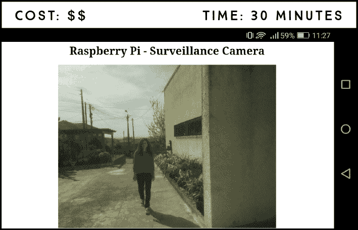
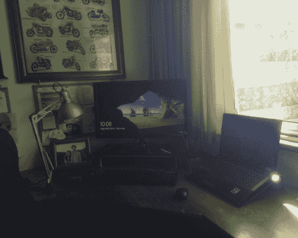
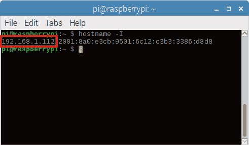

## 第十五章：家庭监控摄像头**

在这个项目中，你将创建一个家庭监控摄像头系统，将实时视频流传输到一个网页，你可以通过任何连接到与你的树莓派相同网络的设备来访问。这意味着你可以在不离开沙发的情况下监控你家里的任何地方！



**所需组件**

树莓派

树莓派摄像头模块 v2

在这个项目中，你需要将摄像头连接到树莓派，正如我们在“连接摄像头”一节中在第 165 页所展示的那样。如果你还没有启用软件摄像头，请返回项目 13，按照说明设置摄像头，然后再继续。

### 将视频录制到文件

在构建家庭监控摄像头系统之前，你需要学习如何将视频录制到文件中。

以项目 13 为参考，通过 CSI 端口将树莓派摄像头模块 v2 连接到你的树莓派。创建一个名为*record_file.py*的新脚本，使用**Python 3 (IDLE)**，将其保存在*Cameras*文件夹中，并输入列表 14-1 中的代码。

**列表 14-1：** 将视频录制到文件

```
➊ import picamera

➋ camera = picamera.PiCamera()

➌ camera.resolution = (640, 480)
➍ camera.start_recording('videotest.h264')
➎ camera.wait_recording(60)
➏ camera.stop_recording()

  print('Finished recording')
```

像往常一样，你首先导入 picamera 库来控制摄像头 ➊。你创建一个名为`camera`的对象来引用摄像头 ➋，然后将摄像头分辨率设置为 640×480 ➌。摄像头分辨率是可配置的；视频录制的最大分辨率为 1920×1080，最小分辨率为 64×64。为了启用最大分辨率，你还需要通过添加代码行`camera.framerate = 15`来设置帧率为 15。你现在可以尝试用不同的分辨率测试这个脚本，看看哪种最适合你，或者你也可以先使用我们设置的分辨率，稍后再进行调整。

然后，摄像头开始录制一个名为*videotest.h264*的视频文件 ➍。你可以自由更改文件名，但应保持扩展名为*.h264*，这是视频文件的格式。然后，你指定摄像头应录制的时间 ➎。在这个例子中，摄像头录制了 60 秒。`wait_recording()`方法还会反复检查错误，比如磁盘空间不足以继续录制。

最后，你停止视频录制 ➏，并打印一条消息，表示录制已完成。按下**F5**或点击**运行** ▸ **运行模块**来运行脚本。你的视频文件位于脚本所在的*Cameras*文件夹中。从终端输入以下命令来导航到视频文件夹并查看：

```
pi@raspberrypi:~ $ cd ~/Desktop/Projects/Cameras
pi@raspberrypi:~/Desktop/Projects/Cameras $ omxplayer videotest.h264
```

这将打开一个新窗口，并以全屏方式播放整个视频。图 14-1 展示了我们的录制视频测试的截图。



**图 14-1：** 使用树莓派摄像头录制视频

### 编写脚本

现在是关键部分：你将构建一个托管在树莓派上的网页——也就是一个*Web 服务器*——它会进行实时视频流。（我们将在项目 15、16 和 17 中更详细地讲解 Web 服务器。）

这个项目的脚本比较复杂，所以我们不会逐行解释。以下是代码应该实现的功能概述：

1.  初始化一个 Web 服务器和树莓派摄像头。

1.  设置 Web 服务器，使其在树莓派 IP 地址的 8000 端口上显示一个可以用 HTML 自定义的网页。

1.  设置网页以包含摄像头的视频流。

1.  使 Web 服务器可以从任何连接到与你的树莓派同一网络的浏览器访问。

#### 输入脚本

打开**Python 3 (IDLE)**，然后转到**文件** ▸ **新建**以创建一个新脚本。输入清单 14-2 中的代码，并将其保存为*surveillance_system.py*，存放在*摄像头*文件夹中（请记住，你可以在*[[`www.nostarch.com/RaspberryPiProject/`](https://www.nostarch.com/RaspberryPiProject/)]*下载所有脚本）。

这个脚本基于*[[`picamera.readthedocs.io/en/latest/recipes2.html`](http://picamera.readthedocs.io/en/latest/recipes2.html)]*中的网络流媒体示例。

**清单 14-2：** 将视频流传输到网页

```
  import io
  import picamera
  import logging
  import socketserver
  from threading import Condition
  from http import server

➊ PAGE="""\
  <html>
  <head>
  <title>Raspberry Pi - Surveillance Camera</title>
  </head>
  <body>
  <center><h1>Raspberry Pi - Surveillance Camera</h1></center>
  <center></center>
  </body>
  </html>
  """

  class StreamingOutput(object):
      def __init__(self):
          self.frame = None
          self.buffer = io.BytesIO()
          self.condition = Condition()

      def write(self, buf):
          if buf.startswith(b'\xff\xd8'):
              #new frame, copy the existing buffer's content and
              #notify all clients it's available
              self.buffer.truncate()
              with self.condition:
                  self.frame = self.buffer.getvalue()
                  self.condition.notify_all()
              self.buffer.seek(0)
          return self.buffer.write(buf)

  class StreamingHandler(server.BaseHTTPRequestHandler):
      def do_GET(self):
          if self.path == '/':
              self.send_response(301)
              self.send_header('Location', '/index.html')
              self.end_headers()
          elif self.path == '/index.html':
              content = PAGE.encode('utf-8')
              self.send_response(200)
              self.send_header('Content-Type', 'text/html')
              self.send_header('Content-Length', len(content))
              self.end_headers()
              self.wfile.write(content)
          elif self.path == '/stream.mjpg':
              self.send_response(200)
              self.send_header('Age', 0)
              self.send_header('Cache-Control', 'no-cache, private')
              self.send_header('Pragma', 'no-cache')
              self.send_header('Content-Type', 
  'multipart/x-mixed-replace; boundary=FRAME')
              self.end_headers()
              try:
                  while True:
                      with output.condition:
                          output.condition.wait()
                          frame = output.frame
                      self.wfile.write(b'--FRAME\r\n')
                      self.send_header('Content-Type', 'image/jpeg')
                      self.send_header('Content-Length', len(frame))
                      self.end_headers()
                      self.wfile.write(frame)
                      self.wfile.write(b'\r\n')
              except Exception as e:
                  logging.warning(
                      'Removed streaming client %s: %s',
                      self.client_address, str(e))
          else:
              self.send_error(404)
              self.end_headers()

  class StreamingServer(socketserver.ThreadingMixIn,
  server.HTTPServer):
      allow_reuse_address = True
      daemon_threads = True

➋ with picamera.PiCamera(resolution='640x480', framerate=24) as
  camera:
      output = StreamingOutput()
      camera.start_recording(output, format='mjpeg')
      try:
          address = ('', 8000)
          server = StreamingServer(address, StreamingHandler)
          server.serve_forever()
      finally:
          camera.stop_recording()
```

清单 14-2 比我们之前编写的脚本更复杂，解释每个类和功能，尤其是视频流所需的部分，超出了本书的范围，因此我们在这里不再详细讲解。

当然也有自定义的空间。你可以编辑网页的外观以及摄像头设置：

+   在➊步骤，你使用 HTML 定义网页内容；在这里你可以更改网页的标题和标题。有关 HTML 的更多信息，请查看项目 15，并学习如何使用 CSS 美化网页。

+   在➋步骤，你初始化了摄像头；在这里你可以改变摄像头的分辨率和帧率。

#### 运行脚本

按**F5**或转到**运行** ▸ **运行模块**来运行脚本。脚本运行后，你的摄像头将开始在网页上进行视频流。要访问此页面，你需要找到树莓派的 IP 地址，并输入 URL *http://<Pi IP 地址>:8000*，将*<Pi IP 地址>*替换为你的树莓派 IP 地址。

要查找树莓派的 IP 地址，打开终端并输入以下命令：

```
pi@raspberrypi:~ $ hostname -I
```

这将打印树莓派的 IP 地址，如图 14-2 中所示。



**图 14-2：** 查找你的树莓派 IP 地址

恭喜你——你已经建立了自己的家庭监控系统！你可以通过连接到本地网络的电脑、智能手机或平板浏览器访问视频流。在这个例子中，由于我们的 IP 地址是 192.168.1.112，我们输入*http://192.168.1.112:8000*。确保使用你自己的 IP 地址。

### 进一步探索

在这个项目中，你学会了如何录制视频以及如何搭建一个流媒体视频服务器。你可以将这里学到的内容与其他项目结合，进一步增强它们。例如：

+   编辑项目 13，使得树莓派在检测到屋内有动作时，会在你外出时录制视频，且录制时间为指定时长。

+   使用在项目 15 中学到的技巧，利用 CSS 自定义流媒体网页。
