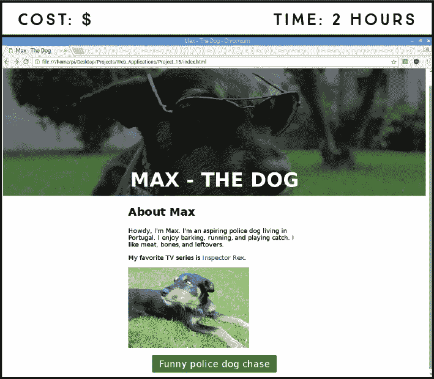
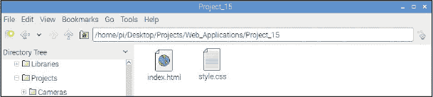
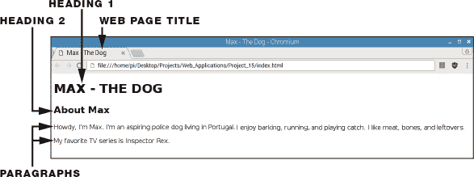
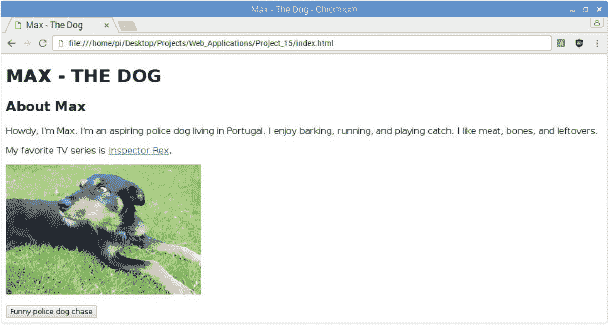
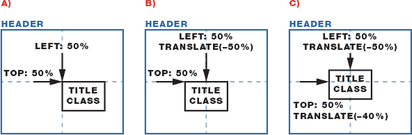

## 第十六章：创建你的第一个网站

在这个项目中，你将构建一个简单的网站，包含标题、段落、图片、链接和按钮。你将使用 HTML 来创建页面，并使用 CSS 来根据你的需求对其进行样式设计。你在这里学到的技能可以用来构建任何你想要的网站。



**所需组件**

树莓派

### 设置项目文件

对于这个项目，你不需要任何电路；一切都在你的树莓派桌面计算机上完成。你将使用文本编辑器程序创建 HTML 和 CSS 文件。要访问文本编辑器，从桌面的主菜单中选择 **附件** ▸ **文本编辑器**。

这个项目需要多个文件，因此建议你为此项目创建一个专门的文件夹。在你的 *Projects* 目录中创建一个名为 *Web_Applications* 的新文件夹，然后创建一个名为 *Project_15* 的项目文件夹。

打开文本编辑器后，使用 CTRL-N 创建两个空白文件；你需要为每个文件执行此操作一次。然后，将这些文件保存在 *Project_15* 文件夹中，并命名为 *index.html* 和 *style.css*，如图 15-1 所示。你可以从 *[`www.nostarch.com/RaspberryPiProject/`](https://www.nostarch.com/RaspberryPiProject/)* 下载脚本。



**图 15-1：** 创建 HTML 和 CSS 文件

### 设置 HTML 网页

*HTML*，即*超文本标记语言*，是用于创建网页的主要标记语言。网页浏览器设计用于读取 HTML *标签*，这些标签告诉浏览器如何在页面上显示内容。让我们来看一下标签是如何工作的。

#### 设置基本内容

以下代码片段展示了 HTML 文档的基本结构。使用文本编辑器打开你的 *index.html* 文件，并输入清单 15-1 中的内容。

**清单 15-1：** HTML 网页的基本结构

```
  <!DOCTYPE html>
➊ <html>
➋ <head>
  </head>
➌ <body>
  </body>
  </html>
```

该文档只是一个 HTML 标签的列表，用 `< >` 符号括起来。任何 HTML 文档的第一行总是 `<!DOCTYPE html>`。这告诉网页浏览器该文档是一个 HTML 文件。

剩余的结构需要夹在 `<html>` ➊ 和 `</html>` 标签之间，前者表示网页的开始，后者表示网页的结束。注意，关闭标签必须在 `<` 符号后加上 `/`；这一规则适用于所有 HTML 的关闭标签。然而，并非所有 HTML 标签都需要关闭标签，如你稍后将看到的那样。

HTML 文档有两个主要部分：头部和主体。*头部*位于 `<head>` ➋ 和 `</head>` 标签之间，这是你插入关于 HTML 文档的非直接显示在页面上的数据的地方，比如显示在浏览器标签中的标题、脚本、样式等等。*主体*则位于 `<body>` ➌ 和 `</body>` 标签之间，包含页面的内容，例如标题、文本、图片、表格等等。

#### 添加标题、标题和段落

要查看网页的效果，打开任务栏菜单并启动 Chromium 浏览器，然后将*index.html*文件拖入 Chromium 浏览器。此时，你应该只看到一个空白页面，因为你还没有向 HTML 文件中添加任何内容。在这一节中，你将添加标题、标题和段落。

##### 使用标题标签

标题位于`<title>`和`</title>`标签之间，这些标签应该放在`<head>`和`</head>`标签之间。为你的文件添加一个标题，如下所示：

```
<head>
<title>Max - The Dog</title>
</head>
```

**注意**

*与其再次将文件拖入浏览器，不如在保存 HTML 后直接刷新网页；更改会立即更新。*

如果你保存了*index.html*并再次将文件拖入浏览器，不要惊讶于仍然看到空白页面。标题显示在网页浏览器的标签上，而不是页面本身。我们将网页命名为“Max – The Dog”，但你可以根据需要为网页命名。

##### 使用标题标签

你可以使用标题来构建网页上的文本。标题标签以`h`开头，后面跟着一个表示标题层级的数字。例如，`<h1>`和`</h1>`是一级标题的标签；`<h2>`和`</h2>`是二级标题的标签，以此类推，直到六级标题，它是标题的最低层级。标题标签应该放在`<body>`和`</body>`标签之间。现在创建几个标题并将它们放入文件的主体中：

```
<body>
  <h1>MAX - THE DOG</h1>
  <h2>About Max</h2>
</body>
```

我们已向页面添加了两个标题：“MAX – THE DOG”作为顶级标题，以及“About Max”作为次级标题。现在是时候在这些标题下添加一些文字了。

##### 使用段落标签

你应该将大部分可读内容放在段落中。每个段落都需要放在`<p>`和`</p>`标签之间。向你的文件中添加一两个段落，如下所示：

```
  <h2>About Max</h2>
  <p>Howdy, I'm Max. I'm an aspiring police dog living in Portugal.
I enjoy barking, running, and playing catch. I like meat, bones, and
leftovers.</p>
  <p>My favorite TV series is Inspector Rex.</p>
```

现在你有了自己的网页！随意添加更多段落和标题。

#### 查看你的网页

保存你的*index.html*文档并刷新网页。图 15-2 显示了 Max 的网页此时的样子。



**图 15-2：** 一个简单的 HTML 页面

如你所见，HTML 除了将原始文本添加到页面中外并没有做太多，它主要是一些段落，看起来并不漂亮。你将在后面的部分使用 CSS 来为页面细节添加样式，使页面更加美观。

#### 添加链接、图片和按钮

任何自尊的网页都不应该仅仅包含文字。我们将向你展示如何添加图片、按钮、更多页面以及指向其他页面的链接。

##### 包含超链接

要为另一个页面添加超链接，您可以在`<body>`和`</body>`标签之间的任何位置添加`<a>`标签。例如，您可以像这样插入指向《侦探犬雷克斯》维基百科页面的超链接：

```
<a href="https://en.wikipedia.org/wiki/Inspector_Rex">Inspector
Rex</a>
```

`a`代表*锚点*，这两个标签之间的文本被称为*锚文本*，在这种情况下是`Inspector Rex`。在`<a>`标签内，我们包含了`href`属性，它指定了链接应该指向的位置。锚文本是页面访问者在页面上看到的内容；当他们点击该文本时，Inspector Rex 的维基百科页面会打开。

大多数网站都有多个页面可以进行导航。页面之间的导航也是通过超链接完成的。例如，如果你想插入一个新页面——比如 Max 的照片画廊——你可以像这样链接到它：

```
<a href="gallery.html">Take a look at my gallery</a>
```

单独使用这个链接不会将你带到任何地方，因为它指向的页面尚未存在。你需要创建*gallery.html*文件并将其保存在与*index.html*文件相同的文件夹中。你在这个项目中不会创建另一个页面，但现在你知道如何操作了。

##### 包含图像

图像使任何网站更加吸引人。要插入图像，你需要使用``标签，该标签没有闭合标签，因为你在尖括号`<>`中列出你希望显示的图像。你要插入的图像文件必须保存在网站的文件夹中——在这种情况下是*Project_15*——才能显示在网页上。要插入名为*max.jpg*的图像，你可以使用以下代码：

```

```

`src`表示图像文件的位置。由于我们将图像存储在网站的文件夹中，我们可以直接使用图像文件名。在代码中将`max.jpg`替换为你自己的图像文件名。你也可以通过将`max.jpg`替换为超链接来使用指向图像的超链接。

你可以通过手动编辑图像文件或在``标签中使用`height`属性来调整图像的大小。例如，要将图像的高度调整为 350 像素，可以使用：

```

```

宽度会根据高度自动调整。你也可以使用`width`属性来更改宽度，而高度则会自动重新调整。

``标签必须放在`<p>`或`<div>`标签内——你可以使用`<div>`标签在页面内容内创建一个部分（请参见清单 15-2 中的示例）。

##### 包含按钮

要在页面上包含按钮，将你想要的按钮标签插入到`<button>`和`</button>`标签之间。我们想插入一个按钮，指向一个有趣的警犬追逐视频，所以我们使用：

```
<button>Funny police dog chase</button>
```

为了使按钮可点击并将你重定向到视频页面，将按钮标签插入到指向该视频的`<a>`超链接标签之间：

```
<a href="https://youtu.be/znM9YD2J3Cw"><button>Funny police dog
chase</button></a>
```

##### 查看 Max 的 HTML 文件

我们在 Max 的网页上添加了一个图像、一个链接和一个按钮。清单 15-2 中的代码显示了此时 HTML 文档的样子。

**清单 15-2：** Max 网页的 HTML 文档，包含一个链接、一个图像和一个按钮

```
  <!DOCTYPE html>
  <html>
  <head>
  <title>Max - The Dog</title>
  </head>
  <body>
➊ <header>
➋   <div class="title">
      <h1>MAX - THE DOG</h1>
➌   </div>
➍ </header>

➎ <main>
    <h2>About Max</h2>
    <p>Howdy, I'm Max. I'm an aspiring police dog living in Portugal.
  I enjoy barking, running, and playing catch. I like meat, bones, and
  leftovers.</p>
    <p>My favorite TV series is <a href="https://en.wikipedia.org/
  wiki/Inspector_Rex">Inspector Rex</a>.</p>
    <p></p>
    <a href="https://youtu.be/znM9YD2J3Cw"><button>Funny police dog
  chase</button></a>
➏ </main>
  </body>
  </html>
```

请注意，我们添加了三个新的标签：

+   `<header>` ➊ 和 `</header>` ➍ 包含介绍性内容。这些标签内是一级标题。

+   `<div class="title">` ➋ 和 `</div>` ➌ 定义了一个分区或部分。`class`属性叫做`title`，表示 HTML 元素是某个特定类的成员——在这种情况下，是`title`类，但你可以为它起任何名字。使用`class`属性很有用，因为它允许你为属于同一类的多个元素在 CSS 中定义相同的样式。

+   `<main>` ➎ 和 `</main>` ➏ 指定了文档的主要内容。这是你应该放置特定于文档的内容的地方——也就是说，内容不会在网站的其他地方重复。一个 HTML 文档中不应有多个`<main>`元素。

我们将 HTML 内容结构化成这样，是因为这样以后使用 CSS 来格式化页面会更容易。图 15-3 展示了 HTML 文件在列表 15-2 中的网页效果。



**图 15-3：** Max 的网页，包含一个链接、一张图片和一个按钮

### 用 CSS 为页面添加样式

现在你将添加*CSS*（层叠样式表），这是一种用于描述网页元素渲染时显示样式的语言。你可以将 CSS 直接添加到 HTML 文件中，或者在一个单独的文件中定义 CSS，并在 HTML 文件中引用它。在本项目中，你将为 CSS 文档创建一个单独的文件；这样，更容易同时阅读 CSS 和 HTML 文件并理解它们的作用。

#### 嵌入样式表

在进入 CSS 文档之前，你需要将样式表嵌入到*index.html*文件中，以便 HTML 知道要引用外部 CSS 文件。为此，请在`<head>`和`</head>`标签之间添加以下行：

```
<link rel="stylesheet" type="text/css" href="style.css">
```

这个`<link>`标签告诉 HTML 文件你正在使用外部样式表来格式化页面的显示方式。`rel`属性指定外部文件的性质，在这种情况下，它是一个样式表——CSS 文件——将用于改变页面的外观。`type`属性被设置为`"text/css"`，表示你使用的是 CSS 文件来定义样式。`href`属性指示文件的位置；由于文件在网站的文件夹中，因此你只需要引用文件名。

在添加了引用样式表的链接后，你的头部应当类似于列表 15-3 中的样子。

**列表 15-3：** 在 HTML 文档中链接到 CSS 样式表

```
<head>
    <title>Max - The Dog</title>
    <link rel="stylesheet" type="text/css" href="style.css">
</head>
```

通过这个额外的标签，样式表与 HTML 文档连接起来。创建单独的样式表是有用的，因为你可以通过一行代码将同一个样式表嵌入到多个网页中。

#### 为你的 HTML 内容添加样式

要为 HTML 内容添加样式，CSS 使用*选择器*来定义一组 CSS 规则适用的元素。它们具有*属性*，而属性又有*值*。代码将如下所示：

```
*selector* {
    *property*: *value*;
}
```

定义特定选择器样式的一组规则应该放在大括号`{}`之间。你通过冒号（`:`）为属性分配值，每个值后面应该以分号（`；`）结束。每个选择器可以有，并且通常会有，多个属性。

#### 样式化头部

如果你按照指示操作，你应该在*Project_15*文件夹中有一个*style.css*文件，并且有一个*index.html*文件。打开*style.css*文件，并通过输入列表 15-4 中的内容来编辑头部。

**列表 15-4：** 使用 CSS 样式化头部

```
  header {
➊   background: url(background.jpg);
➋   background-size: cover;
➌   height: 70vh;
  }
```

在这个列表中，`header`是选择器，这意味着你在大括号之间描述的样式规则将应用于网页的头部部分。记住，头部部分是位于`<header>`和`</header>`标签之间的内容，包括介绍性内容。在这里，我们插入了一张背景图片—Max 的美丽照片。为此，我们使用`background`属性，其值为`url(background.jpg)`➊；在`url()`内，你写出图像的路径目录。将`background.jpg`替换为你希望用作背景的图像名称。由于你将图像文件保存在与 HTML 和 CSS 文件相同的文件夹中，因此只需引用图像文件名。

将`cover`值分配给`background-size`属性➋。这表示背景图片应填充整个头部区域。

`height`属性的值为`70vh`➌，指定了头部的高度。你可以使用多种单位来指定高度，但我们使用的是`vh`（视口高度），它相对于视口高度的 1%的大小，确保头部元素可以适应视口。此指令意味着无论浏览器窗口的大小如何，头部将填充网页窗口的 70%。你可以尝试其他百分比值，看看页面的效果。

保存 CSS 文件，并刷新包含 HTML 文档的浏览器标签，以查看你新样式化的网页效果。

#### 样式化`title`类

现在，你将编辑`title`类，它包括位于`<div class="title">`和`</div>`标签之间的任何内容。这些标签位于`<header>`和`</header>`标签之间，这意味着`header`是`title`类的*祖先*。将列表 15-5 中的代码片段添加到你的 CSS 文件中。

**列表 15-5：** 样式化`title`类

```
  .title {
➊   position: absolute;
➋   top: 50%;
➌   left: 50%;
➍   transform: translate(-50%, -40%);
➎   color: white;
➏   text-align: center;
  }
```

要选择具有特定类的元素，使用一个点（`.`）后跟类名，如`.title`。我们将逐步引导你完成每个元素。

##### 调整位置

你可以使用`top`、`bottom`、`left`和`right`属性来定位元素，但首先需要设置`position`属性➊。

元素在页面上的定位方式会有所不同，具体取决于`position`值是否设置为`static`、`relative`、`fixed`或`absolute`。

**POSITION 属性**

`position`属性可以具有以下值：

静态

一个具有`static`值的元素是根据页面的正常流进行定位的，不受`top`、`bottom`、`left`和`right`属性的影响。默认情况下，HTML 元素是`static`。

相对定位

一个具有`relative`值的元素是相对于其默认位置进行定位的，使用`top`、`bottom`、`left`和`right`属性。

固定

一个具有`fixed`值的元素即使在页面滚动时也保持在相同位置。要在视口中定位元素，可以使用`top`、`bottom`、`left`和`right`属性。

绝对定位

一个具有`absolute`值的元素是相对于其最近的祖先元素进行定位的。要调整位置，可以使用`top`、`bottom`、`left`和`right`属性。

在这种情况下，我们使用的是`absolute`值。这意味着每个元素是相对于其最近的祖先元素进行定位的，在此情况下是头部部分。查看图 15-4 以理解`title`类元素如何相对于头部进行定位。



**图 15-4：** 在头部部分定位`title`类元素

`top` ➋和`left` ➌属性指定每个元素相对于其祖先元素的位置，以百分比表示，表示元素在页面上出现的水平位置，`0%`表示祖先元素的最左边和顶部边缘。`top`和`left`的`50%`值将`title`类部分的左上角移动到祖先元素的中心。这意味着`title`类部分的左上角，而不是它的中心点，将被定位到头部部分的中心；请查看图 15-4（A）。你可以使用`transform`属性进行调整。

`transform`属性 ➍，配合`translate(–50%, –40%)`值，移动元素的位置。`–50%`值将`title`类元素在水平方向上移动其大小的 50%，使其水平居中在头部部分—请查看图 15-4（B）。我们还将`–40%`应用于垂直位置，使其从底部向上移动 40%（见图 15-4（C））。试试不同的值，看看它是如何变化的。`–50%`和`–40%`对于 Max 的页面效果很好，但根据你的背景图片，你可能需要将文本移动到不同的位置。

##### 设置文本颜色和对齐

`color` ➎ 和 `text-align` ➏ 属性分别定义文本颜色和文本对齐方式。你可以通过名称设置颜色——HTML 支持基本的颜色名称——或者使用十六进制或 RGB 颜色代码。我们使用的是十六进制。你可以在网上搜索 *十六进制颜色选择器* 来参考特定颜色的十六进制值。`text-align` 属性可以取多个值，如 `left`、`right`、`center` 和 `justify`，分别用来将文本对齐到左侧、右侧、居中或两端对齐。

#### 样式化标题、段落和链接

列表 15-6 样式化标题、段落和链接。将这些样式添加到你的 CSS 文件中。

**列表 15-6：** 样式化标题、段落和超链接

```
  h1 {
➊   font-size: 4rem;
  }
  h2 {
    font-size: 2.5rem;
  }
  p {
    font-size: 1.3rem;
  }
➋ main {
    max-width: 500px;
    margin:0 auto;
  }
  a {
➌   text-decoration: none;
  }
```

要定义文本大小，使用 `font-size` 属性 ➊。定义字体大小有多种单位，但我们将使用 `rem` 单位。*Rem* 是根元素的 `font-size` 计算值——我们使用一个字体大小作为页面上的参考。这意味着所有字体大小都是相对的，从而减少了使用旧字体大小单位时出现的设备屏幕大小不同而导致的不规则问题。

当在根元素的 `font-size` 属性中使用时，rem 单位表示该属性的初始值。因此，1 rem 等于 HTML 元素的字体大小——在大多数浏览器中默认是 16 像素。

在 列表 15-6 中，我们为标题 1、标题 2 和段落分别定义了 `4`、`2.5` 和 `1.3` rem 的字体大小，以使每个标题级别逐渐比上一级小，最低级别略大于默认文本。

`main` 部分格式化页面的主要内容 ➋。我们将内容的最大宽度设置为 `500px`。定义元素的宽度可以防止元素拉伸到容器的边界；在这种情况下，它可以防止文本在网页浏览器窗口中水平扩展。然后，我们使用 `auto` 设置外边距，以便水平居中元素。

超链接默认是带下划线的。将 `text-decoration` 设置为 `none` ➌ 可以去除下划线。

#### 样式化按钮

要样式化按钮，请将 列表 15-7 中的样式复制到你的 *style.css* 文件中。

**列表 15-7：** 样式化按钮

```
button {
  display: block;
  margin: 0 auto;
  padding: 10px 20px;
  font-size: 1.7rem;
  border-radius: 4px;
  color: #fff;
  background-color: #009933;
  border: none;
}
```

将`display`设置为`block`可以确保按钮作为块级元素显示，就像段落一样；例如，按钮不会与文本元素在同一行上。我们使用`padding`属性在内容周围添加空间。我们为按钮的上下边距定义了`10px`的填充，为左右边距定义了`20px`的填充——这设置了按钮内容周围的空白区域。请注意，这里我们使用的是十六进制颜色代码来设置按钮文本和按钮背景颜色。其他按钮属性不言自明。可以通过调整这些属性，按自己的喜好样式化按钮。你还可以在网上搜索*button properties CSS*，了解更多属性和值。

保存你的*style.css*文件并刷新浏览器，查看你所做的更改。现在，你应该已经有了一个简单的网页，类似于本项目开始时展示的页面。

### 进一步拓展

这个项目只是一个如何使用 HTML 和 CSS 构建简单网页的快速介绍。你可以以无穷无尽的方式编辑和改进它。我们鼓励你尝试这里介绍的所有选项。如果需要灵感，你可以：

+   使用超链接将多个页面添加到主页面并相互连接。

+   创建一个网页，展示你的某个 Raspberry Pi 项目。

+   在网上搜索更多 CSS 属性和值，并编辑页面的显示效果。
