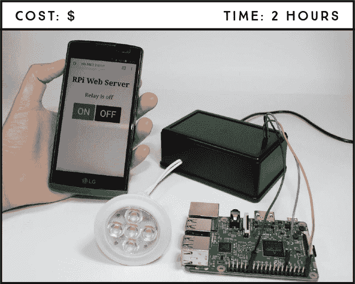
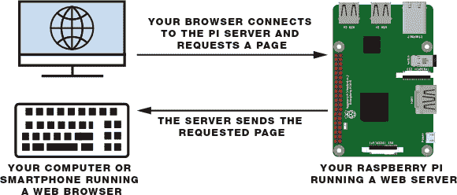
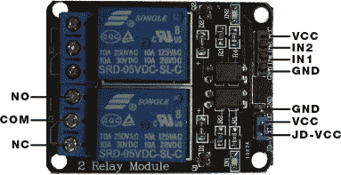
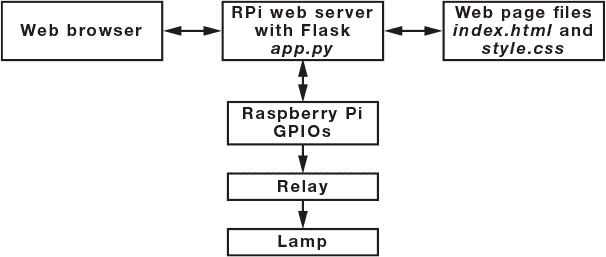
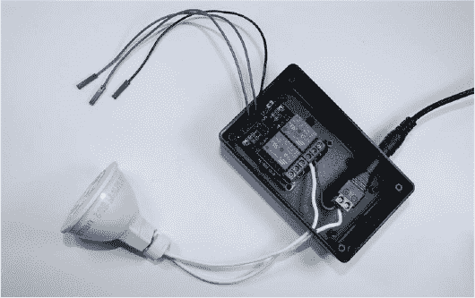
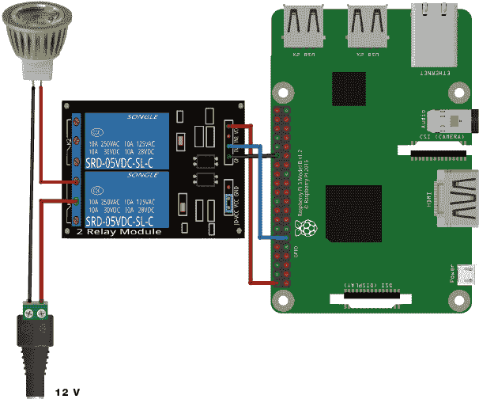
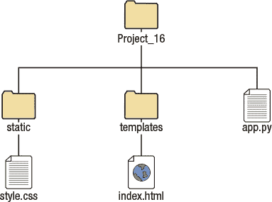
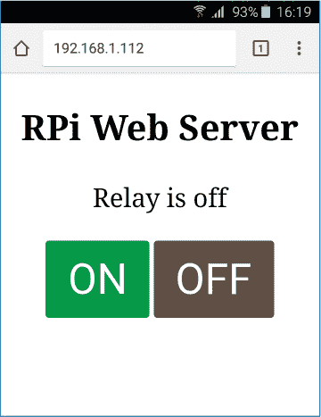

## 第十七章：将你的电子设备连接到互联网**

在这个项目中，你将创建自己的物联网 web 服务器，可以用它来通过手机远程控制灯。你将构建的简单 web 服务器之后可以添加到其他项目中，从而控制其他电子设备。



**所需零件**

树莓派

继电器模块 HL-52S

12 V 灯及其支架

12 V 电源适配器

公头 DC 条形电源插座

塑料盒外壳

跳线

**所需软件**

Flask 框架

在这个项目中，你将创建一个自己的 web 服务器，通过浏览器控制电子设备。你将使用动态网页和按钮来控制一个 12 V 灯。

### 介绍 web 服务器

web 服务器是一台提供网页的计算机。它存储网站的文件，包括所有的 HTML 文档及相关资源如图片、CSS 样式表、字体和视频。当用户请求服务器的 URL 时，它也将这些文件传送到用户设备的网页浏览器中。

当你在浏览器中访问一个网页时，实际上是在通过*超文本传输协议（HTTP）*向服务器发送请求。这仅仅是一个请求和返回互联网上信息的过程。服务器会通过 HTTP 将你请求的网页返回给你。

在这个项目中，你将使用树莓派在本地网络上托管 web 服务器，如图 16-1 所示。



**图 16-1：** 运行 web 服务器的树莓派

作为服务器，树莓派可以通过其 GPIO 引脚提供一些输出。换句话说，通过你本地网络上的浏览器，你可以访问树莓派的 web 服务器，远程控制 GPIO 引脚并打开某些设备。

web 服务器可以提供*静态*或*动态*内容。静态网站的内容除非你编辑 HTML 文件，否则不会改变。项目 15 中构建的网站就是一个静态网站的例子。动态网站则根据用户的交互来改变内容。在这个项目中，你将创建一个动态网站，来控制并显示连接到继电器的 12 V 灯的当前状态，稍后我们会更详细地讨论。

**注意**

*只有与树莓派连接到同一个路由器的设备，才能通过浏览器访问托管在树莓派上的网页。从*外部*访问你的 web 服务器更加困难。你可以通过使用一种叫做*路由器端口转发*的技术，让任何地方的计算机都能访问你的树莓派 web 服务器，但这个主题超出了本书的范围。*

### 介绍继电器模块

*继电器*是一种电控开关，可以开关，允许电流通过或不通过，并且可以用低电压（例如树莓派提供的 3.3 V）来控制。你将在这个项目中使用的继电器模块有两个继电器——即图 16-2 中显示的两个蓝色方块。



**图 16-2：** 带有两个通道的继电器模块

继电器模块左侧的六个引脚连接高电压，右侧的引脚连接需要低电压的组件——树莓派的 GPIO 引脚。

#### 继电器引脚图

高电压侧有两个连接器，每个连接器有三个插座：*公共端（COM）*、*常闭端（NC）*和*常开端（NO）*。当你希望继电器默认闭合时，使用常闭配置，意味着电流在默认情况下流动，除非你从树莓派发送信号到继电器模块，打开电路并停止电流。常开配置则相反：继电器默认处于断开状态，电路断开，除非你从树莓派发送信号使其闭合。

低电压侧有一组四个引脚和一组三个引脚。第一组由 VCC 和 GND 组成，用于为模块供电，输入 1（IN1）和输入 2（IN2）分别控制底部和顶部的继电器。第二组引脚由 GND、VCC 和 JD-VCC 引脚组成。JD-VCC 引脚为继电器的电磁铁供电。注意，模块上有一个跳线帽将 VCC 和 JD-VCC 引脚连接在一起；这里显示的是蓝色的，但你的可能是不同的颜色。

跳线帽允许你选择电路是否与树莓派电路物理连接，你可以选择是否启用它。启用跳线帽时，VCC 和 JD-VCC 引脚连接在一起。这意味着继电器电磁铁直接由树莓派的电源引脚供电，因此继电器模块和树莓派电路之间没有物理隔离。这是我们将使用的配置。如果没有跳线帽，你需要提供独立的电源通过 JD-VCC 引脚为继电器的电磁铁供电。该配置通过模块内置的光耦合器将继电器与树莓派物理隔离，在发生电气波动时，可以防止对树莓派造成损害。

**光耦合器**

我们不会深入讨论光耦合器。它基本上是一个允许你在两个隔离电路之间发送信号的组件，从而可以使用低电压控制高电压，而这两个电路之间并没有实际的物理连接。光耦合器通过一个发光二极管（LED）发光和一个光电晶体管接收光信号，从而激活或停用继电器，完成电路“连接”。

#### 继电器使用

本项目将使用常开配置。你只希望在选择时点亮灯泡，因此电路应保持断开，直到你另行指示。为此，你将使用 COM 和 NO 插座。

在常开配置中，COM 和 NO 插座之间没有接触，除非触发继电器。继电器在输入电压降到约 2V 时被触发。这意味着如果你从树莓派发送一个低电平信号，继电器会启动；如果发送高电平信号，继电器会关闭；这被称为*反向逻辑*。你将只控制一个继电器，因此你需要将 IN1 连接到树莓派的一个 GPIO 引脚。

**警告**

*如果你不习惯处理像 12V 这样的高电压，但又想做这个项目，你可以将继电器模块替换为 LED。你还需要对 Python 脚本做一些小的修改，因为继电器使用反向逻辑，而 LED 则不使用。*

该项目的硬件涉及将一个能够提供 1A 的 AC 12V 电源适配器连接到继电器模块，以控制 12V 灯具。我们将使用直流插头电源来简化适配器与继电器之间的连接。直流插头与电源适配器端子完美连接，如图 16-3 所示。


**图 16-3：** 电源适配器端子与直流插头电源

### 项目概览

在开始搭建该项目之前，让我们先浏览一下项目概览，以便更好地理解每个步骤（见图 16-4）。你还应该了解 HTML 和 CSS 的基础知识，如果你还没有完成项目 15，我们建议先完成它再继续进行。



**图 16-4：** 项目概览

你将使用 Flask，一个 Python 网页框架，通过创建名为*app.py*的文件来搭建你的 Web 服务器。当你访问树莓派的 IP 地址，端口 80 时，浏览器会请求存储在树莓派中的网页文件——*index.html*和*style.css*——并显示网页。你的网页上将有“开”和“关”按钮，分别触发打开和关闭灯的事件。

### 电路接线

为了安全起见，你应该将继电器放入一个塑料盒内。你可能需要在塑料盒上钻一些孔，用来放置电线——一个孔用于树莓派的电线，另一个用于灯具的电线，还有一个孔用于电源适配器。图 16-5 展示了没有盖子的盒子外观。树莓派的电线将通过盖子上的一个孔。



**图 16-5：** 继电器放置在塑料盒中的电路

**注意**

*确保在 JD-VCC 和 VCC 引脚上安装跳线帽。*

在树莓派电源*关闭*的情况下，按照以下说明搭建电路：

1.  将灯座的一个端子连接到直流插头电源的负极（–）端子。

1.  将直流插头电源的正极（+）端子连接到继电器的 COM 插座。

1.  将另一个灯端子连接到继电器的 NO 插座。你需要使用螺丝刀将继电器的插座紧密连接。

1.  根据表格连接树莓派与继电器，确保你的连接与图 16-6 一致。

    | **继电器** | **树莓派** |
    | --- | --- |
    | VCC | 5 V |
    | IN2 | 不连接 |
    | IN1 | GPIO 17 |
    | GND | GND |

    

    **图 16-6：** 使用继电器控制树莓派的 12 V 灯

**警告**

*在继电器或任何接通 12 V 的电线连接时，切勿触碰它们。如果出现故障并决定对电路进行更改，请在触摸任何物品之前先拔掉 12 V 电源适配器插头。*

在完成电路并仔细检查所有连接后，为树莓派供电，将 12 V 电源适配器连接到直流电源接口，并通过插入墙面插座为适配器供电。

如果你想控制 LED，可以使用项目 1 原理图，参考第 41 页，将 LED 连接到 GPIO 17。

### 准备你的 PI 来运行 Web 服务器

树莓派支持多种 Web 服务器，但我们将使用 Flask，一个 Python Web 框架，把树莓派变成一个动态 Web 服务器。

#### 安装 Flask

要安装 Flask，你需要先安装 pip，这是一个从 Python 包索引安装库的工具。打开终端，运行以下命令以更新你的 Pi 并安装 pip：

```
pi@raspberrypi:~ $ sudo apt update && sudo apt upgrade
pi@raspberrypi:~ $ sudo apt install python3-pip
```

然后使用 pip 安装 Flask 及其依赖项，输入以下命令：

```
pi@raspberrypi:~ $ sudo pip3 install flask
```

如果 Flask 安装成功，终端会显示消息 `successfully installed Flask`。

#### 整理文件

在这个项目中保持文件的组织性非常重要，因为 Flask 需要按照特定的结构来管理文件。首先在 *Web_Applications* 文件夹内创建一个专门用于这个项目的文件夹，命名为 *Project_16*。然后根据图 16-7 所示的结构创建需要的文件夹和文件。



**图 16-7：** 文件和文件夹结构

使用文本编辑器创建 *index.html* 和 *style.css* 文件，并使用 Python 3 (IDLE) 创建 *app.py* 文件。*static* 文件夹将存储静态文件，如 CSS 文件。*templates* 文件夹将存储可以更改的文件；例如，*index.html* 文件是一个模板，能根据用户输入动态更改继电器状态标签。

### 编写脚本

你需要为这个项目编写三个脚本：一个 Python 脚本，用来创建树莓派的 web 服务器，一个 HTML 文件，用来构建网页，一个 CSS 文件，用来为网页添加样式。

#### 创建 Web 服务器

为了创建 Web 服务器，打开你的*app.py*文件（目前为空），并输入列表 16-1 中的代码。该代码在 Raspberry Pi 80 端口创建 Web 服务器，并生成一个你可以通过任何 Web 浏览器在本地网络上访问的网页。你可以在此处下载整个项目中使用的所有代码：*[`www.nostarch.com/RaspberryPiProject/`](https://www.nostarch.com/RaspberryPiProject/)*

**列表 16-1：** 使用 Flask 创建一个 Web 服务器

```
  #import necessary libraries
➊ from gpiozero import LED
  from flask import Flask, render_template, request

  #create a Flask object
➋ app = Flask(__name__)

  #create an object that refers to a relay
➌ relay = LED(17)
  #set the relay off; remember the relay works with inverted logic
  relay.on()
  #save current relay state
  relay_state = 'Relay is off'

  #display the main web page
➍ @app.route('/')
  def main():
     global relay_state
     #pass the relay state to index.html and return it to the user
   ➎ return render_template('index.html', relay_state=relay_state)

  #execute control() when someone presses the on/off buttons
➏ @app.route('/<action>')
  def control(action):
     global relay_state
     #if the action part of the URL is 'on', turn the relay on
   ➐ if action == 'on':
        #set the relay on
        relay.off()
        #save the relay state
        relay_state = 'Relay is on'
     if action == 'off':
        relay.on()
        relay_state = 'Relay is off'

     #pass the relay state to index.html and return it to the user
     return render_template('index.html', relay_state=relay_state)
  #start the web server at localhost on port 80
  if __name__ == '__main__':
  ➑ app.run(host='0.0.0.0', port=80, debug=True)
```

首先，你导入所需的库 ➊，然后创建一个名为`app`的 Flask 对象 ➋。你在 GPIO 17 上初始化继电器 ➌，并将继电器默认设置为*关闭*。继电器采用反向逻辑，因此你使用`relay.on()`将其关闭。

`@app.route('/')` 装饰器 ➍ 在有人访问根 URL —— 服务器的主 Pi IP 地址时运行 `main()` 函数。在 Python 中，*装饰器*以`@`符号开始，位于函数定义之上。装饰器本质上是一个接受另一个函数的函数，但目前你不需要担心这个。

你将 *index.html* 文件渲染到 Web 浏览器，并使用 HTML 文件中的 `relay_state` 变量值打印当前继电器状态 ➎。然后，你添加一个动态路由，将 `action` 作为变量 ➏。当有人访问该动态路由时，它将运行 `control()` 函数。如果 URL 中的操作是 `on`，程序将打开继电器并保存当前继电器状态 ➐。这意味着当你访问 Raspberry Pi 的 IP 地址并跟上 `/on`（例如`http://192.168.1.112/on`）时，继电器将打开。稍后你将获取你自己的 IP 地址。

如果 URL 的操作是`off`，程序将关闭继电器并保存当前继电器的状态。服务器正在监听 80 端口，并将调试模式设置为`True`以报告任何错误 ➑。

#### 编写 HTML 文件

列表 16-2 是一个简单的 HTML 文档，结构化了网页。你可以根据在项目 15 中学到的内容，随意添加更多段落和标题来个性化它。将此代码复制到你的*index.html*文件中，该文件应该位于*templates*文件夹中，如图 16-7 所示。

**列表 16-2：** 为你的网页编写 HTML 文件

```
  <!DOCTYPE html>
  <head>
  <title>RPi Web Server</title>
  <link rel="stylesheet" type="text/css" href="{{ url_for('static',
  filename='style.css') }}">
➊ <meta name="viewport" content="width=device-width, initial-scale=1">
  </head>

  <body>
      <h2>RPi Web Server</h2>
   ➋ <p>{{relay_state}}</p>
   ➌ <a href="/on"><button>ON</button></a>
   ➍ <a href="/off"><button class="off">OFF</button></a>
  </body>
  </html>
```

这是一个简单的 HTML 结构，我们不会在此 HTML 代码中深入讨论太多，因为你应该已经在项目 15 中对大部分内容有所了解。你随时可以参考该项目以复习。

`<meta>`标签及其给定的属性使你的网页在任何移动浏览器中响应式设计➊。使用这个标签，浏览器会将页面宽度调整为移动屏幕的宽度。在➋行中，双大括号`{{ }}`之间的是`relay_state`，这是我们在*app.py*中用来保存当前继电器状态的变量。这个段落显示的是保存在`relay_state`变量中的状态。当你点击“开”按钮时，你会被重定向到`/on`根路径➌，它会开启继电器，正如在*app.py*中所看到的。当你点击“关”按钮时，你会被重定向到`/off`根路径➍，它会关闭继电器。

#### 编写 CSS 文件

清单 16-3 为你的网页添加样式。这只是你如何为页面添加样式的一个示例；你可以根据需要编辑属性。你的*style.css*文件应位于*static*文件夹中，正如你在图 16-7 中看到的那样。

**清单 16-3：** 使用 CSS 为网页添加样式

```
➊ h2 {
    font-size: 2.5rem;
  }
  p {
    font-size: 1.8rem;
  }
➋ body {
    display: inline-block;
    margin: 0px auto;
    text-align: center;
  }
➌ button {
    display: inline-block;
    margin: 0 auto;
    padding: 15px 25px;
    font-size: 3rem;
    border-radius: 4px;
    color: #fff;
    background-color: #009933;
    border: none;
  }
  .off {
    color: #fff;
    background-color: #604f43;
  }
  a {
    text-decoration: none;
  }
```

总结一下，我们为标题 2 和段落➊设置了字体大小。然后，我们对页面主体进行了对齐➋。最后，我们编辑了开启和关闭按钮的外观➌。

#### 启动你的网页服务器

完成了 Python 脚本、HTML 文件和 CSS 文件后，接下来是运行你的网页服务器。打开终端窗口，进入*Project_16*文件夹，输入以下命令：

```
pi@raspberrypi:~ $ cd ~/Desktop/Projects/Web_Applications/Project_16
```

然后，使用以下命令运行*app.py*：

```
pi@raspberrypi:~Desktop/Projects/Web_Applications/Project_16 $ sudo
python3 app.py
```

你的网页服务器现在正在运行。打开任何在本地网络上的浏览器，输入你的树莓派 IP 地址。

要找到树莓派的 IP 地址，请打开终端并输入以下命令：

```
pi@raspberrypi:~ $ hostname -I
```

这将打印树莓派的 IP 地址。

准备好电路并启动服务器后，打开浏览器并导航到树莓派的 IP 地址。浏览器将显示网页服务器页面。现在点击按钮来远程控制灯！图 16-8 展示了在智能手机浏览器中的网页。



**图 16-8：** 在智能手机浏览器中查看树莓派网页服务器页面

要停止网页服务器，只需按下 CTRL-C。

### 进一步扩展

在这个项目中，你学习了如何使用继电器以及如何设置网页服务器来提供网页，还将 HTML 和 CSS 技能付诸实践。以下是将这些概念进一步拓展的一些想法：

+   编辑这个项目，以控制多个输出。

+   编辑 CSS 和 HTML 文件，以适应你自己的喜好。

+   控制其他电子设备。

+   编辑以前的项目，以控制连接到继电器的灯，而不是 LED。
