## 第十八章：使用 Node-RED 构建物联网控制中心**

在这个项目中，你将创建一个物联网应用程序，使用 Node-RED 控制你最喜欢的家电，通过 Web 服务器远程操控，它是一个功能强大且易于使用的物联网应用工具。

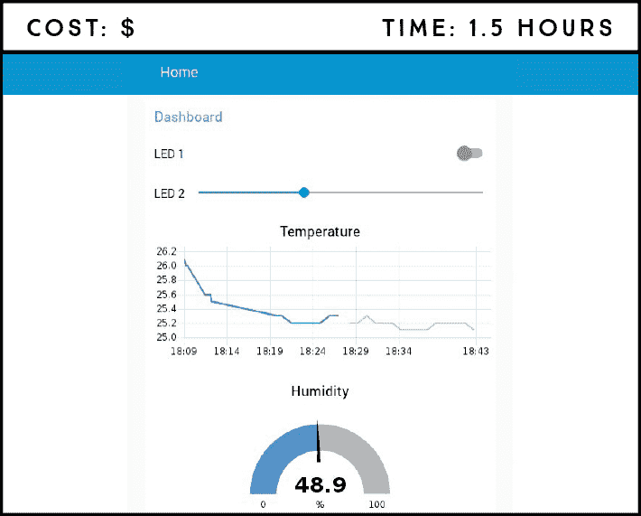

**所需部件**

树莓派

面包板

DHT22 温湿度传感器

4.7 kΩ 电阻

两个 5 毫米 LED

两个 330 Ω 电阻

跳线

**所需软件**

Node-RED DHT 节点

Node-RED 仪表盘

你将创建一个 Node-RED 应用程序，控制本地网络中的输出并读取输入。你将用它来控制 LED，并使用 DHT22 传感器读取并显示温湿度值——所有这些都通过 Web 服务器远程完成。

### 介绍 Node-RED

Node-RED 是一个开源的视觉连接工具，用于构建物联网应用程序，它已经预装在树莓派的操作系统中，且与树莓派完美兼容。

Node-RED 使用视觉编程，包含称为*节点*的模块，你可以将它们连接在一起以执行特定任务，从而显著简化了编程。Node-RED 允许你快速且简单地原型化一个复杂的家庭自动化系统，让你有更多时间专注于设计和制作酷炫的东西。

我们不会在这个项目中涵盖 Node-RED 的所有功能，但如果你想进一步探索，这里有一个简短的概述：

+   访问树莓派的 GPIO。

+   建立与其他板卡的连接，例如 Arduino 和 ESP8266。

+   创建响应式图形用户界面。

+   与第三方服务进行通信。

+   从网上检索数据。

+   创建时间触发事件。

+   从数据库中存储和检索数据。

#### 安装 DHT22 节点

虽然 Node-RED 软件已经随 Pi 的操作系统预装，但它并没有自带可以读取 DHT22 传感器的节点。我们需要先安装它，通过像下面这样安装 npm（Node 包管理）：

```
pi@raspberrypi:~ $ sudo apt install npm
```

当系统提示时，输入 Y 并按下 ENTER 键。安装可能需要几分钟时间。然后，输入以下命令将 npm 升级到最新的 3.x 版本，这是与 Node-RED 一起使用时推荐的版本：

```
pi@raspberrypi:~ $ sudo npm install -g npm@3.x
pi@raspberrypi:~ $ hash -r
```

这些命令将输出一个警告信息，但不用担心——它是无害的，可以忽略。

接下来，你将下载并解压一个适用于树莓派的 C 库。你需要这个库来通过 Node-RED 控制 DHT22。撰写本文时，库的最新版本为 1.55。安装库之前，请访问 *[`www.airspayce.com/mikem/bcm2835/`](http://www.airspayce.com/mikem/bcm2835/)* 查看最新版本。然后，输入以下命令，将斜体部分的 `1.55` 替换为最新版本。

```
pi@raspberrypi:~ $ wget http://www.airspayce.com/mikem/bcm2835/
bcm2835-*1.55*.tar.gz
pi@raspberrypi:~ $ tar zxvf bcm2835-*1.55*.tar.gz
```

最后，输入以下命令列表以编译并安装控制 DHT22 传感器所需的节点，并添加仪表盘支持：

```
pi@raspberrypi:~ $ cd bcm2835-*1.55*
pi@raspberrypi:~/bcm2835-1.55 $ ./configure
pi@raspberrypi:~/bcm2835-1.55 $ make
pi@raspberrypi:~/bcm2835-1.55 $ sudo make check
pi@raspberrypi:~/bcm2835-1.55 $ sudo make install
pi@raspberrypi:~/bcm2835-1.55 $ cd
pi@raspberrypi:~ $ sudo npm install -–unsafe-perm -g node-dht-sensor
pi@raspberrypi:~ $ sudo npm install --unsafe-perm -g node-red-
contrib-dht-sensor
pi@raspberrypi:~ $ sudo npm install --unsafe-perm -g node-red-
dashboard
```

安装完成后，重启你的 Pi。现在我们将快速介绍 Node-RED。

#### Node-RED 入门

要打开 Node-RED，请进入终端并输入以下命令：

```
pi@raspberrypi:~ $ sudo node-red start
```

你的终端窗口应该会显示类似图 17-1 的内容。高亮显示的行显示了你本地主机的树莓派 IP 地址，后面是 Node-RED 服务器运行的端口号。*本地主机*是一个主机名，表示“这台计算机”，并解析为终端窗口中显示的 IP 地址：http://127.0.0.1。使用此 IP 地址，你只能在树莓派浏览器中访问 Node-RED。如果要在本地网络中的任何浏览器中访问 Node-RED，你需要找到树莓派的 IP 地址。

**注意**

*通常，你可以通过进入任务栏主菜单并点击**编程 ▸ Node-RED**来打开 Node-RED，而不是直接进入终端。然而，在这个项目中，你需要从终端启动 Node-RED，因为 DHT22 节点需要管理员权限。*

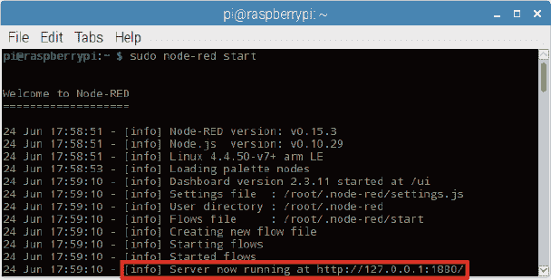

**图 17-1：** 从终端启动 Node-RED

要查找你的树莓派 IP 地址，请在终端输入以下命令：

```
pi@raspberrypi:~ $ hostname -I
```

打开 Chromium 并输入*http://<Pi IP 地址>:1880/*，将*<Pi IP 地址>*替换为你的树莓派的 IP 地址。你的 Node-RED 页面服务器应该会如图 17-2 所示打开。

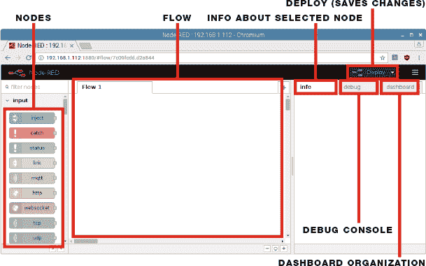

**图 17-2：** 浏览器中的 Node-RED 编辑器

在左侧，你会看到一个块或节点的列表。节点根据其功能分组；向下滚动列表查看你所拥有的节点。我们将在这个项目中介绍少量现有节点，包括来自输入、树莓派、功能和仪表板部分的节点，详见图 17-3。

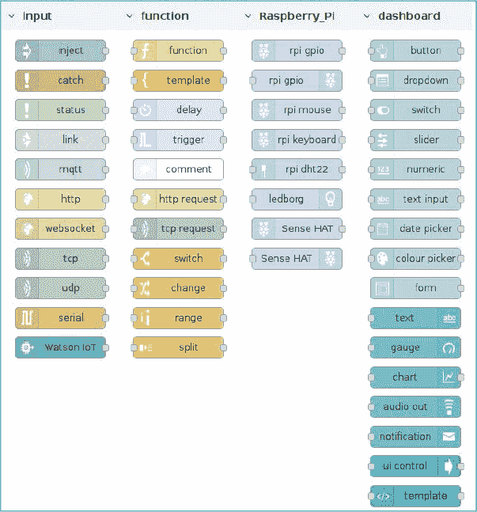

**图 17-3：** 一些 Node-RED 节点

你的 Node-RED 页面的中央框是*流程*区域；这是你拖动节点并将它们连接起来以构建应用程序的地方。右侧有几个标签：*信息*标签显示选定节点的信息，*调试*标签用于调试，*仪表板*标签是你组织应用程序用户界面小部件的地方。最后，*部署*按钮保存对流程所做的更改并执行它。接下来，你将接线硬件，然后在 Node-RED 中搭建流程。

### 电路接线

你应该已经熟悉 LED 和 DHT22 传感器，但如果需要复习 DHT22 传感器的内容，请查看项目 12。接线电路时，请按照以下说明操作：

1.  将树莓派的 5V 和 GND 分别连接到面包板的红色和蓝色导轨。

1.  将两个 LED 插入面包板。将每个 LED 的短脚通过 330Ω电阻连接到 GND 导轨。将一个 LED 的长脚连接到 GPIO 18，另一个 LED 的长脚连接到 GPIO 17。

1.  将 DHT22 插入面包板（使其凸起的一面朝向你），并按照下表进行接线。完成的电路应该与图 17-4 匹配。

| **DHT22** | **树莓派** |
| --- | --- |
| 1 | 3.3 V |
| 2 | GPIO 4 和 3.3 V（通过 4.7 kΩ 电阻） |
| 3 | 不连接 |
| 4 | GND |

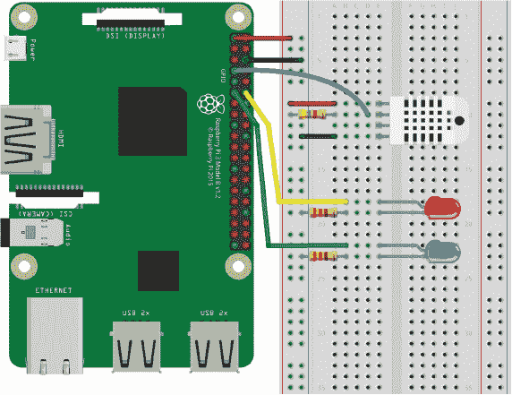

**图 17-4：** 将 DHT22 和两个 LED 连接到树莓派

### 创建流程

在这个例子中，脚本是你将在 Node-RED 中创建的流程。这个流程将允许你执行以下操作：

+   使用开关控制 LED。这个 LED 也是时间敏感的，这意味着它将在你设置的特定时间自动亮起和熄灭。

+   使用滑块控制另一个 LED，通过 PWM 来充当调光开关。

+   从 DHT22 传感器读取温度，并在时间与温度的图表上显示它。

+   从 DHT22 传感器读取湿度，并在仪表盘上显示它。

首先，你将创建一个用户界面，用于从服务器控制组件。

#### 创建仪表板用户界面

来自仪表板部分的节点提供了在应用程序用户界面（UI）中显示的小部件，用于控制组件。你添加到流程中的每个小部件——如按钮、滑块或图表——都必须与一个*组*关联，指示小部件应显示在 UI 的位置。

你还需要标签页，类似于应用程序中的页面（就像浏览器中的标签）。组是标签页中的部分，你可以在其中将小部件分组。在任何项目中，你都需要在仪表板上创建标签页和组，以组织用户界面中的小部件。你将创建一个名为“Home”的标签页，并在其中创建一个名为“Dashboard”的组。

以图 17-5 为参考，选择右上角的 **仪表板** 标签 ➊，然后按下 **+标签** 按钮 ➋ 在标签列表下创建一个新标签。点击 **编辑** 以编辑标签 ➌ 并输入名称 Home。创建后，按下 **+组** 按钮 ➍ 创建一个新组；然后点击 **编辑** ➎ 并输入名称 Dashboard。

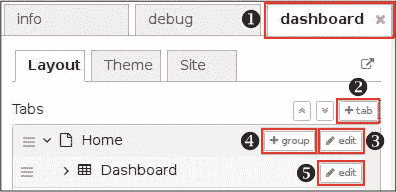

**图 17-5：** 在仪表板中创建标签页和组

要查看当前的仪表板外观，打开浏览器并访问 *http://<Pi IP 地址>:1880/ui*，将 *<Pi IP 地址>* 替换为之前获取的树莓派 IP 地址。如图 17-6 所示，目前你的用户界面是空的，因为你还没有添加任何小部件，所以接下来我们将添加一些功能。

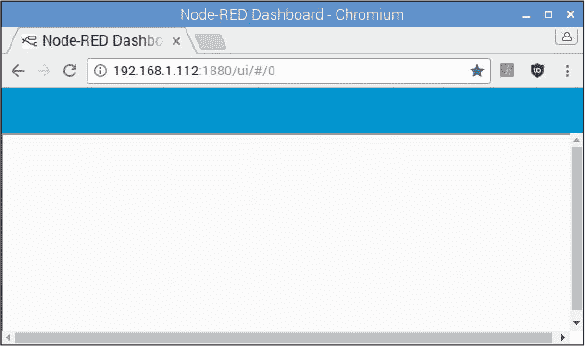

**图 17-6：** Node-RED 用户界面

#### 连接节点

现在你将向流程中添加节点。你的流程将控制连接到树莓派 GPIO 的 LED，并从 DHT22 传感器读取温度和湿度。

##### 添加开关和调度事件

返回到 Node-RED 编辑器，通过拖动输入部分的两个注入节点到流程中，将它们添加到流程中。当你将它们放入流程时，它们的名称会变成 *时间戳*。从仪表板部分添加一个开关，再从 Raspberry_Pi 节点部分添加一个 rpi gpio 输出节点（左侧有接头的那个）。像图 17-7 中那样排列节点并连接它们。

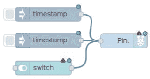

**图 17-7：** 控制 LED 1 的流程

这一组节点控制连接到 GPIO 17 的 LED。这个 LED 可以通过开关远程控制，并且它还是时间敏感的；时间戳 1 决定了 LED 点亮的时间，时间戳 2 决定了 LED 关闭的时间。

如果你双击某个节点，会打开一个新窗口，允许你编辑该节点的属性。双击第一个时间戳节点并按以下方式编辑其属性：将负载数字设置为 **1**，当该节点触发时，它会将 1 发送到 Raspberry Pi GPIO 17。在重复字段中，选择 **在特定时间**，并选择你希望 LED 点亮的时间和日期；你将在时间戳 2 中选择关闭它的时间。我们选择了每周所有日期的 19:00（下午 7 点）。你可以选择任何你想要的时间和日期。名称字段允许你命名节点，在我们的例子中我们将其命名为 **晚上 7 点开启**。编辑完节点后，点击 **完成** 按钮。图 17-8 显示了我们为该节点设置的属性。

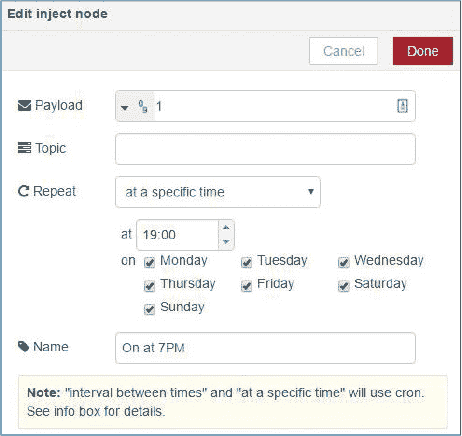

**图 17-8：** 编辑注入节点的属性

编辑其他节点的属性，使其与下表中的内容一致。

| **节点** | **属性** |
| --- | --- |

| 时间戳 | 负载：数字 1 重复：在特定时间 |

时间：19:00

开：选择所有日期 |

| 时间戳 | 负载：数字 0 重复：在特定时间 |

时间：23:00

开：选择所有日期 |

| 开关 | 组：仪表板 [首页] 标签：LED 1

开启负载：数字 1

关闭负载：数字 0

名称：LED 1 – 开关 |

| 引脚 | GPIO：GPIO17 – 11 类型：数字输出

名称：LED 1 – GPIO 17 |

要运行你的 Node-RED 应用程序，请点击右上角的 **部署** 按钮。这也会保存更改。要查看应用程序的外观，可以在浏览器中访问 *http://<Pi IP 地址>:1880/ui*。此时，它应该看起来像图 17-9。

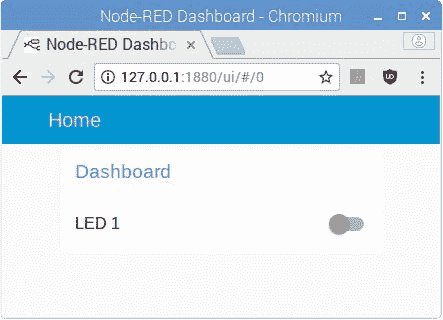

**图 17-9：** 带有 LED 1 控制开关的用户界面

点击开关来测试是否能够控制连接到 GPIO 17 的 LED。如果无法控制，返回并确保你正确连接了节点并设置了正确的属性。

##### 添加一个滑块

现在，你将添加控制连接到 GPIO 18 的 LED 亮度的节点。将一个滑块和一个 rpi gpio 输出节点拖入流程中，并像图 17-10 中那样排列它们。

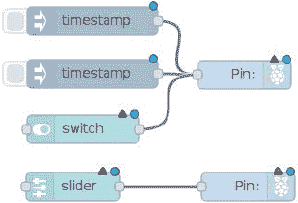

**图 17-10：** 控制 LED 1 和 LED 2 的流程

编辑新节点的属性，如下表所示。

| **节点** | **属性** |
| --- | --- |

| 滑块 | 组：仪表板 [主页] 标签：LED 2

范围：最小值：0；最大值：100；步长：1

名称：LED 2 – 滑块 |

| 引脚 | GPIO：12 – GPIO18 类型：PWM 输出

名称：LED 2 – GPIO 18 |

这组新节点使用 PWM 控制连接到 GPIO 18 的 LED。移动滑块将改变 LED 的亮度。点击 **部署** 按钮，前往 Node-RED UI，测试你的应用程序。它应该看起来像 图 17-11。

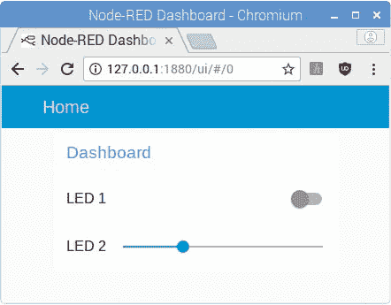

**图 17-11：** 带有 LED 1 开关和 LED 2 滑块的用户界面

##### 添加温度图表和湿度仪表

最后，为了创建温度图表和湿度仪表，拖动注入节点、rpi dht22 节点、函数节点、图表和仪表到流程中。图表和仪表是仪表板节点。安排节点，使你的流程像 图 17-13 一样。

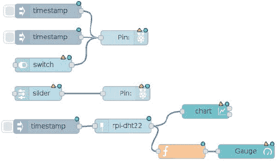

**图 17-12：** 完整的 Node-RED 流程

编辑新节点的属性，使用以下表格中的设置。

| **节点** | **属性** |
| --- | --- |

| 时间戳 | 载荷：布尔值 true 重复：间隔

每次：1 分钟

名称：读取 DHT22 |

| rpi-dht22 | 传感器型号：DHT22 引脚编号：BCM GPIO

引脚编号：4

名称：DHT22 – GPIO 4 |

| 图表 | 组：仪表板 [主页] 标签：温度

类型：折线图

X 轴：1 小时

X 轴标签：HH:mm

名称：温度 – 图表 |

| f | 名称：获取湿度 功能：

msg.payload = msg.humidity;

返回 msg; |

| 仪表盘 | 组：仪表板 [主页] 类型：仪表

标签：湿度

值格式：{{value}}

单位：%

范围：最小值：0；最大值：100

名称：湿度 - 仪表 |

点击 **部署** 按钮，再次测试你的应用程序。记得，如果遇到问题，确保你的属性与此处的表格一致，并再次检查节点的接线与图示是否匹配。

### 运行应用程序

恭喜！你已经用 Node-RED 构建了第一个物联网应用程序。前往 *http://<Pi IP 地址>:1880/ui* 查看用户界面效果。你可以在本地网络上的任何浏览器（无论是电脑还是智能手机）中访问这个 URL。图 17-13 显示了你可以通过 Node-RED 应用程序控制的最终电路。

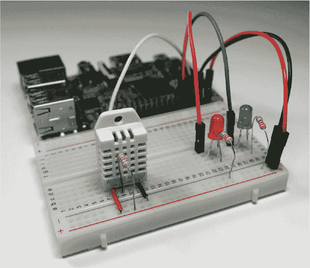

**图 17-13：** 使用 Node-RED 的物联网项目

你的应用程序有一个开关来控制 LED 1，它也具有时间敏感性；一个滑块来控制 LED 2 的亮度；还有一个图表和仪表来显示温度和湿度。

### 进一步扩展

这个项目仅仅触及了 Node-RED 的表面。以下是一些进一步扩展此项目的想法：

+   用继电器和灯泡替换时间敏感的 LED（有关继电器模块的介绍，请参见 项目 16）。

+   向应用程序添加更多传感器读取，例如烟雾传感器和运动检测。
