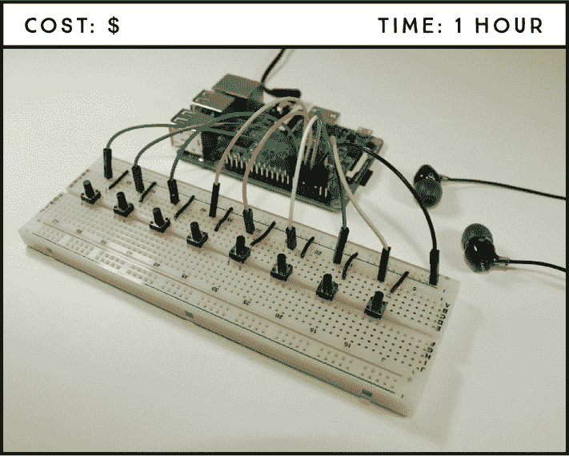
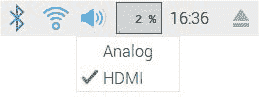
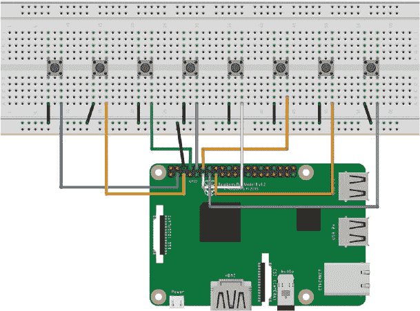

## 第十九章：数字鼓组

在这个项目中，你将使用一个面包板电路和几个按钮创建一个按钮控制的数字鼓组。按下不同的按钮会产生不同的鼓声，包括两个鼓点循环。



**所需组件**

树莓派

面包板

八个按键

耳机或通过 HDMI 连接到树莓派的带扬声器的显示器

跳线

**所需软件**

avconv

本项目使用 Sonic Pi 样本库中的样本，但你可以自由调整，使用任何你想要的声音。

### 准备音频

首先，你需要正确配置树莓派的音频设置，并准备好使用来自 Sonic Pi 的音频样本。

#### 配置音频

首先，将耳机或扬声器插入树莓派的音频插孔。如果你的显示器内置扬声器并通过 HDMI 电缆连接到树莓派，则不需要连接任何东西到音频插孔——你可以通过显示器的扬声器收听声音。

在桌面环境的右上角，右键点击音频图标，选择音频源，如图 18-1 所示。如果你使用耳机，选择模拟；如果你使用带扬声器的显示器，通过 HDMI 连接，则选择 HDMI。



**图 18-1：** 选择音频源

#### 获取音频样本文件

**注意**

*我们在本书中不会详细讲解 Sonic Pi，但如果你想自己探索它，可以在任务栏的主菜单中进入**编程** ▸ ***Sonic Pi**，打开软件并四处浏览。*

Sonic Pi 软件已安装在树莓派的操作系统中，它允许你使用代码创作数字音乐，但在这个项目中你只需要使用 Sonic Pi 的样本音频文件。

在终端中，输入以下命令，在*Projects*文件夹内创建一个名为*Games_and_Toys*的新文件夹，并进入该文件夹。你将把样本保存在这里。

```
pi@raspberrypi:~ $ cd ~/Desktop/Projects
pi@raspberrypi:~/Desktop/Projects $ mkdir Games_and_Toys
pi@raspberrypi:~/Desktop/Projects $ cd Games_and_Toys
```

然后输入以下命令，将 Sonic Pi 的*samples*文件夹复制到*Games_and_Toys*文件夹中（请注意，最后一个斜杠与句号之间有一个空格）：

```
pi@raspberrypi:~/Desktop/Projects/Games_and_Toys $ cp -r /opt/
sonic-pi/etc/samples/ .
```

接下来，输入以下命令列出*samples*文件夹的内容，检查它们是否正确传输：

```
pi@raspberrypi:~/Desktop/Projects/Games_and_Toys $ cd samples
pi@raspberrypi:~/Desktop/Projects/Games_and_Toys/samples $ ls
```

如果一切顺利，你应该能看到如下的文件列表：

```
ambi_choir.flac        drum_cowbell.flac        elec_ping.flac
ambi_dark_woosh.flac   drum_cymbal_closed.flac  elec_plip.flac
...
```

你可能会注意到这些文件有一个不常见的扩展名*.flac*。这种格式在 Sonic Pi 中使用，但要在 Python 中使用它们，你需要将它们转换为*.wav*文件。为此，你将使用 avconv 软件。输入以下命令来安装 avconv：

```
pi@raspberrypi:~/Desktop/Projects/Games_and_Toys/samples $ sudo apt
install libav-tools
```

然后输入以下命令，它将遍历*samples*文件夹中的所有文件，并将每个*.flac*文件转换为*.wav*文件：

```
pi@raspberrypi:~/Desktop/Projects/Games_and_Toys/samples $ for f in
*.flac; do avconv -i "$f" "${f%.flac}.wav"; done
```

接下来，使用`ls`命令列出*samples*文件夹中的项目，检查是否有*.wav*文件可以使用：

```
pi@raspberrypi:~/Desktop/Projects/Games_and_Toys/samples $ ls
```

对于每个样本，你应该同时拥有*.wav*和*.flac*文件。要从*samples*文件夹中删除*.flac*文件，请输入以下命令：

```
pi@raspberrypi:~/Desktop/Projects/Games_and_Toys/samples $ rm *.flac
```

如果你愿意，可以再次使用 `ls` 命令检查是否拥有正确的文件。

你可以通过操作系统默认安装的*omxplayer*软件播放这些声音。要听一个名为*drum_snare_soft.wav*的样本，可以在命令行中输入以下命令：

```
pi@raspberrypi:~/Desktop/Projects/Games_and_Toys/samples $ omxplayer
drum_snare_soft.wav
```

如果你浏览样本文件，你会看到各种各样的声音，从吉他声到牛铃声，再到鼓声。选择八种不同的鼓声来构成你的鼓组（或者选择其他你喜欢的声音）。

我们选择的声音如下；最后两个是鼓点，其余的则是单一的鼓声：

+   *drum_cymbal_open.wav*

+   *drum_heavy_kick.wav*

+   *drum_snare_hard.wav*

+   *drum_cymbal_closed.wav*

+   *drum_roll.wav*

+   *perc_snap.wav*

+   *loop_amen_full.wav*

+   *loop_mika.wav*

### 接线电路

这个项目的电路只涉及将八个按钮接到树莓派上。每个按钮都关联一个不同的声音。

要接线，请按照这些指示操作，使用图 18-2 作为参考。



**图 18-2：** 数字鼓组电路

1.  将 GND 引脚连接到面包板的 GND 导轨。

1.  将八个按钮均匀插入面包板的中央分隔线上。

1.  将左下角的按钮引脚连接到 GND，右下角的引脚依次连接到以下 GPIO 引脚之一：GPIO 2、3、14、15、17、18、22 和 27。

    | **PUSHBUTTON** | **RASPBERRY PI** |
    | --- | --- |
    | 1 | GPIO 2 |
    | 2 | GPIO 3 |
    | 3 | GPIO 14 |
    | 4 | GPIO 15 |
    | 5 | GPIO 17 |
    | 6 | GPIO 18 |
    | 7 | GPIO 22 |
    | 8 | GPIO 27 |

### 编写脚本

打开**Python 3 (IDLE)**，然后点击**文件** ▸ **新建文件**以创建一个新的脚本。将以下代码复制到 Python 编辑器中，并将脚本保存在*Games_and_Toys*文件夹内，命名为*digital_drum_set.py*（记得你可以从*[`www.nostarch.com/RaspberryPiProject/`](https://www.nostarch.com/RaspberryPiProject/)*下载所有脚本）：

```
  #import the necessary libraries
➊ import pygame.mixer
  from pygame.mixer import Sound
  from gpiozero import Button
  from signal import pause

  #create an object for the mixer module that loads and plays sounds
➋ pygame.mixer.init()

  #assign each button to a drum sound
➌ button_sounds = {
      Button(2): Sound("samples/drum_cymbal_open.wav"),
      Button(3): Sound("samples/drum_heavy_kick.wav"),
      Button(14): Sound("samples/drum_snare_hard.wav"),
      Button(15): Sound("samples/drum_cymbal_closed.wav"),
      Button(17): Sound("samples/drum_roll.wav"),
      Button(18): Sound("samples/perc_snap.wav"),
      Button(22): Sound("samples/loop_amen_full.wav"),
      Button(27): Sound("samples/loop_mika.wav"),
  }
  #the sound plays when the button is pressed
➍ for button, sound in button_sounds.items():
      button.when_pressed = sound.play
  #keep the program running to detect events
➎ pause()
```

像往常一样，你从导入必要的库 ➊ 开始脚本。这里的新库是 `pygame.mixer`，用于加载和播放声音。从 `pygame.mixer` 中，你还导入了 `Sound` 模块，用于创建声音对象。

然后初始化 Pygame 混音器 ➋ 并创建一个字典来存储声音 ➌。在 Python 中，*字典*是一种用于存储项之间关系的数据结构。在这里，你将按钮与特定的声音关联起来。字典的基本结构如下：

```
dictionary_name = {key_1: value_1, key_2: value_2}
```

字典用大括号 `{}` 括起来，由键/值对组成。你使用冒号 (`:`) 将每个键与对应的值关联起来，使用逗号 (`,`) 来分隔每个键/值对。

在这个项目中，键是按钮，值是声音。要创建一个声音对象，你将声音文件路径作为字符串传递给`Sound()`函数。在这个例子中，由于*sample*文件夹位于*Games_and_Toys*文件夹内，因此你不需要提供完整路径，只需要提供文件夹名和声音文件名。你需要修改脚本中加粗的声音文件名，替换为你选择的声音文件。

接下来，将每个按钮分配一个音效 ➍；这意味着，当按下某个按钮时，对应的声音将会播放。最后，脚本结尾的`pause()`函数 ➎ 保持程序运行，以便能够检测事件。

要运行脚本，请按**F5**键或选择**运行** ▸ **运行模块**。

恭喜你——你已经成功打造了自己的数字鼓组！现在，按下按钮并创作属于你自己的音乐片段。

### 进一步探索

这是一个很酷的项目，而且非常简单。我们鼓励你通过尝试以下方法来扩展这个项目：

+   为你的数字鼓组添加其他声音

+   录制你自己的声音或在网上搜索免费的声音素材

+   构建一个数字钢琴、数字吉他或混合声音的音乐盒
