## 第二十章：在 Scratch 中制作游戏：饥饿猴子**

在这个项目中，你将使用基于区块的编程语言 Scratch 来创建一个可以通过两个按键和树莓派控制的游戏。

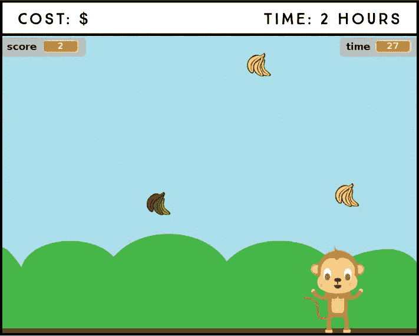

**所需零件**

树莓派

两个按键

面包板

跳线

在这个项目中，你将创建一个名为“饥饿猴子”的游戏。游戏的目标是让猴子在 30 秒内尽可能多地抓到成熟的香蕉，同时避免抓到腐烂的香蕉。你可以通过将两个按键连接到树莓派来控制猴子的左右移动。

### 介绍 Scratch 2

**注意**

*要了解更多关于 Scratch 的信息，请访问官方 Scratch 网站* [`scratch.mit.edu/`](http://scratch.mit.edu/)。

Scratch 是一种可视化编程语言，你可以使用它通过拖放代码块创建动画、故事和游戏。虽然 Scratch 最初是为了教孩子们编程而开发的，但它同样适合任何想要学习基本编程概念或只是想玩游戏制作的人。

Scratch 2 默认安装在 Raspbian 上。你可以通过桌面主菜单中的**编程** ▸ **Scratch 2**来打开它。当你打开 Scratch 2 时，你应该能看到像图 19-1 这样的窗口。

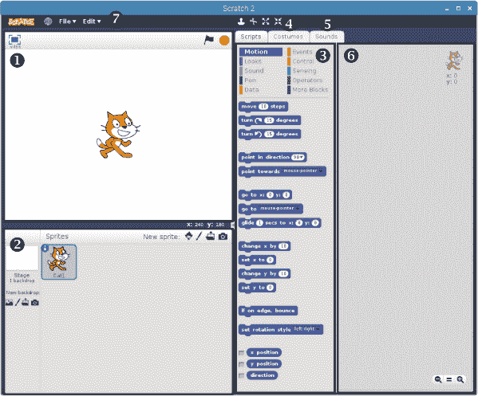

**图 19-1：** Scratch 2 窗口

Scratch 窗口将屏幕分为四个主要部分。Stage ➊ 是你的游戏或动画播放的区域。右上角，你会看到一个绿色的旗帜和一个停止标志；你可以使用这些图标来启动和停止游戏。当你首次打开 Scratch 时，默认情况下，舞台上应该会看到一只猫。

Sprite List ➋ 显示了所有的*精灵*，这些精灵是你的游戏角色或在项目中执行某个动作的任何物体。窗口的中间是 Blocks 区域 ➌，它有三个标签：Scripts、Costumes 和 Sounds。Scripts 标签包含你用来构建程序的编程块。每个块都是一个不同的编程指令，你可以将其拖放到程序中。你会看到根据功能不同而分类的块，每个类别都有特定的颜色；例如，**运动**类别的块是深蓝色的，它们告诉精灵如何移动。

Costumes 标签 ➍ 显示了自定义和创建新角色服装的选项，Sounds 标签 ➎ 允许你为角色添加声音。Scripts 区域 ➏ 是你拖动并拼接代码块以创建脚本的地方。

顶部的菜单栏 ➐ 显示了左侧的文件和编辑主菜单。中间的图标允许你复制、删除、放大和缩小你的角色，还可以从 Scratch 获取帮助。

### 连接电路

这个项目的电路由两个按键和树莓派组成。按照这些指示来连接它们，可以参考图 19-2。

1.  将一个 GND 引脚连接到面包板的 GND 电源轨。

1.  将两个按钮插入面包板中。

1.  将右下角的按钮引脚连接到 GND 电源轨。

1.  将一个按钮的左下角引脚连接到 GPIO 2，另一个连接到 GPIO 3。

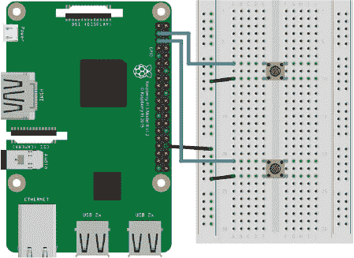

**图 19-2：** 将两个按钮连接到树莓派

就是这样！你已经准备好编写游戏代码了。

### 构建脚本

在创建游戏之前，最好先概述你希望游戏具备的功能，这样你就能确切知道需要做什么。

在《饥饿猴子》游戏中，玩家控制一只猴子，需要尽可能抓住熟香蕉，同时避免抓到烂香蕉。每抓到一个好香蕉，玩家得一分；如果抓到烂香蕉，游戏将扣除一分。以下是构建《饥饿猴子》游戏的主要步骤：

1.  创建主角猴子，并允许玩家通过两个按钮来控制猴子的移动：一个按钮让猴子向右移动，另一个按钮让猴子向左移动。同时允许玩家通过键盘键来控制猴子的移动。

1.  创建好香蕉和烂香蕉的精灵，并让它们从天而降。

1.  编程使猴子在碰到香蕉时将其抓住。

1.  创建一个得分系统，当猴子抓到一个好香蕉时加一分，抓到一个烂香蕉时减一分。

1.  创建一个计时器，当计时器归零时结束游戏。

1.  游戏结束时显示玩家的得分。

本项目的 Scratch 文件可以在* [`www.nostarch.com/RaspberryPiProject/`](https://www.nostarch.com/RaspberryPiProject/)*找到。要上传已保存的程序到 Scratch，请进入**文件 ▸ 加载项目**。接下来按照以下几节构建脚本。

#### 创建精灵并选择舞台背景

**注意**

*你也可以通过点击画笔图标从头创建一个精灵，点击文件夹图标上传你自己的精灵，或者用摄像头图标拍摄照片制作精灵。*

在《饥饿猴子游戏》中，你将使用精灵库中的猴子精灵和香蕉精灵。你不需要使用默认出现在舞台上的猫精灵，可以通过右键点击精灵并选择**删除**来删除这个精灵。

前往精灵列表，点击最左边的图标（看起来像一个角色），以打开精灵库（参见图 19-3）。

**图 19-3：** 创建新精灵的图标

从“动物”类别中选择`Monkey2`精灵并点击**OK**。然后再次打开精灵库，从“物品”类别中选择`Bananas`精灵，点击**OK**。

你可以从精灵列表的最左侧选择游戏背景。在那里，你会找到一组背景图标。点击第一个图标（在图 19-4 中高亮显示）以从背景库中选择一个背景。我们选择了名为*蓝天*的背景。

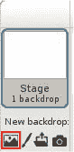

**图 19-4：** 从背景库中选择背景

现在你的精灵区应该像图 19-5 所示。

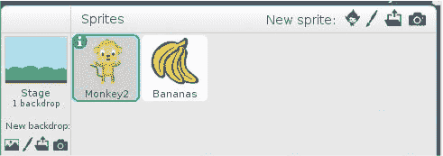

**图 19-5：** 选中的精灵和背景的精灵列表

#### 编辑精灵

Scratch 允许你增加或减少精灵的大小，改变其颜色，或者像在图像编辑程序中一样编辑它。Scratch 内置的图像编辑器叫做*Paint Editor*。在这里你将对精灵的外观进行一些更改。

在精灵列表中选择`Monkey2`精灵；如果已选择精灵，它会以蓝色轮廓显示，如图 19-5 所示。接下来，点击“造型”标签中的`Monkey2`精灵，编辑第一个造型，名为`monkey2-a`。使用鼠标指针拖动精灵的一个角，直到其大小变为 98×138 像素，或者使用缩放工具直到获得所需的大小；精灵的大小会显示在`monkey2-a`造型下方。同时，将`Bananas`精灵的大小更改为 28×28 像素。

调整精灵的大小时，确保它们位于画布的中心，以保持精灵的参考点。

#### 为猴子精灵添加控制

现在你将为猴子添加控制，使其可以通过按下按钮或键盘上的左右箭头来左右移动。

为了让树莓派 GPIO 与 Scratch 进行交互，并且在按下按钮时程序能够响应，你需要向 Scratch 添加一个扩展库。在“脚本”标签中选择`Monkey2`精灵，选择**更多积木**，然后点击**添加扩展**。接着选择 Pi GPIO 图标，如图 19-6 所示，然后点击**确定**。

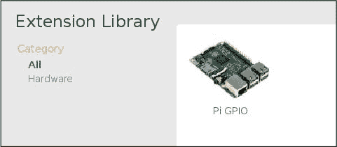

**图 19-6：** 添加 Pi GPIO 扩展

扩展库添加了新的积木来控制 Pi GPIO，这些积木应该出现在“更多积木”类别中。

在 Scratch 中有很多方法可以让你的精灵移动。你将使用(x, y)坐标系统，其中(0,0)位置是舞台的中心。增加 x 坐标将使精灵向右移动，减少它会使精灵向左移动。增加 y 坐标会使精灵向上移动，减少它则会使精灵向下移动。控制移动的积木位于深蓝色的**运动**类别中。

要控制猴子，选择`Monkey2`精灵并将图 19-7 中的积木拖入脚本区域。然后根据图 19-7 中的设置更改积木的参数。

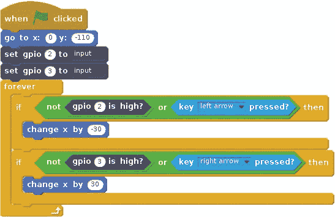

**图 19-7：** 控制猴子的积木

首先将`Monkey2`精灵的 x 位置设置为 0，y 位置设置为–110。将 x 设置为 0 可以使精灵水平居中，将 y 设置为–110 则将精灵移动到地面。这样每次你开始游戏时，精灵都会保持在这个位置。

接下来的两个积木将 GPIO 2 和 GPIO 3 设置为输入端口，以便程序能够检测到推按钮是否被按下。

**注意**

*找到这些积木很简单。记住，每个积木类别都有特定的颜色，每个积木的颜色也相应地进行了设置。*

然后，你添加一个永远循环，不断检查玩家是否按下了推按钮或左右箭头键。如果玩家按下连接到 GPIO 3 的推按钮或右箭头键，精灵的 x 位置会改变 30，使其向右移动；如果玩家按下连接到 GPIO 2 的推按钮或左箭头键，精灵的 x 位置会改变-30，使其向左移动。你可以增加这个数值来让猴子移动得更快，或者减少它来让猴子移动得更慢。

添加完这些积木后，请与图 19-7 进行双重检查，然后可以进行测试。

#### 测试你的脚本

在 Scratch 中启动脚本时，使用绿色旗帜积木，。这个积木会启动你的游戏并同步所有精灵中的脚本。当你点击舞台区域右上角的绿色旗帜图标时，Scratch 会启动所有在该积木下的脚本。

现在点击舞台右上角的绿色旗帜图标 。按下推按钮和箭头键测试精灵是否按预期移动。当一切正常后，继续测试计时器。

#### 创建倒计时器

玩家需要知道剩余多少时间来抓取香蕉，接下来你将创建一个倒计时器。

要将定时器添加到游戏中，选择`Monkey2`精灵，然后将图 19-8 中的积木添加到脚本区域。你可能会注意到找不到显示变量的积木。这是因为你需要创建一个变量来存储时间。要创建变量，请进入**数据**积木类别，并点击**创建变量**按钮。将新变量命名为 time，并通过勾选**所有精灵**框使其对所有精灵可用。现在将该积木拖入脚本区域。

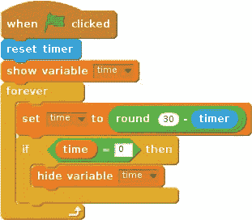

**图 19-8：** 创建倒计时器的积木

要创建倒计时器，你需要使用一个叫做 timer 的积木。这个积木会计算从脚本开始以来已经过去的时间。当你点击绿色旗帜图标时，脚本会重置定时器，每次开始游戏时它都会从 0 开始计时。接下来，添加一个积木，将`time`变量显示在舞台上。你可以通过拖动它来调整`time`变量的位置，将其移动到舞台的右上角。

接下来，永远循环会不断更新`time`变量，使其从 30 开始，每秒减少 1。你使用圆形积木，确保倒计时只显示整数。如果你想改变游戏时长，可以调整圆形积木中的数字。

请特别注意这里的嵌套（参见图 19-9）；你会注意到，先有设定时间的模块，然后是回合模块。接着，在这个基础上，你需要放置带有两个空圆圈的绿色模块。在第一个空圆圈里输入 30，在第二个空圆圈里放入一个来自**感知**类别的计时器模块。

**图 19-9：** 嵌套的 if 语句块

最后的 if 模块（参见图 19-8）会在`time`归零时隐藏`time`变量在舞台上的显示。现在试试看吧！

#### 计算并显示分数

为了创建分数系统，首先你需要创建一个变量来跟踪分数。在**数据**模块类别中，创建一个名为`score`的新变量，并使其对所有角色可见。选择`Monkey2`角色，然后将图 19-10 中的模块添加到脚本区。

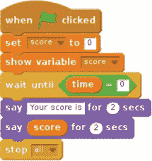

**图 19-10：** 显示分数并停止游戏的模块

将设定分数的模块设置为`0`，这样当游戏开始时，分数会重置。然后添加显示变量模块，在舞台上显示分数。

在游戏结束时，当时间归零时，猴子应该在气泡框中说出分数，所有脚本将停止，游戏结束。为了让猴子说话，添加一些紫色的**外观**模块来显示气泡框——你可以在这里输入你希望猴子说的任何文本。

再次小心嵌套，并仔细查看图 19-10。

#### 让香蕉从天而降

现在你已经创建了所有`Monkey2`的动画和控制，你需要让`Bananas`角色从天而降。以下是`Bananas`角色的待办事项清单：

+   香蕉应该从天而降，从一个随机的 x 位置开始，然后 y 位置逐渐减小，直到它们触地。

+   当香蕉触地时，它们应该消失。

+   当香蕉触碰到猴子时，应该播放声音，分数加一，香蕉消失。

+   所有香蕉应该在时间归零时被删除，以免在游戏结束后继续掉落。

首先，你需要从声音库中将声音添加到模块区。

##### 从声音库中添加声音

你将为`Bananas`角色添加一个“啪”声，当它碰到`Monkey2`角色时播放。为此，选择`Bananas`角色，在模块区选择**声音**标签。然后点击图标，从声音库中选择一个声音，并选择`pop`。选择**脚本**标签以添加动作模块。

##### 让香蕉掉落

为了完成待办事项清单，选择`Bananas`角色，然后将图 19-11 中的模块添加到它的脚本区。

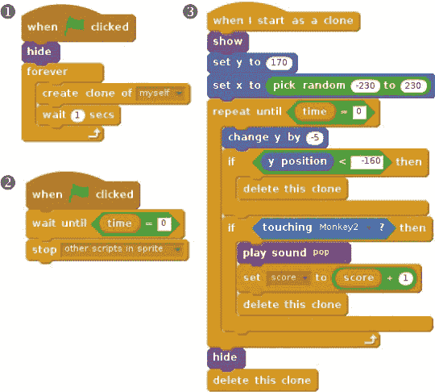

**图 19-11：** 创建并控制`Bananas`角色的模块

在 图 19-11 中的左上角代码块 ➊，你每秒创建一个 `Bananas` 精灵的克隆体。换句话说，你每秒生成一个新的 `Bananas` 精灵。

在右侧的代码块集合 ➌ 中，你初始化了 `Bananas` 克隆体的值。`show` 块确保香蕉出现在屏幕上。你将香蕉的 y 坐标设置为 170，这对应舞台的顶部，并将 x 坐标设置为 -230 到 230 之间的随机数，这个范围是舞台的水平空间，从左到右。

接着你初始化了一个 `repeat until` 块，它类似于 `while` 循环，直到 `time` 变量为 0 时才停止。在 `repeat until` 块中的 `change y by` 块会减少香蕉的 y 坐标，使它们看起来像是从天上掉下来。在这个例子中，我们将 y 坐标减少 5。如果你想让它们掉得更快，增加 y 值；如果你想让它们掉得更慢，减少 y 值。

第一个 `if` 块位于 `repeat until` 块内，当香蕉到达舞台底部（y < –160）时，它会让香蕉消失。第二个 `if` 块在香蕉碰到猴子时，会为 `score` 变量加 1 并播放 `pop` 音效，同时让香蕉消失。最后，当 `repeat until` 块结束时，`Bananas` 克隆体会从舞台上隐藏。

在 图 19-11 左下角的代码块 ➋ 停止在 `time` 变量为 0 时创建新的 `Bananas` 克隆体。

#### 添加腐烂香蕉

现在你已经有了猴子、好的香蕉、计时器和分数。你只差腐烂香蕉了。腐烂香蕉的脚本与 图 19-11 中的脚本非常相似；你只需要做以下更改：

+   每 2 秒钟生成腐烂香蕉，而不是每 1 秒钟生成。

+   当腐烂香蕉碰到猴子时，减少分数 1。

+   当猴子碰到腐烂香蕉时播放不同的音效。我们选择了名为 `F elec bass` 的音效。

+   更改腐烂香蕉的外观。

由于这个脚本与之前的脚本非常相似，你将复制好的香蕉并进行更改。右键点击 `Bananas` 精灵并选择 **duplicate**。精灵及其脚本将被复制，并自动命名为 `Bananas2`。右键点击 `Bananas2` 精灵并选择 **info**；此时会弹出一个菜单，让你更改精灵的名称。输入 `Rotten` 作为新名称。你需要在脚本中进行的更改已在 图 19-12 中高亮显示。

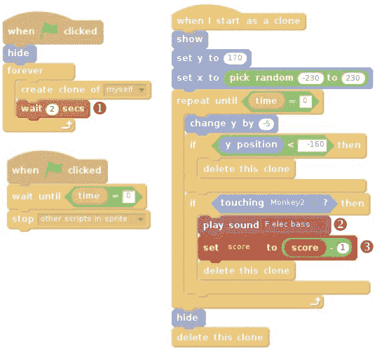

**图 19-12：** 控制腐烂香蕉的代码块

将 `wait` 块的值更改为 `2` ➊，这样每隔 2 秒就会生成一个新的 `Rotten` 克隆体，而不是每秒生成一个。另外，将音效块更改为播放 `F elec bass` ➋，并在 `set score to` 块中将分数减少 `1` ➌。记住，你必须先在音效选项卡中从库中添加这个音效。

腐烂香蕉的脚本完成后，接下来您将改变`Rotten`角色的颜色，使香蕉看起来腐烂。选择`Rotten`角色，点击**服装**选项卡。应该会弹出绘图编辑器屏幕（参见图 19-13）。

在窗口的右侧，选择桶图标 ➊；然后，在底部，选择不同的颜色 ➋ 来填充每个香蕉。选择棕色、橄榄绿和深绿等颜色，显示它们腐烂了。

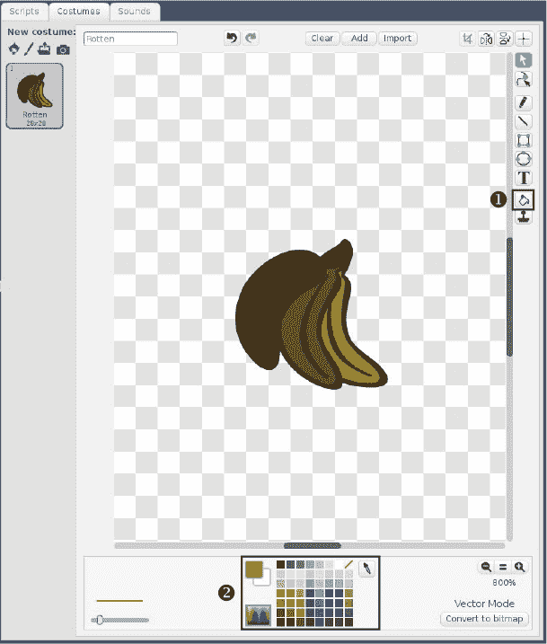

**图 19-13:** 编辑**Rotten**角色的颜色

### 玩游戏

恭喜！你的游戏已准备就绪。要在全屏模式下玩游戏，请点击舞台左上角的全屏图标，然后点击绿旗图标。在全屏模式下玩游戏能使其运行更加流畅和快速。

请记住，您可以使用按钮或键盘键来玩游戏。游戏结束时，只需点击绿旗图标即可重新开始。

### 进一步扩展

这个项目只是展示了您在 Scratch 中可以做的一小部分。以下是一些改进这个游戏的想法：

+   随着游戏的进行，增加香蕉的下落速度。

+   随着游戏的进行，增加腐烂香蕉的数量。

+   通过创建另一个角色并使用不同的控制方式，使这个游戏支持多人模式。（您需要添加另一个`score`变量来存储玩家 2 的分数。）

+   向您的电路中添加其他电子设备，您可以用 Scratch 接口连接，如按钮、蜂鸣器或传感器。

玩得开心，创造属于你自己的游戏吧！
