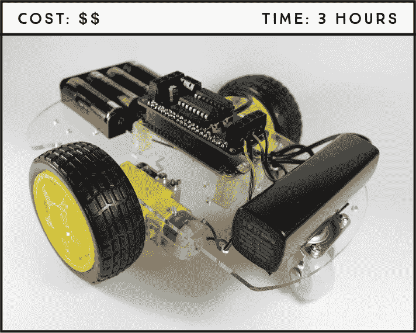
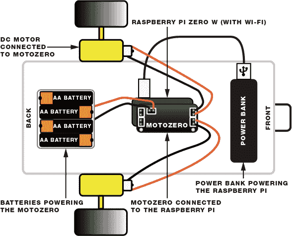
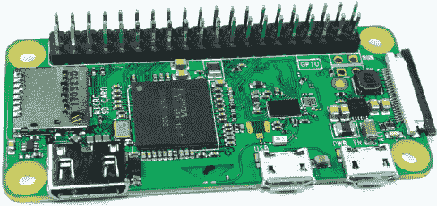
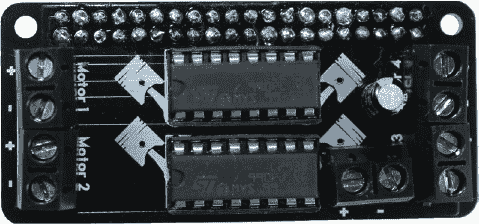
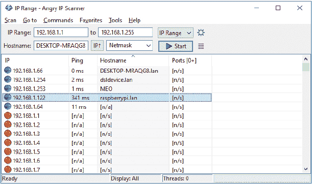
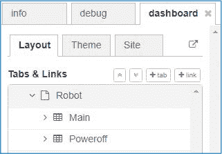
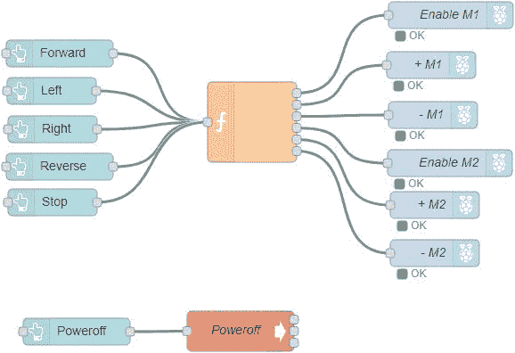
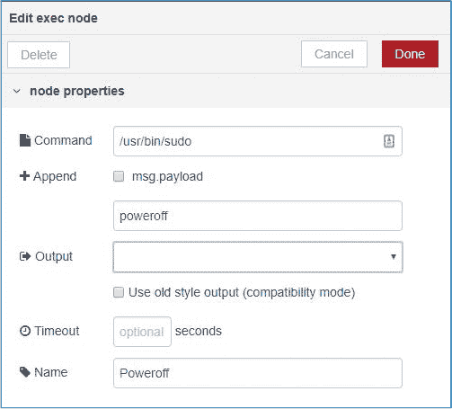
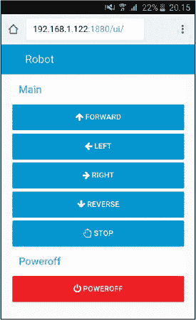

## 第二十一章：Wi-Fi 遥控机器人**

在这个项目中，你将使用 Raspberry Pi Zero W 和 MotoZero 扩展板构建一个两轮电池驱动的机器人。你可以通过你用 Node-RED 制作的 web 应用程序通过 Wi-Fi 控制它。



**所需部件**

Raspberry Pi Zero W（或其他 40 个 GPIO 引脚的树莓派）

智能机器人车底盘套件

MotoZero 扩展板（或其他电机控制器扩展板）

四个 AA 电池

便携式充电器

跳线

**所需软件**

Node-RED 仪表板

### 项目概要

在正式进入项目之前，我们将突出介绍机器人的关键部件，帮助你理解它的工作原理。

**Wi-Fi**

你将使用 Node-RED 应用程序来控制机器人，因此你的树莓派需要具有 Wi-Fi 功能。树莓派 3 和 Zero W 型号内置 Wi-Fi，但如果你的板没有，你可以使用与树莓派兼容的 Wi-Fi USB 适配器。

**树莓派板**

我们使用的是 Raspberry Pi Zero W，因为它的小巧尺寸非常适合小型机器人底盘。但任何配有 40 个 GPIO 引脚并支持 Wi-Fi 的树莓派版本都可以与此项目兼容。

**机器人底盘套件**

我们使用的是一个机器人底盘套件，套件中包含了构建机器人所需的所有组件，包括轮子、电机和螺丝。你可以在像 Amazon 或 eBay 这样的在线市场上搜索 *智能车机器人底盘套件* 来找到该套件。你需要配备两个直流电机的套件。

**MotoZero 扩展板**

直流电机将驱动机器人移动，你将使用一个名为 MotoZero 的扩展板来控制它们。你可以在网上的 The Pi Hut 找到该扩展板 (*[`thepihut.com/motozero/`](https://thepihut.com/motozero/)*)。你也可以使用任何其他与树莓派兼容的电机驱动扩展板，或者用 LC293D IC 芯片制作电路。我们这里不会介绍如何制作该电路，但如果你想自己制作，可以在网上找到很多相关教程。

**电源**

我们不想将树莓派机器人连接到墙上的插座，因为我们希望它具有便携性，因此我们需要通过便携式充电器或 *移动电源* 为机器人供电。移动电源必须能够输出 5 V 和 2 A。我们使用了一款容量为 2200 毫安时的移动电源进行测试，运行良好；如果使用更大容量的移动电源，机器人将能运行更长时间。

这些直流电机需要独立于树莓派供电，这意味着你需要两个独立的电源。为了为电机供电，我们使用了底盘套件中附带的电池盒，并配有四个 AA 电池，电池不包括在套件中。

**Node-RED 应用**

你将用来控制机器人的 Node-RED 应用应该能够让机器人前进、后退、左右移动并停止。由于你并非将树莓派作为桌面电脑使用，因此树莓派需要在启动时自动启动 Node-RED。你还会在应用程序中添加一个关闭按钮，这样就能远程关闭树莓派。

图 20-1 展示了您的机器人如何工作的概览。



**图 20-1：** 机器人结构

### 准备 Raspberry Pi

我们使用的是 Raspberry Pi Zero W 开发板，如图 20-2 所示，它是 Raspberry Pi Zero 的一种变体，内置了无线 LAN 和蓝牙，但请记住，您也可以使用其他支持 Wi-Fi 的开发板或 Wi-Fi 加密狗。Raspberry Pi Zero W 的尺寸仅为 2.56 英寸 × 1.18 英寸 × 0.20 英寸（65 毫米 × 30 毫米 × 5 毫米），价格约为 10 美元。

Pi Zero 具有 40 个 GPIO 引脚，排针与 Pi 3 相同。如图 20-2 所示，它配有一个迷你 HDMI 接口和两个 micro USB 接口，其中一个专门用于供电。要将 Pi Zero 用作桌面计算机，您需要一些额外的配件，比如 USB 集线器、USB 转 micro-USB 适配器和 HDMI 转 mini-HDMI 适配器来连接外设。为了节省一些费用，我们将在常规的 Raspberry Pi 3 上准备好一切，然后将 micro SD 卡切换到 Pi Zero W 上。



**图 20-2：** Raspberry Pi Zero W

我们建议为这个项目使用一张新的 micro SD 卡。请参阅“上传操作系统”在第 10 页查看如何在新的 micro SD 卡上安装最新的 Raspbian 版本。

安装操作系统后，将 micro SD 卡插入常规的 Pi 中。打开 Pi 并等待几秒钟以便系统启动。然后通过点击桌面右上角的**Wi-Fi**来配置 Wi-Fi。接着，输入您的 Wi-Fi 密码，并等待几秒钟直到 Wi-Fi 连接成功建立。

Node-RED 软件已经预装在 Pi 的操作系统中，但您仍然需要安装 Node-RED 仪表盘。为此，首先更新库仓库，然后通过在命令行中输入以下内容来安装 npm（Node 包管理）：

```
pi@raspberrypi:~ $ sudo apt update
pi@raspberrypi:~ $ sudo apt install npm
```

当提示时，键入 Y 并按 ENTER。安装可能需要几分钟。然后输入以下命令，将 npm 升级到推荐与 Node-RED 配合使用的最新 3.x 版本：

```
pi@raspberrypi:~ $ sudo npm install -g npm@3.x
pi@raspberrypi:~ $ hash –r
```

最后，输入以下命令来安装 Node-RED 仪表盘：

```
pi@raspberrypi:~ $ sudo npm install --unsafe-perm -g node-red-dashboard
```

再次提醒，Node-RED 需要在 Pi 启动时自动启动。为此，在终端中输入以下命令。

```
pi@raspberrypi:~ $ sudo systemctl enable nodered.service
```

完成这些后，关闭 Pi 并将 micro SD 卡切换到 Raspberry Pi Zero W 上。

### 接线电路

要构建机器人结构，您需要一个机器人的底盘、两个带有相应车轮的直流电动机、MotoZero 附加板、跳线和您的 Pi（带 Wi-Fi）。使用图 20-1 作为参考。我们将首先将 MotoZero 安装在 Raspberry Pi 顶部，然后将电动机连接到 MotoZero。

#### 将直流电动机接入 MotoZero

MotoZero 允许您独立控制四个电机，但您只需要控制两个直流电机。MotoZero 会是一个未组装的状态，因此您需要进行焊接。Pi Hut 在产品页面提供了组装手册，请访问 *[`thepihut.com/motozero/`](https://thepihut.com/motozero/)* 并按照上面的说明进行操作，组装完成后，您的 MotoZero 应该看起来像 图 20-3 中所示。



**图 20-3：** 组装好的 MotoZero 附加模块

图 20-3 展示了您可以连接到 MotoZero 的接口：四个直流电机的正极 (+) 和负极 (–) 连接，以及电源的正极 (+) 和负极 (–) 连接。驱动电机需要外部电源。电机需要较大的电流变化来启动，因此使用单独的电源可以防止 Pi 在电流变化时突然断电。

请按照这些说明操作，并参考 图 20-1 连接电机和电池座。

1.  将右侧直流电机的红线连接到 MotoZero 上电机 1 的正极 (+) 引脚，黑线连接到电机 1 的负极 (–) 引脚。您需要松开螺丝，将电线插入引脚插槽，然后重新拧紧螺丝。

1.  对左侧电机重复前面的操作，将电源线连接到 MotoZero 电机 2 的接口。

1.  在未插入电池的情况下，将电池座的红色线连接到 MotoZero 电源连接器的正极 (+) 引脚，黑色线连接到负极 (–) 引脚，如 图 20-3 所示的电路板底部。

**注意**

*如果您发现机器人的车轮旋转方向与预期相反，您可能需要交换直流电机红线与黑线的位置，分别连接到电机 1 或电机 2 的正极 (+) 和负极 (–) 端子。您可以在项目结束时测试应用程序，看看是否需要这样操作。*

#### 使用 MotoZero 控制电机

每个直流电机都有三个与之相关的 GPIO 引脚。其中一个引脚，称为 *启用* 引脚，用于启用电机，就像一个开关。另两个引脚控制电机正负极线的电源。给一根线提供电源并将另一根线接地，电机就会朝一个方向转动；而将电源和接地反向接到电机线的另一端，则使电机朝相反方向转动。

**注意**

*关于电机 3 和电机 4 的 GPIO 信息，您可以查看 Pi Hut 产品页面上的 MotoZero 手册* ([`thepihut.com/motozero/`](https://thepihut.com/motozero/))。

我们只使用电机 1 和电机 2 的端子，这些端子由下表中显示的 GPIO 控制，当您将 MotoZero 安装到 Pi 顶部时。

| **电机 1** | **电机 2** |
| --- | --- |
| 启用：GPIO 5 | 启用：GPIO 6 |
| 电机 1 (+)：GPIO 27 | 电机 2 (+)：GPIO 22 |
| 电机 1 (–)：GPIO 24 | 电机 2 (–)：GPIO 17 |

要让电动机旋转，启用引脚必须为高电平才能开启电动机，并且正负引脚中必须有一个且仅有一个为高电平。例如，如果你希望电动机 1 以某个方向旋转，可以使用以下设置：

+   GPIO 5: 高

+   GPIO 27: 高

+   GPIO 24: 低

要让同一个电动机旋转到相反的方向，可以使用以下设置：

+   GPIO 5: 高

+   GPIO 27: 低

+   GPIO 24: 高

要关闭电动机，你需要向所有 GPIO 发送低电平信号。其他电动机也遵循相同的逻辑。

### 编写应用程序

一旦硬件搭建完成，就可以开始创建 Node-RED 应用程序。由于你的 Pi 已经安装在机器人底盘上，最实际的做法是使用常规的桌面或笔记本电脑，并从那里控制它来创建机器人 Node-RED 应用程序。

首先，你需要找到 Raspberry Pi Zero W 的 IP 地址；你将使用它来访问 Pi 的 Node-RED 应用程序仪表盘，在那里你可以创建机器人应用程序。

在继续之前，你需要确保 Raspberry Pi 已经开机，并且你的计算机和 Pi 连接到同一网络。

#### 查找 Raspberry Pi IP 地址

**警告**

*Raspberry Pi Zero W 有两个迷你 USB 端口，其中一个标有 PWR IN，专用于为 Pi 提供电源。*

通过将 5V 电源适配器连接到墙面插座来启动 Raspberry Pi。在创建 Node-RED 应用程序时，你只需使用此电源；一旦完成，应该切换为便携电源。

你可以使用 Angry IP Scanner 软件找到 Pi 的 IP 地址。免费下载并安装到你的常规桌面或笔记本电脑上，网址为 *[`angryip.org/download/`](http://angryip.org/download/)*，然后按照提示完成安装。

安装完成后，打开 Angry IP Scanner 并点击 **开始** 按钮。等待几秒钟，直到显示可用的 IP 地址。你的 Pi IP 地址的主机名应该是 *raspberrypi.lan*，所以记下对应的 IP 地址。图 20-4 标出了我们的 Raspberry Pi IP 地址，即 192.168.1.122。



**图 20-4：** 使用 Angry IP Scanner 软件查找 Raspberry Pi 的 IP 地址

#### 创建 Node-RED 流程

**注意**

*关于 Node-RED 的介绍，请参见 第 17 项目。*

在你的常规计算机上，确保它与 Pi 处于同一网络，打开一个网页浏览器标签，访问 *http://<Pi IP 地址>:1880*，将 *<Pi IP 地址>* 替换为你之前记下的 Raspberry Pi IP 地址。在我们的例子中，我们访问了 *http://192.168.1.122:1880*。你的 Raspberry Pi Node-RED Web 服务器应该会打开。

在窗口的右上角，选择 **dashboard** 标签，在 **Layout** 标签内，创建一个名为 **Robot** 的标签。接下来，在该 Robot 标签中创建两个组，分别命名为 **Main** 和 **Poweroff**。Main 组是你将组织控制机器人按钮的地方，Poweroff 组是你将添加远程关闭树莓派按钮的地方。完成这些标签和组后，你的布局应如 图 20-5 所示。



**图 20-5：** Node-RED 应用程序仪表板布局

添加五个按钮、一个功能、六个 rpi gpio 输出节点和一个 exec 节点到流程中。连接节点并编辑它们的名称，使其与 图 20-6 中的名称匹配。



**图 20-6：** Node-RED 应用程序节点

编辑功能的属性，使其具有六个输出，并按 表 20-1 中所示分配所有节点的属性。

**表 20-1：** 分配给每个节点的属性

| **节点** | **属性** |
| --- | --- |

| 前进 | 组：Main [Robot] 大小：自动

图标：fa-arrow-up

标签：前进

有效载荷：前进 |

| 左 | 组：Main [Robot] 大小：自动

图标：fa-arrow-left

标签：左

有效载荷：左 |

| 右 | 组：Main [Robot] 大小：自动

图标：fa-arrow-right

标签：右

有效载荷：右 |

| 反向 | 组：Main [Robot] 大小：自动

图标：fa-arrow-down

标签：反向

有效载荷：反向 |

| 停止 | 组：Main [Robot] 大小：自动

图标：fa-hand-paper-o

标签：停止

有效载荷：停止 |

| f | 功能：输入 清单 20-1 中的代码 输出：6 |
| --- | --- |
| 启用 M1 | GPIO: GPIO5 – 29 类型：数字输出 |
| + M1 | GPIO: GPIO27 – 13 类型：数字输出 |
| – M1 | GPIO: 18 – GPIO24 类型：数字输出 |
| 启用 M2 | GPIO: GPIO17 – 11 类型：数字输出 |
| + M2 | GPIO: GPIO6 – 31 类型：数字输出 |
| – M2 | GPIO: GPIO22 – 15 类型：数字输出 |

| Poweroff | 组：Poweroff [Robot] 大小：自动

图标：fa-power-off

标签：Poweroff

背景：红色 |

| exec | 命令：`/usr/bin/sudo` + 附加：未选中

poweroff

名称：Poweroff |

图 20-7 显示了 exec 节点的设置。



**图 20-7：** exec 节点属性

所有节点应属于 Main 组，除了 Poweroff 按钮，它应属于 Poweroff 组。

#### 输入脚本

将 清单 20-1 中的 JavaScript 代码（也可以从 *[`www.nostarch.com/RaspberryPiProject/`](https://www.nostarch.com/RaspberryPiProject/)* 下载）插入到功能节点：

**清单 20-1：** 远程控制机器人脚本

```
➊ var msg1 = { payload: 0 };
  var msg2 = { payload: 0 };
  var msg3 = { payload: 0 };
  var msg4 = { payload: 0 };
  var msg5 = { payload: 0 };
  var msg6 = { payload: 0 };
➋ if (msg.payload === "forward") {
     msg1.payload = 1;
     msg2.payload = 1;
     msg4.payload = 1;
     msg5.payload = 1;
  }
  else if (msg.payload === "left") {
     msg1.payload = 1;
     msg2.payload = 1;
  }
  else if (msg.payload === "right") {
     msg4.payload = 1;
     msg5.payload = 1;
  }
  else if (msg.payload === "reverse") {
     msg1.payload = 1;
     msg3.payload = 1;
     msg4.payload = 1;
     msg6.payload = 1;
  }
➌ return [msg1, msg2, msg3, msg4, msg5, msg6];
```

此功能将消息按连接顺序发送到连接的 rpi gpio 输出节点。这意味着 `msg1` 被发送到启用 M1 节点，`msg2` 到 + M1，`msg3` 到 – M1，依此类推（见 图 20-6）。

首先，你将所有有效载荷消息变量值初始化为 `0` ➊。然后，`if` 和 `else if` 语句系列检查哪个按钮被按下 ➋，这取决于函数接收到的有效载荷，并根据机器人应执行的操作设置消息值。例如，如果按下前进按钮，函数节点接收到的有效载荷为 `forward`，因此在 ➋ 处的条件成立，代码将 `msg1`、`msg2`、`msg4` 和 `msg5` 的有效载荷值改为 `1`，而 `msg3` 和 `msg6` 保持为 `0`。

然后，函数节点将 `msg.payload` 值发送到相应的节点 ➌。为了让机器人前进，有效载荷需要是：

+   启用 M1: `1`

+   + M1: `1`

+   – M2: `0`

+   启用 M2: `1`

+   + M2: `1`

+   – M2: `0`

在这里，两个电机都已启用，并且都朝同一方向转动——前进。下表显示了每个动作函数应该向每个节点发送的消息。

| **动作** | **启用 M1** | **+ M1** | **– M1** | **启用 M2** | **+ M2** | **– M2** |
| --- | --- | --- | --- | --- | --- | --- |
| 前进 | 1 | 1 | 0 | 1 | 1 | 0 |
| 左转 | 1 | 1 | 0 | 0 | 0 | 0 |
| 右转 | 0 | 0 | 0 | 1 | 1 | 0 |
| 后退 | 1 | 0 | 1 | 1 | 0 | 1 |
| 停止 | 0 | 0 | 0 | 0 | 0 | 0 |

当点击停止按钮时，代码中没有任何条件被满足，函数将发送初始化时的值 ➊。

在函数节点外部，当点击 Poweroff 按钮时，exec 节点执行 `poweroff` 命令来关闭 Pi。记得你已经在 `exec` 命令属性中填入了 */usr/bin/sudo/poweroff*——参见 表 20-1。

一切就绪后，点击右上角的 **部署** 按钮以保存更改并运行流程。

#### 运行应用程序

现在你的 Node-RED 应用程序已经准备好了。前往 *http://<Pi IP 地址>:1880/ui*（将 *<Pi IP 地址>* 替换为你自己的地址）查看应用程序仪表盘。它应该看起来像 图 20-8。

测试控制是否能够让车轮朝正确方向转动，别忘了你需要将四个 AA 电池插入电池座中，以便为电机供电。

如果一个或两个电机转动方向错误，交换 MotoZero 上该电机端口的黑色和红色线，或者更改有效载荷消息以匹配所需的方向。



**图 20-8：** Node-RED 应用程序用于远程控制机器人

### 启动机器人

现在应用程序已经准备就绪，点击 **Poweroff** 按钮关闭 Pi。然后等待几秒钟，直到它关闭。

将 Pi 的电源从墙壁插座切换到电源银行。等待几分钟，直到 Pi 启动并自动启动 Node-RED。在与 Pi 同一网络上的智能手机或其他设备上，打开一个新的浏览器标签页并访问 *http://<Pi IP 地址>:1880/ui*。然后点击按钮，远程控制你的机器人。

恭喜你——你现在拥有了一台 Wi-Fi 控制的机器人！

### 进一步拓展

你的机器人还有很多升级的空间。以下是一些需要硬件和软件更改的升级想法。你需要稍微实验一下 Node-RED 来使这些功能正常工作：

+   获取一个四轮机器人底盘，控制四个电机而不是两个。

+   为机器人添加 LED 灯和蜂鸣器，使其更加互动。

+   添加传感器，如超声波传感器，让机器人能够自动避开障碍物。
