## 第一章：开始使用树莓派

当我开始我的第一个树莓派俱乐部时，几个人以为这是一个烹饪俱乐部。他们来时以为会做蛋糕、馅饼和其他甜点。回想起来，我想从某种意义上说，他们是对的。树莓派使你能够制作东西。你可能不会做甜点，但就像烘焙一样，你跟随食谱从几个不同的组件中构建出某种东西，并加入自己的创意。或者，你也可以完全偏离轨道，做自己想做的事情。树莓派最终是一个用于发现、创造和学习的工具。

就像一本食谱书，这本书包含了 12 个有趣的项目的说明。然后，你可以将所有章节中的元素和技能结合起来，创造自己的黑客项目。每一章都是独立的，意味着它涵盖了完成项目所需的所有技能、内容和技术。

本章介绍了如何开始使用你的树莓派的基本内容，包括如何设置它、将其连接到互联网以及如何将文件传输到它。 本章还是你进行树莓派常见任务的参考。如果你已经熟悉树莓派和 Python 编程语言，可以跳过到第三章并开始进行热胶夜灯项目。

### 什么是树莓派？

树莓派是一台大小约为信用卡的微型计算机。但许多人第一次看到它时会说：“那不是计算机！它没有屏幕。”

像所有台式计算机一样，你可以将屏幕或显示器连接到你的树莓派。但是，计算机并不需要屏幕；它只是一个进行计算的设备，意味着它接受输入，处理输入，然后通常输出某些东西。即使是电视的遥控器也是一台计算机，尽管你可能没有把它当作计算机来看待。当你使用遥控器时，你按下频道号，这是输入。频道改变了，这是输出。中间控制频道变化的部分叫做“过程”。

自 2012 年 2 月发布以来，树莓派已成为英国最畅销的计算机。它由 Ebon Upton 创造，目的是通过一个价格低廉、易于获取且有趣的设备来促进计算机科学的教学。树莓派系列随后扩展到了多个不同版本的计算机，以满足各种需求和能力。

### 树莓派的硬件

树莓派的*硬件*由设备的物理部分组成——也就是你可以触摸或拿起来的部分。换句话说，硬件就是树莓派的主板。树莓派之所以能如此小巧且廉价，是因为它是一个*系统单芯片*（*SoC*），或者是一个包含计算机所有主要组件的单一板子，类似于智能手机中使用的那些。我们将在本节中讲解树莓派主板的特点，从六种树莓派型号的区别开始。

#### 树莓派 4

本书中的项目可以在大多数 Raspberry Pi 型号上完成。最新的型号 Raspberry Pi 4（图 1-1）具有最高的规格，且价格与早期型号相同。它支持 2.4 GHz 和 5GHz Wi-Fi，为下载和更新提供了快速的 Wi-Fi 连接。

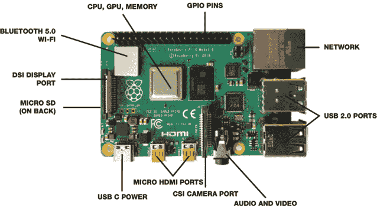

**图 1-1** Raspberry Pi 4

你可以以大约 35 美元购买 Raspberry Pi 4。它可以运行多种程序，包括 Open Office、Java 和 Minecraft Pi Edition。该板卡具有双 HDMI（高清）端口，可以将现有的电视或显示器连接为显示器或双屏显示。图形芯片（GPU）还支持 4k 视频播放和显示。

#### 其他型号

虽然我推荐在本书中使用 Pi 4，但其他 Raspberry Pi 型号也可以完成大多数项目的工作。我不会讨论每个 Raspberry Pi 型号的硬件规格，但下面的表格将对它们进行比较。

| **型号** | **处理器** | **核心** | **RAM** | **USB 端口** | **蓝牙** | **Wi-Fi** |
| --- | --- | --- | --- | --- | --- | --- |
| 4 | 1.5 GHz | 4 | 1GB、2GB 或 4GB | 4 | 是 | 是（2.4 & 5 GHz） |
| 3B+ | 1.4 GHz | 4 | 1GB | 4 | 是 | 是（2.4 & 5 GHz） |
| 3A+ | 1.4 GHz | 4 | 512MB | 1 | 是 | 是（2.4 & 5 GHz） |
| 3 | 1.2 GHz | 4 | 1GB | 4 | 是 | 是 |
| 2 | 900 MHz | 4 | 1GB | 4 | 否 | 否 |
| Pi Zero W | 1 GHz | 1 | 512MB | 1（micro USB） | 是 | 是 |
| Pi Zero | 1 GHz | 1 | 512MB | 1（micro USB） | 否 | 否 |

Raspberry Pi 的关键组件是其大脑，称为*处理器*，它负责处理所有接收到的指令。处理器速度越快，它每秒能完成的指令越多。例如，4 型号的处理器速度为 1.5 GHz（处理器速度以千兆赫兹为单位）。*千兆*前缀表示 10 亿，而*赫兹*表示每秒发生的次数。因此，4 型号的处理器每秒能处理 1,500,000,000 条指令。这可是真正的处理能力！

*核心*一词指的是处理器的处理单元数。可以想象一下拥有两个甚至四个大脑！4 型号的处理器有四个核心，这意味着它有四个处理器；每个处理器每秒可以处理最多 1,500,000,000 条指令。这意味着它每秒最多可以处理 6,000,000,000 条指令！这就是为什么你可能会发现 Raspberry Pi 非常热，尤其是在接近处理器的位置。

所有这些处理能力都是有用的，但 Pi 需要一个地方来存储所有这些指令，这就是*随机存取存储器*（*RAM*）的作用。RAM 是用于存储数据的高速内存。你的 Pi 拥有的 RAM 越多，它就能存储和读取更多的指令，直到内存填满为止。一旦 RAM 满了，你的 Pi 就开始变慢，因为必须删除冗余指令并将新的指令写入 RAM。因此，Pi 的 RAM 越多，它的表现就越快。

你可以使用 USB C 电缆为 Pi 4 提供电源，这种电缆与许多手机充电器使用的是相同的。其他型号使用 micro USB。你还可以使用 USB 端口连接键盘和鼠标。

从树莓派 3 型号开始，所有树莓派型号都内建了蓝牙和 Wi-Fi 芯片，提供无线连接功能，同时还有一个以太网端口供有线连接使用。对于媒体项目，树莓派提供了标准 HDMI 端口、3.5 毫米音频端口，可以输出声音和视频；还有一个 CSI 端口，你可以连接树莓派摄像头；以及一个显示端口，可以连接官方树莓派显示屏。

#### GPIO 引脚

每个树莓派型号从 B+ 型号开始，板上都有 40 个金色 GPIO 引脚，如图 1-2 所示。

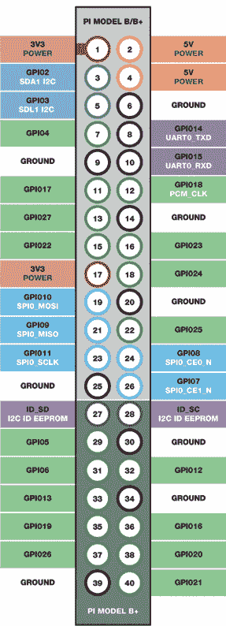

**图 1-2** 树莓派 GPIO 引脚布局

每个引脚有不同的功能，例如提供电源、读取传感器数据等，允许你创建电路。例如，如果你将 LED 的一端接到引脚 18，另一端接到地线引脚，你就可以通过一个简短的程序来开关 LED。地线引脚电压为零，通常用作测量电压的参考点。

令人困惑的是，GPIO 引脚有两种标准来进行标识和编号。一种标准叫做*BOARD 编号* *系统*。使用这种系统，你通过树莓派上每个引脚的物理位置来标识它们。编号从左上角的引脚开始，它是编号一。右上角的引脚是编号二，其余的引脚按顺序编号，从这一行开始。*树莓派基金会标准*，这是更常见的引脚编号系统，使用*Broadcom SoC 通道*（*BCM*）编号系统。BCM 编号系统通过 SoC 芯片内使用的通道编号来标识每个引脚。例如，板上的物理引脚 40 是通道 21，所以你称它为 GPIO 21。参见图 1-2 以查看这些 GPIO 编号。在本书的早期章节中，我将同时使用物理*和* BCM 编号来帮助你理解两者。标准做法是使用 BCM 编号系统。

### 设置你的树莓派

设置树莓派时，你需要以下物品：

+   USB 键盘

+   USB 鼠标

+   至少 8GB 的 micro SD 卡

+   官方树莓派电源适配器，或者为 Pi 4 型号提供 15.3 W 5.1V 3A 电源的 USB C 充电器，或者为其他所有型号提供 2.5A 电源适配器（如手机充电器）

+   显示器（计算机显示器或电视）

你还需要一台带有互联网连接的笔记本或台式计算机，用于下载将运行并操作你的树莓派的所需软件。

要使用硬件，你需要*软件*。软件是一组指令，告诉树莓派在接收到某些输入时该做什么。当你按下键盘上的一个键、点击屏幕上的图标或移动鼠标时，树莓派会执行相应的操作。软件还控制着使你能够使用树莓派的各种进程。

你需要的最重要的软件是*操作系统*，它使你能够运行所有其他的软件。常见的操作系统包括 Windows、iOS、Android 和 Linux。虽然树莓派可以运行多种不同的操作系统，但你将使用专为树莓派打造的*Raspbian*操作系统。这个软件是免费的开源软件，意味着你可以使用、定制并与他人分享它。

#### 下载操作系统

在你的联网笔记本或台式电脑上，打开浏览器并访问*[`www.raspberrypi.org/downloads/`](https://www.raspberrypi.org/downloads/)*。树莓派官网的这个页面列出了可用的操作系统。

点击**Raspbian**进入下载页面。你会看到*带桌面和推荐软件的 Raspbian Buster*选项（参见图 1-3）。这个选项包含了所有推荐的软件。点击**下载 ZIP**，开始将 ZIP 文件下载到你的计算机。下载完成后，找到并打开 ZIP 文件，查看操作系统镜像文件。通过复制粘贴或拖放，将该文件提取到新位置。

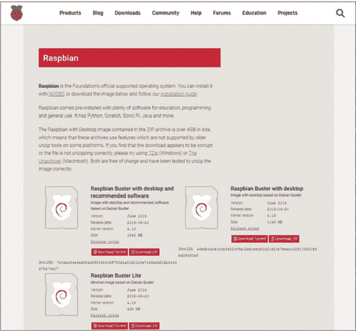

**图 1-3** 从树莓派官网下载安装 Raspbian 操作系统。

#### 安装操作系统

你需要将操作系统镜像写入你的 micro SD 卡（参见图 1-4），因此你可能需要一个 micro SD 适配器，以便将其插入你的计算机。

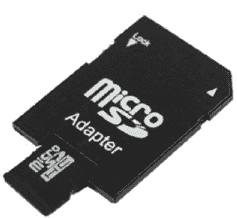

**图 1-4** 一款 micro SD 卡转换器

将操作系统写入 SD 卡的最简单方法是下载一款免费的软件——*Etcher*。

##### 下载 Etcher

访问*[`etcher.io/`](https://etcher.io/)*，点击**下载**按钮（它应该能自动检测你计算机的操作系统，如果没有检测到，可以点击下拉箭头并在列表中选择适当的系统）。

当 Etcher 下载完成后，双击文件打开它。它会询问你是否要安装该程序。点击**我同意**来安装它。安装程序文件到你的计算机上需要几分钟时间。

##### 将操作系统写入 SD 卡

现在你准备好将操作系统写入 SD 卡了。将你的 micro SD 卡插入转换器中。然后在你的互联网连接电脑上找到 SD 卡槽并插入。等待 SD 卡加载并且电脑识别它。通常情况下，电脑会发出声音，提示它已经识别到 SD 卡。打开 Etcher 程序，点击第一个**镜像**按钮，然后选择你刚刚下载的*Raspbian.img*文件的位置。

点击**选择驱动器**，然后从驱动器列表中选择你的 micro SD 卡。最后，点击**写入！**按钮，将镜像写入 SD 卡（图 1-5）。这个过程需要几分钟时间，等候时可以继续阅读。

如果你遇到问题或卡住了，可以参考树莓派官网提供的更详细的安装指南，网址为*[`www.raspberrypi.org/documentation/installation/installing-images/`](https://www.raspberrypi.org/documentation/installation/installing-images/).* 这里还有一本免费的详细用户指南：*[`www.raspberrypi.org/magpi-issues/Beginners_Guide_v1.pdf`](https://www.raspberrypi.org/magpi-issues/Beginners_Guide_v1.pdf)*。

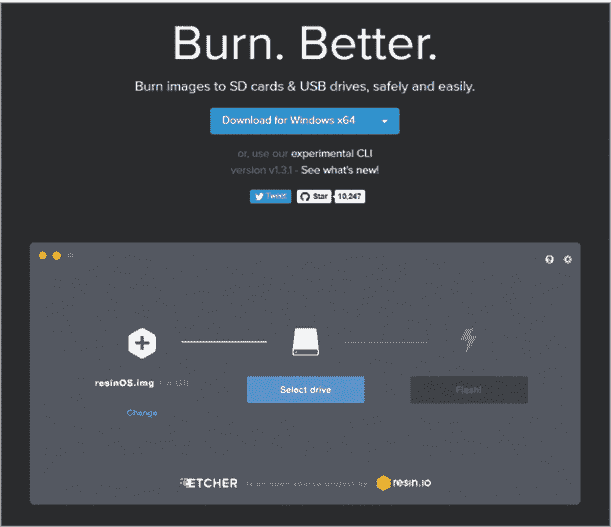

**图 1-5** 将操作系统写入 SD 卡

#### 设置你的树莓派设备

通过任何一个 USB 端口将你的 USB 键盘和鼠标连接到树莓派上。然后使用 HDMI 线将你的显示器连接到树莓派。

一旦操作系统完成写入 micro SD 卡，从电脑中弹出卡片并从转换器中取出。翻转你的树莓派，将卡片插入 SD 卡槽，直到卡片稳固为止。连接你的鼠标、键盘和 HDMI 显示器。然后将电源适配器插入树莓派的电源端口，并将另一端连接到主电源插座。打开电源并开启显示器。

#### 启动你的树莓派

几秒钟后，你将看到屏幕上的活动。通常，你会看到一条彩色的彩虹图案，意味着图形正在加载。接着，显示器会显示树莓派的标志，这意味着树莓派正在启动并加载操作系统。

操作系统的程序代码会在屏幕上运行几行，然后才会显示出如图 1-6 所示的主桌面。开机时间取决于你使用的树莓派型号（最快的是型号 4，最慢的是 Pi Zero 和原始型号）。


**图 1-6** Raspbian 操作系统桌面

#### 配置你的树莓派

Raspbian 操作系统有许多不同的设置和配置，你可以用它们来定制你的树莓派。例如，你可以增加为图形芯片分配的内存，以使 Minecraft 等游戏运行得更流畅。你还可以重新命名你的树莓派、更改密码以及进行其他修改。

当你第一次启动 Pi 时，系统会自动要求你配置一些功能。你首先看到的屏幕是一个设置窗口，如图 1-7 所示。点击**下一步**继续。

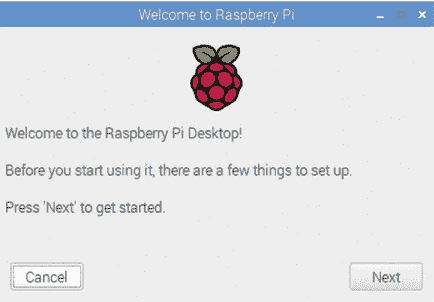

**图 1-7** 初始配置开始

现在，你将看到设置位置的选项。这一步至关重要，它能确保你能够在所在国家/地区连接互联网，设置正确的键盘布局，并确保 Pi 的时间准确。选择你的国家、语言和时区，如图 1-8 所示，然后点击**下一步**。（如果你在美国，记得选择**使用美国键盘**。）

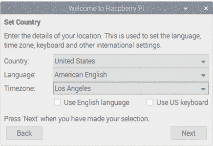

**图 1-8** 设置所需的本地化

接下来的选项窗口会提示你更改密码，如图 1-9 所示。默认密码是*raspberry*，直到你更改它。这意味着任何人都可以登录并访问你的 Pi。如果你想更改密码，现在可以进行更改，但请确保记住，它不再是默认密码，这一点在后续章节中我会使用。

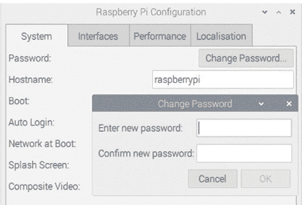

**图 1-9** 更改默认密码

现在，配置向导会搜索所有可见的 Wi-Fi 网络并列出它们。你可以从列表中选择你的网络连接。接下来，系统会提示你输入 Wi-Fi 密码，如图 1-10 所示。点击**下一步**以连接。如果你决定跳过此设置，需要更改 Wi-Fi 连接设置，或想连接到其他 Wi-Fi 网络，你将需要运行配置工具，相关内容见“上线”部分，参见第 18 页。

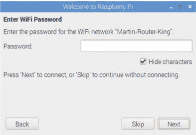

**图 1-10** 配置 Wi-Fi

接下来，系统会提示你调整屏幕大小；只有在图片周围有黑色边框并且未填满整个屏幕时，你才需要执行此操作。点击**下一步**按钮。

最后的窗口会自动检查并下载任何操作系统更新，然后安装它们，如图 1-11 所示。这可能需要一些时间。

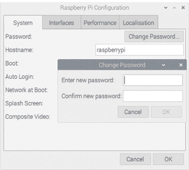

**图 1-11** 更新软件

桌面包括树莓派的 Logo、垃圾桶图标以及屏幕左上角的主任务栏。

#### 树莓派操作系统快速浏览

任务栏上的第一个图标是树莓派 Logo，点击它可以打开操作系统的主菜单和子菜单（如图 1-12 所示）。所有你加载到树莓派上的程序都会按类别进行分组，以便于查找。例如，你可以在“游戏”菜单中找到 Minecraft。如果你想创建一个文档——比如说，一封信——你可以在“办公”菜单中找到相关软件。要打开菜单中的程序，只需点击它。如果程序图标在桌面上，双击即可打开。

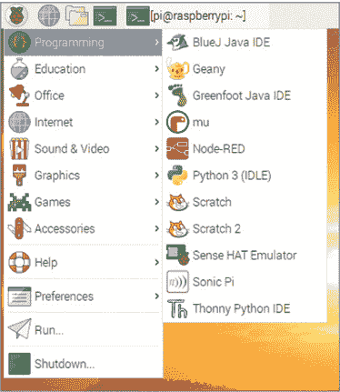

**图 1-12** 使用屏幕顶部的任务栏访问包含软件的菜单。

图 1-13 显示了任务栏中的其余图标。


**图 1-13** Raspbian 操作系统任务栏

第二个图标 ❶ 打开互联网浏览器 *Chromium*。你需要连接到 Wi-Fi 网络才能访问互联网。我将在“上网”部分讲解这个过程，详见 第 18 页。

接下来是文件夹图标 ❷，你将使用它来查看和管理文件及文件夹。你可以使用该工具创建、删除、重命名、复制和移动文件。

第四个图标 ❸ 打开 *终端*，这是一个工具，允许你通过代码行（称为 *命令*）而不是鼠标点击来导航 Raspberry Pi，安装和删除软件以及执行其他任务。我将在下一节中详细介绍终端。

在任务栏的右侧，你会看到 图 1-14 中显示的图标。

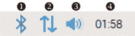

**图 1-14** 任务栏右侧的图标

第一个图标 ❶ 打开和关闭蓝牙，并连接到支持蓝牙的设备。接下来的图标是 Wi-Fi 图标 ❷，它显示你是否已连接到网络以及当前的信号强度。你还可以在这里查看可用的 Wi-Fi 网络，连接或断开连接。

第三个图标 ❸ 打开音量管理对话框，允许你选择输出声音的设备。右键点击该图标以选择扬声器、HDMI 显示器或蓝牙设备。

你可能想要显示 Pi 的处理器正在执行的工作量，这样你就能了解你正在消耗多少处理能力。ARM 处理器是 Raspberry Pi 的大脑，负责处理所有的数字运算和程序指令，它每秒能处理多达 1,500,000,000 条指令，具体取决于你使用的是哪个型号。右键点击任务栏，然后选择 **添加/移除面板项** 选项。如果你点击“添加”按钮，你应该能看到 CPU 使用监视器图标。选择添加它。该图标显示一个百分比：20% 表示当前任务占用了 Raspberry Pi 约 20% 的处理能力。有时它会飙升至 100%，通常意味着你打开了很多程序或运行了图形密集型软件。如果你的 Pi 无响应，可以检查这个工具。如果它显示为 100%，请等待直到数字下降再进行下一个操作。

第四个图标 ❹ 显示当前的时间和日期（这样你就能检查自己花了多少时间在“黑客攻击”上！）。当你插入 USB 闪存驱动器或存储棒时，最后一个图标会出现。存储棒对于在 Raspberry Pi 和其他计算机之间传输和备份文件非常有用。你还可以使用这个图标安全地弹出你的大容量存储设备。

#### 配置你的 Raspberry Pi

你可以使用树莓派配置工具访问和更改之前的设置。要打开该工具，请点击树莓派图标并加载主菜单。点击**首选项**选项。向下滚动至首选项列表底部的**树莓派配置**选项(图 1-15)并点击它。配置工具应该会打开。

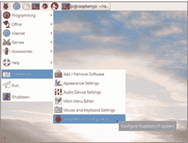

**图 1-15** 点击配置工具以更改你的首选项。

在接下来的子章节中，我将概述你可能想要使用此配置工具更改的设置。

##### 系统标签

该工具的“系统”标签(图 1-16)包含一个按钮，用于更改密码。回想一下，当你启动树莓派时，你无需登录或输入密码，因为操作系统自带一个默认帐户。该帐户的用户名是*pi*，密码是*raspberry*。要更改密码，请点击**更改密码**，并输入你的新密码。在“更改密码”下方是主机名字段，你可以在这里重命名你的树莓派。如果你有多个 SD 卡，而其中一个是用于特定项目的，这很有用。只要记住你选择的名称，因为在后续章节中，你必须使用这些名称，而不是默认的名称。

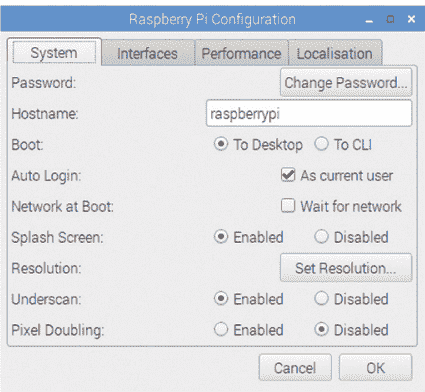

**图 1-16** 使用“系统”标签更改你的密码或重命名你的设备。

“系统”标签还提供了将树莓派启动到桌面或*命令行界面*（*CLI*）的选项。如果你使用过 Windows，桌面应该很熟悉；它包括背景图像、图标和菜单，你可以点击它们来打开程序。你还可以使用鼠标点击、选择和滚动。CLI 是一个纯文本界面，你通过键盘输入文本命令来控制操作系统和树莓派。关于 CLI 的更多细节，你可以参见第 20 页的“使用命令行”章节。

通过取消选择“自动登录”框，你可以要求用户登录，从而为你的树莓派增加一个额外的安全层。你还可以调整树莓派的屏幕输出分辨率，使屏幕上的文本易于阅读，图标大小适合你的显示器。

##### 接口

接口是计算机、硬件、软件和人类之间共享数据的一种方式。例如，*图形用户界面*（*GUI*）使你能够通过按钮和菜单与树莓派进行交互。*键盘*接口使你能够控制设备或输入数据。

树莓派配置工具的“接口”标签(图 1-17)允许你启用或禁用各种软件和硬件接口。

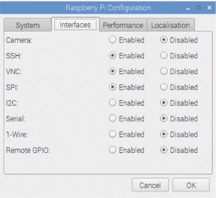

**图 1-17** 在配置工具中启用或禁用接口。

如果您使用的是 Pi 摄像头，如在自拍相机、Minecraft 黑客和自然盒子项目中所用，您需要在此选项卡中启用它才能正常工作。我们会在需要时进行设置，所以现在不用担心。

##### 性能

在性能选项卡上，您可以使用 GPU 内存字段（图 1-18）来增加或减少可用于处理图形的内存量。如果您正在处理图像、游戏或视频，您需要增加 GPU 内存。然而，如果您的项目使用命令行或不需要屏幕，您可以减少 GPU 内存，这样可以释放更多内存给处理器使用。

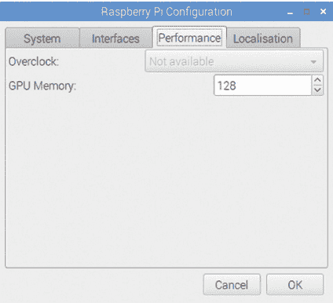

**图 1-18** 在性能选项卡上增加或减少 GPU 内存。

现在，保持设置不变。

##### 本地化

本地化选项卡（图 1-19）包含您所在国家和地区的设置。配置这些设置可以确保 Raspberry Pi 能够访问在线软件仓库并连接互联网。在此选项卡上，您还可以更改时区，调整键盘布局以符合您的偏好，并选择位置和首选语言。

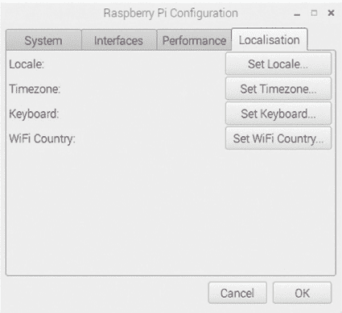

**图 1-19** 在本地化选项卡上选择您的国家和地区。

完成后，点击**确定**关闭配置工具。

#### 上网

要充分发挥 Raspberry Pi 的潜力，您需要连接互联网。内置的网页浏览器使您可以像使用其他任何联网设备一样浏览网站和内容。然而，与平板电脑或手机不同，当您使用 Raspberry Pi 上网时，您可以通过终端更新操作系统和安装软件（我很快会告诉您如何做）。您还可以从其他设备远程访问 Raspberry Pi，并在 Pi 和设备之间传输文件。这也意味着您可以断开 Pi 与显示器、键盘和鼠标的连接并远程使用它。远程使用 Pi 对于创建 Pi 间谍、魔术音乐盒、自然盒子和社交媒体镜像项目时会非常有用。

##### 连接到互联网时连接显示器

当您首次启动 Raspberry Pi 时，它会尝试连接到您的 Wi-Fi。如果您更改位置或时区，您需要重新配置 Wi-Fi。在 Raspberry Pi 配置工具中，点击**本地化**选项卡，然后点击**设置 WiFi 国家**。弹出一个窗口，您可以从列表中选择当前国家。图 1-20 展示了这个整个过程。选择好国家后，点击**确定**并关闭配置工具。

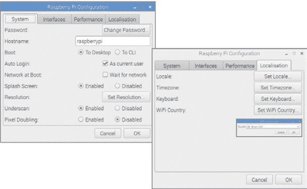

**图 1-20** 点击**设置 WiFi 国家**以选择您当前的国家。

现在你可以开始扫描可用的 Wi-Fi 网络了。定位任务栏右侧的 Wi-Fi 符号（图 1-21），点击它查看可用网络列表。找到你的网络，点击它，并在有密码的情况下输入 Wi-Fi 网络密码。完成后，树莓派将连接到 Wi-Fi，你就可以上网了。现在，每次启动树莓派时，它将默认尝试连接到此 Wi-Fi 网络。

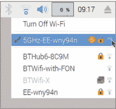

**图 1-21** 连接到你的 Wi-Fi 网络。

##### 通过 SD 卡连接互联网

当你无法访问显示器时（这被称为 *无头模式*），你可以通过 SD 卡连接互联网。你可以提前编程你的 SD 卡，当你将其插入树莓派并启动时，它会自动连接到 Wi-Fi。这对于你在户外设置的项目也很有用，例如本书后面提到的 MP3 播放器或自然盒子。

要编程 SD 卡，关闭树莓派电源，拔掉电源线，然后弹出 micro SD 卡。将 SD 卡插入转换器，然后插入电脑或笔记本的 SD 卡读卡器中。在文件浏览器中打开它（图 1-22）。

在 SD 卡的主目录中，通过右键点击鼠标并创建一个新的文本文件来创建一个名为 *wpa_supplicant.conf* 的新文件；然后按回车键。下载并安装 Notepad++文本编辑器，访问 *[`notepad-plus-plus.org/`](https://notepad-plus-plus.org/)*。在 Notepad++中打开该文件，添加以下代码行：

```
ctrl_interface=DIR=/var/run/wpa_supplicant GROUP=netdev
network={
  ssid="YOUR_NETWORK_NAME"
  psk="YOUR_PASSWORD"
  key_mgmt=WPA-PSK
}
```

这个文件存储在 SD 卡的启动分区中，这意味着当树莓派启动时，它会从中加载并读取此文件，从而连接到互联网。将 YOUR_NETWORK_NAME 替换为你要连接的 Wi-Fi 网络名称，将 YOUR_PASSWORD 替换为该网络的密码。保存文件。弹出 SD 卡并将其放入树莓派中。下次树莓派启动时，它将使用提供的凭据连接到 Wi-Fi。

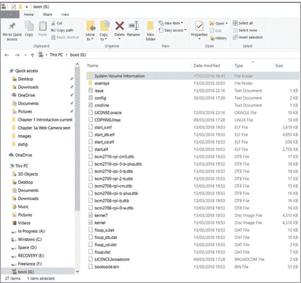

**图 1-22** 在电脑的文件浏览器中打开 micro SD 卡。

如果你更喜欢使用有线连接来访问互联网，你可以使用标准以太网线连接到你的网络。将一端连接到路由器，另一端连接到树莓派的以太网端口。请注意，树莓派 Zero 型号没有以太网端口。

### 使用命令行

到目前为止，我们已经看过了 Raspbian 操作系统的 GUI 元素——换句话说，就是通过点击屏幕上的按钮来访问的部分。但操作系统也提供了一个 *命令行*，你可以通过终端访问它。点击任务栏中的终端图标，在新窗口中打开终端，如图 1-23 所示。

命令行让你输入指令来控制你的树莓派。一旦你熟悉了它，你将能够比使用鼠标和图形用户界面（GUI）更快速地完成任务。

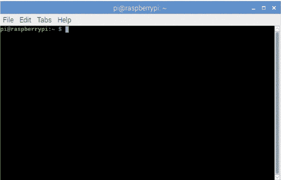

**图 1-23** 终端

注意，终端中已经包含了这段文本：`pi@raspberrypi:- $`。这就是*提示符*；它包含了你当前登录的用户名（pi）以及你所在的文件夹信息，你稍后会看到。当用户名后面没有斜杠（`/`）和文件夹名称时，你就在主目录。

为了说明使用 GUI 和使用终端的区别，假设你要创建一个名为*sounds*的新文件夹。使用 GUI 时，你需要执行以下步骤：

1.  将鼠标移至文件夹图标。

1.  点击它。

1.  右键点击窗口。

1.  向下滚动至新文件夹图标。

1.  点击它。

1.  将文件夹命名为*sounds*。

1.  按 ENTER 键。

使用终端，你只需输入以下命令（不包括提示文本）来创建新文件夹：

```
pi@raspberrypi:- $ mkdir sounds
```

命令`mkdir`是“make a directory”（创建目录）的缩写。这个过程比使用 GUI 快得多。缺点是你需要学习并记住这些命令，但随着时间的推移，你会变得熟悉它们。以下表格包含了一些常用且有用的命令行指令，供你尝试。

| **指令** | **作用** |
| --- | --- |
| `cd` foldername | 进入某个文件夹（将 foldername 替换为你想进入的文件夹名称） |
| `cd ~` | 进入主目录 |
| `cd` | 从任何文件夹返回主文件夹 |
| `cd /home/pi` | 进入名为*pi*的文件夹 |
| `ls` | 列出当前文件夹中的所有文件 |
| `mkdir` filename | 创建新文件夹（将 filename 替换为你的文件夹名称） |
| `ifconfig` | 查找你的 IP 地址 |
| `sudo shutdown` | 关闭树莓派 |
| `sudo reboot` | 重启树莓派 |
| `top` | 列出当前正在运行的所有程序 |
| `sudo idle3` | 以 sudo 用户身份打开 Python 3 编辑器 |
| `free -m` | 显示你有多少空闲存储空间（以兆字节为单位） |
| `sudo -s` | 保持终端为 sudo 用户 |
| `alsamixer` | 打开音量控制 |

注意，一些命令前面会加上`sudo`。例如，关闭树莓派的命令是`sudo shutdown`。术语`sudo`指的是*超级用户执行*（super user do），即树莓派的管理员。在这种情况下，就是你。作为超级用户，你可以获得额外的权限和权限，允许你执行某些任务。并不是每个人都有权限关闭你的树莓派！

为了熟悉终端，尝试我在以下子节中提供的一些简单任务。

#### 设置时间

如果你的树莓派长时间未开机，时钟显示可能不正确。原因是树莓派没有内部电源来保持时钟运转。如果时间不准确，你可能无法访问互联网或运行程序。

解决这个问题的一种方法是确保树莓派连接到互联网。这样系统会自动将时钟更新为当前时间。如果你处于离线状态，则需要手动设置时间。打开终端并输入以下命令来设置时钟。

```
pi@raspberrypi:- $ sudo date -s "Jul 5 08:10"
```

请确保将示例中的时间和日期替换为正确的月份、日期和时间。为了更精确地设置时间，你可以输入如下命令：

```
pi@raspberrypi:- $ sudo date --set '2020-04-26 18:26:00'
```

用当前的年份、月份和日期替换示例中的时间和日期，然后输入正确的小时、分钟和秒。片刻后，时钟将会更新。

#### 访问配置设置

你已经学会了如何使用配置工具设置自定义树莓派。但你也可以直接从命令行访问配置工具。输入以下命令来打开图 1-24 中显示的窗口：

```
pi@raspberrypi:- $ sudo raspi-config
```

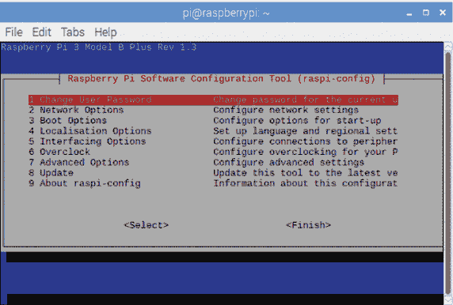

**图 1-24** 从命令行访问配置工具

你可以使用键盘来控制这个工具；使用箭头键进行选择，按 ENTER 进入该选项。完成配置设置后，导航至 `<Finish>`，按 ENTER 重启你的树莓派。

#### 更新和升级

随着时间的推移，你的软件和操作系统将需要升级。大多数软件更新都存储在一个外部在线仓库中，每当你做出更改时，它都会更新。为了升级你的树莓派并保持系统最新，你需要连接到互联网。然后，你可以使用两个简单的命令。在终端窗口中输入以下命令以下载操作系统和已安装软件的任何更新：

```
pi@raspberrypi:- $ sudo apt update
```

然后输入此命令将大部分软件升级到最新版本：

```
pi@raspberrypi:- $ sudo apt upgrade
```

#### 安装软件包

很多软件也存储在一个中央的在线仓库中，你可以在树莓派连接到互联网时访问该仓库。你可以通过在终端窗口输入一个简单的命令，后面跟上你想安装的软件的名称，直接下载软件。例如，要安装 GIMP（一个免费的图像编辑软件包，用于你的树莓派），输入以下命令：

```
pi@raspberrypi:- $ sudo apt install gimp
```

你也可以通过输入`purge`命令来删除不需要的软件：

```
pi@raspberrypi:- $ sudo apt purge gimp
```

当你不知道软件的完整名称时，可以输入以下命令来搜索可用的软件：

```
pi@raspberrypi:- $ sudo apt search keyword
```

用软件名称的一部分替换关键字。以后当需要时，我会在后续章节中介绍其他安装软件的方法。

### 远程访问你的树莓派

本书中的一些项目需要你移除屏幕或显示器，并断开 Raspberry Pi 的鼠标和键盘连接。例如，要在第十章中构建魔法音乐盒 MP3 播放器，你需要将 Raspberry Pi 放入一个木箱中。在这种情况下，即使 Raspberry Pi 断开了所有连接，你仍然需要访问其文件。最简单的方法是通过家用网络（你在连接互联网时也连接的网络）从另一台计算机或设备远程连接到 Raspberry Pi。我将向你展示几种方法来实现这一点。首先，你需要你的用户名、密码和 Raspberry Pi 的 IP 地址。

请记住，如果你更改了任何这些信息，你需要使用更新后的信息。

#### 通过 SSH 访问 Raspberry Pi

你可以通过 *安全外壳协议*（*SSH*）从另一台设备远程访问 Raspberry Pi 的命令行。这允许你在另一台连接到 Raspberry Pi 的设备上打开终端会话或窗口，从而远程发送命令（如命令行指令表中的命令）到 Raspberry Pi。出于安全原因，默认情况下 SSH 是关闭的，以防止他人黑入你的 Raspberry Pi。要启用 SSH，请从桌面菜单中打开 Raspberry Pi 配置工具。

在接口选项卡上（图 1-25），将 SSH 字段设置为 **启用**。如果你使用的是终端配置工具，请点击 **OK** 或选择 **完成**。我强烈建议你在使用 SSH 时更改默认密码。你可以在配置工具中完成这项操作。

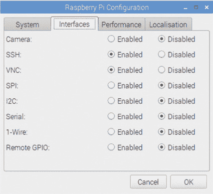

**图 1-25** 在配置工具的接口选项卡中启用 SSH。

接下来，你需要 Raspberry Pi 的 IP 地址。IP 地址是一组数字，用来标识你的 Raspberry Pi 在无线网络上的位置。要查找这个地址，请打开终端并输入以下命令：

```
pi@raspberrypi:- $ hostname –I
```

终端中会显示一个数字（图 1-26）。它看起来应该像 192.134.244.03。请记下这个数字；你稍后需要用它来远程访问你的 Raspberry Pi。

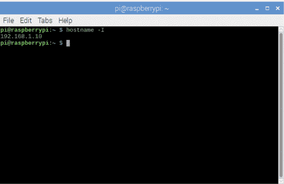

**图 1-26** 记录终端中显示的 IP 地址。

接下来，你需要使用访问 Raspberry Pi 的设备，这可以是手机、平板电脑或计算机。要连接到 Raspberry Pi，你需要安装一个 SSH 客户端。SSH 客户端是允许你通过其他设备使用 SSH 连接到 Raspberry Pi 的软件或程序。你可以从 *[`www.chiark.greenend.org.uk/~sgtatham/putty/latest.html`](https://www.chiark.greenend.org.uk/~sgtatham/putty/latest.html)* 下载一个常用的客户端 *PuTTY*，或者如果你愿意，也可以在应用商店搜索 SSH 客户端应用。

下载并安装 SSH 客户端后（参见图 1-27），打开它并在主机名（或 IP 地址）下输入 *raspberrypi.local* 或 Raspberry Pi 的 IP 地址。如果你使用 Windows 操作系统进行访问，需要从 *[`support.apple.com/downloads/bonjour_for_windows`](https://support.apple.com/downloads/bonjour_for_windows)* 安装 *Bonjour*。如果你使用的是 Linux 或 macOS，那么无需额外操作！

系统会提示你输入 SSH 密码，即你的登录密码（默认为 *raspberry*，除非你已更改）。然后输入 Raspberry Pi 登录信息以建立与 Raspberry Pi 的连接。应该会出现一个终端窗口，你可以通过它来控制你的 Raspberry Pi。

有时，*raspberrypi.local* 主机名可能无法正常工作。很可能是因为你使用的 IP 地址自上次使用网络以来发生了变化。使用前面提到的 `hostname –I` 命令查找新的 IP 地址，然后输入新的地址。

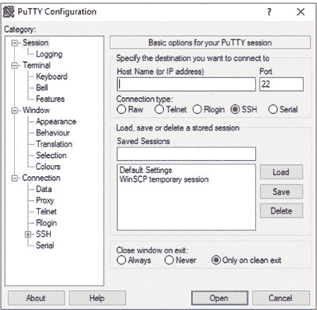

**图 1-27** 配置你的 SSH 客户端

#### 使用 RealVNC 通过 VNC 访问 Raspberry Pi

通过 SSH 方法远程访问 Raspberry Pi 可以使用命令行进行控制。如果你希望访问 Raspberry Pi 的完整图形桌面（GUI），并在 Pi 以外的设备上使用，你可以使用内置的 *虚拟网络连接* (*VNC*) 服务器。VNC 允许你通过网络访问 Raspberry Pi 的桌面。

VNC 的一个额外好处是它可以免费安装和使用。它需要两部分：第一部分是已经安装在 Raspberry Pi 上的 VNC 服务器，你只需要启用它（参见图 1-28）：打开 **首选项** 中的 **接口** 标签，点击启用 VNC 的选项。

第二部分涉及在你希望查看 Pi 桌面的远程设备上安装 VNC 查看器。打开远程设备上的浏览器，访问 RealVNC 网站 *[www.realvnc.com](http://www.realvnc.com)*。点击 **产品**，然后点击 **爱好者和制造者**。你应该会看到一个 Raspberry Pi 的 VNC Connect 页面。向下滚动并点击 **下载**（在下载 VNC Viewer 部分）。

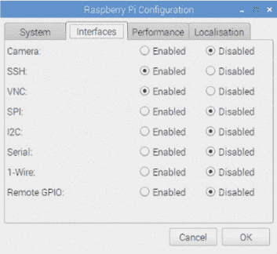

**图 1-28** 启用 VNC 客户端。

这里你应该可以看到支持的各种操作系统（参见图 1-29）。点击你的操作系统图标，然后点击 **下载 VNC Viewer** 以下载安装程序。找到安装程序（通常在 *下载* 文件夹中），双击它以运行。然后按照屏幕上的设置说明进行操作，接受默认选项。

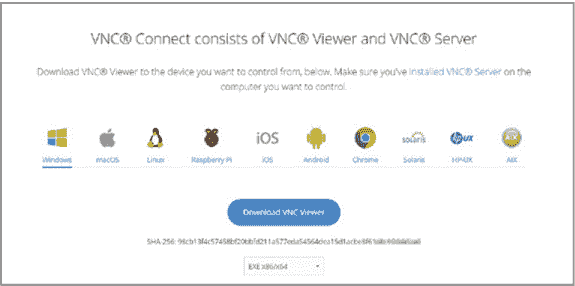

**图 1-29** 选择并安装所需的 RealVNC 查看器。

安装完成后，找到 VNC Viewer 图标并点击它以打开程序。你应该会看到如图 1-30 所示的窗口。

**注意**

*记住，您可以通过打开终端，输入命令 hostname –I，然后按* ENTER* 来查找 Raspberry Pi 的 IP 地址。*您还可以通过点击 Pi 上的 VNC 图标来查找 IP 地址，有时该地址会显示在连接性标题下方。*

在顶部的框中输入您的 Raspberry Pi 的 IP 地址。

然后，在您用来访问 Raspberry Pi 的设备上找到相同的 VNC 图标。点击该图标，VNC 服务器应该会加载。


**图 1-30** 输入您的 Raspberry Pi 的 IP 地址

第一次连接，或者如果您连接到新的 Pi，您可能会看到 图 1-31 中的身份验证屏幕。

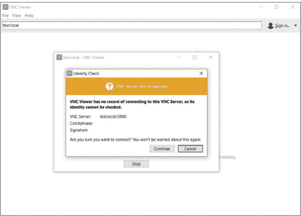

**图 1-31** 身份验证

如果是，请点击**继续**以访问您的 Pi。然后，系统会要求您输入 Raspberry Pi 的用户名和密码。

现在您应该已连接！如果您想断开连接，只需关闭您的 Pi 或关闭 VNC 查看器窗口。有时，您可能会看到*计算机拒绝连接*的消息。这可能是由多种原因造成的。请检查您是否输入了正确的 IP 地址、用户名和密码。还要检查您是否在 Raspberry Pi 配置菜单中启用了 VNC。请参见图 1-28 进行操作，然后重新启动您的 Pi，以确保更改已生效。最后，考虑到某些网络会阻止 VNC，这在学校、图书馆和企业中很常见。

#### 通过远程桌面访问 Raspberry Pi

还有第二种方式可以从另一台设备访问您的 Pi 的图形界面：通过*远程桌面*。这与使用 VNC 连接类似，但如果您使用的是 Microsoft Windows 系统，您无需在计算机、笔记本电脑或 Surface 上安装任何软件。使用远程桌面还意味着，随着 Microsoft 发布更新，您的设备将保持最新，而如果使用 VNC，您将需要下载并手动更新服务器和查看器。

返回您的 Raspberry Pi，打开**首选项**中的**接口**选项卡，并启用 VNC。

**注意**

*在撰写本文时，对于 Apple 设备，此替代方法没有免费的软件。如果需要免费选项，请返回 第 27 页的“通过 RealVNC 使用 VNC 访问 Raspberry Pi”部分。*

启用 VNC 后，您需要在 Pi 上安装一些远程桌面软件。打开终端窗口并输入以下命令进行安装：

```
pi@raspberrypi:- $ sudo apt-get install xrdp
```

当软件在你的 Pi 上安装时，返回到你的笔记本电脑或其他连接互联网的设备，并安装远程桌面应用程序。如果你使用的是 Windows 设备，可以通过在开始菜单中搜索来找到名为*Remote Desktop Connection*的内置远程桌面应用。如果你使用的是 Android 设备，可以从 Google 商店下载远程桌面应用，只需在商店中搜索*Microsoft* *Remote Desktop*。如果你使用的是 Apple 设备，可以在 Apple 应用商店中搜索*Apple Remote Desktop*（该应用收费）。

一旦你的 Raspberry Pi 完成安装远程桌面软件，打开你其他设备上的远程桌面应用。一个窗口，像图 1-32 中所示的那样，应该会出现。

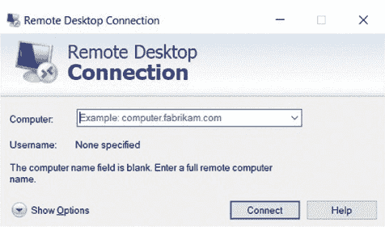

**图 1-32** 使用远程桌面应用连接到你的 Raspberry Pi。

在**Computer:**旁边的相关文本框中输入你的 Raspberry Pi 的 IP 地址或主机名，然后点击**Connect**或等效的按钮。系统会提示你输入 Raspberry Pi 的用户名和密码。输入完成后，应用程序将建立连接，并打开一个独立的窗口，允许你查看 Raspberry Pi 的桌面（图 1-33）。


**图 1-33** 远程查看你的 Raspberry Pi 桌面

你可以像在设备上操作一样与桌面进行交互。记住，你所做的任何更改都会保存到你的 Raspberry Pi 上。

### 文件传输

有时你需要在计算机和 Raspberry Pi 之间传输文件。也许你想备份保存在 SD 卡上的代码，或在设备之间传输 MP3 文件，或者向 Raspberry Pi 添加新文件。为此，你需要在你想连接到 Raspberry Pi 的设备上下载文件传输程序。

如果你使用的是 Windows，访问*[`winscp.net/eng/download.php/`](https://winscp.net/eng/download.php/)*并下载 WinSCP 软件的最新版本。如果你使用的是 macOS，可以在 Apple 应用商店中搜索*File Transfer App*。

好消息是，你不需要在 Raspberry Pi 上安装任何额外的软件来传输文件。一旦你为其他计算机或设备下载并安装了文件传输程序，打开它并输入你的 Raspberry Pi 主机名或 IP 地址（图 1-34）。你需要确保已启用 SSH，如图 1-25 所示。

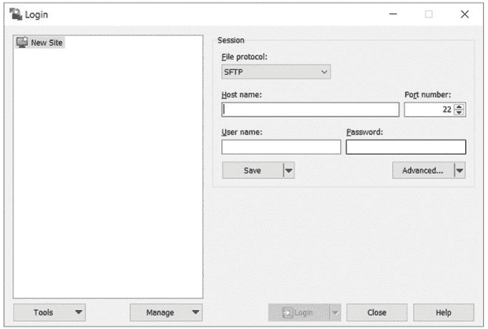

**图 1-34** 在文件传输程序中输入你的 Raspberry Pi 主机名或 IP 地址。

你可能会被提示输入 Raspberry Pi 的用户名和密码。输入完成后，你的设备应该会连接成功，屏幕上会显示文件管理器（图 1-35）。

文件管理器将显示保存于两个设备上的文件。点击并拖动文件，从文件管理器的一侧传输到另一侧。

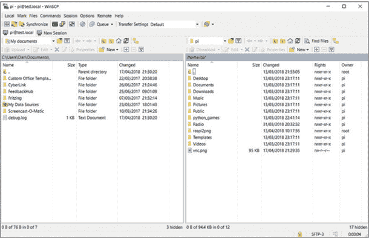

**图 1-35** 使用文件管理器在你的设备之间传输文件。

### 总结

现在你应该对你的树莓派及其一些功能有了基本了解。请记住，每一章的黑客技巧都是独立的，涵盖了你所需的所有技能、理论和代码。如果需要回顾或解释，可以参考本章内容。

让我们开始黑客入门吧！
