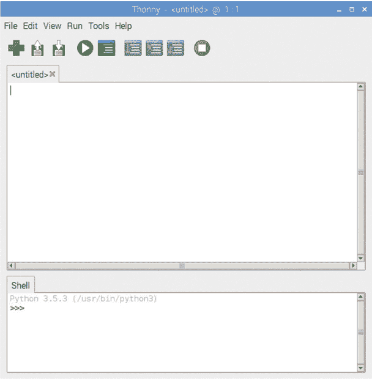
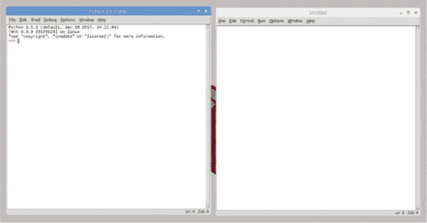
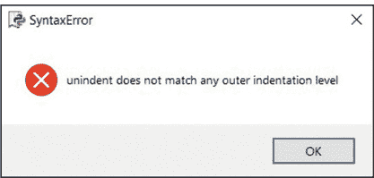

## 第二章：PYTHON 编程

本书中的大多数项目使用**Python 编程语言**编写，该语言已预装在 Raspbian 操作系统中。Python 是一种相对简单的语言，因为其结构使得它极其用户友好。但它也有适合更高级程序员的复杂特性，并且能够高效地完成任务。

在构建本书中的项目时，我会引导你为每个程序编写 Python 代码。通过这些项目，你将学习语言的基础知识。在我们开始之前，我们将先了解一些编程基础，如打印语句、做出选择和避免 Python 中的常见错误。

### 探索 Python

为了说明 Python 的高效性，假设你正在编写经典的第一个程序，以在屏幕上显示*Hello World*。

在 Java 编程语言中，你将写出以下代码：

```
public class Main {
    public static void main(String[] args) {
        System.out.println("Hello World"); 
    }
}
```

在 Python 中，你只需一行代码就可以实现相同的输出：

```
print ("Hello World")
```

Python 代码是在*集成开发环境*（*IDE*）中编写的。IDE 是你用来编写 Python 代码的软件，就像你可能使用文字处理软件来编写文档，或使用网页浏览器来加载和查看网站一样。

### 前言 Thonny 和 IDLE

Raspbian 操作系统预装了一个名为*Thonny*的 Python IDE（图 2-1）。这个默认的 Python 编辑器包括广泛的错误检测和代码高亮功能。如果你因某些原因需要手动安装 Thonny，请打开终端并输入以下命令：

```
pi@raspberrypi:- $ sudo apt-get install python3-thonny
```

Thonny IDE 有一个区域供你编写完整的程序代码，以及一个 Shell。*Shell 区域*是你可以编写单行代码并测试它们的地方，而无需保存完整的程序代码。你可以在*[`thonny.org/`](http://thonny.org/)*了解更多关于 Thonny 的功能。



**图 2-1** Thonny，默认的 Python 集成开发环境

Python 还有其他可用的编辑器，包括 IDLE（发音为*idol*），这是编写 Python 代码的经典集成开发环境。当你将 Python 下载到除 Raspbian 以外的其他设备上，例如你常用的笔记本时，通常会提供这个编辑器。

每个项目的程序代码可以在任何 Python 编辑器中编写，但本书中始终使用 IDLE，代码的颜色也与其相匹配。如果你想使用 IDLE，打开终端窗口并输入以下代码：

```
pi@raspberrypi:- $ sudo apt install idle3
```

你可以在*[`www.python.org/downloads/`](https://www.python.org/downloads/)*找到更多信息和下载详情。

加载 IDLE 时，将会打开两个窗口（图 2-2）。左侧窗口是*Shell* *窗口*，你可以在这个窗口中测试单行代码：编写代码并按 ENTER 键，代码会立即运行。右侧的*Untitled*窗口允许你编写并保存多行代码或完整程序。然后，你可以随时返回它们。



**图 2-2** IDLE 是编写 Python 代码的经典 IDE。

一旦你写完程序，就需要运行或 *执行* 它，测试它是否能正确工作。对于两个已安装的 IDE，你都可以按 F5 键来保存并执行程序。大多数程序员在开发程序时会边写边测试，以便及早发现并去除错误。

### 编写你的第一个程序

让我们编写你的第一个程序，它将 *打印* 一条简单的消息到屏幕上。从主菜单中选择“编程”选项，选择 Thonny 或 Python 3（IDLE），然后点击 **文件** ▶ **新建**。你也可以从 IDLE 点击 **文件** ▶ **新建文件**。在新窗口的顶部，精确输入这一行（虽然你可以根据需要修改引号中的文本，输入你自己的消息）：

```
print ("I can code")
```

要运行程序，按键盘上的 F5 键；系统会提示你保存程序。点击 **确定**，程序将保存并运行。文本 `I can code` 将出现在 Shell 窗口中。

返回到上一个窗口，并在你之前的代码下方输入这一行：

```
print ("Look a second line!")
```

再次按 F5 键保存并运行程序，现在它应该像这样：

```
print ("I can code")
print ("Look a second line!")
```

现在你已经写了第一个程序，让我们复习一些 Python 基础知识。

### 字符串

*字符串* 是一种表示文本的数据类型。你可以通过将字符输入到单引号或双引号内来创建一个字符串：只要两端使用相同类型的引号，两种方法都可以。

在引号内，你通常输入文本，比如 `"欢迎来到树莓派儿童项目"`。你可以打印字符串（在屏幕上显示），保存它，甚至修改它。你还可以用 Python 代码搜索字符串中的特定词或字符，测量字符串的长度，甚至替换字符串的一部分。

字符串不仅仅用于字母。它们也可以包含数字和符号。例如，字符串 `"C3P0"` 包含字母和数字。然而，字符串中的数字没有实际的值；它们仅仅表示数字 3 和数字 0 的符号。即使是单独的数字，如 `"465"`，也没有值，这意味着你不能像在代码中将它加到另一个数字上一样使用它作为数字。

试试这个：输入以下程序，它看起来应该是用来加两个数字的：

```
Total = 500 + "500"
print (Total)
```

当你运行这个程序时，你会遇到一个错误。它无法正常工作，因为程序试图将一个数字和一个字符串相加，而字符串没有值。要解决这个错误，你需要去掉 "`500`" 中的引号，这样 500 就从字符串变成了数字。现在两个数字都有值了，你可以将它们相加。现在试着运行这个程序。

### 变量

你编写的一些程序需要用户输入他们自己的数据。想象一个程序，要求玩家输入他们的名字。因为这个数据会因用户而异，你可以将其存储在一个*变量*中。可以将变量视为计算机内存中的盒子，里面存储着信息。你给每个盒子一个标签，这样你就可以再次找到它。

在 Python 中，首先通过给变量一个标签来定义变量，这就是*声明*变量。例如，假设我们使用`NameOfMyPet`作为变量标签。接下来，使用等号（`=`）表示该变量包含一个字符串或一个值。这个过程的术语是*赋值*，即将某物赋给变量。最后，声明变量应该包含的内容。例如，我的宠物名字是 Iron Cat，所以我可以这样声明一个变量：`NameOfMyPet = "Iron Cat"`。字符串"`Iron Cat"`现在存储在计算机的内存中，我可以随时通过调用变量`NameOfMyPet`来获取它。要打印变量的内容，使用代码`print(NameOfMyPet)`：

```
NameOfMyPet = "Iron Cat"  
print(NameOfMyPet)
```

你可以通过编辑字符串来更改变量的内容。例如，你可能会把宠物的名字改为 Tony Bark。当你更改后运行程序时，变量的原始内容将被新的宠物名字覆盖。

**注意**

*你可以使用小写风格的变量标签，例如* nameofmypet。*但是，这样的变量名不容易阅读和理解。Python 程序员使用一种被称为*驼峰命名法*的技巧：大写字母表示每个新单词的首字母（例如，*NameOfMyPet*）。*

你还可以使用变量来存储用户对问题的回答，例如“你的名字是什么？”。

要创建一个存储用户输入的变量，你首先声明该变量。然后使用等号（`=`），在等号的另一侧加上你想要回答的问题或提示，括号内写上内容。删除你在 IDLE 或 Thonny 文件中的内容，并输入以下代码：

```
name = input("What is your name? ")
print ("Welcome ", name)
```

程序将用户输入的名字存储在一个名为`name`的变量中。当你运行程序时，它会从`name`变量中获取名字，将其与单词`Welcome`结合，然后在底部打印出来。例如，如果你的名字是 Sarah，它将打印`Welcome Sarah`。你可能会注意到在`What is your name?`和`Welcome`后面有一个刻意的空格。这是为了确保单词之间有空格分隔，否则它会打印出类似`WelcomeSarah.`这样的内容。

### 循环

在本书的一些项目中，你需要让程序不断地重复一组指令。例如，在 第三章 中，程序需要不断检查房间里的光线强度，以确定何时触发热熔胶夜灯的开关，这意味着代码需要不断运行。在 第六章 中，蹦床程序持续检查你是否站在 Minecraft 中的草块上。如果你站在草块上，就进入蹦床模式，你会被弹起到空中！

这种编程技巧通常称为 *循环*。循环有两种类型：`while` 循环和 `for` 循环。

#### while 循环

`while` 循环会在特定条件满足时继续重复执行代码。以下示例展示了如何使用此循环：

```
❶ count = 5
❷ while count > 0:
      question = input("Do you like cheese? (yes or no) ")
    ❸ print ("")
    ❹ count = count - 1	
```

你首先将 `count` 变量的值设置为 5 ❶。只要 `count` 中的值大于 0 ❷，程序会询问问题 `"你喜欢奶酪吗？（是或否）"`。然后它打印一个空行 ❸，以保持布局整齐。每次程序循环——即每次 `while` 循环后面的缩进代码 ❷ 运行——它会将 `count` 的值减 1，在代码 `count = count – 1` ❹ 中执行。

在第一次循环运行之后，新的 `count` 值被设置为 4。因为 4 仍然大于 0，循环再次运行，并且在循环结束时减去 1。程序将继续循环，直到 `count` 的值达到 0，循环才会停止，程序结束。所以这个程序会运行五次，然后停止。注意，❸ 和 ❹ 处的行有缩进。缩进表示这些行是循环的一部分，只有在循环运行时才会执行。

当你使用 `while True` 语句，如这里所示时，程序将不断运行，直到用户停止或关闭程序：

```
while True:
    question = input("Do you like cheese? (yes or no) ")
    print ("")
```

试试看，你将永远被问到“你喜欢奶酪吗？”（当然，直到你退出程序为止）。

#### for 循环

`for` 循环会重复执行代码行指定的次数。在这个例子中，`range` 的值设置为 5，这意味着你将被问到是否喜欢奶酪五次，然后循环停止：

```
for x in range(5):
    question = input("Do you like cheese? (yes or no) ")
    print ("")
```

注意，`for` 循环完成了与我们之前创建的第一个 `while` 循环相同的任务。但它使用的代码更少，使得程序更加简洁高效。

### 条件语句

Python 中的 *条件语句* 让程序可以做出决策：当 *这个* 为真时，*这个* 会发生，但当 *那个* 为真时，*那个* 会发生。可以将条件语句看作按钮：按下一个按钮，它会发出声音，但按下另一个按钮，它会闪烁灯光。

条件语句让你的代码能够根据不同的输入或输出作出不同的响应。你可以通过使用 `if`、`elif` 和 `else` 语句来创建条件语句。

`if` 语句是条件语句的开始，用来检查第一个条件是否满足。例如，*如果* 按下按钮 A，就播放声音 A。

如果第一个条件没有满足，你可以使用`elif`语句来检查其他条件，`elif`是*else if*的缩写。这个语句会检查下一个选项，如果前一个选项没有被选择的话。在这个例子中，如果按钮 A 没有被按下，它可能会检查按钮 B 是否被按下。你可以根据需要添加任意多个`elif`语句，检查按钮 C、D，等等。

条件语句的最后部分是`else`语句。它告诉程序在其他条件不满足时应该做什么；在这个例子中，如果没有按下任何按钮，则执行`else`语句中的代码。

请考虑以下程序，看看条件语句是如何工作的：

```
while True:
 ❶ question = input("Do you like cheese? (yes or no) ")
    print ("")
 ❷ if question == "yes":
       print ("Good choice")
 ❸ elif question == "no":
       print ("shame, I have lots spare")
 ❹ else:
        print ("Did you answer correctly?")
        print ("")
```

你开始时会询问用户是否喜欢奶酪❶。用户输入一个回答。然后你使用`if`语句❷来检查用户的回答是否是`yes`。如果是，程序将打印出信息`Good choice`。

如果用户没有输入`yes`，程序将跳到`elif`语句❸，检查用户是否输入了`no`。如果是，将打印出一个备用信息。

最后，你使用`else`语句❹来回应任何不是`yes`或`no`的回答。

进入程序并运行它。你可能想尝试编写你自己的示例。

### 函数

*函数*是一种存储执行单一任务的多行代码的有用方式，就像一组指令。然后，当你想在代码的其他地方执行这个任务时，你只需输入函数名，而无需再次键入所有代码。

要创建一个函数，你输入`def`，然后是函数的名称、一对空括号和一个冒号（冒号非常重要！）。然后按 ENTER 键移到下一行，输入函数将要执行的指令。注意，当你按 ENTER 键时，光标会出现缩进位置，而不是在行的开始。像循环一样，属于函数的代码行需要缩进，这样 Python 才知道它们属于该函数。

要在程序的任何位置运行函数，你写出函数的名称，后跟空括号。这称为*调用*函数，如下例所示：

```
def PocketMoney():
    money = good_behavior * rate
    tax = (good_behavior  / 100) * 20
    print (money)
    print (tax)
good_behavior = int(input("Please enter the number of days you were
good "))
rate = float(input("Please enter your pocket money rate " ))
```

你开始时定义一个名为`PocketMoney()`的函数。函数定义后的缩进行计算用户获得的零花钱金额以及他们根据输入的“税费”信息所需支付的金额。

如果现在运行这个程序，它不会做任何事情，因为你还没有*调用*这个函数；你只是定义了它。包括函数调用的完整程序如下所示：

```
def PocketMoney():
    money = good_behavior * rate
    tax = (good_behavior  / 100) * 20
    print (money)
    print (tax)
good_behavior = int(input("Please enter the number of days you were
good "))
rate = float(input("Please enter your pocket money rate " ))
PocketMoney()
```

现在程序会要求用户输入他们表现良好的天数以及每天获得的零花钱数额。然后它会计算并打印用户的最终零花钱金额，减去税费！

### 从终端运行 Python 代码

有时你需要从 IDLE 或 Thonny 之外的地方运行程序。例如，你可能从另一台计算机远程运行程序，或者你可能没有将显示器连接到树莓派（如第十一章中的自然盒子项目）。在这种情况下，你可以通过终端运行程序。这样做可以释放处理器、内存和图形，专注于 Python 程序的运行。

要从终端运行程序，首先打开终端，使用它导航到包含你想要运行的程序的文件夹。然后输入以下命令：

```
pi@raspberrypi:- $ sudo python3 name_of_the_program.py
```

用你的 Python 程序的名字替换 name_of_the_program.py，它就会运行！

**注意**

*当我展示你应该在终端中运行的代码时，我会在前面加上提示符，像这样：* pi@raspberrypi:- $. *但是你只需要输入提示符后面的命令，不需要输入实际的提示符。*

### 常见编程错误

程序员常说，编程是 20%的编码和 80%的*调试*，调试指的是修正代码中的错误。*bug*这个词可以追溯到计算机刚开始非常庞大，几乎占满整个房间的时代。故事是这样的：1947 年 9 月 9 日，一位著名的程序员 Grace Hopper 发现计算机停止工作。当她检查计算机时，发现一只飞蛾卡在了某些活动部件之间。Hopper 随后把这只飞蛾粘在了她的日志本上，并写下了“发现 bug”的字样。

错误、bug 和失误会导致程序运行不正常、卡顿或甚至无法启动。采用一种有条理的逐行调试方法可以使这一过程变得更加容易。但要做好准备，可能需要花费大量时间来找出一个小小的错误。希望你不会找到一只飞蛾。

许多常见的错误都是语法问题。*语法*是规定你必须如何编写代码的一套规则。例如，条件语句中的代码行必须始终以冒号结尾。不同的编程语言使用不同的语法。当遇到错误时，首先检查你是否使用了正确的语法。两种常见的语法问题是字母大小写的错误使用和缩进问题。

#### 大写字母

最常见的语法错误之一就是错误使用大小写字母。编程语言并不总是遵循标准的英语语法规则。有些代码行以小写字母开头，有时一个单词中间可能会出现一个随机的大写字母。Python 对大写字母的使用非常敏感！不要尝试修正看起来像是错误但实际上并不是的地方；你必须完全按照书中所示的方式输入代码。

例如，考虑以下两行代码：

```
Print ("Hello there")
```

和

```
print ("hello there")
```

只有其中一个是有效的。你认为是哪一个？试着运行它们，看看自己是否正确。

#### 缩进

另一个常见的错误原因是*缩进*——代码行开头的空格数。通常来说，在 Python 中，缩进的空格数并不重要，只要保持一致。一个好的做法是每次缩进留四个空格或一个制表符。你可以任选其一，但请确保一致，且在程序中只使用一种方法。不要在同一程序中同时使用两种方法。作为正确缩进的示例，请参见下章中的代码片段：

```
while True:
 ❶ print(ldr.value)
 ❷ time.sleep(2)
 ❸ if ldr.value <= 0.4:
    ❹ print("light on")
    ❺ led.on()
 ❻ else:
    ❼ led.off()
```

❶、❷、❸ 和 ❻ 处的行是对齐的。❹、❺ 和 ❼ 处的行也是对齐的。此程序代码的缩进正确，因此可以运行。

记住，当你使用条件语句和循环，或者定义函数时，需要对代码行进行缩进。更一般地说，任何以冒号结尾的行，后面的行都必须缩进。如果你的缩进没有对齐，程序将失败并产生错误消息，如图 2-3 所示。



**图 2-3** 如果你的代码包含语法错误，它会产生如下的错误消息。

例如，下面的程序有缩进错误：

```
while True:
     print(ldr.value)
     time.sleep(2)
 ❶ if ldr.value <= 0.4:
     print("light on")
            led.on()
        else:
               led.off()
```

你能找出哪些行缩进不正确并会导致错误吗？

当你希望某个事件发生在循环外部或条件判断之后时，代码必须*去缩进*，即与循环或条件语句开始前的代码对齐。例如，如果你在末尾添加了一个 `print` 语句，但它与 `if` 语句❶对齐，那么 `if` 语句也会执行这个 `print` 命令。

要了解更多关于缩进的信息，请参阅 Python 官方网站上的[*https://www.python.org/dev/peps/pep-0008/#indentation/*](https://www.python.org/dev/peps/pep-0008/#indentation/)。

### 使用注释

当你完成一个程序并且稍后回过头来看时，你可能会发现某些编码部分令人困惑，尽管是你自己写的。为了帮助自己和他人理解代码的作用，你可以使用注释。*注释*是为读者提供关于代码某部分的说明。

Python 提供了两种添加注释的方法。第一种是使用井号 (`#`)。通常，你会在注释前加一个井号，如下所示：

```
print ("hello") # this is a comment
```

创建注释的第二种方法是使用三个单引号标记打开注释，再用三个单引号标记关闭注释，如下所示：

```
print ("hello") '''this is also a comment'''
```

记住，注释不是命令；当你运行程序时，它们不会执行。它们的唯一作用是提供对代码的描述和提醒。那么，应该使用哪种注释方法呢？如果注释是单行的，使用 `#` 选项。如果注释跨越多行，使用 ''' 方法。

### 总结

通过这本简短的 Python 介绍，你现在已经准备好开始本书的活动了。每一章都会带你完成一个完整的项目。你可以按任何顺序完成这些项目，尽管它们的难度会逐渐增加。你还可以从每一章中提取代码、技术和元素，发明你自己定制的小技巧。如需更多指导，可以查看树莓派基金会的网站和帮助论坛。

开始一个项目吧！
