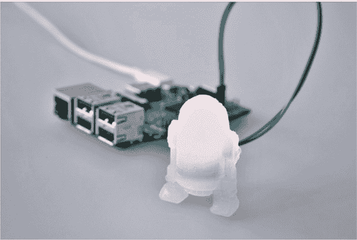
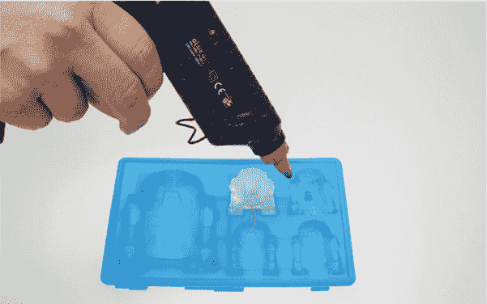
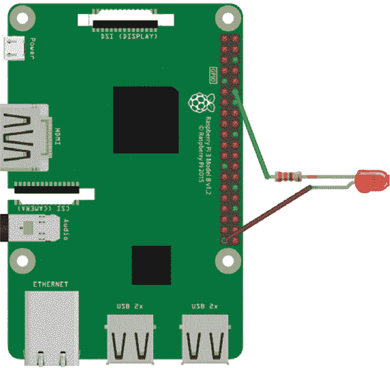
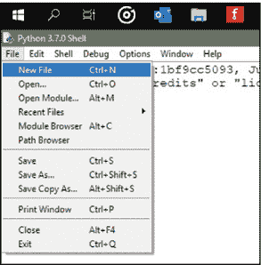
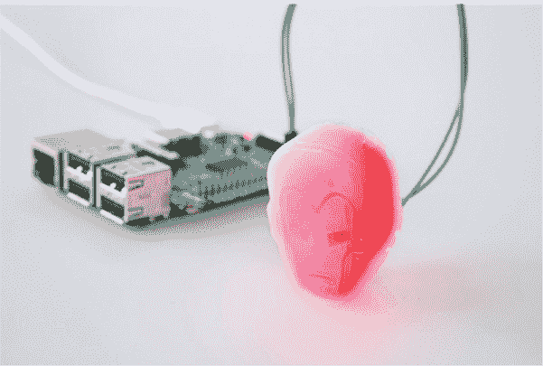

## 第三章：热熔胶夜灯

在这个项目中，你将使用热熔胶枪、硅胶冰块或烘焙模具以及 LED，制作一个小型定制灯光。然后，你将编写程序让灯光闪烁或渐变开关。你还将通过添加一个光传感器，将这个项目扩展为一个夜灯，使其在黑暗中自动打开，在天亮时自动关闭。

热熔胶是一种塑料粘合剂，在加热时呈液态，因此非常适合填充任何形状并迅速干固成型。硅胶模具具有耐热性，可以防止胶水粘附在模具上，方便在胶水干固后轻松取出。图 3-1 展示了一个完成的灯光。



**图 3-1** R2-D2 热熔胶枪灯

### 所需材料

这是你将需要的项目清单：

+   树莓派

+   热熔胶枪

+   热熔胶棒

+   硅胶模具

+   发光二极管（LED）

+   母对母连接线

+   面包板

+   光敏电阻（LDR）

+   电阻器（220 到 330 欧姆之间）

+   0.1 微法电容器

选择任何你喜欢的模具形状！最近，我制作了一个绿色的 R2-D2 LED 和一个红色的死星。我还找到了几个复仇者联盟的模具，于是我做了一个绿色的浩克拳头（会闪烁），一个蓝色的美国队长盾牌和一个红色的钢铁侠面罩。

只需确保模具是硅胶材质，这样它才具有耐热性。此外，你应该知道光敏电阻也叫做*光依赖电阻*（*LDRs*）或*光电池*。

**警告**

*热熔胶枪会变得非常热。在胶枪或胶水冷却之前，切勿触摸其喷嘴或胶水。同时，要小心滴落的胶水：不要让它滴到鞋子、衣物或地板上。建议在制作表面下放置报纸以保护其表面。*

### 自定义夜灯的构建

自定义夜灯的制作分为两个阶段。首先，你需要实际制作灯光。其次，你将编写程序来为灯光设置指令。让我们开始吧。

按照以下步骤构建灯光：

1.  **准备热熔胶枪：** 将胶棒插入热熔胶枪，插上电源，等待几分钟让它加热。当它准备好使用时，通常会有少量胶水从喷嘴滴出。

1.  **准备模具：** 将硅胶模具放在一个稳固的表面上。你可能需要在模具下方放些纸张或防尘罩来保护表面。确保模具无尘且干燥。

1.  **准备 LED：** 拿起 LED 并查看两根导线，也叫做*引脚*。注意，其中一根比另一根略长，如图 3-2 所示。较长的引脚是正极；较短的引脚是负极。这个细节在你将 LED 连接到模具时非常重要。如果你将引脚接错，电路将无法闭合，电流无法流过 LED，LED 将无法亮起。


**图 3-2** LED 引脚

因为你需要在胶水固化时接触到 LED 的腿部，所以在加热胶水之前，检查一下你希望 LED 在模具中的位置。你希望 LED 的腿部直接伸出，还是稍微弯曲向下或向外？LED 的放置位置取决于模具的形状。你希望 LED（包括腿部）大约位于模具的中间。太深的话，LED 会突出；如果放得不够深，它就无法牢固地固定在胶水中。大致估计一下 LED 的位置。

1.  **添加电阻：** 将电阻的一端绕在 LED 的较长正极腿上。电阻可以防止 LED 过热并烧坏。

1.  **往模具中添加胶水：** 当你知道 LED 的位置时，将其从模具中取出。然后，使用预热的热胶枪，开始慢慢地将胶水挤入模具。当模具充满约 80%时，轻轻地将 LED 插入胶水中，用手握住其腿部。等胶水定型后，你可能需要再加一点胶水，直到模具完全填满。握住 LED，但不要让热胶粘到你的手指上。图 3-3 展示了 LED 的良好位置。



**图 3-3** 将热胶水填充到模具中

1.  **定位并固定 LED：** 当模具充满胶水时，放下胶枪。继续固定 LED，确保它在胶水干燥时保持在你希望的位置。

    几分钟后，胶水开始变成白色。此时，你可以松开 LED，让胶水固化约 15 分钟。然后轻轻触摸胶水。如果不再粘手，仔细地将模具从胶水中剥离。如果胶水固化的形状不容易脱出，你可能需要再等几分钟，让它完全固化。

1.  **连接 LED：** 当胶水完全固化并冷却后，取两个母对母的跳线，将每根跳线连接到 LED 的两条腿上。正极腿上绕着电阻，所以将跳线连接到电阻的末端。将来自正极的*较长*腿的跳线连接到 GPIO 引脚 18，这是 Pi 的物理引脚 12。将*较短*的负极腿连接到 Pi 的任意地面引脚：你可以选择物理引脚 9、14、20、30、34 或 39。图 3-4 展示了 LED 的接线图，正极腿是直腿。



**图 3-4** LED 的接线图

#### 编写夜灯代码

现在是时候添加软件了。以下是步骤：

1.  插入并启动你的树莓派。

1.  通过打开终端并输入 sudo idle3，或者点击 Pi 图标选择**开始** ▶ **编程** ▶ **Python 3**，来加载 Python。

1.  在 IDLE 窗口中，选择**文件** ▶ **新建文件**，如图 3-5 所示。



**图 3-5** 在 IDLE 中打开新文件

1.  输入清单 3-1 中的简单代码，使 LED 闪烁。

    ```
       from gpiozero import LED
       from time import sleep
    ❶ led = LED(18)
    ❷ while True:
        ❸ led.on()
        ❹ sleep(1)
           led.off()
           sleep(1)
    ```

    **LISTING 3-1** 闪烁 LED

让我们看看这段代码是如何工作的。首先，你从 `gpiozero` 库中导入 LED 类，该库包含一些命令，帮助你控制 LED。你还导入了 `sleep()` 函数。一个 *函数* 由执行特定任务的代码组成，但它由一个单一的词（或两个）表示，作为函数的名字。当你在代码中调用这个函数名时，Python 会运行该函数中的指令，免去了你再次输入所有这些代码行的麻烦。你可以随意为函数命名，虽然最好使用一个描述该函数功能的词。例如，在前面的章节中，当我们使用 `print("hello")` 代码时，`print` 这个词就是一个函数。IDLE 编辑器会将所有函数名显示为浅紫色，方便你识别。`print()` 函数包含几行代码，会在 IDLE 窗口中显示括号内的文本。在接下来的章节中，你将经常使用 `print()` 函数。

`sleep()` 函数在指令之间添加延迟。这意味着你可以以不同的速度闪烁 LED。如果你使用较低的延迟值，LED 会更快闪烁。然后，你告诉树莓派 LED 连接到哪个引脚，这里是引脚 18 ❶。

你创建了一个 *循环*，这个循环会无限次重复其下方缩进的指令，除非你停止程序 ❷。最后，你把指令添加到循环中：打开 LED ❸，等待 1 秒 ❹，关闭 LED，然后等待 1 秒。LED 会一直闪烁。

#### 运行你的程序

要运行程序并让 LED 闪烁，按下键盘上的 **F5**。系统会提示你保存文件。为你的程序命名并保存：此时你的 LED 模式就会启动！要结束程序，请通过点击 **X** 关闭 Python 窗口。

#### 修改：使 LED 渐变

你可以修改程序，使 LED 渐亮渐暗，也叫做 *脉冲*，而不是简单的开关闪烁。打开一个新的 Python 文件，并添加 Listing 3-2 中的代码。这个程序会逐渐让 LED 变亮，然后再逐渐变暗。

```
from gpiozero import PWMLED
from signal import pause
led = PWMLED(18)
led.pulse()
pause()
```

**LISTING 3-2** 使 LED 渐变

在这里，你导入了 `PWMLED` 类，以便能够脉冲控制 LED，设置你用于 LED 的 GPIO 引脚编号，然后设置脉冲。你还添加了一个暂停，这可以确保程序持续运行并减少 CPU 负载，使其运行更快。通常，程序运行一次后，GPIO 引脚会被重置。`pause()` 指令确保 GPIO 程序的信号不会停止：程序继续运行，直到你退出程序，LED 会一直闪烁。

保存这个代码并运行它，看看变化！

### 构建 LED 夜灯

让我们提升夜灯项目。你将添加一个光敏电阻来制作一个简单的夜灯，为你的房间增添氛围，如图 3-6 所示。*光敏电阻*是一种传感器，用来测量房间中的光线强度并返回一个值。这个值可以触发灯光的开关，取决于房间的光线强度。

光线读数是*模拟的*，这意味着它们可以是任何值，而不仅仅是开或关。想象一下太阳的升起或落下：它不会突然出现在早晨，而是光线逐渐增加。与此不同，计算机是*数字的*，意味着它们只理解开或关的值。计算机使用数百万个可以打开或关闭的微小开关（就像开关一样）。

然而，如果你有一个调光开关，你可以调整光线的亮度级别。你将在这里使用类似的技巧。

当光线照射到光敏电阻时，它会产生一个小的电荷。你将把这个电荷存储在一个*电容器*中，电容器是一种专门用来存储电荷的小型设备。然后，你可以使用电容器中存储的电荷量来指示检测到的光线强度。

如果电容器充满电，读数将为 1，表示房间完全亮起，夜灯不需要开启。读数为 0.4 表示房间亮度约为 40%，这时房间足够黑暗，树莓派可以开启夜灯。



**图 3-6** 铁人夜灯

#### 连接你的夜灯

你需要将 LED 灯连接到 GPIO 引脚 18。图 3-7 显示了接线图供参考。

按照以下步骤连接光源：

1.  **添加新组件：** 将光敏电阻的引脚插入面包板，确保引脚之间至少留一行空隙。将电容器添加到面包板上，将其中一只引脚放置在光敏电阻右侧引脚的同一行，如图 3-7 所示。


**图 3-7** 将电容器和光敏电阻添加到面包板

1.  **添加接线：** 将接线 1 连接到光敏电阻的左引脚所在的行。将接线 2 连接到光敏电阻的右引脚和电容器的左引脚所在的行。将接线 3 连接到电容器的左引脚所在的行。这些接线在图 3-7 中有显示。

1.  **连接到你的树莓派：** 将接线 1 连接到第一个物理引脚，即 3V3 引脚，它提供电源。将接线 2 连接到 GPIO 引脚 4：这是左侧的第四个物理引脚。将接线 3 连接到地面引脚 GND。我建议你使用最近的地面引脚，即第 6 号引脚。

#### 编写夜灯代码

要编写夜灯代码，创建一个新的 Python 文件，然后在清单 3-3 中添加程序。

```
❶ from gpiozero import LightSensor, LED
❷ import time
❸ ldr = LightSensor(4)
❹ led = LED(18)
❺ while True:
       print (ldr.value)
       time.sleep(2)
    ❻  if ldr.value <= 0.4:
           print ("light on")
           led.on()
    ❼ else:
           led.off()
```

**清单 3-3** 编写夜灯代码

你从`gpiozero`库中导入了`LightSensor`和`LED`类，分别用于控制光敏电阻和 LED ❶。然后你导入了`time`模块，以便在每次读取光线时添加短暂的暂停 ❷。首先，你将数值设置为 2。这将使你能够通过将手放在光敏电阻上来测试程序。当你将程序用作夜灯时，可以增加延时。因为日落可能需要几分钟，频繁地每秒读取一次将毫无意义；达到所需光线水平可能需要 45 分钟，而你的树莓派则需要进行超过 2700 次读取，这会消耗处理时间和电力。

在❸处，你告诉程序光敏电阻连接到 GPIO 4 端口。然后，你告诉程序 LED 连接到 GPIO 18 引脚 ❹。

你创建了一个`while True`循环，使程序持续读取光线并检查数值，以确保不会错过日落 ❺。你将光线读取值打印到屏幕上，并添加了短暂的 2 秒暂停。你可能对光线值的读取感兴趣，将其显示在屏幕上能让你更容易测试程序是否正常运行。

然后，你使用条件语句检查光线读取值是否小于或等于 0.4（记住 0 表示无光，1 表示完全阳光） ❻。*条件语句*是一条指令，它告诉程序只有在某些条件为真时才执行特定的命令。这个`if`语句告诉程序，如果值小于或等于 0.4，说明天色变暗了，程序应该打印一个可选的警告信息并开启夜灯。你可以调整光线等级以匹配你的环境。例如，如果你住在城市里，可能需要将数值设置得更高，以考虑到路灯的影响。

`else` 语句是另一个条件语句，它告诉计算机，如果读取值大于 0.4，应该关闭 LED ❼。

#### 运行你的程序

要运行程序并测试你的光敏电阻，按下键盘上的**F5**。这会提示你保存文件并给它一个易于识别的名称，然后开始运行。通过在传感器上覆盖一块布或用手指挡住光线来测试你的夜灯：这应该会触发夜灯的开启。

你可以通过减少或增加程序第 8 行的数值来调整灵敏度。例如，尝试将该行更改为以下内容：

```
 if ldr.value <= 0.2:
```

这一行只会在非常黑暗时触发光线。要结束程序，点击 Python 窗口右上角的**X**按钮。

你房间里的光线和你使用的 LED 类型将决定适合你的最佳数值。可以通过实验光敏电阻的数值来找到最适合你环境的数值。

### 总结

现在你有了一个工作的、定制的夜灯。这里有一些改善你灯光的建议：

+   创建更多的 LED 生物并将它们添加到你的收藏中。

+   使用不同颜色的 LED 灯来制作不同颜色的光。

+   在胶水未干之前加入闪粉，使其闪闪发光。

+   使用小型硬币电池，通过将电池放置在 LED 腿之间，使功能具有可携带性。

+   反转光线值，使 LED 灯成为警报，当光线值高于 0.80 时闪烁。
