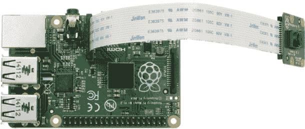
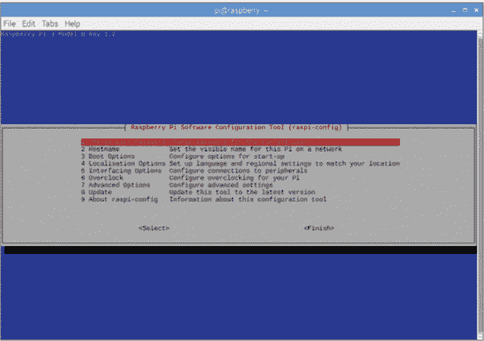
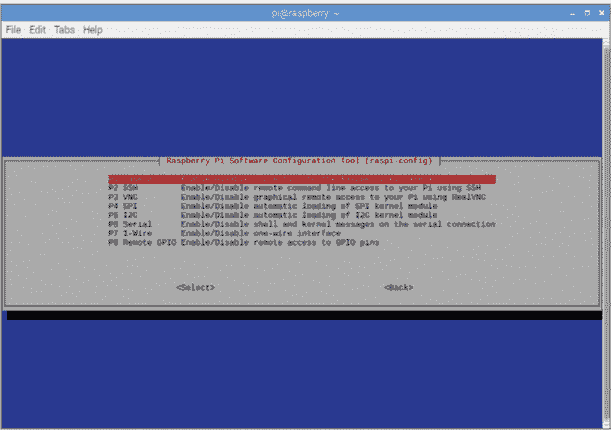
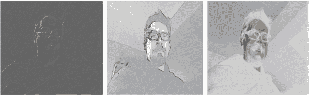
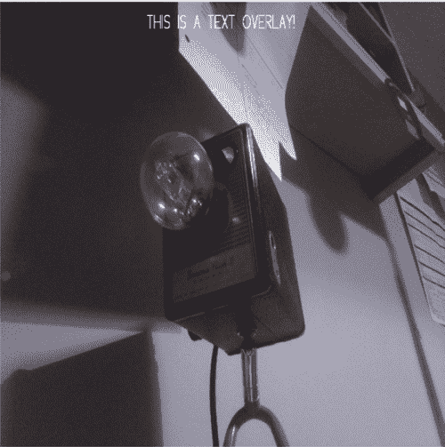
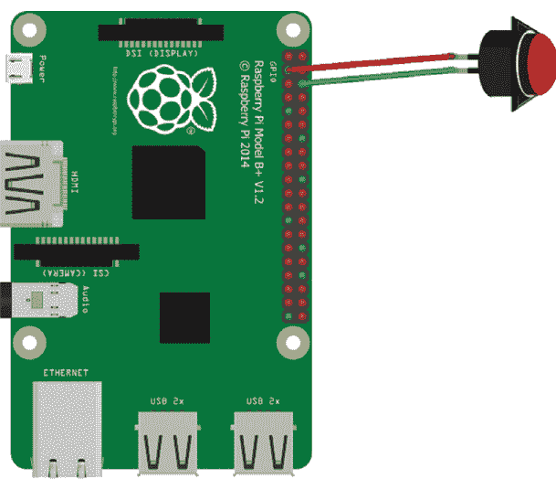
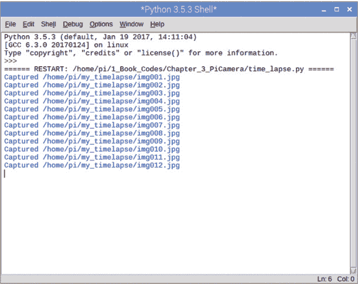

## 第四章：Pi 摄像头：自拍快照

照片已经成为我们日常生活的必需品，这要归功于摄像头被广泛应用于每部手机。2016 年，拍摄的照片数量超过了自相机发明以来拍摄的所有照片总和。在本章中，你将学习如何使用专为树莓派硬件设计的 Raspberry Pi 摄像头模块拍照。

你将设置和配置 Pi 摄像头以拍摄照片。接下来，你将学习一些更高级的功能，比如添加滤镜、定制照片质量以及添加触发按钮。然后你将学习如何使用 Pi 摄像头录制视频。最后，你将创建一个延时视频，用来捕捉日出或日落、植物生长、蜡烛燃烧，或者任何你喜欢的场景。

### 你需要的物品

以下是你在这次简单的 Pi 摄像头入门中需要的物品：

+   树莓派

+   Pi 摄像头

+   Pi 摄像头排线

+   2 根母对公跳线

+   一个按钮（可选）

+   鳄鱼夹或烙铁和焊锡（用于将线连接到按钮）

### 版本与规格

有几种型号的 Pi 摄像头可供选择，包括专门设计用于夜视的版本。所有版本的树莓派都支持 Pi 摄像头硬件以及用于将树莓派连接到摄像头的摄像头排线。排线有多种长度可选，这样你可以将摄像头放置在准确的位置，拍摄所需的照片或视频。以下表格包含了 Pi 摄像头的规格。

| **版本** | **图像分辨率** | **传感器分辨率** |
| --- | --- | --- |
| 摄像头模块 v1 | 500 万像素 | 2592 × 1944 像素 |
| 摄像头模块 v2 | 800 万像素 | 3280 × 2464 像素 |
| Pi NoIR 摄像头模块 v2 | 用于夜间摄影 |

官方的 Pi Zero 外壳配有较短的排线和内置在外壳盖子顶部的摄像头外壳，提供一个简洁、小巧、便于携带的摄像头。

对于这个项目，你需要使用常规的摄像头模块 v1 或 v2。

### 使用 Pi 摄像头拍照

你首先将组装摄像头，然后你将学习如何拍照和存储照片。接下来，我将展示如何通过调整分辨率、调整图像大小、使用滤镜以及添加文本来定制你的摄影。然后，你将通过添加按钮来使摄像头更易于使用，以便拍摄照片。

#### 硬件和软件的设置

让我们从连接并启用 Pi 摄像头硬件开始，然后写一个小的测试程序来检查它是否正常工作。在开始之前，*确保没有电源连接到你的 Pi*，并且你的 Pi 已经断开电源。接着按照以下步骤操作：

1.  **连接相机：** 将带状电缆连接到 Pi Camera（图 4-1）。根据您购买 Pi Camera 的地方，可能已经为您完成了此步骤。如果没有，轻轻拉下相机背面的塑料卡扣，并将带状电缆插入，确保蓝色带子朝向您。轻轻推上卡扣以固定电缆。

    找到 Pi 上的 Pi Camera 插槽，位置位于 HDMI 插槽和音频插孔之间。注意，它也有一个类似于 Pi Camera 上的卡扣。轻轻拉起卡扣将其打开。将带状电缆的另一端插入插槽，确保蓝色带子朝向音频插孔，并远离 HDMI 插槽。轻轻按下卡扣以固定带状电缆。在操作相机电缆时要非常小心。



**图 4-1** 将 Pi Camera 安装到 Raspberry Pi 上

1.  **安装 Pi Camera 软件：** 启动您的 Pi，打开终端窗口并输入以下命令：

    ```
    pi@raspberrypi:- $ sudo apt update
    ```

    一旦该命令运行完成，输入以下命令：

    ```
    pi@raspberrypi:- $ sudo apt install python3-picamera
    ```

    Pi Camera 软件随操作系统镜像预安装，并包括一个与相机接口的 Python 包。在将来，您可能需要在发布新版本时重新安装或更新该包，您可以使用以下命令进行更新：

    ```
    sudo apt update
    sudo apt upgrade
    ```

1.  **启用 Pi Camera：** 默认情况下，相机是设置为*关闭*的。在配置开启之前，您无法使用它。要启用相机，请返回终端窗口并输入以下命令以打开配置工具（图 4-2）：

    ```
    pi@raspberrypi:- $ sudo raspi-config
    ```

    

    **图 4-2** 启用 Pi Camera

    在配置工具中，选择 **接口选项**。然后选择启用连接到 Pi Camera 的选项（图 4-3）。使用箭头键选择 **退出** 并按 ENTER。系统会提示您在启用 Pi Camera 之前重新启动 Raspberry Pi。选择 **是** 以重新启动。现在，您可以测试相机是否已正确连接并正常工作。



**图 4-3** 选择 Pi Camera 选项

##### 测试 Pi Camera

要测试相机，您将运行预览功能。打开一个新的 Python 文件并输入 Listing 4-1 中的程序。此简单代码将触发相机在您的显示器上显示相机捕获的图像 10 秒钟。通过使用这段代码，您可以测试相机是否正常工作。

```
❶ from picamera import PiCamera
❷ from time import sleep
❸ camera = PiCamera()
❹ camera.start_preview()
❺ sleep(10)
❻ camera.stop_preview()
```

**列表 4-1** 测试相机

首先，您需要从 `picamera` 库中导入 `PiCamera` 类 ❶。这为您提供了控制相机的代码。接着，您需要导入 `sleep``(``)` 函数 ❷，以便您可以添加 10 秒的延迟，使得图像在屏幕上显示 10 秒钟。

然后，你创建一个名为`camera`的变量，用来存储`PiCamera``(``)`指令❸。这样你就可以调用 Pi Camera 并控制它，而无需每次都写出`PiCamera``(``)`。*变量*是代表树莓派内存中某个位置的占位符，存储着内容。例如，如果你创建一个`name`变量，如`name = "Dan` `Aldred"`，每当你在代码中使用`name`时，Python 会用`name`的内容替换，并插入`Dan` `Aldred`，而不是`name`。

接下来，你通过告诉相机启动预览❹并添加 10 秒延时❺来触发预览。最后一步会停止预览❻，关闭相机。

要运行程序，按下键盘上的**F5**；系统会提示你保存文件。为程序命名并保存，然后它会开始执行。

如果你能在屏幕上看到预览，说明你的硬件和软件都正常工作。如果看不到预览，说明相机无法正常工作：检查连接到相机的电缆是否正确连接，并确保它连接到了你的树莓派。然后检查相机在配置工具中是否启用。

程序将在 10 秒后停止。但如果你想提前结束程序，可以通过点击窗口右上角的**X**关闭 Python 窗口。

##### 拍摄自拍照

一旦你的相机开始工作，你可以创建一个程序拍摄第一张照片，一张自拍照（图 4-4）。


**图 4-4** 拍摄自拍照！

打开一个新的文本编辑器窗口，将文件保存为*selfie.py*，然后输入清单 4-2 中的程序。这个程序会启动一个 5 秒钟的预览，给你时间站到相机前，整理发型，并练习姿势，然后相机会自动拍摄照片。

```
   from picamera import PiCamera
   from time import sleep
   camera = PiCamera()
   camera.start_preview()
   sleep(5)
❶ camera.capture('/home/pi/Desktop/selfie.jpg')
   camera.stop_preview()
```

**清单 4-2** 拍摄自拍照

再次，你导入`PiCamera`类和`sleep``(``)`函数，然后使用`camera`变量存储`PiCamera``()`命令。接着，你启动预览并添加一个 5 秒钟的延时（如果你喜欢，可以设置更长的时间）。你触发相机拍摄图像❶并将其保存到桌面，方便查找。文件被保存并命名为*selfie.jpg*。

预览停止，程序结束。保存并运行程序，拍摄一张自拍照，然后返回桌面并打开图片，查看你的照片。

##### 更改图片保存的位置

如果你一次拍摄了多个自拍，它们很快会把你的桌面占得满满的。为了保持自拍照的整洁，最好创建一个新文件夹，方便存储和管理所有的图片。

要创建一个新文件夹，打开终端并输入以下命令：

```
pi@raspberrypi:- $ mkdir my_photos
```

`mkdir` 命令是 *创建目录*（make a directory）的缩写，它会在你的主目录中创建一个名为 *my_photos* 的新文件夹。现在，返回到你的 *selfie.py* 文件，并编辑第 `camera.capture('/home/pi/`Desktop`/selfie.jpg')` ❶ 行，将 *Desktop* 替换为你新文件夹的名称。除非你使用了不同的文件夹名称，否则新行应如下所示：`camera.capture``(``'/home/pi/``my_photos``/selfie.jpg')`。

##### 将每张图像保存为新文件

请注意，每次你拍摄新照片并保存图像时，程序会覆盖之前的图像文件。如果你想保留所有照片，这个功能就不是很实用。之所以会这样，是因为你的程序在保存每张图像时使用了相同的文件名。你可以通过在图像文件名中添加日期戳来解决这个问题。

*日期戳* 包含表示图像拍摄时间的日期和时间信息。该信息是从树莓派的时钟中提取的，因为时间是不断前进的，所以每个文件名都是唯一的。修改 *selfie.py* 文件以匹配 Listing 4-3 中的程序。

```
  from picamera import PiCamera
  from time import sleep
❶ import datetime
  camera = PiCamera()
  while True:
   ❷ current_time = datetime.datetime.now()
      camera.start_preview()
      sleep(1)
   ❸ camera.capture('/home/pi/my_photos/'+ str(current_time) +
     'photo.jpg')
     camera.stop_preview()
     sleep(10)
```

**LISTING 4-3** 保存所有图像

这段代码大部分与 Listing 4-2 中的自拍程序相似。你需要修改的代码在 ❶、❷ 和 ❸ 处。

你导入 `datetime` 模块 ❶ 以从时钟中获取当前的日期和时间。你创建一个循环，使 Pi 摄像头每 10 秒拍摄一张照片。这样你就有足够的时间查看预览，然后为下一张照片摆好姿势。然后你创建一个名为 `current_time` 的变量 ❷，并使用 `datetime.datetime.now``(``)` 来获取当前日期和时间，并将结果存储在该变量中。

代码的最后一部分将日期戳值作为图像的文件名 ❸。你使用 Listing 4-2 中的 `camera.capture` 代码，并跟上文件位置来存储图像。但这次，你添加了存储在 `current_time` 变量中的值。由于日期戳是数字格式，你需要将其转换为字符串，然后才能用作文件名。现在这段代码将以唯一的日期戳保存所有图像名称！

#### 自定义你的图像

现在你已经设置好了 Pi 摄像头的硬件和软件，准备好了解如何自定义图像了。让我们先来复习一些图像术语。

图像由称为 *像素* 的图像元素组成。这些小点会按一定的模式开关，从而形成整体图像。*图像质量* 由图像包含的像素数量与其大小的关系决定：例如，考虑在一个 1 × 1 英寸的小方块上有 1000 个像素和在一张大号账单纸上有 1000 个像素之间的区别。即使像素数量相同，账单纸上的图像质量也会较低。

图像的大小和像素数量被称为其*分辨率*。例如，分辨率为 100 × 100 的图像包含 100 行，每行包含 100 个像素，总共有 10,000 个像素。标准的真正高清电视分辨率是 1080 × 1080，这意味着屏幕包含 1,166,400 个像素。如果你在这个电视上观看的节目仅包含一百万个像素，那么图像就比电视屏幕的最大潜力少了 166,400 个像素，图像质量会下降。但如果你在平板设备上观看同样的节目，你不会注意到图像质量的下降，因为平板更小，像素的分布不那么密集。

接下来，你将学习如何通过更改分辨率来控制照片的质量。在本节稍后，你将进一步通过调整图像大小、使用滤镜和添加文本来定制图像。

##### 更改分辨率

你可以通过使用代码`camera.resolution = (500 x 500)`来调整 Pi Camera 的分辨率，该代码将图像设置为 500 像素的高度和宽度。这很有用，因为 Pi Camera v2 的分辨率为 3280 × 2464 像素，这意味着你拍摄的每一张图像包含 8,081,920 个像素。调整后的 500 × 500 图像将仅包含 250,000 个像素，因此文件将更小，消耗的存储空间也更少。

记住，不同的分辨率适用于不同的屏幕尺寸。调整分辨率可以确保你在 Raspberry Pi 上节省存储空间。你不一定总是需要包含 8,081,920 个像素的图像！

打开你的*selfie.py*文件，并将其编辑成像 Listing 4-4 中的程序，尝试不同的相机分辨率，并找到适合你屏幕的分辨率。

```
   from picamera import PiCamera
   from time import sleep
   import datetime
   camera = PiCamera()
   current_time = datetime.datetime.now()
❶ camera.resolution = (1024, 768)
   camera.start_preview()
   sleep(2)
   camera.capture('/home/pi/my_photos'+ str(current_time) + 'photo.jpg')
   camera.stop_preview()
```

**LISTING 4-4** 更改图像分辨率

程序将相机分辨率设置为 1024 × 768 ❶，拍摄一张照片，然后将文件命名并保存为拍照时的当前日期和时间。此分辨率是 17 英寸屏幕的标准分辨率设置；每张图像将仅包含 786,432 个像素，相比最大分辨率 8,081,920 个像素，这张图像的像素数量约为 Pi Camera v2 的九分之一。通过调整❶行的数值，你可以尝试不同的分辨率设置。

##### 调整图像大小

调整图像大小是可选的，但这是一项很好的技能。如果你不适当地调整图像的大小，使其包含的像素数量过多，像素将开始相互拥挤并重叠，从而扭曲图像。较低的分辨率适用于小屏幕，较高的分辨率适用于大屏幕。4K 屏幕需要 8,294,400 个像素才能填满屏幕并保持清晰。如果你只有这些像素的一半，像素会分散，图像质量会降低。为了保持相似的图像质量，你需要减小图像大小并在较小的屏幕上显示。

一种变通方法是在拍照后调整图像大小。调整分辨率和图像大小是非常有用的技能，特别是对于需要长时间拍摄图像的项目，如第十一章中的自然盒子项目。

打开你的程序代码，来自清单 4-4，并修改它使其看起来像清单 4-5。该程序将图像大小调整到适合分辨率。

```
  from picamera import PiCamera
  from time import sleep
  import datetime
  camera = PiCamera()
  current_time = datetime.datetime.now()
❶ # camera.resolution = (1024, 768)
  camera.start_preview()
  sleep(2)
  camera.capture('/home/pi/my_photos/' + str(current_time) + '.jpg',
  resize=(600, 600))
  camera.stop_preview()
```

**清单 4-5** 改变图像大小

你将`camera.resolution`这一行在❶处变成注释，这样该行代码就不会执行。捕获图像后，你需要添加代码来调整图像的大小：`resize=(600, 600)`。

尝试调整括号内的值以适应你的屏幕大小。通常，屏幕越小，调整的值越低；屏幕越大，值越大。尝试不同的值，找到图像质量和存储（内存）要求之间的平衡。记住，图像质量越高，存储所需的空间越大；质量越低，所需的空间越少。

##### 使用滤镜

*滤镜*可以瞬间改变图片的风格。你可能已经在相机应用程序中使用过经典的褐色、美女拍摄和复古滤镜。Pi Camera 也有一系列易于使用的滤镜（图 4-5）。要应用滤镜，你需要使用代码`camera.image_effect`，然后添加滤镜名称。



**图 4-5** 应用滤镜：浮雕、水彩和负片

我们从*浮雕*滤镜开始，它可以让图像看起来像是被凸起的，类似于硬币上的设计。打开清单 4-5 中的程序代码，并在清单 4-6 的❶位置添加这一行。

```
   from picamera import PiCamera
   from time import sleep
   import datetime
   camera = PiCamera()
   current_time = datetime.datetime.now()
   camera.resolution = (1024, 768)
   camera.start_preview()
❶ camera.image_effect = 'emboss'
   sleep(2)
❷ camera.capture('/home/pi/my_photos/' + str(current_time) + '.jpg',
   resize=(600, 600))
   camera.stop_preview()
```

**清单 4-6** 添加滤镜

这个程序将每个文件保存为*photo.jpg*，因此每次运行时，之前的图像文件将被新的图像覆盖。如果你想保留每个过滤后的图像副本，可以更改保存图像时使用的文件名，见❷。

你也可以使用其他滤镜。通过将❶处的`'``emboss``'`替换为下面列出的关键字来尝试每一个滤镜：

+   `'``watercolor'`

+   `'``cartoon'`

+   `'``negative'`

+   `'``sketch'`

+   `'``denoise``'`

+   `'``oilpaint``'`

+   `'``hatch'`

+   `'``pastel'`

+   `'``film'`

+   `'``blur'`

+   `'``colorswap``'`

+   `'``washedout``'`

+   `'``posterise``'`

##### 向图像添加文本

让我们来看看如何在图像上叠加文本，以添加消息、标题或仅仅是提醒。你还可以将此功能与日期戳结合使用，这样拍摄照片的日期和时间就会包含在最终图像中。

返回清单 4-5 中的代码，并在清单 4-7 中添加加粗的那一行。

```
   from picamera import PiCamera
   from time import sleep
   import datetime
   camera = PiCamera()
   current_time = datetime.datetime.now()
   camera.resolution = (1024, 768)
   camera.start_preview()
❶ camera.annotate_text = 'THIS IS A TEXT OVERLAY!'
   sleep(2)
   camera.capture('/home/pi/my_photos/' + str(current_time) + '.jpg',
   resize=(600, 600))
   camera.stop_preview()
```

**清单 4-7** 添加文本叠加

用于添加文本的代码行是`camera.annotate_text`；你只需将❶处的 THIS IS A TEXT OVERLAY 替换为你自己的信息，然后保存并运行程序（图 4-6）。



**图 4-6** 向图像添加文字覆盖

#### 使用按钮触发相机

你已经写了一个程序来拍照，但每次想拍照时都需要运行该程序。如果你想拍 100 张照片，就需要运行程序 100 次。让我们通过连接一个简单的按钮来使相机更像相机，当按钮被按下时，它会触发相机拍照。

##### 连接按钮

你将使用一个按键和两根跳线将其连接。你可以根据按钮的类型以不同方式连接按钮：

+   使用带鳄鱼夹的电线，并将夹子连接到按钮的引脚上。

+   用胶带将电线和引脚固定在一起，确保它们接触。

+   将电线滑到按钮的引脚上。

+   将电线焊接到按钮的引脚上。

焊接是一种更为持久但更复杂的选项。这种技术要求你将*焊锡*（通常是由铅和锡组成的金属合金）加热到液态。然后使用液态焊锡将电线与按钮脚连接。当你去除热源时，焊锡再次硬化，将电线固定在一起。焊接需要特别的设备，包括电烙铁和一个安全的焊接表面。如果你以前没有焊接过，查看树莓派基金会提供的优秀指南：*[`projects.raspberrypi.org/en/projects/getting-started-with-soldering`](https://projects.raspberrypi.org/en/projects/getting-started-with-soldering)*。

如果你选择焊接方法，仔细将跳线的每个公端焊接到按钮的一根脚上。一旦焊锡冷却并固化，将一根线的母端连接到 GPIO 引脚 2，另一根线的母端连接到一个接地引脚（图 4-7）。连接到引脚 2 的电线不重要。



**图 4-7** 连接按钮

**注意**

*如果你没有按钮，你仍然可以通过将一根电线的一端连接到所需的 GPIO 引脚，并将另一端的两根电线接触在一起，来创建一个触发器。这会形成一个像按钮按下那样的电路，触发树莓派相机拍照。*

##### 按钮编程

要编程按钮，返回到你的 Python 编辑器并创建一个新文件。然后输入清单 4-8 中的程序，并将此文件保存为*selfie_snapper.py*。该程序使用`gpiozero`设置按钮，并在每次按下按钮（或电线接触时）时触发树莓派相机拍照。这是一个可以轻松与树莓派硬件和 GPIO 引脚交互的代码库。你可以在这里了解更多信息：*[`gpiozero.readthedocs.io/en/stable/index.html`](https://gpiozero.readthedocs.io/en/stable/index.html)*。

```
❶ from gpiozero import Button
   from picamera import PiCamera
   import datetime
❷ from signal import pause
❸ button = Button(2)
   camera = PiCamera()
❹ def capture():
       current_time = datetime.datetime.now()
       camera.capture("/home/pi/my_photos/%s.jpg" % current_time)
       print ("Picture taken")
❺ button.when_pressed = capture
❻ pause()
```

**LISTING 4-8** 编写触发器

你从`gpiozero`库中导入`Button`类❶，该库提供了控制按钮的命令。然后，你导入通常使用的`P``i``C``amera`类和`datetime`模块，用于拍照并创建唯一的文件名。❷处的代码用于保持程序循环，并检查按钮是否被按下。

接下来，你告诉程序按钮连接到哪个 GPIO 引脚❸，即 GPIO 引脚 2。

然后你开始程序的主要部分，这一部分从`capture``(``)`函数开始。在这里，你正在创建自己的函数！当没有现成的函数能够完成你想要的操作时，你需要创建一个新的自定义函数。`capture``(``)`函数将负责拍摄、命名和保存图像❹。

要创建一个函数，你使用`def`命令，它表示*定义*，然后给函数命名。在这种情况下，你将函数命名为`capture`。然后，你需要添加括号和冒号。*不要忘记冒号*；它告诉 Python 接下来的几行缩进代码是函数的一部分，缺少冒号，函数将无法工作。

在接下来的几行中，你列出了函数的指令。你需要将这些指令缩进四个空格，以便 Python 知道它们属于该函数。在这个例子中，指令获取当前的日期和时间，保存这些数据，拍照并将其保存到你的文件夹中。由于这个读取返回日期和时间，你可以在第二天拍照而不会覆盖前一天的照片。文件名将与日期和时间数据结合，确保每次拍摄的图片都是唯一的。

但你必须将数据转换为字符串，以便与文件名一起使用，因为日期数据有一个值，不能与*.jpg*扩展名结合。为此，你使用代码`/%s.jpg" %` `current_time`。`%`符号包含`current_time`的值，`s`将数据转换为字符串。

函数的最后一部分打印一条简短的消息，告诉你何时拍摄了照片。因为这是`capture(``)`函数中的最后一条指令，所以你不需要缩进下一行，这样 Python 就知道它不是`capture()`的一部分。

你已经创建了函数，但要拍照，你需要在代码中*调用*该函数。你使用来自`gpiozero`库的简单代码`button.when_pressed = capture`❺将函数分配给按钮，这样按钮就能拍照了。

最后，你使用`pause(``)`命令，确保程序能够再次运行❻，并且你可以拍摄另一张照片。

保存你的程序并按**F5**运行。现在，每次你按下按钮，它都会拍摄一张新照片，并使用唯一的文件名保存图像。做得好！你已经建好了自己的相机。

### 使用 Pi 相机拍摄视频

使用 Pi 相机拍摄视频的代码与拍照的代码类似，你可以应用之前学到的相同的过滤器和设置。

#### 创建视频

要创建视频，打开一个新的 Python 文件，命名为 *video.py*，并将其保存到你的 *my_photos* 文件夹中。输入 Listing 4-9 中的程序来录制一个短视频。

```
❶ import picamera
❷ camera = picamera.PiCamera()
❸ camera.resolution = (640, 480)
❹ camera.start_recording("/home/pi/my_photos/video_test.h264")
❺ camera.wait_recording(10)
❻ camera.stop_recording()
```

**LISTING 4-9** 视频录制代码

导入 `picamera` 库的所有模块 ❶，并将 Pi Camera 分配给 `camera` 变量 ❷。

可选地，你可以设置视频的分辨率 ❸。请记住，高分辨率可以提高视频的整体质量，但也会生成更大的文件，要求更多的存储空间。

然后你需要添加代码以开始视频录制 ❹，并提供你想要保存视频文件的文件夹位置。你需要包括文件名（此处为*video_test*）和保存视频的文件格式；我这里使用的格式是 `.h264`，这是一个适合高清晰度视频的格式。

接下来，你需要添加你希望视频录制的时长 ❺。录制时间以秒为单位，因此要录制 1 分钟，你需要将 10 改为 60；要录制 5 分钟，则将值改为 300 秒。

在 ❻，你停止视频录制，这会停止相机并保存视频文件。

运行程序并录制一些视频！从短时间开始测试程序，然后调整 ❺ 行中的秒数来更改录制时长。按 **F5** 保存你录制的视频。

#### 播放视频

一旦你录制了视频，打开终端并输入以下命令导航到保存视频的文件夹：

```
pi@raspberrypi:- $  cd my_photo
```

按下 ENTER 进入文件夹。进入媒体文件夹后，你可以通过输入以下命令查看该文件夹中的所有文件：

```
pi@raspberrypi:- $  ls
```

你应该能看到你的 *video_test* 文件。要播放视频，输入以下命令：

```
pi@raspberrypi:- $  omxplayer video_test.h264
```

该命令打开 OMXPlayer 并显示你的视频。OMXPlayer 利用树莓派的硬件播放许多流行的音频和视频文件格式。请记住，视频的大小和质量取决于你设置和录制时的分辨率。

#### 在计算机或其他设备上播放视频

你可能想与朋友和家人分享你的精彩视频，甚至上传到社交媒体账户。但是，以当前格式，视频文件无法在其他设备上播放（这些设备可能没有安装 OMXPlayer），除非它们具备特定的视频 *编解码器*，这是一种能够读取多种视频文件格式的程序。因此，你将把视频文件转换为更常见的 *.mp4* 格式，这种格式可以在大多数平板电脑、手机和智能电视上播放。返回终端窗口并输入以下命令来安装转换器：

```
pi@raspberrypi:- $  sudo apt install ffmpeg
```

然后输入此命令将视频文件转换为 *.mp4* 格式：

```
pi@raspberrypi:- $  ffmpeg -i video_test.h264 -codec copy video_test.mp4
```

一旦转换完成，将文件复制到内存棒上，你就可以播放、编辑并分享你的视频了！

**注意**

*VLC 媒体播放器是一个免费的播放器，适用于大多数设备和操作系统。在你的 Raspberry Pi 上，你可以在 Start* ▶ *Sound and Video 下找到 VLC 媒体播放器。如果你在其他设备上查看视频，可以从* [`www.videolan.org/`](https://www.videolan.org/) 下载并访问 VLC 媒体播放器，无需转换即可播放视频。

#### 创建延时摄影视频

*延时摄影视频* 是由几百张单独的照片制作而成，当它们合成在一起时，便产生了一种动画效果。例如，你可以拍摄蜡烛燃烧的延时摄影视频，通过每隔几分钟拍一张照片，视频就能在几秒钟内展示蜡烛燃烧的过程。

拍得越多，视频看起来越流畅。但如果拍得太多，你会失去视频的整体效果。

这个项目有两个主要阶段：拍摄照片和拼接延时摄影视频。让我们一步步进行设置。

当你运行延时摄影程序时，它可能会捕获几百张照片。因此，在编写程序之前，你需要创建一个新的文件夹来存储这些图像，以确保它们放在同一个地方，不会和之前拍摄的其他照片混在一起。返回终端并输入以下命令返回 *home* 文件夹：

```
pi@raspberrypi:- $ cd
```

然后使用此命令创建一个名为 *my_timelapse* 的文件夹：

```
pi@raspberrypi:- $ mkdir my_timelapse
```

如果你重命名了这个文件夹，记得更改文件位置并替换为你的文件夹名称。

##### 编写延时摄影视频捕捉代码

`picamera` 库提供了捕获延时摄影视频所需的所有代码。当你执行程序时，它将持续运行，直到你停止它。你需要告诉程序多长时间拍一张照片，程序就会一直拍照。打开一个新的 Python 文件，将其保存为 *time_lapse.py*，并将程序添加到 Listing 4-10 中。

```
   from time import sleep
   from picamera import PiCamera
   camera = PiCamera()
❶ sleep(2)
❷ for filename in camera.capture_continuous("home/pi/my_timelapse/
   img{counter:04d}.jpg"):
❸     print ("Captured %s" % filename)
❹     sleep(10) # wait 5 minutes
```

**LISTING 4-10** 延时摄影代码

到现在为止，你应该已经熟悉了前三行代码，这些代码导入了你需要使用的库，并保存了 `PiCamera``(``)` 命令。

然后，你添加了一个小的延时 ❶ 以便相机在开始拍照前准备好。

接下来，你使用 `for` *循环* ❷ 来拍照、重命名、打印信息，然后等待 10 秒。这个循环让你避免重复编写相同的代码；如果没有它，你需要为拍摄 1000 张照片重复添加相同的代码 1000 次。请记住，循环直到你停止程序或程序满足某个特定条件或点时才会停止。

在循环之后，你使用标准的 `camera.capture``(``)` 代码来拍照 ❷。但这次你还添加了 `_continuous`，确保相机会一直拍照，直到你停止程序。

该行的下一部分，`/home/pi/my_timelapse/`，告诉 Pi 存储照片的位置。然后，它提供了如何命名文件的指令，以避免文件被覆盖。让我们逐步分析这段代码是如何工作的。

首先，你添加文件名，即*img*。然后，你使用`counter(``)`函数从 0 开始计数。每拍一张照片，计数器的值就会加到文件名*img*上。计数器的最大位数已设置；在此程序中，设置为`04d`，即最多四位数字。

当程序执行时，拍摄的第一张照片会被保存为*img0000*，下一张保存为*img0001*，然后是*img0002*，依此类推。由于你最多可以使用四位数字，因此在它们开始互相覆盖之前，你最多可以拍摄 9999 张照片。这个数字应该足够了！根据你拍摄的内容，你可能希望拍摄更少（或更多）照片。如果是这样，你只需将`04d`的值调整为`03d`（三位数字）、`02d`（两位数字）等。

一旦程序保存了图像文件，它会将文件名❸打印到屏幕上，这样你就可以检查程序是否正确保存了文件。你还可以一目了然地看到程序已拍摄了多少张照片。

程序的最后一行设置了每张照片之间的时间延迟。延迟 10 秒❹可以让你在部署更长的延时之前测试程序是否正常工作。相机将每隔 10 秒拍摄一张照片，直到你终止程序。在你的实际延时视频中，你可能需要使用更长的延迟时间。

现在，让我们运行程序的测试版本并创建一个延时视频。保存程序并按**F5**运行它。大约一分钟后，停止程序：记住，这只是为了测试并创建一个延时序列（图 4-8）。



**图 4-8** 运行程序并收集图像

##### 确定延迟时间

你设置的时间延迟应该根据你拍摄的内容来决定。例如，考虑到蜡烛需要三个小时才能烧完。你可以设置延迟为 60 秒，这样每分钟拍一张照片，最终会得到 180 张照片。你甚至可以将延迟设置为 30 秒，拍摄 360 张照片。根据你希望视频的长度和流畅程度，两种设置都能产生很好的延时视频效果。

现在，让我们考虑拍摄一朵花的生长过程。这可能需要五天或更长时间。使用相同的设置将得到 14,400 张照片，以每秒 30 帧的速度，最终会生成一段 8 分钟的视频片段。这太长了。设置 1200 秒的延迟会更合适，这样每 20 分钟拍一张照片。你的最终视频将包含 360 张照片，视频时长为 12 秒。

每当你设置相机拍摄延时图像时，确保考虑图像的数量并选择一个合适的延迟。

##### 合成视频

要制作延时摄影视频，你需要将照片拼接在一起，从而创造出时间流逝的假象。你将使用 Libav 软件，它可以为你转换、处理和流式传输各种多媒体格式。以下是步骤：

1.  **安装 Libav：** 打开终端，输入以下命令来下载所需的 Libav 工具：

    ```
    pi@raspberrypi:- $ sudo apt -y install libav-tools
    ```

1.  **导航到延时摄影文件夹：** 程序安装完成后，进入存储所有图像的*my_timelapse*文件夹，可以通过输入以下命令：

    ```
    pi@raspberrypi:- $ cd my_timlapse
    ```

1.  **创建延时摄影：** 在终端中输入此代码来运行 Libav 软件并创建视频（确保准确输入以下命令）：

    ```
    pi@raspberrypi:- $ avconv -r 10 -i img%04d.jpg -r 10 -vcodec libx264 -crf 20 -g 15 timelapse.mp4
    ```

    这个过程会定位每个*.h264*图像并将其与前一个*.h264*文件合并，然后 Libav 将完成的文件转换为*.mp4*格式并保存为名为*timelapse.mp4*的文件。如果你有几百张图像，转换可能会需要一些时间。这也是为什么在进行五天拍摄之前进行测试的另一个原因！

1.  **播放延时摄影：** 现在你的延时摄影测试视频已经是*.mp4*格式，你可以将其复制到 U 盘上，或者传输到笔记本电脑或其他设备上，就像播放任何视频文件一样！注意图像显示的速度以及它的流畅度。你可以使用这个测试来决定未来希望延迟的时间。

##### 制作你自己的延时摄影影片

现在，你已经准备好设置你的延时摄影相机了。计算你需要拍摄的照片数量和时间段——无论是一小时、一整天还是一周。将树莓派相机放置好位置后，启动程序。根据我的经验，值得在旁边留下一个提示，让其他人知道树莓派在执行任务，这样他们就不会随便关掉它。完成所需的时间后，停止程序，进入图像文件夹，将图像拼接起来，享受你的视频。别忘了分享你的延时摄影作品，让别人也能欣赏。

### 总结

本章介绍了使用树莓派相机的一些基础知识，比如添加滤镜、更改设置以及拍照、录像和制作延时摄影视频。你可以将树莓派相机应用到许多项目中。比如制作定格动画，或者设置相机观察你的宠物，看它在你外出时做了什么？在第十一章中，你将把树莓派相机与运动传感器结合，远程拍摄野生动物的照片，并将其上传到 Dropbox。
