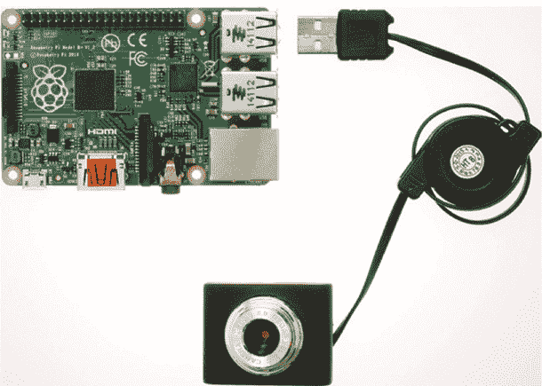
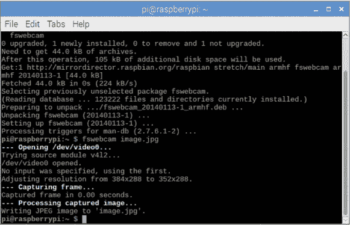
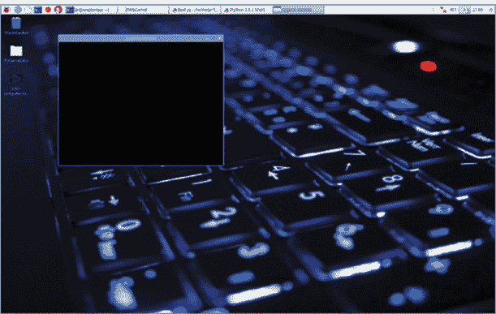
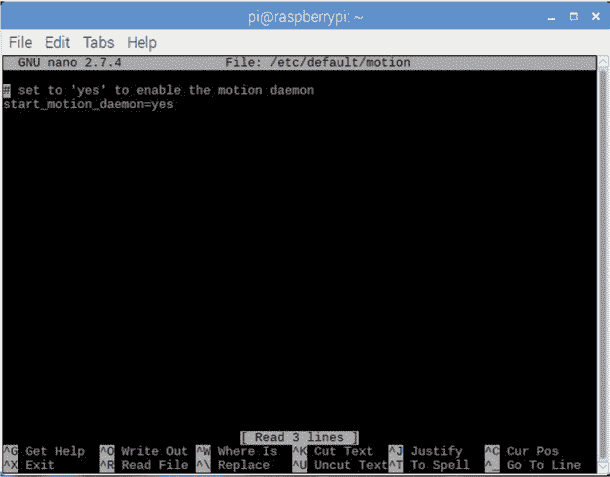
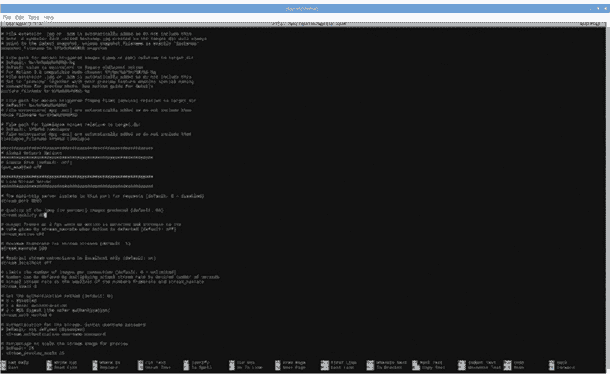
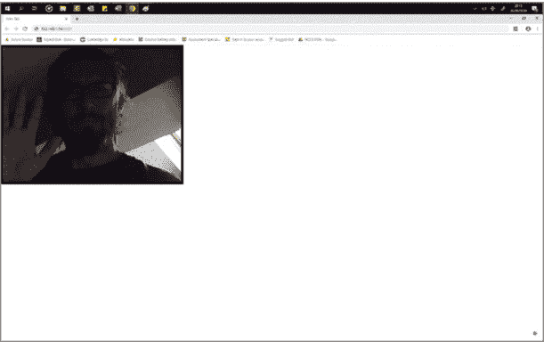

## 第五章：Pi 间谍第一部分：为秘密监控黑客摄像头

在本章中，您将使用 Raspberry Pi 和经典的 USB 摄像头为您进行间谍监控。您将学习如何将摄像头与 Pi 配合使用。然后，您将把摄像头的实时画面传输到远程设备，比如您的手机，制作一个廉价的家庭监控系统。通过摄像头，您可以监控宠物、花园或您的兄弟姐妹。您甚至可以把它藏在一个不起眼的地方，找出是谁在偷吃家里的巧克力！

### 您将需要的设备

以下是您在此项目中需要的物品：

+   Raspberry Pi

+   USB 便携电池

+   USB 摄像头

如今，大多数计算机或计算机显示器都配有内置摄像头，因此原始的 USB 型摄像头通常可以在网上低价购买。您甚至可能会在抽屉的角落找到一个。如果您购买摄像头用于此项目，建议选择来自 *[`elinux.org/RPi_USB_Webcams`](https://elinux.org/RPi_USB_Webcams)* 的摄像头，它已被证明可以与 Pi 配合使用。

您将使用 USB 电池供电来为间谍摄像头提供电力，并使其便于携带——因此购买一个品牌电池是值得的。虽然它们略贵一些，但质量更高，使用寿命也比预算款更长。您可以将摄像头隐藏在棚子里或家里的一个空麦片盒中，无需担心插入电源插座。这样，电线就不会暴露出来，暴露了秘密。

### 设置您的摄像头

首先将摄像头连接到您的 Pi，并测试它们的兼容性。启动您的 Raspberry Pi，连接显示器、键盘和鼠标。完成设置后，您可以将这些设备移除。只需将摄像头线的 USB 端插入其中一个备用 USB 端口，如图 5-1 所示。

现在通过以下步骤检查摄像头是否正常工作。



**图 5-1** 安装摄像头

1.  **识别摄像头：** 您可以通过打开终端并输入 `ls` 命令来检查 Raspberry Pi 是否识别到摄像头。此命令会列出所有当前连接到 USB 端口的设备，输出类似于这样：

    ```
    pi@raspberrypi:- $ lsusb
    Bus 001 Device 007: ID 1908:2311 GEMBIRD
    Bus 001 Device 006: ID 093a:2510 Pixart Imaging, Inc. Optical
    Mouse
    Bus 001 Device 005: ID 0e6f:0149 Logic3
    Bus 001 Device 004: ID 05e3:0610 Genesys Logic, Inc. 4-port hub
    Bus 001 Device 003: ID 0424:ec00 Standard Microsystems Corp.
    SMSC9512/9514 Fast Ethernet Adapter 
    Bus 001 Device 002: ID 0424:9514 Standard Microsystems Corp.
    SMC9514 Hub
    Bus 001 Device 001: ID 1d6b:0002 Linux Foundation 2.0 root hub
    ```

    我的摄像头是 Logic3，您可以在输出的第三行看到它。您可以查看您的摄像头品牌名称，或者移除所有其他连接的 USB 设备（除了键盘），看看哪些设备仍然列出。如果您的摄像头未列在输出中，请尝试重新启动 Raspberry Pi 并重新运行代码。如果摄像头仍未显示在输出中，可能是您的型号不兼容，您需要更换一个。前面提供的网站列出了与 Pi 兼容和不兼容的摄像头。

1.  **安装摄像头软件：** 现在，你将安装一个名为*fswebcam*的程序，它将在继续主项目程序之前测试摄像头是否正常工作。没有什么比编写程序后发现硬件不兼容更糟糕的了！返回终端窗口，输入以下命令下载并安装所需的软件：

    ```
    pi@raspberrypi:- $ sudo apt-get install fswebcam
    ```

1.  **拍摄测试图像：** 安装完程序后，你可以通过拍摄图像来测试摄像头。在终端中输入以下命令，从摄像头拍照并将其保存为名为*test*的图像文件：

    ```
    pi@raspberrypi:- $ fswebcam test.jpg
    ```

    要查看图像，打开你的 Pi *home*文件夹，找到*test.jpg*文件，并双击它。如果已经拍照，说明摄像头工作正常！图 5-2 显示了图像成功捕获后终端窗口的输出。如果没有拍照，你可能需要使用不同的网络摄像头。另外，检查摄像头是否已连接，并确保代码正确无误。



**图 5-2** 从网络摄像头捕获图像

### 从网络摄像头流式传输视频

现在你知道网络摄像头已经正确安装并工作，你可以编写一个简单的程序，将摄像头捕获的图像流传输到树莓派。你将使用一个名为*PyGame*的代码包，它是一个为编写视频游戏而设计的 Python 模块集。然而，它也包含了计算机图形、视频和声音库，专为与 Python 一起使用而设计。你将借用一些 PyGame 的函数和工具，以免自己编写这些功能。

PyGame 在树莓派操作系统中预先安装，因此你不需要下载它。打开一个新的 Python 文件，并将其保存为*pi_spy.py*。然后输入示例 5-1 中的代码，这是代码的第一部分。

```
❶ import sys
❷ import pygame
   import pygame.camera
❸ pygame.init()
   pygame.camera.init()
   # set the size of the window
❹ screen = pygame.display.set_mode((320,240),0)
```

**示例 5-1** Pi spy 代码的第一部分

和大多数程序一样，你首先需要导入所需的模块和 PyGame 库。首先，导入系统模块❶，然后导入`pygame`。从`pygame`中导入`pygame.camera`模块❷。

接下来，初始化`pygame`和摄像头命令❸。这为`pygame`的运行做好准备。代码的最后一行设置了`pygame`窗口的大小❹。PyGame 将在一个单独的窗口中运行程序，这一行代码在运行程序时会创建该窗口。你可以通过调整当前设置为 320 × 240 的宽度和高度来更改窗口的大小。图 5-3 显示窗口只占据了屏幕的一小部分。一些网络摄像头支持更高的分辨率。你可以在*[`elinux.org/RPi_USB_Webcams`](https://elinux.org/RPi_USB_Webcams)*找到几个选项。



**图 5-3** 网络摄像头窗口

接下来，你将使用 PyGame 找到连接的网络摄像头并启动它。为此，将示例 5-2 中的代码添加到你的程序中。

```
   # locate the camera and turn it on
❶ cam_list = pygame.camera.list_cameras()
❷ print (cam_list)
❸ webcam = pygame.camera.Camera(cam_list[0],(32,24))
❹ webcam.start()
```

**LISTING 5-2** 程序的第二部分：启动网络摄像头

首先，你需要让 PyGame 通过请求列出可用的摄像头来找到网络摄像头。你创建一个变量来保存摄像头搜索的结果❶，这应该返回你的单个网络摄像头。结果将存储在一个包含一个项的列表中，因为这里只有一个网络摄像头。

然后，你打印结果列表❷，以确保你的摄像头已经被找到。如果你只连接了一个网络摄像头，它应该列在位置 0。记住，列表编号总是从 0 开始，而不是 1。

然后，你设置网络摄像头并将详细信息存储在名为`webcam`的变量中，以便稍后可以更方便地再次调用它❸。摄像头的名称从你之前通过传递列表名`[0]`获得的`cam_list`中提取，这告诉 Python 从列表中位置 0 的第一个项目获取值。

你还指定了网络摄像头图像的尺寸。你可以看到这些尺寸在括号中，而不是方括号，值之间用逗号分隔：这是一种被称为*元组*的数据类型，它类似于列表，但其中的值是不可更改的。元组通常被称为*不可变*的，这意味着在程序运行时，元组内部的数据不能被更改。代码❸会改变显示在流窗口中的图像质量。如果你将尺寸设置为 32 × 24，视频流会看起来更像像素化的画面，但 PyGame 窗口保持原始的 320 × 240 大小。要更改它，你必须返回代码，编辑尺寸，然后重新运行程序。

代码的最后一行告诉摄像头开始工作❹，这会启动摄像头。

现在进入程序的最后部分。将 Listing 5-3 中的代码添加到你的程序中。

```
❶ while True:
       # stream the images and scale to a set size
    ❷ stream = webcam.get_image()
    ❸ stream = pygame.transform.scale(stream,(320,240))
    ❹ screen.blit(stream,(0,0))
       # update the display
    ❺ pygame.display.update()
```

**LISTING 5-3** Pi 间谍的最终代码：视频流

你开始时创建一个`while`循环，以使程序继续运行后续的指令❶。该循环告诉 PyGame 不断从网络摄像头获取图像并在屏幕上显示。

然后创建一个变量来存储从附加的网络摄像头获取的图像❷。下一行代码❸将每张图像缩放以适应之前输入的屏幕大小。在此情况下，它将图像缩放为 320 × 240，以匹配在程序开始时`screen = pygame.display.set_mode((320,240),0)`变量中设置的尺寸。如果你更改了窗口大小或缩放比例，请确保这些尺寸匹配。

要在屏幕上绘制视频图像，你可以使用 PyGame 中的`blit()`函数❹。你的显示屏由数百万个微小的点组成，这些点被称为*像素*，它们可以打开或关闭。当你在屏幕上显示一张图像时，软件会管理哪些像素是开着的，哪些是关着的，以及它们的颜色。像素还构成了你的图像。来自网络摄像头的视频由许多静态图像组成，这些图像一个接一个地播放，类似于翻页书或动画。*Blitting*操作会将某一图像的所有像素复制到屏幕上的像素，显示该图像。然后，当程序循环时，会从摄像头捕获下一张图像并保存。使用`blit()`函数更新像素，生成视频。

代码的最后一行❺更新了 PyGame 窗口，显示了网络摄像头的流视频，供你观看。程序然后再次循环，收集一张新图像，进行 blitting，然后显示在你的屏幕上。

保存你的程序并运行！记住，按下**F5**将保存并执行程序。一个小的 PyGame 窗口将弹出，你会看到来自网络摄像头的实时视频流。

### 将实时视频流传输到设备

到目前为止，你的 Pi 的视频流来自与你的 Pi 同一位置，这没问题，如果你坐在桌前并能观看 PyGame 窗口。但假设你想在不同的地点进行监控。比如，你想在窗户旁安装一个摄像头，监控家门口的情况，以便看到访客接近？或者你可能想把摄像头藏在厨房，看看你离开时宠物们在做什么。你甚至可以把摄像头用作简单的卧室监视器。接下来的程序将教你如何为此类项目制作一个便携式间谍摄像头。

确保你的摄像头仍然插在树莓派的 USB 端口上。接着，你需要下载并配置一款叫做*motion*的实用软件，它能让你将摄像头的图像流传输到某个设备上，比如你的手机或平板电脑。为此，你需要确保树莓派*和*观看设备都已连接到你的家庭网络。按照以下步骤操作：

1.  **安装软件：** 要下载并安装*motion*程序，请打开终端并输入以下命令：

    ```
    pi@raspberrypi:- $ sudo apt install motion
    ```

1.  **找到你的 IP 地址：** 要从其他设备访问实时视频流，你需要知道你的树莓派 IP 地址。*IP 地址*是用来标识网络上每个设备的地址。就是这个地址使得你的树莓派、游戏机和智能电视能够同时在线，而不会意外收到错误的数据。在终端中查找你的树莓派 IP 地址，输入以下命令：

    ```
    pi@raspberrypi:- $ ip addr show
    ```

    或者输入以下命令：

    ```
    pi@raspberrypi:- $ hostname -I
    ```

    这个命令会列出与网络连接相关的许多数据。查找以`wlan0`开头的行。在第二行，你会找到 IP 地址，前面有`inet`，并像这样显示：`192.168.1.751`。这是你的树莓派的个人 IP 地址。把它写下来，因为稍后你会用到它。

1.  **创建守护进程以运行程序：** 在计算机术语中，*守护进程* 是一种在后台运行的程序，自动执行任务。您作为用户，无需直接控制它。网络摄像头流媒体不需要任何用户交互，可以作为后台进程运行；因此，您需要通过向 motion 代码文件中添加一行来将其设置为守护进程。在终端窗口中输入以下命令：

    ```
    pi@raspberrypi:- $ sudo nano /etc/default/motion
    ```

    该命令会打开一个名为 *motion* 的文本文件，您可以在其中添加指令。motion 软件会识别 *motion* 文件。在文件的底部，添加以下代码行：

    ```
    pi@raspberrypi:- $ start_motion_daemon=yes
    ```

    这段代码指示守护进程启动网络摄像头服务器，并将其作为后台进程运行，如图 5-4 所示。按 CTRL-X 退出，系统会提示时，按 **Y** 保存文件。



**图 5-4** 网络摄像头服务器窗口

1.  **更改配置文件中的设置：** 在开始流媒体之前，您需要在运动*配置*文件 *motion.conf* 中进行一些更改。在这里，您可以添加或修改代码来更改程序的行为。这个文件很大，包含很多设置，所以我们需要逐步讲解，以免让您迷失。请在终端中输入以下命令以打开 *motion.conf*：

    ```
    pi@raspberrypi:- $ sudo nano /etc/motion/motion.conf
    ```

    配置这些设置：

    **启动守护进程：** 要启动守护进程，请找到文件开头附近的 `daemon off` 项，并将其更改为 daemon on。

    **调整画质：** 将流媒体的图像质量调整为 1 到 50 之间，其中 50 为最高质量。更高的质量会呈现更清晰的图像，但会对树莓派和网络带来更大负担。如果该值过高，树莓派可能无法处理，从而导致崩溃。我建议初始设置为 20。之后，如果您想要更清晰的图像，可以再做调整。找到 `Live Stream Server` 部分，找到 `stream_quality` 行，并将其设置为 20，确保它显示如下：

    ```
    stream_quality 20
    ```

    **调整帧率：** 调整*帧率*会影响每秒显示的帧数。帧数越高，视频播放越流畅。帧数越低，图像会显得更加卡顿。然而，有时设置得太高会消耗过多带宽并导致连接变慢，尤其是在其他人也在使用您的网络时。将帧捕获设置为大约 25，这将使您获得接近实时流的效果，延迟约为 0.2 秒。找到设置项 `stream_maxrate` 并将其设置为 50。同样，您可以稍后根据您的网络能力调整这些设置。

    **更改显示的视频大小（可选）：** 如果您在智能手机或平板电脑上查看视频，您可能需要将视频窗口大小调整得更小。在这种情况下，找到配置文件中的 `width` 和 `height` 项，并调整数字以适应您的设备。您可能需要尝试几个不同的数字，直到找到合适的大小。

    **最终设置：** 将 `stream_localhost` 行设置为关闭，以便将摄像头图像流传输到你的移动设备，而不仅仅是树莓派（本地主机）。完成这些更改后，按 CTRL-X。系统会提示你保存配置文件的更改。按 **Y** 选择 *是*。如果以后想要再次更改图 5-5 中显示的一些设置，只需使用 `sudo nano /etc/motion/motion.conf` 命令打开文件。然后进行所需的调整，退出并保存文件。



**图 5-5** 设置窗口

1.  **启动运动检测：** 要启动网络服务器并捕获视频流，请输入以下命令：

    ```
    pi@raspberrypi:- $ sudo service motion start
    ```

1.  **访问视频流：** 要访问视频，打开你要流式传输到的设备上的浏览器窗口。在地址栏中，输入树莓派的 IP 地址（即你之前记录下来的地址）；在地址的末尾，添加端口号 :8081。完整的地址应该类似于 `192.168.1.56:8081`。按下 ENTER 键后，浏览器会查找你树莓派的 IP 地址并与之连接。树莓派和运动程序将响应并开始将来自摄像头的实时视频流传输到你的设备，正如图 5-6 所示。



**图 5-6** 向浏览器传输实时视频

现在，你需要找到一个地方来隐藏你的树莓派和摄像头开始间谍活动；只要确保摄像头有清晰的视野！你可以移除显示器、鼠标和键盘，将树莓派间谍摄像头放置在一个合适的位置。记得确保树莓派处于 Wi-Fi 信号范围内，这样图像才能传输到你的移动设备上。

### 停止和重新启动运动检测

一旦你完成了网页流的使用，你可以回到你的树莓派并重新连接显示器、鼠标和键盘。然后打开终端并输入以下命令来停止程序并结束流：

```
pi@raspberrypi:- $ sudo service motion stop
```

如果你无法访问显示器和键盘，只需切断树莓派的电源以停止流。

有时你的运动软件可能会卡住，视频流会停止。如果发生这种情况，图像将变为静态或冻结。此时，通过以下命令重新启动软件：

```
pi@raspberrypi:- $ sudo service motion restart
```

每当你调整配置文件设置时，也应重新启动软件。

如果你正在秘密使用你的摄像头，请记得在访问你的 Pi 并重新启动程序之前，确保周围没有人。否则，你会暴露隐藏摄像头的位置。

### 总结

现在你拥有了一个紧凑的间谍摄像头，可以自由使用它。你将在第十一章中再次使用树莓派的图像能力，设置一个自然盒子，用来拍摄任何触发其传感器的物体的隐秘照片。现在，尝试调整设置，看看什么分辨率、帧率和大小最适合你的系统。
