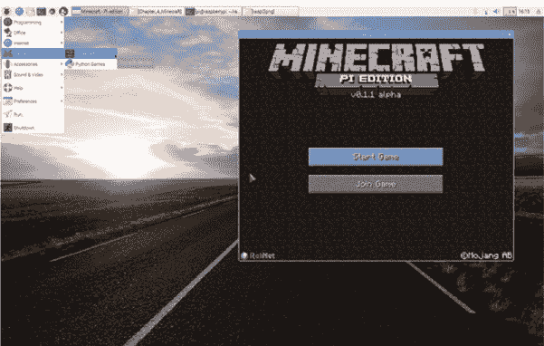
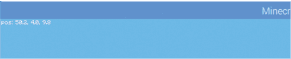
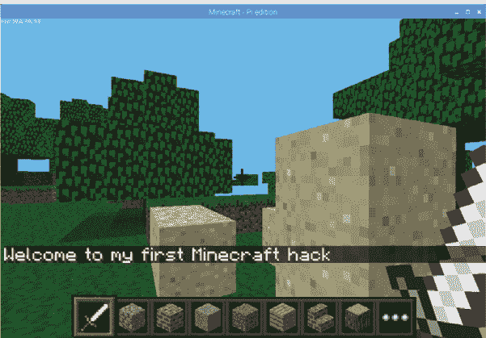
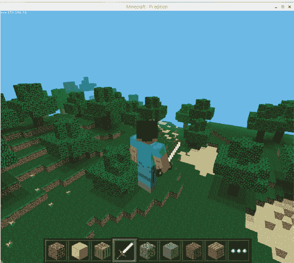
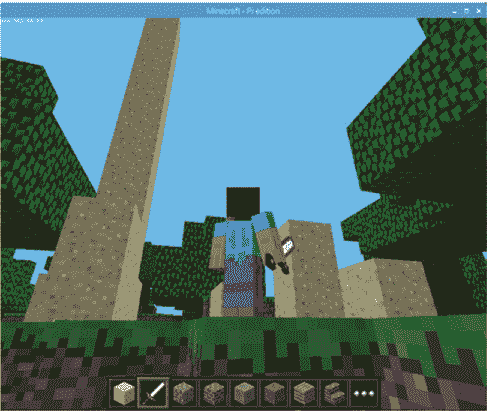
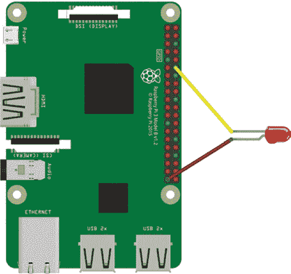
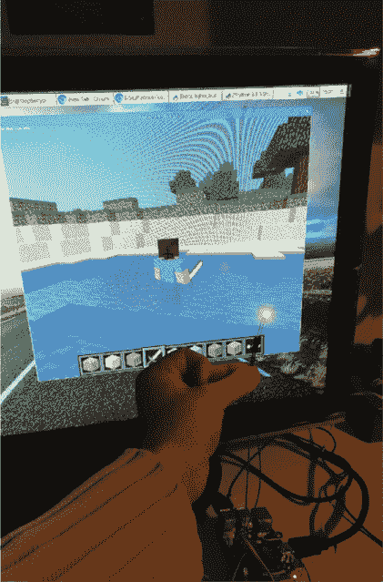
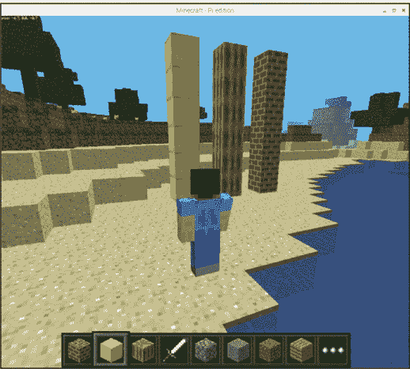

## 第六章：操控 MINECRAFT

在本章中，你将编写 Python 程序，进入 Minecraft 环境，进行一些酷炫的操作。你将向 Minecraft 世界发送信息，并把草地变成蹦床。然后，你将编写第一个 Minecraft 游戏，*沙子掉落*，玩家需要躲避掉落的沙块。利用你在第三章中制作的胶枪 LED 灯，你将加入实际的硬件，并从 Minecraft 中控制它。结合 Minecraft 的强大功能和 Pi 摄像头，你将创建一个隐藏的摄像头，通过金块、砖块和西瓜塔来控制它！

### 你将需要的物品

在本章的大多数项目中，你将使用 Python 和 Minecraft 编程，因此你只需要 Pi 和计算机，其他物品并不多。以下是你需要的几个额外物品：

+   Raspberry Pi

+   你的胶枪 LED 灯或带有 220-330 欧姆电阻的新 LED

+   跳线

+   Pi 摄像头

### 在 Raspberry Pi 上运行 MINECRAFT

你可能已经熟悉 Minecraft，但如果你不熟悉，这里有个描述：Minecraft 是一款游戏，你可以在其中开采、制造和创造各种奇特的物品，所有的操作都发生在一个由各种地形、栖息地和材料构成的 3D 世界中。它常被描述为 LEGO 的计算机游戏版。这个世界是自由漫游的：你可以作为主角 Steve 或 Alex，随意旅行、观看你想看的事物，基本上做你想做的任何事情。

Raspberry Pi 操作系统预装了 Minecraft Pi 版。这是一个简化版的游戏，让你通过多种编程语言，包括 Python（我们将在这里使用它），来修改 Minecraft 世界。

#### 启动 Minecraft

启动你的 Raspberry Pi，点击屏幕左上角的 Pi 图标。会弹出一个下拉菜单。向下滚动并点击 **Games** 标签，出现打开 Minecraft 的选项。点击该选项加载 Minecraft Pi 版，如图 6-1 所示。加载时间取决于你使用的 Pi 型号，可能从几秒钟到一分钟不等。在 Pi 4 型号上，Minecraft 加载最快。



**图 6-1** 加载 Minecraft Pi 版

在 Pi 上使用 Minecraft 和在计算机上使用是一样的。Pi 使用经典的键盘控制布局来移动玩家角色。但 Pi 版有额外功能：它允许你 *飞行*，意味着你可以迅速到达其他地方。你可以通过按下空格键两次来实现飞行，使用箭头键控制方向，使用鼠标来控制玩家的视角（和以前一样）。

你在这些黑客操作中将使用的另一个控制键是 TAB 键。它可以将鼠标从 Minecraft 控制中释放，这样你就可以点击其他地方。这意味着你可以选择 Python 编程界面，编写新的代码或选择你要运行的程序。然后，你可以启动 Minecraft，并在世界的中间双击鼠标左键或右键：鼠标的移动将再次控制玩家的视角。

这个表格显示了 Minecraft 主要控制的按键。

| **键** | **动作** |
| --- | --- |
| W | 向前移动 |
| A | 向左移动 |
| S | 向后移动 |
| D | 向右移动 |
| E | 加载物品栏 |
| 空格键 | 跳跃 |
| 双击空格键 | 飞行/下落 |
| SHIFT | 向下漂浮 |
| ESC | 暂停/游戏菜单 |
| TAB | 释放鼠标光标 |

#### 找到自己：使用 X、Y 和 Z 坐标

尽管 Pi 版 Minecraft 的世界没有完整版那么大，但仍然很容易迷路。为了定位玩家在世界中的位置，游戏使用 x、y 和 z 坐标，如图 6-2 所示。



**图 6-2** x、y 和 z 坐标位于窗口的左上角。

这三个值是游戏的核心部分。它们确保你在程序中创建的事件发生在玩家的位置。你将在程序中使用这些坐标。

坐标值显示在屏幕的左上角。所有的值都是从游戏世界的中心开始测量的。因此，如果你处于 x、y 和 z 值为 0.0、0.0、0.0 的位置，你就处于世界的正中心。负数或减号的 x 值表示玩家位于世界中心的左侧；负数的 y 值表示玩家位于中心的下方；负数的 z 值表示玩家位于中心的后方。例如，0.0，-45.7，0.0 意味着玩家位于世界中心下方 45.7 个方块的位置。但世界是随机生成的，所以世界的大小会有所不同。此表列出了这些坐标的最大值和最小值。

| **坐标** | **表示** | **最小值** | **最大值** |
| --- | --- | --- | --- |
| x | 左右移动 | -255 | +255 |
| y | 上下移动 | -128 | +128 |
| z | 前后移动 | -255 | +255 |

#### 破解 Minecraft

让我们开始破解 Minecraft 吧！Raspberry Pi 操作系统允许你通过 Python 代码直接连接到 Minecraft。你可以开发并编写程序，打开并启动 Minecraft 游戏，运行代码，然后返回到 Minecraft 世界中，查看效果。

在运行黑客程序时，除非你使用的是 Raspberry Pi 4，否则不要在全屏模式下运行 Minecraft；应保持窗口的默认大小。全屏模式会阻止你查看代码或任何程序错误，并且对显卡的要求非常高，会导致游戏卡顿。如果你使用的是 Pi 4，可以放心使用全屏模式！另外，由于 Minecraft 程序中的一个 bug，全屏模式还会阻止你访问背包中的最后一行物品。

### 向聊天室发送消息

我们将从一个简单的程序开始，它会向 Minecraft 世界发送一条消息，如图 6-3 所示。这个黑客程序只有三行代码，它将教你 Python 和 Minecraft 之间的交互方式。



**图 6-3** 在 Minecraft 中显示聊天消息

#### 编写聊天消息程序

要开始你的第一个黑客程序，打开 Python 并创建一个新文件。然后在清单 6-1 中输入程序代码。记住，你可以从* [`www.nostarch.com/raspiforkids/`](https://www.nostarch.com/raspiforkids/)*下载程序，进行对比或直接运行下载的 *first_program.py* 文件。

```
from mcpi import minecraft
mc = minecraft.Minecraft.create()
mc.postToChat("Welcome to my first Minecraft hack")
```

**清单 6-1** Minecraft 消息程序

首先，导入 `mcpi` 库，它允许你使用 Python 控制 Minecraft。这个库告诉程序在 Minecraft 中打开并运行。为了在 Minecraft 世界中触发事件，使用库中的 `minecraft.Minecraft.create()` 函数从 Python 到 Minecraft 创建连接。将该函数存储在变量 `mc` 中，这样你每次就不需要重新输入。然后，在新创建的 `mc` 变量后，使用 `postToChat()` 函数在 Minecraft 游戏中显示消息。你可以随意更改引号内的消息内容，显示任何你想要的文本。

#### 运行你的程序

要运行程序，保存文件后打开 Minecraft。启动游戏并等待世界加载。一旦加载完成，按 TAB 键释放鼠标，使你能够找到你的黑客程序。接下来，选择你的 Python 程序（如果你关掉了它，就重新打开），然后按 **F5** 执行它。程序会自动在 Minecraft 中运行。通过点击任意鼠标按钮返回 Minecraft 游戏，你的自定义消息应该会出现。恭喜！你已经制作了你的第一个 Minecraft 黑客程序！接下来，让我们做一些更有冒险性的事情。

### 蹦床草地

这个蹦床项目带你一步步创建你的第一个真正的互动程序。每当你踏上草地上的一个方块时，你会像在蹦床上一样弹跳起来，如图 6-4 所示。



**图 6-4** 将所有草地变成蹦床

#### 编写蹦床草地程序

打开 Python 并开始一个新文件，启动黑客任务。输入清单 6-2 中的程序代码。记住，你可以从*[`www.nostarch.com/raspiforkids/`](https://www.nostarch.com/raspiforkids/)*下载程序，使用它与你的程序进行对比，或者直接运行下载的*trampoline.py*文件。

```
from mcpi import minecraft
mc = minecraft.Minecraft.create()

❶ while True:
      ❷ p = mc.player.getTilePos()
      ❸ b = mc.getBlock(p.x,p.y-1,p.z)      
      ❹ if b == 2: # grass
          ❺ mc.player.setPos(p.x, p.y+20, p.z)

```

**清单 6-2** 跳床草程序

再次从`mcpi`库导入`minecraft`模块，以便你能使用 Python 控制 Minecraft。将`minecraft.Minecraft.create()`连接保存到一个名为`mc`的变量中。

然后创建一个`while`循环❶，如你在第二章中记得的那样，确保程序一直运行下去。同时，记得在`while`语句后缩进四个空格，因为它属于循环的一部分。

在循环中，你可以找到并返回玩家在 Minecraft 环境中的当前位置❷，以及玩家站立的方块类型❸。这很重要，因为只有草地是有弹性的，而其他地面没有。这一位置将返回一个 ID 号，并存储在名为`b`的变量中。你从方块的 y 位置中减去 1，这个 y 值是上下坐标。原因是你想影响玩家*下方*的方块，而不是玩家本身。

使用条件语句检查你站在什么样的地面上❹。每种方块都有一个 ID 值，草方块的 ID 值是`2`。所以你检查存储在变量`b`中的方块 ID 值是否等于`2`，只有当它的值为`2`时，才运行代码让草地变得有弹性。

当条件判断发现玩家*确实*站在草地上时，使用`setPos()`将玩家送到空中到新的 y 位置❺。你想让玩家向上移动，而不是横向移动，所以保持相同的 x 和 z 位置，只需将 y 值加上 20。玩家应该会飞跃到空中。

#### 运行你的程序

如之前一样，保存你的程序并确保 Minecraft 已打开。恢复游戏并等待世界加载完毕。按 TAB 键将鼠标从游戏中释放，然后选择你的 Python 程序。按**F5**运行程序，然后点击 Minecraft 窗口回到游戏中。四处走动，注意那片草地！

如果你遇到任何错误，检查是否按清单 6-2 中的缩进格式编写代码。还要确保在`while True`和`if`语句后都加上了冒号。

#### 更进一步

你可以修改程序，让玩家飞得更高、更低，甚至进入地下——一种反重力蹦床——通过改变 `mc.player.setPos()` 中的 `p.y` 数值。尝试一些不同的数字来查看效果。作为另一个挑战，尝试改变触发方块的 ID，让水代替沙块触发蹦床。查看方块 ID，请访问 *[`www.raspberrypi-spy.co.uk/2014/09/raspberry-pi-minecraft-block-id-number-reference/`](https://www.raspberrypi-spy.co.uk/2014/09/raspberry-pi-minecraft-block-id-number-reference/)*。

### 沙块掉落游戏

现在，你将制作你的第一个游戏，叫做 *沙块掉落*。在这个简单的游戏中，沙块从天空中掉下来，玩家需要躲避它们。在 Minecraft 环境中，沙块会自动受到重力的影响：如果你将沙块放在玩家上方，它会向下掉落，如果玩家没有及时移动，沙块就会砸到玩家。如果其中一个沙块击中了玩家，游戏就结束了。

你将编写程序，让沙块随着你在世界中移动（见图 6-5），所以别以为你可以逃跑。沙块正追着你呢！



**图 6-5** *沙块掉落* 游戏

#### 编写沙块掉落游戏

通过打开 Python 并开始一个新文件来开始破解。将程序代码输入清单 6-3。记得你可以从 *[`www.nostarch.com/raspiforkids/`](https://www.nostarch.com/raspiforkids/)* 下载程序，并用它来与自己的程序进行比较，或者直接运行下载的 *sand_drop.py* 文件。

```
from mcpi import minecraft
mc = minecraft.Minecraft.create()
from time import sleep

❶ sleep(5)
pos = mc.player.getTilePos()

❷ while mc.getBlock(pos.x, pos.y, pos.z) != 13:
     mc.setBlock(pos.x, pos.y + 25, pos.z, 13)
     sleep(1)
     pos = mc.player.getTilePos()
❸ mc.postToChat("Got you!")

```

**清单 6-3** *沙块掉落* 游戏程序

和以前的破解一样，首先导入 `minecraft` 库，并将事件触发器存储在 `mc` 变量中，这样就可以简化操作，避免每次都输入 `minecraft.Minecraft.create()`。

同时从 `time` 模块导入 `sleep()` 函数，该函数在每个沙块掉落之间添加了一个小延迟。这样可以给你一些时间来躲避每个沙块。在游戏开始和沙块开始掉落之前，添加一个短暂的时间延迟 ❶，这样你可以有时间从 Python 窗口返回到游戏。沙块会随着你移动，所以你需要获取玩家的 x、y 和 z 坐标数据。使用 `while` 循环检查是否有沙块击中你 ❷。这个循环通过检查玩家当前位置的方块 ID 来判断，如果方块 ID 不是 13——沙块，那么你还没有被击中。

如果你没有被击中，下一行代码会将沙块放置到指定位置并掉落。注意，沙块的 y 坐标是 +25，这意味着沙块在掉落前会在你上方 25 个方块的位置被放置。然后，你需要等待 1 秒钟才运行下一行代码，这时会读取玩家新的 x、y 和 z 坐标，以防你已经移动。如果沙块击中了你，Minecraft 世界中会发布一条消息，游戏结束 ❸。

#### 运行你的程序

如前所述，将程序保存为*sand_drop.py*，确保 Minecraft 已经打开，并开始或继续游戏。按下 TAB 键释放鼠标，然后选择并执行你的 Python 程序。返回 Minecraft 游戏，准备好躲避掉落的沙子。

#### 进一步探讨

如果你想测试你的反应能力，尝试改变方块的高度，使游戏更加具有挑战性。如果方块在开始掉落时距离玩家较近，你将有更少的时间来反应。你也可以减少每次方块掉落之间的延迟或`sleep()`时间。

Minecraft 中不同的方块有不同的物理特性。通过将方块从沙子换成其他类型的方块来测试这个世界。这会改变方块掉落的方式：它可能掉得更慢，也可能更快，或者可能落在不同的位置，影响你的游戏方式。可以尝试下表中的方块作为开始。

| **方块类型** | **方块 ID** |
| --- | --- |
| 水 | 9 |
| 熔岩 | 10 |
| 沙砾 | 13 |

所有方块 ID 的列表可以在 *[`www.raspberrypi-spy.co.uk/2014/09/raspberry-pi-minecraft-block-id-number-reference/`](https://www.raspberrypi-spy.co.uk/2014/09/raspberry-pi-minecraft-block-id-number-reference/)* 上找到。

### MINECRAFT 控制的 LED

在这个项目中，你将编写一个程序，让你使用 Minecraft 控制你在第三章中制作的热熔胶枪 LED 灯。每当你在 Minecraft 世界中触碰到水时，现实世界中的灯就会亮起。当你离开水域时，灯会熄灭。

#### 连接 Minecraft LED

使用你在第三章中制作的定制热熔胶枪灯，或者使用新的 LED，将一根公对母的跳线连接到 LED 的每根引脚。将*较长*的正极引脚连接到 GPIO 引脚 18：这是 Pi 上的物理引脚 12。将另一根跳线连接到任意一个地线引脚：可选的物理引脚有 9、14、20、30、34 或 39。图 6-6 显示了接线图。



**FIGURE 6-6** 连接 LED

#### 编写 Minecraft LED 控制程序

打开一个新的 Python 文件并输入 Listing 6-4 中的代码。

```
❶ from gpiozero import LED
   import time

   from mcpi.minecraft import Minecraft
❷ mc = Minecraft.create()

❸ led = LED(18)

❹ while True:
       x,y,z = mc.player.getPos()
    ❺ block_id = mc.getBlock(x, y, z)

    ❻ if block_id == 9: # 9 = water
           led.on()
       else:
           led.off()
```

**LISTING 6-4** Minecraft LED 程序

首先从`gpiozero`库导入`LED`类 ❶，正如在第三章中所做的那样。同时导入`time`模块，以便在需要时添加延迟，并导入`minecraft`库。再次设置变量`mc`来存储`minecraft`库的代码 ❷。

告诉 Pi LED 连接在 18 号引脚上 ❸，并创建一个`while`循环 ❹，使程序持续运行接下来的几行缩进的代码。然后获取玩家的 x、y 和 z 坐标数据。使用`getBlock()`函数来找出你所站立的方块的 ID，并将这个 ID 存储在名为`block_id`的变量中 ❺。回想一下，你可以在 *[`www.raspberrypi-spy.co.uk/2014/09/raspberry-pi-minecraft-block-id-number-reference/`](https://www.raspberrypi-spy.co.uk/2014/09/raspberry-pi-minecraft-block-id-number-reference/)* 上查看方块 ID。

检查方块的 ID 是否等于 9，这是水的 ID ❻。如果是，LED 灯将点亮。如果你不站在水上，LED 灯将熄灭。

#### 运行你的程序

保存你的程序，打开 Minecraft，按 TAB 键释放鼠标。选择你的程序并通过按 **F5** 执行它。返回 Minecraft 游戏并找到一些水！当角色站在水中时，LED 应该亮起，如 图 6-7 所示。



**图 6-7** 当角色接触到水时，LED 点亮。

### 摄像头监控 Minecraft 塔楼

在这个破解中，你将设置一个监控摄像头，并通过 Minecraft 控制它。对于周围的其他人来说，看起来你只是简单地在玩 Minecraft。但实际上，你将使用游戏中的三个塔楼来控制摄像头。塔楼 1 由金块构成，触发摄像头拍照。塔楼 2 由砖块构成，开始录制视频。塔楼 3 由西瓜构成—没错，是西瓜—结束视频录制。要触发每个塔楼，你将用剑击打它。然后你可以查看照片并观看视频，或者拍摄另一个视频或照片。

在开始之前，按照 第四章 的方法设置你的 Pi 摄像头。

#### 建造三个触发塔楼

让我们来制作秘密触发塔楼。加载一个新的 Minecraft 世界，找到一个合适的平坦空间来建造三个塔楼。选择背包中的金块，建造一个由三到四个方块组成的小塔楼。

对其他两个塔楼重复相同的过程，只不过使用砖块和西瓜块。把砖块塔楼和西瓜塔楼建得很靠近，因为当你击打砖块塔楼时，视频不会停止录制，直到你击打西瓜塔楼！图 6-8 显示了塔楼的放置位置。



**图 6-8** 摄像头控制塔楼

你实际上可以使用任何你想要的方块，只要你修改程序代码，包含相关的方块名称。但确保每个塔楼只能由一种方块类型构成。

你需要一种方法来触发塔楼，因此通过按 **E** 并选择剑，给玩家装备背包中的剑。当你点击左键时，你会移除方块，点击右键则会击打方块。击打方块并不会摧毁它，而是返回方块数据，你将在这个破解中使用这些数据来控制 Pi 摄像头的功能。在你开始编写程序代码之前，可以先尝试击打这些塔楼。

#### 编写摄像头塔楼的代码

打开一个新的 Python 文件，并输入 清单 6-5 中的代码。这段代码设置了摄像头和玩家的指令消息。稍后你将添加其余的代码。

```
❶ from picamera import PiCamera
   camera = PiCamera()
   camera.resolution = (600, 600) # size of photo
❷ camera.framerate = 100

   from mcpi.minecraft import Minecraft
❸ import mcpi.block as block
   mc = Minecraft.create()

   import time
   import datetime
❹ mc.postToChat("Minecraft Camera Controller")
   time.sleep(4)
   mc.postToChat("Gold = Take a picture")
   mc.postToChat("Brick = Start filming")
   mc.postToChat("Melon = Stop filming")
```

**清单 6-5** 设置摄像头和玩家指令

首先导入 `PiCamera` ❶ 类来控制摄像头。然后创建一个名为 `camera` 的变量来存储 `PiCamera()` 命令，这样你每次就不用重复输入它了。

将相机图像的分辨率设置为 100 ❷。这是 *帧率*：较高的 `framerate` 值会产生流畅的视频，较低的 `framerate` 值则使视频显得更加生硬——但这是一种权衡。帧率设为 100 是合适的，因为如果设置得太高，树莓派会很快耗尽内存，导致无法顺利拍照。如果你想改变视频质量，可以稍后调整 `framerate` 值。

然后，导入常见的 Minecraft 库，以及 `block` 库 ❸，它允许你通过块的名称而不是 ID 号码来识别和引用块。例如，你可以通过名称指定金块、草块、沙块和砖块。最后，导入 `time` 模块和 `datetime` 库，以便为文件名添加时间戳。

添加一行代码，在 Minecraft 中显示程序的标题 ❹。添加一个短暂的延迟，给玩家足够的时间读取信息。然后，再发送一条消息，告知玩家每个块触发的动作；例如，金块会拍照。现在，让我们添加触发器。

##### 击中金塔

现在，你将添加程序的主部分，如 列表 6-6 所示。该代码检查击中的塔块，并根据适当的相机命令做出响应。你将从金塔开始，稍后再添加其他塔。

确保你按照示例缩进代码行：`while` 循环内的代码需要缩进四个空格。接下来，紧随其后的 `for` 循环内的代码需要再缩进四个空格，最后，`if` 语句内的代码需要再缩进四个空格。

```
while True:
  current_time = datetime.datetime.now()

  for hitBlock in mc.events.pollBlockHits():
    # print (hitBlock)
    if mc.getBlock(hitBlock.pos.x, hitBlock.pos.y, hitBlock.pos.z)
    == block.GOLD_BLOCK.id:
      print ("PICTURE")
      mc.postToChat("Smile!")
      time.sleep(1)
      camera.capture('/home/pi/Desktop/'+ str(current_time) +
      'photo.jpg')
```

**列表 6-6** 编写金塔程序

首先创建一个 `while True` 循环，这意味着程序会不断检查你是否击中了某个塔。如果某个塔被击中，记录当前时间并将其存储在名为 `current_time` 的变量中。然后，在屏幕上打印一行，显示你击中的块的详细信息。这包括玩家的 x、y 和 z 坐标，以及塔的 ID 和块的名称。

接下来，你需要确定击中了哪种类型的塔，并采取相应的相机动作。你可以通过 `if` 语句检查你刚刚击中的块是否为金块。如果是，屏幕上会打印出 *PICTURE* 字样。同时，Minecraft 聊天信息中会显示 *Smile!* 提醒角色微笑。等待一秒钟让角色摆好姿势，然后触发相机拍照。

将拍摄的图片存储在桌面上，并赋予它当前时间作为文件名，这个时间是你之前记录并存储在 `current_time` 变量中的。现在，金塔的操作已经完成。将你的程序保存为 *camera_tower.py*，但保持程序打开，以便添加更多代码。

##### 击中砖塔

将示例 6-7 中的代码添加到你的 *camera_tower.py* 程序中。这段代码检查玩家是否击中了砖块。如果是，摄像头将开始录制视频。

```
❷ elif mc.getBlock(hitBlock.pos.x, hitBlock.pos.y, hitBlock.pos.z)
   == block.BRICK_BLOCK.id:
     # print ("brick")
  ❶ mc.postToChat("Video Recording!")
     camera.start_preview()
     time.sleep(1)
  ❸ camera.start_recording('/home/pi/my_video.h264')
```

**示例 6-7** 编程砖块塔

添加一个 `elif` 语句来检查砖块是否被击中 ❶。这就像你添加的 `if` 语句，用来检查金塔是否被击中。但 `elif` 语句表示 *else if*，只有在塔没有由金块构成时才会执行。

向 Minecraft 屏幕发布一条消息，告知玩家视频即将开始录制 ❷。在屏幕上启动预览，以便你可以看到正在拍摄的内容，等待一秒钟，然后触发摄像头开始拍摄。

最后，将文件保存到你的 */home/pi* 文件夹，并命名为 *my_video.h264* ❸。视频将继续录制，直到西瓜塔被击中，或者你通过点击 IDLE 窗口右上角的关闭按钮停止程序。

##### 击中西瓜塔或什么都没击中

程序的最后一部分响应玩家击中西瓜塔、击中其他任何方块或什么都不做的情况。将示例 6-8 中的代码添加到你的 *camera_tower.py* 文件的末尾。

```
    elif mc.getBlock(hitBlock.pos.x, hitBlock.pos.y, hitBlock.pos.z)
    == block.MELON.id:
      # print ("Melon")
      mc.postToChat("Stop the video!")
      camera.stop_preview()
      time.sleep(1)
      camera.stop_recording()
    else:
      pass
```

**示例 6-8** 编程西瓜塔

添加另一个 `elif` 语句来检查被击中的方块是否为西瓜块。如果是，向 Minecraft 发布一条聊天消息，告知玩家视频录制即将停止，并停止预览。等待 1 秒钟，然后停止录制。

然后添加最后一个 `else` 语句，以响应玩家做的其他事情，比如没有击中三座塔中的任何一座。如果玩家没有击中三座触发塔中的任何一座，使用 `pass` 语句。`pass` 语句告诉程序不执行任何操作，除了返回到示例 6-6 中的 `while` 循环开始部分。然后程序会检查下一个方块的交互。

#### 运行你的程序

保存你的程序并运行。如果遇到任何错误，请务必仔细检查缩进级别是否正确。如果你无法让程序运行，可以从下载部分加载 *camera_tower.py* 文件，地址是 *[`www.nostarch.com/raspiforkids/`](https://www.nostarch.com/raspiforkids/)*，并与程序进行比较（或者直接使用我的！）。同时，确保你在代码中使用了正确的大小写字母。还要记得确保 Minecraft 已打开并运行。

拍完一些照片和视频后，点击窗口右上角的中间图标最小化 Minecraft 窗口。你应该能在 Pi 的桌面上看到照片文件。只需点击并打开即可查看每张照片。要查看视频，你需要从终端执行它。点击终端图标。

在终端中输入这一行，但如果你给文件起了不同的名字，请将 `my_video` 替换为你的文件名：

```
pi@raspberrypi:- $ omxplayer my_video.h264
```

这一行运行的是 OMXPlayer，一个专为树莓派制作的视频播放器。按下 ENTER 键，视频应该开始播放。要重新播放，按上箭头键。别忘了与朋友分享你的照片和视频。

### 总结

作为额外的挑战，试着将塔楼改为其他方块，比如羊毛、沙子，甚至黑曜石。你还可以建造更多的塔楼，为你的程序增加更多功能。也许可以加入一个方块，用来为你的照片添加滤镜。

如果你喜欢这些 Minecraft 的技巧并想要更多，务必查看 Craig Richardson 的《*Learn to Program with Minecraft*》（No Starch Press，2015）和 Al Sweigart 的《*Coding with Minecraft*》（No Starch Press，2018）。
