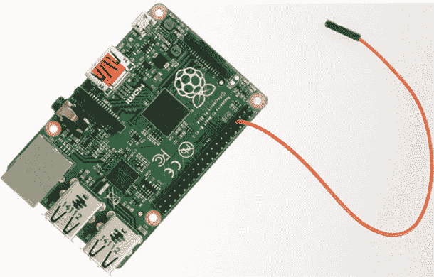
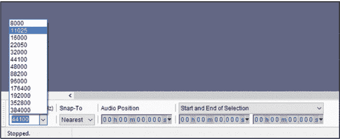
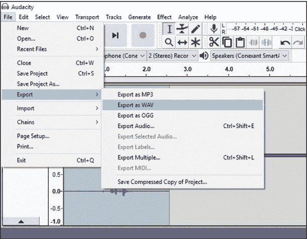
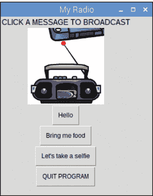

## 第七章：无线电入侵

树莓派总是让我感到惊讶。只需一根跳线，你就能将树莓派转变为一个无线电发射器。没错：你可以用它向真正的收音机广播信息。

在本章的项目中，你将创建一个简单的音效板，用来触发和控制广播到收音机的信号。你将录制一些声音或短语，比如“大家听着”或“我想要一块饼干”，或者创建一个紧急广播信息。然后，你将为每个声音文件分配一个按钮，点击该按钮即可将信息广播到调频到正确频率的收音机。通过劫持无线电波，你将能够恶搞毫无戒心的听众、分享重要八卦，或者创建一个个人广播系统。

无线电波无处不在。当你观看电视时，节目很可能是通过无线电波传输给你的。你家里的 Wi-Fi 路由器会将数据包作为无线电波广播出去。事实上，现在许多汽车使用无线电波编码的数据来解锁车门或启动引擎。那么，如何黑入树莓派并将其变成一个无线电发射器呢？

好吧，GPIO 引脚 4 可以生成扩频时钟信号，扩展带宽，从而使信号在最多 40 米的范围内扩散。你将使用名为 PiFM 的软件来控制该引脚，并使其发送你的 FM 无线电波。你可以在 *[`www.icrobotics.co.uk/wiki/index.php/Turning_the_Raspberry_Pi_Into_an_FM_Transmitter`](http://www.icrobotics.co.uk/wiki/index.php/Turning_the_Raspberry_Pi_Into_an_FM_Transmitter)* 上了解更多关于科学原理和项目的信息。

**法律问题**

在开始之前，请注意，这个项目仅用于教育和学习目的，不得用于商业用途。标准的 4 英寸跳线支持大约 30–40 米的合法广播范围。你需要自行了解你所在国家的相关法律和要求，也有责任遵守这些法律的规定。此项目***不得***在任何机场或军事基地附近使用。

### 你将需要的物品

这是你需要准备的项目物品：

+   树莓派 Zero 或原版 Pi 型号（替代型号：树莓派 Model B+ V1.2 2014 或树莓派 Model A+ V1.1 2014）

+   跳线

+   USB 麦克风（推荐）或其他麦克风

+   支持 FM 的收音机（数字或模拟，最好带有两个扬声器，外部或内置均可）

### 准备树莓派

在构建主项目之前，你需要安装 PiFM 软件，设置收音机，然后检查其是否正常工作。这是一个容易设置的项目。

为了设置硬件，将一根跳线连接到 GPIO 引脚 4——树莓派左侧的第四个物理引脚，如 图 7-1 所示。就这样，这就是你设置的所有硬件，用来广播你的信号。



**图 7-1** 将跳线连接到树莓派

按照以下步骤设置项目：

1.  **创建新文件夹：** 你将创建一个文件夹来存储程序软件和音频文件。打开终端并输入以下命令：

    ```
    pi@raspberrypi:- $ mkdir Radio
    ```

    这个`mkdir`命令会创建一个名为*Radio*的文件夹。通过在终端中输入以下命令进入*Radio*文件夹：

    ```
    pi@raspberrypi:- $ cd Radio
    ```

    命令行的提示符应该现在显示你在*Radio*文件夹中，类似于下面这样：

    ```
    pi@raspberrypi:- $ ~/Radio
    ```

1.  **下载 Python 库：** 通过在终端中输入以下命令，下载所需的 PiFM 库：

    ```
    pi@raspberrypi:- $ wget http://www.tecoed.co.uk/uploads/1/4/2/4/14249012/pifm.tar.gz
    ```

    这一行命令将程序文件下载到你的*Radio*文件夹。文件是压缩的，你需要解压才能访问文件。要解压，输入以下命令：

    ```
    pi@raspberrypi:- $ tar xvzf pifm.tar.gz
    ```

    然后按 ENTER 键将程序文件提取到*Radio*文件夹中。

### 运行测试程序

在加载你自己的声音之前，你需要检查收音机是否正常工作：

1.  **调谐收音机：** 插入收音机并打开它。确保它处于 FM 模式，并调至 100.0 MHz。你应该会听到收音机的嗡嗡声，因为在该频率上没有其他内容广播。

1.  **运行程序：** 返回终端窗口并输入以下代码：

    ```
    pi@raspberrypi:- $ sudo ./pifm sound.wav 100.0
    ```

    按下 ENTER 键；你应该会听到一个熟悉的旋律通过收音机广播。如果你有便携式收音机，可以通过在家里走动或甚至走到户外来测试广播范围。

1.  **更改频率：** 你可以通过更改命令末尾的值来更改广播频率。例如，要在 105.0 频率上广播，输入以下命令：

    ```
    pi@raspberrypi:- $ sudo ./pifm sound.wav 105.0
    ```

1.  **立体声广播：** 下载的程序文件夹包括一个音频文件，用来测试你的收音机的立体声设置。你需要两个扬声器：一个左扬声器和一个右扬声器。像之前一样输入相同的命令行，但这次使用*left_right.wav*文件，如下所示：

    ```
    pi@raspberrypi:- $ sudo ./pifm left_right.wav 100.0
    ```

音乐旋律将再次在你的收音机上播放，但这次，如果你的收音机有两个独立的扬声器，声音将通过两个扬声器播放，形成立体声效果。如果你没有听到声音，请检查以下内容：

+   你正在使用正确的树莓派型号。（树莓派 Zero，原始 Pi 型号，树莓派 Model B+ V1.2 2014，或者树莓派 Model A+ V1.1 2014）

+   你已经将跳线连接到 GPIO 4 引脚。

+   收音机已经调到正确的频率。

+   命令行中的频率与你收音机上的频率匹配。

+   在终端窗口中，你已经进入了*Radio*文件夹，并从该文件夹运行了程序代码。

有时候，如果一个文件在另一个文件执行之前没有停止播放，文件就不会播放，或者你可能只会听到来自收音机的单一音调。重启你的树莓派并重新运行程序。

### 流式播放 MP3 音乐文件

到目前为止，你只播放了 WAV 文件，但你的广播设备也可以播放 MP3 文件，这样你就可以播放常规音乐了。WAV 文件的音质比 MP3 文件更高，但它占用更多的存储空间，这使得 WAV 文件不适合用于流媒体播放和下载音乐。MP3 文件仍然保持高质量，但占用的存储空间要小得多，因此你可以在设备上存储更多内容，并且无需担心缓冲或延迟时间。大多数音乐文件使用 MP3 作为标准格式，这意味着你可以用你的树莓派创建一种便携式扬声器。按照这些步骤试试看：

1.  **下载 MP3 文件：** 下载你最喜欢的歌曲并将它们传输到你的树莓派（参见 第 31 页的“文件传输”部分）；确保它是一个以 *.mp3* 结尾的 MP3 文件。将此文件保存到 *Radio* 文件夹中。另外，我建议将文件重命名为一个简短的名字，以减少在输入命令播放歌曲时发生错误的可能性。

1.  **安装 FFmpeg：** 声音不是数字化的，因此信号需要从模拟转换为一串零和一，以便在计算机上播放。*采样* 过程捕获音频，以便可以进行转换。采样率越高，每秒的捕获次数越多，音质也会越高。大多数 MP3 文件的采样率与 PiFM 程序不兼容，因此你需要安装 *FFmpeg* 程序，它会在广播时实时调整 MP3 文件的采样率。在终端中输入以下命令：

    ```
    pi@raspberrypi:- $ sudo apt install ffmpeg
    ```

    此命令安装 *FFmpeg* 程序。

1.  **播放 MP3 文件：** 安装 *FFmpeg* 后，使用以下命令进入 *Radio* 文件夹：

    ```
    pi@raspberrypi:- $ cd Radio
    ```

    然后输入以下命令，将 name_of_your_file.mp3 替换为你的 MP3 文件名（现在你明白为什么我鼓励你更改文件名了！）：

    ```
    pi@raspberrypi:- $ ffmpeg -i name_of_your_file.mp3 -f s16le -ar
    22.05k -ac 1 -|sudo ./pifm –
    ```

    按下 ENTER 执行代码行。然后打开你的收音机并调到你听到 MP3 播放的频道。恭喜，你的歌曲已经在广播了！要停止播放，按 **Q** 退出，或者按 CTRL-X。

### 录制和广播你自己的文件

现在你将创建自己的音频文件并播放它们。创建和编辑音频文件需要大量的处理能力，因此最好使用另一台设备，如笔记本电脑或台式电脑。这些设备大多数都内置了麦克风，你可以使用它们，或者如果你更喜欢，也可以连接一个 USB 麦克风。

#### 设置你的麦克风和扬声器

要编辑音频文件，你需要安装一个免费的开源音频编辑器叫做 *Audacity*。如果你使用的是 Windows 或 macOS 电脑，请访问网站 *[`www.audacityteam.org/`](https://www.audacityteam.org/)*，点击链接下载软件。然后在你的设备上安装它。如果你使用的是 Linux，请通过常规的终端方法下载软件。

将麦克风插入其中一个 USB 端口。首先，你将录制一段声音以测试麦克风和扬声器；在录制最终的广播声音之前，你需要更改一些设置。准备好后，打开 Audacity，点击**录音**按钮，如图 7-2 所示，开始录音。


**图 7-2** 使用 Audacity 控制

对着麦克风说话。记住，你只是测试程序能否识别麦克风并录制声音，所以说什么内容并不重要。录音完成后，点击**停止**按钮停止录音。点击**播放**按钮播放你的录音。别忘了确保扬声器已经打开并调高音量。如果你能听到声音，说明你的设置正常。

#### 在树莓派上制作并播放你的录音

为了正确广播你的新音频文件，你需要在录音前调整采样率。采样率显示在程序的左下角，在**项目采样率（Hz）**下拉列表中，如图 7-3 所示。点击下拉箭头，从列表中选择**11025**。



**图 7-3** 将项目采样率更改为 11025 Hz

现在，通过点击**录音**按钮，就像之前一样进行录音。

一旦你对录音效果满意，你需要将其导出为 PiFM 程序所需的格式，并进行广播。从菜单中点击**文件**▸**导出**。在弹出的列表中，选择**WAV (Microsoft)**，并选择**签名 16 位 PCM**（如适用）。程序将提示你添加元数据到文件中。*元数据*是关于音轨的信息，如其名称、时长以及制作年份等。你可以通过点击**确定**跳过此选项。图 7-4 显示了两个下拉菜单。



**图 7-4** 导出音频文件

接下来，你需要将你的音频传输到树莓派并保存在*Radio*文件夹中。使用“传输文件”一节中讨论的任一传输方法，或者你也可以将文件复制到 USB 闪存驱动器中，然后插入并将文件复制到树莓派。确保将文件保存到*Radio*文件夹。

#### 广播文件

要播放你的新音频文件，打开终端并输入 cd Radio 进入*Radio* 文件夹。然后，通过输入以下命令列出文件夹中的内容：

```
pi@raspberrypi:- $ ls
```

你应该能看到你新录制的 WAV 文件。输入以下命令，将 myfile 替换为你新录音文件的名称：

```
pi@raspberrypi:- $ sudo ./pifm myfile.wav 100.0
```

打开你的收音机，将其调到 100.0 频率，然后按下 ENTER。你的录音应该会播放出来！

有时你可能会听到一个单一的音调，而不是你的录音。如果在广播完成前被中断，就会出现这种情况。只需重新启动你的树莓派，并再次运行命令即可。

### 编写声音板代码

现在你已经知道如何录制音频文件并通过收音机广播它们，你将创建一个简单的 *图形用户界面* (*GUI*) 声音板来触发和控制广播。GUI 给程序提供了一个用户友好的界面，便于使用。GUI 是大多数计算设备、电视、手机和游戏主机的标配，因为 GUI 使用窗口、图标、菜单和指针来帮助用户控制设备。你将创建一个包含按钮的 GUI 来触发声音，避免每次都必须在终端输入代码。

本项目使用了 `guizero`，一个可以非常简便地创建 GUI 的 Python 库。如果你想了解更多关于 `guizero` 的信息或添加更多功能，可以访问这个网站： *[`lawsie.github.io/guizero/`](https://lawsie.github.io/guizero/)*。通过 GUI，你将为每个自制的 MP3 声音文件分配一个按钮，如 图 7-5 所示。当你点击按钮时，相应的消息将广播到所有调谐到同一频率的收音机。



**图 7-5** 最终的声音板 GUI

#### 创建 GUI 功能

通过打开终端并输入以下命令，下载并安装 `guizero` Python 库：

```
pi@raspberrypi:- $ sudo pip3 install guizero
```

随着 `guizero` 库的进一步开发，其创建者将添加更多的功能和特性。你可以使用以下命令将你的版本升级到最新版本：

```
pi@raspberrypi:- $ sudo pip3 install guizero --upgrade
```

在开始创建你的声音板之前，你需要录制并创建至少三个包含你想要广播的短语的个人声音文件。按照 “录制并广播自己的文件” 部分中的说明在 第 120 页 中录制声音文件。如果你不想录制自己的文件，可以从本书资源中下载示例文件，网址是 *[`www.nostarch.com/raspiforkids/`](https://www.nostarch.com/raspiforkids/)*。资源中还有一张图像可以用作 GUI 窗口。你必须将所有声音文件、代码和图像保存在你在章节开始时创建的 *Radio* 文件夹中。

你将在 IDLE 中创建构建声音板的程序。打开 Python IDLE 编辑器，然后点击 **文件**▸**新建文件** 打开一个新脚本。将你的新 Python 文件保存到 *Radio* 文件夹中，命名为 *radio_gui.py*，并输入 代码清单 7-1 中的代码。

```
❶ import os
   import time 
   from guizero import App, Text, PushButton, info, Picture

❷ def message1():
     print ("Hello")
     os.system("sudo ./pifm hello.wav 100.0")
     time.sleep(1)

❸ def message2():
     print ("Bring me food")
   os.system("sudo ./pifm bringmefood.wav 100.0")
   time.sleep(1)

❹ def message3():
   print ("Let's take a selfie")
     os.system("sudo ./pifm selfie.wav 100.0")
     time.sleep(1)

❺ def close_message():
     info("Goodbye", "See you soon")
     app.destroy()
```

**代码清单 7-1** 构建声音板

程序通过导入操作系统模块 `os` ❶ 开始。该模块允许你在 Python 代码和程序中运行终端命令。因此，你可以为每个按钮分配一个终端命令，以避免每次播放声音时都手动输入命令。

接下来，你导入`time`模块和`guizero`库，然后导入`App`、`Text`、`PushButton`、`info`和`Picture`小部件。我不会讨论这些每一个小部件，但它们共同使你能够控制 GUI 应用程序，创建按钮触发声音，显示信息弹出窗口，以及在声音板中添加图像。

然后你创建了四个独立的函数，每个函数包含触发一个声音文件并将其广播到收音机的指令。

第一个函数是`message1()` ❷，它播放与包含的 WAV 文件名匹配的音频文件。它还会在屏幕上打印`Hello`，让你知道文件已被触发。

你会认出代码行中包含的`sudo ./pifm`，它来自本章的前面部分。注意这次它以`os.system()`开头，这告诉 Python 像从终端执行命令一样运行这行代码，而不是从 Python 编辑器运行。`os.system()`函数是必需的，因为你正在使用 Python 代码编写 GUI 程序，而 PiFM 使用 Linux 命令。`os.system()`函数使你能够在 Python 程序中触发 Linux 命令。将代码中的*hello.wav*替换为你的第一个声音文件的名称，如果需要，调整广播频率。然后为你的其他音频消息添加第二个 ❸ 和第三个 ❹ 函数，记得将文件名改为匹配你的音频 WAV 文件的名称。

第四个函数关闭 GUI 窗口 ❺。此函数会打印一条简短的告别消息，然后销毁应用程序！这听起来不像那么严重：`app.destroy()`函数只是简单地关闭 GUI。

#### 创建窗口和按钮

现在，你可以添加代码部分来创建实际的 GUI 窗口和按钮。将 Listing 7-2 中的行添加到你的*radio_gui.py* Python 程序中。

```
 # sets the size of the app window
❶ app = App(title = "My Radio", width=270, height=350, layout="grid")

   # adds the title
❷ Title = Text(app, text="CLICK A MESSAGE TO BROADCAST", size=11,
   font="consolas", grid=[0,0], align='top')

   # adds the image
❸ radio = Picture(app, image="sound.gif", grid=[2,0], align='top')
```

**LISTING 7-2** 构建 GUI 界面

第一行代码设置了 GUI 窗口的标题以及窗口的宽度和高度（以像素为单位）❶。你还将窗口的布局设置为网格布局，这意味着你可以使用坐标来绘制并在窗口内放置按钮。

接下来，你为窗口添加标题，告诉用户 GUI 的功能 ❷。你设置了字体的大小和类型：你可以更改这些以个性化你的 GUI，但请记住，你可能需要调整 GUI 窗口的宽度和高度以适应较大的字体。

你将标题设置到网格位置 0 和 0，即网格的第一行，然后将其对齐到窗口的中心，使其看起来整齐有序。

然后，你将从书本资源中获取的图像添加到窗口 ❸。图像必须是*.gif*格式，并且位于*Radio*文件夹中。同样，你设置图像的网格位置，这次是第二行，并将其对齐到顶部，将其放置在 GUI 窗口的中央。

**注意**

*如果使用不同的图像，你需要调整* ❶ *中的窗口尺寸，以确保图像适配窗口。*

在构建了功能和图形用户界面（GUI）之后，您可以添加程序的最后一部分，创建按钮并将每个功能分配给一个按钮。当您运行程序时，点击按钮将触发相应的功能执行，并广播音频消息。将清单 7-3 中的代码添加到您的程序中。

```
   # sound1
❶ button1 = PushButton(app, command = message1, text="Hello",
   grid=[3,0], align='top')

   # sound2
❷ button2 = PushButton(app, command = message2, text="Bring me food",
   grid=[4,0], align='top')
 # sound3
❸ button3 = PushButton(app, command = message3, text="Let's take a
   selfie", grid=[5,0], align='top')

   # quit the program
❹ quit_button = PushButton(app, command = close_message, text="QUIT
   PROGRAM", grid=[6,0], align='top')

❺ app.display()
```

**清单 7-3** 创建按钮并分配功能

您使用`PushButton()`函数创建一个按钮 ❶。对于每个按钮，您需要包含`guizero`类中的`PushButton`，该按钮会选择在点击时运行的功能。接下来，您为按钮添加标签，使用文本告知用户该按钮的功能。在第一个按钮上，标签`Hello`表示该按钮将广播`Hello`声音。然后，设置按钮在 GUI 窗口中的网格位置。该按钮位于网格的第 3 行，并且对齐方式为顶部，这将使它位于窗口的中央。

使用相同的格式编写其他三个按钮 ❷ ❸ ❹。记住，如果您使用了不同的图像或不同的文本长度或大小，您需要更改网格坐标和对齐方式，以适应内容并填充到 GUI 窗口中。

最后一行是创建 GUI 的代码 ❺。这段代码将您创建的所有元素整合在一起并显示出来。输入代码后，保存您的程序，确保将其保存到*Radio*文件夹中。

### 运行程序

要运行您的程序，请按照以下步骤操作：

1.  打开收音机并调至广播频率，在本程序中为 100.0 MHz。

1.  按下键盘上的**F5**键运行程序。您的 GUI 应该加载，并且您应该能看到主图像和四个按钮。

1.  点击其中一个按钮以广播声音文件。按钮将在播放声音文件时保持按下状态，防止您*刷屏*（反复按按钮）并阻塞广播。

### 总结

您可以通过改进此项目来增加更多功能。尝试以下增强功能作为起点：

+   添加更多按钮。

+   创建一个简单的音乐播放器，允许您选择一首歌曲并将其广播到收音机。

+   创建一个万圣节恐吓机器，通过录制和分享吓人的消息或恐怖声音与听众互动。
