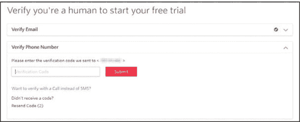
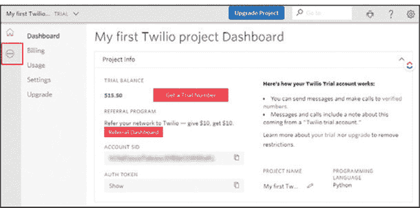
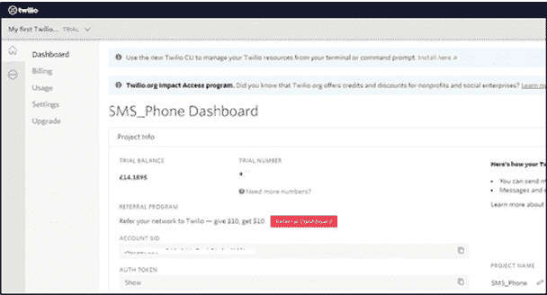
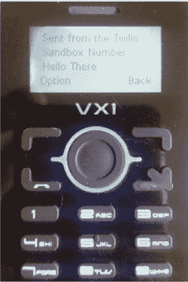
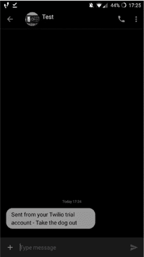

## 第八章：自动短信发送机

在本章中，你将设置你的 Raspberry Pi，以便向已注册的手机发送短信。一旦你完成了这一部分，你将创建一个简单的自动短信提醒服务：你将编写一个时间和简短的消息，当指定的时间到达时，消息将被发送到你输入的号码。例如，你可以发送一条消息提醒自己遛狗或接人，或者你也可以每天向别人发送一条消息，提醒他们欠你 5 美元！

### 你将需要的物品

以下是本项目所需的物品：

+   Raspberry Pi

+   一部可以发送和接收短信的基本手机

### 关于短信的简要介绍

1992 年 12 月 3 日，第一条*短信服务（SMS）*消息，通常被称为*文本消息*，从计算机发送出去。内容是*圣诞快乐*。这种廉价、快速、简单的服务成为了手机设备之间非常流行的通信方式。

### 创建一个简单的文本发送器

你将创建一个简化的文本发送器，将你输入的任何消息发送到指定的号码。第一步是设置你自己的账户，注册*Twilio*，一个基于云的通信公司。Twilio 让你编写程序代码，可以拨打和接听电话，发送短信，收集通话时长统计等。

由于 Twilio 是一个基于云的服务，它使用*应用程序编程接口（API）*。API 是一组工具，让你通过代码与基于 Web 的应用程序进行交互。你可以使用 API 与 Twilio 的 Web 服务进行交互，例如发送短信或查看通话记录。Twilio 网站让你创建一个免费试用账户，这对于本项目来说完全足够。

**注意**

*如果你觉得这样更方便，可以在另一台计算机上设置 Twilio 凭据，然后在 Pi 上重新登录 Twilio*。

#### 注册 Twilio 账户

在你的 Pi 上，前往 Twilio 网站：[`www.twilio.com/`](https://www.twilio.com/)。点击页面中间的红色**注册并开始构建**按钮，如图 8-1 所示。


**图 8-1** 从 Twilio 着陆页开始

通过填写表格注册一个账户，该表格可能与写作时有所不同。输入你的名字、姓氏、电子邮件地址以及你希望设置的密码。密码必须至少包含 14 个字符。完成这些步骤后，点击红色的**开始免费试用**按钮。图 8-2 展示了所有这些选项。


**图 8-2** 注册 Twilio 账户

你应该已经收到一封验证电子邮件，里面有一个超链接，发送到你用来注册的地址。点击邮件中的链接，验证你的电子邮件地址，并向网站确认你不是机器人。

接下来，你需要进一步确认你不是机器人。（证明你是人类是一个两步过程！）添加你的手机号码并点击**验证**按钮。你需要输入一个有效的号码，因为 Twilio 会将验证码发送到你输入的号码。你将需要这个验证码才能继续。

你的手机应该会收到一条带有验证码的短信。在 Twilio 页面上，输入验证码并点击**提交**，如图 8-3 所示。



**图 8-3** 做得好，人类。

你现在已被验证为人类；可以放心了！

你将会被问到一系列关于编码的问题，这些问题可能自本书写作以来有所变化，所以我会大致引导你通过这些问题。如果被问到是否会编程，回答“是”。接着你将看到一个语言列表，选择 Python。

现在你将被问到类似**你今天的目标是什么？** 选择最接近**在项目中使用 Twilio**的选项。你也会被问到你想要先做什么，选择涉及发送或接收短信的选项。

一旦完成所有这些步骤，你应该会看到你的仪表板，界面应该像图 8-4 所示。



**图 8-4** Twilio 仪表板

### 设置 Twilio 电话号码

设置账户的最后一步是获取一个 Twilio 电话号码，用来从你的 Pi 发送短信。点击**获取试用号码**按钮。（如果你在仪表板中看不到“获取试用号码”按钮，点击左侧菜单中高亮部分所示的三点符号，然后点击**可编程 SMS**。接着点击**开始使用**，然后选择**获取号码**。）

Twilio 会为你推荐一个合适的电话号码。请再次确认该号码注册在你所在的国家，并且已启用短信功能，如图 8-5 所示。


**图 8-5** Twilio 会为你选择一个号码；确保它是基于你所在的国家并且能够接收和发送短信。

如果号码未启用短信功能，你需要通过点击**搜索其他号码**来获取另一个号码，可能会收取少量费用。确认信息无误后，记下该电话号码以备后用，然后点击**选择此号码**。

你现在已经设置好 Twilio 账户，并获得了一个可以在 Python 程序中使用的新电话号码。你现在可以开始创建项目并编写发送短信到电话号码的程序。

#### 创建一个项目

现在是时候设置你的项目并命名了。此时，Twilio 还会显示你项目的授权代码和凭证。在“项目名称”下，输入**SMS_Phone**，或者任何其他包含 SMS 的名称。仪表板现在会显示标题为 SMS_Phone Dashboard，如图 8-6 所示。

当你创建 Twilio 账户时，你还创建了一个账户 SID 和授权令牌，这些将在稍后用于控制与你验证过的手机之间的通信。你会看到出于安全原因，授权令牌没有显示。要访问令牌，请按旁边的复制按钮。现在，你可以将令牌粘贴到你的程序代码中。



**图 8-6** 你将在这里找到项目凭证。

#### 安装 Twilio

要安装 Twilio，打开终端窗口并输入以下内容：

```
pi@raspberrypi:- $ sudo pip3 install twilio
```

相关的 Python 包将被下载并安装到你的树莓派上。然后重启树莓派，当它加载完成后，打开位于“编程”菜单中的 IDLE 3。

#### 编写代码

将列表 8-1 中的代码复制到文件中，并将其保存为*SMS.py*。

```
❶ from twilio.rest import Client

   # Find these values at https://twilio.com/user/account
❷ account_sid = "XXXXXXXXXXXXXXXXXXXXXXXXXXXX"
❸ auth_token = "XXXXXXXXXXXXXXXXXXXXXXXXXXXXX"

❹ message_text = input("Please enter your message ")

❺ client = Client(account_sid, auth_token)
   # Replace +999 with your own phone number and +000 with your Twilio
   number

❻ message = client.messages.create(to = "+999", from_="+000",
   body = message_text) 

❼ print ("Your message is being sent")
❽ print ("check your phone")
```

**列表 8-1** 简单的短信发送代码

你首先通过从`twilio.rest`导入`Client()`函数 ❶。*表征状态转移（REST）*是一种在计算机设备（你的树莓派）和基于网页的服务（Twilio 的云服务）之间传输信息的方法。你导入`Client()`是为了能够使用 Twilio 的 REST 服务。

接下来，你需要添加你的账户安全标识符（SID） ❷和授权令牌 ❸。你已经在 Twilio 网站的仪表板上找到了这两个值，所以只需将它们复制并粘贴到代码中，替换掉 X 占位符。如果你选择手动输入这些代码，确保使用正确的字母大小写。

然后，你创建一个名为`message_text` ❹的变量，并给它一个提示用户输入的短语：`input("请输入你的消息 ")`。这行代码提示用户（在这个例子中，用户是你）输入他们想要发送的 SMS 消息；你的程序可以发送任何你想要的文本，而不是标准的预设消息。

为了使用客户端发送 SMS 消息，你需要将`account_sid`和`auth_token`放入名为`client` ❺的变量中。通过这样做，你可以创建一行代码，将消息、Twilio 凭证和相关电话号码结合起来，然后发送 SMS 消息。

你创建一个名为`message`的变量，并添加命令`client.messages.create()`。当调用时，`message`会从你的`client`变量中收集详细信息，并创建一个对象来引用 Python Twilio 类，从而创建 SMS 消息 ❻。

在同一个`message`变量中，你需要在`to =`代码之后添加你在 Twilio 注册并验证的手机号码。你需要将代码中当前的+999 替换为你发送消息的手机号码（但确保保留加号）。

在 `from_=` 后，你输入你设置的 Twilio 支持的手机号码，替代代码中当前的 +000。接下来，你添加 `message_text` 变量，该变量包含短信的正文内容。这就完成了发送消息的代码行。

然后你添加一行简单的确认信息，用来打印消息是否已发送 ❼，再添加一行提醒用户检查消息已发送到哪个手机的行，消息的接收者 ❽。

让我们来试试吧！保存程序并运行，确保注册的手机已开机。当程序运行时，系统会提示你输入一条短消息。输入你的消息并按 ENTER；你应该会看到消息出现在你的手机上，如 图 8-7 所示。



**FIGURE 8-7** 在手机上接收 Twilio 消息

### 创建自动短信提醒机

现在你已经设置了一个基本的短信程序，你可以将其与其他 Python 功能结合，创建一个自动短信提醒系统，如 图 8-8 所示。你将输入提醒消息，然后输入需要发送提醒的时间。



**FIGURE 8-8** 自动文本提醒

程序检查树莓派上的当前时间。当时间达到指定时间时，它会将提醒消息发送到你的手机。因为时间需要准确，我建议你将树莓派连接到互联网。这样，每次树莓派启动时，时间都会更新，提醒程序也会在正确的时间做出响应。

#### 设置和验证格式

在 IDLE 3 或你的 Python 代码编辑器中打开一个新文件，并添加代码的第一部分，如 LISTING 8-2 所示。将其保存为 *reminder_machine.py*。

```
❶ from twilio.rest import Client
   import time
   import datetime
   import sys

   # Find these values at https://twilio.com/user/account
❷ account_sid = "XXXXXXXXXXXXXXXXXXXXXXX"
   auth_token = "XXXXXXXXXXXXXXXXXXXXXXXXX"
   client = Client(account_sid, auth_token)

   # validation for time
❸ def isTimeFormat(input):
    ❹ try:
       ❺ time.strptime(input, '%H:%M')
       ❻ return True
    ❼ except ValueError:
       ❽ return False
```

**LISTING 8-2** 提醒机程序的第一部分代码

同样，你需要导入 Twilio 的 `Client` ❶。但你还需要导入 `time` 模块来添加短暂的延迟，并导入 `datetime` 模块以访问树莓派的当前时间。你还需要导入 `sys` 模块，以便在程序中使用命令行功能。

和之前一样，你需要将 Twilio 账户的凭证添加到变量 `account_sid` 和 `auth_token` 中，然后将它们组合成一个名为 `client` ❷ 的变量。

下面这一部分是新的：你需要设置一个简单的验证，检查输入的时间格式是否正确。用户需要输入 *小时:分钟* 的格式，例如：11:10。如果用户输入时间格式不正确，比如 1110 或 111:0，程序将会失败，因为这些格式无法匹配树莓派的时间。为了检查正确的格式，你创建一个名为 `isTimeFormat()` ❸ 的函数，然后使用 `try` 方法验证输入 ❹。接下来，你使用函数 `time.strptime()` ❺ 来检查输入的时间是否符合 `%H:%M` 格式，即 *小时:分钟*，或者 00:00。

如果输入的时间格式正确，验证检查返回`True`值❻。如果发生错误❼或输入的值不符合正确的格式，将返回`False`值❽。你稍后将使用这些值来触发程序继续进入下一阶段，或提示用户重新输入正确格式的时间。

#### 编写提醒消息

现在你准备添加第二段代码，这段代码介绍了程序的功能，并请求用户输入他们的提醒消息和时间。将列表 8-3 添加到*reminder_machine.py*文件的底部。

```
❶ print ("Welcome to the reminder machine")
❷ print ("")
❸ time.sleep(1)
❹ reminder = input("Please enter your message ")
   print ("")

   # validation check for time format
❺ check = False

❻ while check == False:
    ❼ reminder_time = input("Please enter the reminder time.
      For example 09:45 ")
    ❽ check = isTimeFormat(reminder_time)
      print ("")
    ❾ print (check)
      print ("")
```

**列表 8-3** 你的 reminder_machine.py 程序的第二部分

你首先使用一个简单的`print()`语句，通知用户提醒机器正在运行并准备就绪❶。然后，在每条语句之间添加一个空行，使它们更容易阅读❷，并暂停一秒钟，让用户有时间阅读欢迎消息和说明❸。

接下来，你创建一个变量，提示用户输入提醒消息❹并存储该消息。

然后，你检查`time`值是否是正确的格式，00:00。默认将其设置为`False`❺。你创建一个`while`语句，它只在`isTimeFormat()`验证检查值为`False`时运行❻。因为你在上一行将其设置为`False`，所以`while`循环会不断地执行。

在`while`循环内部，你提示用户输入希望发送提醒的时间，并将其存储在变量`reminder_time`中❼。

为了检查用户输入的时间是否符合正确格式，你调用你在列表 8-2 中创建的`isTimeFormat()`函数，并输入存储在`reminder_time`变量中的值❽。

根据时间是否按正确格式输入，函数将返回`True`或`False`。如果返回值为`False`，则时间输入格式不正确，`while`循环将再次运行，提示用户按正确的格式输入时间。

当返回值为`True`时，时间格式输入正确，程序继续执行到第❾行，并打印验证值。这是为了你的测试目的：程序运行正常后，你可以通过在❾行左侧添加`#`来注释掉这一行，使其看起来像这样：`# print (check)`。

#### 匹配时间并发送消息

程序的最后部分，如列表 8-4 所示，比较树莓派的当前时间与提醒时间，并且在两者匹配时，发送消息。

```
❶ while True:
    ❷ current_time = datetime.datetime.now().time()
       # print (current_time)

    ❸ current_time = str(current_time) # swap the time to a string

    ❹ current_time = current_time[0:5]

    ❺ if reminder_time == current_time:
            ❻ print ("Reminder Time")
            ❼ message = client.messages.create(to = "+999999",
               from_="+00000000", body=reminder)
            ❽ time.sleep(60)
            ❾ sys.exit()
    else:
            ❿ time.sleep(1)
```

**列表 8-4** reminder_machine.py 的最后部分：发送消息！

首先，你创建一个`while True`循环，以便让程序的这一部分持续运行，检查当前时间并与提醒时间进行比较❶。

接下来，你将从树莓派操作系统存储当前的日期和时间到一个名为`current_time`的变量中❷。你将打印出这个值用于测试，但一旦程序正常运行，记得将其注释掉。该值的格式为*小时:分钟:秒:毫秒*，它包含了比你需要的更多数据。所以，在使用日期时间值之前，你将其转换为字符串❸，然后将其切割为仅包含前五个字符❹，以匹配 00:00 的格式。

现在你可以将`reminder_time`与当前时间进行比较：下一行检查例如 11:10 是否等于 11:10❺，如果两个值匹配，程序会打印出一行，指示现在是提醒时间❻！

为了发送消息，你需要创建一个名为`message`的变量，并添加`to`和`from`的电话号码。然后，你将你输入的提醒信息存储在`reminder`变量中，作为消息的正文❼。`client.messages.create()`函数会创建并将消息发送到你的手机。

从代码行❷到❿被放置在一个`while`循环中，这意味着程序会持续检查条件，并在条件满足时发送消息。如果你将程序代码保持这样，它会在与你设定时间匹配的那一分钟发送尽可能多的消息。为了避免这种连续发送消息的情况，你需要在下一行代码运行❽之前添加一个 60 秒的延迟。这样，时间就会前进到例如 11:11，并且不再与循环再次运行时的时间匹配。

你通过从终端调用系统退出命令❾来添加退出程序的代码。在程序的最后一行，你添加了 1 秒的延迟，然后整个循环将重新开始❿。

这样程序就完成了。现在你可以保存并执行它。请注意缩进级别。如果你遇到运行问题，首先检查各行是否按照正确的级别缩进。

输入你的提醒信息和提醒时间。然后让你的树莓派继续运行，系统将在指定的时间将你的文本发送给你！

### 完结

你可以用你的自动短信机器做各种事情，尤其是现在你已经设置了 Twilio 账户。查看 Twilio 文档，了解你可以做些什么（*[www.twilio.com/docs/quickstart](http://www.twilio.com/docs/quickstart)*）。作为一个小提示，为什么不试试侦探工作：使用 Twilio 追踪发送到和从连接到 Twilio 的手机的消息和电话。你可以在 *[www.tecoed.co.uk/spooking-a-mobile.html](http://www.tecoed.co.uk/spooking-a-mobile.html)* 找到这个黑客技术的代码。
