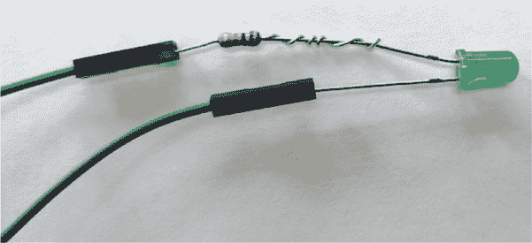
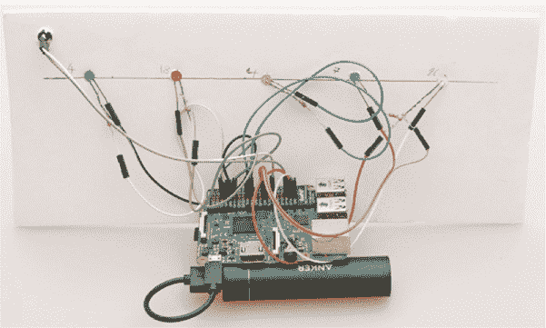
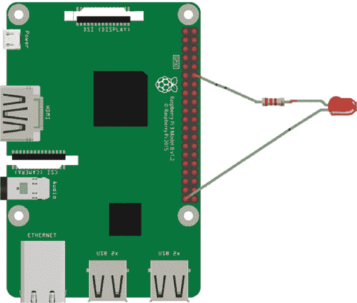
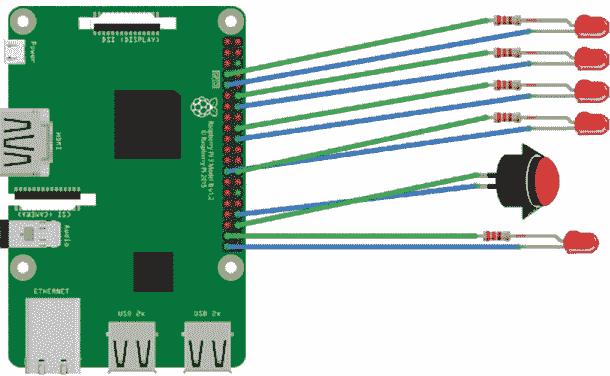
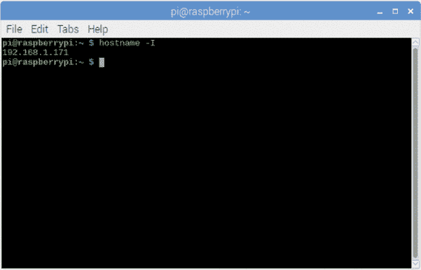
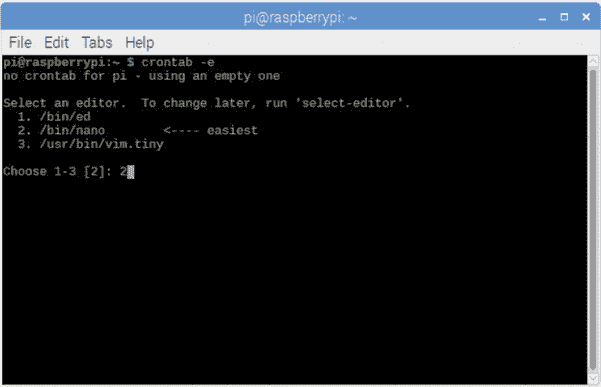
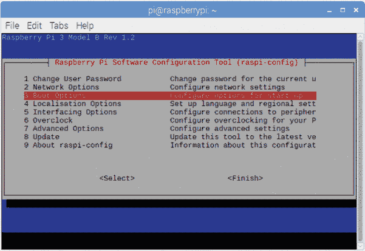

## 第九章：PI SPY PART 2：WI-FI 和蓝牙跟踪

你可以利用你新的 Raspberry Pi 技能，通过定位设备的信号来窃听屋内每个人的动态。几乎每个人都有智能手机、平板电脑或其他设备，这些设备会在周围传输大量未被察觉的数据。你将利用这些数据来检测谁在周围。

你将使用 Raspberry Pi 通过互联网路由器和蓝牙来检测设备。你会通过互联网路由器或蓝牙将数据从 Raspberry Pi 发送到每个设备，并检索包括设备名称、设备类型、是否已连接以及设备所属者是否在附近等信息。这假设每个设备由一个人拥有，而不是例如在家庭成员之间共享。否则，要知道谁在附近会变得更难！

然后，你将创建一个 LED 视觉显示板指示器，或称为*状态板*，当用户在家时，它会亮起，而当用户不在时，它会熄灭（如图 9-1 所示）。


**图 9-1** 完成的状态板

### 你将需要的东西

+   Raspberry Pi Zero W 或 Raspberry Pi 4（推荐）

+   10 根母对母跳线

+   5 个 LED 灯——或者与想要跟踪的设备数量相同的 LED 灯数量

+   5 个电阻（220 到 330 欧姆）

+   纸板

+   图片（可选）

+   胶带（可选）

+   按钮

你可以使用家人照片，或者为了掩盖状态板的用途，使用随机图片来代表每个家庭成员，正如我在图 9-1 中所示。

### 创建你的状态板

我们从创建状态板开始，它将显示谁在附近。

如果你有，Raspberry Pi Zero W 是最适合安装到状态板背后的尺寸，因为它是最小的 Pi。如果你使用的是更大的 Pi，如型号 4，你可能需要将它放置在状态板旁边的坚固表面上。然而，如果你使用 Zero W，你可能会发现使用型号 4 来做这个项目更容易，然后将 SD 卡转移到 Pi Zero W 上。

#### LED 连接线

取一个 LED，找到较长的（正极）引脚。将一个电阻的引脚绕在这个 LED 的引脚上，使其紧密固定，如图 9-2 所示。然后，将一根母对母跳线的一端连接到 LED 的短引脚（负极）。将另一根母对母跳线的一端连接到电阻的引脚。对于所有五个 LED，重复这个步骤。



**图 9-2** LED 连接线

#### 将 LED 灯添加到面板

在你用于状态板的纸板上，轻轻标记出你想要放置每个 LED 的位置。如果你将树莓派固定在板上，确保为树莓派和所有的电线留出足够的空间。小心地在每个已标记的位置上打一个小孔，以固定每个 LED。你可以使用笔或螺丝刀来完成此操作。将每个 LED 推入孔中，并用胶带将其固定，以保持整洁，同时减少电线相互接触造成短路的可能性。你状态板的背面应类似于图 9-3。每个数字对应 LED 连接到的 GPIO 引脚。（请参见下一页的 GPIO 引脚编号表。）例如，左侧的 LED 1 连接到 GPIO 4。



**图 9-3** 将 LED 连接到状态板

现在你可以为电路板的前面添加个人风格。也许可以添加一些照片来代表你家中的成员，并根据你的风格和口味装饰它。

#### 连接 LED 到树莓派

为了为每个 LED 供电，你需要将较长的正极引脚（上面绕着电阻）与跳线连接到一个 GPIO 引脚。（任何一个都可以，但我建议使用下表中的引脚。）然后，将较短的负极引脚与跳线连接到标记为*GND*的接地 GPIO 引脚。图 9-4 展示了这些连接。GND 引脚位于物理引脚 6、9、14、20、25、30、34 和 39。你可以使用其中的任何一个。



**图 9-4** 连接 LED 到树莓派

现在，为你的其他所有 LED 进行同样的操作，将它们连接到树莓派板上（见图 9-5）。下表显示了每个 GPIO 引脚应使用的情况。

| **项目** | **GPIO** |
| --- | --- |
| LED 1 | 4 |
| LED 2 | 18 |
| LED 3 | 24 |
| LED 4 | 7 |
| LED 5 | 26 |
| 关闭按钮 | 16 |

最后一组电线是用于关闭按钮的，按下时将关闭树莓派的电源。将一根跳线连接到 GPIO 16，另一根连接到 GND 引脚。如果需要，你可以将 LED 连接到任何引脚，除了 3V 和 5V 引脚（1、2、4 和 17），具体取决于你的 LED 和树莓派在板上的位置。例如，如果你的树莓派位于板子的中间，你可能会想为位于右侧的 LED 使用 GPIO 2、3、4、14、15 或 18，为位于左侧的 LED 使用 13、19、26、16、20 或 21。LED 的另一端连接到一个接地引脚，以完成电路。如果你使用不同的 GPIO 编号或添加更多的 LED，请注意每个 GPIO 引脚编号及其对应的 LED，因为在用 Python 编程时你需要它们。



**图 9-5** 连接所有 LED 和按钮

#### 安装树莓派

大多数树莓派配有四个小螺丝孔，分别位于板子的四个角落。这些螺丝孔非常适合将树莓派安装到状态板上。你可以使用小螺丝将树莓派固定，或者使用粘性胶点来固定它。如果你希望以后能够拆卸树莓派并将其用于其他用途，建议使用螺丝。

### 使用 IP 地址跟踪设备

首先，你需要设置树莓派，通过其 IP 地址跟踪你家庭成员的设备。稍微考虑一下，使用互联网的设备数量是多么庞大：手机、智能电视、游戏机、智能手表、冰箱、汽车、平板电脑和报警系统，仅举几例。在这么多设备连接的情况下，正确的数据如何发送到正确的设备呢？比如你正在流式播放一个视频，数据如何知道应该发送到你的平板，而不是家里其他人正在查看电子邮件或听音乐的设备上？

每个连接到互联网的设备都会分配一个互联网协议（IP）地址。从外部来看，这些地址的作用类似于邮政编码：它们表示一组在特定*网络*内的设备——你的网络就是你共享的互联网连接。从这个网络内部，每个设备都会分配一个唯一的 IP 地址，以便路由器知道将信息发送到哪里。

IP 地址由四组数字组成：例如，192.168.1.24。根据最新统计，大约 340 万亿万亿万亿个 IPv6 地址正在使用中！^(1)

你将使用你网络中设备的单独 IP 地址来检查每个设备是否在附近。由于你的树莓派连接到家庭网络，它也会有自己的 IP 地址。让我们来查找它是什么。

### 查找你的 IP 地址

打开终端，输入以下命令，这将为你提供一些关于网络的信息：

```
pi@raspberrypi:- $ hostname –I
```

这会显示你树莓派的 IP 地址。在图 9-6 中，我的 IP 地址是 192.168.1.171。



**图 9-6** 获取树莓派的 IP 地址

### 查找其他设备的 IP 地址

有两种方法可以找到你网络中其他设备的 IP 地址。第一种是使用类似 Fing 的应用程序，通过你的手机或平板进行扫描，第二种是通过树莓派上名为 Nmap 的程序进行扫描。

#### 使用 Fing

*Fing* 会扫描你的路由器和网络，并返回所有 IP 地址，同时列出所有连接设备的名称和制造商。记下这些信息，方便稍后在程序代码中使用。如果你想选择这种更简单的方式，可以在手机或其他设备上下载 Fing，并按照* [www.fing.io](http://www.fing.io) *上的说明进行操作。

#### 使用 Nmap

另外，你也可以在树莓派上写一个简单的 Python 程序来扫描并返回地址。这有一个优势：你可以将数字直接复制粘贴到主程序中，而不用担心打错。为此，你将使用一个叫做 Nmap 的程序。

##### 安装 Nmap

*Nmap (网络映射器)* 是一个用于发现计算机网络中设备和服务的扫描器。Nmap 向路由器发送一个特定的数据包，然后分析响应以构建关于连接设备的信息表。从这个表中，程序构建出你的网络地图。要安装 Nmap，打开终端窗口并输入以下内容：

```
pi@raspberrypi:- $ sudo apt install nmap
```

Nmap 命令通过终端执行，因此要使用 Python 和 Nmap 的功能，你需要安装一个 Python 封装程序。*封装程序*是一个程序，它允许你在终端中编写 Python 代码来控制某些软件。在终端中，输入以下命令：

```
pi@raspberrypi:- $ sudo pip3 install python-nmap
```

##### 编写程序以查找 IP 地址

现在你已经安装了 Nmap，可以编写一个 Python 程序来搜索连接设备的 IP 地址。打开 IDLE，创建一个新的 Python 文件。添加 Listing 9-1 中的代码并保存。在运行之前，确保你的手机或其他设备已连接到路由器，因为你将使用自己的设备作为最终代码的测试器。

```
❶ import nmap
❷ nm = nmap.PortScanner()
❸ data = nm.scan(hosts='192.168.1.0/24', arguments= '-sP')
   print (data['scan'])
   print ("")
❹ for host in nm.all_hosts():
    ❺ print ('Host : %s (%s)' % (host, nm[host].hostname()))
```

**LISTING 9-1** Nmap 扫描程序

首先导入 `nmap` 库 ❶，然后创建变量 `nm` 来保存 `nmap` 库中的 `PortScanner()` 函数 ❷。正如你可能猜到的，这个函数用于扫描端口！

接下来，添加代码以扫描路由器 ❸。大多数路由器都有一个通用的 IP 地址，这个地址在所有路由器中是标准的。这行代码扫描从 192.168.1.0 到 192.168.1.24 范围内的所有 IP 地址，然后检索每个 IP 地址持有的关于连接设备的数据。

然而，你可能需要检查特定路由器的 IP 范围，并更改该范围以反映这一点。例如，你的路由器的 IP 地址范围可能从 192.168.0.1 开始，或者你可能已经配置了自己的自定义范围。如果不确定，请参考服务提供商的指导和文档。

现在使用 `for` 循环遍历所有找到的主机（设备） ❹。这将为你提供每个当前连接到路由器或之前连接的设备的 IP 地址及其名称（许多路由器会保存所有曾连接过的设备列表）。

你获取的列表提供了关于设备的详细信息，所以你会打印出来 ❺ 以帮助你识别每个设备。一旦输入并保存了程序，按 **F5** 运行，你将在 Python 编辑器窗口中看到连接设备及其 IP 地址的列表，就像 Listing 9-2 中的那样。

```
Python 3.5.3
[GCC 6.3.0 20170124] on linux
Type "copyright", "credits" or "license()" for more information.
>>>
=== RESTART: /home/pi/find_ipadresses.py ===
{'192.168.1.1': {'addresses': {'ipv4': '192.168.1.1'}, 'hostnames':
[{'name': 'TestBox.cc', 'type': 'PTR'}], 'vendor': {}, 'status':
{'reason': 'syn-ack', 'state': 'up'}}, '192.164.1.xxx':
{'addresses': {'ipv4': '192.168.1.xxx'}, 'hostnames': [{'name': '',
'type': ''}], 'vendor': {}, 'status': {'reason': 'conn-refused',
'state': 'up'}}}
```

**LISTING 9-2** 已找到的 IP 地址

将你的详细信息复制并粘贴到文本文件或新的 Python 文件中。如果你粘贴到 Python 文件中，请记得在每行前加上`#`，将其注释掉——这样程序运行时就不会出现错误。现在，尝试确定每个设备属于谁，并在设备名称旁边记录额外的信息。你可能能够通过设备名称来识别，或者你可以快速检查家里谁在，并使用排除法。例如，如果家里有两个 iPhone 用户，而只有一部手机出现，检查型号。如果某个人不在家，你就知道显示出来的手机不是他们的。有些用户会通过使用自己的真实姓名作为设备名称来简化识别。你还应该记录下哪个设备是你自己的。

记住，在理想情况下，设备将连接到路由器，并返回当前的 IP 地址。但 IP 地址在路由器关闭或重置时可能会发生变化，因此家中关闭的设备可能会显示其以前的 IP 地址。最好等到设备重新上线后再收集地址。

### 编写状态板代码

现在你已经拥有了 IP 地址、设备和用户的列表，你可以创建一个程序，将这些信息与状态板中的电子元件结合起来，监控谁在你家中。如果你使用的是 Pi Zero W，你需要通过 SSH 连接（参见“通过 SSH 访问 Raspberry Pi”章节，第 25 页）或使用远程桌面应用程序访问你的 Pi。否则，你可以在 Raspberry Pi 上编写并测试本节代码，然后将其 SD 卡转移到 Pi Zero W 中。

在 Python 代码中，通常会将 LED 等常见元素归为一组。然而，如果你按每个人或设备来分组代码，我们的代码会更有意义；这样，你可以轻松添加 LED 并检查更多的人。这就是你在这里要做的。

这个程序使用了`gpiozero`库和`PingServer()`类，它会发送 ping 请求。那么，ping 是什么呢？你可以将*ping*看作是发送到路由器的请求。该请求由数据包组成，表示为一串零和一，目的是请求路由器提供关于所有连接设备的信息。路由器随后将这些信息发送回你的 Pi 和 Python 程序。在这个项目中，数据会被返回到你的 Raspberry Pi。你将使用这些信息来找出谁在附近。

#### 设置并识别第一个设备

打开你的 Python 编辑器，添加 LISTING 9-3 中显示的代码。

然后将其保存为*wifi_spy.py*。

```
❶ from gpiozero import PingServer, LED, Button
❷ from subprocess import check_call()
❸ from signal import pause

❹ def shutdown():
    check_call()(['sudo', 'poweroff'])

   # first device apple phone
❺ frank = PingServer('192.168.1.1') # hub
❻ led = LED(4)
```

**LISTING 9-3** 设置和查找第一个设备

首先，从`gpiozero`库导入所需的函数❶。你需要`PingServer()`来从路由器获取数据，`LED`类来控制 LED，`Button`模块来添加关闭板的按钮功能。

你还需要从`subprocess`库中导入`check_call()`❷。这使你可以使用终端命令来控制 Raspberry Pi，并将用来从终端关闭 Pi。

最后，从`signal`库中导入`pause`，以便让程序持续运行❸。

接下来，创建一个`shutdown()`函数，包含关闭 Pi 的代码❹。该函数使用`check_call()`命令运行`sudo poweroff`，用于关闭 Pi。

现在你可以开始检测人员了！我已经添加了一个注释来帮助你跟踪设备和状态板上的每个 LED 所对应的人；你应该修改这个注释，来反映你家中第一个设备的信息。

创建一个变量，用于存储你检查的第一个 IP 地址的详细信息❺。你应该根据设备的使用者命名这个变量，这个信息你可以在“查找其他设备的 IP 地址”章节的第 147 页中找到。该变量包含 ping 路由器和设备 IP 地址的命令。在这里，我填写的是 IP 地址，你应当将之前通过 Fing 或 Nmap 获得的第一个 IP 地址放在括号内，并记得保留引号。

最后一行标识了该人员 LED 使用的 GPIO 引脚❻。每个个人应该有自己独立的 LED，因此这里将 Frank 分配到连接 GPIO 引脚 4 的 LED。

#### 查找其他设备

现在，你将使用相同的代码结构，设置你想要检查的其他设备 IP 地址的变量，并为每个设备分配一个 LED。将列表 9-4 中的代码行添加到程序的底部。

```
   # second device oneplus
   scott = PingServer('192.168.1.22') # oneplus
   led_scott = LED(18)

   # third device laptop 1
❶ liz = PingServer('192.168.1.72') # laptop 1
   led_liz = LED(24)

   # fourth device raspberry pi
   jenny = PingServer('192.168.1.165') # pi
   led_jenny = LED(7)

   # fifth device laptop 2
   jade = PingServer('192.168.1.209') # laptop 2
   led_jade = LED(26)
```

**列表 9-4** 为每个设备分配 LED

如同之前，你创建一个变量来保存每个 ping 的结果，指示设备所有者的姓名。记得将每个变量名替换成你家中的名字，并将每个 IP 地址替换为之前收集的相应 IP 地址❶。

如果你找不到足够的设备，仍然添加每个变量对应的代码，并使用已经使用过的 IP 地址。这将同时点亮多个 LED，但这意味着你可以测试电路和程序代码是否正常工作。一旦一切都能正常运行，你可以回过头来删除或注释掉那些代码行。

#### 添加延迟、响应数据，并添加按钮

最后，添加程序代码的结尾部分，如列表 9-5 所示。此部分将在每个设备的 ping 之间添加延迟。

你在每次 ping 之间设置延迟，因为频繁 ping 路由器会产生大量流量并拖慢网络速度。你可能会被发现！而且，通常情况下，人们不会每秒钟都进出家门，所以你可以每分钟检查一次。

```
   # check every 60 seconds
❶ led.source_delay = 55
   led_scott.source_delay = 56
   led_liz.source_delay = 57
   led_jenny.source_delay = 58
   led_jade.source_delay = 59

   # power on LEDs
❷ led.source = frank.values
   led_scott.source = scott.values
   led_liz.source = liz.values
   led_jenny.source = jenny.values
   led_jade.source = jade.values

   # GPIO 16 for shutdown
❸ shutdown_btn = Button(16, hold_time=2)
❹ shutdown_btn.when_held = shutdown

❺ pause()
```

**列表 9-5** 在 ping 之间添加延迟

将我在这里使用的名称替换为你为变量使用的名称，然后列出我所做的延迟秒数 ❶。如果你发现网络仍然很慢，或者你希望检查频率较低，可以增加延迟的秒数。例如，你可以将延迟时间增加到 300 秒，因为用户可能会在线较长时间。请注意，某些智能手机在屏幕锁定时可能会显示与网络断开连接。

接下来，程序需要响应 ping 数据。如果 ping 中发送的 IP 地址在路由器上，并且确认是活跃的，那么对应的 LED 会亮起 ❷。如果找不到该 IP 地址，则说明设备没有找到，LED 会熄灭。

最后，你设置了按钮来启动关机序列 ❸。你将其设置为 GPIO 引脚 16（如果你使用了不同的引脚，确保在这里填写相应的 GPIO 引脚编号）。

`hold_time`中的值指的是按钮必须按住多久才能触发关机序列 ❹。这个程序将时间设置为 2 秒，以防止误按按钮导致程序关闭。（你必须至少按住按钮 2 秒钟。）`when_held`检查按钮是否被按下，如果是，它会运行关机功能，关闭树莓派并关闭状态板。

最后，使用`pause()` ❺使程序永远循环。这就完成了主程序结构和状态板硬件的设置！

#### 运行程序

让我们试试看！要检查程序代码是否正常工作，按下**F5**。这将提示你保存程序，然后执行。根据周围的人和连接的设备，你应该能看到一些 LED 灯亮起。

确保你的设备已开机并连接到路由器。为了测试代码是否响应，关闭你的设备或设置为飞行模式。你应该会看到自己的 LED 灯熄灭！记住，代码每分钟运行一次，所以可能不会立即熄灭。

#### 故障排除

如果状态板似乎无法正常工作，检查以下常见问题：

1.  是否有设备连接到路由器？

1.  你的 LED 灯有故障吗？

1.  你是否正确连接了 LED 灯？（检查正负极脚是否正确连接。）

1.  LED 引脚编号是否与代码中使用的引脚编号匹配？

1.  你是否为家中每个用户使用了正确的 IP 地址？

1.  是否将正确的 LED 分配给了正确的用户？

### 设置代码自动运行

项目的最后一步是配置程序以便自动运行，这样您的状态板在 Raspberry Pi 启动时会做出响应。一旦您的程序正常工作，状态板也能正常运行，您可以移除显示器并将 Raspberry Pi 连接到状态板上。然后，要启动状态板，只需插入 Raspberry Pi 的电源。要关闭它，按下关机按钮或将两根电线触碰在一起，您的 Raspberry Pi 将开始关闭过程。

#### 使用 Cron 自动启动程序

要使状态板在启动时自动启动，您需要安排 Python 程序在启动时执行。这使用了*cron*，一个基于时间的简单作业调度工具，其名称源自希腊语“时间”（*chronos*）。该工具使您能够创建规则，在特定时间自动触发任务。例如，您可以设置规则，每小时下载文件，每天下午 4 点运行更新，或每周同一时间发送电子邮件。

您在一个*crontab*（*cron 表*的缩写）文件中创建这些规则，这是一个包含任务指令的简单文本文件，最重要的是，包含触发任务的时间。

在将此任务添加到 crontab 文件之前，您需要知道 *wifi_spy.py* 程序在 Pi 系统中的保存位置。除非您将文件保存到了某个特定位置，否则该位置可能是 */home/pi/wifi_spy.py*。请注意正确的文件路径 *wifi_spy.py*，然后您可以编辑 crontab。

打开终端并输入以下命令：

```
pi@raspberrypi:- $ crontab –e
```

这将打开 cron 控制台（图 9-7）。



**图 9-7** crontab

终端应该给您三种编辑 cron 文件的方法。选择选项 2 以打开 nano 文本编辑器——您将使用此编辑器，因为它最简单。

这应该会在 nano 中打开 cron 文件，您应该会看到其中已有的一些代码，看起来类似于清单 9-6。

```
# daemon's notion of time and timezones.
#
# Output of the crontab jobs (including errors) is sent through
# email to the user the crontab file belongs to (unless redirected)
#
# For example, you can run a backup of all your user accounts
# at 5 am every week with:
# 0 5 * * 1 tar –zcf /var/backups/home.tgz /home/
#
# For more information, see the manual pages of crontab(5) and
cron(8)
#
# m h  dom mon dow    command
```

**清单 9-6** crontab 文件中的启动代码

向下滚动到文本底部，找到黑色区域，在最后添加以下代码行：

```
@reboot python3 /home/pi/wifi_spy.py &
```

该命令很容易理解：它声明在 Raspberry Pi 重启时，以超级用户模式运行 Python，打开*home/**pi* 文件夹，并执行名为 *wifi_spy.py* 的程序。确保如果需要，您将文件名替换为您的文件名，并且使用正确的文件夹路径。

代码行末尾的 `&` 语法告诉 cron 在后台运行您的程序，这样您仍然可以用 Raspberry Pi 做其他事情。

一旦您检查过添加到 crontab 文件中的代码并确认它正确无误，请按 CTRL-X 保存并退出文件。现在，每次启动或重启 Raspberry Pi 时，crontab 文件都会运行并执行状态板程序。

如果你想停止程序自动运行，可以通过终端再次打开 crontab 文件，使用 `crontab –e`，然后注释掉或删除你添加的那行代码。接着保存文件并重启。

#### 重启到命令行

由于状态板设计为 *无头模式*（没有屏幕或显示器），你不需要让 Raspberry Pi 启动到桌面环境，因为这会消耗更多的时间、内存和处理能力。相反，你可以配置 Pi 启动到命令行界面。打开终端窗口并输入以下命令：

```
pi@raspberrypi:- $ sudo raspi-config
```

这将显示终端中的配置工具，如 图 9-8 所示。选择第三个选项，**3** **启动选项**，然后按回车。接着选择 **B1 桌面 / CLI**，再选择 **B1 控制台** 选项。



**图 9-8** 启动到命令行选项

设置完成后，使用下方向键选择 **<Finish>** 并按回车。系统会提示你保存配置文件并重启。选择 **Yes**，你的 Pi 将会重启。重启后，状态板程序应该会加载。

现在，为了显示周围的人员信息，插入电源，你的状态板会告诉你。你可能需要等待一两分钟，直到 Pi 连接到路由器。移除 Raspberry Pi 上的 HDMI 电缆，因为你现在真正处于无头模式！

### 使用蓝牙跟踪设备

在这一部分，你将学习如何通过蓝牙而不是 Wi-Fi 跟踪周围的设备。类似于你使用 IP 地址来跟踪设备的方式，你可以使用 Raspberry Pi 扫描蓝牙数据传输并获取设备的地址。然后，可以使用这个地址触发状态板上的相关 LED 灯。

#### 什么是蓝牙？

*蓝牙* 是行业中对 2.402 至 2.480 GHz 范围内的无线电波的标准名称，用于让设备在短距离（大约 100-200 米）内无线通信。像所有技术一样，蓝牙也在不断发展，最新的蓝牙 4 技术可以实现最远 200 米的通信。蓝牙功耗低，非常适合在移动设备上使用。

每个蓝牙设备都有自己独特的地址，格式为 D2:72:F6:87:D2:8A。因为每个地址都是设备独有的，所以如果你获得了地址并知道每个设备的拥有者，就可以追踪到人员！从安全角度考虑，如果你打算分享程序代码或向他人展示如何使用，建议你删除或编辑这些地址。

#### 打开 Raspberry Pi 蓝牙

Raspberry Pi 和 Pi Zero W 都自带蓝牙硬件。如果你使用的是旧款 Pi，仍然可以使用这个方法，但你需要购买一个蓝牙 USB 加密狗并通过 USB 端口连接。

要在 Pi 上打开 Bluetooth，找到桌面右上角的标准 Bluetooth 图标，点击该图标，然后选择**打开 Bluetooth**。

好消息是，为了找到附近的 Bluetooth 设备，你不需要与它们连接——否则就有点暴露了。如果你手头有自己的设备，打开并启用 Bluetooth。然后返回到你的 Pi，点击 Bluetooth 图标，选择**使设备可发现**选项。Bluetooth 图标会开始闪烁绿色。再次点击 Bluetooth 图标，选择**添加设备**选项。一个新窗口应该会打开，Bluetooth 硬件将开始扫描并寻找设备。最终，你将得到一份所有启用了 Bluetooth 的附近设备的列表！

为了收集设备的 Bluetooth 地址，你将编写一个简单的 Python 脚本，就像你搜索 IP 地址时做的一样。该程序会扫描地址，将每个地址添加到列表中，然后将列表打印到 Python 控制台。首先，你需要安装一些库。

要安装所需的 Python 库，打开终端窗口并输入以下命令：

```
pi@raspberrypi:- $ sudo apt install bluez
pi@raspberrypi:- $ sudo apt install bluetooth libbluetooth-dev
pi@raspberrypi:- $ sudo pip3 install pybluez
```

当这三个程序下载并安装完成后，重启你的 Raspberry Pi。

那么，让我们看看你家里有哪些支持 Bluetooth 的设备。打开一个新的 Python 文件，复制 Listing 9-7 中的程序。保存为*bluetooth_finder.py*。

```
import bluetooth
from time import sleep
# find devices
print ("Searching for devices...")
nearby_devices = bluetooth.discover_devices(lookup_names = True)
sleep(10)
print ("found %d devices" % len(nearby_devices))
for addr, name in nearby_devices:
    print ("  %s - %s" % (addr, name))
```

**LISTING 9-7** 使用 Bluetooth 发现设备

这段代码控制 Bluetooth 硬件来搜索附近传输 Bluetooth 信号的设备。然后，它会创建一个组织良好的地址列表，并将其打印出来。

输出应该类似于 Listing 9-8 中的内容。

```
Python 3.5.3 (default, Jan 19 2017, 14:11:04)
 [GCC 6.3.0 20170124] on linux
Type "copyright", "credits" or "license()" for more information.
>>>
 RESTART: /home/pi/bluetooth_finder.py
Searching for device...
found 0 devices
>>>
 RESTART: /home/pi/bluetooth_finder.py
Searching for device...
found 1 devices
  D0:57:78:87:F6:8A - DANLAPTOP
```

**LISTING 9-8** 扫描输出

一旦你复制了程序，可以用它复制并粘贴地址，或者将其写下来用于你的状态板。记得检查每个地址对应的是哪个设备，并进行一些测试，以确保你为每个人都找到了正确的地址。

#### 编写状态板代码

现在你可以定位 Bluetooth 设备，并且你已经拥有了附近设备的地址，可以将这些地址用作 ID 代码，触发状态板上的 LED。代码会分几部分给出，以便我能逐步解释每一部分的工作原理。首先，让我们设置一些基本内容。

##### 导入并设置 LED

让我们导入所需的包并设置 LED。将 Listing 9-9 中的程序代码复制到一个新的 Python 文件中，并命名为*bluetooth_status_board.py*。

```
❶ import Bluetooth
   from bluetooth import *

   from gpiozero import LED, Button
   from subprocess import check_call()
   from signal import pause
   from time import sleep

❷ def shutdown():
   ❸ check_call()(['sudo', 'poweroff'])

   # define the LEDs
❹ led1 = LED(4)
   led2 = LED(18)
   led3 = LED(24)
   led4 = LED(7)
   led5 = LED(26)
   button = Button(16)

```

**LISTING 9-9** Bluetooth 状态板代码的第一部分

通过导入`Bluetooth`库启动程序，然后依次导入控制状态 LED 和关机按钮❶的`LED`和`Button`类。接着导入`subprocess`库，以便你能像 Wi-Fi 版本中那样从终端使用`check_call()`。使用`sleep()`函数为程序添加延迟或暂停。

接着，创建`shutdown()`函数 ❷，并让它使用`check_call()`来调用终端命令`sudo shutdown`，这将指示树莓派关机 ❸。

然后将状态板上的每个 LED 分配给一个 GPIO 引脚 ❹。你还将按钮分配给引脚 16。

##### 添加搜索代码

现在你将添加代码来搜索你收集的蓝牙地址！你将使用 Listing 9-7 中的搜索代码来查找已启用蓝牙的设备，然后如果找到对应的蓝牙地址，将点亮状态板上的 LED。将 Listing 9-10 中的代码添加到你当前的*bluetooth_status_board.py*文件底部。

```
while True:
        # find devices
        print ("Searching for devices...")
     ❶ nearby_devices = bluetooth.discover_devices(lookup_names =
        True)
        sleep(5)
        # search for particular devices
        # person 1
     ❷ liz = bluetooth.lookup_name("C5:ED:FB:F5:BB:D7", timeout=5)
     ❸ if (liz != None):
        ❹ print ("Test 1")
        ❺ led1.on()
     ❻ else:
            led1.off()
            pass

        # person 2
        sarah = bluetooth.lookup_name("C5:ED:FB:F5:BB:D7", timeout=5)
        if (sarah != None):
            print ("Test 2")
            led2.on()
        else:
            led2.off()
            pass
```

**LISTING 9-10** 搜索你的前两个地址

首先，添加代码以检测附近的蓝牙设备并创建一个已找到的地址列表 ❶。这次你不需要打印这些数据，所以可以注释掉打印语句。

然后搜索你之前找到的特定地址！与 IP 地址一样，将特定的蓝牙地址分配给一个变量（使用蓝牙地址所属人的名字作为变量名），查找蓝牙地址 ❷，并添加一个 5 秒的延迟，以允许设备发送和接收所需的数据。

下一行 ❸ 检查是否已发现与 LED 1（此处为`liz`）关联的目标地址，意味着该设备已出现在房间内。如果已找到该地址，则变量的值不为`None`。

第❹行用于测试，可以从最终程序中注释掉。如果已找到蓝牙地址，状态板上的第一个 LED 灯将使用`led1.on()` ❺点亮。

如果在搜索过程中没有找到蓝牙地址，LED 灯将关闭，程序将继续进行下一个检查 ❻。

##### 添加更多目标

要添加更多目标，请复制 Listing 9-11，并将其粘贴到你的程序中，改变蓝牙地址为你找到的另一个地址，同时记得更改变量名和 LED 编号。保持这些代码行的缩进级别不变。

```
        # person 3
        frank = bluetooth.lookup_name("C5:ED:FB:F5:BB:D7", timeout=5)
        if (frank != None):
            print ("Test 3")
            led3.on()
        else:
            led3.off()
            pass

```

**LISTING 9-11** 添加更多目标

如果设备较少，你可以在代码中使用更少的目标，或者可以多次使用你自己的蓝牙地址来测试电路和 LED 是否正常工作。

#### 关闭程序

代码的结尾部分，显示在 Listing 9-12，设置了关闭按钮。

```
        #shutdown button
     ❶ if button.is_pressed:
         ❷ shutdown()
        else:
            pass
```

**LISTING 9-12** 设置关闭按钮

添加`if button.is_pressed:`代码来检查按钮是否被按下 ❶。如果按下，`shutdown()`函数将执行 ❷。这将关闭状态板，且树莓派将关闭。

这完成了使用蓝牙地址来触发状态板的代码。现在保存程序代码并测试它是否正常工作。你还可能希望通过使用“使用 Cron 自动启动程序”部分中的指示来编辑 crontab 文件，页面 155，让该程序在启动时运行，而不是 IP 地址查找器。为了确保准确性，请分别运行 IP 查找器或蓝牙查找器，而不是同时运行两者。

做得好！你已经使用了 Wi-Fi 和 IP 地址来追踪移动设备，或者通过蓝牙获取附近设备的信息。或者你可能两者都使用了！然后你创建了一个视觉状态板，只有当某个特定设备被定位时，LED 灯才会亮起，这意味着该设备的所有者可能就在附近。一旦你添加了设备所有者的照片或写下他们的名字，你就能轻松地看到谁在附近。

### 总结

一旦你的状态板开始运行，你可能想为这个项目添加更多功能。为了激发你的创造力，你可以尝试以下一些内容：

1.  为每个目标分配不同的颜色。

1.  添加更多 LED。

1.  让 LED 闪烁。

1.  构建一个更大的状态板。

1.  在设备被检测到时播放声音。
