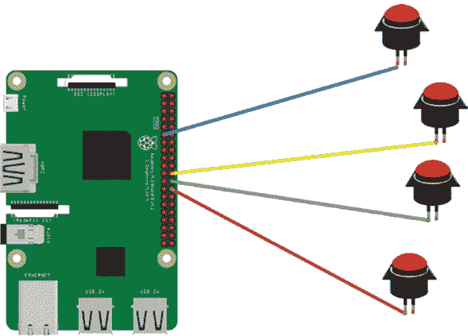
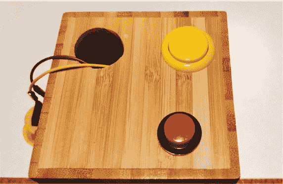
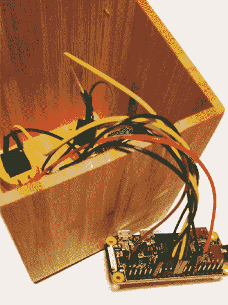
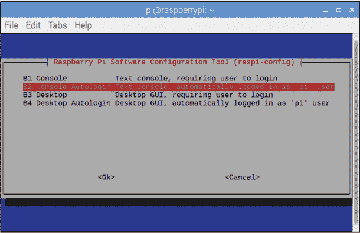
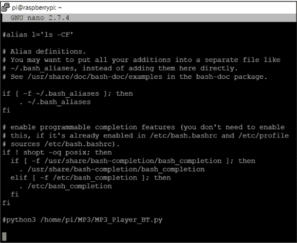
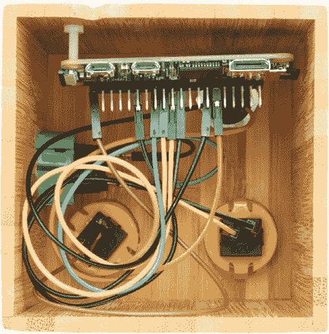

## 第十章：魔法音乐盒

在这一章中，你将创建一个个性化的 MP3 播放器，我们称之为魔法音乐盒。你将使用树莓派的 PyGame 库来构建一个可以播放预加载音乐的 MP3 播放器，并通过扬声器播放，然后添加四个互动按钮：一个用来跳过歌曲，两个用来调节音量，还有一个电源开关来关闭播放器。

你将把所有硬件组合成一个精美的盒子，打造你的 MP3 音乐系统（图 10-1）。程序代码使用了 PyGame，这是你在第五章中使用的用于创建游戏的 Python 库。PyGame 允许你通过 Python 代码来添加和控制声音、图像和视频。在这个项目中，你将使用 PyGame 来控制 MP3 文件，启动和停止它们，并调整音乐的音量。


**图 10-1** 完成的 MP3 魔法音乐盒及其扬声器

### 所需物品

以下是你完成项目所需的一些物品：

+   树莓派

+   4 个按钮

+   8 组母对公跳线

+   蓝牙扬声器或音频插孔扬声器

+   焊接工具和电烙铁或导电漆

+   小盒子（午餐盒、木盒、纸板盒或其他）

+   电钻或螺丝刀（用来打孔）

+   USB 电池（可选）

### 选择扬声器类型

根据你使用的树莓派型号，你首先需要决定使用哪种方法来输出音频。低成本的选择是使用一个小型扬声器，连接到耳机插孔，并将扬声器隐藏在音乐盒内部。你可以在网上零售商或者本地商店寻找带有 3.5mm 音频插孔的便携式扬声器；所有 3.5mm 型号的扬声器都可以使用。

使用小型扬声器的缺点是它们会产生低质量的声音，只有树莓派 2、3、4 和 A+型号才有音频端口来支持它们。

另一种稍微贵一点的选择是使用蓝牙扬声器。这个扬声器通常具有高质量的声音，并且便携，所以你可以将扬声器放置在任何你想要的位置。树莓派 3、4 和 Zero W 型号具有内建的蓝牙功能。Pi Zero W 的另一个优势是它非常小巧，使得它成为最容易嵌入音乐盒的型号。如果你使用的是较老的树莓派型号，且有空余的 USB 端口，你可以通过购买一个支持蓝牙 4 和音频的标准 USB 蓝牙适配器，并将其连接到一个端口来增加蓝牙功能。

下表展示了适合各种 Pi 型号的扬声器选项。

| **型号** | **耳机插孔** | **蓝牙** | **优点** | **缺点** |
| --- | --- | --- | --- | --- |
| A+ | 是 | 否 | 小型板；可通过 USB 端口支持蓝牙适配器 | 性能较慢 |
| Pi 2 | 是 | 否 | 多个 USB 端口 | 板子较大 |
| Pi 3B+ | 是 | 是 | 良好的规格；比 Pi 4 便宜 | 板子较大 |
| Pi 4 | 是 | 是 | 最快的处理器 | 比其他型号贵 |
| Pi Zero W | 否 | 是 | 最小的板；内建 Wi-Fi；可以远程上传 MP3 文件；价格便宜 | 性能较慢 |

### 构建魔法音乐盒

一旦你为电路板选择了扬声器，你就可以开始制作音乐盒了。你可以使用任何材料作为音乐盒的外壳——例如木质铅笔盒、塑料午餐盒或旧的麦片盒。要注意，你需要在材料上打孔；因此，如果你没有工具钻孔（例如木材），可以选择纸板外壳。

在开始项目之前，你应该花时间安排按钮、扬声器和树莓派在盒子内的位置，以找出合适的设置。你可以自定义设置，但要用常识。例如，在大多数音乐播放器中，音量控制按钮是并排放置的。

#### 按钮接线

来制作按钮吧！以下是步骤：

1.  **连接电线：** 选择一个按键和两根公对母的跳线，并找到公端。使用一些焊锡或导电漆，将公端连接到按钮的每个引脚上（图 10-2）。我建议你使用一根黑色电线连接其中一个引脚，以表示它是地线（GND）。按照这个方法连接其余三个按钮。

    这些按钮将构成你将连接到树莓派的 MP3 播放器的主要控制。

    

    **图 10-2** 连接每个按钮的电线

1.  **接线按钮：** 对于每个按钮，将黑色电线（地线）连接到树莓派的任一 GND 引脚，然后将另一根电线连接到下表所示的 GPIO 引脚。

    | **引脚** | **按钮** |
    | --- | --- |
    | GPIO 7 | 下一首歌（`play_skip`） |
    | GPIO 25 | 音量增大 |
    | GPIO 8 | 音量减小 |
    | GPIO 17 | 关机 |

    你可以使用位于物理引脚 6、9、14、20、25、30、34 和 39 的任意一个 GND 引脚（图 10-3）。有些引脚可能更容易让电线接触到，或者在盒子内部布线时能保持更整洁的布局。

    

    **图 10-3** 将每个按钮接线到树莓派

1.  **打孔：** 如果你使用的是木质或塑料盒子，你需要钻孔以安装按钮。孔的大小取决于按钮的尺寸（图 10-4）。首先打一个小孔，试着安装按钮，然后再调整孔的大小。如果你使用的是木盒，可以请成人帮忙钻孔。如果你使用的是纸板盒，可以用锋利的铅笔或钢笔戳孔。决定按钮的放置位置后，钻或戳四个足够大的孔，以容纳每个按钮。

    **图 10-4** 在盒子上打孔

1.  **安装按钮：** 你这样做的方式取决于你使用的按钮和盒子的类型。许多按钮的顶部有一个小圆形边缘，放置在盒子孔的外侧，两个灵活的夹子固定按钮的主体。这种类型的按钮通常被称为*街机按钮*。对于其他类型的按钮，你可以使用胶水或双面胶带将按钮固定在适当位置，*但只有在你确认程序和硬件工作正常后再进行此操作*。

    在将树莓派固定到盒子内部之前，先玩一下树莓派的布局，以确保电线和按钮能够适合。 图 10-5 展示了一个布局示例，你也可以把电池隐藏在盒子里。注意，你仍然可以访问树莓派，因为最好在固定树莓派和其他部件之前编写和测试程序。这样，如果需要调整，你仍然可以访问按钮和电线。

1.  **装饰盒子：** 装饰并个性化盒子的外观。你可以添加颜色、贴纸、音乐播放器的使用说明或任何你喜欢的东西。



**图 10-5** 准备内部硬件布局

#### 连接扬声器

要听 MP3 文件的声音，你需要设置音频输出。根据你使用的是耳机插孔还是蓝牙扬声器，设置方法不同。启动树莓派并连接显示器、键盘和鼠标。

##### 使用耳机插孔连接扬声器

如果你使用的是音频插孔，通过标准的 3.5 毫米插孔电缆将扬声器连接到树莓派的黑色耳机插孔，该插孔位于 HDMI 端口旁边。插入树莓派并启动它；加载 Pi 桌面。找到并点击桌面顶部的音频图标 。从音频输出下拉菜单中选择**模拟**。现在，所有音频将通过你的扬声器播放。

##### 使用蓝牙扬声器

如果你正在使用蓝牙扬声器，请通过点击屏幕右上角的蓝牙图标来开启树莓派上的蓝牙软件。然后打开你的蓝牙扬声器。你需要在扬声器上启用设置，使其可以被发现。再次点击蓝牙图标，从下拉菜单中选择**添加设备**。树莓派将尝试查找所有支持蓝牙的设备，包括你的扬声器。

当你的树莓派找到扬声器时，它将出现在弹出窗口中。从列表中选择它，然后点击**配对**按钮，以建立树莓派与蓝牙扬声器之间的连接。

一旦连接确认，点击音频图标 ，从下拉菜单中选择你的蓝牙扬声器。两个设备将再次尝试配对并建立连接。扬声器设置完成后，你的树莓派将始终自动找到并连接到该扬声器。

#### 编写魔法音乐盒代码

让我们编写代码来播放音乐并设置按钮功能。你将使用 PyGame 的音频混音工具来控制 MP3 文件的播放和音量。按钮功能通过`gpiozero`库来控制，该库提供了简单的代码来触发事件。

##### 创建新文件夹

首先，你需要创建一个文件夹，用来存储程序代码和你想要播放的 MP3 音乐文件。在终端中，输入以下命令：

```
pi@raspberrypi:- $ mkdir MP3
```

然后通过输入以下命令切换到*MP3*文件夹：

```
pi@raspberrypi:- $ cd MP3
```

将所有 MP3 音乐文件传输并保存到*MP3*文件夹中。然后打开一个新的 Python 文件，并将其保存到*MP3*文件夹中，命名为*music_box.py*。

##### 导入模块和库

现在，你需要导入程序中将要使用的所有模块和库。输入 Listing 10-1 中的代码开始。

```
❶ import glob, time, pygame

   from gpiozero import Button
❷ from subprocess import check_call
   from signal import pause
   from pygame.locals import *

❸ pygame.init()
❹ pygame.display.set_mode((100, 100))

❺ global the_song
   global level
   global songs_found
   global number_of_songs
```

**LISTING 10-1** 设置导入和全局变量

导入`glob`、`time`和`pygame`❶。你已经熟悉了`time`模块。你将使用`glob`模块来搜索 MP3 文件名，并且将使用`pygame`库来控制 MP3 文件的播放和音量。

然后从`gpiozero`库中导入`Button`类，它允许你在每个按钮按下时触发事件。接下来，导入`check_call()`函数❷，你将用它来调用`shutdown()`命令以关闭音乐播放器。

PyGame 文件运行在一个独立的窗口中，尽管你不会使用该窗口，但你仍然需要通过`pygame.init()`❸来初始化它，以便使用 PyGame。然后你需要定义该窗口的大小。因为你不会与它交互，所以可以将其设置为非常小——比如 100 × 100 像素❹。

接下来，创建四个变量❺：`the_song`保存当前播放的 MP3 文件名，`level`保存音量级别，`songs_found`保存 MP3 歌曲的文件名，`number_of_songs`保存歌曲的总数。这些变量是*全局*变量。全局变量是在函数外部声明的，这意味着 Python 程序可以提取存储在全局变量中的数据，并在程序的其他地方使用。

##### 将按钮分配到 GPIO 引脚

接下来，添加 Listing 10-2 中的代码，设置`shutdown()`函数，并将每个按钮分配到一个 GPIO 引脚。

```
❶ def shutdown():
   ❷ check_call(['sudo', 'poweroff'])

   ### Buttons for control ###
❸ play_skip = Button(7)      # begin the music green
   volume_up = Button(25)    # volume up blue
   volume_down = Button(8)     # volume down yellow
   shutdown_btn = Button(17, hold_time=2) # shutdown

❹ the_song = 0 # as first song is in position 1
❺ playing_songs = True

```

**LISTING 10-2** 定义按钮和引脚

定义`shutdown()`❶函数，使用`check_call()`函数调用将关闭 Pi 的 Python 程序❷。这个函数让你在没有显示屏的情况下也能关闭音乐盒！

接着，创建每个按钮的变量，分别是`play_skip`、`volume_up`、`volume_down`和`shutdown_btn`。然后将每个变量分配给连接到该按钮的 GPIO 引脚编号❸。如果你使用了与本示例中不同的引脚编号，确保更改括号中的值。

请注意，在将 `shutdown_btn` 分配给其 GPIO 编号后，你指定了按住时间，即在触发 `shutdown()` 函数之前，按钮需要按住的秒数❷。（在此示例中，按住时间为 2 秒。）添加按住时间可以减少误操作，当你不小心按下按钮时，MP3 播放器不会被意外关机。

接下来，创建两个变量。`the_song` 变量❹ 包含当前播放歌曲在歌曲列表中的位置。列表从第一个位置的歌曲（位置 0）开始。`playing_songs` 变量指定是否有歌曲在播放❺。程序使用此变量来搜索并播放 MP3 文件。将其设置为 `True`。

##### 构建歌曲播放列表

程序的下一部分使用你之前导入的 `glob()` 函数查找你保存在 *MP3* 文件夹中的 MP3 音乐文件。此代码，见 Listing 10-3，构建了一个包含所有歌曲标题的列表，程序使用这个列表来加载并播放每首歌曲。记住，文件必须保存在与 Python 程序文件相同的文件夹中。

```
❶ def find_mp3_files():
       global songs_found
       global number_of_songs

  ❷ mp3_files_playlist = glob.glob('*.mp3')
  ❸ songs_found = mp3_files_playlist
  ❹ print ("I have found the following song", songs_found)
  ❺ number_of_songs = len(songs_found)
  ❻ print ("there are", number_of_songs, "songs")

   #### set volume ###
❼ level = 0.10
❽ pygame.mixer.music.set_volume(level)
```

**LISTING 10-3** 查找歌曲

第一行定义了 `find_mp3_files()` 函数，该函数包含查找每个 MP3 文件并存储文件名的代码❶。因为你稍后需要在程序中使用此函数收集的信息，所以从之前导入了两个全局变量。这些变量允许你将歌曲详细信息和歌曲数量的数据传递到下一个函数。

然后创建另一个变量 `mp3_files_playlist`，它使用 `glob()` 函数搜索所有以 *.mp3* 扩展名结尾的文件❷ 并将它们存储在该变量中。

接下来，将 MP3 文件名的列表复制到一个新变量 `songs_found` ❸ 中。这样，原始列表会保存在 `mp3_files_playlist` 变量中，并且你可以编辑新列表而不影响旧列表。如果你将新音乐添加到 *MP3* 文件夹，每次运行程序时，它都会被识别并添加到歌曲列表中。

打印所有 MP3 文件的名称❹ 让你拥有歌曲标题列表。仅当文件名与歌曲名称相同才有效。例如，如果歌曲名为“Life On Mars”，你需要将 MP3 文件保存为 *life_on_mars.mp3*。一旦你将 MP3 播放器与屏幕断开并以无头模式运行，你将看不到 MP3 文件的打印输出，但执行此步骤对测试很有帮助。

因为你希望 MP3 播放器播放列表中的所有歌曲，所以你需要计算歌曲的数量❺ 并查看打印出来的数字❻。每次你添加或删除播放列表中的歌曲时，都必须执行此步骤，因为这会改变列表的长度。

你还需要为音量控制按钮设置初始音量级别。该值在 0 到 1 之间，0 表示无声，1 表示最大音量。音量范围取决于你使用的扬声器类型。暂时将初始音量设置为 0.10，即最大音量的十分之一❼；如果音量太大或太小，你可以稍后调整。代码的最后一行指示`pygame`设置音量❽。

##### 创建播放歌曲的代码

清单 10-4 创建了主函数，控制神奇音乐盒的按钮。

```
   ### Main code for playing and changing songs ###
❶ def play_mp3_songs():
      global the_song
      global level
      global songs_found
      global number_of_songs   
   ❷ if playing_songs == True:   
      ❸ while the_song < number_of_songs:
            ### Play a song ###
         ❹ pygame.mixer.music.load(songs_found[the_song])
         ❺ pygame.mixer.music.play()
            print ("Playing Song")
         ❻ the_song = the_song + 1
            print ("the song number is", str(the_song))

         ❼ while pygame.mixer.music.get_busy():
            ❽ pygame.time.Clock().tick(10)  # waits for song
```

**清单 10-4** 神奇音乐盒播放代码

需要注意缩进级别，因为接下来的大部分代码都在`play_mp3_songs()`函数内。记住，如果你遇到困难，可以从*[`www.nostarch.com/raspiforkids/`](https://www.nostarch.com/raspiforkids/)*下载代码。

定义一个新函数`play_mp3_songs()`❶，该函数包含主程序代码。接下来，添加你之前创建的四个全局变量：`the_song`用于控制正在播放的 MP3 文件，`level`用于调节音量，`songs_found`用于访问 MP3 文件名列表，`number_of_songs`。

创建一个`while`循环❷，让神奇音乐盒继续播放歌曲，直到播放列表中的最后一首歌。

然后，确保当播放器播放到最后一首曲目时停止播放❸。如果正在播放的是 20 首歌中的第 4 首，播放列表会继续播放，因为 4 小于歌曲总数。一旦播放列表播放到第 20 首，它将从头开始循环。稍后，你将使用程序的这一部分跳过歌曲并控制音量。

代码加载即将播放的 MP3 文件❹。因为你之前将`the_song`设置为 0，所以 PyGame 会加载 MP3 文件列表中索引为 0 的第一首歌曲。加载后，程序使用代码`pygame.mixer.music.play()`❺来播放该文件。打印当前播放的歌曲名称，确保它与正在播放的歌曲一致。

接下来，将`the_song`的值增加 1❻。这告诉程序每次循环时选择列表中的下一首歌。

总结一下，程序选择第一首歌并开始播放。当当前歌曲播放结束后，程序会选择下一首歌播放（或者如果你按下盒子上的物理“下一首歌”按钮）。在此之前，程序会继续播放当前歌曲，并检查 PyGame 音乐混音器是否正在忙碌❼。你使用 PyGame 时钟❽来阻止 PyGame 播放下一首歌，直到当前歌曲播放完毕。这是使用`wait()`或`sleep()`函数的替代方法，因为每首歌的时长不同。

##### 编写“下一首歌”按钮的程序

现在，添加 Listing 10-5 中的代码，这让你能够跳到下一首歌曲。这段代码从前一段代码继续，顶部行与 Listing 10-4 最后一行的缩进相同。以此缩进为指导来缩进其余的代码。

```
                ### Change the song ### 
             ❶ if play_skip.is_pressed:
                ❷ time.sleep(0.5)
                   print ("End of Songs")
                ❸ pygame.mixer.music.stop()
                ❹ break
```

**LISTING 10-5** 跳过歌曲

代码检查是否有人按下了下一首歌曲按钮❶，这个按钮之前命名为`play_skip`。你还添加了一个短暂的延迟❷，以便 PyGame 可以注册按钮按下事件。否则，程序可能会崩溃。

如果有人按下了按钮，PyGame 使用`pygame.mixer.music.stop()`❸函数来停止播放音乐。

一旦你停止了当前的歌曲，你希望程序返回到开始的地方，在那里`while the_song < number_of_songs`条件检查是否还有歌曲待播放。为此，你可以跳出循环，这样 PyGame 混音器就不再忙碌❹。如果还有歌曲，PyGame 将播放下一首。

##### 增加音量

添加 Listing 10-6 中的音量控制按钮代码。你从增加音量的按钮开始，这个按钮之前命名为`volume_up`。

```
                ### Change volume up ###
             ❶ if volume_up.is_pressed:
                ❷ if level < 1:
                   ❸ level = level + 0.10
                      print (level)
                   ❹ pygame.mixer.music.set_volume(level)
                ❺ else:
                      pass
                      print ("top volume")
```

**LISTING 10-6** 增加音量

如同在 Listing 10-5 中所示，首先检查按钮（`volume_up`）是否被按下❶。如果按下了，程序需要检查当前音量是否已达到最大值。它通过检查当前音量是否小于或等于 1❷来实现，1 是最大音量。如果音量小于 1，你可以让程序通过增加 0.10 来提高音量❸。

如果程序刚开始，音量为 0.10。按一次`volume_up`会增加 0.10，将音量提高到 0.20❹。

你为条件“不满足‘小于一’”时编写了响应代码，这个条件是在音量达到最大时。使用`else`语句❺，然后输入`pass`，以保持音量处于最大水平。

##### 降低音量

添加 Listing 10-7 中的代码，使用`volume_down`来降低音量。

```
                ### Change volume down ###
             ❶ if volume_down.is_pressed:
                ❷ if level > 0:
                   ❸ level = level - 0.10
                      print (level)
                      pygame.mixer.music.set_volume(level)
                ❹ else:
                       pass
                        print ("bottom volume")
```

**LISTING 10-7** 降低音量

这段代码类似于增加音量的代码。你检查是否按下了`volume_down`按钮❶。如果按下了，检查当前音量水平，如果音量水平大于 0❷，则从当前音量减去 0.10❸。

再次使用`else`语句❹来`pass`按钮按下事件，如果音量为 0，因为在这种情况下，无法将其调低。

##### 关闭魔法音乐盒

Listing 10-8 中的代码允许你关闭音乐盒。当你按下电源按钮或播放完所有歌曲时，音乐盒将停止播放。

```
             ❶ shutdown_btn.when_held = shutdown

 ❷ else:
    ❸ print ("end of playlist")
```

**LISTING 10-8** 关闭音乐盒

添加电源按钮的代码❶。然后使用`else`语句❷，当所有歌曲播放完毕时，也会关闭音乐盒，并打印`end of playlist`❸。

##### 结束程序

你已经定义了执行所有工作的三个函数。现在通过使用清单 10-9 来调用这些函数，完成程序的编写。

```
   ### Main Program ###
❶ find_mp3_files()
❷ button.wait_for_press()
❸ play_mp3_songs()
```

**清单 10-9** 调用魔法音乐盒的三个函数

`find_mp3_files()` ❶ 函数在程序运行时会定位所有的 MP3 文件。所以，如果你添加了新的 MP3 文件，函数将会找到它们并将它们添加到播放列表中。

`button.wait_for_press()` ❷ 函数为按钮添加了用户交互功能，当你按下按钮时，魔法盒会做出相应反应。

`play_mp3_songs()` ❸ 函数运行主程序循环，检查是否有 MP3 文件可以播放，然后播放每一首。它还会检查是否有按钮被按下，并作出响应。

#### 运行你的程序

是时候测试你的程序了！如果你使用的是蓝牙扬声器，请检查它是否与树莓派配对。如果你使用的是通过音频插孔连接的扬声器，请确保它已正确连接。然后保存程序并按**F5**运行它。

程序应该定位到文件夹中的所有 MP3 文件并建立歌曲列表。然后，它会播放列表中的第一首歌。按下**下一首**按钮切换歌曲。接着，试试音量按钮。按下**关机**按钮停止音乐播放并关闭你的树莓派。

如果你的 MP3 播放器无法正常工作，检查以下错误：

+   音量是否过低或静音？

+   音频设置是蓝牙还是耳机插孔？

+   蓝牙扬声器是否已配对？

+   MP3 文件是否保存在与 Python 代码相同的文件夹中？

+   声音文件是否以*.mp3*扩展名结尾？

+   按钮是否连接到程序代码中使用的 GPIO 引脚号？

### 自动启动 MP3 播放器

作为最后的点睛之笔，让我们设置你的魔法音乐盒在每次连接电源时自动启动并播放音乐。根据你使用的是耳机插孔还是蓝牙扬声器，你可以通过两种方式来实现。

#### 耳机插孔选项

如果你使用耳机插孔，你需要使用 cron，这是你在第九章中使用的基于时间的任务调度工具。cron 程序使你能够在特定的时间自动运行某个程序。

使用 cron 时，你需要创建指令来说明你希望在哪个事件发生时运行，以及何时运行这些事件。你在*crontab*文件中执行此操作，该文件包含要运行的程序或事件的指令，最重要的是，何时运行这些事件。

打开终端并输入以下命令以打开 cron 控制台：

```
pi@raspberrypi:- $ sudo crontab –e
```

控制台会提供三种编辑 cron 文件的方法。选择选项 2 并按 ENTER 键使用 nano 文本编辑器打开 crontab 文件。滚动到 crontab 文件的底部，找到空白处。然后添加以下代码行：

```
@reboot sudo python3 /home/pi/MP3/music_box.py &
```

该命令表示每次树莓派重新启动时，它应以超级用户模式运行 Python（这允许运行任何程序，就像管理员模式一样），打开*/home/pi/MP3*文件夹，并执行名为*music_box.py*的程序。

如果你为代码文件命名为其他名称，替换*music_box.py*为你给它命名的文件名。还要通过打开存储*music_box.py*程序的文件夹并查看文件路径，来检查文件夹路径是否正确。

代码行末的`&`符号告诉你的程序在后台运行，这样你就可以同时使用树莓派进行其他任务。

一旦你检查过命令详情并确信它们正确，按 CTRL-X 保存并退出 crontab 文件。现在，每次你打开或重启树莓派时，crontab 文件都会运行，启动魔法音乐盒。

如果你想停止程序自动运行，可以再次从终端打开 crontab 文件，输入以下命令：

```
pi@raspberrypi:- $ crontab –e
```

然后删除你之前添加的代码行。保存文件并重启。

由于 MP3 播放器设计为无头模式运行，你不需要让树莓派启动到桌面并显示背景屏幕和图标，也不需要使用鼠标。启动到桌面会因为这些不必要的项目而变得更慢，同时占用更多的内存和处理能力。你看不到桌面，所以加载它是没有意义的。相反，你将配置树莓派从命令行启动。打开终端窗口并输入以下命令：

```
pi@raspberrypi:- $ sudo raspi-config
```

接下来，选择第三个选项，**启动选项**，按 ENTER 键。然后选择**B1 桌面 / CLI**选项，选择**B2 控制台自动登录**选项，选择**<OK>**，并按 ENTER 键 (图 10-6)。你需要重新启动你的树莓派。



**图 10-6** 启动到命令行并自动登录

选择**完成**选项，系统会提示你保存配置文件并重启。选择**是**，树莓派将重新启动。随着树莓派的启动，魔法音乐盒也会加载。

#### 蓝牙选项

如果你使用的是蓝牙音响，仍然可以在启动时自动启动程序，但这稍微有些复杂，因为你需要配置多个设置。

你还需要向*.bashrc*文件中添加一行文本，以触发 Python 运行你的程序。*.bashrc*文件是一个每次树莓派启动时都会运行的 shell 脚本。

在你更改这个文件之前，确保蓝牙音响已经与树莓派配对。为了让 Python 程序访问音响，你需要先启动到图形界面（GUI）桌面，而不是命令行模式。但是，当 PyGame 运行时，它会让屏幕变成空白。这没问题，因为魔法音乐盒不需要屏幕。但是，这也让解决程序中的任何问题变得困难，因为你看不到或无法访问程序代码。

为了解决这个问题，打开 Python MP3 播放器程序，并在导入库的代码行后添加`time.sleep(30)`，为程序启动添加一个 30 秒的延迟。这给了你时间编辑或调整设置代码，如果它没有正常工作。只要记得在测试程序时你已经添加了延迟，这样就不会误以为程序没有运行！

如果在添加了 30 秒延迟后，Python 已经加载了 PyGame，并且你仍然需要访问树莓派，你需要通过 SSH 远程访问它。但是在添加自动启动脚本之前，请在配置设置中启用 SSH。有关如何操作的提醒，请参阅第 25 页的“通过 SSH 访问树莓派”。

现在你准备好创建启动脚本了。打开终端窗口，输入以下命令打开*.bashrc*文件：

```
pi@raspberrypi:- $ sudo nano .bashrc
```

滚动到文件底部，输入 python3，后跟 MP3 程序的文件路径——例如，python3 /home/pi/MP3/MP3_Player_BT.py（见图 10-7）。



**图 10-7** 启动脚本

记得将示例文件路径替换为你程序的文件名和位置。保存文件，然后重启树莓派。它应该会加载你的 MP3 Python 代码。记得等待 30 秒，并确保你的蓝牙音响仍然配对连接。延迟结束后，屏幕会变黑。按下**下一首歌**按钮播放第一首歌。

如果你听不到音乐，但怀疑代码正常工作，尝试将扬声器或耳机插入耳机插孔。如果能听到音乐，就说明程序正常工作，问题出在蓝牙配对上。

如果遇到其他问题并需要编辑代码，你可以重启树莓派，或打开终端窗口并按 CTRL-X 或 CTRL-Z 暂停代码。然后检查各种设置。如果这不起作用，可以使用 SSH 访问树莓派并打开、编辑或注释掉*.bashrc*文件；然后重启。继续测试你的音乐盒，直到你确信硬件和程序代码正常运行。

### 汇总

一旦你完成了程序代码并确认它正常工作，你可以开始将硬件固定到你的盒子里。它可能看起来像图 10-8 所示。



**图 10-8** 完成的魔术音乐盒

如果你使用的是简单的容器，比如午餐盒，将树莓派和电池放入盒子中并固定好盖子。如果你使用的是木盒，像图 10-8 所示，你可以使用双面胶带、固定膏或小尼龙螺丝将树莓派固定。

然后你可以将电线收纳起来，避免外界看到。你还可以开额外的孔来安置需要的电源或 USB 线。如果程序代码出错，最好的解决办法是取出 SD 卡，并将其插入另一台 Pi 设备。当问题解决后，再将 SD 卡放回原来的 MP3 播放器 Pi 中。

### 总结

恭喜！你已经建好了自己的独立魔法音乐盒。现在你可以为你的魔法音乐盒添加更多功能，比如以下这些：

+   更多的 MP3 文件

+   一个音乐播放器加载时闪烁的 LED 灯

+   随着音乐播放闪烁的 LED 灯

+   一个静音按钮

+   额外的按钮，用于播放上一首歌曲、播放列表的片段，或者一个隐藏的彩蛋歌曲

+   一个小型 LCD 屏幕，显示当前歌曲的名称
