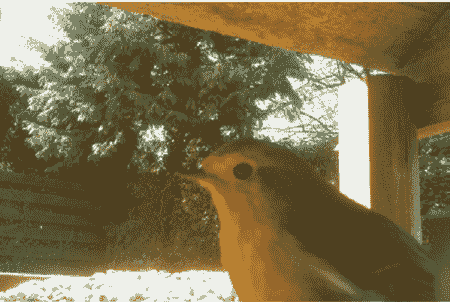
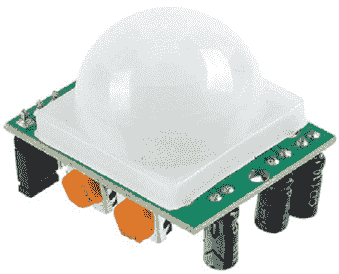
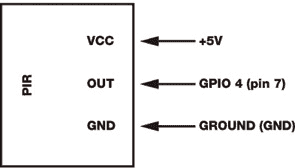
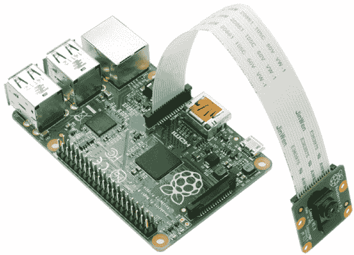
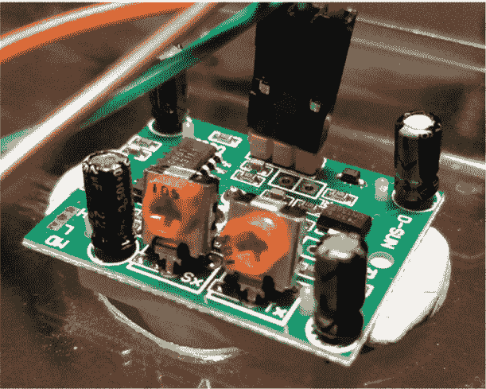
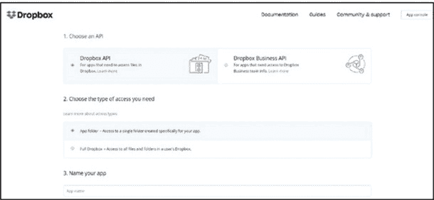
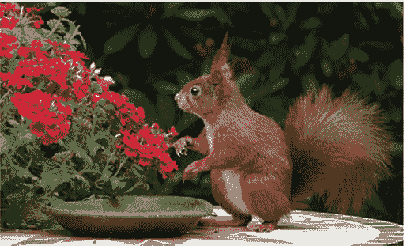
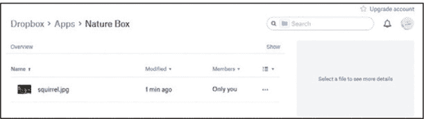
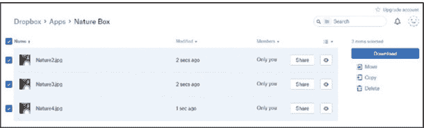
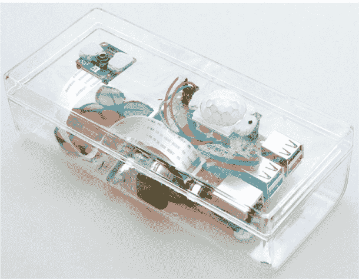

## 第十一章：自然盒子：运动感应相机

在本章中，你将构建并编写一个自然盒子相机，当它感应到运动时可以拍照。然后，你将把自然盒子放置在野外，拍摄当地的野生动物。你永远不知道——你可能会拍到一只鸟、一只獾，甚至是一只狐狸！

该盒子将包含一个运动传感器。每当动物接近时，传感器会触发内置的树莓派相机拍照。然后，树莓派会将每张图片上传到一个在线 Dropbox 文件夹，供你查看并与朋友分享。你可以让相机从早到晚一直工作，看看有哪些“访客”来到（图 11-1）。



**图 11-1** 构建一个像这样拍摄动物照片的自然盒子。

### 你将需要的物品

以下是完成项目所需的几样物品：

+   树莓派（你可以用任何树莓派型号来构建自然盒子。Pi 2、3 A+和 Zero W 非常适合，因为它们小巧，可以隐藏在较小的空间中。）

+   Pi 相机

+   被动红外传感器（PIR）

+   跳线

+   透明塑料盒，用于容纳硬件

+   Dropbox 账户

+   USB 便携电池

+   电钻

### 设置被动红外传感器

一个 PIR 传感器（图 11-2）更常被称为*运动探测器*。它探测从温暖物体和生物（如人类、动物，甚至是车辆）释放出的红外光，并测量光的变化。你可以编写代码来响应某些变化级别的检测，并触发相应的事件，如打开灯光、发出警报或自动打开门。

当物体经过 PIR 时，它会释放热量，改变周围的温度。PIR 感应到周围红外辐射的差异，并改变内部电压，这意味着它已经检测到某物。在传感器的圆顶内有小镜子，帮助 PIR 从远至 30 英尺的地方探测红外光的变化。



**图 11-2** 一款 PIR 传感器

#### 连接 PIR 传感器

你只需要三根电线就可以将 PIR 连接到树莓派。将 VCC PIR 引脚（提供电源）连接到树莓派板上方的 5V GPIO 引脚。图 11-3 中使用的是物理引脚 2 的 5V 引脚。将 OUT 引脚连接到树莓派上的 GPIO 引脚 4（物理引脚 7）。然后，将 PIR 上的接地（GND）引脚连接到树莓派上的接地引脚。



**图 11-3** 连接 PIR 传感器

#### 测试 PIR

让我们编写一个简单的程序来测试 PIR 是否正常工作。你的身体会散发热量，当你四处移动时，你会扰动并移动包围你身体的热量。Listing 11-1 中的代码初始化了 PIR 传感器，然后检查热量是否发生变化。如果 PIR 传感器检测到显著的变化，按照你设定的阈值，程序将指示它已经*看见你了*。打开你的 Python 编辑器，输入 Listing 11-1 中的代码。将其保存为*PIR_test.py*。

```
❶ import time
   import RPi.GPIO as GPIO
   GPIO.setmode(GPIO.BCM)

❷ PIR = 4
   GPIO.setup(PIR, GPIO.IN)

   print ("Ready to find you")
   time.sleep(2)

❸ def Motion_Sensing(PIR):
       print ("We see you")

❹ try:
   ❺ GPIO.add_event_detect(PIR, GPIO.RISING, callback=Motion_Sensing)
   ❻ while 1:
          time.sleep(1)
❼ except KeyboardInterrupt:
       print ("Quit")
       GPIO.cleanup()
```

**LISTING 11-1** 使用 PIR 检测运动

导入`time`模块和`RPi.GPIO`模块，以控制和编写 GPIO 引脚的代码❶。因为有两种 GPIO 引脚编号系统，你需要通过设置模式为`BCM`来定义你使用的编号系统。

接下来，声明一个变量来定义你用于检测响应的 GPIO 引脚编号。这是你连接到 PIR 传感器的 GPIO 4 引脚❷。通过使用`GPIO.IN`告诉程序检查 GPIO 4 引脚的输入。

因为这是一个测试程序，打印一行表示传感器已准备好寻找你，然后在从 PIR 传感器获取数据之前提供一个短暂的时间延迟。这样你就有时间准备，开始移动或挥动手臂，从而触发传感器。

然后定义一个响应任何感应到的运动或变化的函数❸。在这个测试程序中，响应是一个简单的语句，表示你已经被看到。

接下来，程序尝试检测运动❹。你使用`try`和`except`方法来避免当 PIR 传感器工作不正常或读取到异常数据时引发错误。这样可以确保程序在 PIR 发生故障时仍然继续运行。

接下来，你从 PIR 传感器读取数据❺。这段代码检查 GPIO 4 引脚的电压是否上升。如果是，说明有东西触发了 PIR 传感器。所以你使用`callback`方法运行响应任何感应到的运动或变化的函数❸，并打印`We see you`。

为了防止 PIR 传感器多次读取相同的输入，你添加了一个 1 秒的延迟❻。这样可以为 PIR 传感器重置提供足够的时间，然后再检查温度是否发生变化。记住，你是在寻找运动，而不是存在；因此，摄像头不需要始终保持活动状态。

最后，你需要一种停止程序的方法。你添加了`except`响应，它检查是否按下了键盘上的任何按键❼。如果检测到按键，它会打印`Quit`，重置 GPIO 引脚，并停止程序。

保存程序并按**F5**键运行它。你可以交替进行移动和保持静止的操作，确保 PIR 能够检测到你。如果你愿意，你可以将这变成一个游戏。你能保持如此静止，以至于不会触发 PIR 吗？你能进入一个房间而不被 PIR 探测到吗？

### 设置 Pi Camera

有了能够检测运动的 PIR 传感器，你就可以设置 Pi Camera 来捕捉任何触发传感器的影像。

#### 连接 Pi Camera

如果你在第四章中完成了 Pi Camera 项目，你可能已经设置好了硬件。使用排线将相机连接到 Pi，如 Figure 11-4 所示，并记得确保 Pi Camera 在配置工具中启用。这需要你重新启动 Raspberry Pi。如果遇到问题或需要更详细的说明，请参阅第 16 页的“接口”部分。



**FIGURE 11-4** 设置 Pi Camera

#### 创建一个新文件夹来存储图片

为了保持自然盒子项目的有序性，你会希望将图片和程序文件存储在一个地方。通过打开终端并输入以下命令，创建一个名为*Nature_Box*的新文件夹：

```
pi@raspberrypi:- $ mkdir Nature_Box
```

创建一个项目文件夹可以防止你的主文件夹被成百上千的图片弄得乱七八糟。

### 编写测试代码

在连接了 Pi Camera 之后，你可以开始一个新的 Python 文件，或者修改 Listing 11-1 中的代码，让相机在 PIR 传感器检测到运动时拍照。你可以拍摄鸟类、猫或其他本地野生动物——甚至可能是狐狸——它们经过你的自然盒子设置时。输入 Listing 11-2 中的代码，并将其保存为*Cam_PIR.py*。

```
❶ from time import sleep
   from picamera import PiCamera
   import RPi.GPIO as GPIO
   GPIO.setmode(GPIO.BCM)

   PIR = 4
   GPIO.setup(PIR, GPIO.IN)

❷ global Image_Number
   Image_Number = 0
   camera = PiCamera()

   print ("Ready to find you")
❸ sleep(2)

   def Motion_Sensing(PIR):
    ❹ global Image_Number

    ❺ camera.resolution = (1024, 768)

    ❻ camera.capture("Nature" + str(Image_Number) + ".jpg")
    ❼ Image_Number = Image_Number + 1

   try:
      GPIO.add_event_detect(PIR, GPIO.RISING, callback=Motion_Sensing)
      while 1:
       ❽ sleep(1)
   except KeyboardInterrupt:
       print ("Quit")
       GPIO.cleanup()
```

**LISTING 11-2** 每当 PIR 检测到运动时拍照

编辑程序代码，导入`time`模块中的`sleep()`函数，并导入`picamera`类❶。

然后，为了防止每张新图片覆盖之前的图片，创建一个变量来存储当前的`Image_Number`❷。将其设置为全局变量，以便稍后在主程序功能中使用这些数据，保存每个文件时使用不同的名称。将`Image_Number`变量设置为`0`，这意味着拍摄的第一张图片将命名为*Nature0.jpg*。

然后将`PiCamera()`函数添加到`camera`变量中。将`time.sleep(2)`替换为更简洁的代码`sleep(2)`❸。这种写法更好，因为你输入的文本更少，从而减少了出错的机会。你可以在其他程序和项目中使用这种简洁的代码。它的作用相同：暂停程序 2 秒，在下一行代码运行之前创建一个小的延迟。

接下来，在`Motion_Sensing(PIR)`函数内，添加触发 Pi Camera 并拍照的代码。在❹处，你添加了在❷处创建的全局变量。然后你设置了相机的分辨率❺，并添加了捕捉图像的代码❻。

注意，捕获图像的代码❻将字符串`"Nature"`与当前设置为`0`的`Image_Number`值❷结合起来。这会创建一个名为*Nature0*的文件，并加上*.jpg*文件扩展名，将图像保存为*Nature0.jpg*。

然后，向当前的图片值❼添加`1`，这样程序将保存下一个文件为*Nature1.jpg*，接下来的是*Nature2.jpg*，以此类推，直到程序停止。你还将最后一行代码从`time.sleep(1)`更改为`sleep(1)`❽。

将程序保存在 *Nature_Box* 文件夹中，这样所有图片都会存储在那里，便于稍后访问。按 **F5** 运行程序。每当有物体触发 PIR 时，Pi 摄像头将拍摄一张照片并保存在文件夹中。你可以将你的自然盒子放在最珍贵的物品或巧克力储藏处附近。如果有人偷了你的东西，你将有盗窃者的照片证据。

如果 PIR 传感器触发过于灵敏，可以调整其灵敏度。在温暖的日子里，树枝的摆动可能会移动红外辐射，PIR 可能会感应到。如果盒子靠近道路，经过的汽车可能会改变周围的空气。

为了避免在这些情况下触发相机，找到 PIR 后面两个小旋钮（见图 11-5）（通常是橙色的）。一个是 *延迟时间调整* 旋钮，调整每次触发 PIR 后的重置时间。另一个是 *距离调整* 旋钮，用来增加或减少灵敏度；基本上，它决定了触发 PIR 所需的温度变化量。你可以调整这些旋钮，找到适合你自然盒子和当地环境的完美设置。



**图 11-5** 调整 PIR 后部的灵敏度

### 从 Raspberry Pi 获取图片

现在你需要弄清楚如何检索你的图片。如果你将硬件放置在野外，直到你收回自然盒子之前将无法访问图片。根据你的设置或你想监测的野生动物类型，你可能希望将其放置几天。但等待这么长时间查看图片并不是理想的选择。解决方案是将你的自然盒子连接到互联网，这样你就可以使用文件共享网站 Dropbox 和一个简单的 Python 程序实时上传每张图片。你将能通过平板、笔记本电脑或手机远程访问这些照片。

#### 设置 Dropbox 账户

如果你已经拥有 Dropbox 账户，可以跳过此步骤。如果没有，前往 Dropbox 网站 [*https://www.dropbox.com/*](https://www.dropbox.com/)，注册一个新账户。点击 **创建账户** 并填写注册表单（见图 11-6）。另外，你也可以使用 Google 账户信息进行注册。


**图 11-6** 注册或登录 Dropbox

登录后，前往 Dropbox 开发者页面 (图 11-7)，网址是 [*https://www.dropbox.com/developers/*](https://www.dropbox.com/developers/) 创建一个应用。


**图 11-7** 访问 Dropbox 开发者页面

点击 **创建你的应用** 选项。Dropbox 会为你提供几个选项。当它提示你选择 API 时，选择 **Dropbox API**。然后选择 **应用文件夹** 作为访问类型。为你的应用命名；我将其命名为 *Nature Box*。同意条款和条件，并点击蓝色的 **确认** 按钮以访问下一个配置设置页面（图 11-8）。



**图 11-8** 配置应用程序的设置

保持状态行设置为 **开发**，将开发用户行设置为 **仅限你**。这意味着只有你可以编辑该应用。你还可以编辑应用文件夹的名称。

忽略应用密钥和应用密钥行；此项目不需要这些。

选择 **生成的访问令牌** 选项，生成一个代码，使你的 Raspberry Pi 能够将图像文件发送到 Dropbox 应用。稍后你需要在 Python 程序中使用这个令牌。记住，这个令牌确保你的账户安全，因此不要与他人分享。

配置好 Dropbox 应用后，你现在可以使用它上传自然盒子图像。

#### 安装 Dropbox Python 库

你需要安装一个 Python Dropbox 库，这样你就可以从 Python 程序代码访问你的 Dropbox 应用和文件夹。要安装所需的软件，请打开终端并输入以下命令：

```
pi@raspberrypi:- $  sudo pip3 install dropbox
```

然后，为了确保你使用的是最新的更新，输入以下命令：

```
pi@raspberrypi:- $  sudo pip3 install dropbox --upgrade
```

##### 创建测试程序

在你将 PIR 和 Pi Camera 连接到 Dropbox 之前，你需要创建一个简单的程序来测试 Dropbox 应用和令牌是否正常工作。但首先，在 *Nature_Box* 文件夹中保存一张 JPEG 图像以供测试。在列表 11-3 中的程序里，我使用了一张可爱的松鼠图片（图 11-9），并将文件命名为 *squirrel.jpg*。



**图 11-9** 将图像保存到 *Nature_Box* 文件夹

打开你的 Python 编辑器，创建一个新文件，并添加以下代码。将其保存为 *DB_uploader.py*。

```
❶ import dropbox

❷ token = "xxxxxxxxxxxxxxxxxxxxxxxxxxxx"

❸ dbx = dropbox.Dropbox(token)

❹ with open("/home/pi/Nature_Box/squirrel.jpg", "rb") as file:
    ❺ dbx.files_upload(file.read(), '/squirrel.jpg', mute = True)

❻ print ("uploaded")
```

**列表 11-3** 测试你的 Dropbox 应用和令牌

导入 `dropbox` 模块 ❶。创建一个名为 `token` 的变量，并将你之前获得的应用令牌用引号括起来 ❷。接下来，创建另一个名为 `dbx` 的变量来存储 `Dropbox` 类 ❸，它使你的 Python 程序能够与你的 Dropbox 账户进行通信。

现在，你准备好定位并打开你想要上传的图像文件 ❹。通过使用 `with open` 打开图像存储的文件夹。接下来，从文件中读取并使用 Dropbox API 上传图像到你的账户 ❺。然后打印一个简短的确认信息 ❻，以便你知道文件上传完成。

##### 运行程序

访问 Dropbox 网站，登录并导航到你的应用程序文件夹。然后返回到你的 Raspberry Pi，运行测试程序。测试将尝试上传你的图像文件（在此示例中是松鼠的图像），因此请检查你的 Dropbox 文件夹以查看上传情况（图 11-10）。



**FIGURE 11-10** 上传到 *Nature_Box* 文件夹中的图像

### 编写最终的自然盒子程序

到目前为止，你已经创建了三个独立的程序：第一个测试 PIR 是否正常工作，第二个在 PIR 检测到运动时触发 Pi Camera，第三个则允许 Raspberry Pi 将图像上传到你关联的 Dropbox 文件夹。现在，让我们将你本章所学的所有内容结合起来，制作最终的自然盒子程序。

#### 设置最终程序

保存并重命名你之前的 *DB_uploader.py* 文件，或者开始一个新的 Python 文件并将其保存为 *NatureBox.py*。然后输入 Listing 11-4 中的代码。

```
❶ import dropbox
   from time import sleep
   from picamera import PiCamera
   import RPi.GPIO as GPIO
   GPIO.setmode(GPIO.BCM)
```

**LISTING 11-4** 开始最终的自然盒子程序

导入 `dropbox` 模块 ❶，该模块允许你通过 Python 代码与 Dropbox 进行交互。还需导入常用的 `sleep()` 函数以增加小的延迟，然后导入 `picamera` 库，最后导入 `Rpi.GPIO` 模块以控制 PIR。接着，你需要将 GPIO 编号系统设置为 `BCM`。

#### 结合相机和传感器

接下来的代码部分，如 Listing 11-5 所示，结合了 PIR 代码和相机代码，所以当检测到运动时，Pi Camera 会被触发。它拍摄一张照片，然后创建并保存图像文件。前几行代码应该对你来说并不陌生，因为它们来自你创建的 *Cam_PIR.py* 测试程序。

```
PIR = 4

GPIO.setup(PIR, GPIO.IN)

global Image_Number
Image_Number = 0
camera = PiCamera()

print ("Ready to find you")
sleep(2)

def Motion_Sensing(PIR):
    global Image_Number
    print ("We see you")
    camera.resolution = (1024, 768)
 ❶ Image_Number = Image_Number + 1
    camera.capture("Nature" + str(Image_Number) + ".jpg")

 ❷ pic = ("Nature" + str(Image_Number) + ".jpg")
```

**LISTING 11-5** 捕捉并保存图像

给图像文件变量 ❶（你之前设置为 0）加 1，这样第一个保存的图像将命名为 *Nature1.jpg*。

在 Pi Camera 捕捉图像后，它会保存图像文件，但不保存文件名。为了同时保存文件名，创建一个名为 `pic` ❷ 的新变量，将图像的文件名作为字符串存储。这意味着程序可以在稍后上传图像文件到 Dropbox 时访问它。

#### 创建 try 和 except

接下来，在 Listing 11-6 中，你将使用 `try` 和 `except` 方法。`try` 部分尝试运行负责将图像文件上传到 Dropbox 的代码。如果由于某些原因自然盒子无法访问 Dropbox——比如网站不可用，或自然盒子不再在线——程序将通过 `except` 部分跳过这一部分并继续运行，而不会停止或产生错误。

```
   try:
     ❶ token = "xxxxxxxxxxxxxxxxxxxxxxxxxxxxxxxxx"
     ❷ dbx = dropbox.Dropbox(token)
        print ("ready")
     ❸ with open("/home/pi/Nature_Box/" + pic, "rb") as file:
         ❹ dbx.files_upload(file.read(), '/Nature%s.jpg' 
            %(Image_Number), mute = True)
            print ("uploaded")
            file.close()
 ❺ except:
        pass
        print("failed")
```

**LISTING 11-6** 保存图像文件名

添加你的 Dropbox 令牌❶并将其分配给一个名为`dbx`的变量❷，你用它来验证账户凭据并启用与 Dropbox 的交互。在❸处，通过将图片的文件夹位置和`pic`变量（它保存最新图片的文件名）结合起来，打开相机刚拍摄的图片。代码`rb`将图片作为二进制文件打开，并以字节形式读取其内容，而不是字符串。这一点很重要，因为文件包含的是图像，而不是文本。然后将这些数据赋值给一个名为`file`的变量，就像存储在树莓派上的文件中构成图像的实际数据。

程序从`file`读取字节并尝试上传数据❹。代码`'/Nature%s.jpg' %(Image_Number)`将文件名添加到 Dropbox，因为你上传的二进制数据本身不包含文件名。代码`mute = True`会防止用户收到上传通知。你可以想象，收到成百上千条上传文件的通知会是多么让人分心。

上传后，关闭文件：打开的文件会占用处理器资源，并且可能会减慢你的树莓派，尤其是在文件很多的情况下。最后，添加程序的`try`和`except`方法的`except`部分❺。如果程序无法上传图片，它会通过跳过并打印通知来响应，然后进入循环，重置 PIR 并等待传感器再次触发。图像仍然保存在树莓派的*Nature_Box*文件夹中，只是不会被上传。

#### 运行运动传感器

程序的最后部分，如 Listing 11-7 所示，与你之前创建的*PIR_test.py*程序完全相同。它指示 PIR 等待输入，并在接收到输入时运行`Motion_Sensing()`函数。

```
try:
    GPIO.add_event_detect(PIR, GPIO.RISING, callback=Motion_Sensing)
    while 1:
        sleep(1)
except KeyboardInterrupt:
    print ("Quit")
    GPIO.cleanup()
```

**LISTING 11-7** 结束程序

一旦你复制了完整的程序，保存并运行它。通过四处移动触发 PIR 传感器来测试它是否工作。打开你的互联网浏览器并导航到你的 Dropbox 文件夹，查看上传的图片（图 11-11）。在将你的自然盒子投入实际使用之前，你可以通过有趣的方式测试你的程序：和朋友竞争，看谁能不触发传感器进入房间，或者将你的自然盒子放在前门，检查是谁在敲门。在决定开门之前，可以先在 Dropbox 文件夹中寻找证据！



**FIGURE 11-11** 当你运行程序时，你的照片应该出现在 Dropbox 文件夹中。

如果自然盒子没有正常工作，考虑以下常见错误：

+   程序中使用的 Dropbox 令牌是否正确？

+   树莓派是否已连接到互联网？否则，所有图像文件将保留在*Nature_Box*文件夹中。

+   代码中的文件夹名称是否与实际文件夹名称匹配？

+   代码中的文件名是否与实际的文件名匹配？

+   PIR 的灵敏度是否调整得当，以便适当的动作触发它？

上传到 Dropbox 时，无法覆盖相同的文件。因此，每次在首次运行程序后再次运行时，请确保你已将第一批图像文件移动到其他文件夹或将其删除。

### 自动启动程序

由于你将在户外设置 Nature Box，因此不会连接显示器。每次插入 Raspberry Pi 电源时，程序都需要执行。回想一下，我在第七章、9 章和 10 章中已经介绍过如何自动启动程序。现在，你将为 Nature Box 程序再次设置。

你将使用 cron 来自动运行程序，通过在 crontab 文件中创建指令，指定你想运行的事件及其执行时间。如果你需要复习如何使用 cron，请参考第九章。

打开终端并输入以下命令以打开 cron 控制台：

```
pi@raspberrypi:- $ sudo crontab –e
```

cron 控制台为你提供了三种编辑 crontab 文件的方法。选择第二个选项并按回车键，使用 nano 文本编辑器打开 crontab 文件。

滚动到 crontab 文件底部，找到空白区域。然后添加以下代码行以自动运行程序：

```
@reboot sudo python3 /home/pi/Nature_Box/NatureBox.py &
```

该命令表示每次 Raspberry Pi 重启时，应该以超级用户模式运行 Python，打开*/home/pi/Nature_Box*文件夹，并执行你的*NatureBox.py*程序。

如果你将代码文件命名为其他名称，请将*NatureBox.py*替换为你的文件名。还要通过打开存储*NatureBox.py*程序的文件夹并注意文件路径，检查文件夹路径是否正确。

代码行末尾的`&`告诉你的程序在后台运行，这样你就可以同时使用 Raspberry Pi 做其他任务。

检查命令详情并确保它们正确无误后，按 CTRL-X 保存并退出 crontab 文件。现在，每次打开或重启 Raspberry Pi 时，crontab 文件都会运行，启动 Nature Box。

如果你想停止程序的自动运行，请从终端重新打开 crontab 文件，并删除你添加的代码行，如下所示：

```
pi@raspberrypi:- $ crontab –e
```

然后保存文件并重新启动。

Nature Box 设计为无需显示器即可运行，因此你无需让 Raspberry Pi 启动到桌面界面并显示背景墙纸和图标。因为你不会看到桌面，所以不需要加载它。相反，你可以配置 Pi 启动到命令行界面。打开终端窗口并输入以下命令：

```
pi@raspberrypi:- $ sudo raspi-config
```

选择第三个选项，**启动选项**，然后按回车键。接着选择**B1 桌面 / CLI**选项，再选择**B1 控制台**选项。点击**保存**选项，然后重新启动 Raspberry Pi。

设置完成后，选择**<完成>**选项并按下 ENTER 键：系统会提示你保存配置文件并重启。按**是**来重启你的 Pi。当树莓派启动时，自然盒子会加载。在你把盒子放到野外之前，先进行一个快速测试，确保它正常工作并将图片上传到你的 Dropbox 账户。

### 整合所有部分

现在你有了一个可用的程序，可以设置好盒子并将其放置在你的花园、当地公园或其他地方。使用塑料盒作为盒子的外壳是理想的选择（图 11-12），因为你可以用胶带密封它，它会保持相当的防水性——不过我不建议你将自然盒子放入池塘中或在雷雨天气下将其放置在外面。

准备自然盒子相当简单：

1.  使用电钻打一个小孔，以便相机镜头可以穿透。

1.  使用电钻打一个更大的孔，让 PIR 可以穿透。最好先钻一个小孔，然后逐渐扩大钻头的尺寸，这样就不会裂开塑料。如果你使用的是木盒，应该没有问题。孔只需要大到足够让 PIR 穿透即可。

    **图 11-12** 完成的自然盒子示例

1.  使用挂钩胶或双面胶带将 Pi Camera 和 PIR*固定在*你的盒子内。或者，Pi Camera 和一些 PIR 上有小螺丝孔，你也可以用它们进行安装。

    祝你自然狩猎愉快！

### 总结

干得好，做得非常棒——现在你拥有一个可以感知运动的自然盒子，触发 Pi Camera 拍照。然后，这张图片会被上传到你的 Dropbox 账户，你可以查看并分享。现在试试以下操作：

+   使用你的设置放在卧室中，看看谁进来了，并希望能看到他们出去。

+   将它放在饼干罐或巧克力藏匿处附近，以便收集拍摄证据，查看是谁一直偷吃你的东西。

+   购买 Pi NoIR Camera，它可以在夜间或黑暗中拍摄照片。
