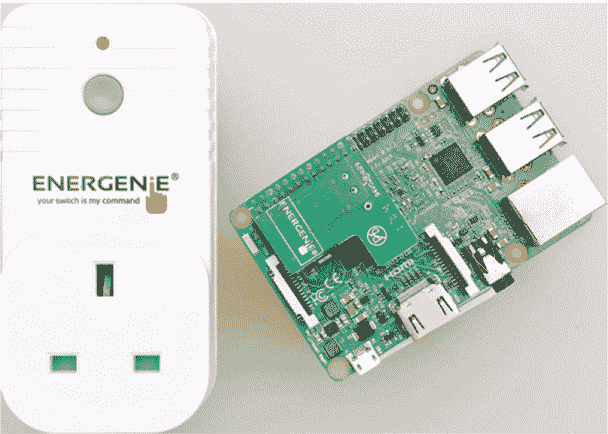
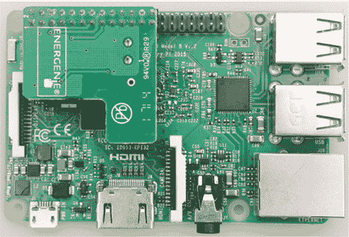
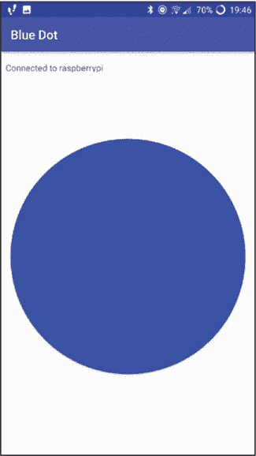
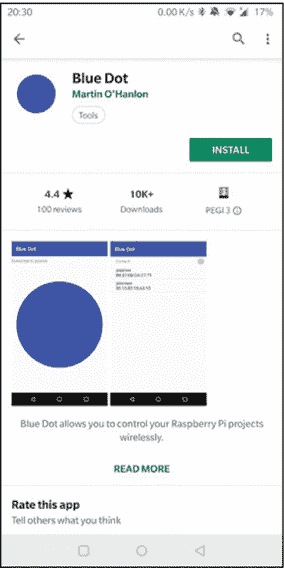
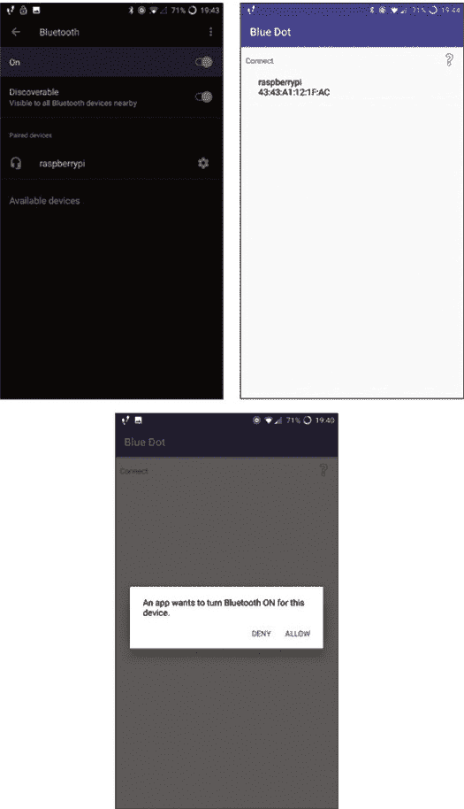
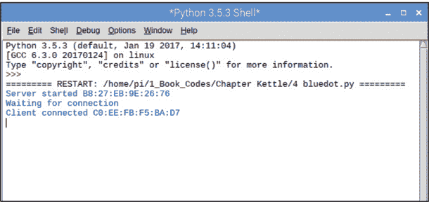
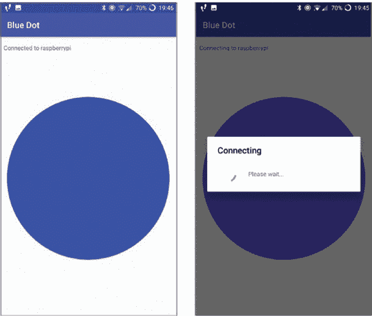

## 第十二章：智能插座用于智能家居黑客

在本章中，你将学习如何通过手机远程控制电子设备。为此，你将结合树莓派和 Energenie 智能插座，后者允许你通过手机上的单次点击来控制流经电子设备的电力。

你将能够使用完成的项目打开卧室的台灯、电热水壶、电视、派对灯或任何其他可以通过简单插入插座打开的设备！图 12-1 显示了 Energenie 智能插座。该插座由 Pi-mote 控制，Pi-mote 是一块小型电路板，连接到你的树莓派上，允许你打开或关闭插座。



**图 12-1** 连接到树莓派的 Energenie 智能插座和远程控制板（Pi-mote）

**注意**

*该项目的手机控制部分仅适用于安卓设备*。

### 所需物品

这是项目所需的物品：

+   树莓派

+   手机或平板电脑（安卓系统）

+   Energenie Pi-mote

+   Energenie 智能插座

+   英国至美国适配器插头

在美国，你可以通过搜索“Energenie Pi-mote control with two remotes”或者使用产品代码 ENER002-2PI，在多个网站上找到 Pi-mote 和插座。

Energenie 直接向 220-Electronics 供应产品 (*[`www.220-electronics.com/pi-mote-remote-control-outlet-starter-kit-with-2-sockets.html`](https://www.220-electronics.com/pi-mote-remote-control-outlet-starter-kit-with-2-sockets.html)*)，该公司位于美国并且全球配送。

插座也可以在以下零售商处购买：

+   *[`www.rapidonline.com/`](http://www.rapidonline.com/)*

+   *[`www.cpc.farnell.com/`](http://www.cpc.farnell.com/)*

+   *[`www.newark.com/`](http://www.newark.com/)*

如果在其他地方找不到 Pi-mote，你可以尝试 eBay。

在英国，你可以直接从 Energenie 购买 Pi-mote，网址为 *[`energenie4u.co.uk/`](https://energenie4u.co.uk/)*。Pimoroni (*[`shop.pimoroni.com/`](https://shop.pimoroni.com/)*）和 Amazon 也有销售。

### 设置 Energenie 远程插座

随着技术的发展，你可以通过手机或平板电脑控制越来越多的电器设备，而无需离开座位。例如，你可以通过网站调节中央供暖，通过应用程序打开烤箱，并在汽车接近时自动打开车库门。

许多此类控制设备使用 *继电器*，它是一个可以开关电路的开关。*电路* 是指电流在连接的一组电线中流动，这些电线连接到硬件设备（例如电机、灯泡或蜂鸣器）。Energenie 公司创建了一套安全且易于使用的继电器插座，你可以直接通过树莓派控制它们。通过打开或关闭这些继电器，你可以打开或关闭连接到插座的电器或硬件。

要使用 Energenie 插头，你需要将一个小型控制板 Pi-mote 插入 Raspberry Pi，这样你就可以切换插头来开关电源。该插头的工作范围可达 30 米，并且可以穿透门、墙壁和天花板。这个项目听起来很有趣吗？让我们开始吧。首先，你需要确保插头正常工作：

1.  **测试插头：** 将你的 Energenie 插头插入电源插座。打开插座给 Energenie 插头供电。将灯泡插入 Energenie 插头并打开灯泡。按下插头上的绿色按钮以打开插头。你应该会听到一个独特的 *咔嗒* 声音，这是继电器在关闭电路时发出的声音。当你按下绿色按钮时，继电器闭合并连接插头内部的电路，电流流向灯泡。由于灯泡已经开启，灯泡会亮起。

1.  **连接 Pi-mote：** 确保你的 Raspberry Pi 已关闭，并且已断开 Raspberry Pi 的电源。智能插头的电源是否开启都不影响。将 Pi-mote（L 形板）连接到 GPIO 引脚的顶排，使板子的 L 形部分朝内，面向 HDMI 接口，如 图 12-2 所示。将板子牢牢压上，使其与 GPIO 引脚接触并固定好。 

    **图 12-2** 将 Pi-mote 连接到你的 Pi

1.  **安装软件：** 在你创建运行插头和 Pi 的程序之前，需要安装所需的 Python 库，这些库将允许你与插头进行交互。打开终端窗口并输入以下两行代码，每输入一行后按 ENTER：

    ```
    pi@raspberrypi:- $ sudo apt-get install python3-pip
    pi@raspberrypi:- $ sudo pip3 install energenie
    ```

    安装完成后，通过输入以下命令重启你的 Raspberry Pi：

    ```
    pi@raspberrypi:- $ sudo reboot
    ```

### 测试灯泡

你将创建一个简单的程序来测试 Energenie 插头和 Raspberry Pi 是否能够相互通信。

#### 远程控制灯泡

你将使用的简单程序会打开插头，进而打开灯泡。确保你的灯泡仍然插入到你插入电源插座的 Energenie 插头中，并且灯泡开关是开启的。保持插头通电，如果灯泡亮起，表示继电器已闭合。然后按下 Energenie 插头上的绿色按钮将其关闭。打开 Python 编辑器并新建一个文件。输入以下代码并将文件保存为 *plug_test.py*。

```
❶ from energenie import switch_on
❷ switch_on()
```

程序首先导入 `switch_on` 类 ❶，正如你可能推测的那样，这是打开插头的程序功能。

在下一行，调用 `switch_on()` 函数 ❷，这将触发 Pi 从 Pi-mote 向插头发送消息，打开插头。按 **F5** 执行代码。你的插头将被打开，灯泡也会亮起。非常酷吧。

要关闭插头，请将 Python 程序中的代码更改为以下内容：

```
from energenie import switch_off
switch_off()
```

保存此程序并再次运行；灯泡应该会关闭！此代码还导入了`switch_off()`函数，并调用该函数来关闭插座。

#### 使灯泡闪烁

作为最终测试，您将结合前面两个程序，并添加短暂的延迟，使灯泡闪烁。技术上来说，您并不是让灯泡闪烁，而是每隔 5 秒钟切换一次插座的开关。在一个新的 Python 文件中，添加 Listing 12-1 中的程序代码，并将其保存为*plug_flash.py*。

```
❶ import time
❷ from energenie import switch_on, switch_off

❸ while True:
    ❹ switch_on()   # add the socket number between the parentheses
    ❺ time.sleep(5)
    ❻ switch_off()
    ❼ time.sleep(5)
```

**Listing 12-1** 切换插座的开关

程序首先导入`time`模块❶，以便在插座开关之间添加延迟。然后导入`switch_on()`和`switch_off()`函数❷。

接下来，使用`while True`循环保持程序的下一行代码持续运行❸。然后使用导入的函数来开启插座❹，暂停 5 秒❺，然后关闭插座❻。

代码的最后一行❼添加了另一个 5 秒的延迟。否则，插座关闭后将没有延迟立刻重新打开：灯泡会亮 5 秒钟，然后关闭，并立即重新亮起。

保存代码并运行程序。您的灯泡应该每 5 秒闪烁一次。

测试程序后，通过按 CTRL-C 停止程序。

### 使用应用程序控制插座

使用 Python 程序控制家电设备非常酷。但更棒的是，您可以使用一个应用程序，通过点击一个按钮来控制智能插座。*Blue Dot*是一个超级简单的 Android 应用程序，它让您通过手机或平板设备上的一个大蓝点与 LED、马达和其他组件（包括 Energenie 插座）进行交互，如图 12-3 所示。该应用程序使用蓝牙使您的设备与树莓派进行通信，通信范围大约为 10 米。您可以将您的设备视为灯泡的手持遥控器。



**图 12-3** Blue Dot 应用程序

1.  **在树莓派上设置 Blue Dot：** 首先，您需要在树莓派上安装所需的 Python 库。打开终端窗口并输入以下命令：

    ```
    pi@raspberrypi:- $ sudo apt install python3-dbus
    pi@raspberrypi:- $ sudo pip3 install bluedot
    pi@raspberrypi:- $ sudo pip3 install bluedot --upgrade
    ```

1.  **安装应用程序：** 在安装 Python 库的同时，解锁您的手机或平板设备（请记住，这仅适用于 Android 设备），然后前往 Google Play 商店。在商店中，搜索 Blue Dot 应用程序，它的图标应类似于图 12-4。点击**安装**按钮，应用程序将下载到您的设备上。

    **图 12-4** 为您的设备下载 Blue Dot 应用程序

1.  **配对你的设备和树莓派：** 在你的移动设备上启用蓝牙，通常可以在设置中找到此选项（见图 12-5）。确保蓝牙设置为**可发现**选项，这样你的树莓派就能找到你的设备。返回到树莓派，找到桌面右上角的蓝牙符号，点击该符号，在菜单中选择**开启**▸**使设备可发现**。几分钟后，你应该会看到你的移动设备出现在列表中，选择它进行连接。根据你的设备，可能需要输入共享 PIN 码。



**图 12-5** 从设备连接到你的树莓派

另一种连接蓝牙的方法是通过移动设备进行配对。首先搜索附近的设备，然后从列表中选择你的树莓派。根据屏幕提示完成配对。配对过程通常很标准，虽然根据设备的品牌不同，可能会略有差异。

### 编写智能插头代码

在连接好树莓派和设备后，你就可以开始编写程序，通过移动设备来控制 Energenie 插头了！返回到你的 Python 编辑器，输入程序代码（见列表 12-2），并将其保存为*plug_bluedot.py*。

```
❶ from energenie import switch_on, switch_off
❷ from bluedot import BlueDot

❸ bd = BlueDot()

❹ while True:
    ❺ bd.wait_for_press()
    ❻ switch_on()
    ❼ bd.wait_for_release()
    ❽ switch_off()
```

**列表 12-2** 从移动设备控制插头

程序首先导入`switch_on()`和`switch_off()`函数❶，然后导入`BlueDot()`类❷。

将`BlueDot()`类设置为名为`bd`的变量❸，以便更快速地使用，然后创建一个`while`循环，使程序代码能够持续运行❹。

然后让树莓派检测你的设备上的蓝点是否被点击❺，如果是，便打开 Energenie 插头，进而点亮灯泡❻。当你松开蓝点❼时，插头会关闭❽，灯光熄灭。

#### 运行程序

检查树莓派和设备之间的蓝牙连接是否仍然有效。如果连接中断，可能需要重新建立连接。运行程序。如果树莓派成功连接到你的设备，控制台窗口会显示一条消息，确认连接成功（见图 12-6）。



**图 12-6** 连接你的设备到蓝牙

返回到你的设备并打开 Blue Dot 应用，你会看到屏幕上显示一个大蓝点，如图 12-7 所示。用手指按住蓝点，灯泡就会亮起；然后松开蓝点，灯泡会熄灭。



**图 12-7** 连接到树莓派

#### 改进控制开关的代码

现在你将修改*plug_bluedot.py*程序，使你可以通过单击蓝点来打开插头，再次点击蓝点来关闭插头。这样，你可以打开插头并保持开启状态，直到你再次点击蓝点。

这个程序更加实用，因为你可以把任何设备连接到插座！例如，如果你将电热水壶连接到 Energenie 插座，你可以通过点击蓝点来打开它。如果你需要关闭电热水壶，只需再次按下蓝点，开关就会关闭。

为了做到这一点，你将使用 Blue Dot 的 D-pad 功能，这类似于游戏控制器上的方向键，你可以按上、下、左、右按钮来控制玩家。在这个项目中，你将使用上按钮来打开插座，使用下按钮来关闭插座。打开你的*plug_bluedot.py*文件并修改它，使其与 Listing 12-3 中的代码一致。

```
 from energenie import switch_on, switch_off
   from bluedot import BlueDot
❶ from signal import pause

   bd = BlueDot()

❷ def dpad(pos):
       if pos.top:
           print ("up")
           switch_on()
    ❸ elif pos.bottom:
           print ("down")
           switch_off()

❹ bd.when_pressed = dpad

❺ pause()
```

**LISTING 12-3** 使用 Blue Dot 来打开和关闭插座

在新代码中，首先从`signal`库中导入`pause()`函数❶。你需要这个函数，因为在程序运行时，它总是等待 D-pad 被点击，这会给处理器带来负担。添加`pause()`函数可以减轻整体负担。

接下来，创建一个`dpad()`函数来处理 D-pad 被点击时应该发生的操作❷。首先，告诉程序，如果 D-pad 的上方被点击，应该运行`switch_on()`函数来打开插座。

第二步，添加一个`elif`语句❸，以捕捉 D-pad 底部被点击的情况。告诉程序，如果 D-pad 的下方被点击，应该通过使用`switch_off()`函数来关闭插座。

然后检查蓝点点击❹。当点击蓝点时，这行代码会运行你刚刚创建的`dpad()`函数。最后，添加`pause()`函数❺来减少处理器的负担。

保存并执行程序。确保你的 Raspberry Pi 和设备通过蓝牙连接，然后在手机设备上打开 Blue Dot 应用。将灯具仍然插入 Energenie 插座后，点击蓝点的上半部分，就像 D-pad 上的上按钮一样，打开灯具。点击蓝点的下半部分，就像 D-pad 上的下按钮一样，关闭灯具。记住，这次你不需要按住蓝点。

现在你有了一个可以远程控制的智能插座！尝试用其他一些电器来测试它。

### 总结

一旦你掌握了这个项目的基础，你可以根据需要进行调整。你可以制作一个恶作剧项目，每次有人试图打开灯具时，它就会关闭。或者，如何制作一些更有用的东西，比如一个系统，可以打开电视、收音机，甚至洗碗机？你还可以将这个项目与第三章中的胶枪夜灯结合，创建一个灯具，当房间变得足够暗时会自动打开，并在房间变亮时自动关闭。
