## 第十三章：镜子，镜子：社交媒体状态镜

在这一章中，你将创建一个社交媒体状态镜，这是经典童话《白雪公主》中“镜子，镜子，墙上的镜子”的现代版。想象一下，你正准备外出，想知道朋友们在网上发布了什么。或者，也许你最喜欢的队伍正在比赛，而你希望在早晨准备的时候随时了解比赛动态。

社交媒体状态镜可以帮助解决这两种情况。你只需在 Python 程序中输入一个关键词。然后，每当包含该关键词的推文出现在你的社交媒体时间线上时，一排 LED 灯将闪烁几次，随后镜子会读出这条推文。LED 灯会提醒你有新消息。如果你将个人的 Twitter 账号作为关键词，镜子会读出任何提到你的推文，并告诉你是谁发的推文。

你可以通过选择一套彩色 LED 灯，甚至是动物、汽车或水果形状的 LED 来定制这个项目。或者，你可以选择不将 LED 灯安装在镜子上，正如图 13-1 所示，而是将它们安装在图片、公告板、书架或窗框上。我推荐使用 Raspberry Pi Zero 来做这个项目，因为它小巧而隐蔽，易于隐藏。它还内置了 Wi-Fi，这是你从 Twitter 账户流式传输数据所必需的。


**图 13-1** 创建你的社交媒体状态镜。

### 你需要的材料

这里是完成该项目所需的一些物品：

+   Raspberry Pi Zero W（推荐）

+   一套电池供电的 LED 灯（最大 3.3V）

+   Twitter 账号

+   扬声器

+   USB 电池

+   跳线

+   NPN（三极管：负-正-负，型号 2N 2222）

+   1K 欧姆电阻

+   焊接铁和焊锡，或鳄鱼夹，或铝箔

+   镜子（或你想安装灯光的任何物品）

+   小面包板（可选）

你需要考虑使用哪种类型的扬声器。你可以使用一个简单的便携式扬声器，配有标准音频插孔和电缆。但这样你就不能使用 Raspberry Pi Zero，除非你有一个小型镜子，无法安装较大的 Pi 板。另一个选择是使用支持蓝牙的扬声器，就像第十章中的设置一样。Pi Zero W 支持蓝牙，这意味着你可以直接将音频流式传输到扬声器。

### 准备设备

这个项目有几个部分，所以在开始编写代码之前，你需要设置扬声器，教 Raspberry Pi 通过扬声器朗读文本，连接状态 LED 灯，并将你的 Pi 连接到 Twitter。

#### 连接扬声器

要将扬声器连接到项目中，你有两个选择。如果你*没有*使用 Pi Zero，你可以使用内置的音频插孔。通过标准的 3.5 毫米插孔电缆，将扬声器连接到 Raspberry Pi 后面的耳机插孔，该插孔位于 HDMI 端口旁边。插入你的 Raspberry Pi 并启动它；然后返回桌面。找到桌面顶部的音频图标并右键点击它。从音频输出下拉菜单中选择 **模拟**。现在所有音频将通过你的扬声器播放。

如果你使用的是蓝牙扬声器，通过点击屏幕右上角的蓝牙图标打开 Pi 上的蓝牙软件。然后打开蓝牙扬声器。再次点击蓝牙图标，从下拉菜单中选择 **添加设备**。Raspberry Pi 将尝试查找所有启用蓝牙的设备，包括你的扬声器。确保在扬声器上启用蓝牙设置，使其可以被发现。

当找到扬声器时，它将在弹出窗口中显示。从列表中选择它并点击 **配对**，以建立 Raspberry Pi 和蓝牙扬声器之间的连接。

一旦连接确认，点击音频图标并从下拉菜单中选择你的蓝牙扬声器。两个设备将再次尝试配对并建立连接。一旦扬声器设置完成，你的 Raspberry Pi 应该会自动查找并连接到此扬声器。

#### 教授 Pi 朗读文本

要让 Raspberry Pi 朗读你的推文，你需要创建一个文本转语音程序。这个程序将书面文字转换为音频并播放。你可以使用该程序朗读任何类型的文本，包括短信、电子邮件或天气更新。所以，当你准备好时，你可以轻松调整这个项目，让它朗读其他信息给你听！

打开终端窗口并通过输入以下命令安装 `espeak`：

```
pi@raspberrypi:- $ sudo apt install espeak python3-espeak
```

然后打开 Python 并开始一个新程序。输入以下代码并将其保存为 *espeak_test.py*：

```
from espeak import espeak
espeak.synth("Have you met my friend Alexa?!")
```

确保将引号中的消息替换为你自己的消息。保存程序并运行它。你现在应该拥有一个会说话的 Raspberry Pi——好吧，一个带有文本转语音程序的 Raspberry Pi。进行实验并添加你自己的消息。

#### 准备 LED 灯

现在你将设置 LED 并编写一个程序来控制它们。你的电池供电 LED 应该与电池包一起循环使用，如 图 13-2 所示。LED 将由电池包供电，而你将使用 Raspberry Pi 作为开关，打开和关闭电路，控制 LED 的开关。确保你使用的电池提供的电压不超过 3V，这相当于两节 AA 或 AAA 电池。

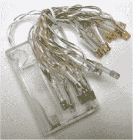

**图 13-2** 电池供电 LED

为了准备电池供电的 LED，使用剪刀剪断接地线。你可以通过追溯电线回到电池包，找到连接到负极端子（即电池平面一侧的连接处）的电线，从而识别接地线，如图 13-3 所示。


**图 13-3** 找到接地线

留下几英寸的电线仍然连接在电池包上。剥去两端的绝缘层，使电线的一部分裸露出来。

使用一根单独的母对公跳线，将其中一端的母头连接或焊接到剥线的一端。将第二根母对公跳线连接到另一根剥线的末端。电池包的外观应该类似于图 13-4。


**图 13-4** 将一根跳线连接到每根被剪断的线的末端。

**注意**

*如果你没有焊接工具，可以将鳄鱼夹夹到电线的一端，然后将另一端夹在跳线的末端。或者，你也可以用铝箔包裹电线的两端。*

#### 使用 NPN 晶体管

NPN 晶体管充当开关，用于切断电池到 LED 的电流。如果没有晶体管，LED 仍然会从电池包接收到一些电流，这意味着即使 LED 应该关闭时，它们也会微弱地发光。NPN 晶体管有三个引脚：*发射极*在左侧，*基极*在中间，*集电极*在右侧。图 13-5 显示的是晶体管的正面，即其平面侧。


**图 13-5** NPN 晶体管

为了设置电路，你需要将电池的接地线连接到发射极，然后将接地线的另一部分（通过剪断接地线获得的）连接到集电极。你将使用树莓派 GPIO 来打开基极，从而翻转晶体管中的开关，实现 LED 的开关控制。

#### 准备电路

将跳线的两端连接到 NPN 晶体管，通过将左侧的跳线连接到 NPN 晶体管的左侧发射极引脚，将右侧的跳线连接到 NPN 晶体管的右侧集电极引脚（图 13-6）。NPN 晶体管通过控制电路中通过的电流来充当开关。通过停止电流流动，NPN 晶体管切断了电路，使得来自电池包的电流无法到达 LED，因此 LED 熄灭，就像你把它们关掉了一样。将 1K 欧姆电阻连接到晶体管的中间基极引脚。需要这个电阻以避免在晶体管工作时损坏树莓派的 GPIO 引脚。

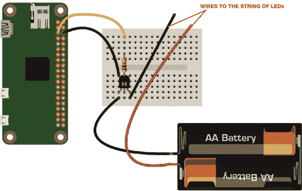

**图 13-6** 设置电路

使用一根女性到女性的电缆将电阻的另一端连接到 GPIO 3 针脚，这是提供电流以关闭电路的针脚。然后，使用一根男性到女性的电缆将晶体管的左侧发射极引脚连接到树莓派的地面针脚。方便的是，GPIO 3 的右侧紧挨着有一个地面针脚，即物理针脚 6。

#### 测试 LED

打开你的 Python 编辑器并输入清单 13-1 中的测试程序。这个代码与第三章中创建热熔胶夜灯时使用的程序相似。它告诉程序哪一个 GPIO 针脚连接了电线，然后打开该针脚。这通过 GND 针脚创建一个电路，允许电池为 LED 供电。

```
from gpiozero import LED
from time import sleep
led = LED(3)
while True:
    led.on()
    sleep(1)
    led.off()
    sleep(1)

```

**清单 13-1** 创建一个电路来点亮 LED

保存并运行程序，然后打开电池组。电线上的 LED 灯会每秒闪烁一次。如果灯光一直亮着不灭，交换两根电缆：将 GPIO 3 线连接到 GND 针脚，将 GND 线连接到 GPIO 3。

一旦你使 LED 正常工作，你就可以开始创建你的社交媒体状态镜子了。但不要急于将 LED 附着到镜子、照片或架子上。相反，你将通过使用显示器来观察推文流和程序对其做出的反应。

### 设置你的 Twitter 开发者账户

要通过 Python 从树莓派访问 Twitter，你需要注册一个开发者账户并创建一个应用程序。然后，你可以生成唯一的密钥和令牌，在程序代码中使用它们来授权树莓派和 Twitter 之间的通信。这些密钥和令牌将你识别为用户，从而允许你通过 Python 代码流式传输你的时间线并发布推文。

首先，确保你有一个有效的 Twitter 账户。你可以使用现有账户，但如果没有账户，可以在[*https://www.twitter.com/*](https://www.twitter.com/)上注册。

设置好账户后，访问[*https://developer.twitter.com/*](https://developer.twitter.com/)并点击页面右上角的**申请**按钮（图 13-7）。


**图 13-7** Twitter 开发者网站

然后，你将看到一个包含多个 API 的页面：这些是用于与 Twitter 交互的编程代码和功能的集合。

选择**标准 API**并点击**申请开发者账户**（图 13-8）。这个账户是免费的，非常适合镜像黑客的要求。你将被要求输入你的 Twitter 用户名和密码以创建账户。如果你已经有了开发者账户并且回来创建你自己的黑客版本，可以点击**登录**。


**图 13-8** 选择**标准 API**选项。

接下来，您将开始验证您的开发者账户。第一步要求您输入一个有效的手机号码。这纯粹是一个安全功能，以便 Twitter 可以向您发送确认短信来授权账户。点击**添加有效的手机号码**（图 13-9）。

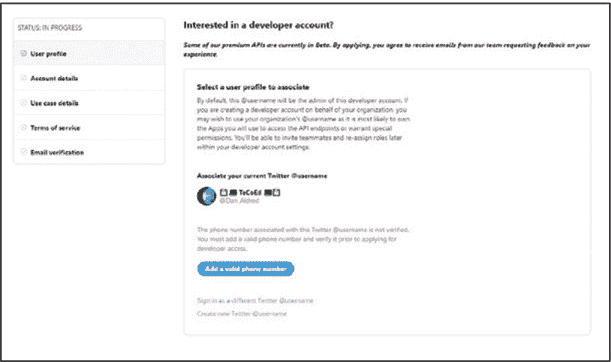

**图 13-9** 添加有效的手机号码。

输入适合您所在地区的详细信息，输入您的电话号码，然后点击**下一步**（图 13-10）。一个验证代码将通过短信发送到您的手机。


**图 13-10** 输入您的详细信息。

当您收到短信时，请打开它。然后将确认码输入到图 13-11 中显示的验证手机号窗口，并点击**验证**。

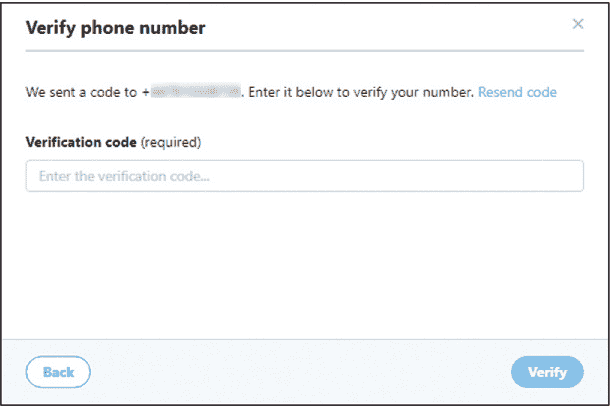

**图 13-11** 输入您在手机上收到的代码。

完成后，您应该看到一条消息，说明您的电话号码已成功验证（图 13-12）。点击**继续**。

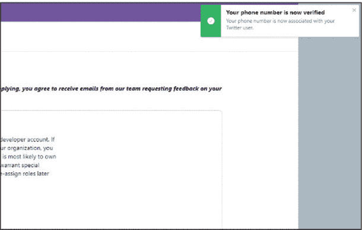

**图 13-12** Twitter 验证您的电话号码。

验证的第二步要求您选择请求访问的对象（图 13-13）：选择第二个选项，**我为个人使用请求访问**。然后为您的账户添加一个名称，这将是您的开发者账户的用户名。您可以使用自己的名字——例如，Dan 的 Twitter——或者使用您的 Twitter 账户名。选择您的主要运营国家/地区，这必须是您所在的位置以及运行镜像黑客的地方。然后点击**继续**。


**图 13-13** 为您的开发者账户命名。

在第三阶段，Twitter 将要求提供有关您项目使用的信息。

在第一个*您感兴趣的用例是什么？*问题中（图 13-14），选择**聊天机器人和自动化**。


**图 13-14** 选择您感兴趣的领域。

然后，您将被提示回答更多关于您正在构建的内容目的的问题。以下是您需要回答的四个问题：

1.  您使用 Twitter API 的目的是什么？

1.  您打算分析推文吗？

1.  您希望转发内容吗？

1.  数据将如何显示？

网页显示了一个简单的指南，其中包括一些建议和示例回答，您可以用它们来创建自己的回答。

回答这些问题时，您需要写至少 300 个字符。这听起来很多，但如果使用模型回答，就很容易达到所需的字符数。红色的提示会显示在框下，直到您写满所需字符数时才会消失。

这是我添加的示例：

我正在使用 Twitter 的 API 来收集我时间线上的推文和提及内容，然后将它们读出来。

该构建不会分析推文。

此构建不会发推、转发、点赞或与其他用户及其内容互动。它只会从我的时间轴中流式传输包含我的用户名的推文。

推文将从文本转化为语音并朗读出来。

你可以添加更多细节并自定义你的黑客版本答案。

在问题 *你的产品、服务或分析是否会让政府机构获取 Twitter 内容或衍生信息？* 下，选择 **否**，然后点击 **继续**。

在第四阶段，你将看到条款和条件 (图 13-15)，如果需要可以阅读。然后滚动到页面底部，选择框以接受条款，并点击 **提交申请**。

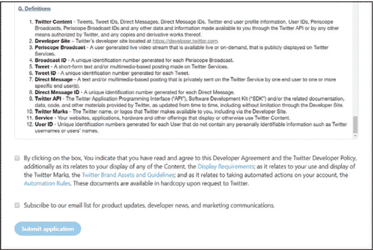

**图 13-15** 确认你接受条款和条件。

你应该会收到来自 Twitter 开发者团队的验证电子邮件。打开此邮件并点击 **确认你的电子邮件**。干得好！你已经完成了申请过程，并应被重定向到 API 开发者页面。

### 设置你的 Twitter 应用程序

一旦你的开发者账户设置并验证完毕，你就可以创建你的应用程序。为此，你需要输入一些项目的详细信息，然后生成一组独特的随机代码，称为 *密钥*。你将在 Python 程序中使用这些密钥，以便连接到你的 Twitter 账户并管理你的推文。开始时选择 **创建一个应用程序** 选项 (图 13-16)。

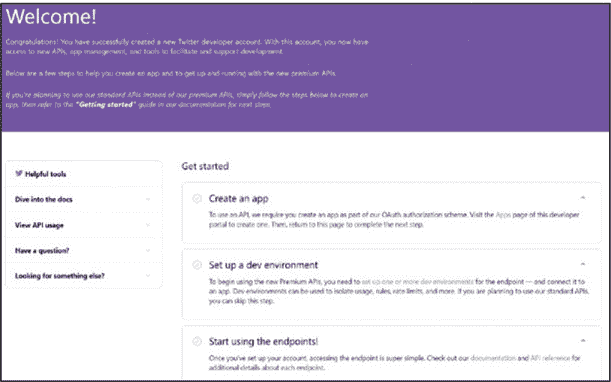

**图 13-16** 开始使用

1.  **创建一个新应用程序：** 网站的下一页将显示你已经创建的所有现有 Twitter 应用程序，并向你展示创建新应用程序的选项。点击 **创建一个应用程序** 按钮 (图 13-17)。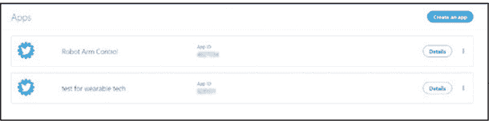

    **图 13-17** 创建一个新的应用程序

1.  **注册你的新应用程序的详细信息：** 输入应用程序的名称（例如，*mirror* 或 *social media mirror*）。你将使用这个名称在下次登录时识别你的项目。在下一个框中，输入项目的简短描述，让其他人了解你的应用程序的功能 (图 13-18)。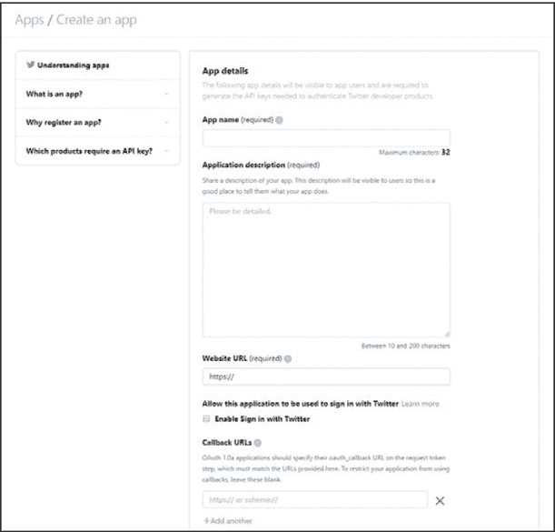

    **图 13-18** 为你的应用程序添加详细信息

    你还需要输入一个网站地址。如果你有自己的官方网站，请在这里输入。如果没有，你可以输入你的 Twitter 账户的网址，通常是 *[`www.twitter.com/your_user_name/`](https://www.twitter.com/your_user_name/)*。

    确保取消选择“启用使用 Twitter 登录”选项，跳过其他 URL 和网站提示。同时，保持回调 URL 为空，并通过勾选框同意开发者协议。点击 **创建你的 Twitter 应用程序** 按钮。

    在最后一个框中，输入你将如何使用这个应用的简短总结。我添加了关于社交媒体状态镜像黑客功能的简短描述。然后点击**创建**。接下来会出现两个选项；首先选择**权限** (图 13-19)。

    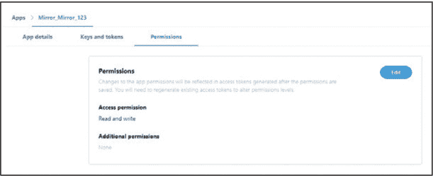

    **图 13-19** 选择你所需的访问权限。

    你需要选择你的应用所需的访问类型。*仅读取* 允许你从时间线中读取推文，而 *读取与写入* 允许你读取并发送自己的推文。选择**读取与写入**选项，尽管它可能已经是默认设置。

#### 创建访问密钥和令牌

最后的选项窗口会显示你的 API 密钥和访问令牌 (图 13-20)。这些使你的 Raspberry Pi 能够通过 Python 与 Twitter 互动。记录以下密钥和令牌：

**消费者密钥** 用于识别你和你的应用作为独特的用户

**消费者密钥** 将此作为密码使用

**访问令牌** 你将在程序中使用的代码

**访问令牌密钥** 与你的访问令牌一起使用，用于授权与 Twitter 应用的连接

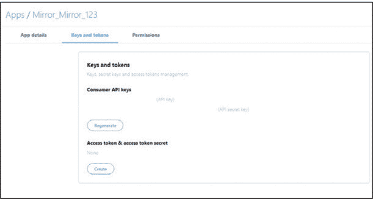

**图 13-20** 生成你的密钥和令牌。

要创建访问令牌和访问令牌密钥，点击**创建**。

保护这些密钥和令牌非常重要。如果你忘记了访问令牌或令牌密钥，或者它们被泄露了，你可以点击**重新生成**来创建一个新的令牌和 API 密钥集。记得你将在 Python 程序中使用这些密钥，所以一定要把它们记录在一个安全的地方。

你现在已经完成了 Twitter 应用的设置程序。你准备好使用 Raspberry Pi 发送你的第一条推文了。记住，你也可以将这些凭证用于其他项目。

### 使用应用编程你的 Raspberry Pi

在开始编写主程序之前，你将创建一些测试程序，以便你学习如何使用 Raspberry Pi 发送和读取推文。这是一项有用的技能，你可以在未来的其他项目中使用和调整！它也是一种简单快速的方法来测试配置是否正常工作。

#### 发送你的第一条推文

要发送你的第一条推文，你需要使用一个新的 Python 库 `tweepy`，它使你的程序能够与 Twitter 通信。

1.  **安装** **`tweepy`：** 启动你的 Raspberry Pi 并打开终端窗口。然后输入以下命令：

    ```
    pi@raspberrypi:- $ sudo pip3 install tweepy
    ```

1.  **发送推文：** 你将创建一个 Python 程序，将推文从你的 Raspberry Pi 发布到你的 Twitter 时间线。推文会立即出现在你的公共时间线上，所以要注意你发送的内容。打开你的 Python 编辑器，创建一个新文件并保存为 *Sending.py*，然后输入 示例 13-2 中的代码。

    ```
    ❶ import sys, subprocess, urllib, time, tweepy
    ❷ consumer_key= "xxxxxxxxxx"
    ❸ consumer_secret= "xxxxxxxxxxxxxxxxxxxxxxxxxxxxxxxxxxxx"
    ❹ access_token= "xxxxxxxxxxxxxxxxxxxxxxx"
    ❺ access_token_secret= "xxxxxxxxxxxxxxxxxxxxxxxxxxxxxxxxxxxxxx"
    ❻ auth = tweepy.OAuthHandler(consumer_key, consumer_secret)
    ❼ auth.set_access_token(access_token, access_token_secret)
    ❽ api = tweepy.API(auth) 
    ❾ api.update_status("Tweet sent from my Pi")
    print ("Tweet Sent")
    ```

    **示例 13-2** 使用 Raspberry Pi 编写并发布推文

    通过导入 `sys` 和 `subprocess` 模块来启动程序，`subprocess` 是一个用于处理 URL 的包。同时，导入 `urllib`，这是一个处理 URL 或网站地址的模块。这个 Python 模块允许你通过特定的 URL 将数据发送到你的 Twitter 账户并接收数据。接着导入 `time` 和 `tweepy` ❶。

    接下来，输入你的消费者密钥 ❷、消费者密钥密文 ❸、访问令牌 ❹ 和访问令牌密文 ❺。在 ❻、❼ 和 ❽ 处，分别授权你的 Twitter 账户、你的应用程序和 Raspberry Pi。这将允许你访问你的 Twitter 账户。

    使用函数 `api.update_status()` ❾ 发布你的消息；将消息输入在引号之间。然后打印一条确认推文已发送的消息。

1.  **运行程序：** 在运行程序之前，确保你已经输入了自己的消息；然后按 **F5** 保存并执行代码。推文会发布，记得检查你的 Twitter 时间线。

1.  **（可选）更改 Twitter 账号：** 如果你想使用其他用户的 Twitter 账号发送提及，只需在括号中添加他们的 Twitter 账号，然后再输入你的消息；例如，`api.update_status('@dan_aldred, Tweet sent from my Pi')`。就是这么简单。你不能发布相同的推文两次，因为 Twitter 会认为这是垃圾邮件。当你再次运行程序时，确保更改 ❾ 处的消息。

#### 阅读推文

要从 Twitter 时间线读取消息和提及，你需要下载你关注的 Twitter 用户的最新推文，并将它们打印在 Python 控制台窗口中。返回到你之前的程序 *Sending.py*，并将其保存为新文件名 *Timeline.py*。更新该文件，使其与 Listing 13-3 中的代码一致。

```
   import sys, subprocess, urllib, time, tweepy
   consumer_key= "xxxxxxxxxxxxxx"
   consumer_secret= "xxxxxxxxxxxxxxxxxxxxxxx"
   access_token= "xxxxxxxxxxxxxxxxxxxxxxxxxxxxxxxxxxxxxxxx"
   access_token_secret= "xxxxxxxxxxxxxxxxxxxx"
   auth = tweepy.OAuthHandler(consumer_key, consumer_secret)
   auth.set_access_token(access_token, access_token_secret)
   api = tweepy.API(auth)
❶ public_tweets = api.home_timeline()
❷ for tweet in public_tweets:
       ❸ try:
          ❹ print (tweet.text)
          ❺ time.sleep(2)
          ❻ print ("")
       ❼ except:
          ❽ print ("cannot display")
```

**LISTING 13-3** 从 Twitter 时间线读取推文

程序的第一部分，与之前的程序 *Sending.py* 相同，用于控制对 Twitter 的身份验证和授权。除非你更改了密钥和令牌的详细信息，否则无需调整这些行。

删除 `api = tweepy.API(auth)` 后面的所有代码行。（不用担心丢失 *Sending.py* 程序，因为你已经将其保存为不同的名称。）添加 ❶ 处的代码，它会从你的公共时间线拉取所有推文，并将它们存储在名为 `public_tweets` 的变量中。接下来，使用 `for` 循环 ❷ 遍历每一条推文。

然后使用 `try` 和 `except` 方法，它尝试运行程序的下一部分 ❸，如果不能执行，则运行 ❼ 和 ❽ 处的 `except` 代码。原因是有时候推文包含一些 Python 代码无法解释的符号和字符，例如表情符号。如果没有 ❸ 和 ❼ 处的代码，程序将崩溃并返回一条消息，提示无法显示文本。通过异常处理，你让代码在不能运行时执行其他操作，而不是崩溃。

在下一步中，打印每条推文 ❹。添加一个短暂的延迟 ❺，以便你有时间阅读每条帖子。你可能希望将此延迟时间设置为超过 2 秒（例如，设置为 5 秒）。

在打印下一条推文之前跳过一行 ❻。这样可以让阅读每条推文变得稍微容易一些。它还使得展示更加整洁，不会让你陷入大量的文本中。然后在❼处添加`except`语句，并添加一个信息来通知你无法显示该推文 ❽。将文件保存为*Timeline.py*并像之前一样运行程序。现在你有了一个 Python Twitter 时间轴阅读器（图 13-21）！

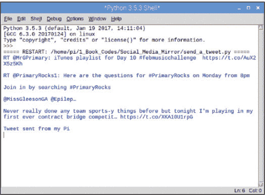

**图 13-21** 从你的时间轴打印推文

#### 自动流式传输推文

在运行*Timeline.py*程序时，你可能注意到它只下载了时间轴上的前 20 条推文。它还只打印在你开始运行程序之前发布的推文：它不会自动下载在程序运行期间收到的新推文。如果你想实时获取推文或检查某个关键字，这就不太有用了。

一种解决方案是使用`while`循环，每隔大约 20 秒请求一次时间轴上的推文。但是这个问题在于 Twitter 会限制你的下载次数，因为它希望阻止垃圾邮件机器人。每次请求并下载数据时，Twitter 都会记录这些信息。如果你每小时请求数据的次数过多，程序可能会超时，你需要等待一段时间才能再次请求时间轴数据。

更好的解决方案是创建一个类来流式传输推文。这大大减少了请求的数量，因此 Twitter 不会让你的程序超时。此方法还允许你在推文发布到时间轴时进行流式传输。每次新推文到达时，程序运行时，Python 会将其打印到 Shell 窗口。现在我们来创建一个类：

1.  **使用类流式传输推文：** 打开*Timeline.py*并将其保存为*Stream_Tweets.py*。编辑文件使其与列表 13-4 中的代码匹配。

    ```
       import sys, subprocess, urllib, time, tweepy
       consumer_key= "xxxxxxxxxxxxxx"
       consumer_secret= "xxxxxxxxxxxxxxxxxxxxxxx"
       access_token= "xxxxxxxxxxxxxxxxxxxxxxxxxxxxxxxxxxxxxxxx"
       access_token_secret= "xxxxxxxxxxxxxxxxxxxx"
       auth = tweepy.OAuthHandler(consumer_key, consumer_secret)
       auth.set_access_token(access_token, access_token_secret)
       api = tweepy.API(auth) 
    ❶ class Social_Media_Mirror_StreamListener(tweepy.StreamListener):
        ❷ def on_status(self, status):
            ❸ tweet_to_check = status.text
            ❹ does_the_tweet_contain_key_word = tweet_to_check.find("@Dan_Aldred")
            ❺ print (does_the_tweet_contain_key_word)

    ```

    **列表 13-4** 使用类流式传输推文

    与之前的程序一样，首先导入所需的模块，以及你的密钥和令牌，以便验证和授权你的 Twitter 账户和应用程序。

    然后创建一个新的类，命名为`Social_Media_Mirror_StreamListener`，该类使用 Python `tweepy`库的流式功能 ❶。创建一个函数来流式传输推文并检查触发词 ❷。代码`status.text`可以获取你时间轴上的所有推文。将这些推文存储在变量`tweet_to_check`中 ❸。

    接下来，使用 `.find()` 检查触发词。将这个方法与 `tweet_to_check` 变量结合，搜索每个流式推文中的触发词。在我的示例中，将触发词 *`@Dan_Aldred`* 替换为你自己的 Twitter 账号、关键词或一个用于触发 LED 灯的标签。程序接着检查关键词，如果找到它，就返回关键词在推文中的数字位置。如果推文中没有关键词，程序会返回值-1，并将其存储在 `does_the_tweet_contain_key_word` 变量中 ❹。你会在 ❺ 处打印关键词的位置值。如果推文中包含该关键词，返回值将为 0 或更大，并存储在第❹行的变量中。

1.  **搜索关键词：** 程序的以下部分检查推文中是否包含关键词。将 Listing 13-5 中的代码添加到你的程序中。

    ```
            ❶ if does_the_tweet_contain_key_word >= 0:
                ❷ who = status.user.screen_name # gets the user name
                ❸ print (who) # prints the user's name
                ❹ print ("LIGHTS ON") 
            ❺ else:
                ❻ print ("LIGHTS OFF")
                ❼ time.sleep(1)

    ```

    **LISTING 13-5** 检查推文流中的关键词

    首先，通过查看触发词的位置信息是否大于或等于 0 ❶，来检查传入的推文是否包含触发词。如果该值大于或等于 0，表示触发词在推文中的某个位置。例如，如果该值为 0，说明触发词位于推文的最开始。如果该值为 7，说明关键词位于推文的第 7 个位置。

    接下来，获取包含触发词的用户的 Twitter 账号 ❷，并打印出来 ❸。

    在最终的程序中，你还将使用关键词作为触发器来开启 LED 灯。通常这个操作会发生在程序的这一点，但由于你还没有添加 LED 的代码，所以此时只会添加一个测试语句来表示这一点 ❹。

    然后，在推文中没有找到触发词的情况下，添加响应代码。该响应会在值为-1 时触发。如果发生这种情况，你需要添加一个通知，表示灯光已关闭 ❺ ❻，然后稍作暂停，约 1 秒钟 ❼。这就完成了流式处理程序的主要功能。

1.  **启动流式处理：** 最后一步是启动流式处理。将 Listing 13-6 中的代码添加到你的程序中。

    ```
    ❶ myStreamListener = Social_Media_Mirror_StreamListener()
    ❷ myStream = tweepy.Stream(auth = api.auth, listener=myStreamListener)
    ❸ myStream.filter(follow=["xxxxxxxxx"])

    ```

    **LISTING 13-6** 启动流式处理

    创建一个名为 `myStreamListener` 的变量，用于组合并保存你对 Twitter 应用的授权信息以及之前步骤中编写的 `Social_Media_Mirror_StreamListener()` 函数 ❶。然后将这些功能组合在一起，认证你的凭据并部署流 ❷。

    要流式获取正确 Twitter 账号的时间线，你需要添加 Twitter 账号的 ID 号码 ❸。你可以通过打开 *[`tweeterid.com/`](https://tweeterid.com/)* 并输入你想要追踪的账号名来找到这个号码（见图 13-22）。将返回的 ID 号放入第❸行。你可以添加自己的账号，以确保接收到提到你的消息和提及；你也可以搜索你喜欢的名人账号、朋友和家人，或者某个趋势事件的标签。

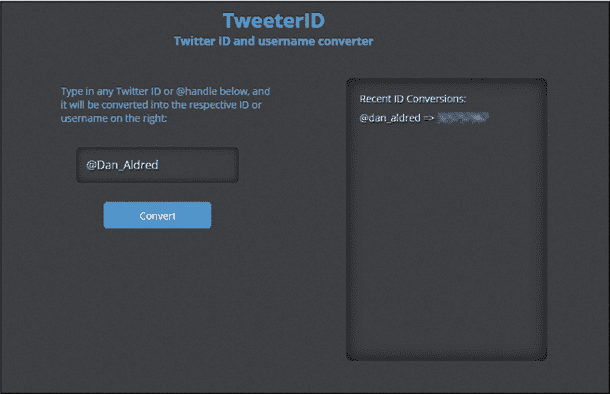

**FIGURE 13-22** 查找 Twitter 账户的 ID 号

保存并运行你的*Stream_Tweets.py*程序。你可以通过在推文中提到你的关键词来测试它（或者让朋友来做）。尝试将关键词放在不同的位置，看看程序的反应。然后进入代码的最后一部分，我们将把这个程序与 LED 灯和音频结合，完成社交媒体状态镜像。

### 最终程序

为了完成项目，你将把包含关键词的推文流代码与使 LED 闪烁并朗读推文的代码结合起来。

#### 启动最终程序

开始一个新的程序文件，并将其保存为*Social_Media_Mirror.py*。此代码结合了你在 Listings 13-4 和 13-5 中使用的代码，完成程序。

```
   import sys, subprocess, urllib, time, tweepy
❶ from espeak import espeak
❷ from gpiozero import LED 
   consumer_key= "xxxxxxxxxxxxx"
   consumer_secret= "xxxxxxxxxxxxxxxx"
   access_token= "xxxxxxxxxxxxxxxxxxxxxxx"
   access_token_secret= "xxxxxxxxxxxxxxxxxx"
   auth = tweepy.OAuthHandler(consumer_key, consumer_secret)
   auth.set_access_token(access_token, access_token_secret)
   api = tweepy.API(auth)
❸ led = LED(3)
❹ led.off() 
```

**LISTING 13-7** 启动最终程序

导入`espeak()`函数❶，用它来朗读推文。然后从`gpiozero`库中导入`LED`类❷。你使用它来打开或关闭 GPIO 引脚，从而控制 LED 的电池电源。将 GPIO 3 引脚分配给 LED ❸。使用这个引脚来控制灯的开关。接下来，关闭 LED❹，这样每次程序重置时灯不会亮起。

#### 添加主程序代码

现在你将添加主程序代码*Social_Media_Mirror.py*。

```
class Social_Media_Mirror_StreamListener(tweepy.StreamListener):
    def on_status(self, status): 
     ❶ led.off() 
     ❷ try:
           print(status.text)
        except:
            pass
            print ("Cannot display Tweet")
            led.off()   
        tweet_to_check = status.text # checks the tweet 
        does_the_tweet_contain_key_word = tweet_to_check.find("@Dan_Aldred")
        # replace with your Twitter user name or a keyword
        print (does_the_tweet_contain_key_word) 
        if does_the_tweet_contain_key_word >= 0: 
            who = status.user.screen_name # gets the user name
            print (who) # prints the user's name 
         ❸ # flash the lights 
            led.on()
            time.sleep(0.6)
            led.off()
            time.sleep(0.5)
            led.on()
            time.sleep(0.4)
            led.off()
            time.sleep(0.3)
            led.on()
            time.sleep(0.2)
            led.off()
            time.sleep(0.1)
            led.on()
            time.sleep(0.05)

            led.on()
            print ("LIGHTS ON")
         ❹ espeak.synth(who)
         ❺ espeak.synth("said")
         ❻ time.sleep(1)
         ❼ espeak.synth(status.text) # reads out the tweet
         ❽ time.sleep(4)
         ❾ led.off() 
     ❿ else:
            print ("LIGHTS OFF")
            led.off()
            time.sleep(1) 
```

**LISTING 13-8** 添加代码使 LED 闪烁

再次使用❶处的代码关闭 LED 灯，然后添加`try`和`except`方法❷（如你在 Listing 13-3 中所做的），以防止推文中包含无法作为文本显示的未知字符、符号或表情符号时程序崩溃。接下来，点亮 LED 灯，等待几秒钟，然后关闭它们。❸处的代码仅为示例，能够使灯光闪烁更快，直到保持常亮。你可以根据自己的喜好调整这段代码：让灯保持点亮 5 秒钟，或者只闪烁一次。在 Listing 13-8 中的程序中，LED 在朗读消息时保持点亮。通过更改`time.sleep()`中的值❸来改变 LED 的模式。例如，`time.sleep(10)`会让 LED 保持点亮 10 秒钟，然后关闭。

使用`espeak.synth()`函数读取发送包含你 Twitter 名字的推文的 Twitter 用户的名字 ❹。将此代码与单词`said` ❺结合，这样当程序读取一条推文（比如我的推文）时，它会首先宣布：“@Dan_Aldred said”。在❻处添加一个小延迟。然后让程序读取推文 ❼，再添加最后的延迟 ❽并关闭 LED 灯 ❾。关闭灯光表示消息已被接收并转发。

如果你收到一条没有包含你关键词的推文，闪烁一次 LED 来表示你的时间线有新帖子，但并不是一个具体的感兴趣的消息❿。然后添加最后一行代码，授权你的 Twitter 凭证，并实时流式传输你的 Twitter 时间线中的推文。你的程序会检查这些推文是否包含关键词，并以设定的方式做出响应。

添加 Listing 13-9 中的结束行代码，开始流式传输并完成主程序代码。

```
myStreamListener = Social_Media_Mirror_StreamListener()
myStream = tweepy.Stream(auth = api.auth, listener=myStreamListener)
myStream.filter(follow=["xxxxxxxxx"]) 
```

**LISTING 13-9** 结束程序

保存 *Social_Media_Mirror.py* 代码并运行它。要进行测试，可以在另一台设备上加载你的 Twitter 动态并在推文中提到你的 Twitter 用户名或关键词。观察 LED 灯在收到新消息时闪烁，然后听到消息被朗读出来。联系你的朋友，让他们也试试看。

记住，你还可以将你的 Twitter ID 替换为你喜欢的 Twitter 账户或用户的 ID。使用网站 *[`tweeterid.com/`](https://tweeterid.com/)* 来查找 ID 号码。你也可以将 ID 代码替换为像 *No Starch* 这样的关键字。在测试程序时，记住如果你发送相同的消息重复内容，Twitter 会将其视为垃圾信息，所以一定要更改你的测试词。

#### 自动启动 Twitter 流

一旦你对项目感到满意，你可以设置程序在树莓派开机时自动运行。你可以通过配置一个 *crontab* 文件来实现，就像在本书的其他项目中做的那样。

打开终端并输入以下命令来打开 cron 控制台：

```
pi@raspberrypi:- $ sudo crontab -e
```

控制台将为你提供三种编辑 *crontab* 文件的方法。选择选项 2 并按 ENTER，使用 nano 文本编辑器打开 *crontab* 文件。

滚动到 crontab 文件的底部，找到空白区域。然后添加以下代码行：

```
@reboot sudo python3   /home/pi/name_of_your_program.py &
```

该命令表示每次树莓派重新启动时，都应该以超级用户模式运行 Python，打开 *home/pi/* 文件夹，并执行你的程序。将 *name_of_your_program.py* 替换为你保存程序时的名称。

代码行末尾的 `&` 告诉你的程序在后台运行，这样你就可以同时进行其他任务。

一旦你检查了命令详情，并确认它们是正确的，按 CTRL-X 保存并退出 *crontab* 文件。现在，每次你打开或重新启动树莓派时，*crontab* 文件都会运行，启动 *Social_Media_Mirror.py* 程序，你的社交媒体状态镜像就绪。

如果你想停止程序的自动运行，可以通过在终端中输入以下命令再次打开 *crontab* 文件：

```
pi@raspberrypi:- $ crontab -e
```

然后删除你添加的代码行。保存文件并重新启动。

### 汇总所有内容

现在所有硬件都已正常工作，你可以将 LED 灯添加到镜子上——或者其他你选择的任何物体上。（你也可以制作一个社交媒体架。）确保扬声器和 LED 灯已连接好，然后将电池包附着在镜子背面（图 13-23）。你可以将它粘贴在框架的背面，或者使用双面胶带。记得将电池仓朝外放置，这样在需要时可以更换电池。然后挂上你的镜子，等待消息传入。

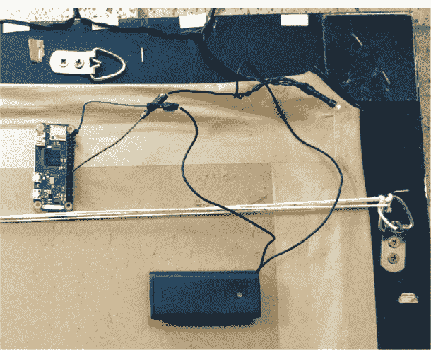

**图 13-23** 将 Pi 和电池包连接到镜子背面。

### 项目总结

为了进一步开发你的项目，尝试以下一个或多个方法：

+   通过改变时间来更改 LED 闪烁模式。

+   添加一段音乐或庆祝的 MP3 文件，在每条推文朗读之前播放。

+   将该项目与第三章中的粘合光结合，或者接入另一组 LED 灯，使其响应特定的第二触发词。
