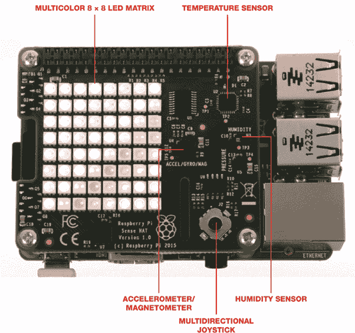
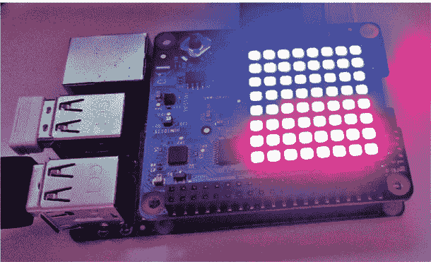
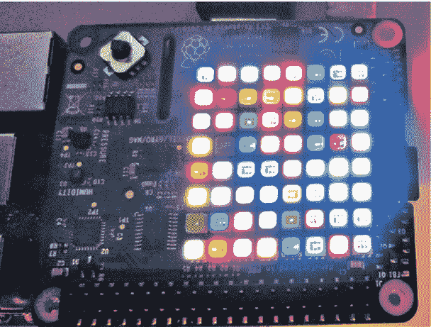
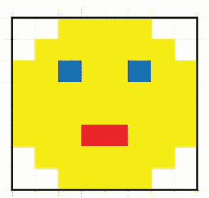
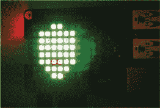
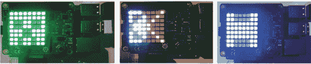
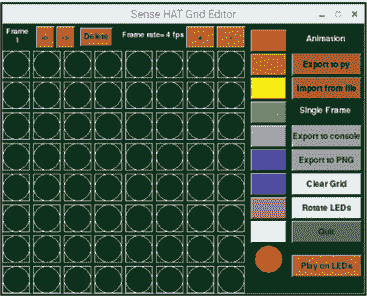
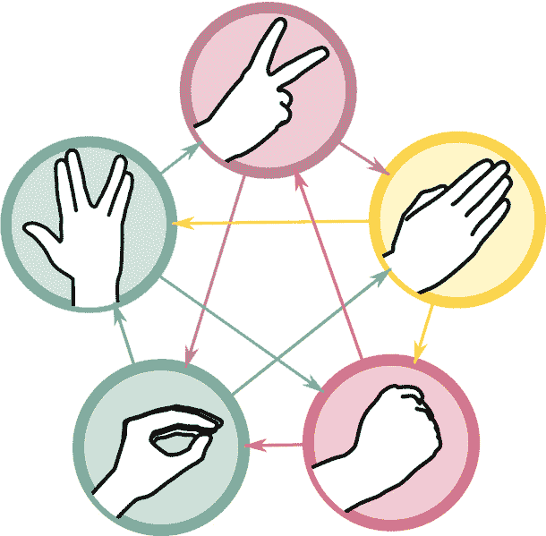
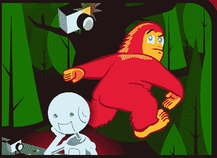

## 第十四章：使用 Sense HAT 进行计算机游戏

在本书的最终项目中，你将使用 Sense HAT 硬件和 Python 代码，制作经典游戏石头、剪子、布的一个版本——不过有所改动。你将编程一个五彩斑斓的 LED 矩阵和一个摇杆，为你的程序添加游戏显示和控制功能。

2015 年底，欧洲航天局（ESA）向国际空间站（ISS）发送了一枚补给火箭。其中包括两台 Raspberry Pi 计算机，每台都安装了一个特殊的附加板，名为 *Astro Pi*。这些设备是为英国宇航员蒂姆·皮克上校的首次访问做准备的。每个 Astro Pi 都配备了硬件和传感器阵列，并拥有一个 8 × 8 的 LED 显示屏——非常适合用来采集和显示诸如温度、压力、加速度和磁场强度等读数。

此前，在 2015 年夏季，Raspberry Pi 基金会举办了一项比赛，鼓励孩子们为 Astro Pi 编写程序或实验，计划在国际空间站上运行。在皮克的驻留期间，Astro Pi 运行了获胜者设计的预加载实验。Astro Pi 将一直留在国际空间站直到 2021 年，如果你符合参赛资格，仍然可以参加比赛。更多细节请见 *[`astro-pi.org/`](https://astro-pi.org/)*。谁知道呢，也许你会受到启发，编写自己的程序，在国际空间站上运行，见图 14-1。

2015 年 12 月，Astro Pi 开始面向公众销售，并更名为 Sense HAT。你今天可以购买的 Sense HAT 硬件和传感器与 Astro Pi 完全相同。


**图 14-1** 国际空间站

Sense HAT 的 LED 显示屏可以作为屏幕使用，使其成为制作游戏的完美工具。在本章中，你将用它编程制作经典的石头、剪子、布游戏的变种。这一版本——称为石头、剪子、布、蜥蜴、斯波克——为游戏玩法带来了新的可能性。

不过，首先你将查看一些简单的程序，以便探索 Sense HAT 的关键特性。你将滚动文本，制作一个互动的温度显示，并使用一个叫做数组的工具来绘制基本图像。这些技能也可以独立使用，你可以将它们适应到自己的项目中。

### 你将需要的工具

这是你构建这个游戏项目所需的工具：

+   Raspberry Pi 3 或 4（建议使用）

+   Sense HAT

+   USB 便携电池（可选）

+   小型十字螺丝刀

### 什么是 Sense HAT？

让我们来看看 Sense HAT 的传感器和硬件，如图 14-2 所示。



**图 14-2** Sense HAT 及其组件

Sense HAT 的部件如下：

**多彩 8 × 8 LED 矩阵** 你可以使用这 64 个可编程 LED 灯来滚动消息，或者显示传感器数据、动画或简单的游戏。

**温度传感器** 这个内置传感器在 0-65°C（32-150°F）范围内的准确度约为 2°C（约 4°F）。它可以用于测量周围环境的温度。

**磁力计** 通过检测磁场强度来像指南针一样工作。你可以使用它的读数来测量磁场并找到相对于北方的方向。

**加速度计** 测量上下和横向的加速度。你可以利用它来跟踪运动，或将其改造为游戏控制器。

**多方向摇杆** 可以用于在游戏中移动角色，或作为选项的选择工具。

### 开始使用 Sense HAT

设置 Sense HAT 非常简单，因为它是专为树莓派设计的。将 Sense HAT 插入 GPIO 引脚，并将其按紧固定到位。然后，取下树莓派的偏移安装架（这些应该随 Sense HAT 一起提供），并将其固定到 Sense HAT 上。安装这些支架可以防止在使用摇杆时板子移动。接下来，插入电源并启动树莓派。

接下来，我们将查看一些基本程序，展示 Sense HAT 的各种功能和能力。

#### 在 Sense HAT 上滚动文本

让我们编写第一个程序，滚动显示一条信息。

##### 使文本滚动

打开 Python 编辑器，启动一个新文件，并在 Listing 14-1 中输入程序代码。

```
❶ from sense_hat import SenseHat
   sense = SenseHat()
❷ sense.show_message("My name is Ada")

```

**Listing 14-1** 滚动显示信息

首先导入 `SenseHat` 模块 ❶。然后创建一行代码 ❷，负责滚动显示消息。将引号中的文本替换为你自己的消息，保存文件为 *scroll_text.py*，并按 **F5** 运行。你的信息将会滚动显示在 LED 上。

##### 更改文本的颜色

你可以通过更改文本的红色、绿色和蓝色（RGB）值来更改文本的颜色。你可以使用 0 到 255 之间的值将红色、绿色和蓝色的任意组合结合起来，其中 0 表示无颜色，255 表示最大颜色量，从而创建出一种整体颜色。

将 Listing 14-1 中的最后一行代码替换为以下内容：

```
sense.show_message("Hi, this is Ada!", text_colour=[255, 0, 0])
```

这段代码将颜色设置为最大红色值（255）和最小绿色与蓝色值（0），从而将文本颜色更改为红色。像之前一样保存并运行程序代码。

尝试其他颜色变体。更改代码行末尾的颜色值，然后运行程序查看颜色变化。下表列出了你可以使用的颜色值。

| **颜色** | **RGB 值** |
| --- | --- |
| 粉色 | 255, 102, 255 |
| 黄色 | 255, 255, 0 |
| 橙色 | 255, 128, 0 |
| 紫色 | 102, 0, 102 |
| 浅蓝色 | 0, 255, 255 |

#### 测量温度

现在，你将结合滚动文本的代码和 Sense HAT 的温度传感器，显示周围环境的温度。打开一个新的 Python 文件，并输入清单 14-2 中的代码。

```
   from sense_hat import SenseHat
   sense = SenseHat()
❶ temp = sense.get_temperature()
❷ print ("Temperature: %s C" % temp)
❸ sense.show_message("Temp: %s C" % temp)
```

**清单 14-2** 在 LED 显示屏上滚动温度

同样，首先导入`SenseHat`模块。然后命令温度传感器进行读取，并将此值存储在名为`temp` ❶的变量中。接下来，打印出该值 ❷。在最后一行，使用与清单 14-1 中相同的代码来滚动文本，但将消息改为来自`temp`变量的值 ❸。

现在温度（以摄氏度为单位）将滚动显示在 LED 屏幕上。如果温度看起来比较高，那是因为传感器靠近树莓派的 CPU，CPU 会发热。因此，读取的温度可能比实际环境温度高出 5 到 6 摄氏度。如果你想要更准确的温度读取，可以通过将第❶行替换为**`temp = sense.get_temperature() - 6`**来减去 6 度。

#### 制作实时温度显示

到目前为止，我们的程序仅在执行程序的瞬间读取一次温度。如果你想监控温度变化，这种方式就不太实用了，因此你需要编辑代码，使其持续更新温度读数。你还将利用 LED 来制作虚拟温度计，而不是将温度表示为数字。你将通过将温度读取值分配给多个像素，创建一个 LED 温度计。打开一个新的 Python 文件，复制清单 14-3 中的代码，这段程序演示了如何实现这个功能。

```
   from sense_hat import SenseHat
   sense = SenseHat()
❶ red = (255, 0, 0)
❷ blue = (0, 0, 255) 
❸ while True:
    ❹ temp = sense.temp
    ❺ print (temp)
    ❻ pixels = [red if i < temp else blue for i in range(64)]
    ❼ sense.set_pixels(pixels)
```

**清单 14-3** 制作更新的虚拟温度计

通过导入`SenseHat`模块来启动程序。然后为温度显示分配两种颜色。在这个示例中，使用`red` ❶表示当前温度，使用`blue` ❷表示其余的温度范围。

接下来，创建一个`while`循环，确保程序重复运行，并不断更新温度 ❸。和之前一样，读取温度并将值存储在`temp` ❹中，然后打印出该值 ❺。

计算应该有多少个 LED 显示红色，多少个 LED 显示蓝色 ❻。每个 LED 代表一个温度单位，因此如果温度是 26°C，你希望前 26 个 LED 是红色的，其余的 LED 是蓝色的（蓝色 LED 表示温度为 27°C 或更高）。代码中指示，如果 LED 的编号大于温度，则应显示蓝色；如果编号小于或等于温度，则显示红色。然后将这些颜色值写入 LED 显示屏 ❼。

随着温度的变化，循环程序将重新计算红色和蓝色 LED 的组合。温度越高，红色 LED 越多；温度越低，蓝色 LED 越多。图 14-3 展示了 LED 温度计。



**图 14-3** Sense HAT 实时温度传感器

将程序保存为 *temp.py* 并运行。尝试通过将 Sense HAT 安全地放置在热源附近或将其放入冰箱几分钟来调整温度！

#### 构建一个指南针

Sense HAT 配备了一个内置的磁力计，你可以用它作为指南针，计算 Sense HAT 相对于磁北的位置。打开一个新的 Python 文件，并尝试使用清单 14-4 中的代码。

```
   from sense_hat import SenseHat
   sense = SenseHat()
   import time
   while True:
❶ north = sense.get_compass()
❷ print ("North: %s" % north)
❸ time.sleep(1)
```

**清单 14-4** 寻找磁北

添加前三行代码，这是标准的导入和赋值操作。然后创建一个 `while` 循环，使程序不断重复；这样，像在温度计项目中一样，Sense HAT 会不断更新其位置。接下来，从磁力计 ❶ 读取数据，并将其存储在名为 `north` 的变量中。打印出该值 ❷，然后添加一个 1 秒钟的暂停 ❸，以便在下次读取前让你有时间稳定位置。

保存并运行程序。移动 Sense HAT，观察读数的变化。

#### 制作一个神奇的闪光屏幕

这个来自树莓派基金会的简单程序将 Sense HAT LED 显示屏变成了一个闪亮的色彩墙，如图 14-4 所示。它选择一个随机 LED 并分配一个随机颜色，点亮该 LED，然后暂停十分之一秒后，选择并点亮另一个随机 LED，并赋予它一个随机颜色。这个模式不断循环，创造出闪光的效果。把一个透明物体放在顶部，你就能拥有自己的氛围灯。



**图 14-4** Sense HAT 闪光效果。

打开 Python 并保存一个新文件，命名为 *sparkles.py*。输入清单 14-5 中的代码。

```
   from sense_hat import SenseHat
❶ from random import randint
❷ from time import sleep  
   sense = SenseHat() 
❸ while True:
   ❹ x = randint(0, 7)
   ❺ y = randint(0, 7)
   ❻ r = randint(0, 255)
   ❼ g = randint(0, 255)
   ❽ b = randint(0, 255)
   ❾ sense.set_pixel(x, y, r, g, b)
   ❿ sleep(0.01)

```

**清单 14-5** 选择随机的 LED 和颜色

通过导入 `SenseHat` 模块开始程序。然后从 `random` 模块导入 `randint()` 函数 ❶。`randint()` 函数是 *随机整数* 的缩写，用于在程序中选择一个随机整数（即非小数数字），它将为你提供随机的颜色选择。接下来，导入 `sleep()` 函数来给程序添加一个短暂的延迟 ❷。

创建一个 `while True` 循环，使程序不断选择新的随机 LED，并为它们分配新的随机颜色，从而产生闪光效果 ❸。在这个 `while True` 循环中，构建随机 LED 的细节。首先，LED 的位置是通过为显示屏上的 x 和 y 坐标选择随机整数来确定的。x 位置是一个介于 0 和 7 之间的随机值 ❹，并将其存储在一个名为 `x` 的变量中。y 值也是介于 0 和 7 之间的随机值，存储在名为 `y` 的变量中 ❺。尽管你有八个 LED 横向和纵向排列，但在编程中我们从零开始编号，因此第一个 LED 位置是 0，第二个是位置 1。这意味着第八个 LED 是编号 7。

第二步，为红色、绿色和蓝色创建变量，程序将随机组合这些颜色，生成 LED 的随机颜色。将 RGB 值存储在变量 `r`、`g` 和 `b` 中 ❻ ❼ ❽。

最后，将所有这些值合并并使用 `sense.set_pixel()` ❾ 写入 LED，后跟 `x`、`y`、`r`、`g` 和 `b` 变量。当程序运行时，它会为这五个变量选择一个随机值。最后添加一个小的暂停 ❿，然后程序进入循环。保存并运行程序，享受这场灯光秀吧！

#### 使用 LED 显示屏创建图像

图像由像素组成，你可以将它们看作是微小的彩色点。如果你把每个 Sense HAT 显示屏上的 LED 当作一个像素，你可以创建一个 8 × 8 像素的图像，如 图 14-5 所示。



**图 14-5** 8 × 8 像素绘图

在这个程序中，你将使用一个数组来保存每个 LED 的位置和颜色。*数组*是一个使用多行的列表。像列表一样，数组用于保存数据，可以是数字、字符串或符号。例如，`shopping = ['eggs', 'chocolate', 'bread']` 是一个列表。你将列表用方括号 `[ ]` 括起来，并可以通过引用索引编号来选择列表中的任何项目。如你所知，第一个位置的项目（eggs）是 0，接下来的项目（chocolate）是 1，然后是 2，以此类推。

你的数组将包含 64 个条目，每个条目对应一个 LED。这样，你就可以单独控制每个 LED，开关它并设置颜色。为简单起见，数组被分为八行，每行包含八个条目，模仿了 LED 显示屏的布局。创建一个新的 Python 文件并保存为 *face.py*。输入 清单 14-6 中的程序代码，创建一个笑脸表情符号。

```
   from sense_hat import SenseHat
   sense = SenseHat()
❶ R = [255, 0, 0] # Red
❷ O = [0, 0, 0] # Black or off
❸ B = [0, 0, 255] # Blue
❹ Y = [255, 255, 0] # Yellow 
❺ face = [
❻ O, O, O, Y, Y, O, O, O,
   O, Y, Y, Y, Y, Y, Y, O,
   O, Y, B, Y, Y, B, Y, O,
   O, Y, Y, Y, Y, Y, Y, O,
   O, Y, Y, Y, Y, Y, Y, O,
   O, Y, Y, R, R, Y, Y, O,
   O, O, Y, Y, Y, Y, O, O,
   O, O, O, Y, Y, O, O, O
   ] 
❼ sense.set_pixels(face)
```

**清单 14-6** 绘制一个笑脸表情符号

通过导入 `SenseHat` 模块来启动程序。然后将 RGB 值分配给四个颜色变量：`R` 代表红色 ❶，`O` 代表黑色 ❷，`B` 代表蓝色 ❸，`Y` 代表黄色 ❹。为了创建我们所见的黑色，你需要通过将 RGB 设置为 0, 0, 0 来关闭所有颜色 ❷。当然，你也可以调整 RGB 值，创建你自己的自定义颜色。

接下来，创建一个名为 `face` ❺ 的数组，用来保存每个 LED 的颜色和位置。用适当的颜色变量 ❻ 填充数组。每行列表包含八个条目。例如，输入 `B, B, B, B, B, B, B, B` 会将 LED 显示屏的顶部一行设置为蓝色，因为变量 `B` 代表蓝色的 RGB 值。

请注意，数组的最后一行没有以逗号结尾。这表示数组的结束，Python 应该不再期待更多的值。用一个右方括号来关闭数组。

最后，告诉 Python 将数组中的元素写入 LED 显示屏 ❼。这将点亮每个 LED，并赋予其相应的颜色，从而构建出图像。

保存并运行程序。您将在 Sense HAT 显示器上看到一个微笑的脸，如图 14-6 所示。



**图 14-6** 微笑脸显示在 Sense HAT 上

尝试创建另一个图形——也许是一个动物、汽车、飞机或树。你可能会发现提前通过在类似的 8 × 8 方格中填充方块来绘制图像会很有帮助。

图 14-7 显示了一些示例。你能猜出它们是什么吗？



**图 14-7** 尝试在 Sense HAT 上显示这些图标。

#### 使用 Grid Draw 程序创建图像

使用数组创建图像虽然很有趣，但也可能很耗时。如果您试图精确地绘制某个图形，使用数组可能会让人沮丧。创建图像的另一种方法是使用 8x8GridDraw，这是一个交互式程序，旨在使在 Sense HAT 上创建图像变得更加容易。

安装后，8x8GridDraw 程序允许您执行以下操作：

+   在 8 × 8 的网格上创建图像并直接将其写入 LED 显示器。

+   从九种颜色中进行选择。

+   将图像导出为一组代码，您可以将其添加到您的 Python 程序中。

+   导出并保存图像为 PNG 文件。

+   在 LED 显示器上旋转图像。

+   添加新帧以创建简单的动画。

这个项目会比您在本章中完成的那些稍微复杂一些，所以我会一步一步地指导您：

1.  **安装软件：** 要安装该软件，请打开终端窗口并输入以下命令：

    ```
    pi@raspberrypi:- $ sudo pip3 install pypng
    ```

    这将安装软件库，使您能够将图像导出并保存为一个小的 8 × 8 像素 PNG 文件。

    接下来，输入以下命令安装主程序：

    ```
    pi@raspberrypi:- $ git clone https://github.com/topshed/RPi_8x8GridDraw
    ```

    这会将所需文件下载到一个新文件夹中。完成后，您将拥有一个新文件夹，其中包含多个与 8x8GridDraw 相关的程序。

1.  **创建图像：** 让我们尝试创建一个图像。首先，您需要启动程序。返回终端并输入以下命令：

    ```
    pi@raspberrypi:- $ cd RPi_8x8GridDraw
    ```

    该命令导航到 8x8Grid-Draw 程序文件夹。要运行程序，请输入以下命令：

    ```
    pi@raspberrypi:- $ python3 8x8grid-sense.py
    ```

    这将加载主窗口，如图 14-8 所示。

    

    **图 14-8** Sense HAT 网格编辑器

    点击网格上的圆圈将填充周围的方块颜色。要更改颜色，从右侧选择一个新的颜色。要关闭 LED，双击该方块，它将恢复到原始的透明轮廓。您通过填充特定方块并选择颜色来绘制图像。继续尝试创建一个简单的图像吧。

1.  **显示图像：** 一旦您创建了图像（如图 14-9 中的树），您可以将图像写入 Sense HAT。找到并点击**LED 上播放**按钮，您的图像将出现在 Sense HAT 的 LED 上。快来看看吧！！Image

    **图 14-9** 点击**LED 上播放**按钮，将您的绘图显示在 Sense HAT 上。

1.  **导出图像：** 完成图像后，你可以导出它。你可以将其导出为代码，然后将其添加到其他程序中，但导出为 PNG 格式要简单得多，所以现在你就会这么做。

    点击图形用户界面上的**导出为 PNG**按钮，并将文件保存在*RPi_8 x 8 GridDraw*文件夹中（图 14-10）。要加载该图像，必须将其与程序代码位于同一文件夹中，因此你可能需要将图像从该文件夹复制到保存 Python 程序代码的文件夹中。

    

    **图 14-10** 将文件导出为 PNG 格式会将其保存在*RPi_8x8 GridDraw*文件夹中。

    这将生成一个小的 8 × 8 PNG 文件，你可以使用以下代码将其加载到 Sense HAT 中：

    ```
    sense.load_image("name_of_your_file.png")
    ```

现在你可以创建图像了，你具备了编写石头、剪刀、布、蜥蜴、斯波克游戏所需的一切。

### 构建石头、剪刀、布、蜥蜴、斯波克游戏

**注意**

*这个游戏的变种最初由 Sam Kass 和 Karen Bryla 创建（* [`www.samkass.com/theories/rpssl.html`](http://www.samkass.com/theories/rpssl.html)）*。

你可能已经熟悉了石头、剪刀、布。你和对手通过用手形成一块石头、一张纸或者一把剪刀来玩，每个物品击败—并被—另外的物品击败。原始游戏的问题是，结果太容易预测（因为只有三种可能的结果，除了平局）。在热门电视剧《生活大爆炸》的第二季中，角色谢尔顿通过使用一种替代版本将经典游戏变得更加刺激和具有挑战性，该版本将斯波克和蜥蜴添加到原本的三种选择中。

要表示斯波克，你可以使用来自电视剧*星际迷航*的瓦肯手势。要表示蜥蜴，你可以将手做成类似袜子木偶的嘴巴形状。

想知道它们如何工作吗？斯波克击败剪刀并蒸发石头。然而，他会被蜥蜴毒死，并被纸张驳斥。蜥蜴毒死斯波克并吃掉纸张，但它会被石头压碎并被剪刀砍头。太血腥了！添加这些选项创造了更多可能的组合，使整个游戏更刺激，且不易预测。图 14-11 展示了所有手势（箭头指向被给定箭头起点的手势所击败的动作）。

在我们版本的游戏 RPSLS 中，玩家将通过使用 Sense HAT 的摇杆滚动五个图像中的一个来选择其中一个选项。玩家按下摇杆，就像按下按钮一样来选择一个选项。然后，树莓派会随机选择一个选项。游戏将比较两个选项并选出一个胜者。然后，玩家可以选择继续玩下一局或者退出游戏。



**图 14-11** 如何玩石头、剪刀、布、蜥蜴、斯波克

首先，你需要为每个选项准备一张 8 × 8 的 PNG 图像。你可以自己制作这些图像，或者从 *[`www.nostarch.com/raspiforkids/`](https://www.nostarch.com/raspiforkids/)* 下载本章使用的示例图像，并将它们保存在你为这个项目使用的文件夹中。请注意，如果你自己创建图像，你需要将它们保存为 *0.png*、*1.png*、*2.png*、*3.png* 和 *4.png*。这些是程序将要查找的图像文件名。

#### 导入模块并创建变量

打开你的 Python 编辑器，添加 Listing 14-7 中的代码。将程序保存为 *RPSLS.py*，并确保程序文件保存在与图像相同的文件夹中，否则程序将无法找到它们。

```
❶ from sense_hat import SenseHat
   import random
   import time
❷ global playersChoice
❸ global count
❹ global computer_choice
❺ gameRunning = True
```

**LISTING 14-7** 添加模块和全局变量

通过导入 `SenseHat` 模块 ❶ 开始程序，该模块使玩家能够控制摇杆、滚动文本并在 LED 矩阵上显示图像。接着导入 `random` 模块，以便树莓派能够选择一个随机数，并导入 `time` 模块来添加短暂的暂停。

接下来，设置三个全局变量，程序中的任何地方都可以访问这些变量（与定义在特定函数内部的局部变量不同，局部变量只能在该函数内访问）。

第一个变量 ❷ 存储玩家选择的石头、剪刀、布、蜥蜴或斯波克。你使用第二个变量 ❸ 来存储树莓派做出选择的时间。这个时间将是随机的，制造出树莓派花时间选择的假象。接下来使用第三个变量 ❹ 来存储树莓派的选择，以便稍后使用。最后，创建一个名为 `gameRunning` ❺ 的变量，用于保存游戏的状态。值为 `True` 表示游戏正在进行。

#### 准备游戏

Listing 14-8 中的代码为 RPSLS 游戏准备了 Sense HAT。

```
   # Prepare Sense Hat
❶ sense = SenseHat()
❷ sense.load_image("0.png")
❸ sense.low_light = True # Save your eyes!
❹ playersChoice = 0

```

**LISTING 14-8** 创建初始游戏设置

首先，初始化 Sense HAT ❶ 并加载游戏的第一张图像 ❷。然后调低 LED 的亮度 ❸。如果 LED 太亮，这个步骤很有用；较暗的灯光对眼睛更友好。你可以稍后根据自己的喜好调整亮度。

在游戏开始时，将 `playersChoice` 设置为 `0` ❹。这是玩家可以选择的列表中的第一个选项。请记住，在编程中，列表中的第一个选项是位置 `0`。`PlayersChoice` 变量将保存一个介于 `0` 和 `4` 之间的数字，表示玩家的选择：`0` 代表石头，`1` 代表斯波克，`2` 代表布，`3` 代表蜥蜴，`4` 代表剪刀。游戏开始时，玩家可以通过摇杆浏览选项来选择一个。

#### 设置玩家选择

现在，你将创建一个函数，将玩家的选择从数字转换为对应的石头、剪刀、布、蜥蜴或斯波克图像。输入 Listing 14-9 中的代码。

```
   # Converts the Number into the choice i.e. lizard, spock, etc.
❶ def number_to_name(number):
       if number == 0:
           return "Rock"
    ❷ elif number == 1:
           return "Spock"
       elif number == 2:
           return "Paper"
       elif number == 3:
           return "Lizard"
       elif number == 4:
           return "Scissors" 
```

**LISTING 14-9** 设置玩家的选择

创建并命名函数❶，该函数检查玩家通过操纵杆选择了哪个选项（选项存储为一个数字，然后将该数字转换为选项的名称）。

这个函数使用条件判断❷来检查每个数字，然后为每个被选中的数字分配对应的选项名称。第一个条件判断检查是否选择了值为`0`的选项，如果是，则返回`Rock`（石头）。如果没有选择`0`，程序会检查是否选择了`1`。如果选择了`1`，程序返回`Spock`（斯波克），如果没有选择`1`，程序会继续检查数字`2`。程序会一直继续检查直到所有可能的选择都被检查完。

#### 选择一个对象

程序的下一部分创建了一个包含主要游戏机制的函数。玩家将使用 Sense HAT 的操纵杆滚动浏览五个选项。当玩家滚动浏览时，LED 显示屏将显示每个选项。要选择一个选项，玩家必须使用操纵杆点击。将 Listing 14-10 中的代码添加到你的程序中。

```
def mainGame():
    ### PLAYER SELECTION ###
    # Loops while running variable is True
    running = True
 ❶ global playersChoice
    global computer_choice
    while running == True:
     ❷ sense.set_rotation(90)
     ❸ for event in sense.stick.get_events():     
        ❹ if event.action == "pressed" and playersChoice < 5:
           ❺ if event.direction == "up":
                 print (playersChoice) 
              ❻ sense.load_image(str(playersChoice) + ".png")
                 playersChoice = playersChoice + 1
        ❼ if playersChoice == 5:
                playersChoice = 0    
   # Checks for a 'select / Enter' Choice
         if event.action == "pressed":
          ❽ if event.direction == "middle":
                running = False
             ❾ break # Ends loop and moves onto main game 
```

**LISTING 14-10** 编码玩家的对象选择

通过导入之前创建的全局变量❶开始这个函数。添加你的`while running = True`语句，表示游戏正在进行中。

旋转 LED 上显示的图像，使其与操纵杆正确对齐❷。现在开始检查操纵杆的移动❸，这些移动在 Sense HAT 的操纵杆事件中被称为*事件*。

首先，程序检查操纵杆是否已被`按下`（移动），并且检查`playersChoice`是否小于 5。如果值小于 5，说明玩家还没有到达图像的末尾。在程序开始时，你将`playersChoice`的值设置为 0，这意味着在第一次运行程序时，❹行的条件为`True`，因为 0 小于 5，因此接下来的代码行会被执行。

现在检查操纵杆是否向上移动，使用`event.direction == 'up'` ❺。下面的代码将打印出玩家选择的选项名称。在游戏过程中你通常不会看到这个输出，因为 RPSLS 被设计为独立运行。然而，这一行代码对于测试程序中的选择部分是否正常工作非常有用。

程序随后加载第一个图片文件，*0.png*，它是石头的图片 ❻。接下来的代码会将`playersChoice`变量增加 1，下一次摇杆向上移动时会加载*1.png*。最终，`playersChoice`值会达到列表中的最大值 5，对应最后一个选项，斯波克 ❼。此时，列表中没有其他选项可以选择，因此`playersChoice`会回到 0，重新加载石头的图片。这个循环将继续，直到玩家通过按下摇杆中的间接按钮 ❽来选择一个物品，这就像按下 ENTER 键，因此选择了玩家的选项。此时，`running`变量设置为`False`，从而停止循环。第❾行的 break 将程序带到下一个部分。

#### 通知玩家他们的选项

玩家选择物品后，Listing 14-11 中的代码将通知玩家他们的选择。

```
   # Message for player about their choice
❶ print ("Your Choice is", playersChoice)
   number = playersChoice - 1
❷ playerMessage = number_to_name(number)
   sense.set_rotation(0) 
```

**LISTING 14-11** 通知玩家其选择

第❶行是一个可选的测试，检查程序是否选择了正确的图片文件；当你确认程序正确运行后，可以通过加上井号注释掉该行。第❷行通过`number_to_name(number)`函数将物品编号传入，该函数你在 Listing 14-9 中编写过。该函数将数字转换为选项名称，并返回该名称，以便在 LED 上显示。选项的名称会被存储在`playerMessage`变量中。

#### 编写树莓派的选择代码

现在轮到树莓派选择它的物品了。将 Listing 14-12 中的代码复制到你的程序中。

```
   ### RASPBERRY PI SELECTION ###
   # Raspberry Pi selects a random choice from the options
❶ count = random.randrange(5,50)
   sense.set_rotation(90)
   while count > 1:
    ❷ computer_choice = random.randrange(0,5)
       # print (computer_choice)
       time.sleep(0.1)
    ❸ sense.load_image(str(computer_choice) + ".png")
    ❹ count = count - 1

```

**LISTING 14-12** 编写树莓派的物品选择代码

使用`random.randrange()`函数 ❶生成一个 5 到 50 之间的数字，然后将该数字存储在名为`count`的变量中。此`count`值为玩家选择选项与树莓派选择之间创建 0.10 到 5 秒之间的延迟。在此期间，五张图片会反复显示和更换，营造出树莓派在浏览选项并思考选择哪个的错觉。

图片在第❷行被选择，程序会从 0 到 5 之间随机选择一个数字。每个数字都对应一个图片文件。在第❸行，将`computer_choice`的值转化为字符串并添加`.png`扩展名，这样传递给`sense.load_image()`的文件名就会与其中一个图片文件的名字匹配，随后该图片文件被加载。

使用一个小的暂停来让玩家在循环再次运行并显示另一张图片之前查看该图片。通过从`count`中减去 1 ❹来保持计数递减，这确保延迟最终会达到 0 并结束。

如果`count`值大于 1，循环继续，显示一张图像，并从`count`中减去 1。这将一直持续，直到 count 值达到 0。然后，当前显示的图像被选定为树莓派的选择；它已经做出了选择。

#### 显示树莓派的选择

在程序的下一部分，如 Listing 14-13 所示，你将通过在 Sense HAT 上显示来告诉玩家树莓派选择了哪个选项。

```
   # Message for player about the Raspberry Pi's choice
❶ number = computer_choice
❷ sense.set_rotation(0)
❸ sense.show_message("Raspberry Pi = ", text_colour=[0, 150, 255],
   scroll_speed = 0.06)
   sense.set_rotation(90)
❹ sense.load_image(str(computer_choice) + ".png")
❺ time.sleep(1)
   sense.set_rotation(0)

```

**LISTING 14-13** 显示树莓派的选择

将程序的选择存储在`number`变量中❶，以便在程序的其他部分使用`number`来表示树莓派的选择。

将图像旋转调整到正确的角度❷。然后，在 LED 显示屏上滚动一条消息，宣布树莓派的选择❸。代码`text_colour=[0, 150, 255]`，其中三个值代表 RGB 值，设置文本的颜色。你还可以调整滚动的速度，设定在 0 到 1 之间的任何值。

接下来，加载与树莓派选择的数字对应的图像❹。例如，如果树莓派选择了第 3 个选项，程序将加载并显示蜥蜴的图像。在程序计算游戏的赢家之前，添加一个短暂的暂停❺。

#### 选择一个赢家

`mainGame()`函数的最后部分，如 Listing 14-14 所示，比较玩家的选项与树莓派的选项，并计算该轮的赢家。这使用了一种叫做*模运算*的数学分支。

```
   ### WINNER CALCULATED ###
❶ result = (int(computer_choice - (playersChoice-1))) % 5

❷ if result == 0:
   ❸ sense.show_message("Player and Pi Tie!", text_colour=
      [0, 0, 255], scroll_speed = 0.08)

❹ elif result >=3:
   ❺ sense.show_message("Player Wins!", text_colour=
      [0, 255, 0], scroll_speed = 0.08)

❻ else:
   ❼ sense.show_message("Raspberry Pi Wins!", text_colour=
      [255, 0, 0], scroll_speed = 0.08)##?? 
```

**LISTING 14-14** 计算赢家

首先，创建一个名为`result`❶的变量来存储一个特定的值，您将用它来确定谁赢了。这个计算背后的数学原理很有趣。通常，这一行代码将树莓派选项对应的值从玩家选项值中减去（玩家选项已经减去 1）。例如，如果树莓派的值是 5，而玩家的值是 3，您会计算 5 - (3 - 1)，即 5 - 2，结果为 3。然后，求这个数字对 5 的模；*模*是除法的余数。在这个例子中，答案是 2，因为 3 除以 5 的商是 0，余数是 2。数字 2 随后用于确定玩家或树莓派是否赢得了游戏。

如果`result`值等于 0，说明两位玩家选择了相同的选项，游戏以平局结束❷。使消息`Player and Pi Tie!`滚动显示在 LED 屏幕上❸。同样，你可以调整文本滚动的颜色和速度。

如果`result`的值大于或等于 3，说明你的选项击败了树莓派的选项，你赢得了游戏❹。使消息`Player Wins!`滚动显示在 LED 屏幕上❺。

游戏的最终可能结果是树莓派的选择胜过你的选择❻。如果发生前三种以外的任何情况，就会出现这种情况。如果发生这种情况，显示一条消息告诉玩家树莓派获胜。你可以自定义消息的颜色和速度❼。

这完成了`mainGame()`函数的所有代码，控制着石头、剪子、布、蜥蜴、斯波克游戏的基本玩法机制。回顾一下：这个函数让玩家选择一个选项，然后让树莓派选择一个选项（延迟一段时间，使其看起来像是树莓派在思考）。接着，它比较两个选项来计算游戏的胜者，并滚动一条更新玩家结果的消息。

#### 开始新游戏

你快完成了！Listing 14-15 是游戏的初始欢迎部分。它介绍了游戏，然后运行`mainGame()`函数（而之前你只是定义了`mainGame()`函数）。一轮结束后，它还提供了玩家通过向上移动摇杆重新开始游戏或通过向下移动摇杆结束游戏的选项。

```
### START THE GAME ###
sense.show_message("Welcome to R.P.S.L.S!", text_colour=[155, 100,
30], scroll_speed = 0.08)
sense.show_message("Please use 'Up' to select", text_colour=[155,
255, 255], scroll_speed = 0.05)
sense.load_image("0.png")

```

**LISTING 14-15** 启动游戏

开始时添加欢迎消息。你可以自定义消息，但根据我的经验，我发现简单的消息效果最佳，因为大多数玩家只希望游戏开始。然后添加第二条消息，告诉玩家如何选择选项。再次强调，可以调整每条消息的颜色和滚动速度。如果一开始你想要更慢的滚动速度，可以将其设置为 0.60。一旦你熟悉了游戏，你就不想再等待慢速滚动的文本了。

然后添加`sense.load_image("0.png")`，该代码加载第一张图片并显示在 LED 显示屏上。这是你的石头图片。

这三行代码只会在程序第一次执行时运行，因为你不需要每次玩游戏时都显示欢迎消息和说明，而是只需要在程序第一次加载时显示。因此，将这些代码行保留在`mainGame()`函数外。

#### 重新开始游戏？

用代码结束你的程序，检查玩家是否想要再次玩游戏。将代码添加到 Listing 14-16 中。

```
❶ while gameRunning == True:
    ❷ play_again = 1 
    ❸ mainGame()
       sense.show_message("Play Again?", text_colour=[255, 255, 255],
       scroll_speed = 0.08)
❹ while play_again == 1:
    ❺ for event in sense.stick.get_events():
           if event.action == "pressed":
               if event.direction == "up":
                ❻ play_again = 0

       ❼ if event.action == "pressed":
              if event.direction == "down":             
               ❽ sense.show_message("Bye Bye", text_colour=
                  [255, 255, 255], scroll_speed = 0.08)
               ❾ play_again = 0
               ❿ gameRunning = False 
```

**LISTING 14-16** 开始新游戏

为此，使用一个名为`gameRunning`的`while`循环，并将其设置为`True`；只要变量设置为`True`，游戏就会继续运行❶。

现在创建另一个变量，用来保存一个值，表示玩家是否想要重新开始游戏❷。使用值 1 表示玩家想要开始一局新游戏。值为 0 则表示玩家不想重新开始游戏。

下一行代码调用了`mainGame()`函数，负责主游戏元素并启动游戏。游戏结束后，LED 显示屏上滚动出现一条消息，询问玩家是否想再次游戏 ❸。现在，由于`play_again`变量被设置为 1 ❹，程序等待玩家移动摇杆 ❺。如果玩家将摇杆向上移动，`play_again`变量的值会被设为 0 ❻。这将打破`play_again`循环 ❹并返回主循环，加载`mainGame()`函数 ❸并重新开始游戏。

如果玩家将摇杆向下移动 ❼，一条消息会显示，告知玩家游戏即将结束 ❽。`play_again`变量被重置为 0 ❾，最重要的是，`gameRunning`变量被设置为`False` ❿。因此，当程序返回到起始点时，`gameRunning`不再是`True`，意味着`mainGame()`函数不会加载，程序结束。要重新开始游戏，必须通过按 F5 重新启动整个程序。

这就是“石头、剪刀、布、蜥蜴、斯波克”游戏的完整程序代码。请确保你的五张图片与程序代码保存在同一文件夹中，然后进行测试运行。很多缩进层级需要完全准确，因此如果你的程序无法按预期运行，请确保仔细检查它们。祝你玩得开心！

### 总结

当你让 RPSLS 游戏正常运行后，你可以自定义你的游戏版本。为什么不尝试为石头、剪刀、布、蜥蜴、斯波克创建自己的图像呢？加入音效或得分系统。修改代码，以便你可以与另一个人类玩家而非树莓派对战。如果你想看到 Sheldon 的完整效果，可以查看[*https://www.youtube.com/watch?v=hoV-SNpdyW8*](https://www.youtube.com/watch?v=hoV-SNpdyW8)。

## 适合年龄：11 岁及以上

## 12 个有趣的项目



树莓派^®是一款廉价的口袋大小计算机，能够帮助你构建和编写自己的硬件项目。

*Raspberry Pi 项目儿童版*将教你如何利用树莓派的强大功能，通过简单的代码和常见的材料（如网络摄像头、麦克风和 LED 灯）创建 12 个酷炫的项目。逐步的说明和详细的图解将引导你完成每一个项目。

在简要介绍 Python 编程语言后，你将学习如何：

 创建一个能自动开关的 LED 夜灯

 设置树莓派相机来拍摄自拍照和视频

 设置网络摄像头将视频流传输到你的手机

 在 Minecraft^®中操控环境

 劫持本地无线电波播放你自己的歌曲和录音

 配置树莓派发送短信到手机

 通过 Wi-Fi 和蓝牙追踪家人位置

 创建一个 MP3 播放器

 设置相机，拍摄野生动物的运动触发照片

 使用手机控制家中的电子设备

 教授 Raspberry Pi 从你的 Twitter 动态中朗读帖子

 与 Raspberry Pi 一起玩石头剪刀布

*Raspberry Pi 项目：为孩子们* 将带来数小时的乐趣和无尽的灵感！

关于作者

Dan Aldred 是一位计算机科学教师、自由作家和黑客。他一直倡导使用 Raspberry Pi 作为学习和创造力的工具，并且是 Raspberry Pi 认证教育者。Aldred 曾领导赢得首届 Astro Pi 比赛的学生团队；他们的代码现在在国际空间站绕地球运行。他目前居住在英国。


***极客娱乐中的顶级之选™***

[www.nostarch.com](http://www.nostarch.com)

## 脚注

### 第九章

^(1) [`www.ripe.net/about-us/press-centre/understanding-ip-addressing`](https://www.ripe.net/about-us/press-centre/understanding-ip-addressing)
