# 第一章. 词法分析与解析

> 
> 
> *你的代码在 Ruby 执行之前，需要经历一段漫长的过程。*

你认为 Ruby 在运行你的代码之前会读取并转换多少次代码？一次？两次？

正确答案是三次。每次你运行一个 Ruby 脚本——无论是一个大型 Rails 应用、一个简单的 Sinatra 网站，还是一个后台工作任务——Ruby 都会将你的代码拆解成小块，然后以不同的格式重新组合起来，*三次！*从你输入 *ruby* 到开始在控制台看到实际输出之前，你的 Ruby 代码会经历一段漫长的过程——这是一段涉及多种不同技术、技巧和开源工具的旅程。

图 1-1 展示了这个过程的高层次概况。

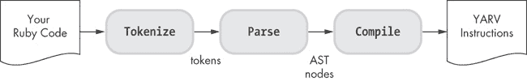

图 1-1. 你的代码在 Ruby 中的执行过程

首先，Ruby *词法分析*你的代码，这意味着它读取你代码文件中的文本字符，并将其转换为 *词法单元*，即 Ruby 语言中的单词。接下来，Ruby *解析*这些词法单元；也就是说，它将这些词法单元组合成有意义的 Ruby 语句，就像我们将单词组合成句子一样。最后，Ruby 将这些语句编译成低级指令，并使用虚拟机稍后执行这些指令。

我将在第三章中介绍 Ruby 的虚拟机，称为“另一个 Ruby 虚拟机”（YARV）。但首先，在本章中，我将描述 Ruby 用来理解你代码的词法分析和解析过程。之后，在第二章中，我将展示 Ruby 如何通过将你的代码翻译成完全不同的语言来编译你的代码。

### 注意

*在本书的大部分内容中，我们将学习 Ruby 的原始标准实现，称为* Matz 的 Ruby 解释器（MRI），*它是由松本行弘（Yukihiro Matsumoto）于 1993 年发明的。除了 MRI 之外，还有许多其他 Ruby 实现，包括 Ruby Enterprise Edition、MagLev、MacRuby、RubyMotion、mruby 等等。稍后，在第十章、第十一章 和第十二章中，我们将探讨这两种替代的 Ruby 实现：JRuby 和 Rubinius。*

路线图

+   词法分析：构成 Ruby 语言的单词

    +   parser_yylex 函数

+   **实验 1-1：使用 Ripper 对不同的 Ruby 脚本进行标记化**

+   解析：Ruby 如何理解你的代码

    +   理解 LALR 解析算法

    +   一些实际的 Ruby 语法规则

    +   阅读 Bison 语法规则

+   **实验 1-2：使用 Ripper 对不同的 Ruby 脚本进行解析**

+   总结

# 标记：构成 Ruby 语言的单词

假设你编写了一个简单的 Ruby 程序并将其保存为名为 *simple.rb* 的文件，见 示例 1-1")。

示例 1-1. 一个非常简单的 Ruby 程序 *(simple.rb)*

```
10.times do |n|
  puts n
end
```

示例 1-2 展示了你在命令行执行程序后看到的输出。

示例 1-2. 执行 示例 1-1")

```
$ **ruby simple.rb**
0
1
2
3
--*snip*--
```

当你输入 `ruby simple.rb` 并按下回车键时，会发生什么？除了常规的初始化、处理命令行参数等，Ruby 做的第一件事是打开 *simple.rb* 并读取代码文件中的所有文本。接下来，它需要理解这些文本：你的 Ruby 代码。它是如何做到这一点的呢？

在读取 *simple.rb* 后，Ruby 会遇到如 图 1-2 中所示的一系列文本字符。（为了简化说明，这里只显示第一行文本。）


图 1-2. *simple.rb* 中的第一行文本

当 Ruby 遇到这些字符时，它会将其标记化。也就是说，它通过逐个字符地扫描这些字符，将它们转换成一系列它理解的标记或单词。在 图 1-3 中，Ruby 从第一个字符的位置开始扫描。

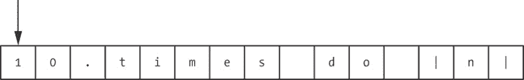

图 1-3. Ruby 开始标记化你的代码。

Ruby 的 C 源代码包含一个循环，每次读取一个字符，并根据该字符的内容进行处理。

为了简化起见，我将标记化描述为一个独立的过程。实际上，我接下来描述的解析引擎在需要新标记时会调用这个 C 语言的标记化代码。标记化和解析是两个独立的过程，但实际上是同时发生的。现在，我们继续看看 Ruby 如何标记化你 Ruby 文件中的字符。

Ruby 意识到字符 1 是一个数字的开始，并继续遍历后面的字符，直到找到一个非数字字符。首先，在图 1-4 中，它找到了一个 0。

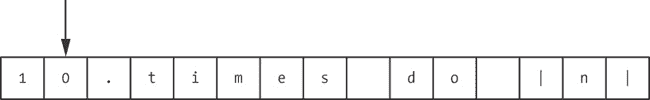

图 1-4. Ruby 移步到第二个文本字符。

然后再次前进，在图 1-5 中，Ruby 找到了一个句点字符。

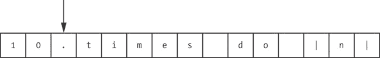

图 1-5. Ruby 找到了一个句点字符。

Ruby 实际上将句点字符视为数字字符，因为它可能是浮动点数值的一部分。在图 1-6 中，Ruby 移步到下一个字符`t`。

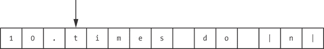

图 1-6. Ruby 找到了第一个非数字字符。

现在，Ruby 停止遍历，因为它找到了一个非数字字符。由于句点后没有更多的数字字符，Ruby 将句点视为一个单独标记的一部分，并回退一个字符，如图 1-7 所示。


图 1-7. Ruby 回退一个字符。

最后，在图 1-8 中，Ruby 将它找到的数字字符转换为程序中的第一个标记，称为`tINTEGER`。


图 1-8. Ruby 将前两个文本字符转换为`tINTEGER`标记。

Ruby 继续遍历代码文件中的字符，将它们转换为标记，并根据需要将字符分组。第二个标记，如图 1-9 所示，是一个单一字符：句点。

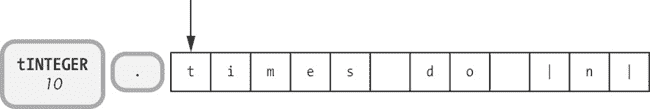

图 1-9. Ruby 将句点字符转换为一个标记。

接下来，在图 1-10 中，Ruby 遇到词语 *times* 并创建了一个标识符 token。

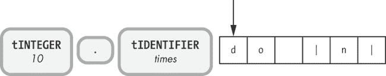

图 1-10. Ruby 对词语 *times* 进行分词。

*标识符*是你 Ruby 代码中的词语，它们不是保留字。标识符通常指的是变量、方法或类的名称。

接下来，Ruby 看到了 *do* 并创建了一个保留字 token，正如在图 1-11 中所示的 `keyword_do`。

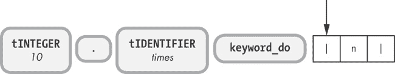

图 1-11. Ruby 创建了一个保留字 token：`keyword_do`。

*保留字*是 Ruby 中具有重要意义的关键字，因为它们提供了语言的结构或框架。它们被称为 *保留字*，因为你不能将它们作为普通标识符使用，尽管你可以将它们用作方法名、全局变量名（例如 `$do`）或实例变量名（例如 `@do` 或 `@@do`）。

在 Ruby 的 C 代码内部，维护着一个保留字常量表。示例 1-3 显示了按字母顺序排列的前几个保留字。

示例 1-3. 首批保留字，按字母顺序排列

```
alias
and
begin
break
case
class
```

parser_yylex 函数

如果你熟悉 C 语言并且有兴趣了解 Ruby 分词代码文件的详细方式，可以查看你版本的 Ruby 中的 *parse.y* 文件。*.y* 扩展名表示 *parse.y* 是一个 *语法规则文件*，其中包含一系列 Ruby 解析器引擎的规则。（我将在下一节讨论这些内容。）*parse.y* 是一个非常庞大且复杂的文件，包含超过 10,000 行的代码！

目前忽略语法规则，搜索一个名为 `parser_yylex` 的 C 函数，约在文件的三分之二处，大约是第 6500 行。这个复杂的 C 函数包含了实际上对你的代码进行分词的代码。仔细查看，你应该能看到一个非常大的 `switch` 语句，它从示例 1-4 中展示的代码开始。

示例 1-4. Ruby 中的 C 代码，用于从你的代码文件中读取每个字符

```
 retry:
 last_state = lex_state;
 switch (c = nextc()) {
```

`nextc()` 函数  返回代码文件文本流中的下一个字符。可以把这个函数看作是前面图示中的箭头。`lex_state` 变量  保存关于 Ruby 当前正在处理的代码状态或类型的信息。

大型 `switch` 语句检查代码文件中的每个字符，并根据字符的不同采取不同的操作。例如，示例 1-5 中显示的代码检查空白字符，并通过跳回到 `retry` 标签处来忽略它们，该标签位于 示例 1-4 中 `switch` 语句的上方 。

示例 1-5。此 C 代码检查代码中的空白字符并忽略它们。

```
  /* white spaces */
case ' ': case '\t': case '\f': case '\r':
case '\13': /* '\v' */
  space_seen = 1;
--*snip*--
  goto retry;
```

Ruby 的保留字定义在名为 *defs/keywords* 的文件中。如果你打开这个文件，你将看到 Ruby 所有保留字的完整列表（参见 示例 1-3 中的部分列表）。*keywords* 文件由一个名为 *gperf* 的开源包使用，生成可以快速高效地在表中查找字符串的 C 代码——在这个案例中是保留字的表。你可以在 *lex.c* 中找到生成的 C 代码，它定义了一个名为 `rb_reserved_word` 的函数，该函数在 *parse.y* 中被调用。

有关词法分析的一个最终细节：Ruby 并没有使用 C 程序员常用的 Lex 词法分析工具，这通常与像 Yacc 或 Bison 这样的语法分析器生成工具一起使用。相反，Ruby 核心团队手动编写了 Ruby 的词法分析代码，无论是出于性能原因，还是因为 Ruby 的词法分析规则需要 Lex 无法提供的特殊逻辑。

最后，正如在 图 1-12 中所示，Ruby 将剩余的字符转换为词法单元。


图 1-12。Ruby 完成了对第一行文本的词法分析。

Ruby 会继续逐步处理你的代码，直到它对整个 Ruby 脚本进行了词法分析。此时，它已经第一次处理了你的代码，将其拆解并以完全不同的方式重新组合起来。你的代码最初是一个文本字符流，Ruby 将其转换成一个词法单元流，这些词法单元是它之后将组合成句子的单词。

# 实验 1-1：使用 Ripper 对不同的 Ruby 脚本进行词法分析

现在我们已经了解了词法分析的基本概念，让我们看看 Ruby 实际上是如何对不同的 Ruby 脚本进行词法分析的。毕竟，不了解 Ruby 是如何工作的，你怎么知道之前的解释是否正确呢？

事实证明，一款名为 *Ripper* 的工具使得查看 Ruby 为不同代码文件创建的标记变得非常简单。随着 Ruby 1.9 和 Ruby 2.0 的发布，`Ripper` 类允许你调用 Ruby 用于处理代码文件中的文本的相同标记化和解析代码。（Ripper 在 Ruby 1.8 中不可用。）

示例 1-6") 展示了使用 Ripper 的简单性。

示例 1-6。如何调用 `Ripper.lex` *(lex1.rb)*

```
    require 'ripper'
    require 'pp'
    code = <<STR
    10.times do |n|
      puts n
    end
    STR
    puts code
 pp Ripper.lex(code)
```

在从标准库中引入 Ripper 代码后，你可以通过将代码作为字符串传递给 `Ripper.lex` 方法来调用它 。 示例 1-7 展示了 Ripper 的输出。

示例 1-7。`Ripper.lex` 生成的输出

```
    $ **ruby lex1.rb**
    10.times do |n|
      puts n
    end
 [[[1, 0], :on_int, "10"],
    [[1, 2], :on_period, "."],
 [[1, 3], :on_ident, "times"],
    [[1, 8], :on_sp, " "],
    [[1, 9], :on_kw, "do"],
    [[1, 11], :on_sp, " "],
    [[1, 12], :on_op, "|"],
    [[1, 13], :on_ident, "n"],
    [[1, 14], :on_op, "|"],
    [[1, 15], :on_ignored_nl, "\n"],
    [[2, 0], :on_sp, "  "],
    [[2, 2], :on_ident, "puts"],
    [[2, 6], :on_sp, " "],
    [[2, 7], :on_ident, "n"],
    [[2, 8], :on_nl, "\n"],
    [[3, 0], :on_kw, "end"],
    [[3, 3], :on_nl, "\n"]]
```

每一行对应 Ruby 在你的代码字符串中找到的一个标记。在左侧，我们有行号（在这个简短的示例中是 `1`、`2` 或 `3`）和文本列号。接下来，我们看到标记本身以符号形式展示，例如 `:on_int`  或 `:on_ident` 。最后，Ripper 显示与每个标记对应的文本字符。

Ripper 显示的标记符号与我在 图 1-2 到 图 1-12 中使用的标记标识符有所不同，后者展示了 Ruby 对 `10.times do` 代码的标记化。我使用了你在 Ruby 内部解析代码中会找到的相同名称，例如 `tIDENTIFIER`，而 Ripper 使用了 `:on_ident`。

无论如何，Ripper 仍然会让你了解 Ruby 在你的代码中找到的标记，以及标记化的工作原理。

示例 1-8 展示了使用 Ripper 的另一个示例。

示例 1-8。另一个使用 `Ripper.lex` 的示例

```
$ **ruby lex2.rb**
10.times do |n|
  puts n/4+6
end
--*snip*--
 [[2, 2], :on_ident, "puts"],
 [[2, 6], :on_sp, " "],
 [[2, 7], :on_ident, "n"],
 [[2, 8], :on_op, "/"],
 [[2, 9], :on_int, "4"],
 [[2, 10], :on_op, "+"],
 [[2, 11], :on_int, "6"],
 [[2, 12], :on_nl, "\n"],
--*snip*--
```

这次 Ruby 将表达式 `n/4+6` 转换为一系列标记，方式非常直接。标记的顺序与代码文件中的顺序完全一致。

示例 1-9 展示了一个第三个稍微复杂一点的示例。

示例 1-9。运行 `Ripper.lex` 的第三个示例

```
    $ **ruby lex3.rb**
    array = []
    10.times do |n|
      array << n if n < 5
    end
    p array
    --*snip*--
     [[3, 2], :on_ident, "array"],
     [[3, 7], :on_sp, " "],
  [[3, 8], :on_op, "<<"],
     [[3, 10], :on_sp, " "],
     [[3, 11], :on_ident, "n"],
     [[3, 12], :on_sp, " "],
     [[3, 13], :on_kw, "if"],
     [[3, 15], :on_sp, " "],
     [[3, 16], :on_ident, "n"],
     [[3, 17], :on_sp, " "],
  [[3, 18], :on_op, "<"],
     [[3, 19], :on_sp, " "],
     [[3, 20], :on_int, "5"],
    --*snip*--
```

如你所见，Ruby 足够聪明，能够区分以下行中的`<<`和`<`：`array << n if n < 5`。`<<`字符被转换为一个单一的操作符标记 ，而稍后出现的单一`<`字符则被转换为简单的小于操作符 。Ruby 的标记化代码足够智能，当它发现一个`<`时，它会向前查找第二个`<`字符。

最后，注意 Ripper 并不知道你给它的代码是否是有效的 Ruby 代码。如果你传入包含语法错误的代码，Ripper 会像往常一样将其标记化，并不会发出警告。检查语法是解析器的工作。

假设你忘记了块参数`n`后面的`|`符号 ，如示例 1-10 所示。

示例 1-10. 该代码包含语法错误。

```
    require 'ripper'
    require 'pp'
    code = <<STR
 10.times do |n
      puts n
    end
    STR
    puts code
    pp Ripper.lex(code)
```

运行此代码后，你将得到在示例 1-11 中显示的输出。

示例 1-11. Ripper 无法检测到语法错误。

```
$ **ruby lex4.rb**
10.times do |n
  puts n
end
--*snip*--
[[[1, 0], :on_int, "10"],
 [[1, 2], :on_period, "."],
 [[1, 3], :on_ident, "times"],
 [[1, 8], :on_sp, " "],
 [[1, 9], :on_kw, "do"],
 [[1, 11], :on_sp, " "],
 [[1, 12], :on_op, "|"],
 [[1, 13], :on_ident, "n"],
 [[1, 14], :on_nl, "\n"],
--*snip*--
```

# 解析：Ruby 如何理解你的代码

一旦 Ruby 将你的代码转换为一系列的标记，它接下来会做什么？它是如何理解并运行你的程序的？Ruby 是否只是按顺序执行每个标记？

不行。你的代码仍然有很长的路要走，才能让 Ruby 运行它。Ruby 代码执行过程中的下一步叫做*解析*，在这一步中，单词或标记被组合成对 Ruby 有意义的句子或短语。在解析时，Ruby 会考虑操作顺序、方法、块以及其他较大的代码结构。

但是，Ruby 是如何真正理解你通过代码传达的信息的呢？像许多编程语言一样，Ruby 使用了一个*解析器生成器*。Ruby 使用解析器处理标记，但解析器本身是通过解析器生成器生成的。解析器生成器将一系列语法规则作为输入，这些规则描述了标记将出现的预期顺序和模式。

最常用且最著名的解析器生成器是 Yacc（Yet Another Compiler Compiler），但 Ruby 使用的是 Yacc 的一个更新版本，叫做*Bison*。Bison 和 Yacc 的语法规则文件有*.y*扩展名。在 Ruby 的源代码中，语法规则文件是*parse.y*（前面已提到）。*parse.y*文件定义了你在编写 Ruby 代码时必须使用的实际语法和语法规则；它实际上是 Ruby 的核心，是定义 Ruby 语言本身的地方！


*Ruby 使用 LALR 解析器*

Ruby 并不使用 Bison 来实际处理词法单元；相反，它在构建过程中提前运行 Bison，以创建实际的解析器代码。实际上，解析过程分为两个独立的步骤，如图 1-13 所示。

在你运行 Ruby 程序之前，Ruby 构建过程会使用 Bison 从语法规则文件（*parse.y*）生成解析器代码（*parse.c*）。稍后，在运行时，这些生成的解析器代码会解析 Ruby 的词法分析器代码返回的词法单元。

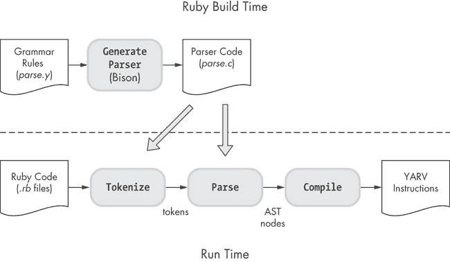

图 1-13. Ruby 构建过程提前运行 Bison。

因为*parse.y*文件和生成的*parse.c*文件也包含了词法分析代码，图 1-13 中有一条从*parse.c*到左下角词法分析过程的对角箭头。（实际上，我即将描述的解析引擎每当需要新的词法单元时都会调用词法分析代码。）词法分析和语法解析过程实际上是同时进行的。

## 理解 LALR 解析算法

解析器代码是如何分析和处理传入的词法单元的？通过一种被称为*LALR*（*Look-Ahead Left Reversed Rightmost Derivation*）的算法。使用 LALR 算法，解析器代码从左到右处理词法单元流，尝试将它们的顺序和出现的模式与*parse.y*中的一个或多个语法规则进行匹配。解析器代码在必要时还会“向前看”，以决定匹配哪个语法规则。

熟悉 Ruby 语法规则的最佳方式是通过一个例子。为了简化起见，我们现在先看一个抽象的例子。稍后，我会展示 Ruby 在解析你的代码时其实是以完全相同的方式工作的。

假设你要从西班牙语翻译：

| Me gusta el Ruby. | [短语 1] |
| --- | --- |

翻译成英语：

> 我喜欢 Ruby。

假设你要翻译短语 1，你使用 Bison 从语法文件生成 C 语言解析器。使用 Bison/Yacc 语法规则语法，你可以编写如示例 1-12 所示的简单语法，其中左侧是规则名称，右侧是匹配的词法单元。

示例 1-12. 匹配西班牙语短语 1 的简单语法规则

```
SpanishPhrase : me gusta el ruby {
  printf("I like Ruby\n");
}
```

这个语法规则是这样说的：如果词法单元流的顺序是 `me`、`gusta`、`el` 和 `ruby`——按照这个顺序——我们就匹配成功。如果匹配成功，Bison 生成的解析器将运行给定的 C 代码，`printf` 语句（类似于 Ruby 中的 `puts`）将打印翻译后的英语短语。

图 1-14 展示了解析过程的实际操作。

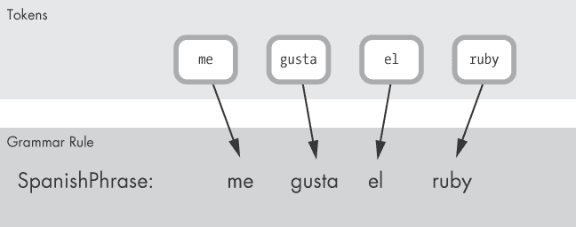

图 1-14. 与语法规则匹配的令牌

上方有四个输入令牌，下面是语法规则。应该很清楚地看到有匹配，因为每个输入令牌直接对应语法规则右侧的一个项。我们匹配了`SpanishPhrase`规则。

现在让我们改进这个示例。假设你需要增强你的解析器，使其能够匹配短语 1 和短语 2：

| Me gusta el Ruby. | [短语 1] |
| --- | --- |

和：

| Le gusta el Ruby. | [短语 2] |
| --- | --- |

在英语中，短语 2 意味着“她/他/它喜欢 Ruby”。

示例 1-13 中的修改版语法文件可以解析这两个西班牙语短语。

示例 1-13. 这些语法规则匹配短语 1 和短语 2。

```
SpanishPhrase: VerbAndObject el ruby {
  printf("%s Ruby\n", $1);
};
VerbAndObject: SheLikes | ILike {
  $$ = $1;
};
SheLikes: le gusta {
  $$ = "She likes";
}
ILike: me gusta {
  $$ = "I like";
}
```

如你所见，这里有四个语法规则，而不是只有一个。此外，你还在使用 Bison 指令`$$`将子语法规则的值返回给父规则，并使用`$1`在父规则中引用子规则的值。

与短语 1 不同，解析器不能立即将短语 2 与任何语法规则匹配。

在图 1-15 中，我们可以看到`el`和`ruby`令牌匹配`SpanishPhrase`规则，但`le`和`gusta`不匹配。（最终，我们会看到子规则`VerbAndObject`确实匹配`le gusta`，但暂时先不讨论这个。）有了四个语法规则，解析器如何知道接下来应该尝试匹配哪些规则？以及针对哪些令牌进行匹配？

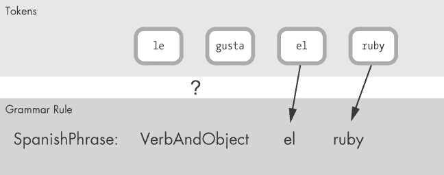

图 1-15. 前两个令牌不匹配。

这里是 LALR 解析器的智能所在。如前所述，LALR 代表*前瞻 LR* 解析器，描述了解析器用于找到匹配语法规则的算法。我们稍后会讲解*前瞻*部分。现在，让我们从 LR 开始：

+   **L**（左）表示解析器在处理令牌流时是从左到右进行的。在这个示例中，顺序是`le`、`gusta`、`el`和`ruby`。

+   **R**（逆向最右推导）意味着解析器采取自底向上的策略，使用移位/归约技术，来找到匹配的语法规则。

以下是短语 2 的算法工作方式。首先，解析器获取输入令牌流，如图 1-16 所示。

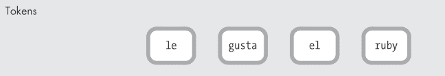

图 1-16. 输入令牌流

接下来，解析器将标记向左移动，创建了我称之为*语法规则堆栈*的结构，如图 1-17 所示。

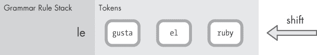

图 1-17. 解析器将第一个标记移到语法规则堆栈上。

因为解析器只处理了标记`le`，所以它暂时将这个标记单独放在堆栈中。术语*语法规则堆栈*有些过于简化；虽然解析器使用堆栈，但它并不是将语法规则推入堆栈，而是将数字推入堆栈，表示它刚刚解析了哪条语法规则。这些数字，或称为*状态*，帮助解析器在处理标记时跟踪它已经匹配了哪些语法规则。

接下来，如图 1-18 所示，解析器将另一个标记向左移动。

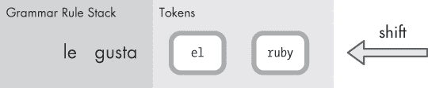

图 1-18. 解析器将另一个标记移到堆栈上。

现在，堆栈左侧有两个标记。在这一点上，解析器停止并开始查找匹配的语法规则。图 1-19 展示了解析器匹配`SheLikes`规则的过程。


图 1-19. 解析器匹配`SheLikes`规则并进行归约。

这个操作被称为*归约*，因为解析器正在用一个匹配规则替换一对标记。解析器查看可用的规则并进行归约，或者应用单一的匹配规则。

现在解析器可以再次进行归约，因为有另一个匹配的规则：`VerbAndObject`！`VerbAndObject`规则之所以匹配，是因为它使用了`OR`（`|`）操作符，匹配了*任意*一个`SheLikes` *或* `ILike`的子规则。

你可以在图 1-20 中看到，解析器将`SheLikes`替换为`VerbAndObject`。


图 1-20. 解析器再次进行归约，匹配`VerbAndObject`规则。

但请思考一下：解析器是如何知道该进行归约而不是继续移位标记的？此外，如果在现实中有很多匹配的规则，解析器又是如何知道使用哪一条规则的呢？它如何决定是移位还是归约？如果归约，它又是如何决定使用哪条语法规则进行归约的？

换句话说，假设此时过程中有多个匹配规则包括`le gusta`。解析器如何知道应该应用哪个规则，或者在寻找匹配之前是否应该先将`el`标记移入栈中？（见图 1-21）。

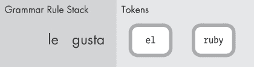

图 1-21. 解析器如何知道是移位还是归约？

这就是 LALR 中的*前瞻*部分的作用。为了找到正确的匹配规则，解析器会查看下一个标记。图 1-22 中的箭头表示解析器在查看`el`标记。

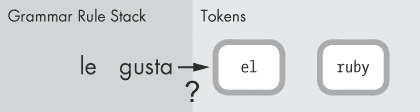

图 1-22. 查看输入流中的下一个标记

此外，解析器还维护一个状态表，记录根据下一个标记是什么以及刚刚解析的语法规则，可能的结果。在本例中，表格将包含一系列状态，描述到目前为止已解析的语法规则以及根据下一个标记应该转到的状态。（LALR 解析器是复杂的状态机，它们在标记流中匹配模式。当你使用 Bison 生成 LALR 解析器时，Bison 会根据你提供的语法规则计算该状态表应包含的内容。）

在这个例子中，状态表将包含一条条目，指示如果下一个标记是`el`，解析器应该先使用`SheLikes`规则进行归约，然后再移位一个新标记。

与其浪费时间讨论状态表的细节（你可以在生成的*parse.c*文件中找到实际的 Ruby LALR 状态表），不如继续处理短语 2“Le gusta el Ruby”的移位/归约操作。在匹配`VerbAndObject`规则之后，解析器会将另一个标记向左移，如图 1-23 所示。

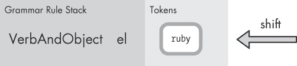

图 1-23. 解析器将另一个标记推入栈中。

此时，没有规则能够匹配，状态机将把另一个标记向左移（见图 1-24）。

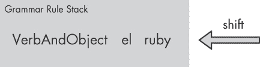

图 1-24. 解析器将另一个标记推入栈中。

图 1-25 显示了在最终归约操作后，父语法规则 `SpanishPhrase` 如何匹配。


图 1-25。解析器匹配 `SpanishPhrase` 规则——以及整个输入流！

我展示这个西班牙语到英语的示例是因为 Ruby 解析你的程序的方式完全相同！在 Ruby 的 *parse.y* 源代码文件中，你会看到数百条规则，这些规则定义了 Ruby 语言的结构和语法。有父规则和子规则，子规则返回的值是父规则可以引用的，方式和我们的 `SpanishPhrase` 语法规则使用 `$$`、`$1`、`$2` 等符号的方式完全相同。唯一的真正区别在于规模：我们的 `SpanishPhrase` 语法示例实际上是微不足道的。相比之下，Ruby 的语法非常复杂；它是一个错综复杂的父子语法规则系列，有时它们以循环、递归的方式相互引用。但这种复杂性意味着在 *parse.c* 中生成的状态表相当大。描述解析器如何处理符号并使用状态表的基本 LALR 算法，在我们的西班牙语示例和 Ruby 中都是相同的。

要了解 Ruby 的状态表有多复杂，你可以尝试使用 Ruby 的 `-y` 选项，该选项会在每次解析器从一个状态跳到另一个状态时显示内部调试信息。示例 1-14 显示了当你运行来自示例 1-1") 的 `10.times do` 示例时生成的部分输出。

示例 1-14。Ruby 可选地显示调试信息，展示解析器如何从一个状态跳到另一个状态。

```
$ **ruby -y simple.rb**
Starting parse
Entering state 0
Reducing stack by rule 1 (line 850):
-> $$ = nterm @1 ()
Stack now 0
Entering state 2
Reading a token: Next token is token tINTEGER ()
Shifting token tINTEGER ()
Entering state 41
Reducing stack by rule 498 (line 4293):
   $1 = token tINTEGER ()
-> $$ = nterm numeric ()
Stack now 0 2
Entering state 109
--*snip*--
```

## 一些实际的 Ruby 语法规则

让我们来看一些来自 *parse.y* 的实际 Ruby 语法规则。示例 1-15 包含了来自示例 1-1") 的简单 Ruby 脚本示例。

示例 1-15。来自示例 1-1") 的简单 Ruby 程序。

```
10.times do |n|
  puts n
end
```

图 1-26 显示了 Ruby 的解析过程是如何与这个脚本配合工作的。

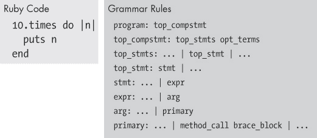

图 1-26. 右侧的语法规则与左侧的 Ruby 代码相匹配。

左侧是 Ruby 尝试解析的代码，右侧是来自 Ruby *parse.y* 文件的实际匹配语法规则（简化显示）。第一条规则，`program: top_compstmt`，是根语法规则，匹配整个 Ruby 程序。

当你继续向下查看时，你会看到一系列复杂的子规则，它们也匹配整个 Ruby 脚本：顶级语句、单一语句、表达式、参数，最后是主值。一旦 Ruby 的解析过程到达主语法规则，它会遇到一个包含两个匹配子规则的规则：`method_call` 和 `brace_block`。让我们首先来看一下 `method_call`（见图 1-27）。

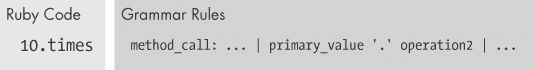

图 1-27. `10.times` 匹配 `method_call` 语法规则。

`method_call` 规则匹配 Ruby 代码中的 `10.times` 部分——也就是我们在 `10 Fixnum` 对象上调用 `times` 方法的地方。你可以看到，`method_call` 规则匹配另一个主值，接着是一个句点字符，再接着是一个 `operation2` 规则。

图 1-28 显示了 `primary_value` 规则首先匹配值 `10`。

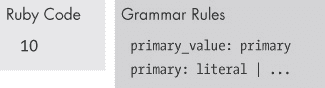

图 1-28. 值 `10` 匹配 `primary_value` 语法规则。

然后，在图 1-29 中，`operation2` 规则匹配方法名 `times`。


图 1-29. `times` 方法名匹配 `operation2` 语法规则。

Ruby 是如何解析传递给 `times` 方法的 `do ... puts ... end` 块内容的？它使用我们在图 1-26 中看到的 `brace_block` 规则。图 1-30 展示了 `brace_block` 规则的定义。

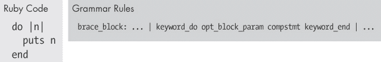

图 1-30. 整个块匹配 `brace_block` 规则。

我这里没有足够的空间详细解释其余的子语法规则，但你可以看到这一规则如何依次包含一系列其他匹配的子规则：

+   `keyword_do` 匹配保留字 `do`。

+   `opt_block_param` 匹配块参数 `|n|`。

+   `compstmt` 匹配块本身的内容，`puts n`。

+   `keyword_end` 匹配 `end` 保留字。

阅读 Bison 语法规则

为了让你体验 Ruby 实际的 *parse.y* 源代码，看看 示例 1-16，它展示了 `method_call` 语法规则定义的一部分 。

示例 1-16. Ruby 的实际 `method_call` 语法规则来自 *parse.y*

```
 method_call        :
    --*snip*--
          primary_value '.' operation2
          {
          /*%%%*/
              $<num>$ = ruby_sourceline;
          /*% %*/
          }
        opt_paren_args
          {
          /*%%%*/
              $$ = NEW_CALL($1, $3, $5);
              nd_set_line($$, $<num>4);
          /*%
              $$ = dispatch3(call, $1, ripper_id2sym('.'), $3);
              $$ = method_optarg($$, $5);
          %*/
          }
```

和之前的西班牙语到英语的示例语法文件一样，你可以看到在语法规则的每个术语后都有复杂的 C 代码片段。示例 1-17 展示了其中的一个例子。

示例 1-17. Ruby 在 `opt_paren_args` 语法规则匹配时调用此 C 代码。

```
$$ = NEW_CALL($1, $3, $5);
nd_set_line($$, $<num>4);
```

Bison 生成的解析器将在目标 Ruby 脚本中的词法单元匹配到某个规则时执行这些代码片段中的一个。然而，这些 C 代码片段还包含 Bison 指令，如 `$$` 和 `$1`，允许代码创建返回值并引用其他语法规则返回的值。最终我们会得到一个复杂的 C 和 Bison 指令混合体。

更糟糕的是，Ruby 在其构建过程中使用了一种技巧，将这些 C/Bison 代码片段分割成多个部分。其中一些部分由 Ruby 使用，而其他部分仅由 Ripper 工具使用，后者在 实验 1-1：使用 Ripper 对不同 Ruby 脚本进行词法分析 中使用。下面是这种技巧的工作方式：

+   示例 1-16 中 `/*%%%*/` 行和 `/*%` 行之间的 C 代码实际上是在 Ruby 构建过程中编译进 Ruby 中的。

+   示例 1-16 中 `/*%` 和 `%*/` 之间的 C 代码在 Ruby 构建时会被丢弃。此代码仅供 Ripper 工具使用，该工具在 Ruby 构建过程中单独构建。

Ruby 使用这种非常令人困惑的语法，允许 Ripper 工具和 Ruby 本身在 *parse.y* 中共享相同的语法规则。

这些代码片段究竟在做什么呢？正如你可能猜到的那样，Ruby 使用 Ripper 代码片段来允许 Ripper 工具显示 Ruby 正在解析的内容。（我们接下来会尝试这个，在实验 1-2：使用 Ripper 解析不同的 Ruby 脚本中。）其中还有一些记账代码：Ruby 使用 `ruby_sourceline` 变量来跟踪每一部分语法对应的源代码行。

但更重要的是，Ruby 在解析你的代码时，实际使用的代码片段会创建一系列*节点*，或临时数据结构，这些节点构成了 Ruby 代码的内部表示。这些节点会保存在一种称为*抽象语法树（AST）*的树结构中（更多内容请参见实验 1-2：使用 Ripper 解析不同的 Ruby 脚本）。你可以在示例 1-17 中看到创建 AST 节点的一个示例，其中 Ruby 调用了 `NEW_CALL` C 宏/函数。这个调用创建了一个新的 `NODE_CALL` 节点，表示一个方法调用。（在第二章中，我们将看到 Ruby 如何最终将其编译成虚拟机可以执行的字节码。）

# 实验 1-2：使用 Ripper 解析不同的 Ruby 脚本

在实验 1-1：使用 Ripper 解析不同的 Ruby 脚本中，你学会了如何使用 Ripper 显示 Ruby 将你的代码转换成的标记，而且我们刚刚看到，*parse.y* 中的 Ruby 语法规则也包含在 Ripper 工具中。现在，让我们学习如何使用 Ripper 显示 Ruby 解析代码时的相关信息。示例 1-18 展示了如何实现这一点。

示例 1-18。如何调用 `Ripper.sexp` 的示例

```
    require 'ripper'
    require 'pp'
    code = <<STR
    10.times do |n|
      puts n
    end
    STR
    puts code
 pp Ripper.sexp(code)
```

这实际上是实验 1-1：使用 Ripper 解析不同的 Ruby 脚本中的完全相同的代码，只不过我们调用的是 `Ripper.sexp` ，而不是 `Ripper.lex`。运行该代码将产生示例 1-19 中所示的输出。

示例 1-19。`Ripper.sexp` 生成的输出

```
[:program,
  [[:method_add_block,
     [:call,
       [:@int, "10", [1, 0]], :".",
       [:@ident, "times", [1, 3]]],
     [:do_block,
       [:block_var,
         [:params, [[:@ident, "n", [1, 13]]],
                   nil, nil, nil, nil, nil, nil],
         false],
       [[:command,
          [:@ident, "puts", [2, 2]],
          [:args_add_block, [[:var_ref, [:@ident, "n", [2, 7]]]],
                            false]]]]]]]
```

你可以从这段晦涩的文本中看到一些来自 Ruby 脚本的片段，但所有其他符号和数组是什么意思呢？

事实证明，Ripper 的输出是你的 Ruby 代码的文本表示。当 Ruby 解析你的代码时，逐一匹配语法规则，它将代码文件中的分词转换为一个复杂的内部数据结构，称为*抽象语法树（AST）*。（你可以在阅读 Bison 语法规则中看到生成此结构的一些 C 代码。）AST 用于记录你的 Ruby 代码的结构和语法意义。

为了让你明白我的意思，看看图 1-31，它展示了 Ripper 为我们生成的部分输出的图形视图：在代码块内的`puts n`语句。

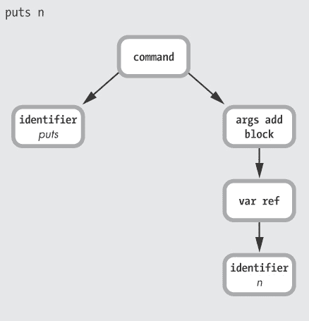

图 1-31. AST 中对应`puts n`的部分

这个图对应于 Ripper 输出的最后三行，这三行在示例 1-20 中有重复展示。

示例 1-20. `Ripper.sexp`输出的最后三行

```
    [[:command,
    [:@ident, "puts", [2, 2]],
       [:args_add_block, [[:var_ref, [:@ident, "n", [2, 7]]]],
                         false]]]
```

正如在实验 1-1：使用 Ripper 对不同的 Ruby 脚本进行分词中所示，当我们展示来自 Ripper 的分词信息时，你可以看到源代码文件的行号和列号信息被显示为整数。例如，`[2, 2]` 表示 Ripper 在代码文件的第 2 行第 2 列找到了`puts`调用。你还可以看到，Ripper 为 AST 中的每个节点输出了一个数组——例如，`[:@ident, "puts", [2, 2]]` 。

现在你的 Ruby 程序开始对 Ruby“有意义”了。Ruby 不再只是一个简单的分词流（这可能代表任何东西），现在它有了一个详细的描述，告诉它你在写`puts n`时的真正意图。你看到的是一个函数调用（命令），后面跟着一个标识符节点，指示要调用的函数。

Ruby 使用`args_add_block`节点，因为你可以像这样将一个代码块传递给命令/函数调用。即使在这种情况下你没有传递代码块，`args_add_block`节点仍然会被保存到 AST 中。（另外，请注意，`n`标识符被记录为`:var_ref`，即变量引用节点，而不是简单的标识符。）

图 1-32 展示了更多来自 Ripper 的输出。

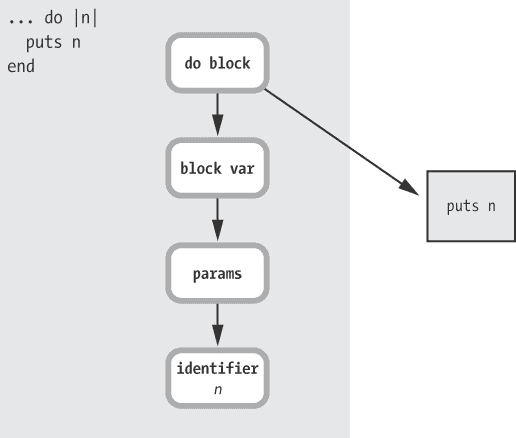

图 1-32. AST 中对应整个代码块的部分

你可以看到 Ruby 现在理解到`do |n| ... end`是一个块，带有一个名为`n`的块参数。右边的`puts n`框代表 AST 的另一部分——之前展示过的`puts`调用的解析版本。

最后，图 1-33 展示了示例 Ruby 代码的完整 AST。

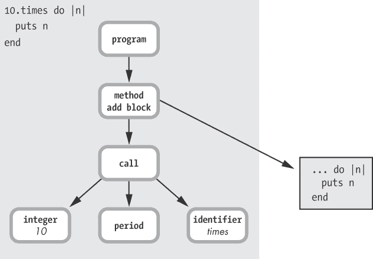

图 1-33. 整个 Ruby 程序的 AST

这里，`method add block`意味着你正在调用一个方法，但带有一个块参数：`10.times do`。`call`树节点显然代表实际的方法调用`10.times`。这是我们在前面 C 代码片段中看到的`NODE_CALL`节点。Ruby 通过 AST 节点的排列方式保存了它对你代码意图的理解。

为了澄清，假设你将 Ruby 表达式`2 + 2`传递给 Ripper，如示例 1-21 所示。

示例 1-21. 这段代码将显示`2 + 2`的 AST。

```
require 'ripper'
require 'pp'
code = <<STR
2 + 2
STR
puts code
pp Ripper.sexp(code)
```

运行这段代码会产生示例 1-22 中的输出。

示例 1-22. `Ripper.sexp`的输出，针对`2 + 2`

```
[:program,
  [[:binary,
     [:@int, "2", [1, 0]],
     :+,
     [:@int, "2", [1, 4]]]]]
```

正如你在图 1-34 中看到的，`+`用一个叫做`binary`的 AST 节点表示。

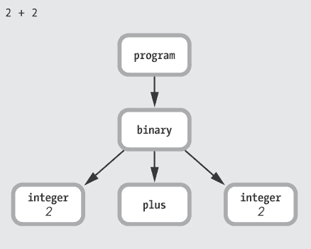

图 1-34. `2 + 2`的 AST

但看看当我将表达式`2 + 2 * 3`传递给 Ripper 时会发生什么，就像在示例 1-23 中那样。

示例 1-23. 显示`2 + 2 * 3`的 AST 的代码

```
require 'ripper'
require 'pp'
code = <<STR
2 + 2 * 3
STR
puts code
pp Ripper.sexp(code)
```

示例 1-24 显示你会得到一个额外的二元节点，表示`*`运算符，如下所示：。

示例 1-24. `Ripper.sexp`的输出，针对`2 + 2 * 3`

```
    [:program,
     [[:binary,
       [:@int, "2", [1, 0]],
       :+,
    [:binary,
         [:@int, "2", [1, 4]],
         :*,
         [:@int, "3", [1, 8]]]]]]
```

图 1-35 展示了它的样子。

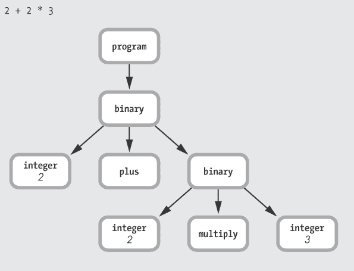

图 1-35. `2 + 2 * 3`的 AST

Ruby 足够聪明，能意识到乘法的优先级高于加法，但更有趣的是 AST 树结构如何捕捉操作顺序的信息。标记流`2 + 2 * 3`仅表示你在代码文件中写的内容。然而，保存到 AST 结构中的解析版本现在包含了你代码的*含义*——也就是说，Ruby 稍后执行代码时所需的所有信息。

最后一个提示：Ruby 实际上包含一些调试代码，可以显示有关 AST 节点结构的信息。要使用它，请运行带有`parsetree`选项的 Ruby 脚本（见示例 1-25）。

示例 1-25. 使用`parsetree`选项显示代码的 AST 调试信息。

```
$ **ruby --dump parsetree your_script.rb**
```

这将显示我们刚刚看到的相同信息，但`parsetree`选项应该显示来自 C 源代码的实际节点名称，而不是显示符号。（在第二章中，我也将使用实际的节点名称。）

# 摘要

在第一章中，我们研究了计算机科学中最吸引人的领域之一：Ruby 是如何*理解*你提供的文本——即你的 Ruby 程序。为了做到这一点，Ruby 将你的代码转换成两种不同的格式。首先，它将你的 Ruby 程序中的文本转换为一系列*标记*。接下来，它使用 LALR 解析器将输入流中的标记转换为一种称为*抽象语法树*的数据结构。

在第二章中，我们将看到 Ruby 将你的代码转换为第三种格式：一系列*字节码指令*，这些指令在程序实际执行时使用。
