# 第二章：编译

> 
> 
> *Ruby 实际运行的代码与你原始的代码完全不同。*

现在 Ruby 已经对你的代码进行了词法分析和语法解析，它准备好运行了吗？它是否终于会在我的简单 `10.times do` 示例中迭代 10 次？如果没有，Ruby 可能还需要做什么？

从 1.9 版本开始，Ruby 会在执行代码之前编译它。*编译*一词意味着将你的代码从一种编程语言转换为另一种语言。你的编程语言对你来说容易理解，而通常目标语言对计算机来说更容易理解。

例如，当你编译一个 C 程序时，编译器将 C 代码转换为机器语言，这是计算机的微处理器硬件能理解的语言。当你编译一个 Java 程序时，编译器将 Java 代码转换为 Java 字节码，这是 Java 虚拟机能够理解的语言。

Ruby 的编译器也没有什么不同。它将你的 Ruby 代码转换为 Ruby 虚拟机能够理解的另一种语言。唯一的区别是你不会直接使用 Ruby 的编译器；不像 C 或 Java，Ruby 的编译器会自动运行，你根本不会知道。在本章 第二章 中，我将解释 Ruby 是如何做到这一点的，以及它将你的代码转换为什么语言。

路线图

+   没有 Ruby 1.8 的编译器

+   Ruby 1.9 和 2.0 引入了编译器

+   Ruby 如何编译一个简单脚本

+   编译对块的调用

    +   Ruby 如何遍历 AST

+   **实验 2-1：显示 YARV 指令**

+   本地表

    +   编译可选参数

    +   编译关键字参数

+   **实验 2-2：显示本地表**

+   总结

# 没有 Ruby 1.8 的编译器

Ruby 核心团队在版本 1.9 中引入了编译器。Ruby 1.8 及更早版本不包含编译器。相反，Ruby 1.8 会在标记化和解析过程完成后立即执行代码。它通过遍历 AST 树中的节点并执行每个节点来实现这一点。图 2-1 展示了另一种看待 Ruby 1.8 标记化和解析过程的方式。

图 2-1 的顶部显示了您的 Ruby 代码。其下是 Ruby 将您的 Ruby 代码转换成的不同内部格式。这些就是我们在第一章中看到的标记和 AST 节点——当您使用 Ruby 运行代码时，代码所呈现的不同形式。图表的下半部分展示了 Ruby 核心团队编写的代码：Ruby 语言的 C 源代码，以及 C 编译器将其转换成的机器语言。

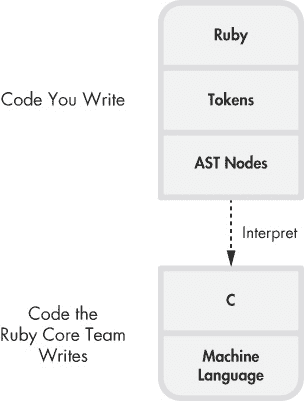

图 2-1. 在 Ruby 1.8 中，您的代码被转换为 AST 节点，然后被解释执行。

两个代码部分之间的虚线表示 Ruby 会解释您的代码。Ruby 的 C 代码（下半部分）读取并执行您的代码（上半部分）。Ruby 1.8 不会将您的代码编译或转换为 AST 节点之外的任何形式。在将其转换为 AST 节点后，它会继续遍历 AST 中的节点，按每个节点所代表的操作执行。

图表中间的空隙表明，您的代码从未完全编译成机器语言。如果您反汇编并检查 CPU 实际运行的机器语言，您将看不到直接映射到您原始 Ruby 代码的指令。相反，您会发现执行代码的指令，这些指令会进行标记化、解析和执行，换句话说，它们实现了 Ruby 解释器。

# Ruby 1.9 和 2.0 引入了编译器

如果您已经升级到 Ruby 1.9 或 2.0，Ruby 仍然无法直接运行您的代码。它首先需要编译代码。

在 Ruby 1.9 中，Koichi Sasada 和 Ruby 核心团队引入了“另一个 Ruby 虚拟机”（YARV），它实际上执行您的 Ruby 代码。从高层次上看，这与 Java 虚拟机（JVM）的概念相同，JVM 被 Java 和许多其他语言所使用。（我将在第三章和第四章中更详细地介绍 YARV。）

使用 YARV 时（与 JVM 类似），你首先将代码编译成*字节码*，即虚拟机可以理解的一系列低级指令。YARV 和 JVM 之间的唯一区别如下：

+   Ruby 并没有将编译器作为一个独立的工具暴露给你。相反，它会自动将你的 Ruby 代码在内部编译成字节码指令。

+   Ruby 永远不会将你的 Ruby 代码完全编译成机器语言。正如你在图 2-2 中看到的那样，Ruby 会解释字节码指令。而 JVM 则可以通过其“热点”或即时编译器（JIT）将一些字节码指令编译成机器语言。

    图 2-2 展示了 Ruby 1.9 和 2.0 如何处理你的代码。

请注意，这次不同于图 2-1 中展示的过程，你的代码被转换成了第三种格式。在解析完符号并生成 AST 后，Ruby 1.9 和 2.0 会继续将代码编译成一系列低级指令，称为*YARV 指令*。

使用 YARV 的主要原因是速度：由于采用了 YARV 指令，Ruby 1.9 和 2.0 比 Ruby 1.8 运行得要快得多。像 Ruby 1.8 一样，YARV 是一个解释器——只不过是一个更快的解释器。最终，Ruby 1.9 或 2.0 依然不会直接将你的 Ruby 代码转换成机器语言。图 2-2 中，YARV 指令和 Ruby 的 C 代码之间仍然存在差距。

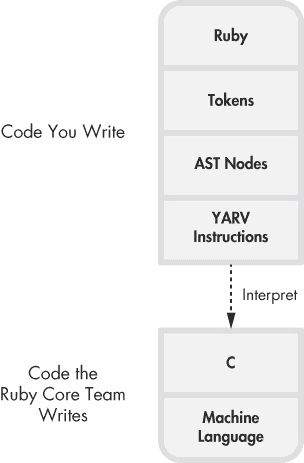

图 2-2. Ruby 1.9 和 2.0 在解释之前会将 AST 节点编译成 YARV 指令。

# Ruby 如何编译一个简单的脚本

在这一部分，我们将看看代码在 Ruby 中执行的最后一步：Ruby 如何将你的代码编译成 YARV 所期望的指令。通过一个编译的示例，我们来探索 Ruby 编译器的工作原理。示例 2-1 展示了一个简单的 Ruby 脚本，它计算了 2 + 2 = 4。

示例 2-1. 我们将编译的一个简单 Ruby 程序

```
puts 2+2
```

图 2-3 代码后生成的 AST") 展示了 Ruby 在对这个简单程序进行词法分析和解析后生成的 AST 结构。（这比我们在实验 1-2: 使用 Ripper 解析不同的 Ruby 脚本中看到的 Ripper 工具所呈现的 AST 更为详细。）

### 注意

*图 2-3 代码后生成的 AST") 中显示的技术名称（*`NODE_SCOPE`*，*`NODE_FCALL`* 等）来自实际的 Ruby C 源代码。为了简化起见，我省略了一些 AST 节点——特别是那些表示每个方法调用的参数数组的节点，在这个简单的例子中，这些数组只有一个元素。*

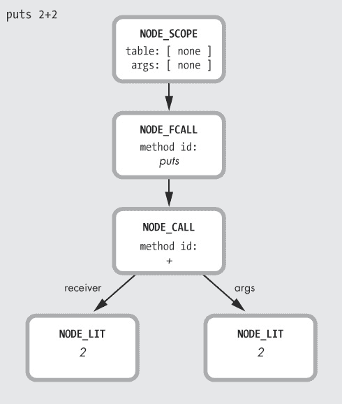

图 2-3. Ruby 在解析 示例 2-1 代码后生成的 AST。

在我们详细讲解 Ruby 如何编译 `puts 2+2` 脚本之前，让我们先看一下 YARV 的一个非常重要的特性：它是一个 *栈导向虚拟机*。这意味着，当 YARV 执行你的代码时，它会维护一个值的栈——主要是 YARV 指令的参数和返回值。（我将在第三章中详细解释这个问题。）YARV 的大多数指令要么将值推入栈中，要么操作栈中的值，最终将结果值保留在栈中。

为了将 `puts 2+2` 的 AST 结构编译成 YARV 指令，Ruby 将从上到下递归遍历树，将每个 AST 节点转换为指令。图 2-4 展示了这个过程，从 `NODE_SCOPE` 开始。


图 2-4. Ruby 从 AST 的根开始编译过程。

`NODE_SCOPE` 告诉 Ruby 编译器，它开始编译一个新的 *作用域*，或一段 Ruby 代码，在这个例子中是一个全新的程序。右侧的空框表示该作用域。（`table` 和 `args` 值都为空，所以我们暂时忽略它们。）

接下来，Ruby 编译器会沿着 AST 树向下，遇到 `NODE_FCALL`，如图 2-5 所示。

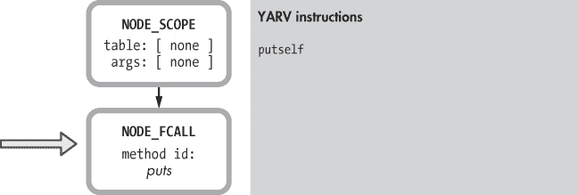

图 2-5. 为了编译一个函数调用，Ruby 首先创建一个指令将接收者推入栈中。

`NODE_FCALL` 表示一个*函数调用*——在这个例子中，就是调用 `puts`。（函数和方法调用在 Ruby 程序中非常重要，也非常常见。）Ruby 按照以下模式为 YARV 编译函数调用：

+   推入接收者。

+   推入参数。

+   调用方法/函数。

在图 2-5 中，Ruby 编译器首先创建了一个名为 `putself` 的 YARV 指令，表示该函数调用使用当前 `self` 指针的值作为接收者。由于我在该简单脚本的顶层作用域中调用了 `puts`，也就是说在顶层部分，`self` 被设置为指向 `top self` 对象。(`top self` 对象是一个 `Object` 类的实例，它在 Ruby 启动时自动创建。`top self` 的一个作用是作为顶层作用域中类似这种函数调用的接收者。)

### 注意

*在 Ruby 中，所有函数实际上都是方法。也就是说，函数总是与 Ruby 类关联；总会有一个接收者。然而，在 Ruby 内部，Ruby 的解析器和编译器区分函数和方法：方法调用有显式的接收者，而函数调用则假定接收者是当前的 `self` 值。*

接下来，Ruby 需要创建指令将 `puts` 函数调用的参数推入栈中。但是，如何做到这一点呢？`puts` 的参数是 `2+2`，它是另一个方法调用的结果。尽管 `2+2` 是一个简单的表达式，`puts` 也可能是在处理一个非常复杂的 Ruby 表达式，涉及许多运算符、方法调用等。那么，Ruby 如何知道在这里创建哪些指令呢？

答案在 AST（抽象语法树）的结构中。通过递归地向下遍历树节点，Ruby 可以利用解析器之前的工作。在这种情况下，Ruby 现在只需一步步下到 `NODE_CALL` 节点，如图 2-6 所示。


图 2-6. 接下来，Ruby 编写计算 `2+2` 的指令，作为 `puts` 的参数。

这里 Ruby 将编译 `+` 方法调用，理论上这就是将 `+` 消息发送给 `2` 这个整数对象的过程。同样，按照接收者、参数、方法调用的模式，Ruby 按顺序执行以下操作：

1.  创建一个 YARV 指令，将接收者（在此例中为对象`2`）推入栈中。

1.  创建一个 YARV 指令，将参数或参数们推入栈中（在此例中是 `2`）。

1.  创建一个方法调用 YARV 指令 `send <callinfo!mid:+, argc:1, ARGS_SKIP>`，这意味着“发送 + 消息”给接收者，也就是之前被推入 YARV 栈中的对象（在此例中为第一个 `Fixnum 2` 对象）。`mid:+` 表示“方法 ID = +”，是我们想调用的方法的名称。`argc:1` 参数告诉 YARV 该方法调用有一个参数（第二个 `Fixnum 2` 对象）。`ARGS_SKIP` 表示参数是简单值（而非块或未命名参数的数组），允许 YARV 跳过一些原本需要做的工作。

当 Ruby 执行 `send <callinfo!mid:+...` 指令时，它会将 `2+2` 相加，从栈中获取这些参数，并将结果 `4` 留在栈顶作为一个新值。令人着迷的是，YARV 的栈导向特性也有助于 Ruby 更容易地编译 AST 节点，正如你在编译完 `NODE_FCALL` 时看到的那样，如图 2-7 所示。

现在，Ruby 可以假设 `2+2` 操作的返回值——也就是 `4`——将留在栈顶，正好作为 `puts` 函数调用的参数。Ruby 的栈导向虚拟机与它递归编译 AST 节点的方式相得益彰！正如你在图 2-7 右侧所看到的，Ruby 已经添加了 `send <callinfo!mid:puts, argc:1` 指令，该指令调用 `puts` 并表示 `puts` 有一个参数。

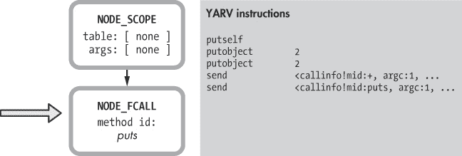

图 2-7. 最终，Ruby 可以为调用 `puts` 写一条指令。

结果表明，Ruby 在执行这些 YARV 指令之前，会进一步修改它们作为优化步骤的一部分。它的一项优化是用*专用指令*替换一些 YARV 指令，专用指令是代表常用操作的 YARV 指令，比如`size`、`not`、`less than`、`greater than`等。其中一条指令，`opt_plus`，用于将两个数字相加。在优化过程中，Ruby 会将 `send <callinfo!mid:+...` 替换为 `opt_plus`，如图 2-8 所示。

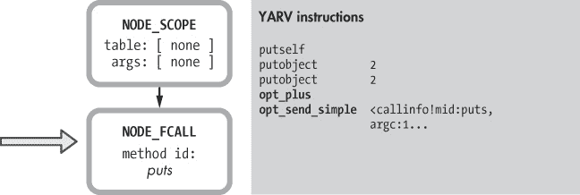

图 2-8. Ruby 用专用指令替换一些指令。

正如你在图 2-8 中看到的，Ruby 还将第二个 `send` 替换为 `opt_send_simple`，当所有参数都是简单值时，它运行得更快。

# 编译调用块

接下来，让我们编译我在示例 1-1")中给出的 `10.times do` 示例，位于第一章（参见示例 2-2）。

示例 2-2. 一个简单的调用块的脚本

```
10.times do |n|
  puts n
end
```

请注意，这个示例包含了传递给 `times` 方法的块参数。这很有趣，因为它将让我们有机会看看 Ruby 编译器如何处理块。图 2-9 再次显示了 `10.times do` 示例的 AST，使用实际的节点名称，而不是 Ripper 简化的输出。

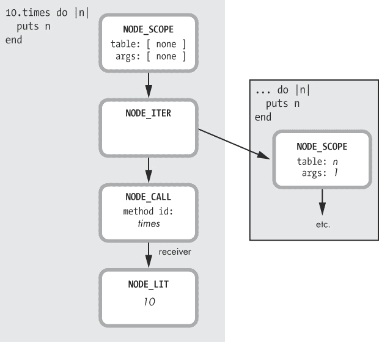

图 2-9. 调用 `10.times` 时传递块的 AST

这看起来与 `puts 2+2` 非常不同，主要是因为右侧显示的内部块。（Ruby 对内部块的处理方式不同，稍后我们会看到。）

让我们分析一下 Ruby 如何编译位于左侧的图 2-9 所示的脚本的主要部分。如同之前一样，Ruby 从第一个 `NODE_SCOPE` 开始，并创建一个新的 YARV 指令片段，如图 2-10 所示。


图 2-10. 每个 `NODE_SCOPE` 都被编译成一个新的 YARV 指令片段。

接下来，Ruby 继续遍历 AST 节点，直到 `NODE_ITER`，如图 2-11 所示。

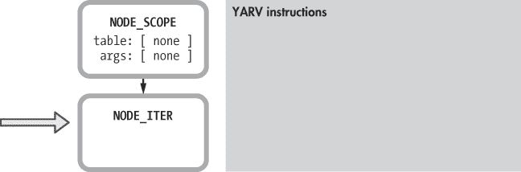

图 2-11. Ruby 遍历 AST

此时，仍然没有生成代码，但请注意在图 2-9 中，两条箭头从 `NODE_ITER` 指向：一条指向 `NODE_CALL`，表示 `10.times` 调用，另一条指向内部块。Ruby 将首先继续沿着 AST 向下编译与 `10.times` 代码对应的节点。生成的 YARV 代码遵循我们在图 2-6 中看到的相同的接收者-参数-消息模式，并在图 2-12 中显示。

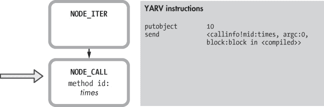

图 2-12. Ruby 编译 `10.times` 方法调用

请注意，在图 2-12 中显示的新 YARV 指令，首先将接收者（整数对象 `10`）压入栈中，然后 Ruby 生成一条指令来执行 `times` 方法调用。但同样要注意的是，`send` 指令中的 `block:block in <compiled>` 参数。这表明该方法调用还包含一个块参数：我的 `do |n| puts n end` 块。在这个例子中，`NODE_ITER` 导致 Ruby 编译器包含了这个块参数，因为上面的 AST 显示了从 `NODE_ITER` 到第二个 `NODE_SCOPE` 的箭头。

Ruby 继续编译内部块，从右侧的第二个 `NODE_SCOPE` 开始，正如在图 2-9 中所示。图 2-13 显示了内部块对应的 AST 结构。

这看起来很简单——只有一个函数调用和一个单一的参数 `n`。但请注意 `NODE_SCOPE` 中 `table` 和 `args` 的值。这些值在父 `NODE_SCOPE` 中是空的，但在内部的 `NODE_SCOPE` 中被设置了。正如你所猜测的，这些值表明了块参数 `n` 的存在。

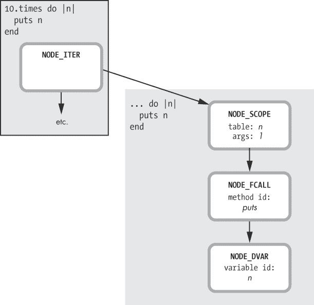

图 2-13. AST 分支，表示块的内容

还要注意，Ruby 解析器创建了 `NODE_DVAR` 而不是我们在图 2-9 中看到的 `NODE_LIT`。这是因为 `n` 不仅仅是一个字面量字符串；它是一个从父作用域传递过来的块参数。

从相对较高的层次来看，图 2-14 展示了 Ruby 如何编译内部块。

Ruby 如何遍历 AST

让我们更仔细地看看 Ruby 是如何实际遍历 AST 结构的，将每个节点转换为 YARV 指令。实现 Ruby 编译器的 MRI C 源代码文件叫做 *compile.c*。为了了解 *compile.c* 中的代码是如何工作的，我们首先查找 `iseq_compile_each` 函数。示例 2-3 显示了该函数的开头。

示例 2-3. 这个 C 函数编译了 AST 中的每个节点。

```
/**
  compile each node

  self:  InstructionSequence
  node:  Ruby compiled node
  poped: This node will be poped
 */
static int
iseq_compile_each(rb_iseq_t *iseq, LINK_ANCHOR *ret, NODE * node,
                  int poped)
{
```

这个函数非常长，包含一个非常非常长的 `switch` 语句，运行了几千行！`switch` 语句根据当前 AST 节点的类型进行分支，并生成相应的 YARV 代码。示例 2-4 显示了 `switch` 语句的开头 。

示例 2-4. 这个 C `switch` 语句查看每个 AST 节点的类型。

```
 type = nd_type(node);
    --*snip*--
 switch (type) {
```

在此语句中，`node`  是传递给 `iseq_compile_each` 的参数，而 `nd_type` 是一个 C 宏，用于返回给定节点结构的类型。

现在我们将看看 Ruby 如何使用接收者-参数-方法调用模式将函数或方法调用节点编译成 YARV 指令。首先，在 *compile.c* 中搜索 示例 2-5 中显示的 C `case` 语句。

示例 2-5. 这个 `switch` 语句的情况编译了你 Ruby 代码中的方法调用。

```
case NODE_CALL:
case NODE_FCALL:
case NODE_VCALL:{                /* VCALL: variable or call */
  /*
    call:  obj.method(...)
    fcall: func(...)
    vcall: func
  */
```

`NODE_CALL` 代表真实的方法调用（例如 `10.times`），`NODE_FCALL` 是函数调用（例如 `puts`），而 `NODE_VCALL` 是变量或函数调用。跳过一些 C 代码的细节（包括用于实现 `goto` 语句的可选 `SUPPORT_JOKE` 代码），示例 2-6 展示了 Ruby 下一步如何编译这些 AST 节点。

示例 2-6. 这段 C 代码编译了方法调用的接收者值。

```
    /* receiver */
    if (type == NODE_CALL) {
     COMPILE(recv, "recv", node->nd_recv);
    }
    else if (type == NODE_FCALL || type == NODE_VCALL) {
     ADD_CALL_RECEIVER(recv, nd_line(node));
    }
```

在这里，Ruby 调用 `COMPILE` 或 `ADD_CALL_RECEIVER`，如下所示：

+   在真实方法调用的情况下（例如 `NODE_CALL`），Ruby 调用 `COMPILE`  来递归调用 `iseq_compile_each`，继续处理与方法调用或消息的接收者对应的 AST 树中的下一个节点。这将创建 YARV 指令，用于评估用于指定目标对象的任何表达式。

+   如果没有接收者（`NODE_FCALL` 或 `NODE_VCALL`），Ruby 会调用 `ADD_CALL_RECEIVER` ，这会创建一个 `putself` YARV 指令。

接下来，正如在示例 2-7 中所示，Ruby 创建 YARV 指令将每个方法/函数调用的参数压入栈中。

示例 2-7. 这段 C 代码编译每个 Ruby 方法调用的参数。

```
    /* args */
    if (nd_type(node) != NODE_VCALL) {
     argc = setup_args(iseq, args, node->nd_args, &flag);
    }
    else {
     argc = INT2FIX(0);
    }
```

对于 `NODE_CALL` 和 `NODE_FCALL`，Ruby 会调用 `setup_args` 函数 ，该函数将在需要时递归调用 `iseq_compile_each` 以编译每个方法/函数调用的参数。对于 `NODE_VCALL`，没有参数，因此 Ruby 只需将 `argc` 设置为 0 。

最后，Ruby 创建 YARV 指令来执行实际的方法或函数调用，如下所示：

```
ADD_SEND_R(ret, nd_line(node), ID2SYM(mid),
           argc, parent_block, LONG2FIX(flag));
```

这个 C 宏将创建新的 `send` YARV 指令，当 YARV 执行它时，将导致实际的方法调用发生。

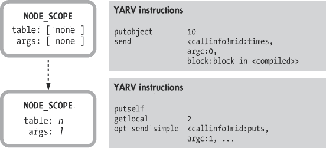

图 2-14. Ruby 如何编译对块的调用

你可以在顶部看到父级 `NODE_SCOPE`，以及来自图 2-12 的 YARV 代码。在下面，我列出了从内部块的 AST 编译的 YARV 代码。

关键点在于，Ruby 会将你程序中每个独立的作用域——例如方法、块、类或模块——编译成一段独立的 YARV 指令。

# 实验 2-1：显示 YARV 指令

查看 Ruby 如何编译代码的一个简单方法是使用 `RubyVM::InstructionSequence` 对象，它让你可以从 Ruby 程序中访问 Ruby 的 YARV 引擎！像 Ripper 工具一样，它的使用非常直接，正如你在示例 2-8 中看到的那样。

示例 2-8. 如何查看 `puts 2+2` 的 YARV 指令

```
code = <<END
puts 2+2
END
puts RubyVM::InstructionSequence.compile(code).disasm
```

挑战在于理解输出的实际含义。例如，示例 2-9 展示了 `puts 2+2` 的输出。

示例 2-9. `puts 2+2` 的 YARV 指令

```
    == disasm: <RubyVM::InstructionSequence:<compiled>@<compiled>>==========
 0000 trace            1                                               (   1)
    0002 putself
    0003 putobject        2
    0005 putobject        2
    0007 opt_plus         <callinfo!mid:+, argc:1, ARGS_SKIP>
    0009 opt_send_simple  <callinfo!mid:puts, argc:1, FCALL|ARGS_SKIP>
 0011 leave
```

如你在示例 2-9 中看到的，输出包含了从图 2-5 到图 2-8 的所有相同指令，并增加了两条新指令：`trace`  和 `leave` 。`trace` 指令用于实现 `set_trace_func` 功能，这将在程序中执行每条 Ruby 语句时调用给定的函数。`leave` 功能类似于返回语句。左侧的行号显示了每条指令在编译器实际生成的字节码数组中的位置。

`RubyVM::InstructionSequence` 使得探索 Ruby 如何编译不同 Ruby 脚本变得容易。例如，示例 2-10 演示了如何编译我的 `10.times do` 示例。

示例 2-10. 显示调用块的 YARV 指令

```
code = <<END
10.times do |n|
  puts n
end
END
puts RubyVM::InstructionSequence.compile(code).disasm
```

我现在得到的输出如下所示，在示例 2-11 中显示。注意，`send <callinfo!mid:times` YARV 指令显示了 `block:block in <compiled>` ，这表示我正在向 `10.times` 方法调用传递一个块。

示例 2-11. 调用块和块本身的 YARV 指令

```
 == disasm: <RubyVM::InstructionSequence:<compiled>@<compiled>>==========
    == catch table
    | catch type: break  st: 0002 ed: 0006 sp: 0000 cont: 0006
    |------------------------------------------------------------------------
    0000 trace            1                                               (   1)
    0002 putobject        10
 0004 send             <callinfo!mid:times, argc:0, block:block in <compiled>>
    0006 leave
 == disasm: <RubyVM::InstructionSequence:block in <compiled>@<compiled>>=
    == catch table
    | catch type: redo   st: 0000 ed: 0011 sp: 0000 cont: 0000
    | catch type: next   st: 0000 ed: 0011 sp: 0000 cont: 0011
    |------------------------------------------------------------------------
    local table (size: 2, argc: 1 [opts: 0, rest: -1, post: 0, block: -1] s3)
    [ 2] n<Arg>
    0000 trace            256                                             (   1)
    0002 trace            1                                               (   2)
    0004 putself
    0005 getlocal_OP__WC__0 2
    0007 opt_send_simple  <callinfo!mid:puts, argc:1, FCALL|ARGS_SKIP>
    0009 trace            512                                             (   3)
    0011 leave                                                            (   2)
```

正如你所看到的，Ruby 将两个 YARV 指令片段分别显示。第一个对应全局作用域 ，第二个对应内部块作用域 。

# 本地表

在图 2-3 到图 2-14 之间，你可能已经注意到，AST 中的每个 `NODE_SCOPE` 元素包含了我标记为 `table` 和 `args` 的信息。这些值存在于内部的 `NODE_SCOPE` 结构中，包含关于块参数 `n` 的信息（请参见图 2-9）。

Ruby 在解析过程中生成了关于这个块参数的信息。正如我在第一章中讨论的那样，Ruby 会使用语法规则解析块参数以及其他 Ruby 代码。实际上，我在图 1-30 中展示了解析块参数的具体规则：`opt_block_param`。

然而，一旦 Ruby 的编译器运行时，关于块参数的信息会被从 AST 中复制到另一个数据结构中，这个结构被称为*局部表格*，并保存在新生成的 YARV 指令附近。你的 Ruby 程序中的每个 YARV 指令片段，每个作用域，都有它自己的局部表格。

图 2-15 展示了 Ruby 为示例 2-2 中的示例块代码生成的 YARV 指令和附带的局部表格。

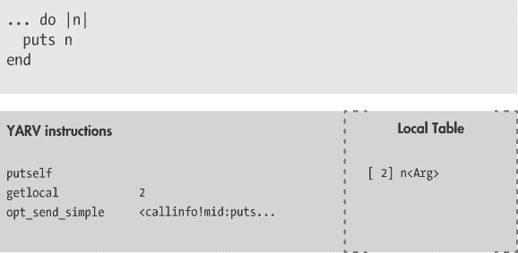

图 2-15. 一个带有局部表格的 YARV 指令片段

注意在图 2-15 的右侧，Ruby 已经将数字 2 与块参数 `n` 关联。如我们在第三章中将看到的那样，引用 `n` 的 YARV 指令将使用这个索引 2。`getlocal` 指令就是一个例子。`<Arg>` 表示该值是块的一个参数。

事实证明，Ruby 还会在这个表格中保存关于局部变量的信息，因此这个表格被称为*局部表格*。图 2-16 展示了 Ruby 在编译使用一个局部变量并接收两个参数的方法时，会生成的 YARV 指令和局部表格。

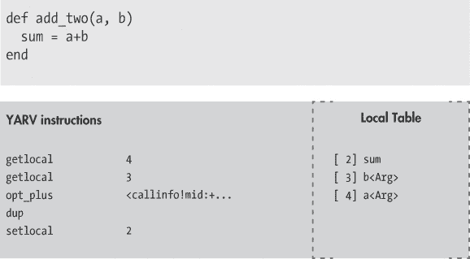

图 2-16. 这个局部表格包含一个局部变量和两个参数。

在这里，你可以看到 Ruby 在局部表格中列出了所有三个值。正如我们在第三章中将看到的那样，Ruby 以相同的方式对待局部变量和方法参数。（请注意，局部变量 `sum` 没有 `<Arg>` 标签。）

可以把本地表格看作是帮助你理解 YARV 指令的钥匙，类似于地图上的图例。如同在图 2-16 中所示，本地变量没有标签，但 Ruby 使用以下标签来描述不同类型的方法和块参数：

| **`<Arg>`** | 一个标准的函数或块参数 |
| --- | --- |
| **`<Rest>`** | 一个无名参数数组，通过 splat (`*`) 运算符一起传递 |
| **`<Post>`** | 一个出现在 splat 数组之后的标准参数 |
| **`<Block>`** | 一个 Ruby proc 对象，通过 `&` 运算符传递 |
| **`<Opt=i>`** | 定义了默认值的参数。整数值 `i` 是一个索引，指向一个存储实际默认值的表格。这个表格与 YARV 代码片段一起存储，但不在本地表格中。 |

理解本地表格显示的信息可以帮助你理解 Ruby 复杂的参数语法如何工作，以及如何充分利用这门语言。

为了帮助你理解我的意思，让我们来看一下 Ruby 如何编译一个使用无名参数数组的函数调用，如示例 2-12 所示。

示例 2-12. 一个接受标准参数和无名参数数组的方法

```
def complex_formula(a, b, *args, c)
  a + b + args.size + c
end
```

这里 `a`、`b` 和 `c` 是标准参数，`args` 是一个位于 `b` 和 `c` 之间的其他参数数组。图 2-17 展示了本地表格如何保存所有这些信息。

如同在图 2-16 中所示，`<Arg>` 代表标准参数。但现在 Ruby 使用 `<Rest>` 来表示值 3 包含“其余”参数，并使用 `<Post>` 来表示值 2 包含出现在无名数组之后的参数，即最后一个参数。

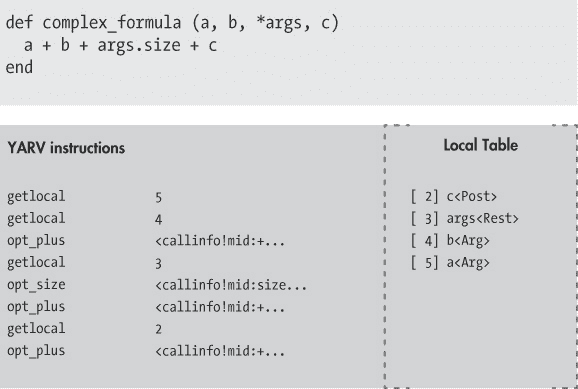

图 2-17. Ruby 将有关特殊参数的信息保存在本地表格中。

## 编译可选参数

如你所知，你可以通过在参数列表中为某个参数指定默认值，使该参数变为可选的。之后，如果你在调用方法或块时没有提供该参数的值，Ruby 会使用默认值。示例 2-13 展示了一个简单的例子。

示例 2-13. 一个接受可选参数的方法

```
def add_two_optional(a, b = 5)
  sum = a+b
end
```

如果你为 `b` 提供一个值，方法将按照以下方式使用该值：

```
puts add_two_optional(2, 2)
 => 4
```

但如果你不提供，Ruby 会将默认值 5 赋给`b`：

```
puts add_two_optional(2)
 => 7
```

在这种情况下，Ruby 需要做更多工作。默认值放在哪里？Ruby 编译器将其放在哪里？图 2-18 显示了 Ruby 如何在编译过程中生成一些额外的 YARV 指令来设置默认值。

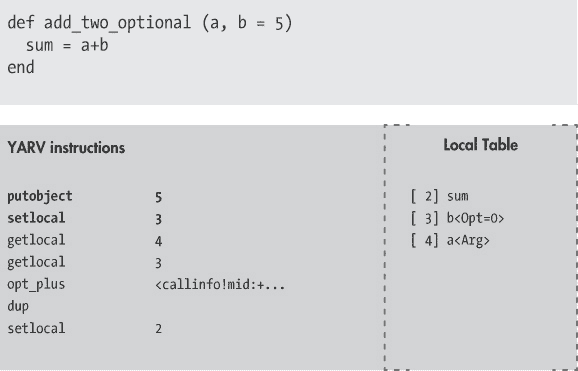

图 2-18. Ruby 的编译器生成额外的代码来处理可选参数。

Ruby 的编译器生成了加粗的 YARV 指令`putobject`和`setlocal`，在你调用方法时将`b`的值设为 5。（正如我们在第三章中看到的那样，YARV 会在你没有为`b`提供值时调用这些指令，但如果你提供了值，它们则会被跳过。）你还可以看到，Ruby 在本地表中将可选参数`b`列出为`b<Opt=0>`。这里的`0`是一个索引，指向一个存储所有参数默认值的表。Ruby 将这些数据存储在接近 YARV 代码片段的位置，而不是在本地表中本身。

## 编译关键字参数

在 Ruby 2.0 中，我们可以为每个方法或块参数指定一个名称和默认值。这样写的参数被称为*关键字参数*。例如，示例 2-14 展示了使用 Ruby 2.0 新关键字参数语法声明的相同参数`b`。

示例 2-14. 一个接受关键字参数的方法

```
def add_two_keyword(a, b: 5)
  sum = a+b
end
```

现在要为`b`提供一个值，我需要使用它的名称：

```
puts add_two_keyword(2, b: 2)
 => 4
```

或者，如果我根本不指定`b`，Ruby 将使用默认值：

```
puts add_two_keyword(2)
 => 7
```

Ruby 是如何编译关键字参数的？图 2-19 显示 Ruby 需要为方法的 YARV 代码片段添加相当多的额外代码。

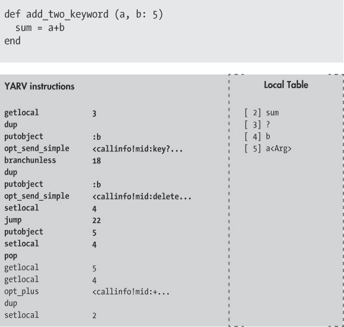

图 2-19. Ruby 编译器生成更多指令来处理关键字参数。

Ruby 的编译器生成了所有加粗的 YARV 指令，共 13 条新指令，用于实现关键字参数`b`。第三章和第四章中，我会详细讲解 YARV 的工作原理以及这些指令的实际含义，但现在，我们可以大致猜测这里发生了什么：

+   在本地表中，我们可以看到一个新的神秘值，显示为`[ 3]?`。

+   在图 2-19 的左侧，新的 YARV 指令调用了`key?`和`delete`方法。

哪个 Ruby 类包含`key?`和`delete`方法？是`Hash`。 图 2-19 显示了 Ruby 必须使用一个内部的、隐藏的哈希对象来实现关键字参数的证据。所有这些额外的 YARV 指令会自动在我的方法中添加一些逻辑，用于检查这个哈希中是否有参数`b`。如果 Ruby 在哈希中找到了`b`的值，它就使用它。如果没有，它就使用默认值 5。局部表中的神秘元素`[3]?`必须就是这个隐藏的哈希对象。

# 实验 2-2：显示局部表

除了 YARV 指令，`RubyVM::InstructionSequence` 还会显示与每个 YARV 片段或作用域相关的局部表。查找并理解你代码的局部表将帮助你理解相应的 YARV 指令的作用。在这个实验中，我们将查看`RubyVM::InstructionSequence`对象生成的输出中局部表的位置。

示例 2-15 重复了示例 2-10，来自实验 2-1：显示 YARV 指令。

示例 2-15. 显示调用块的 YARV 指令

```
code = <<END
10.times do |n|
  puts n
end
END

puts RubyVM::InstructionSequence.compile(code).disasm
```

而示例 2-16 重复了我们在实验 2-1：显示 YARV 指令中看到的输出。

示例 2-16. 除了 YARV 指令，`RubyVM::InstructionSequence` 显示局部表。

```
    == disasm: <RubyVM::InstructionSequence:<compiled>@<compiled>>==========
    == catch table
    | catch type: break  st: 0002 ed: 0006 sp: 0000 cont: 0006
    |------------------------------------------------------------------------
    0000 trace            1                                               (   1)
    0002 putobject        10
    0004 send             <callinfo!mid:times, argc:0, block:block in <compiled>>
    0006 leave
    == disasm: <RubyVM::InstructionSequence:block in <compiled>@<compiled>>=
    == catch table
    | catch type: redo   st: 0000 ed: 0011 sp: 0000 cont: 0000
    | catch type: next   st: 0000 ed: 0011 sp: 0000 cont: 0011
    |------------------------------------------------------------------------
 local table (size: 2, argc: 1 [opts: 0, rest: -1, post: 0, block: -1] s3)
 [ 2] n<Arg>
    0000 trace            256                                             (   1)
    0002 trace            1                                               (   2)
    0004 putself
    0005 getlocal_OP__WC__0 2
    0007 opt_send_simple  <callinfo!mid:puts, argc:1, FCALL|ARGS_SKIP>
    0009 trace            512                                             (   3)
    0011 leave                                                            (   2)
```

在内层作用域的 YARV 代码片段——即块——上方，我们可以看到其局部表的信息，位于 。这显示了表的总大小（`size: 2`）、参数计数（`argc: 1`）以及其他关于参数类型的信息（`opts: 0, rest: -1, post: 0`）。

第二行  显示了局部表的实际内容。在这个示例中，我们只有一个参数，`n`。

示例 2-17 展示了如何以相同的方式使用`RubyVM::InstructionSequence`来编译我的未命名参数示例，参考示例 2-12。

示例 2-17. 该方法使用带星号操作符的未命名参数。

```
code = <<END
def complex_formula(a, b, *args, c)
  a + b + args.size + c
end
END

puts RubyVM::InstructionSequence.compile(code).disasm
```

而示例 2-18 展示了输出结果。

示例 2-18. 显示调用块的 YARV 指令输出

```
 == disasm: <RubyVM::InstructionSequence:<compiled>@<compiled>>==========
    0000 trace            1                                               (   1)
    0002 putspecialobject 1
    0004 putspecialobject 2
    0006 putobject        :complex_formula
    0008 putiseq          complex_formula
 0010 opt_send_simple  <callinfo!mid:core#define_method, argc:3, ARGS_SKIP>
    0012 leave
    == disasm: <RubyVM::InstructionSequence:complex_formula@<compiled>>=====
 local table (size: 5, argc: 2 [opts: 0, rest: 2, post: 1, block: -1] s0)
 [ 5] a<Arg>     [ 4] b<Arg>     [ 3] args<Rest> [ 2] c<Post>
    0000 trace            8                                               (   1)
    0002 trace            1                                               (   2)
    0004 getlocal_OP__WC__0 5
    0006 getlocal_OP__WC__0 4
    0008 opt_plus         <callinfo!mid:+, argc:1, ARGS_SKIP>
    0010 getlocal_OP__WC__0 3
    0012 opt_size         <callinfo!mid:size, argc:0, ARGS_SKIP>
    0014 opt_plus         <callinfo!mid:+, argc:1, ARGS_SKIP>
    0016 getlocal_OP__WC__0 2
    0018 opt_plus         <callinfo!mid:+, argc:1, ARGS_SKIP>
    0020 trace            16                                              (   3)
    0022 leave                                                            (   2)
```

顶层 YARV 作用域，位于附近，展示了 YARV 用来定义新方法的指令。请注意在处调用了`core#define_method`，这是一个 YARV 用于创建 Ruby 新方法的内部 C 函数。这对应于我脚本中调用`def complex_formula`的部分。（我将在第五章、第六章和第九章中更详细地讨论 Ruby 是如何实现方法的。）

请注意位于处的较低 YARV 片段的局部表。此行现在显示了更多关于未命名参数（`rest: 2`）和它们后面的最后一个标准参数（`post: 1`）的信息。最后，位于的这一行显示了我之前在图 2-17 中展示的局部表内容。

# 总结

在本章中，我们学习了 Ruby 是如何编译我们的代码的。你可能认为 Ruby 是一个动态脚本语言，但事实上，它使用的编译器和 C、Java 以及许多其他编程语言一样。明显的区别在于，Ruby 的编译器自动在后台运行；你不需要担心编译 Ruby 代码。

我们已经了解到，Ruby 的编译器通过遍历由分词和解析过程生成的抽象语法树（AST）来工作，并在此过程中生成一系列字节码指令。Ruby 将您的代码从 Ruby 语言转换为专门为 YARV 虚拟机量身定制的语言，它会将 Ruby 程序中的每个作用域或部分编译成一组或一段 YARV 指令。您程序中的每个块、方法、lambda 或其他作用域都有一组对应的字节码指令。

我们也已经了解了 Ruby 如何处理不同类型的参数。我们能够使用本地表作为一个关键或图例，帮助理解哪些 YARV 指令访问了哪些参数或局部变量。并且我们看到了 Ruby 的编译器如何生成额外的特殊 YARV 指令来处理可选参数和关键字参数。

在第三章中，我将开始解释 YARV 如何执行编译器生成的指令——也就是 YARV 如何执行你的 Ruby 程序。
