# 第三章：Ruby 如何执行你的代码

> 
> 
> *YARV 不仅仅是一个栈机器——它是一个双栈机器！*

现在 Ruby 已经对你的代码进行了标记化、解析和编译，终于准备好执行它了。但它究竟是如何执行的呢？我们已经看到 Ruby 编译器是如何创建 YARV（又一个 Ruby 虚拟机）指令的，但 YARV 是如何实际执行这些指令的呢？它是如何跟踪变量、返回值和参数的？它是如何实现 `if` 语句和其他控制结构的？

Koichi Sasada 和 Ruby 核心团队设计了 YARV，使其使用栈指针和程序计数器——也就是说，像计算机的实际微处理器一样工作。在本章中，我将探讨 YARV 指令的基础知识；具体来说，它们是如何从内部栈中弹出参数并将返回值推送到栈上的。我们还将看到 YARV 如何跟踪你的 Ruby 调用栈以及它自己的内部栈。我将解释 Ruby 如何访问局部变量，以及它如何通过动态访问找到调用栈更深层次的变量。最后，我们将了解 Ruby 如何实现特殊变量。在第四章中，我将继续讨论 YARV，分析它是如何实现控制结构和方法分发的。

路线图

+   YARV 的内部栈与你的 Ruby 栈

    +   逐步了解 Ruby 如何执行一个简单脚本

    +   执行对块的调用

    +   仔细查看 YARV 指令

+   **实验 3-1：基准测试 Ruby 2.0 和 Ruby 1.9 与 Ruby 1.8 的性能**

    +   Ruby 变量的局部和动态访问

    +   局部变量访问

    +   方法参数像局部变量一样处理

    +   动态变量访问

    +   在 C 中爬升环境指针阶梯

+   **实验 3-2：探索特殊变量**

    +   特殊变量的权威列表

+   总结

# YARV 的内部栈和你的 Ruby 栈

正如我们稍后会看到的，YARV 在内部使用栈来追踪中间值、参数和返回值。YARV 是一个栈导向的虚拟机。

除了它自身的内部栈，YARV 还会追踪你的 Ruby 程序的*调用栈*，记录哪些方法调用了哪些其他方法、函数、块、lambda 等等。事实上，YARV 不仅仅是一个栈机——它是一个双栈机！它不仅需要追踪自己内部指令的参数和返回值，还要追踪你 Ruby 程序的参数和返回值。

图 3-1 展示了 YARV 的基本寄存器和内部栈。

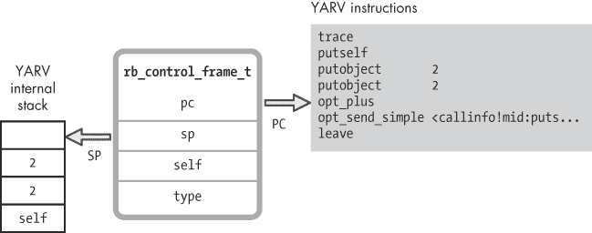

图 3-1. YARV 的一些内部寄存器，包括程序计数器和栈指针

YARV 的内部栈位于左侧。`SP`标签表示*栈指针*，即栈顶的位置。右侧是 YARV 正在执行的指令。`PC`是*程序计数器*，即当前指令的位置。

你可以在图 3-1 的右侧看到 Ruby 从`puts 2+2`示例编译出的 YARV 指令。YARV 将`SP`和`PC`寄存器存储在一个名为`rb_control_frame_t`的 C 结构体中，同时还包含一个`type`字段、Ruby 的`self`变量的当前值以及一些未在此展示的其他值。

与此同时，YARV 还维护着另一组`rb_control_frame_t`结构体栈，如图 3-2 所示。

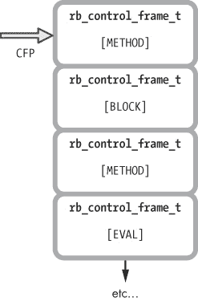

图 3-2. YARV 通过一系列`rb_control_frame_t 结构体`来追踪你的 Ruby 调用栈。

这第二个`rb_control_frame_t`结构体栈代表了 YARV 在执行你的 Ruby 程序时的路径以及当前的位置。换句话说，这就是你的 Ruby 调用栈——如果你运行`puts caller`，你会看到的内容。

`CFP`指针表示*当前帧指针*。你 Ruby 程序栈中的每一个栈帧依次包含不同的`self`、`PC`和`SP`寄存器的值，如图 3-1 所示。每个`rb_control_frame_t`结构中的`type`字段表示在 Ruby 调用栈的这个级别上正在运行的代码类型。当 Ruby 调用方法、块或其他程序结构时，`type`可能被设置为`METHOD`、`BLOCK`或其他一些值。

## 分步解析 Ruby 如何执行一个简单的脚本

为了帮助你更好地理解，下面是一些示例。我将从第一章和第二章中的简单`2+2`示例开始，并在示例 3-1 中再次展示。

示例 3-1. 我们将执行的一个单行 Ruby 程序

```
puts 2+2
```

这个单行的 Ruby 脚本没有 Ruby 调用栈，所以我现在将重点介绍 YARV 的内部栈。图 3-3 展示了 YARV 如何执行该脚本，从第一条指令`trace`开始。

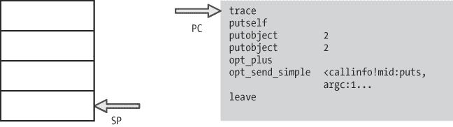

图 3-3. 左侧是 YARV 的内部栈，右侧是我编译后的`puts 2+2`程序。

如图 3-3 所示，YARV 将程序计数器（`PC`）设置为第一条指令，最初栈是空的。接下来，YARV 将执行`trace`指令，递增`PC`寄存器，如图 3-4 所示。

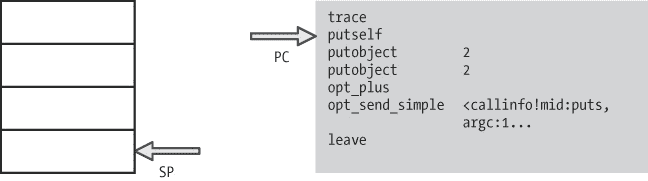

图 3-4. Ruby 执行第一条指令`trace`。

Ruby 使用`trace`指令来支持`set_trace_func`功能。如果你调用`set_trace_func`并提供一个函数，Ruby 将在每次执行一行 Ruby 代码时调用它。

接下来，YARV 执行`putself`，并将当前`self`的值推入栈中，如图 3-5 所示。


图 3-5. `putself` 将 `top self` 值推入栈中。

由于这个简单脚本不包含 Ruby 对象或类，`self` 指针被设置为默认的 `top self` 对象。这是 Ruby 在 YARV 启动时自动创建的 `Object` 类的一个实例。它作为方法调用的接收者，并且作为顶层作用域中的实例变量容器。`top self` 对象包含一个预定义的 `to_s` 方法，它返回字符串 `main`。你可以通过在控制台中运行以下命令来调用这个方法：

```
$ **ruby -e 'puts self'**
 => main
```

当 YARV 执行 `opt_send_simple` 指令时，它将使用栈中的 `self` 值：`self` 是 `puts` 方法的接收者，因为我没有为此方法调用指定接收者。

接下来，YARV 执行 `putobject 2`。它将数值 `2` 推入栈中，并再次增加 `PC`，如图 3-6 所示。


图 3-6. Ruby 将值 `2` 推入栈中，作为 `+` 方法的接收者。

这是接收者（参数）操作模式的第一步，描述在 如何 Ruby 编译一个简单脚本 中。首先，Ruby 将接收者推入内部 YARV 栈中。在这个例子中，`Fixnum` 对象 `2` 是 `+` 消息/方法的接收者，它接受一个参数，也是 `2`。接下来，Ruby 推入参数 `2`，如图 3-7 所示。


图 3-7. Ruby 将另一个值 `2` 推入栈中，作为 `+` 方法的参数。

最后，Ruby 执行 `+` 操作。在这种情况下，`opt_plus` 是一条优化指令，将会加法运算两个值：接收者和参数，如图 3-8 所示。


图 3-8. `opt_plus` 指令计算 2 + 2 = 4。

如你在图 3-8 中看到的，`opt_plus` 指令将结果`4`保留在栈顶。现在，Ruby 完美地准备好执行 `puts` 函数调用：接收者 `self` 位于栈的最底层，单一参数 `4` 位于栈顶。（我将在第六章中描述方法查找的工作原理。）

接下来，图 3-9 展示了 Ruby 执行 `puts` 方法调用时发生的情况。如你所见，`opt_send_simple` 指令将返回值 `nil` 留在栈顶。最后，Ruby 执行最后一条指令 `leave`，这完成了我们简单的一行 Ruby 程序的执行。当然，当 Ruby 执行 `puts` 调用时，实际执行 `puts` 函数的 C 代码会在控制台输出中显示值 `4`。


图 3-9. Ruby 在 `top self` 对象上调用 `puts` 方法。

## 执行对块的调用

接下来让我们看看 Ruby 调用栈是如何工作的。在示例 3-2 中，您将看到一个稍微复杂一点的示例，这是一个简单的 Ruby 脚本，调用块 10 次，并打印出一个字符串。

示例 3-2. 本示例程序调用块 10 次。

```
10.times do
  puts "The quick brown fox jumps over the lazy dog."
end
```

让我们跳过一些步骤，直接开始从 YARV 即将调用 `times` 方法的位置，如图 3-10 所示。

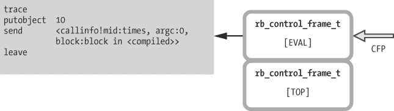

图 3-10. 每个 Ruby 程序都从这两个控制帧开始。

图中左侧显示的是 Ruby 正在执行的 YARV 指令。右侧则展示了两个控制帧结构。

在栈底，您会看到一个类型设置为 `TOP` 的控制帧。Ruby 在启动新程序时总是首先创建此帧。在栈顶，至少最初，类型为 `EVAL` 的帧对应于 Ruby 脚本的顶层或主作用域。

接下来，Ruby 调用 `Fixnum` 对象 `10` 上的 `times` 消息——`times` 消息的接收者。当 Ruby 这么做时，它在控制帧栈中添加了一个新的层级，如图 3-11 所示。

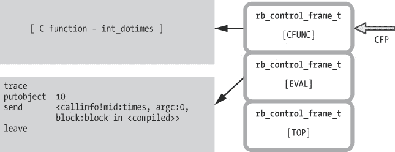

图 3-11. Ruby 在调用 C 实现的内建函数时使用 `CFUNC` 框架。

这个新条目（位于图 3-11 的右侧）表示程序 Ruby 调用堆栈中的一个新级别，`CFP` 指针已上移，指向新的控制框架结构。此外，注意到由于 `Integer#times` 方法是 Ruby 内建的，因此没有针对它的 YARV 指令。相反，Ruby 会调用一些内部 C 代码，从堆栈中弹出参数 `10`，并调用提供的块 10 次。Ruby 给这个控制框架的类型是 `CFUNC`。

最后，图 3-12 显示了如果我们在内部块暂停程序时，YARV 和控制框架堆栈的样子。


图 3-12. 当我们在 示例 3-2 的块内部暂停代码时的 `CFP` 堆栈

现在，控制框架堆栈右侧将有四个条目，如下所示：

+   Ruby 启动时总是存在的 `TOP` 和 `EVAL` 框架

+   调用 `10.times` 的 `CFUNC` 框架

+   堆栈顶部的 `BLOCK` 框架，表示块内部运行的代码

仔细看看一个 YARV 指令

和处理其他大多数事物一样，Ruby 使用 C 代码实现所有 YARV 指令，如 `putobject` 或 `send`，然后将其编译为机器语言，直接由硬件执行。然而，奇怪的是，您不会在 C 源文件中找到每个 YARV 指令的 C 源代码。相反，Ruby 核心团队将 YARV 指令的 C 代码放在一个名为 `insns.def` 的大文件中。示例 3-3 显示了 *insns.def* 中的一小段代码，Ruby 在其中实现了 `putself` YARV 指令。

示例 3-3. *`putself`* YARV 指令的定义

```
    /**
      @c put
      @e put self.
      @j スタックに self をプッシュする。
     */
    DEFINE_INSN
    putself
    ()
    ()
    (VALUE val)
    {
   val = GET_SELF();
    }
```

这看起来根本不像 C，实际上，大部分内容不是 C 代码。相反，您在这里看到的是一些 C 代码（`val = GET_SELF()`），出现在  下方，紧跟在 `DEFINE_INSN` 调用之后。

`DEFINE_INSN` 代表 *定义指令*，这并不难理解。事实上，在 Ruby 构建过程中，Ruby 会处理并将 *insns.def* 文件转换为真正的 C 代码，这类似于 Bison 将 *parse.y* 文件转换为 *parse.c*，如 图 3-13 所示。

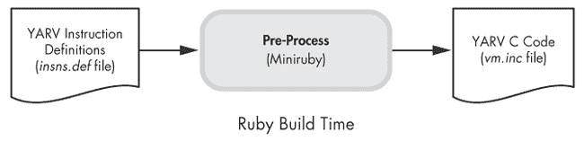

图 3-13：Ruby 在构建过程中将 YARV 指令定义脚本 *`insns.def`* 编译成 C 代码。

Ruby 使用 Ruby 处理 *insns.def* 文件：构建过程首先编译一个称为 *Miniruby* 的较小版本，然后使用它运行一些 Ruby 代码，这些代码处理 *insns.def* 并将其转换为一个名为 *vm.inc* 的 C 源代码文件。稍后，Ruby 构建过程将 *vm.inc* 交给 C 编译器，C 编译器将生成的 C 代码包含在 Ruby 最终的编译版本中。

示例 3-4 展示了 Ruby 处理后，*vm.inc* 中 `putself` 的代码片段样子。

示例 3-4：`putself` 的定义在 Ruby 构建过程中被转换成这段 C 代码。

```
    INSN_ENTRY(putself){
    {
      VALUE val;
      DEBUG_ENTER_INSN("putself");
   ADD_PC(1+0);
      PREFETCH(GET_PC());
      #define CURRENT_INSN_putself 1
      #define INSN_IS_SC()     0
      #define INSN_LABEL(lab)  LABEL_putself_##lab
      #define LABEL_IS_SC(lab) LABEL_##lab##_##t
      COLLECT_USAGE_INSN(BIN(putself));
    {
    #line 282 "insns.def"
     val = GET_SELF();
    #line 408 "vm.inc"
      CHECK_VM_STACK_OVERFLOW(REG_CFP, 1);
   PUSH(val);
    #undef CURRENT_INSN_putself
    #undef INSN_IS_SC
    #undef INSN_LABEL
    #undef LABEL_IS_SC
      END_INSN(putself);}}}
```

单行代码 `val = GET_SELF()` 出现在列表的中间位置，如图所示 。在这行代码的上下，Ruby 调用了几个不同的 C 宏来执行各种操作，比如在  处将 `1` 加到程序计数器（`PC`）寄存器中，以及在  处将 `val` 值推送到 YARV 内部堆栈中。如果你查看 *vm.inc*，你会看到这段 C 代码会为每个 YARV 指令的定义重复多次。

*vm.inc* C 源代码文件，又被 *vm_exec.c* 文件包含，该文件包含了主要的 YARV 指令循环，逐条执行程序中的 YARV 指令，并调用每个指令对应的 C 代码。

# 实验 3-1：基准测试 Ruby 2.0 与 Ruby 1.9 和 Ruby 1.8 的性能

Ruby 核心团队在 Ruby 1.9 中引入了 YARV 虚拟机。更早版本的 Ruby 通过直接遍历 *抽象语法树（AST）* 的节点来执行程序。当时没有编译步骤：Ruby 只是将代码分词、解析，然后立即执行。

Ruby 1.8 运行得非常顺畅。事实上，多年来它一直是最常用的版本。那么，为什么 Ruby 核心团队要额外编写一个编译器和新的虚拟机呢？答案是：速度。使用 YARV 执行已编译的 Ruby 程序比直接遍历抽象语法树（AST）要快得多。

YARV 快多少？让我们来看看！在这个实验中，我们将通过执行示例 3-5 中显示的非常简单的 Ruby 脚本，测量 Ruby 2.0 和 1.9 相较于 Ruby 1.8 的执行速度。

示例 3-5。用于基准测试 Ruby 2.0 和 Ruby 1.9 相对于 Ruby 1.8 的简单测试脚本

```
i = 0
while i < ARGV[0].to_i
  i += 1
end
```

这个脚本从命令行通过`ARGV`数组接收一个计数值，然后在一个`while`循环中迭代，直到达到该值。这个 Ruby 脚本非常简单：通过测量在不同的`ARGV[0]`值下执行该脚本所需的时间，我们应该能很好地判断执行 YARV 指令是否比迭代 AST 节点更快。（没有涉及数据库调用或其他外部代码。）

我们可以使用 Unix 的`time`命令来测量 Ruby 执行一次迭代所需的时间：

```
$ **time ruby benchmark1.rb** 1
ruby benchmark1.rb 1  0.02s user 0.00s system 92% cpu 0.023 total
```

十次：

```
$ **time ruby benchmark1.rb 10**
ruby benchmark1.rb 10  0.02s user 0.00s system 94% cpu 0.027 total
```

依此类推。

图 3-14 显示了 Ruby 1.8.7、1.9.3 和 2.0 在对数坐标图上的测量时间。

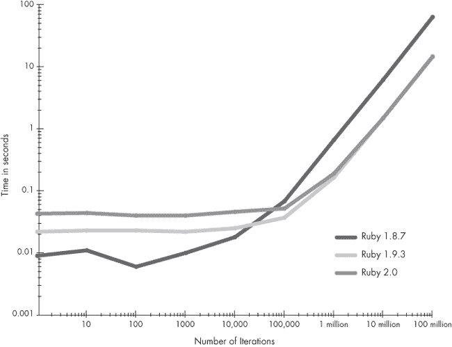

图 3-14。Ruby 1.8.7 与 Ruby 1.9.3 和 Ruby 2.0 的性能对比；时间（秒）与迭代次数的对数坐标图

从图表来看，你可以看到对于短生命周期的进程，比如迭代次数较少的循环（参见图 3-14 的左侧部分），Ruby 1.8.7 实际上比 Ruby 1.9.3 和 2.0 更快，因为不需要将 Ruby 代码编译成 YARV 指令。相反，在对代码进行词法分析和语法解析后，Ruby 1.8.7 立即执行它。图表左侧 Ruby 1.8.7 和 Ruby 1.9.3、2.0 之间的时间差，大约是 0.01 秒，告诉我们 Ruby 1.9.3 或 2.0 需要多长时间将脚本编译成 YARV 指令。你还可以看到，Ruby 2.0 实际上比 Ruby 1.9.3 在短循环中的执行速度稍慢。

然而，在约 11,000 次迭代后，Ruby 1.9.3 和 2.0 的速度更快。这个交叉点出现在通过执行 YARV 指令提供的额外速度开始发挥作用，并弥补了编译时所花费的额外时间。对于长时间运行的进程，例如包含大量迭代的循环（见 图 3-14), Ruby 1.9 和 2.0 的速度约为原来的 4.25 倍！此外，我们可以看到，Ruby 2.0 和 1.9.3 在许多迭代中执行 YARV 指令的速度完全相同。

在 图 3-14 中，这一速度提升在对数图表上看起来并不显著，但如果我们改用线性刻度重新绘制图表的右侧，就像在 图 3-15 中所示，效果就很明显了。

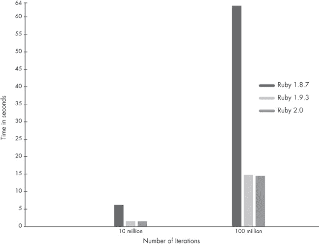

图 3-15. Ruby 1.8.7 与 Ruby 1.9.3 与 Ruby 2.0 性能对比；10 亿或 1 亿次迭代的时间（以秒为单位），使用线性刻度

差异非常明显！使用 Ruby 1.9.3 或 Ruby 2.0 和 YARV 执行这个简单的 Ruby 脚本，比使用没有 YARV 的 Ruby 1.8.7 快大约 4.25 倍。

# Ruby 变量的局部与动态访问

在上一节中，我们看到 Ruby 维护了 YARV 使用的内部栈以及你的 Ruby 程序调用栈。但在这两个代码示例中，显然有一样东西被遗漏了：变量。两个脚本都没有使用任何 Ruby 变量。一个更现实的示例程序会多次使用变量。那么 Ruby 如何在内部处理变量？它们存储在哪里？

Ruby 将你保存在变量中的所有值存储在 YARV 的栈上，连同 YARV 指令的参数和返回值。然而，访问这些变量并不简单。Ruby 在内部使用两种非常不同的方法来保存和检索你保存在变量中的值：*局部访问* 和 *动态访问*。

## 局部变量访问

每当你进行方法调用时，Ruby 会在 YARV 栈上为你调用的该方法中的任何局部变量预留空间。Ruby 通过查阅在编译步骤中为每个方法创建的 *局部表* 来知道你使用了多少变量，详见 局部表。

例如，假设我们编写了你在图 3-16 中看到的那个傻乎乎的 Ruby 函数。

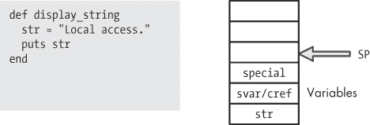

图 3-16. 使用局部变量的示例 Ruby 脚本

Ruby 代码位于图形的左侧；右侧是一个展示 YARV 栈和栈指针的示意图。你可以看到，Ruby 将变量保存在栈上，位于栈指针下方。（请注意，栈上为 `str` 值预留了一个空间，位于栈指针下方的三个槽，即 `SP-3`。）

Ruby 使用 `svar/cref` 来包含以下两者之一：要么是指向当前方法中特殊变量表的指针（例如，`$!` 表示 *最后的异常消息*，`$&` 表示 *最后的正则表达式匹配*），要么是指向当前词法作用域的指针。*词法作用域* 表示你当前正在为哪个类或模块添加方法。（在实验 3-2：探索特殊变量中，我们将更详细地探索特殊变量，而在第六章中，我会进一步讨论词法作用域。）Ruby 使用第一个槽——`special` 变量——来跟踪与块相关的信息。（稍后我们将讨论动态变量访问时进一步讲解。）

当示例代码将一个值保存到 `str` 时，Ruby 只需要将该值写入栈上的相应空间，如图 3-17 所示。

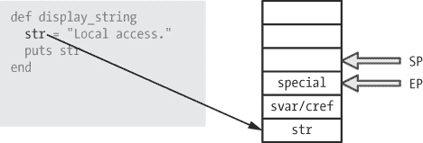

图 3-17. Ruby 将局部变量保存在栈上，接近环境指针（EP）。

为了在内部实现这一点，YARV 使用了一个类似于栈指针的指针，称为 `EP` 或 *环境指针*。它指向当前方法的局部变量在栈上的位置。最初，`EP` 设置为 `SP-1`。随着 YARV 执行指令，`SP` 的值会变化，而 `EP` 的值通常保持不变。

图 3-18 展示了 Ruby 将我的 `display_string` 函数编译成的 YARV 指令。

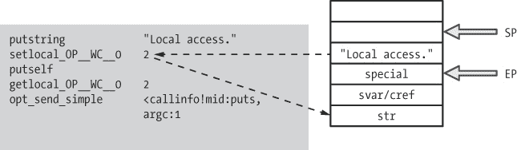

图 3-18. `display_string` 方法编译成 YARV 指令

Ruby 使用 `setlocal` YARV 指令来设置局部变量的值。然而，在图 3-18 中，我展示了一条名为 `setlocal_OP__WC__0` 的指令，而不是 `setlocal`。

事实证明，从 2.0 版本开始，Ruby 使用一个优化过的指令，这个令人困惑的名字代替了简单的 `setlocal`。不同之处在于，Ruby 2.0 将指令的一个参数 `0` 包含在了指令名称本身中。

从内部来看，Ruby 2.0 将此称为 *操作数* 优化。（在优化后的指令名称中，*OP* 代表 *操作数*，*WC* 代表 *通配符*。）换句话说，`getlocal_OP__WC__0` 等同于 `getlocal *, 0`，而 `setlocal_OP__WC__0` 与 `setlocal *, 0` 相同。现在，该指令只需要一个参数，如 `*` 所示。这个技巧使得 Ruby 2.0 节省了一些时间，因为它不需要单独传递 `0` 作为参数。

但为了简化问题，我们暂时忽略操作数优化。图 3-19 重复了我的例子的 YARV 指令，但显示了 `getlocal` 和 `setlocal`，并且第二个操作数是正常列出的。

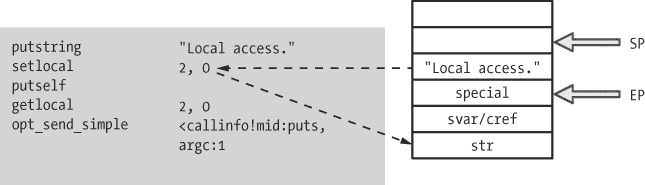

图 3-19. 未进行操作数优化时的 `display_string` 编译版本

这样更容易理解。正如你所看到的，首先，`putstring` 指令将 `Local access` 字符串保存在栈顶，并增加 `SP` 指针。然后，YARV 使用 `setlocal` 指令获取栈顶的值，并将其保存在栈上为 `str` 局部变量分配的空间中。图 3-19 左侧的两个虚线箭头显示了 `setlocal` 指令复制值的过程。这种操作叫做 *局部变量访问*。

为了确定设置哪个变量，`setlocal` 使用 `EP` 指针和作为第一个参数提供的数字索引。在本例中，这将是 `str 的地址 = EP-2`。我们将在动态变量访问中讨论第二个参数 `0` 的含义。

接下来，对于 `puts str` 的调用，Ruby 使用 `getlocal` 指令，如图 3-20 所示。

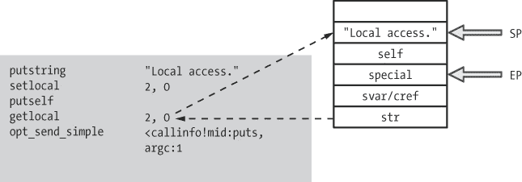

图 3-20. 使用 `getlocal` 获取局部变量的值

在这里，Ruby 将字符串值推送回栈顶，可以作为调用 `puts` 函数的参数使用。同样，`getlocal` 的第一个参数 `2` 表示访问哪个局部变量。Ruby 使用局部变量表来查找 `2` 对应的是变量 `str`。

## 方法参数像局部变量一样处理

传递一个*方法参数*的方式与访问局部变量相同，如图 3-21 所示。

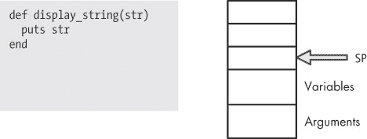

图 3-21. Ruby 像处理局部变量一样将方法参数保存在栈上。

方法参数本质上与局部变量相同。两者之间的唯一区别是调用代码在方法调用之前就将参数推送到栈上。在这个示例中没有局部变量，但唯一的参数出现在栈上，像局部变量一样，如图 3-22 所示。

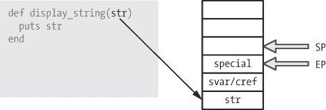

图 3-22. 调用代码在方法调用前保存参数值。

## 动态变量访问

现在让我们看看动态变量访问是如何工作的，以及那个 `special` 值是什么。Ruby 使用动态访问时，当你使用在其他作用域中定义的变量时——例如，当你编写一个引用周围代码中值的块时。示例 3-6 展示了一个示例。

示例 3-6. 块中的代码访问周围方法中的 `str`。

```
def display_string
  str = "Dynamic access."
  10.times do
    puts str
  end
end
```

这里，`str` 是 `display_string` 中的局部变量。如图 3-23 所示，Ruby 会使用 `setlocal` 指令保存 `str`，就像我们在图 3-18 中看到的一样。


图 3-23. Ruby 像往常一样将 `str` 局部变量的值保存在栈上。

接下来，Ruby 将调用 `10.times` 方法，并将一个块作为参数传入。让我们逐步了解调用带有块的方法的过程。图 3-24 展示了我们在 图 3-10、图 3-11 和 图 3-12 中看到的相同过程，不过它提供了更多关于 YARV 内部栈的细节。

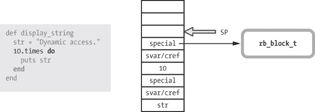

图 3-24. 当 Ruby 调用一个方法并传入块时，它会将指向新的 `rb_block_t` 结构体的指针保存在新栈帧中的特殊值。

注意栈上的值 `10`：这是 `times` 方法的实际接收者。还要注意，Ruby 为实现 `Integer#times` 的 C 代码创建了一个新的栈帧，栈帧中的 `svar/cref` 和 `special` 变量位于值 `10` 之上。因为我们传递了一个块作为方法调用的参数，Ruby 会在新栈帧中的 `special` 变量中保存指向该块的指针。YARV 栈上的每个方法调用帧都通过这个 `special` 变量来跟踪是否存在块参数。（我将在 第八章 中更详细地讨论块和 `rb_block_t` 结构。）

现在，`Integer#times` 方法会调用块中的代码 10 次。图 3-25 展示了 Ruby 执行块内代码时，YARV 栈的状态。

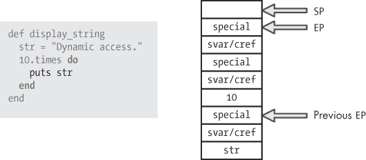

图 3-25. 如果我们在块内部暂停执行，YARV 栈会是什么样子

就像我们在 Figure 3-17")到 Figure 3-22 中看到的那样，Ruby 将`EP`设置为指向每个栈帧中`special`值的位置。Figure 3-25 展示了两个`EP`值，一个是用于块的新栈帧，位于栈顶，另一个是位于原始方法栈帧中的`EP`，位于栈底。在 Figure 3-25 中，第二个指针被标记为*Previous EP*。

现在，Ruby 执行块内部的`puts str`代码时会发生什么呢？Ruby 需要获取局部变量`str`的值，并将其作为参数传递给`puts`函数。但请注意，在 Figure 3-25 中，`str` 位于栈的下方。它不是块内部的局部变量，而是周围方法`display_string`中的变量。Ruby 如何在执行块内代码时从栈下方获取该值呢？

这就是动态变量访问的作用，也是为什么 Ruby 需要每个栈帧中的这些`special`值。Figure 3-26 展示了动态变量访问是如何工作的。

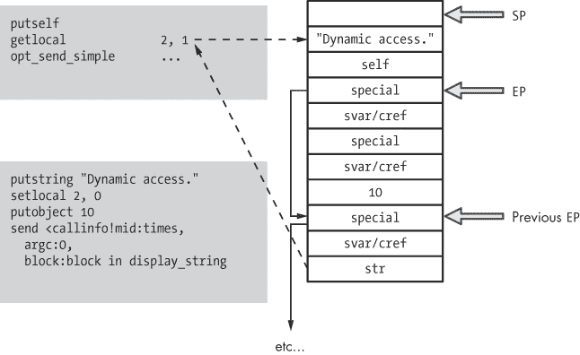

图 3-26. Ruby 使用动态变量访问从栈下方获取 `str` 的值

虚线箭头表示动态变量访问：`getlocal` YARV 指令将`str`的值从下方的栈帧（来自父级或外部 Ruby 作用域）复制到栈顶，块可以访问它。请注意，`EP`指针形成了一种阶梯，Ruby 可以沿着这条阶梯向上爬，以访问父作用域、祖父作用域等中的局部变量。

在 Figuere 3-26 中的`getlocal 2, 1`调用中，第二个参数`1`告诉 Ruby 从哪里找到变量。在这个例子中，Ruby 将沿着`EP`指针的阶梯向下移动一层，找到`str`。也就是说，`1`表示从块的作用域步进到周围方法的作用域。

示例 3-7 展示了另一个动态变量访问的例子。

示例 3-7. 在此示例中，Ruby 会通过动态变量访问步进两级栈来查找*str*。

```
def display_string
  str = "Dynamic access."
  10.times do
    10.times do
      puts str
    end
  end
end
```

如果我有两个嵌套的代码块，如示例 3-7 所示，Ruby 会使用`getlocal 2, 2`而不是`getlocal 2, 1`。

在 C 语言中爬升环境指针阶梯

让我们来看一下`getlocal`的实际 C 语言实现。与大多数 YARV 指令一样，Ruby 在*insns.def*代码文件中实现了`getlocal`，使用了示例 3-8 中的代码。

示例 3-8. `getlocal` YARV 指令的 C 语言实现

```
    /**
      @c variable
      @e Get local variable (pointed by `idx' and `level').
         'level' indicates the nesting depth from the current block.
      @j level, idx で指定されたローカル変数の値をスタックに置く。
         level はブロックのネストレベルで、何段上かを示す。
     */
    DEFINE_INSN
    getlocal
    (lindex_t idx, rb_num_t level)
    ()
    (VALUE val)
    {
        int i, lev = (int)level;
     VALUE *ep = GET_EP();

        for (i = 0; i < lev; i++) {
         ep = GET_PREV_EP(ep);
        }
     val = *(ep - idx);
    }
```

首先，`GET_EP`宏返回当前作用域的`EP`。（此宏在*vm_insnhelper.h*文件中定义，此外还有许多与 YARV 指令相关的其他宏。）接下来，Ruby 遍历`EP`指针，从当前作用域移动到父作用域，然后再从父作用域移动到祖父作用域，反复取消引用`EP`指针。Ruby 使用`GET_PREV_EP`宏在处（同样在*vm_insnhelper.h*中定义）从一个`EP`移动到另一个。`level`参数告诉 Ruby 需要迭代多少次，或者爬升多少级阶梯。

最后，Ruby 使用`idx`参数在处获取目标变量，该参数是目标变量的索引。因此，这行代码从目标变量获取值。

```
val = *(ep – idx);
```

这段代码意味着以下内容：

+   从之前通过`GET_PREV_EP`迭代获取的目标作用域`ep`的`EP`地址开始。

+   从这个地址减去`idx`。整数值`idx`给`getlocal`提供了你想要从局部表中加载的局部变量的索引。换句话说，它告诉`getlocal`目标变量在栈上有多深。

+   从调整后的地址获取 YARV 栈中的值。

因此，在图 3-26 中对`getlocal`的调用中，YARV 会从 YARV 栈上一级的作用域获取`EP`，并减去索引值`str`（在此案例中是`2`），以获取指向`str`变量的指针。

```
getlocal 2, 1
```

# 实验 3-2：探索特殊变量

在 图 3-16 到 图 3-26 中，我向你展示了在栈的 `EP-1` 位置上一个名为 `svar/cref` 的值。这两个值是什么，Ruby 如何在栈的一个位置保存两个值？更重要的是，为什么 Ruby 要这样做？让我们一探究竟。

通常，栈中的 `EP-1` 插槽将包含 `svar` 值，这是指向该栈帧中定义的任何特殊变量的表的指针。在 Ruby 中，*特殊变量* 是指 Ruby 根据环境或最近的操作自动创建的值。例如，Ruby 将 `$*` 设置为 `ARGV` 数组，将 `$!` 设置为最后引发的异常。

所有特殊变量都以美元符号（`$`）开头，这通常表示全局变量。这是否意味着特殊变量是全局变量？如果是的话，为什么 Ruby 要在栈上保存指向它们的指针？

为了回答这个问题，我们来创建一个简单的 Ruby 脚本，使用正则表达式匹配一个字符串。

```
/fox/.match("The quick brown fox jumped over the lazy dog.\n")
puts "Value of $& in the top level scope: #{$&}"
```

在这里，我使用正则表达式匹配字符串中的 `fox`，然后使用 `$&` 特殊变量打印匹配的字符串。以下是在控制台运行时得到的输出。

```
$ **ruby regex.rb**
Value of $& in the top level scope: fox
```

示例 3-9 显示了另一个示例，这次是搜索相同的字符串两次：第一次在顶层作用域中，第二次在方法调用内部。

示例 3-9. 从两个不同作用域引用 `$&`

```
    str = "The quick brown fox jumped over the lazy dog.\n"
 /fox/.match(str)

    def search(str)
   /dog/.match(str)
   puts "Value of $& inside method: #{$&}"
    end
    search(str)

 puts "Value of $& in the top level scope: #{$&}"
```

这是简单的 Ruby 代码，但仍然可能有些令人困惑。下面是它的工作原理：

+   我们在顶层作用域中搜索字符串 `fox`，如图所示 。这与之匹配，并将 `fox` 保存到 `$&` 特殊变量中。

+   我们调用 `search` 方法，并在  搜索 `dog` 字符串。然后我立即在方法内部使用同一个 `$&` 变量打印匹配结果，如图所示 。

+   最后，我们返回到顶层作用域，并再次在  打印 `$&` 的值。

运行此测试将得到以下输出。

```
$ **ruby regex_method.rb**
Value of $& inside method: dog
Value of $& in the top level scope: fox
```

这是我们预期的情况，但请稍微考虑一下。显然，`$&` 变量不是全局的，因为它在 Ruby 脚本的不同地方具有不同的值。Ruby 在执行 `search` 方法时会保留顶层作用域中 `$&` 的值，这让我能够从原始搜索中打印出匹配的单词 `fox`。Ruby 通过在栈的每一层使用 `svar` 值保存一组单独的特殊变量来支持这种行为，正如在图 3-27 中所示。

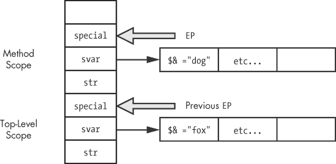

图 3-27. 每个栈帧都有自己的特殊变量集。

请注意，Ruby 将 `fox` 字符串保存在由 `svar` 指针引用的顶层作用域的表格中，将 `dog` 字符串保存在另一个表格中，该表格用于内方法作用域。Ruby 使用每个栈帧的 `EP` 指针找到合适的特殊变量表。

Ruby 将实际的全局变量（通过美元符号前缀定义的变量）保存在一个单独的全局哈希表中。无论你在哪里保存或检索一个普通全局变量的值，Ruby 都会访问相同的全局哈希表。

现在再做一次测试：如果我在一个块内执行搜索而不是在方法内呢？示例 3-10 显示了这个新搜索。

示例 3-10. 在块内显示 `$&` 的值

```
str = "The quick brown fox jumped over the lazy dog.\n"
/fox/.match(str)

2.times do
  /dog/.match(str)
  puts "Value of $& inside block: #{$&}"
end

puts "Value of $& in the top-level scope: #{$&}"
```

这是这次在控制台上得到的输出。

```
$ **ruby regex_block.rb**
Value of $& inside block: dog
Value of $& inside block: dog
Value of $& in the top-level scope: dog
```

请注意，现在 Ruby 已经用我在块内执行搜索时匹配的单词 `dog` 覆盖了顶层作用域中 `$&` 的值！这是有意为之：Ruby 认为顶层和内块作用域对于特殊变量来说是相同的。这类似于动态变量访问的工作方式；我们期望块内的变量与父作用域中的变量具有相同的值。

图 3-28 显示了 Ruby 如何实现这种行为。

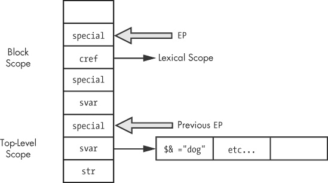

图 3-28. Ruby 在块中使用 `EP-1` 栈位置来处理 `cref`，其他情况使用 `svar`。

如你在 图 3-28 中看到的，Ruby 只有一个用于顶级作用域的特殊变量表。它通过之前的 `EP` 指针找到特殊变量，`EP` 指针指向顶级作用域。在块作用域内（因为不需要单独的特殊变量副本），Ruby 利用 `EP-1` 的空闲槽并将 `cref` 的值保存到其中。Ruby 使用 `cref` 值来追踪当前块属于哪个词法作用域。*词法作用域*是指程序语法结构中的一段代码，并被 Ruby 用来查找常量值。（有关词法作用域的更多信息，请参见 第六章）。具体而言，Ruby 在此处使用 `cref` 值来实现元编程 API 调用，如 `eval` 和 `instance_eval`。`cref` 值指示给定块是否应该在与父作用域不同的词法作用域中执行。（参见 instance_eval 为新的词法作用域创建一个单例类）。

特殊变量的权威列表

查找 Ruby 所支持的所有特殊变量的准确列表的一个地方就是 C 源代码本身。例如，示例 3-11 是 Ruby C 源代码的一部分，它将你的 Ruby 程序进行标记化，摘自 *parse.y* 中的 `parser_yylex` 函数：

示例 3-11。查阅 *parse.y* 是找到 Ruby 多个特殊变量的确切列表的好方法。

```
 case '$':
    lex_state = EXPR_END;
    newtok();
    c = nextc();
 switch (c) {
   case '_':            /* $_: last read line string */
        c = nextc();
        if (parser_is_identchar()) {
            tokadd('$');
            tokadd('_');
            break;
        }
        pushback(c);
        c = '_';
        /* fall through */
   case '~':            /* $~: match-data */
      case '*':            /* $*: argv */
      case '$':            /* $$: pid */
      case '?':            /* $?: last status */
      case '!':            /* $!: error string */
      case '@':            /* $@: error position */
      case '/':            /* $/: input record separator */
      case '\\':           /* $\: output record separator */
      case ';':            /* $;: field separator */
      case ',':            /* $,: output field separator */
      case '.':            /* $.: last read line number */
      case '=':            /* $=: ignorecase */
      case ':':            /* $:: load path */
      case '<':            /* $<: reading filename */
      case '>':            /* $>: default output handle */
      case '\"':           /* $": already loaded files */
        tokadd('$');
        tokadd(c);
        tokfix();
        set_yylval_name(rb_intern(tok()));
        return tGVAR;
```

请注意在  Ruby 匹配了美元符号字符（`$`）。这是一个大型 C `switch` 语句的一部分，它将你的 Ruby 代码进行标记化——我在 标记：构成 Ruby 语言的单词 中讨论过这个过程。接着是一个内部的 `switch` 语句，在  匹配接下来的字符。这些字符以及随后的每个 `case` 语句（在  和之后的 ）都对应于 Ruby 的一个特殊变量。

在函数的稍下方，更多的 C 代码（参见 示例 3-12）解析了你在 Ruby 代码中编写的其他特殊变量标记，比如 `$&` 及相关的特殊变量。

示例 3-12. 这些 `case` 语句对应于 Ruby 中与正则表达式相关的特殊变量。

```
 case '&':                /* $&: last match */
    case '`':                /* $`: string before last match */
    case '\'':               /* $': string after last match */
    case '+':                /* $+: string matches last paren. */
      if (last_state == EXPR_FNAME) {
          tokadd('$');
          tokadd(c);
          goto gvar;
      }
      set_yylval_node(NEW_BACK_REF(c));
      return tBACK_REF;
```

在  中，你可以看到四个额外的 `case` 语句，分别对应于特殊变量 `$&`、`` $` ``、`$/` 和 `$+`，这些变量都与正则表达式相关。

最后，在 示例 3-13 中，代码将 `$1`、`$2` 等进行标记化，生成从上次正则表达式操作中返回的 nth 反向引用特殊变量。

示例 3-13. 这段 C 代码将 Ruby 的 nth 反向引用特殊变量：`$1`、`$2` 等等。

```
 case '1': case '2': case '3':
    case '4': case '5': case '6':
    case '7': case '8': case '9':
      tokadd('$');
   do {
          tokadd(c);
          c = nextc();
      } while (c != -1 && ISDIGIT(c));
      pushback(c);
      if (last_state == EXPR_FNAME) goto gvar;
      tokfix();
      set_yylval_node(NEW_NTH_REF(atoi(tok()+1)));
      return tNTH_REF;
```

在  中的 `case` 语句匹配数字 1 到 9，而在  中的 C `do...while` 循环则会继续处理数字，直到读取完整的数字为止。这使得你能够创建具有多个数字的特殊变量，如 `$12`。

# 总结

本章我们覆盖了很多内容。我们首先探讨了 Ruby 如何追踪两个栈：YARV 使用的内部栈和你的 Ruby 调用栈。接着，我们看到了 YARV 如何执行两个简单的 Ruby 程序：一个计算 2 + 2 = 4，另一个调用一个块 10 次。在 实验 3-1：基准测试 Ruby 2.0 和 Ruby 1.9 与 Ruby 1.8 中，我们了解到，在 Ruby 2.0 和 1.9 中执行 YARV 指令几乎比在 Ruby 1.8 中快四倍，而后者是直接从 AST 执行程序。

我们继续研究了 Ruby 如何使用两种方法在内部 YARV 栈上保存变量：局部变量和动态变量访问。我们还看到 Ruby 如何处理方法参数，方式与局部变量相同。在 实验 3-2：探索特殊变量 中，我们探讨了 Ruby 如何处理特殊变量。

当你运行任何 Ruby 程序时，实际上是在使用专门为执行 Ruby 程序设计的虚拟机。通过详细分析这个虚拟机的工作原理，我们对 Ruby 语言的运作有了更深入的理解，例如，当你调用方法或将值保存到局部变量时会发生什么。在 第四章 中，我们将继续探索这个虚拟机，研究控制结构的工作原理以及 YARV 的方法调度过程。
