# 第四章 控制结构与方法调度

> 
> 
> *YARV 使用它自己的一套控制结构，就像你在 Ruby 中使用的那些结构一样。*

在第三章中，我解释了 YARV 如何在执行其指令集时使用栈，以及它如何本地或动态地访问变量。控制执行流程是任何编程语言的基本要求之一，Ruby 也有一套丰富的控制结构。那么 YARV 是如何实现控制结构的呢？

像 Ruby 一样，YARV 也有自己的控制结构，尽管它们位于更低的层次。YARV 使用两个低级指令 `branchif` 和 `branchunless` 来代替 `if` 或 `unless` 语句。YARV 使用一个叫做 `jump` 的低级函数来代替控制结构，如 `while...end` 或 `until...end` 循环，`jump` 允许它改变程序计数器并在已编译的程序中跳转。通过将 `branchif` 或 `branchunless` 指令与 `jump` 指令结合，YARV 可以执行大多数 Ruby 的简单控制结构。

当你的代码调用方法时，YARV 使用 `send` 指令。这一过程被称为 *方法调度*。你可以把 `send` 看作 Ruby 的另一种控制结构——最复杂和最精密的控制结构。

在这一章中，我们将通过探索 YARV 如何控制程序的执行流程，进一步了解 YARV。我们还将研究方法调度过程，了解 Ruby 如何将方法分类为不同的类型，并分别调用每种方法类型。

路线图

+   Ruby 如何执行 if 语句

+   从一个作用域跳转到另一个作用域

    +   捕获表

    +   捕获表的其他用途

+   **实验 4-1：测试 Ruby 如何内部实现 for 循环**

+   send 指令：Ruby 最复杂的控制结构

    +   方法查找与方法调度

    +   Ruby 方法的 11 种类型

+   调用普通 Ruby 方法

    +   为普通 Ruby 方法准备参数

+   调用内建 Ruby 方法

    +   调用 attr_reader 和 attr_writer

    +   方法调度优化 attr_reader 和 attr_writer

+   **实验 4-2: 探索 Ruby 如何实现关键字参数**

+   总结

# Ruby 如何执行 if 语句

为了理解 YARV 如何控制执行流，我们来看一下 `if...else` 语句的工作原理。图 4-1 左侧展示了一个简单的 Ruby 脚本，其中使用了 `if` 和 `else`。右侧则展示了对应的 YARV 编译指令片段。通过阅读 YARV 指令，你会发现 Ruby 实现 `if...else` 语句的模式如下：

1.  评估条件

1.  如果条件为假，跳转到假代码

1.  真代码；跳过假代码

1.  假代码

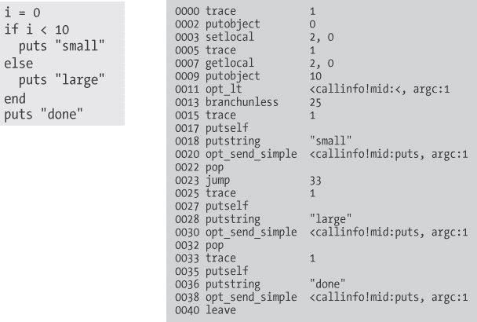

图 4-1. Ruby 如何编译 `if...else` 语句

在接下来的页面中，图 4-2 中的流程图会让这个模式更容易理解。图中的 `branchunless` 指令是 Ruby 实现 `if` 语句的关键。它的工作原理如下：

1.  Ruby 使用 `opt_lt`（优化版小于）指令来评估 `if` 语句的条件 `i < 10`。这一评估将结果（真或假）留在栈上。

1.  `branchunless` 指令会在条件为假时跳转到 `else` 代码块，也就是说，除非条件为真，否则它会“分支”。Ruby 使用 `branchunless` 而非 `branchif` 来处理 `if...else` 条件，因为正向代码会编译在条件代码之后。因此，当条件为假时，YARV 需要进行跳转。

1.  如果条件为真，Ruby 不会进行分支，而是继续执行正向的代码。执行完毕后，它通过 `jump` 指令跳转到 `if...else` 语句后的指令。

1.  无论是否分支，Ruby 都会继续执行后续代码。

YARV 实现 `unless` 语句的方式与 `if` 类似，只是正向和反向代码片段的顺序相反。对于类似 `while...end` 和 `until...end` 这样的循环控制结构，YARV 使用 `branchif` 指令，原理是一样的：计算循环条件，执行 `branchif` 进行跳转，然后使用 `jump` 指令来实现循环。

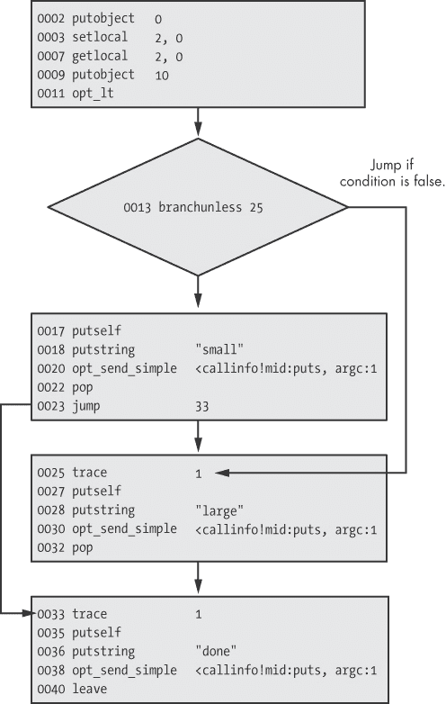

图 4-2. 这个流程图展示了 Ruby 编译 `if...else` 语句的模式。

# 从一个作用域跳转到另一个作用域

YARV 在实现一些控制结构时面临的挑战之一是，和动态变量访问一样，Ruby 可以从一个作用域跳到另一个作用域。例如，`break` 可以用于退出像示例 4-1 中的简单循环。

示例 4-1. 使用 `break` 退出一个简单的循环

```
i = 0
while i<10
  puts i
  i += 1
  break
end
```

它也可以用于退出一个块迭代，比如在示例 4-2 中的那个。

示例 4-2. 使用 `break` 退出一个块

```
10.times do |n|
  puts n
  break
end
puts "continue from here"
```

在第一个列表中，YARV 可以通过简单的 `jump` 指令退出 `while` 循环。但退出像第二个列表中的块就不那么简单了：在这种情况下，YARV 需要跳转到父作用域，并在调用 `10.times` 后继续执行。YARV 是如何知道跳转到哪里去的？它又是如何调整其内部栈和你的 Ruby 调用栈，以确保在父作用域中正确继续执行的呢？

为了实现 Ruby 调用栈中从一个地方跳转到另一个地方（也就是说，跳出当前作用域），Ruby 使用 `throw` YARV 指令。该指令类似于 Ruby 的 `throw` 关键字：它将执行路径抛回到更高的作用域。例如，图 4-3 展示了 Ruby 如何编译示例 4-2，其中块内包含一个 `break` 语句。左边是 Ruby 代码，右边是编译后的版本。

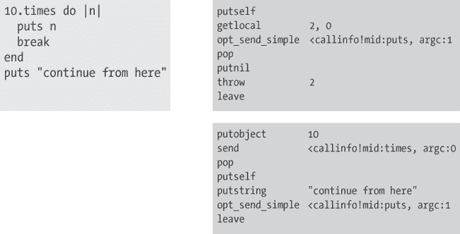

图 4-3. Ruby 如何编译在块中使用的 `break` 语句

## Catch 表

在图 4-3 的右上角，编译后的代码中的 `throw 2` 在 YARV 指令级别通过使用 *catch 表*（或可以附加到任何 YARV 代码片段的指针表）抛出一个异常。从概念上讲，一个 catch 表可能像图 4-4 一样。

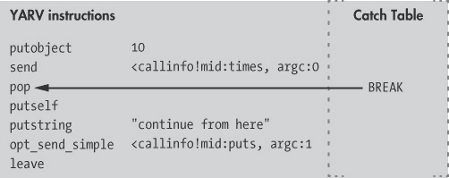

图 4-4. 每段 YARV 代码可以包含一个 catch 表。

该捕获表只包含指向 `pop` 语句的一个指针，执行将在捕获到异常后从该语句继续。每当你在代码块中使用 `break` 语句时，Ruby 会将 `throw` 指令编译进代码块的代码，并在父作用域的捕获表中添加 `BREAK` 条目。对于一系列嵌套的代码块中的 `break`，Ruby 会将 `BREAK` 条目添加到更深层的 `rb_control_frame_t` 栈的捕获表中。

稍后，当 YARV 执行 `throw` 指令时，它会检查是否存在一个包含中断指针的捕获表，适用于当前的 YARV 指令序列，如 图 4-5 所示。


图 4-5. 在执行 `throw` 指令时，YARV 开始向下遍历 Ruby 调用栈。

如果没有找到捕获表，Ruby 会开始通过 `rb_control_frame_t` 结构的栈向下遍历，寻找一个包含中断指针的捕获表，如 图 4-6 所示。

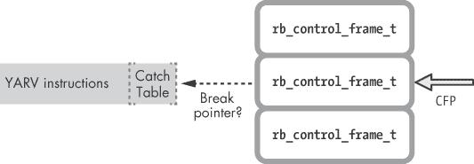

图 4-6. Ruby 会继续向下遍历调用栈，寻找带有中断指针的捕获表。

如你在 图 4-7 所见，Ruby 会继续遍历，直到找到带有中断指针的捕获表。  

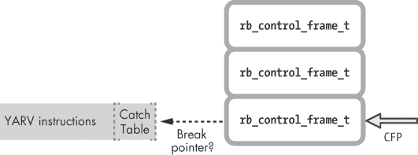

图 4-7. Ruby 会继续遍历，直到找到带有中断指针的捕获表或到达调用栈的末尾。

在这个简单的例子中，只有一层代码块嵌套，因此 Ruby 在一次遍历后就找到了捕获表和中断指针，如 图 4-8 所示。


图 4-8. Ruby 找到了一个带有中断指针的捕获表。

一旦 Ruby 找到捕获表指针，它会重置 Ruby 调用栈（即 `CFP` 指针）和内部的 YARV 栈，以反映新的程序执行点。YARV 会从该位置继续执行你的代码——即根据需要重置内部的 `PC` 和 `SP` 指针。

### 注意

*Ruby 在内部使用类似于引发和捕获异常的过程来实现一个非常常用的控制结构：`break`关键字。换句话说，在其他更冗长的语言中是异常情况，在 Ruby 中却是一种常见的、每天都会发生的行为。Ruby 将一个令人困惑、不寻常的语法——引发/捕获异常——封装成一个简单的关键字`break`，使其易于理解和使用。（当然，由于块的工作方式，Ruby 需要使用异常。一方面，它们像是独立的函数或子程序，但另一方面，它们只是周围代码的一部分。）*

## 捕获表的其他用途

`return`关键字是另一个普通的 Ruby 控制结构，也使用捕获表。每当你在块内部调用`return`时，Ruby 会引发一个内部异常，然后通过捕获表指针来捕获它，就像你调用`break`时一样。实际上，`break`和`return`使用相同的 YARV 指令实现，只有一个例外：对于`return`，Ruby 传递一个 1 给`throw`指令（例如，`throw 1`），而对于`break`，它传递一个 2（`throw 2`）。`return`和`break`关键字实际上是同一个硬币的两面。

除了`break`，Ruby 还使用捕获表来实现控制结构`rescue`、`ensure`、`retry`、`redo`和`next`。例如，当你在 Ruby 代码中使用`raise`关键字明确引发异常时，Ruby 使用捕获表来实现`rescue`块，但使用一个`rescue`指针。捕获表只是一个可以被那些 YARV 指令序列捕获和处理的事件类型列表，就像你在 Ruby 代码中使用`rescue`块一样。

# 实验 4-1：测试 Ruby 如何在内部实现`for`循环

我一直知道 Ruby 的`for`循环控制结构本质上与`Enumerable`模块的`each`方法的块相同。也就是说，我知道这段代码：

```
for i in 0..5
   puts i
end
```

的工作方式类似于这段代码：

```
(0..5).each do |i|
  puts i
end
```

但我从未怀疑过 Ruby 在内部实际上是使用`each`来实现`for`循环的！换句话说，Ruby 没有`for`循环控制结构。相反，`for`关键字实际上只是调用一个范围的`each`的语法糖。

要证明这一点，只需检查 Ruby 在编译`for`循环时生成的 YARV 指令。在示例 4-3 中，让我们使用相同的`RubyVM:: InstructionSequence.compile`方法来显示 YARV 指令。

示例 4-3. 这段代码将展示 Ruby 如何编译一个`for`循环。

```
code = <<END
for i in 0..5
  puts i
end
END
puts RubyVM::InstructionSequence.compile(code).disasm
```

运行这段代码会得到示例 4-4 中显示的输出。

示例 4-4. 示例 4-3 生成的输出

```
== disasm: <RubyVM::InstructionSequence:<compiled>@<compiled>>==========
== catch table
| catch type: break  st: 0002 ed: 0006 sp: 0000 cont: 0006
|------------------------------------------------------------------------
local table (size: 2, argc: 0 [opts: 0, rest: -1, post: 0, block: -1] s1)
[ 2] i
0000 trace            1                                               (   1)
0002 putobject        0..5
0004 send             <callinfo!mid:each, argc:0, block:block in <compiled>>
0006 leave
== disasm: <RubyVM::InstructionSequence:block in <compiled>@<compiled>>=
== catch table
| catch type: redo   st: 0004 ed: 0015 sp: 0000 cont: 0004
| catch type: next   st: 0004 ed: 0015 sp: 0000 cont: 0015
|------------------------------------------------------------------------
local table (size: 2, argc: 1 [opts: 0, rest: -1, post: 0, block: -1] s3)
[ 2] ?<Arg>
0000 getlocal_OP__WC__0 2                                             (   3)
0002 setlocal_OP__WC__1 2                                             (   1)
0004 trace            256
0006 trace            1                                               (   2)
0008 putself
0009 getlocal_OP__WC__1 2
0011 opt_send_simple  <callinfo!mid:puts, argc:1, FCALL|ARGS_SKIP>
0013 trace            512                                             (   3)
0015 leave
```

图 4-9 显示了左侧的 Ruby 代码和右侧的 YARV 指令。（我已去除一些技术细节，例如 `trace` 语句，以简化内容。）

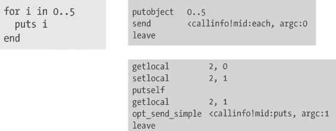

图 4-9. 示例 4-4 中简化显示的 YARV 指令

请注意，存在两个独立的 YARV 代码块：外部作用域对范围 `0..5` 调用 `each`，而内部块则执行 `puts i` 调用。内部块中的 `getlocal 2, 0` 指令加载了隐式的块参数值（在我的 Ruby 代码中是 `i`），紧随其后的 `setlocal` 指令将其保存到局部变量 `i` 中，该变量通过动态变量访问在父作用域中被使用。

实际上，Ruby 已自动执行了以下操作：

+   将 `for i in 0..5` 代码转换为 `(0..5).each do`

+   创建了一个块参数来保存范围内的每个值

+   每次循环时，都将块参数或迭代计数器复制回局部变量 `i`

# 发送指令：Ruby 最复杂的控制结构

我们已经看到 YARV 如何通过低级指令如 `branchunless` 和 `jump` 控制 Ruby 程序的执行流。然而，最常用和最重要的 YARV 指令是 `send` 指令。`send` 指令告诉 YARV 跳转到另一个方法并开始执行它。

## 方法查找和方法调度

`send` 如何工作？YARV 如何知道调用哪个方法，并且它如何实际调用方法？图 4-10 展示了这一过程的概述。

这看起来非常简单，但 Ruby 用来查找并调用目标方法的算法实际上非常复杂。首先，在*方法查找*过程中，Ruby 会搜索您的代码应该调用的实际方法。这涉及到循环遍历组成接收者对象的类和模块。

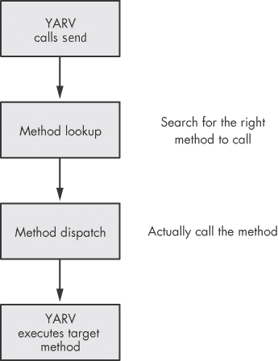

图 4-10. Ruby 使用方法查找来确定调用哪个方法以及调用哪个方法调度。

一旦 Ruby 找到代码中试图调用的方法，它就会使用*方法调度*来实际执行该方法调用。这涉及准备方法的参数，推送一个新的帧到 YARV 的内部栈中，并更改 YARV 的内部寄存器，从而开始执行目标方法。与方法查找类似，方法调度是一个复杂的过程，因为 Ruby 对方法进行分类的方式。

在本章的其余部分，我将讨论方法调度过程。我们将在 第六章 中进一步了解方法查找的工作原理，届时我们将深入学习 Ruby 如何实现对象、类和模块。

## 十一种 Ruby 方法类型

在内部，Ruby 将方法分为 11 种不同的类型！在方法调度过程中，Ruby 会确定你的代码试图调用的是哪种类型的方法。然后，它会根据方法类型的不同，以不同的方式调用每种类型的方法，如 图 4-11 所示。

大多数方法——包括你在程序中用 Ruby 代码编写的所有方法——都被 YARV 的内部源代码称为 ISEQ，或*指令序列*方法，因为 Ruby 会将你的代码编译成一系列的 YARV 字节码指令。但在内部，YARV 还使用其他 10 种方法类型。这些其他方法类型是必要的，因为 Ruby 需要以特殊方式调用某些方法，以加速方法调度，因为这些方法是通过 C 代码实现的，或出于各种内部技术原因。

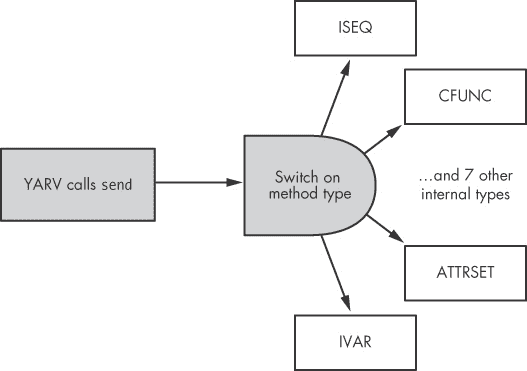

图 4-11。执行 `send` 时，YARV 根据目标方法的类型进行切换。

下面是所有 11 种方法类型的简要描述。我们将在接下来的章节中详细探讨其中一些。

+   ****ISEQ****。你用 Ruby 代码编写的普通方法，这是最常见的类型。ISEQ 代表*指令序列*。

+   ****CFUNC****。使用直接包含在 Ruby 可执行文件中的 C 代码，这些是 Ruby 实现的方法，而非你自己实现的。CFUNC 代表*C 函数*。

+   ****ATTRSET****。这种类型的方法是通过 `attr_writer` 方法创建的。ATTRSET 代表*属性集*。

+   ****IVAR****。当你调用 `attr_reader` 时，Ruby 使用这种方法类型。IVAR 代表*实例变量*。

+   ****BMETHOD****。当你调用 `define_method` 并传入一个 proc 对象时，Ruby 使用这种方法类型。由于该方法在内部由 proc 表示，Ruby 需要以特殊的方式处理这种方法类型。

+   ****ZSUPER****。Ruby 使用这种方法类型来设置方法的访问权限（如 public 或 private），当该方法实际上在某个超类中定义时。这种方法不常用。

+   ****UNDEF****. Ruby 在内部使用这种方法类型，当它需要从类中移除一个方法时。另外，如果你使用 `undef_method` 删除一个方法，Ruby 会使用 UNDEF 方法类型创建一个同名的新方法。

+   ****NOTIMPLEMENTED****. 和 UNDEF 一样，Ruby 使用这种方法类型标记某些方法为未实现。这在你在一个不支持特定操作系统调用的平台上运行 Ruby 时是必要的。

+   ****OPTIMIZED****. Ruby 使用这种类型加速一些重要方法，如 `Kernel#send` 方法。

+   ****MISSING****. 如果你通过 `Kernel#method` 从模块或类中请求方法对象，而该方法缺失，Ruby 会使用这种方法类型。

+   ****REFINED****. Ruby 在其实现的精炼（refinements）中使用这种方法类型，这是 2.0 版本中引入的新特性。

现在让我们关注最重要和最常用的方法类型：ISEQ、CFUNC、ATTRSET 和 IVAR。

# 调用普通 Ruby 方法

在 Ruby 源代码中，大多数方法通过常量 `VM_METHOD_TYPE_ISEQ` 来标识。这意味着它们由一系列 YARV 指令组成。

你在代码中使用 `def` 关键字定义标准的 Ruby 方法，如下所示。

```
def display_message
  puts "The quick brown fox jumps over the lazy dog."
end
display_message
```

`display_message` 是一个标准方法，因为它是使用 `def` 关键字创建的，后面跟着普通的 Ruby 代码。图 4-12 展示了 Ruby 如何调用 `display_message` 方法。

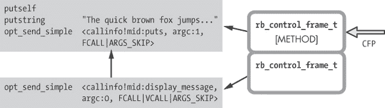

图 4-12. 一个普通方法由 YARV 指令组成。

左侧是两段 YARV 代码：底部是调用代码，顶部是目标方法。右侧可以看到 Ruby 使用新的 `rb_control_frame_t` 结构创建了一个新的堆栈帧，并将其类型设置为 METHOD。

图 4-12 中的关键概念是，调用代码和目标方法都是由 YARV 指令组成的。当你调用一个标准方法时，YARV 会创建一个新的堆栈帧，然后开始执行目标方法中的指令。

## 准备普通 Ruby 方法的参数

当 Ruby 编译你的代码时，它会为每个方法创建一个局部变量和参数表。局部表中列出的每个参数都会标记为标准的（`<Arg>`）或是几种特殊类型之一，比如块、可选参数等。Ruby 通过这种方式记录每个方法参数的类型，以便在代码调用该方法时判断是否需要额外的工作。示例 4-5 展示了一个使用每种类型参数的 Ruby 方法。

示例 4-5. Ruby 的参数类型 *(argument_types.rb)*

```
def five_argument_types(a, b = 1, *args, c, &d)
  puts "Standard argument #{a.inspect}"
  puts "Optional argument #{b.inspect}"
  puts "Splat argument array #{args.inspect}"
  puts "Post argument #{c.inspect}"
  puts "Block argument #{d.inspect}"
end

five_argument_types(1, 2, 3, 4, 5, 6) do
  puts "block"
end
```

示例 4-6 显示了我们在调用示例方法时，使用数字 1 到 6 和一个块的结果。

示例 4-6。示例 4-5 生成的输出。

```
$ **ruby argument_types.rb**
Standard argument 1
Optional argument 2
Splat argument array [3, 4, 5]
Post argument 6
Block argument #<Proc:0x007ff4b2045ac0@argument_types.rb:9>
```

为了使这种行为成为可能，当你调用一个方法时，YARV 会对每种类型的参数进行一些额外处理：

+   ****块参数****。当你在参数列表中使用`&`运算符时，Ruby 需要将提供的块转换为一个 proc 对象。

+   ****可选参数****。当你使用具有默认值的可选参数时，Ruby 会在目标方法中添加额外的代码。这段代码将默认值设置为参数值。当你稍后调用一个带有可选参数的方法时，如果提供了值，YARV 会重置程序计数器（PC 寄存器），以跳过这段添加的代码。

+   ****Splat 参数数组****。对于这些，YARV 会创建一个新的数组对象，并将提供的参数值收集到其中。（参见示例 4-6 中的数组`[3, 4, 5]`。）

+   ****标准和后续参数****。由于这些是简单的值，YARV 不需要做额外的工作。

然后是关键字参数。每当 Ruby 调用一个使用关键字参数的方法时，YARV 需要做更多的工作。（实验 4-2：探索 Ruby 如何实现关键字参数将更详细地探讨这一点。）

# 调用内置的 Ruby 方法

Ruby 语言中许多内置方法是 CFUNC 方法（在 Ruby 的 C 源代码中是`VM_METHOD_TYPE_CFUNC`）。Ruby 通过 C 代码而不是 Ruby 代码实现这些方法。例如，考虑执行对块的调用中的`Integer#times`方法。`Integer`类是 Ruby 的一部分，而`times`方法由*C 代码*在文件*numeric.c*中实现。

你每天使用的类有许多 CFUNC 方法的示例，如`String`、`Array`、`Object`、`Kernel`等。例如，`String#upcase`方法由*string.c*中的 C 代码实现，而`Struct#each`方法由*struct.c*中的 C 代码实现。

当 Ruby 调用一个内置的 CFUNC 方法时，它不需要像处理普通 ISEQ 方法那样准备方法参数；它只需创建一个新的栈帧并调用目标方法，如图 4-13 所示。

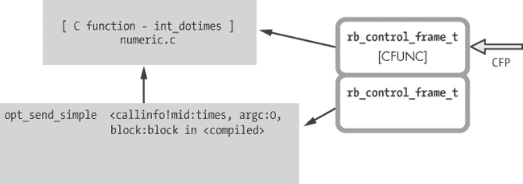

图 4-13. Ruby 通过 C 代码在 Ruby 的 C 源文件中实现 CFUNC 方法。

正如我们在图 4-12 中看到的，调用 CFUNC 方法涉及创建一个新的栈帧。然而，这一次，Ruby 使用的是`rb_control_frame_t`结构，类型为 CFUNC。

## 调用`attr_reader`和`attr_writer`

Ruby 使用两种特殊的方法类型，IVAR 和 ATTRSET，加速了在代码中访问和设置实例变量的过程。在我解释这些方法类型的含义以及方法分发如何与它们一起工作之前，请先看一下示例 4-7，它演示了如何检索和设置实例变量的值。

示例 4-7. 一个包含实例变量和访问器方法的 Ruby 类

```
    class InstanceVariableTest
   def var
        @var
      end
   def var=(val)
        @var = val
      end
    end
```

在这个列表中，类`InstanceVariableTest`包含一个实例变量`@var`，以及两个方法`var`  和 `var=` 。由于我使用 Ruby 代码编写了这些方法，它们都会是标准的 Ruby 方法，并且类型设置为`VM_METHOD_TYPE_ISEQ`。如你所见，它们允许你获取或设置`@var`的值。

Ruby 实际上提供了创建这些方法的快捷方式：`attr_reader`和`attr_writer`。以下代码展示了使用这些快捷方式编写相同类的更简洁方式。

```
class InstanceVariableTest
  attr_reader :var
  attr_writer :var
end
```

在这里，`attr_reader`自动定义了相同的`var`方法，而`attr_writer`自动定义了`var=`方法，二者都来自示例 4-7。

这里有一种更简单、更简洁的方式，通过使用`attr_accessor`定义相同的两个方法。

```
class InstanceVariableTest
  attr_accessor :var
end
```

如你所见，`attr_accessor`是同时调用`attr_reader`和`attr_writer`以处理相同变量的简写方式。

## 方法分发优化了`attr_reader`和`attr_writer`

由于 Ruby 开发者经常使用`attr_reader`和`attr_writer`，YARV 使用两种特殊的方法类型，IVAR 和 ATTRSET，来加速方法分发并提高程序运行速度。

让我们从 ATTRSET 方法类型开始。每当你使用`attr_writer`或`attr_accessor`定义方法时，Ruby 会在内部将生成的方法标记为`VM_METHOD_TYPE_ATTRSET`方法类型。当 Ruby 执行代码并调用方法时，它会使用 C 函数`vm_setivar`以快速优化的方式设置实例变量。图 4-14 展示了 YARV 如何调用生成的`var=`方法来设置`var`。

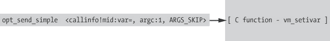

图 4-14. `VM_METHOD_TYPE_ATTRSET`方法直接调用`vm_setivar`。

注意，这张图与图 4-13 非常相似。在这两种情况下，Ruby 在执行代码时都会调用一个内部的 C 函数。但请注意，在图 4-14 中，当执行 ATTRSET 方法时，Ruby 甚至不会创建新的栈帧。因为方法非常简短简单，所以不需要栈帧。而且，由于生成的`var=`方法永远不会抛出异常，Ruby 也不需要新的栈帧来显示错误信息。`vm_setivar` C 函数可以非常快速地设置值并返回。

IVAR 方法类型的工作原理类似。当你使用`attr_reader`或`attr_accessor`定义方法时，Ruby 会在内部标记生成的方法为`VM_METHOD_TYPE_IVAR`方法类型。当执行 IVAR 方法时，Ruby 会调用一个名为`vm_getivar`的内部 C 函数，快速获取并返回实例变量的值，如图 4-15 所示。

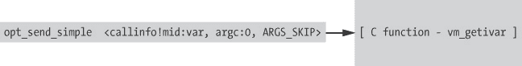

图 4-15. `VM_METHOD_TYPE_IVAR`方法直接调用`vm_getivar`。

这里，左侧的`opt_send_simple` YARV 指令调用右侧的`vm_getivar` C 函数。如同在图 4-14 中所示，当调用`vm_setivar`时，Ruby 不需要创建新的栈帧或执行 YARV 指令。它只需立即返回`var`的值。

# 实验 4-2：探索 Ruby 如何实现关键字参数

从 Ruby 2.0 开始，你可以为方法参数指定标签。示例 4-8 展示了一个简单的例子。

示例 4-8. 使用关键字参数的简单示例

```
 def add_two(a: 2, b: 3)
      a+b
    end

 puts add_two(a: 1, b: 1)
     => 2
```

我们使用`a`和`b`作为传递给`add_two`函数的关键字参数标签 。当我们调用函数时 ，得到结果 2。我在第二章中提到过，Ruby 使用哈希来实现关键字参数。我们可以通过示例 4-9 来证明这一点。

示例 4-9. 证明 Ruby 使用哈希来实现关键字参数

```
    class Hash
   def key?(val)
     puts "Looking for key #{val}"
        false
      end
    end

    def add_two(a: 2, b: 3)
      a+b
    end

    puts add_two (a: 1, b: 1)
```

我们重写了 `Hash` 类的 `key?` 方法 ，该方法会显示一条消息 ，然后返回 `false`。当我们运行 示例 4-9 时，输出结果如下。

```
Looking for key a
Looking for key b
5
```

如您所见，Ruby 调用了 `Hash#key?` 两次：第一次查找键 `a`，第二次查找键 `b`。由于某些原因，Ruby 创建了一个哈希，即使我们在代码中从未使用哈希。而且，Ruby 现在忽略了我们传递给 `add_two` 的值。我们得到的结果是 5 而不是 2。看起来 Ruby 使用了 `a` 和 `b` 的默认值，而不是我们提供的值。为什么 Ruby 创建了一个哈希，它包含了什么？为什么在重写了 `Hash#key?` 方法后，Ruby 忽略了我的参数值？

为了了解 Ruby 如何实现关键字参数，并解释我们运行 示例 4-9 时看到的结果，我们可以检查 Ruby 编译器为 `add_two` 生成的 YARV 指令。运行 示例 4-10 将显示与 示例 4-9 对应的 YARV 指令。

示例 4-10. 显示 示例 4-9 代码的 YARV 指令

```
code = <<END
def add_two(a: 2, b: 3)
  a+b
end

puts add_two(a: 1, b: 1)
END

puts RubyVM::InstructionSequence.compile(code).disasm
```

图 4-16 显示了 示例 4-10 生成的输出的简化版本。

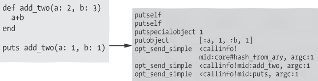

图 4-16. 示例 4-10 生成的部分输出

在 图 4-16 的右侧，您可以看到 Ruby 首先将一个数组推送到栈中：`[:a, 1, :b, 1]`。接下来，它调用内部的 C 函数 `hash_from_ary`，我们可以推测它会将 `[:a, 1, :b, 1]` 数组转换为一个哈希。最后，Ruby 调用 `add_two` 方法进行加法运算，并调用 `puts` 方法来显示结果。

现在，让我们来看一下 `add_two` 方法本身的 YARV 指令，见于 图 4-17。

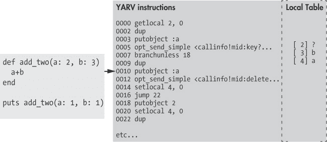

图 4-17. 从 `add_two` 方法开头编译得到的 YARV 指令

这些 YARV 指令在做什么？Ruby 方法 `add_two` 并没有包含类似的代码！(`add_two` 只是将 `a` 和 `b` 相加并返回它们的和。)

为了找出答案，让我们逐步分析 图 4-17。左侧是 Ruby 的 `add_two` 方法，右侧是 `add_two` 的 YARV 指令。在最右边，你可以看到 `add_two` 的局部变量表。注意这里列出了三个值：`[ 2] ?`，`[ 3] b` 和 `[ 4] a`。显然，`a` 和 `b` 对应着 `add_two` 的两个参数，但 `[ 2] ?` 是什么意思呢？这似乎是某种神秘的值。

这个神秘的值就是我们在 图 4-16 中看到的哈希！为了实现关键字参数，Ruby 创建了这个第三个隐藏的参数，用于 `add_two` 方法。

图 4-17 中的 YARV 指令显示，`getlocal 2, 0` 紧接着 `dup` 将这个哈希放到栈上作为接收者。接下来，`putobject :a` 将符号 `:a` 放到栈上作为方法参数，`opt_send_simple <callinfo!mid:key?` 在接收者（即哈希）上调用 `key?` 方法。

这些 YARV 指令等价于以下这行 Ruby 代码。Ruby 正在查询隐藏的哈希对象，看它是否包含键 `:a`。

```
hidden_hash.key?(:a)
```

从 图 4-17 继续阅读其余的 YARV 指令，我们看到如果哈希包含该键，Ruby 会调用 `delete` 方法，移除该键并返回对应的值。接着，`setlocal 4, 0` 会将这个值保存在 `a` 参数中。如果哈希不包含键 `:a`，Ruby 会调用 `putobject 2` 并使用 `setlocal 4, 0` 将默认值 2 保存到参数中。

总结一下，图 4-17 中显示的所有 YARV 指令实现了示例 4-11 中展示的 Ruby 代码片段。

示例 4-11。 在图 4-17 中显示的 YARV 指令与这段 Ruby 代码等价。

```
if hidden_hash.key?(:a)
  a = hidden_hash.delete(:a)
else
  a = 2
end
```

现在我们可以看到，Ruby 将关键字参数及其值存储在隐藏的哈希参数中。当方法开始时，它首先从哈希中加载每个参数的值，如果没有值，则使用默认值。图 4-14 中显示的 Ruby 代码所表示的行为解释了我们在运行示例 4-9 时看到的结果。记住我们将`Hash#key?`方法修改为始终返回`false`。如果`hidden_hash.key?`始终返回`false`，Ruby 将忽略每个参数的值，并使用默认值，即使提供了值。

关键字参数的最后一个细节是：每当你调用任何方法并使用关键字参数时，YARV 会检查你提供的关键字参数是否是目标方法所期望的。如果有意外的参数，Ruby 会抛出异常，如示例 4-12 所示。

示例 4-12。如果传递了一个意外的关键字参数，Ruby 会抛出异常。

```
def add_two(a: 2, b: 3)
  a+b
end

puts add_two(c: 9)
 => unknown keyword: c (ArgumentError)
```

因为`add_two`的参数列表中没有包含字母`c`，所以当我们尝试使用`c`调用该方法时，Ruby 会抛出一个异常。这个特殊的检查是在方法调度过程中发生的。

# 总结

本章开始时，我们探讨了 YARV 如何使用一系列低级控制结构控制 Ruby 程序的执行流程。通过展示 Ruby 编译器生成的 YARV 指令，我们看到了一些 YARV 的控制结构，并学习了它们的工作原理。在实验 4-1：测试 Ruby 如何在内部实现 for 循环中，我们发现 Ruby 通过`each`方法和块来实现`for`循环。

我们还了解到，Ruby 内部将方法分为 11 种类型。我们看到，当你使用`def`关键字编写方法时，Ruby 会创建一个标准的 ISEQ 方法，而且 Ruby 将自己内置的方法标记为 CFUNC 方法，因为它们是使用 C 代码实现的。我们了解了 ATTRSET 和 IVAR 方法类型，并看到 Ruby 如何在方法调度过程中根据目标方法的类型进行切换。

最后，在实验 4-2：探索 Ruby 如何实现关键字参数中，我们研究了 Ruby 如何实现关键字参数，并在过程中发现 Ruby 使用哈希来跟踪参数标签和默认值。

在第五章中，我们将转变方向，探讨对象和类的内容。我们将在第六章中再次回到 YARV 内部，研究方法查找过程的工作原理，并讨论词法作用域的概念。
