# 第五章 对象与类

> 
> 
> *每个 Ruby 对象是类指针和实例变量数组的结合体。*

我们早期就学到，Ruby 是一种面向对象的语言，源自像 Smalltalk 和 Simula 这样的语言。每个值都是一个对象，所有 Ruby 程序由一组对象和它们之间发送的消息组成。通常，我们通过了解如何使用对象以及它们能做什么来学习面向对象编程：如何将数据值和与这些值相关的行为组合在一起；如何使每个类具有单一责任或目的；以及不同的类如何通过封装或继承彼此关联。

但是，Ruby 对象是什么？一个对象包含什么信息？如果我们通过显微镜查看 Ruby 对象，我们会看到什么？内部有运动的部分吗？那么 Ruby 类呢？类究竟是什么？

我将在本章中通过探讨 Ruby 的内部工作原理来回答这些问题。通过查看 Ruby 如何实现对象和类，您将学习如何使用它们以及如何使用 Ruby 编写面向对象的程序。

路线图

+   Ruby 对象内部

    +   检查 klass 和 ivptr

    +   可视化一个类的两个实例

    +   通用对象

    +   简单的 Ruby 值根本不需要结构

    +   通用对象有实例变量吗？

    +   阅读 RBasic 和 RObject C 结构定义

    +   Ruby 为通用对象保存实例变量的位置在哪里？

+   **实验 5-1：保存一个新的实例变量需要多长时间？**

+   RClass 结构内部是什么？

    +   继承

    +   类实例变量与类变量

    +   获取和设置类变量

    +   常量

    +   实际的 RClass 结构

    +   读取 RClass C 结构定义

+   **实验 5-2：Ruby 将类方法保存在哪里？**

+   摘要

# Ruby 对象内部

Ruby 将你的每个自定义对象保存在一个名为`RObject`的 C 结构中，在 Ruby 1.9 和 2.0 中，它的结构如图 5-1 所示。

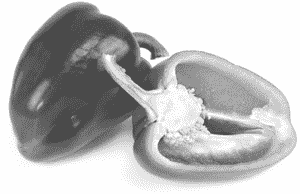

*如果我能切开一个 Ruby 对象，我会看到什么？*

图形顶部是指向`RObject`结构的指针。（在内部，Ruby 始终使用`VALUE`指针来引用任何值。）在此指针下，`RObject`结构包含一个内部的`RBasic`结构和与自定义对象相关的特定信息。`RBasic`部分包含所有值都使用的信息：一组名为`flags`的布尔值，存储各种内部技术值，以及一个名为`klass`的类指针。类指针指示对象是哪个类的实例。在`RObject`部分，Ruby 保存了每个对象包含的实例变量数组，使用`numiv`表示实例变量计数，`ivptr`是指向值数组的指针。

如果我们用技术术语定义 Ruby 对象结构，我们可以说

> 每个 Ruby 对象都是类指针和实例变量数组的组合。

一开始，这个定义似乎并不特别有用，因为它并没有帮助我们理解对象的意义或用途，也没有说明如何在 Ruby 程序中使用它们。

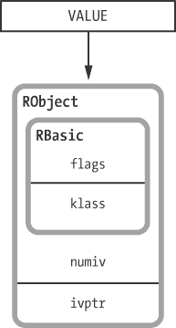

图 5-1. `RObject`结构

## 检查 klass 和 ivptr

为了理解 Ruby 如何在程序中使用`RObject`，我们将创建一个简单的 Ruby 类，并使用 IRB 检查该类的实例。例如，假设我有示例 5-1 所示的简单 Ruby 类。

示例 5-1. 一个简单的 Ruby 类

```
class Mathematician
  attr_accessor :first_name
  attr_accessor :last_name
end
```

Ruby 需要在`RObject`中保存类指针，因为每个对象都必须追踪用于创建它的类。当你创建一个类的实例时，Ruby 会在内部将该类的指针保存在`RObject`中，如示例 5-2 所示。

示例 5-2. 在 IRB 中创建一个对象实例

```
    $ **irb**
    > **euler = Mathematician.new**
  => #<Mathematician:0x007fbd738608c0>
```

通过在上显示类名`#<Mathematician`，Ruby 显示了`euler`对象的类指针值。随后的十六进制字符串实际上是该对象的`VALUE`指针。（这对于每个`Mathematician`实例都会有所不同。）

Ruby 还使用实例变量数组来跟踪你保存在对象中的值，正如 示例 5-3 中所示。

示例 5-3. 在 IRB 中检查实例变量

```
    > **euler.first_name = 'Leonhard'**
     => "Leonhard"
    > **euler.last_name  = 'Euler'**
     => "Euler"
    > **euler**
  => #<Mathematician:0x007fbd738608c0 @first_name="Leonhard", @last_name="Euler">
```

正如你所看到的，在 IRB 中，Ruby 还显示了 `euler` 的实例变量数组，见 。Ruby 需要在每个对象中保存这个值数组，因为每个对象实例可能对相同的实例变量有不同的值，正如 示例 5-4 中所示，见 。

示例 5-4. `Mathematician` 类的不同实例

```
    > **euclid = Mathematician.new**
    > **euclid.first_name = 'Euclid'**
    > **euclid**
  => #<Mathematician:0x007fabdb850690 @first_name="Euclid">
```

## 可视化同一类的两个实例

让我们更详细地了解一下 Ruby 的 C 结构。当你运行 图 5-2 中显示的 Ruby 代码时，Ruby 会创建一个 `RClass` 结构和两个 `RObject` 结构。

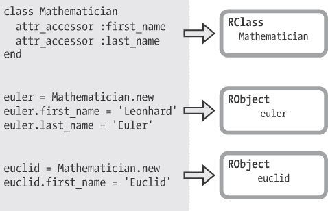

图 5-2. 创建同一类的两个实例

我将在下一节讨论 Ruby 如何通过 `RClass` 结构实现类。现在，让我们来看一下 图 5-3，该图展示了 Ruby 如何将 `Mathematician` 信息保存在两个 `RObject` 结构中。

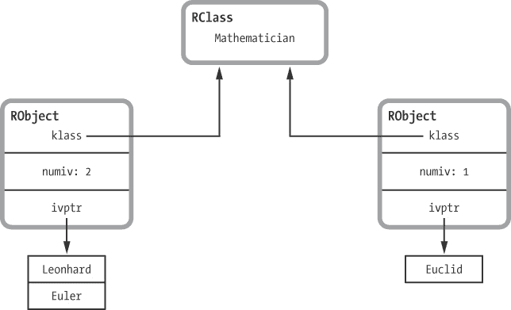

图 5-3. 可视化同一类的两个实例

正如你所看到的，每个 `klass` 值都指向 `Mathematician RClass` 结构，而每个 `RObject` 结构都有一个单独的实例变量数组。这两个数组都包含 `VALUE` 指针——这是 Ruby 用来引用 `RObject` 结构的相同指针。（注意，其中一个对象包含两个实例变量，而另一个仅包含一个。）

## 通用对象

现在你已经知道 Ruby 如何将自定义类（例如 `Mathematician` 类）保存在 `RObject` 结构中。但请记住，每个 Ruby 值——包括整数、字符串和符号等基本数据类型——都是一个对象。Ruby 源代码内部将这些内建类型称为“通用”类型。那 Ruby 是如何存储这些通用对象的呢？它们是否也使用 `RObject` 结构？

答案是否定的。在内部，Ruby 使用不同的 C 结构，而不是 `RObject`，来保存每种通用数据类型的值。例如，Ruby 将字符串值保存在 `RString` 结构中，将数组保存在 `RArray` 结构中，将正则表达式保存在 `RRegexp` 结构中，等等。Ruby 仅使用 `RObject` 来保存你创建的自定义对象类的实例以及 Ruby 内部创建的少数自定义对象类的实例。然而，所有这些不同的结构共享相同的 `RBasic` 信息，就像我们在 `RObject` 中看到的那样，如 图 5-4 所示。

由于 `RBasic` 结构包含类指针，因此每种通用数据类型也是一个对象。每个数据类型都是某个 Ruby 类的实例，正如 `RBasic` 中保存的类指针所指示的那样。

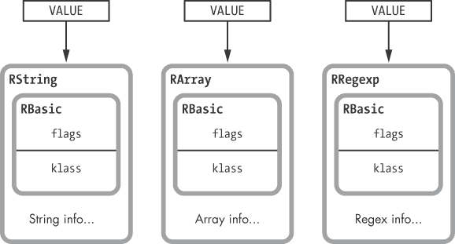

图 5-4。所有 Ruby 对象结构都使用 `RBasic` 结构。

## 简单的 Ruby 值根本不需要结构

作为性能优化，Ruby 不使用任何结构来保存小整数、符号以及其他一些简单的值，而是将它们直接保存在 `VALUE` 指针中，如 图 5-5 所示。


图 5-5。Ruby 将整数保存在 `VALUE` 指针中。

这些 `VALUE` 根本不是指针；它们是值本身。对于这些简单的数据类型，没有类指针。相反，Ruby 使用一系列位标志来记住类，这些位标志保存在 `VALUE` 的前几个位中。例如，所有小整数都设置了 `FIXNUM_FLAG` 位，如 图 5-6 所示。


图 5-6。`FIXNUM_FLAG` 表示这是 `Fixnum` 类的一个实例。

每当设置 `FIXNUM_FLAG` 时，Ruby 就知道这个 `VALUE` 实际上是一个小整数，是 `Fixnum` 类的实例，而不是指向值结构的指针。（类似的位标志指示该 `VALUE` 是否是符号，并且像 `nil`、`true` 和 `false` 这样的值也有各自的标志。）

通过使用 IRB，很容易看出整数、字符串和其他通用值都是对象，正如 示例 5-5 中所看到的那样。

示例 5-5. 检查一些通用值的类

```
$ **irb**
> "string".class
 => String
> **1.class**
 => Fixnum
> **:symbol.class**
 => Symbol
```

在这里，我们看到 Ruby 通过调用每个对象的 `class` 方法，保存类指针或等效的位标志。反过来，`class` 方法返回类指针，或者至少返回每个 `klass` 指针所指向的类名。

## 通用对象有实例变量吗？

让我们回到 Ruby 对象的定义：

> 每个 Ruby 对象是类指针和实例变量数组的结合。

那么，通用对象的实例变量呢？整数、字符串和其他通用数据值是否有实例变量？这看起来很奇怪，但如果整数和字符串是对象，那么这一定是真的！如果这是真的，Ruby 将这些值保存在什么地方呢，如果它不使用 `RObject` 结构的话？

使用 `instance_variables` 方法，如 示例 5-6 中所示，你可以看到每个这些基本值也可以包含一个实例变量数组，尽管这看起来很奇怪。

示例 5-6. 在 Ruby 字符串对象中保存实例变量

```
$ **irb**
> **str = "some string value"**
 => "some string value"
> **str.instance_variables**
 => []
> **str.instance_variable_set("@val1", "value one")**
 => "value one"
> **str.instance_variables**
 => [:@val1]
> **str.instance_variable_set("@val2", "value two")**
 => "value two"
> **str.instance_variables**
 => [:@val1, :@val2]
```

重复此练习，使用符号、数组或任何 Ruby 值，你会发现每个 Ruby 值都是一个对象，并且每个对象都包含一个类指针和一个实例变量数组。

阅读 RBasic 和 RObject C 结构定义

示例 5-7 显示了 `RBasic` 和 `RObject` C 结构的定义。（你可以在 *include/ruby/ruby.h* 头文件中找到这段代码。）

示例 5-7. `RBasic` 和 `RObject` C 结构的定义

```
    struct RBasic {
   VALUE flags;
   VALUE klass;
    };

    #define ROBJECT_EMBED_LEN_MAX 3
    struct RObject {
   struct RBasic basic;
      union {
        struct {
       long numiv;
       VALUE *ivptr;
       struct st_table *iv_index_tbl;
     } heap;
     VALUE ary[ROBJECT_EMBED_LEN_MAX];
      } as;
    };
```

在顶部，你看到 `RBasic` 的定义。这个定义包含两个值：`flags`  和 `klass` 。下面，你看到 `RObject` 的定义。注意，它包含了一个 `RBasic` 结构的副本，位于 。接下来，`union` 关键字包含一个名为 `heap` 的结构，位于 ，后面跟着一个名为 `ary` 的数组，位于 。

`heap` 结构位于 ，包含以下值：

+   首先，值 `numiv` 位于 ，它跟踪此对象中包含的实例变量的数量。

+   接下来，`ivptr` 位于 ，是指向包含此对象实例变量值的数组的指针。注意，这里并没有存储实例变量的名称或 ID；这里只存储了值。

+   `iv_index_tbl` 在  处指向一个哈希表，该哈希表将每个实例变量的名称或 ID 与其在 `ivptr` 数组中的位置进行映射。这个值实际上存储在该对象的类的 `RClass` 结构中；这个指针只是一个缓存或快捷方式，Ruby 用它来快速获取那个哈希表。（`st_table` 类型是指 Ruby 对哈希表的实现，我将在第七章中讨论。）

`RObject` 结构的最后一个成员，位于  处的 `ary`，由于顶部的 `union` 关键字，与所有先前的值共享相同的内存空间。通过这个 `ary` 值，Ruby 可以将所有实例变量直接保存在 `RObject` 结构中——如果它们足够容纳的话。这避免了调用 `malloc` 来分配额外的内存以存储实例变量值数组。（Ruby 还在 `RString`、`RArray`、`RStruct` 和 `RBignum` 结构中使用了类似的优化。）

## Ruby 为通用对象保存实例变量的位置在哪里？

内部来说，Ruby 使用一种技巧来保存通用对象的实例变量——也就是对于不使用 `RObject` 结构的对象。当你在通用对象中保存实例变量时，Ruby 会将其保存在一个特殊的哈希表中，称为 `generic_iv_tbl`。这个哈希表维护了通用对象与指向包含各自实例变量的其他哈希表的指针之间的映射。图 5-7 展示了在示例 5-6 中如何应用于 `str` 字符串的例子。

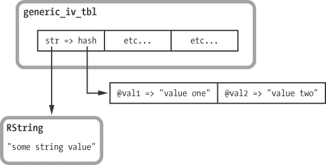

图 5-7. `generic_iv_tbl` 存储通用对象的实例变量。

# 实验 5-1：保存一个新实例变量需要多长时间？

为了了解 Ruby 如何在内部保存实例变量，让我们测量一下 Ruby 在一个对象中保存实例变量需要多长时间。为此，我将创建大量测试对象，如示例 5-8 所示。

示例 5-8. 使用 `Class.new` 创建测试对象

```
ITERATIONS = 100000
 GC.disable
 obj = ITERATIONS.times.map { Class.new.new }
```

在这里，我使用 `Class.new` 在  处为每个新对象创建一个独特的类，以确保它们都是独立的。我还在  处禁用了垃圾回收，以避免垃圾回收操作影响结果。然后，在 示例 5-9 中，我为每个对象添加实例变量。

示例 5-9. 向每个测试对象添加实例变量

```
Benchmark.bm do |bench|
  20.times do |count|
    bench.report("adding instance variable number #{count+1}") do
      ITERATIONS.times do |n|
        obj[n].instance_variable_set("@var#{count}", "value")
      end
    end
  end
end
```

示例 5-9 迭代了 20 次，每次将一个新的实例变量保存到每个对象中。图 5-8 显示了 Ruby 2.0 添加每个变量所需的时间：左侧的第一条柱状图是保存所有对象中第一个实例变量所需的时间，每个后续的柱状图则表示在每个对象中保存一个额外实例变量所需的时间。


图 5-8. 添加一个新的实例变量所需时间（以秒为单位 x 100,000）与实例变量数量的关系

图 5-8 展示了一个奇怪的模式。有时 Ruby 添加一个新的实例变量所需的时间更长。这是怎么回事呢？

这种行为的原因与 Ruby 存储实例变量的 `ivptr` 数组有关，如 图 5-9 所示。

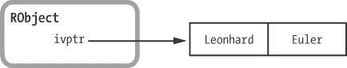

图 5-9. 一个对象中保存的两个实例变量

在 Ruby 1.8 中，这个数组是一个哈希表，包含了变量名（哈希键）和对应的值，该哈希表会自动扩展以容纳任意数量的元素。

Ruby 1.9 和 2.0 通过将值保存在一个简单的数组中稍微加快了速度。实例变量名则保存在对象的类中，因为它们对类的所有实例来说都是相同的。因此，Ruby 1.9 和 2.0 需要预先分配一个大数组来处理任意数量的实例变量，或者在保存更多变量时反复增大该数组的大小。

事实上，正如你在图 5-8 中看到的，Ruby 1.9 和 2.0 会反复增加数组的大小。例如，假设你在一个给定的对象中有七个实例变量，如图 5-10 所示。

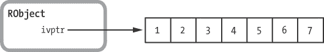

图 5-10. 一个对象中的七个实例变量

当你添加第八个变量时——在图 5-8 中的第 8 条——Ruby 1.9 和 2.0 会将数组大小增加三，以预期你很快会添加更多变量，如图 5-11 所示。

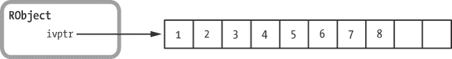

图 5-11. 添加第八个值分配了额外的空间。

分配更多的内存需要额外的时间，这就是为什么第 8 条比其他条更高的原因。现在，如果你再添加两个实例变量，Ruby 1.9 和 2.0 就不需要重新分配该数组的内存了，因为空间已经预留好了。这也解释了第 9 条和第 10 条时间更短的原因。

# RClass 结构体中有什么？

每个对象通过保存指向 `RClass` 结构的指针来记住自己的类。每个 `RClass` 结构包含什么信息？如果我们能看到 Ruby 类的内部结构，会看到什么呢？让我们构建一个关于 `RClass` 中必须存在的信息模型。这个模型将为我们提供 Ruby 类的技术定义，基于我们所知道的类的功能。


*两个对象，一个类*

每个 Ruby 开发者都知道如何编写一个类：你输入`class`关键字，指定新类的名称，然后编写类的方法。示例 5-10 展示了一个常见的示例。

示例 5-10. 我们在示例 5-1 中看到的相同的简单 Ruby 类

```
class Mathematician
  attr_accessor :first_name
  attr_accessor :last_name
end
```

`attr_accessor`是定义属性的 getter 和 setter 方法的简写。（`attr_accessor`定义的方法还会检查`nil`值）。示例 5-11 展示了定义相同 `Mathematician` 类的更冗长的方式。

示例 5-11. 没有使用`attr_accessor`编写的相同类

```
class Mathematician
  def first_name
    @first_name
  end
  def first_name=(value)
    @first_name = value
  end
  def last_name
    @last_name
  end
  def last_name=(value)
    @last_name = value
  end
end
```

看起来这个类——以及每个 Ruby 类——只是方法定义的集合。你可以通过向类中添加方法来为对象分配行为，当你在对象上调用方法时，Ruby 会在对象的类中查找该方法。这导致了我们对 Ruby 类的第一个定义：

> Ruby 类是方法定义的集合。

因此，`Mathematician` 的 `RClass` 结构体必须保存类中定义的所有方法的列表，见 图 5-12。

请注意，在 示例 5-11 中，我还创建了两个实例变量：`@first_name` 和 `@last_name`。我们之前看到 Ruby 如何在每个 `RObject` 结构中存储这些值，但你可能已经注意到，`RObject` 中存储的仅仅是这些变量的*值*，而不是它们的名字。（Ruby 1.8 会在 `RObject` 中存储名字。）Ruby 必须将属性名称存储在 `RClass` 中，这也是有道理的，因为这些名称对于每个 `Mathematician` 实例来说都是相同的。

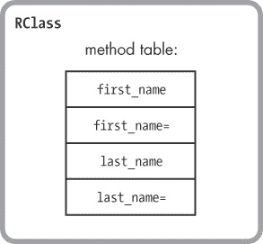

图 5-12. Ruby 类包含方法表。

让我们重新绘制 `RClass`，这次加入属性名称表，见 图 5-13。

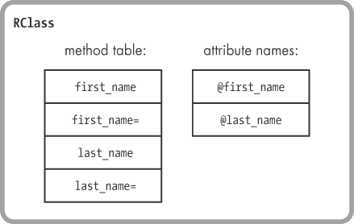

图 5-13. Ruby 类还包含属性名称表。

现在我们对 Ruby 类的定义如下：

> Ruby 类是方法定义的集合和属性名称的表。

在本章开始时，我提到过 Ruby 中的每个值都是对象。这对类也许同样适用。让我们通过 IRB 来证明这一点。

```
> **p Mathematician.class**
 => Class
```

如你所见，Ruby 类都是 `Class` 类的实例；因此，类也是对象。现在我们再次更新我们对 Ruby 类的定义：

> Ruby 类是一个 Ruby 对象，它还包含方法定义和属性名称。

因为 Ruby 类是对象，我们知道 `RClass` 结构体必须包含一个类指针和一个实例变量数组，这些值是我们知道每个 Ruby 对象都包含的，见 图 5-14。

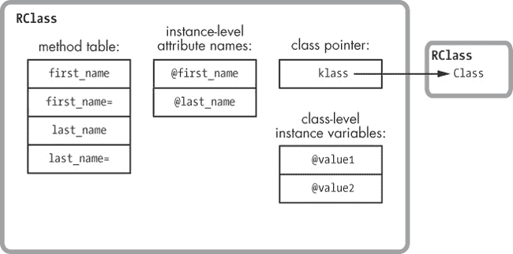

图 5-14. Ruby 类还包含类指针和实例变量。

正如你所看到的，我已经添加了指向 `Class` 类的指针，理论上这是每个 Ruby 类对象的类。然而，在实验 5-2：Ruby 如何保存类方法？中，我将展示这个图表实际上并不准确——`klass` 实际上指向的是别的东西！我还添加了实例变量的表格。

### 注意

*这些是类级别的实例变量。不要将它们与对象级别实例变量的属性名称表混淆。*

这越来越难以控制了！`RClass` 结构似乎比 `RObject` 结构复杂得多。但别担心——我们正在接近准确的 `RClass` 结构。接下来，我们需要考虑 Ruby 类中包含的另外两种重要信息。

## 继承

继承是面向对象编程的一个基本特性。Ruby 通过允许我们在创建类时可选地指定一个父类来实现单继承。如果我们没有指定父类，Ruby 会将 `Object` 类作为父类。例如，我们可以像这样使用一个父类重写 `Mathematician` 类：

```
class Mathematician < Person
--*snip*--
```

现在每个 `Mathematician` 的实例都将包含 `Person` 实例拥有的相同方法。在这个例子中，我们可能想把 `first_name` 和 `last_name` 访问器方法移到 `Person` 中。我们也可以把 `@first_name` 和 `@last_name` 属性移到 `Person` 类中。每个 `Mathematician` 的实例将包含这些方法和属性，即使我们已经把它们移到了 `Person` 类。

`Mathematician` 类必须包含对 `Person` 类（它的父类）的引用，以便 Ruby 能够找到父类中定义的任何方法或属性。

让我们再次更新定义，假设 Ruby 使用类似 `klass` 的另一个指针来跟踪父类：

> Ruby 类是一个 Ruby 对象，它还包含方法定义、属性名称和一个指向父类的指针。

然后我们重新绘制 `RClass` 结构，以包括新的父类指针，如图 5-15 所示。

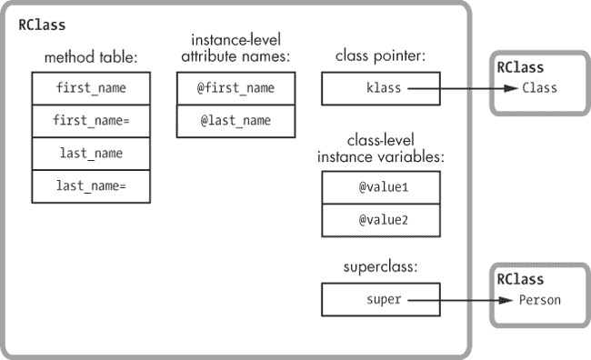

图 5-15. Ruby 类还包含一个父类指针。

此时，理解 `klass` 指针和 `super` 指针之间的区别至关重要。`klass` 指针表示 Ruby 类对象是哪个类的实例。这个指针总是指向 `Class` 类：

```
> **p Mathematician.class**
 => Class
```

Ruby 使用 `klass` 指针来查找 `Mathematician` 类对象的方法，例如每个 Ruby 类都实现的 `new` 方法。然而，`super` 指针记录的是类的父类：

```
> **p Mathematician.superclass**
 => Person
```

Ruby 使用`super`指针帮助查找每个`Mathematician`实例中包含的方法，比如`first_name=` 或 `last_name`。正如我们接下来将看到的，Ruby 在获取或设置类变量时也会使用`super`指针。

## 类实例变量与类变量

Ruby 语法中一个让人困惑的概念是*类变量*。你可能会认为这些只是类的实例变量（来自图 5-14 的类级别实例变量），但类实例变量和类变量是明显不同的。

要创建一个类实例变量，你只需使用`@`符号创建一个实例变量，但它是在类的上下文中，而非对象中。例如，示例 5-12 展示了我们如何使用`Mathematician`的实例变量来表示该类对应的数学分支。我们在  创建了`@type`实例变量。

示例 5-12. 创建类级别实例变量

```
    class Mathematician
   @type = "General"
      def self.type
        @type
      end
    end

    puts Mathematician.type
     => General
```

相比之下，要创建一个类变量，你需要使用`@@`符号。示例 5-13 展示了相同的示例，其中创建了类变量`@@type` 。

示例 5-13. 创建类变量

```
    class Mathematician
   @@type = "General"
      def self.type
        @@type
      end
    end

    puts Mathematician.type
     => General
```

这有什么不同吗？当你创建一个类变量时，Ruby 会为你创建一个单一的值，供该类及其任何子类使用。另一方面，使用类*实例*变量会导致 Ruby 为每个类或子类创建一个单独的值。

让我们回顾一下示例 5-14，看看 Ruby 如何不同地处理这两种类型的变量。首先，我在`Mathematician`类中定义了一个类实例变量`@type`，并将其值设置为字符串`General`。接着，我创建了一个名为`Statistician`的类，它是`Mathematician`的子类，并将`@type`的值改为字符串`Statistics`。

示例 5-14. 每个类和子类都有自己的实例变量。

```
    class Mathematician
      @type = "General"
      def self.type
        @type
      end
    end

    class Statistician < Mathematician
      @type = "Statistics"
    end

    puts Statistician.type
  => Statistics
    puts Mathematician.type
  => General
```

注意到`Statistician`中的`@type`值（在 ）与`Mathematician`中的`@type`值（在 ）不同。每个类都有自己独立的`@type`副本。

然而，如果我改为使用类变量，Ruby 会在`Mathematician`和`Statistician`之间共享该值，正如在示例 5-15 中演示的那样。

示例 5-15. Ruby 在类和所有子类之间共享类变量。

```
    class Mathematician
      @@type = "General"
      def self.type
        @@type
      end
    end

    class Statistician < Mathematician
      @@type = "Statistics"
    end

    puts Statistician.type
  => Statistics
    puts Mathematician.type
  => Statistics
```

在这里，Ruby 显示了 `Statistician` 中的 `@@type` 与在 `Mathematician` 中的相同值，分别位于  和 。

然而，内部实现上，Ruby 实际上将类变量和类实例变量保存在 `RClass` 结构中的同一表中。图 5-16 显示了如果你创建了 `Mathematician` 类的 `@type` 和 `@@type` 值，它们是如何被保存的。额外的 `@` 符号允许 Ruby 区分这两种变量类型。

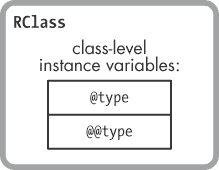

图 5-16. Ruby 将类变量和类实例变量保存在同一个表中。

## 获取和设置类变量

这是真的：Ruby 将类变量和类实例变量保存在同一个表中。然而，Ruby 获取或设置这两种类型的变量的方式却是完全不同的。

当你获取或设置类实例变量时，Ruby 会在对应目标类的 `RClass` 结构中查找该变量，然后保存或获取该值。图 5-17 显示了 Ruby 如何从 示例 5-14 中保存类实例变量。

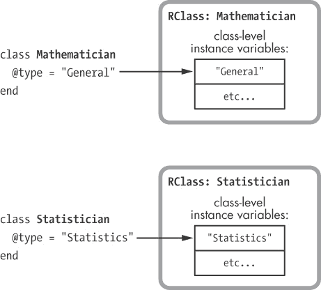

图 5-17. Ruby 将类实例变量保存在目标类的 `RClass` 结构中。

在图的顶部，你可以看到一行代码，它将类实例变量保存在 `Mathematician` 中。下面是另一行类似的代码，它将一个值保存在 `Statistician` 中。在这两种情况下，Ruby 都会将类实例变量保存在当前类的 `RClass` 结构中。

Ruby 对类变量使用了更复杂的算法。为了实现我们在 示例 5-15 中看到的行为，Ruby 需要搜索所有父类，以检查它们是否定义了相同的类变量。图 5-18 显示了一个示例。

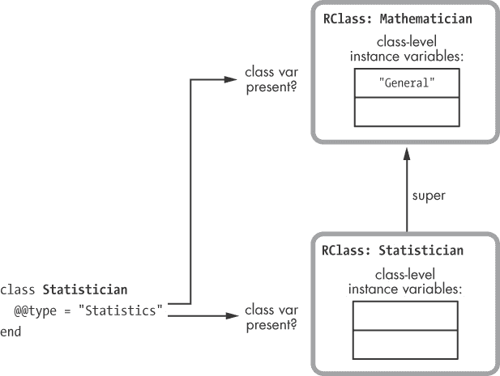

图 5-18。 在保存之前，Ruby 会检查类变量是否存在于目标类或其任何父类中。

当你保存一个类变量时，Ruby 会在目标类及其所有父类中查找现有的变量。它将使用在最高父类中找到的副本。在 图 5-18 中，你可以看到 Ruby 在保存 `Statistician` 类中的 `@@type` 类变量时会检查 `Statistician` 和 `Mathematician` 类。因为我已经在 `Mathematician` 类中保存了相同的类变量（示例 5-15），所以 Ruby 会使用它并用新值覆盖它，如 图 5-19 所示。

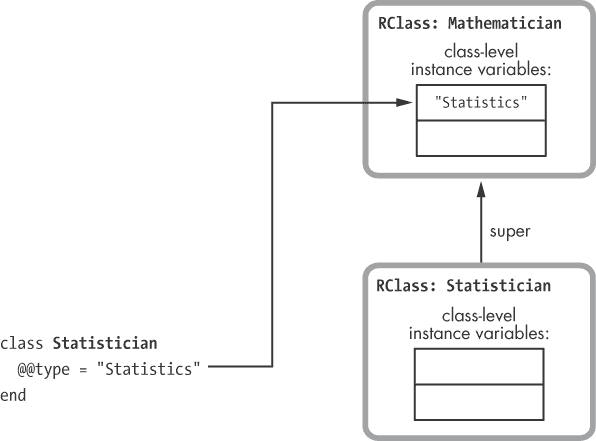

图 5-19。 Ruby 使用在最高父类中找到的类变量副本。

## 常量

我们还有 Ruby 类的一个特性要介绍：*常量*。正如你所知道的，Ruby 允许你在类内部定义常量值，像这样：

```
class Mathematician < Person
  AREA_OF_EXPERTISE = "Mathematics"
  --*snip*--
```

常量值必须以大写字母开头，它们在当前类的作用域内有效。（有趣的是，Ruby 允许你更改常量值，但当你这么做时会显示一个警告。）让我们在 `RClass` 结构中添加一个常量表，因为 Ruby 必须将这些值保存在每个类中，如 图 5-20 所示。

现在我们可以写出 Ruby 类的完整技术定义：

> Ruby 类是一个 Ruby 对象，它还包含方法定义、属性名称、父类指针和常量表。

当然，这不像我们为 Ruby 对象定义的简洁，但每个 Ruby 类包含的信息远多于每个 Ruby 对象。显然，Ruby 类对语言来说是至关重要的。

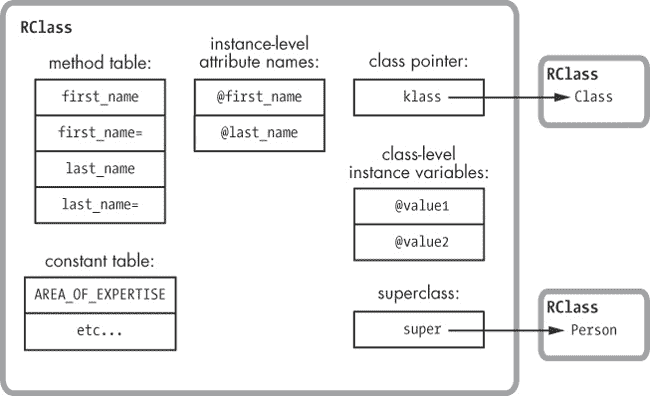

图 5-20。 Ruby 类还包含一个常量表。

## 实际的 RClass 结构

在为 `RClass` 构建了一个概念模型之后，让我们看看 Ruby 实际上用来表示类的结构，如 图 5-21 所示。

如你所见，Ruby 使用两个独立的结构来表示每个类：`RClass` 和 `rb_classext_struct`。但是这两个结构作为一个大的结构共同作用，因为每个 `RClass` 都包含一个指向对应 `rb_classext_struct` 的指针（`ptr`）。你可能猜测 Ruby 核心团队决定使用两种不同的结构，是因为有很多不同的值需要保存，但实际上他们可能创建了 `rb_classext_struct` 来保存他们不希望在公共 Ruby C 扩展 API 中暴露的内部值。

和 `RObject` 一样，`RClass` 也有一个 `VALUE` 指针（如 图 5-21 中所示左侧）。Ruby 总是通过这些 `VALUE` 指针访问类。图的右侧显示了字段的技术名称：

+   `flags` 和 `klass` 是每个 Ruby 值都包含的相同 `RBasic` 值。

+   `m_tbl` 是方法表，一个哈希表，其键是每个方法的名称或 ID，值是指向每个方法定义的指针，包括已编译的 YARV 指令。

+   `iv_index_tbl` 是属性名称表，一个哈希表，将每个实例变量名称映射到每个 `RObject` 实例变量数组中该属性值的索引。

+   `super` 是指向该类的父类的 `RClass` 结构体的指针。

    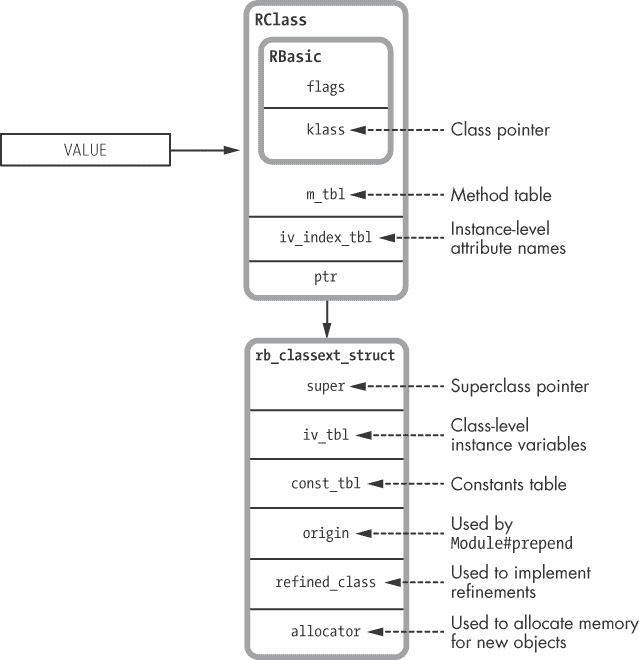

    图 5-21. Ruby 实际上是如何表示一个类的

+   `iv_tbl` 包含类级别的实例变量和类变量，包括它们的名称和值。

+   `const_tbl` 是一个哈希表，包含在此类作用域中定义的所有常量（名称和值）。可以看到 Ruby 以相同的方式实现了 `iv_tbl` 和 `const_tbl`：类级别的实例变量和常量几乎是一样的。

+   Ruby 使用 `origin` 来实现 `Module#prepend` 特性。我将在 第六章中讨论 `prepend` 的作用以及 Ruby 是如何实现它的。

+   Ruby 使用 `refined_class` 指针来实现新的实验性 refinements 特性，稍后我会在 第九章中进一步讨论。

+   最后，Ruby 内部使用 `allocator` 来分配该类新实例的内存。

阅读 RClass C 结构体定义

现在快速查看实际的 `RClass` 结构体定义，如 示例 5-16 所示。

示例 5-16. `RClass` C 结构体的定义

```
typedef struct rb_classext_struct rb_classext_t;
struct RClass {
    struct RBasic basic;
    rb_classext_t *ptr;
    struct st_table *m_tbl;
    struct st_table *iv_index_tbl;
};
```

就像我们在 示例 5-7 中看到的 `RObject` 定义一样，这个结构定义——包括 图 5-21 中显示的所有值——可以在 *`include/ruby/ruby.h`* 文件中找到。

另一方面，`rb_classext_struct` 结构定义可以在 *internal.h* C 头文件中找到，如 示例 5-17 所示。

示例 5-17. `rb_classext_struct` C 结构的定义

```
struct rb_classext_struct {
    VALUE super;
    struct st_table *iv_tbl;
    struct st_table *const_tbl;
    VALUE origin;
    VALUE refined_class;
    rb_alloc_func_t allocator;
};
```

再次，你可以看到来自 图 5-21 的值。注意，`st_table` C 类型在 示例 5-16 和 示例 5-17 中出现了四次；这就是 Ruby 的哈希表数据结构。内部上，Ruby 使用哈希表保存每个类的大部分信息：属性名称表、方法表、类级实例变量表和常量表。

# 实验 5-2：Ruby 如何保存类方法？

我们已经看到每个 `RClass` 结构如何保存某个类中定义的所有方法。在这个例子中，Ruby 使用方法表将 `first_name` 方法的信息存储在 `Mathematician` 的 `RClass` 结构中：

```
class Mathematician
  def first_name
    @first_name
  end
end
```

那么类方法呢？在 Ruby 中，通常使用直接将方法保存在类中，语法如 示例 5-18 所示。

示例 5-18. 使用 `def self` 定义类方法

```
class Mathematician
  def self.class_method
    puts "This is a class method."
  end
end
```

或者，你可以使用 示例 5-19 中显示的语法。

示例 5-19. 使用 `class << self` 定义类方法

```
class Mathematician
  class << self
    def class_method
      puts "This is a class method."
    end
  end
end
```

它们是保存在与每个类的普通方法一起的 `RClass` 结构中吗，可能使用一个标志来指示它们是类方法而不是普通方法？还是它们保存在其他地方？让我们来看看！

很容易看出类方法**不是**保存在哪里。它们显然没有与普通方法一起保存在 `RClass` 方法表中，因为 `Mathematician` 的实例无法调用它们，正如下例所示：

```
> **obj = Mathematician.new**
> **obj.class_method**
 => undefined method `class_method' for
#< Mathematician:0x007fdd8384d1c8 (NoMethodError)
```

现在，记住 `Mathematician` 也是一个 Ruby 对象，请回顾以下定义：

> 一个 Ruby 类是一个 Ruby 对象，它还包含方法定义、属性名称、父类指针和常量表。

我们假设 Ruby 应该像保存任何对象的方法一样保存 `Mathematician` 的方法：保存在该对象类的方法表中。换句话说，Ruby 应该通过 `klass` 指针获取 `Mathematician` 的类，并将方法保存在该 `RClass` 结构体的方法表中，如图 5-22 所示。

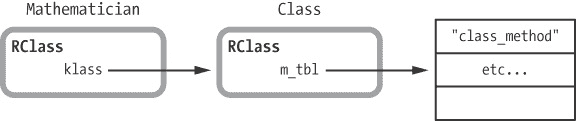

图 5-22. Ruby 是否应将类方法保存在类的方法表中？

但是 Ruby 实际上并没有这样做，你可以通过创建另一个类并尝试调用新方法来发现这一点：

```
> **class AnotherClass; end**
> **AnotherClass.class_method**
 => undefined method `class_method' for AnotherClass:Class (NoMethodError)
```

如果 Ruby 将类方法添加到 `Class` 类的方法表中，那么你应用程序中的所有类都会有这个方法。显然，这不是我们编写类方法时的意图，幸运的是，Ruby 并没有这样实现类方法。

那么，类方法去哪了呢？提示是使用方法 `ObjectSpace.count_objects`，如示例 5-20 中所示：

`` 示例 5-20. 使用 `ObjectSpace.count_objects` 与 `:T_CLASS` ``

```
 $ **irb**
 > **ObjectSpace.count_objects[:T_CLASS]**
  => 859
    > class Mathematician; end
     => nil
    > **ObjectSpace.count_objects[:T_CLASS]**
  => 861
```

`` `ObjectSpace.count_objects` 在  返回给定类型的对象数量。在这个测试中，我传递了 `:T_CLASS` 符号来获取在我的 IRB 会话中存在的类对象数量。在我创建 `Mathematician` 之前，存在 859 个类，在  处显示。声明 `Mathematician` 后，存在 861 个类，在  处显示——多了两个。这很奇怪，我只声明了一个新类，但 Ruby 实际上创建了两个！第二个类是干什么的？它在哪里？``

``事实证明，每当你创建一个新类时，Ruby 内部会创建两个类！第一个类就是你创建的新类：Ruby 会创建一个新的 `RClass` 结构体来表示你的类，如上所述。但在内部，Ruby 还会创建第二个隐藏的类，称为 *元类*。为什么？为了保存你以后可能为新类创建的任何类方法。实际上，Ruby 会将元类设置为你新类的类：它将你新 `RClass` 结构体的 `klass` 指针指向元类。``

``没有编写 C 代码，无法轻松查看元类或 `klass` 指针的值，但你可以像这样将元类作为 Ruby 对象获取：``

```
class Mathematician
end

p Mathematician
 => Mathematician

p Mathematician.singleton_class
 => #<Class:Mathematician>
```

``第一个打印语句显示对象的类，而第二个显示对象的元类。奇怪的 `#<Class:Mathematician>` 语法表示第二个类是 `Mathematician` 的元类。这是 Ruby 在我声明 `Mathematician` 类时自动为我创建的第二个 `RClass` 结构。而这个第二个 `RClass` 结构是 Ruby 保存我的类方法的地方，如图 5-23 所示。``

``

`图 5-23。一个对象，它的类和元类`

``如果我们现在显示元类的方法，我们将看到所有 `Class` 类的方法，以及 `Mathematician` 的新类方法：``

```
p obj.singleton_class.methods
 => [ ... :class_method, ...  ]
```

# `总结`

``在本章中，我们已经看到 Ruby 如何在内部表示对象和类：Ruby 使用 `RObject` 结构来表示你在代码中定义的任何自定义类的实例，以及 Ruby 自身预定义的一些类的实例。`RObject` 结构非常简单，仅包含指向对象类的指针和一个实例变量值的表格，并且还包含变量的计数。其结构的简单性使我们能够给出 Ruby 对象的非常简单的定义：``

> `每个 Ruby 对象都是类指针和实例变量数组的组合。`

`这个定义非常强大且有用，因为 Ruby 中的一切都是对象：无论你在 Ruby 程序中使用什么值，记住它都是一个对象，因此它将具有类指针和实例变量。`

``我们还看到 Ruby 使用特殊的 C 结构来表示许多常用的内置 Ruby 类的实例，这些类被称为“通用”对象。例如，Ruby 使用 `RString` 结构来表示 `String` 类的实例，`RArray` 用于表示 `Array` 类的实例，或者 `RRegexp` 用于表示 `Regexp` 类的实例。虽然这些结构不同，但 Ruby 同样为每个这些通用对象保存类指针和实例变量数组。最后，我们看到 Ruby 会将一些简单的值（如小整数和符号）保存，而完全不使用 C 结构。Ruby 将这些值直接保存在 `VALUE` 指针中，而该指针通常指向保存值的结构。``

``虽然 Ruby 对象很简单，但我们在本章中学到，Ruby 类并没有那么简单。`RClass` 结构与 `rb_classext_struct` 结构一起工作，保存了大量的信息。学习这一点迫使我们为 Ruby 类写出一个更复杂的定义：``

> `Ruby 类是一个 Ruby 对象，它还包含方法定义、属性名称、父类指针和常量表。`

``通过查看 `RClass` 和 `rb_classext_struct`，我们发现 Ruby 类也是 Ruby 对象，因此它们也包含实例变量和类指针。我们研究了类的实例变量与类变量之间的区别，并了解到 Ruby 将这两种变量类型保存在同一个哈希表中。我们还发现类包含一系列哈希表，用于存储其方法、对象级实例变量的名称以及类中定义的常量。最后，我们看到了每个 Ruby 类如何通过 `super` 指针记录其父类。``
